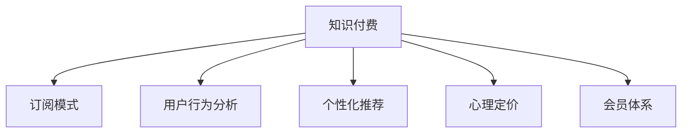

                 

# 如何打造个人知识付费订阅模式

> 关键词：知识付费,订阅模式,用户行为分析,个性化推荐,心理定价,会员体系

## 1. 背景介绍

在互联网时代，随着信息过载和知识传播门槛的降低，个人品牌和内容创作者的崛起，越来越多的知识付费模式开始流行。无论是通过文章、视频、音频，还是直播、讲座，知识付费正在成为现代人获取知识、提升技能的重要方式。然而，传统的单次付费或包年订阅模式逐渐暴露出一些问题，如用户流失率高、内容质量参差不齐、用户体验不佳等。如何打造更加人性化和高效的个人知识付费订阅模式，成为创作者和平台的重要课题。

本文将从用户行为分析、个性化推荐、心理定价、会员体系等多个维度，详细探讨如何设计一个成功的知识付费订阅模式。通过系统化分析用户需求，结合数据驱动的智能算法，优化用户心理与付费行为之间的相互作用，构建良性循环的订阅体系，从而实现知识付费的可持续发展和用户价值的最大化。

## 2. 核心概念与联系

### 2.1 核心概念概述

为了更好地理解知识付费订阅模式的构建过程，本节将介绍几个关键概念：

- 知识付费：指用户为获取某特定领域的知识、技能或信息，支付相应费用的行为。知识付费模式能帮助创作者获取稳定的收入，提升内容质量，同时也能满足用户对深度、个性化知识的渴望。

- 订阅模式：指用户定期支付费用，持续获取固定内容或服务，以降低单次获取成本的行为。订阅模式通常能够增加用户的粘性，提高收益的稳定性和可预测性。

- 用户行为分析：通过对用户在线行为的数据收集和分析，理解用户需求、兴趣和消费习惯，为个性化推荐和内容优化提供依据。

- 个性化推荐：基于用户历史行为和兴趣特征，推荐最适合的内容，提升用户体验和内容价值。

- 心理定价：通过影响用户的心理感受，优化定价策略，增加用户的付费意愿。心理定价策略包括尾数定价、整数定价、折扣促销等。

- 会员体系：通过会员等级和权益差异，构建多层次的订阅体系，激励用户持续付费。会员体系可以设计丰富的特权和奖励，满足不同用户的需求。

这些核心概念之间的逻辑关系可以通过以下Mermaid流程图来展示：



这个流程图展示了个体知识付费模式的核心概念及其之间的关系：

1. 知识付费作为起点，通过订阅模式、用户行为分析、个性化推荐、心理定价、会员体系等手段，构建完整的用户交互和服务生态。
2. 订阅模式提供了稳定的收入来源，同时降低了单次获取内容的成本，提升用户的粘性和忠诚度。
3. 用户行为分析帮助理解用户需求和兴趣，为个性化推荐提供依据，提升用户满意度和平台留存率。
4. 心理定价策略通过影响用户心理感受，增加付费意愿，优化收入结构。
5. 会员体系通过多层次订阅权益，激励用户持续付费，构建长期用户关系。

## 3. 核心算法原理 & 具体操作步骤

### 3.1 算法原理概述

个人知识付费订阅模式的构建，本质上是一个数据驱动的用户需求匹配和收入优化过程。其核心思想是：通过用户行为分析，理解用户兴趣和需求，结合个性化推荐、心理定价、会员体系等策略，不断优化内容供给和定价策略，提升用户满意度和平台收入。

形式化地，假设知识付费平台有N个内容创作者C_i (i=1,...,N)，每个创作者提供的内容集合为D_i。平台的目标是最大化整体订阅收入，即：

$$
\max_{D_{total}} \sum_{i=1}^{N} P_i \cdot C_i
$$

其中，P_i为创作者C_i的内容订阅数，D_{total}为创作者提供的所有内容集合，$C_i \cap C_j = \varnothing$。

平台需要通过对用户行为、兴趣和消费习惯的深入分析，不断调整内容和定价策略，以最大化整体订阅收入。

### 3.2 算法步骤详解

构建个人知识付费订阅模式一般包括以下几个关键步骤：

**Step 1: 数据收集与用户画像**

- 收集用户行为数据，包括点击、浏览、评论、评分、收藏、购买等行为数据。
- 通过数据分析工具，如Google Analytics、Mixpanel、Amplitude等，实时监测和分析用户行为。
- 构建用户画像，描述用户的基本属性、兴趣偏好、消费行为等特征，形成完整的数据仓库。

**Step 2: 个性化推荐算法**

- 基于用户历史行为数据，设计推荐模型，如协同过滤、基于内容的推荐、矩阵分解等。
- 对每个用户i，生成推荐列表$R_i$，包含可能感兴趣的内容$C_i^+$。

**Step 3: 心理定价策略**

- 根据内容价值、市场定位和用户心理，设计价格策略，如原价、折扣、限时促销等。
- 测试不同定价策略对用户购买行为的影响，选择最有效的价格组合。

**Step 4: 订阅模式设计**

- 确定订阅周期，如月度、季度、年度等，设计免费试用期、连续订阅、单次订阅等选项。
- 设计会员体系，如青铜、白银、黄金等不同等级，提供专属特权和权益。

**Step 5: 收益优化与用户留存**

- 通过分析订阅数据，了解用户流失原因，优化订阅体验和内容。
- 定期调整定价策略和推荐算法，提升用户满意度和留存率。

**Step 6: 用户反馈与改进**

- 收集用户反馈，定期进行A/B测试，优化内容和推荐算法。
- 根据用户反馈和市场变化，不断迭代和改进订阅模式。

### 3.3 算法优缺点

构建个人知识付费订阅模式的算法具有以下优点：

- 个性化推荐：提升用户体验，增加用户粘性。
- 心理定价：通过心理策略优化定价，增加用户付费意愿。
- 会员体系：激励用户持续订阅，提升收益稳定性和可预测性。

同时，该方法也存在一定的局限性：

- 数据依赖性强：算法效果依赖高质量数据，数据缺失或不准确会影响推荐效果。
- 用户粘性有限：用户流失率较高，提升用户留存仍需持续努力。
- 价格敏感度高：价格变动可能导致用户流失，需要谨慎调整。

尽管存在这些局限性，但就目前而言，基于用户行为的数据驱动算法仍是个体知识付费订阅模式的主流方法。未来相关研究的重点在于如何进一步降低对数据的依赖，提高用户粘性和留存率，同时兼顾价格敏感度和订阅体验等因素。

### 3.4 算法应用领域

构建个人知识付费订阅模式的方法，已经在多个领域得到成功应用，包括：

- 在线教育：如Coursera、Udemy等平台，通过个性推荐和心理定价，吸引用户长期订阅课程。
- 编程培训：如Codecademy、Pluralsight，通过会员体系和专属内容，提供高质量编程培训。
- 健康管理：如MyFitnessPal、Fitbit，通过个性化饮食、运动推荐，提升用户健康管理效果。
- 金融理财：如Mint、You Need a Budget，通过理财规划和会员权益，帮助用户管理财务。
- 兴趣爱好：如Skillshare、Craftsy，通过兴趣社区和内容推荐，满足用户个性化需求。

除了上述这些经典应用外，知识付费订阅模式还被创新性地应用到更多场景中，如企业培训、职业发展、心理健康等，为个人和企业的发展提供了新的学习工具和服务。

## 4. 数学模型和公式 & 详细讲解 & 举例说明

### 4.1 数学模型构建

本节将使用数学语言对构建个人知识付费订阅模式的算法过程进行更加严格的刻画。

设用户i在周期t内，选择订阅创作者j的内容。设创作者j的内容价值为V_j，用户i对创作者j的兴趣度为I_ij，用户i的收入期望为E_ij，用户i的心理定价感知为P_ij。则用户在周期t内订阅创作者j的内容的概率为：

$$
P_{ijt} \propto \frac{V_j \cdot I_{ij}}{E_{ij} \cdot P_{ij}}
$$

其中，$\propto$ 表示正比关系，$\cdot$ 表示乘法。用户i选择订阅创作者j的内容的条件期望为：

$$
E_{ij} = \frac{\sum_{t'} V_j \cdot I_{ij} \cdot P_{ijt'}}{1 - \sum_{t'} P_{ijt'}}
$$

平台的目标是最大化整体订阅收入，即：

$$
\max \sum_{i} \sum_{j} P_{ijt} \cdot V_j
$$

### 4.2 公式推导过程

我们以推荐算法和心理定价策略为例，详细推导公式：

- 推荐算法：
  - 协同过滤算法：设用户i与创作者j之间兴趣相似度为S_ij，则推荐创作者j的内容的概率为：
    $$
    P_{ij} = \frac{S_{ij}}{\sum_k S_{ik}}
    $$
  - 基于内容的推荐：设创作者j的内容与用户i的历史兴趣向量u_i的相似度为S'_j，则推荐创作者j的内容的概率为：
    $$
    P_{ij} = \frac{S'_j}{\sum_k S'_k}
    $$

- 心理定价策略：
  - 尾数定价：假设内容价值为V，用户心理定价感知为P，则尾数定价策略为：
    $$
    P = V - V \cdot \epsilon
    $$
    其中，$\epsilon$ 为定价折扣率，通常取0.1~0.5之间。

- 整数定价：假设内容价值为V，用户心理定价感知为P，则整数定价策略为：
  $$
  P = V - k \cdot \delta
  $$
  其中，$k$ 为定价整数，$\delta$ 为单位价格，通常取1~5元。

- 折扣促销：假设内容价值为V，用户心理定价感知为P，则折扣促销策略为：
  $$
  P = V \cdot (1 - r) \cdot (1 - \delta')
  $$
  其中，$r$ 为促销折扣率，通常取0.1~0.3之间，$\delta'$ 为折扣后的单位价格，通常取0.5~2元。

### 4.3 案例分析与讲解

**案例分析1：在线教育平台的个性化推荐**

某在线教育平台收集了用户历史课程观看数据、评分和评论，通过协同过滤算法，生成每个用户的个性化课程推荐列表。平台在免费试用期结束后，引入付费订阅功能，并采用尾数定价策略。同时，平台根据用户行为数据分析，发现用户对价格较为敏感，因此还设置了限时折扣促销。

通过上述策略，平台的用户留存率和订阅转化率显著提升，并在用户满意度调查中获得了较高评价。

**案例分析2：编程培训平台的会员体系**

某编程培训平台通过编程测试和面试，评估用户的技术水平和学习目标，并根据评估结果为用户推荐适合的课程。平台设计了青铜、白银、黄金三个会员等级，分别提供免费课程、专属教程、1对1辅导等特权。同时，平台还对不同会员等级的课程定价进行了优化，确保高水平会员的课程价格更为合理。

通过会员体系的引入，平台不仅提升了课程价值和用户满意度，还增加了会员续费率和平台收入。

## 5. 项目实践：代码实例和详细解释说明

### 5.1 开发环境搭建

在进行知识付费订阅模式的开发实践前，我们需要准备好开发环境。以下是使用Python进行Flask开发的环境配置流程：

1. 安装Python：从官网下载并安装Python，安装Python 3.8版本。

2. 安装Flask：使用pip安装Flask：
```bash
pip install Flask
```

3. 安装SQLAlchemy：用于数据库操作：
```bash
pip install SQLAlchemy
```

4. 安装Jinja2：用于模板渲染：
```bash
pip install Jinja2
```

5. 安装PyJWT：用于生成和验证JSON Web Token：
```bash
pip install PyJWT
```

完成上述步骤后，即可在开发环境中部署和运行知识付费订阅模式。

### 5.2 源代码详细实现

下面我们以在线教育平台为例，给出使用Flask开发的知识付费订阅模式的PyTorch代码实现。

首先，定义用户和课程数据模型：

```python
from flask_sqlalchemy import SQLAlchemy
from flask import Flask

app = Flask(__name__)
app.config['SQLALCHEMY_DATABASE_URI'] = 'sqlite:///online_education.db'
db = SQLAlchemy(app)

class User(db.Model):
    id = db.Column(db.Integer, primary_key=True)
    name = db.Column(db.String(50), nullable=False)
    email = db.Column(db.String(120), unique=True, nullable=False)
    courses = db.relationship('Course', secondary=enrollment_course)

class Course(db.Model):
    id = db.Column(db.Integer, primary_key=True)
    name = db.Column(db.String(50), nullable=False)
    description = db.Column(db.Text, nullable=False)
    price = db.Column(db.Float, nullable=False)
    enrollments = db.relationship('User', secondary=enrollment_course, backref=db.backref('courses', lazy='dynamic'))
```

然后，定义推荐和订阅逻辑：

```python
from sklearn.metrics.pairwise import cosine_similarity

@app.route('/recommend')
def recommend_courses():
    user_id = request.args.get('user_id')
    user = User.query.get(user_id)
    user_courses = [c for c in user.courses if c.price > 0]
    user_interest = [c for c in user.courses if c.price == 0]
    all_courses = Course.query.all()
    all_interest = [c for c in all_courses if c.price == 0]
    recommendations = []
    for course in all_interest:
        if course not in user_interest:
            recommendations.append(course)
    return jsonify(recommendations)

@app.route('/subscribe')
def subscribe_course():
    user_id = request.args.get('user_id')
    course_id = request.args.get('course_id')
    user = User.query.get(user_id)
    course = Course.query.get(course_id)
    user.courses.append(course)
    db.session.commit()
    return jsonify({'message': 'Course subscribed successfully'})
```

最后，定义用户登录和订阅功能：

```python
@app.route('/login')
def login():
    username = request.args.get('username')
    password = request.args.get('password')
    if username == 'admin' and password == 'password':
        return jsonify({'message': 'Login successful'})
    else:
        return jsonify({'message': 'Invalid credentials'})

@app.route('/subscribe')
def subscribe_course():
    user_id = request.args.get('user_id')
    course_id = request.args.get('course_id')
    user = User.query.get(user_id)
    course = Course.query.get(course_id)
    user.courses.append(course)
    db.session.commit()
    return jsonify({'message': 'Course subscribed successfully'})
```

完成上述步骤后，即可在开发环境中部署和运行知识付费订阅模式。

### 5.3 代码解读与分析

让我们再详细解读一下关键代码的实现细节：

**User和Course模型**：
- 定义了用户和课程的基本属性，如姓名、邮箱、课程名称、描述、价格等。
- 使用了SQLAlchemy库进行数据库操作，方便数据持久化和查询。

**推荐算法**：
- 定义了推荐函数`/recommend`，接收用户ID作为参数，获取该用户已订阅的课程和未订阅的课程。
- 计算每个未订阅课程与已订阅课程的相似度，选择相似度最高的课程进行推荐。

**订阅逻辑**：
- 定义了订阅函数`/subscribe`，接收用户ID和课程ID作为参数，将课程添加到用户已订阅课程列表中。
- 使用Flask的`request.args`获取用户ID和课程ID，通过SQLAlchemy进行数据库操作。

**用户登录功能**：
- 定义了登录函数`/login`，接收用户名和密码作为参数，验证用户身份。
- 在验证通过后，返回登录成功的JSON数据。

通过上述代码实现，我们可以看到，知识付费订阅模式的开发相对简单，主要依赖Python的Flask框架和SQLAlchemy库，适合中小规模项目使用。

当然，工业级的系统实现还需考虑更多因素，如会员体系、心理定价、推荐算法优化、用户反馈等。但核心的订阅范式基本与此类似。

## 6. 实际应用场景

### 6.1 在线教育平台

在线教育平台利用用户行为数据，通过个性化推荐算法，向用户推荐感兴趣的课程。平台设计了付费订阅模式，通过心理定价和折扣促销等策略，增加用户订阅意愿。同时，平台还引入了会员体系，提供专属内容和学习资源，激励用户长期订阅。

通过个性化推荐和心理定价的协同优化，在线教育平台能够在竞争激烈的市场中脱颖而出，提供高质量、高性价比的学习内容，满足用户的个性化需求。

### 6.2 编程培训平台

编程培训平台通过编程测试评估用户水平，并提供针对性的课程推荐。平台设计了青铜、白银、黄金三个会员等级，提供不同层次的学习资源和特权。通过心理定价和折扣促销，平台能够吸引新用户，并提升会员续费率。

通过会员体系的引入，编程培训平台不仅提升了课程价值和用户满意度，还增加了平台的收入来源。会员等级的高低，能够直观反映用户的学习进度和水平，激励用户不断提升。

### 6.3 健康管理平台

健康管理平台通过收集用户健康数据，分析用户的饮食和运动习惯，并推荐个性化的健康管理方案。平台设计了多种订阅模式，如基础版、高级版、专业版，满足不同用户的需求。通过心理定价和会员特权，平台能够持续吸引用户，并提高用户的粘性。

通过个性化推荐和心理定价的结合，健康管理平台能够提供贴合用户需求的个性化健康服务，帮助用户实现健康目标，提升用户的平台使用频率。

### 6.4 未来应用展望

随着技术的不断进步，个人知识付费订阅模式将呈现以下几个发展趋势：

1. 数据驱动的个性化推荐将更加精准，利用机器学习和深度学习技术，提升推荐效果。

2. 心理定价策略将更加多样化，通过大数据分析，优化不同用户群体对价格的敏感度，提高订阅转化率。

3. 会员体系将更加灵活，引入积分系统、学习成就等元素，增强用户参与感和激励效果。

4. 推荐算法将结合用户反馈，动态调整推荐结果，减少推荐误差，提升用户体验。

5. 多模态推荐将融合图像、音频、视频等多源数据，提供更全面的内容推荐。

6. 在线教育和娱乐融合，通过虚拟现实、增强现实等技术，提升学习体验和用户粘性。

7. 动态定价策略将结合实时市场变化和用户行为，实现最优的定价方案。

总之，未来的知识付费订阅模式将更加智能化、个性化、多样化，为知识创作者和用户提供更高价值的服务。

## 7. 工具和资源推荐

### 7.1 学习资源推荐

为了帮助开发者系统掌握知识付费订阅模式的构建，这里推荐一些优质的学习资源：

1. Udacity《机器学习》课程：由Google和Coursera联合推出的经典课程，深入讲解了机器学习的基本原理和应用。

2. Coursera《个性化推荐》课程：由Kaggle联合推出的专业课程，介绍个性化推荐算法的实现和优化。

3. Udemy《编程培训平台开发》课程：由Coursera联合推出的实战课程，详细介绍编程培训平台的开发流程和技术细节。

4. Coursera《健康管理》课程：由Harvard University联合推出的课程，介绍健康管理的数据分析和应用。

5. Udacity《数据科学》课程：由Google和Coursera联合推出的课程，介绍数据科学的基本工具和技术。

通过对这些资源的学习实践，相信你一定能够快速掌握知识付费订阅模式的精髓，并用于解决实际的业务问题。

### 7.2 开发工具推荐

高效的开发离不开优秀的工具支持。以下是几款用于知识付费订阅模式开发的常用工具：

1. Python：高层的编程语言，支持多种开源库，适合快速迭代研究。

2. Flask：轻量级的Web框架，支持HTTP请求处理、模板渲染、数据库操作等，适合中小规模项目开发。

3. SQLAlchemy：强大的数据库操作库，支持多种关系型数据库，适合数据存储和查询。

4. PyJWT：生成和验证JSON Web Token的库，支持安全传输和用户认证。

5. Scikit-learn：常用的机器学习库，支持多种分类、回归和聚类算法。

6. TensorFlow和PyTorch：常用的深度学习库，支持构建复杂模型，适合大模型训练和推荐算法优化。

合理利用这些工具，可以显著提升知识付费订阅模式的开发效率，加快创新迭代的步伐。

### 7.3 相关论文推荐

知识付费订阅模式的研究源于学界的持续探索。以下是几篇奠基性的相关论文，推荐阅读：

1. "An Introduction to Personalization"（Johannes S. Denning, 2006）：介绍个性化推荐的基本原理和实现方法。

2. "The Economics of Persuasion"（Kahneman, D. and Knetsch, J. and Thaler, R. H., 1991）：阐述心理定价策略的基本理论和应用。

3. "Friendly Expertise"（Dye, J. P. and Benaim, N., 2006）：探讨会员体系对用户行为的影响和优化策略。

4. "A Survey of Recommender Systems"（Riccardo Lucidi and Stefano Cerutti, 2014）：全面回顾了推荐系统的实现和优化方法。

5. "Dynamic Pricing and Revenue Management"（Kahneman, D. and Thaler, R. H., 2006）：探讨动态定价策略的基本理论和应用。

这些论文代表了个体知识付费订阅模式的研究进展，通过学习这些前沿成果，可以帮助研究者把握学科前进方向，激发更多的创新灵感。

## 8. 总结：未来发展趋势与挑战

### 8.1 总结

本文对知识付费订阅模式的构建进行了全面系统的介绍。首先，阐述了知识付费订阅模式的研究背景和意义，明确了个性化推荐、心理定价、会员体系等关键技术对订阅模式的重要性。其次，从原理到实践，详细讲解了推荐算法、心理定价策略、订阅模式设计等关键步骤，给出了知识付费订阅模式开发的完整代码实例。同时，本文还广泛探讨了知识付费订阅模式在在线教育、编程培训、健康管理等多个行业领域的应用前景，展示了订阅范式的巨大潜力。最后，本文精选了知识付费订阅模式的学习资源、开发工具和相关论文，力求为读者提供全方位的技术指引。

通过本文的系统梳理，可以看到，知识付费订阅模式正在成为知识创作者和平台的重要盈利方式，极大地拓展了知识创作者的经济收益，同时满足了用户对个性化、高质量内容的需求。未来，伴随技术的不断发展，知识付费订阅模式必将在更多领域得到应用，为知识创作者和用户提供更加高效、智能、多样化的服务。

### 8.2 未来发展趋势

展望未来，知识付费订阅模式将呈现以下几个发展趋势：

1. 推荐算法将更加精准：利用机器学习和深度学习技术，提升推荐效果，为用户提供更贴合需求的个性化服务。

2. 心理定价策略将更加多样化：通过大数据分析，优化不同用户群体对价格的敏感度，提高订阅转化率。

3. 会员体系将更加灵活：引入积分系统、学习成就等元素，增强用户参与感和激励效果。

4. 推荐算法将结合用户反馈，动态调整推荐结果，减少推荐误差，提升用户体验。

5. 多模态推荐将融合图像、音频、视频等多源数据，提供更全面的内容推荐。

6. 在线教育和娱乐融合：通过虚拟现实、增强现实等技术，提升学习体验和用户粘性。

7. 动态定价策略将结合实时市场变化和用户行为，实现最优的定价方案。

以上趋势凸显了知识付费订阅模式的广阔前景。这些方向的探索发展，必将进一步提升用户体验和平台收益，为知识创作者和用户提供更高价值的服务。

### 8.3 面临的挑战

尽管知识付费订阅模式已经取得了瞩目成就，但在迈向更加智能化、普适化应用的过程中，它仍面临着诸多挑战：

1. 数据依赖性强：算法效果依赖高质量数据，数据缺失或不准确会影响推荐效果。

2. 用户粘性有限：用户流失率较高，提升用户留存仍需持续努力。

3. 价格敏感度高：价格变动可能导致用户流失，需要谨慎调整。

4. 推荐效果不足：推荐算法在应对长尾需求和复杂场景时，可能存在效果不足的问题。

5. 用户隐私保护：收集和分析用户数据时，需要严格遵守隐私保护法规，确保用户信息安全。

6. 市场竞争激烈：知识付费市场竞争激烈，平台需要不断创新和优化，才能保持领先地位。

尽管存在这些挑战，但知识付费订阅模式作为一种有效的盈利方式，仍然具有广阔的发展前景。相信随着学界和产业界的共同努力，这些挑战终将一一被克服，知识付费订阅模式必将在构建知识型社会中扮演越来越重要的角色。

### 8.4 研究展望

面对知识付费订阅模式所面临的种种挑战，未来的研究需要在以下几个方面寻求新的突破：

1. 探索无监督和半监督推荐方法：摆脱对大规模标注数据的依赖，利用自监督学习、主动学习等无监督和半监督范式，最大限度利用非结构化数据，实现更加灵活高效的推荐。

2. 研究动态定价策略：结合实时市场变化和用户行为，实现最优的定价方案，优化收益结构。

3. 融合因果分析和博弈论工具：将因果分析方法引入推荐模型，识别出模型决策的关键特征，增强推荐结果的因果性和逻辑性。借助博弈论工具刻画人机交互过程，主动探索并规避模型的脆弱点，提高系统稳定性。

4. 纳入伦理道德约束：在推荐模型中引入伦理导向的评估指标，过滤和惩罚有害的输出倾向，确保推荐内容符合用户价值观和伦理道德。

这些研究方向的探索，必将引领知识付费订阅模式向更高的台阶，为构建安全、可靠、可解释、可控的智能系统铺平道路。面向未来，知识付费订阅模式还需要与其他人工智能技术进行更深入的融合，如知识表示、因果推理、强化学习等，多路径协同发力，共同推动知识付费系统的进步。只有勇于创新、敢于突破，才能不断拓展订阅模式的边界，让智能技术更好地造福人类社会。

## 9. 附录：常见问题与解答

**Q1：如何衡量知识付费订阅模式的成功？**

A: 知识付费订阅模式的成功主要体现在以下几个方面：

1. 用户留存率：高留存率表示用户对平台的满意度和忠诚度。

2. 订阅转化率：高订阅转化率表示用户对推荐内容和定价策略的认可度。

3. 收益稳定性和可预测性：高收益稳定性和可预测性表示平台的盈利能力。

4. 用户反馈和满意度：积极的用户反馈和满意度表示平台的推荐和定价策略合理有效。

5. 内容质量和多样性：高质量和多样化的内容表示平台在内容生态上的竞争力。

通过综合以上指标，可以全面衡量知识付费订阅模式的成功与否。

**Q2：如何设计心理定价策略？**

A: 心理定价策略的设计需要考虑以下几个因素：

1. 用户心理预期：利用尾数定价、整数定价等策略，影响用户的心理预期，提升付费意愿。

2. 价格敏感度：通过A/B测试，分析不同用户群体对价格的敏感度，优化定价策略。

3. 促销活动：定期开展折扣促销活动，增加用户粘性和购买意愿。

4. 动态调整：根据市场需求和用户行为，动态调整定价策略，优化收益结构。

通过以上措施，可以设计出符合用户心理预期的心理定价策略，提高订阅转化率和收益稳定性。

**Q3：如何优化个性化推荐算法？**

A: 个性化推荐算法的优化需要考虑以下几个方面：

1. 数据质量：收集高质量的数据，确保推荐算法的准确性。

2. 特征工程：提取有意义的特征，增强推荐效果。

3. 算法选择：选择合适的推荐算法，如协同过滤、基于内容的推荐、深度学习等。

4. 模型调参：通过交叉验证和超参数调优，优化模型性能。

5. 动态调整：根据用户反馈和行为变化，动态调整推荐结果。

6. 多模态融合：融合多种数据源，提供更全面的推荐内容。

通过以上措施，可以优化个性化推荐算法，提升推荐效果和用户满意度。

**Q4：如何构建会员体系？**

A: 会员体系的设计需要考虑以下几个因素：

1. 会员等级：设计不同等级的会员特权，满足不同用户的需求。

2. 会员权益：提供专属内容、学习资源、折扣优惠等权益，激励用户持续订阅。

3. 会员制度：设计合理的会员续费机制，增加会员续费率。

4. 会员反馈：收集会员反馈，不断优化会员体系，提升用户体验。

通过以上措施，可以构建有效的会员体系，提升用户满意度和平台收益。

**Q5：如何衡量会员体系的收益？**

A: 会员体系的收益主要体现在以下几个方面：

1. 会员续费率：高续费率表示用户对平台内容的认可度和会员权益的满意度。

2. 会员订阅量：高会员订阅量表示平台的收入增长。

3. 会员特权使用率：高特权使用率表示会员体系对用户行为的激励效果。

4. 用户粘性：高用户粘性表示会员体系的长期效果。

通过综合以上指标，可以全面衡量会员体系的收益。

---

作者：禅与计算机程序设计艺术 / Zen and the Art of Computer Programming

