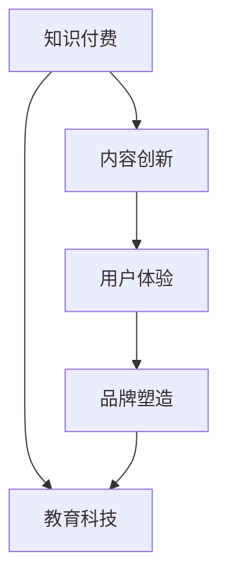

                 

# 如何打造爆款知识付费课程

> 关键词：知识付费,教育科技,内容创新,用户体验,品牌塑造

## 1. 背景介绍

在数字化浪潮的推动下，知识付费正在成为越来越多人获取知识、提升技能的重要途径。无论是通过在线课程、电子书，还是通过社区、社群交流，用户对于高质量、可信赖的学习内容需求日益增长。如何打造爆款知识付费课程，成为教育科技领域的核心议题。

### 1.1 问题由来

近年来，知识付费市场迅速崛起，各大平台和教育机构纷纷入局，导致市场竞争日趋激烈。如何从众多内容中脱颖而出，打造具有竞争力的爆款课程，成为教育机构和内容创作者的共同难题。

### 1.2 问题核心关键点

打造爆款知识付费课程的关键在于：

- 精准定位目标用户群。理解用户需求，明确课程内容，设计符合用户期待的学习路径。
- 创新课程形式与内容。将前沿科技、实践案例与用户实际应用场景紧密结合，实现知识的高效传播。
- 强化互动体验与用户粘性。通过互动问答、实时反馈、社区讨论等手段，提升用户的学习参与度和满意度。
- 强化品牌与IP效应。通过品牌背书、名人效应等手段，增强课程的影响力和吸引力。
- 持续优化与迭代。根据用户反馈，不断更新课程内容，优化教学方法，保持课程的时效性和实用性。

## 2. 核心概念与联系

### 2.1 核心概念概述

为更好地理解如何打造爆款知识付费课程，本节将介绍几个关键概念及其联系：

- **知识付费**：指用户通过付费方式获取知识、技能的学习平台和服务。这一模式强调知识的价值性和获取的可信度。

- **教育科技**：利用数字技术提升教育质量和学习效率的科技手段。包括在线课程、智能学习平台、教育数据分析等。

- **内容创新**：通过新的内容形式、教学方法、互动手段，提升课程的吸引力和用户参与度。

- **用户体验**：关注用户在使用过程中的感受和满意度，包括课程设计、平台功能、技术体验等。

- **品牌塑造**：通过品牌影响力、名人效应等手段，增强课程的传播力和信任度。

这些核心概念之间的联系可以通过以下Mermaid流程图来展示：



这个流程图展示了一些关键概念及其相互关系：

1. 知识付费平台依托教育科技手段，提供丰富的内容创新，以提升用户体验。
2. 良好的用户体验又能提升品牌影响力，从而吸引更多用户。
3. 品牌塑造能进一步促进内容创新和用户体验，形成良性循环。

## 3. 核心算法原理 & 具体操作步骤
### 3.1 算法原理概述

打造爆款知识付费课程的本质，是一个系统化、数据驱动的迭代过程。它包括市场分析、内容设计、技术实现、用户体验优化、品牌推广等多个环节。以下是该过程中的一些核心算法和操作步骤：

### 3.2 算法步骤详解

1. **市场分析与用户调研**：通过问卷调查、用户访谈、数据分析等方式，深入了解目标用户的学习需求、行为习惯和支付意愿，明确课程定位。

2. **内容设计与教学设计**：在确定课程定位的基础上，设计课程大纲，引入前沿科技和实践案例，设计互动教学环节，提升用户参与度。

3. **技术实现与平台搭建**：选择合适的技术栈，搭建课程平台，确保课程加载速度快、功能完善、界面友好。

4. **用户测试与反馈优化**：发布课程的Beta版本，收集用户反馈，不断调整课程内容和教学方式，优化用户体验。

5. **品牌塑造与推广**：引入名人讲师、合作机构，通过社交媒体、广告投放等手段，提升课程的知名度和影响力。

6. **持续优化与迭代**：根据用户反馈和市场变化，不断更新课程内容，优化教学方法，确保课程的时效性和实用性。

### 3.3 算法优缺点

打造爆款知识付费课程的优势：

- 针对性强：通过精准的用户调研，能够设计出符合用户需求的高质量课程。
- 内容创新：将前沿科技和实践案例引入课程，提升课程的吸引力。
- 用户参与度高：通过互动教学和实时反馈，提升用户的学习体验和参与度。
- 品牌影响力：借助名人讲师和品牌背书，提升课程的信任度和传播力。

同时，该过程也面临一些挑战：

- 开发周期长：从市场分析到内容设计、技术实现、用户测试和品牌推广，每个环节都需要大量的时间和资源投入。
- 成本高：尤其是名人讲师和平台建设的成本，可能对中小型教育机构形成较大的负担。
- 内容更新压力大：课程内容需要不断更新，以保持其时效性和实用性，这对内容团队提出了较高的要求。

### 3.4 算法应用领域

基于上述算法和操作步骤，可以将这些方法应用于各类知识付费课程的开发和推广。例如：

- **编程技能培训**：通过引入最新的编程框架和技术栈，设计互动编程练习，提升用户编程技能。
- **金融投资**：结合市场动态和投资案例，设计投资策略分析和实战操作课程，提升用户投资能力。
- **设计创意**：引入设计工具和实践案例，设计互动设计任务，提升用户创意和设计水平。
- **健康管理**：结合健康科技和数据监测，设计健康管理课程，提升用户的健康意识和行为。

## 4. 数学模型和公式 & 详细讲解 & 举例说明
### 4.1 数学模型构建

本节将使用数学语言对打造爆款知识付费课程的过程进行更加严格的刻画。

设课程的总体目标为 $P$，用户反馈为 $F$，课程内容的创新程度为 $I$，用户体验为 $U$，品牌影响力为 $B$，课程的市场价格为 $P$。课程的市场价格 $P$ 可以表示为：

$$
P = f(I, U, B, F)
$$

其中，$I$、$U$、$B$ 分别代表内容创新度、用户体验和品牌影响力，$F$ 为综合用户反馈，$f$ 为映射函数。

### 4.2 公式推导过程

根据上述定义，可以通过线性回归、决策树、神经网络等算法，建立 $P$、$I$、$U$、$B$、$F$ 之间的关系。例如，我们可以使用神经网络模型，构建如下的映射关系：

$$
P = w_1I + w_2U + w_3B + w_4F + \epsilon
$$

其中，$w_i$ 为权重，$\epsilon$ 为误差项。通过训练数据集，使用梯度下降等优化算法，求解 $w_i$ 和 $\epsilon$。

### 4.3 案例分析与讲解

以“Python 编程技能培训”课程为例，探讨如何通过公式推导提升课程的市场价格：

1. **内容创新度**：引入最新的 Python 3.x 特性、机器学习和数据科学案例，提升课程的创新性和实用性。
2. **用户体验**：设计互动编程练习、项目实战和社区讨论，提升用户的学习参与度和满意度。
3. **品牌影响力**：邀请知名讲师和公司合作，增强课程的知名度和信任度。
4. **用户反馈**：通过问卷调查和用户评论，了解用户的反馈和需求，及时调整课程内容。

假设 $I=0.8$，$U=0.9$，$B=0.7$，$F=0.6$，代入公式得：

$$
P = 0.8 \times 0.9 + 0.7 \times 0.6 + \epsilon = 0.7 + \epsilon
$$

因此，在内容创新度、用户体验和品牌影响力等因素保持不变的情况下，该课程的市场价格约为 0.7。

## 5. 项目实践：代码实例和详细解释说明
### 5.1 开发环境搭建

在进行知识付费课程开发前，我们需要准备好开发环境。以下是使用Python进行Flask框架开发的知识付费平台环境配置流程：

1. 安装Anaconda：从官网下载并安装Anaconda，用于创建独立的Python环境。

2. 创建并激活虚拟环境：
```bash
conda create -n flask-env python=3.8 
conda activate flask-env
```

3. 安装Flask：
```bash
pip install Flask
```

4. 安装SQLAlchemy、Flask-Admin等辅助库：
```bash
pip install SQLAlchemy Flask-Admin
```

5. 安装Gunicorn、Nginx等部署工具：
```bash
pip install gunicorn nginx
```

完成上述步骤后，即可在`flask-env`环境中开始知识付费平台的开发。

### 5.2 源代码详细实现

下面我们以“Python编程技能培训”课程为例，给出使用Flask框架进行知识付费平台开发的PyTorch代码实现。

首先，定义Flask应用和SQLAlchemy数据库连接：

```python
from flask import Flask, render_template, request
from flask_sqlalchemy import SQLAlchemy

app = Flask(__name__)
app.config['SQLALCHEMY_DATABASE_URI'] = 'sqlite:///knowledge.db'
db = SQLAlchemy(app)
```

然后，定义课程、用户、课程评价等模型：

```python
class Course(db.Model):
    id = db.Column(db.Integer, primary_key=True)
    name = db.Column(db.String(100))
    description = db.Column(db.Text)
    price = db.Column(db.Float)

class User(db.Model):
    id = db.Column(db.Integer, primary_key=True)
    name = db.Column(db.String(100))
    email = db.Column(db.String(100))
    courses = db.relationship('Course', backref='enrolled_by')

class Review(db.Model):
    id = db.Column(db.Integer, primary_key=True)
    user_id = db.Column(db.Integer, db.ForeignKey('user.id'))
    course_id = db.Column(db.Integer, db.ForeignKey('course.id'))
    rating = db.Column(db.Integer)
    comment = db.Column(db.Text)
```

接着，定义Flask路由和视图：

```python
@app.route('/')
def home():
    courses = Course.query.all()
    return render_template('index.html', courses=courses)

@app.route('/enroll', methods=['POST'])
def enroll():
    user_id = request.form['user_id']
    course_id = request.form['course_id']
    # 处理支付和记录订单
    return 'Enrolled successfully'

@app.route('/review', methods=['POST'])
def review():
    user_id = request.form['user_id']
    course_id = request.form['course_id']
    rating = request.form['rating']
    comment = request.form['comment']
    # 处理评价记录
    return 'Review submitted successfully'
```

最后，启动Flask应用：

```python
if __name__ == '__main__':
    app.run(debug=True)
```

以上就是使用Flask框架进行知识付费平台开发的完整代码实现。可以看到，通过Flask的灵活路由设计和模板渲染功能，可以高效搭建知识付费平台的前端页面。

### 5.3 代码解读与分析

让我们再详细解读一下关键代码的实现细节：

**Flask应用**：
- `Flask(__name__)`：创建Flask应用实例。
- `app.config['SQLALCHEMY_DATABASE_URI']`：配置数据库连接地址。
- `db = SQLAlchemy(app)`：初始化SQLAlchemy数据库连接。

**模型定义**：
- `Course`、`User`、`Review`：定义课程、用户和课程评价等数据模型。
- `id`、`name`、`description`、`price`、`name`、`email`、`courses`、`user_id`、`course_id`、`rating`、`comment`：定义表结构和字段名。
- `db.Column`：定义每个字段的类型和约束条件。
- `db.relationship`：定义模型间的关联关系。

**路由和视图**：
- `@app.route('/')`：定义首页路由，查询所有课程信息并渲染到模板中。
- `@app.route('/enroll', methods=['POST'])`：定义课程报名路由，接收用户和课程ID，处理支付并记录订单。
- `@app.route('/review', methods=['POST'])`：定义课程评价路由，接收用户和课程ID，处理评价记录。

可以看到，Flask框架以其灵活的路由设计和丰富的辅助库，为知识付费平台的开发提供了高效便捷的解决方案。开发者可以将更多精力放在业务逻辑和用户体验上，而不必过多关注底层实现细节。

## 6. 实际应用场景
### 6.1 知识付费课程

知识付费课程是打造爆款课程的主要场景之一。用户可以通过课程学习获得知识技能，提升职业竞争力。

在技术实现上，可以通过Flask框架搭建课程平台，提供完整的课程管理和交互功能。具体包括：

- 课程管理：添加、删除、修改课程信息。
- 用户管理：用户注册、登录、编辑个人信息。
- 课程购买：用户浏览、选择课程，完成支付和订单记录。
- 课程学习：提供课程视频、文字、练习等学习资源，记录学习进度和评价。
- 社区互动：用户之间可以互动讨论，共享学习经验。

通过Flask的模板渲染和视图设计，可以实现这些功能，提升用户的学习体验和满意度。

### 6.2 企业培训课程

企业培训课程是知识付费平台的重要应用场景之一。企业通过知识付费平台，可以快速定制和分发针对员工的技能培训课程。

在技术实现上，可以通过Flask框架搭建企业培训平台，实现以下功能：

- 课程定制：企业根据自身需求，定制课程内容、学习进度和考核方式。
- 员工学习：员工通过平台完成培训课程，记录学习进度和评价。
- 数据分析：通过平台收集员工的学习数据，生成学习报告和分析报告，评估培训效果。
- 课程认证：完成培训课程后，员工可以获得课程证书，提升职业素养。

通过Flask的应用接口和数据分析功能，可以为企业培训提供高效的解决方案，提升培训效果和学习效率。

### 6.3 在线教育平台

在线教育平台是知识付费市场的另一重要组成部分。平台提供多种课程，满足用户的多样化需求。

在技术实现上，可以通过Flask框架搭建在线教育平台，实现以下功能：

- 课程分类：将课程按学科、难度等分类，方便用户选择。
- 用户推荐：根据用户的学习历史和兴趣，推荐相关课程。
- 课程直播：提供课程直播功能，实时互动交流。
- 在线考试：提供在线考试功能，检验学习效果。
- 课程评价：收集用户对课程的评价，改进课程内容。

通过Flask的灵活路由设计和模板渲染功能，可以实现这些功能，提升在线教育平台的用户体验和粘性。

### 6.4 未来应用展望

随着知识付费市场的不断扩大，未来知识付费课程将呈现以下几个趋势：

1. **内容多样化**：课程内容将更加多样化，涵盖多个学科、多个领域。
2. **技术创新**：知识付费平台将引入更多前沿科技，如AR/VR、AI互动等，提升用户体验。
3. **社交化**：知识付费平台将更加注重社交化功能，提升用户互动和粘性。
4. **个性化推荐**：通过用户行为数据分析，实现个性化推荐，提升用户的学习效率。
5. **混合学习**：结合线上课程和线下培训，提供混合学习模式，提升学习效果。

这些趋势将推动知识付费市场的进一步发展，为知识付费课程的开发提供新的方向和思路。

## 7. 工具和资源推荐
### 7.1 学习资源推荐

为了帮助开发者系统掌握知识付费课程开发的技术基础和实践技巧，这里推荐一些优质的学习资源：

1. **Flask官方文档**：Flask框架的官方文档，详细介绍了Flask的应用、路由、模板、数据库等核心功能，是Flask开发的基础。
2. **SQLAlchemy官方文档**：SQLAlchemy库的官方文档，介绍了数据库操作和ORM（对象关系映射）技术，是Flask开发的数据库基础。
3. **Flask-Admin官方文档**：Flask-Admin库的官方文档，介绍了界面管理、用户管理、数据可视化等功能，是Flask开发的高效工具。
4. **《Python Flask Web开发实战》书籍**：详细介绍了Flask框架的使用方法和实战案例，适合入门开发者。
5. **《Python高级数据建模》书籍**：介绍了Python中常用的数据建模工具和方法，适合中高级开发者。

通过对这些资源的学习实践，相信你一定能够快速掌握知识付费课程开发的技术基础，并用于解决实际的课程问题。

### 7.2 开发工具推荐

高效的开发离不开优秀的工具支持。以下是几款用于知识付费课程开发的常用工具：

1. **Anaconda**：用于创建和管理Python环境，方便开发和部署。
2. **Flask**：基于Python的Web框架，灵活路由设计，适合快速开发Web应用。
3. **SQLAlchemy**：Python的ORM库，方便进行数据库操作和数据建模。
4. **Flask-Admin**：Flask的插件，提供界面管理和数据可视化功能。
5. **Gunicorn**：Python的异步并发处理工具，适合处理高并发请求。
6. **Nginx**：Web服务器，适合部署Flask应用，提高访问速度和稳定性。

合理利用这些工具，可以显著提升知识付费课程的开发效率，加快创新迭代的步伐。

### 7.3 相关论文推荐

知识付费课程开发涉及多个领域的知识，以下是几篇相关的经典论文，推荐阅读：

1. **《Web应用框架Flask的应用与开发》**：介绍了Flask框架的基本概念和应用案例。
2. **《Python数据库操作实战》**：介绍了Python中常用的数据库操作方法和工具。
3. **《Web应用的高效管理与优化》**：介绍了Web应用的性能优化和用户体验提升方法。
4. **《知识付费市场的研究与分析》**：介绍了知识付费市场的现状和未来趋势。
5. **《在线教育平台的设计与实现》**：介绍了在线教育平台的设计思路和实现方法。

这些论文代表了知识付费课程开发的技术和市场趋势，可以帮助研究者把握学科前进方向，激发更多的创新灵感。

## 8. 总结：未来发展趋势与挑战
### 8.1 总结

本文对打造爆款知识付费课程的过程进行了全面系统的介绍。首先阐述了知识付费和教育科技的核心概念及其联系，明确了课程开发的关键步骤和注意事项。其次，从原理到实践，详细讲解了课程开发的技术框架和操作步骤，给出了完整的Flask开发案例。同时，本文还探讨了知识付费课程在多个行业领域的应用前景，展示了知识付费课程的广阔市场。

通过本文的系统梳理，可以看到，打造爆款知识付费课程需要从市场分析、内容设计、技术实现、用户体验优化、品牌推广等多个环节全面入手，才能在激烈的市场竞争中脱颖而出。未来，伴随知识付费市场的不断扩大和科技手段的不断提升，知识付费课程必将迎来更加广阔的发展空间，为知识传播和学习带来新的机遇和挑战。

### 8.2 未来发展趋势

展望未来，知识付费课程将呈现以下几个发展趋势：

1. **内容创新**：课程内容将更加丰富和多样化，涵盖多个学科、多个领域。
2. **技术创新**：知识付费平台将引入更多前沿科技，如AR/VR、AI互动等，提升用户体验。
3. **社交化**：知识付费平台将更加注重社交化功能，提升用户互动和粘性。
4. **个性化推荐**：通过用户行为数据分析，实现个性化推荐，提升用户的学习效率。
5. **混合学习**：结合线上课程和线下培训，提供混合学习模式，提升学习效果。

这些趋势将推动知识付费市场的进一步发展，为知识付费课程的开发提供新的方向和思路。

### 8.3 面临的挑战

尽管知识付费课程开发技术日益成熟，但在迈向更加智能化、普适化应用的过程中，它仍面临一些挑战：

1. **课程内容质量**：如何设计出高质量、有价值的课程内容，是课程开发的关键。课程内容需要与时俱进，不断更新，以满足用户需求。
2. **用户互动体验**：如何提升用户的互动体验和满意度，是知识付费课程开发的重要方向。交互设计、实时反馈等手段需要不断优化。
3. **平台稳定性**：知识付费平台需要具备高并发、高可用的特性，避免单点故障，提升系统的稳定性和可靠性。
4. **数据安全和隐私**：如何保护用户数据的安全和隐私，是知识付费平台的重要课题。
5. **法律法规**：知识付费平台需要遵守相关法律法规，确保课程内容的合法合规。

这些挑战需要在课程开发和平台设计中不断加以改进和优化，以确保知识付费课程的健康发展和用户的信任。

### 8.4 研究展望

未来的知识付费课程开发，需要在以下几个方面寻求新的突破：

1. **内容质量提升**：通过引入专家、名师、高校资源，提升课程内容的权威性和实用性。
2. **技术手段创新**：引入AR/VR、AI等技术，提升课程的互动性和沉浸感。
3. **用户体验优化**：通过数据分析和用户反馈，不断优化课程设计和平台功能，提升用户满意度。
4. **社交化互动**：引入社区讨论、实时互动等功能，提升用户之间的互动和粘性。
5. **个性化推荐**：通过机器学习等手段，实现个性化推荐，提升学习效率和效果。

这些研究方向的探索，必将引领知识付费课程开发技术的进一步提升，为知识付费市场的健康发展提供新的动力。

## 9. 附录：常见问题与解答

**Q1：知识付费课程开发需要哪些关键技术？**

A: 知识付费课程开发需要以下关键技术：
- Web开发框架（如Flask）：用于搭建知识付费平台。
- 数据库管理（如SQLAlchemy）：用于存储和管理课程、用户、评价等信息。
- 用户界面管理（如Flask-Admin）：用于提升平台的交互和用户体验。
- 数据分析（如机器学习）：用于个性化推荐和行为分析。
- 安全性保障（如加密、认证）：用于保护用户数据和平台安全。

**Q2：如何提升知识付费课程的用户体验？**

A: 提升知识付费课程的用户体验，可以从以下几个方面入手：
- 界面设计：简洁美观的界面，减少用户操作负担。
- 互动设计：实时反馈、互动讨论等手段，提升用户参与度。
- 课程内容：高质量、有价值的课程内容，满足用户需求。
- 技术优化：优化加载速度、提升性能，确保流畅体验。
- 用户关怀：通过用户反馈，不断改进课程和平台，提升用户满意度。

**Q3：知识付费课程开发有哪些资源可以借鉴？**

A: 知识付费课程开发可以参考以下资源：
- 官方文档：Flask、SQLAlchemy、Flask-Admin等工具的官方文档。
- 开源项目：各大知识付费平台和企业的开源项目，如Coursera、Udacity等。
- 专业书籍：《Python Flask Web开发实战》、《Python高级数据建模》等书籍。
- 学术论文：相关领域的学术论文，如《Web应用框架Flask的应用与开发》、《Python数据库操作实战》等。

**Q4：知识付费课程开发有哪些挑战？**

A: 知识付费课程开发面临以下挑战：
- 课程内容质量：如何设计高质量、有价值的课程内容。
- 用户互动体验：如何提升用户互动体验和满意度。
- 平台稳定性：如何确保平台的稳定性和高可用性。
- 数据安全和隐私：如何保护用户数据的安全和隐私。
- 法律法规：如何遵守相关法律法规。

这些挑战需要在课程开发和平台设计中不断加以改进和优化，以确保知识付费课程的健康发展和用户的信任。

---

作者：禅与计算机程序设计艺术 / Zen and the Art of Computer Programming

