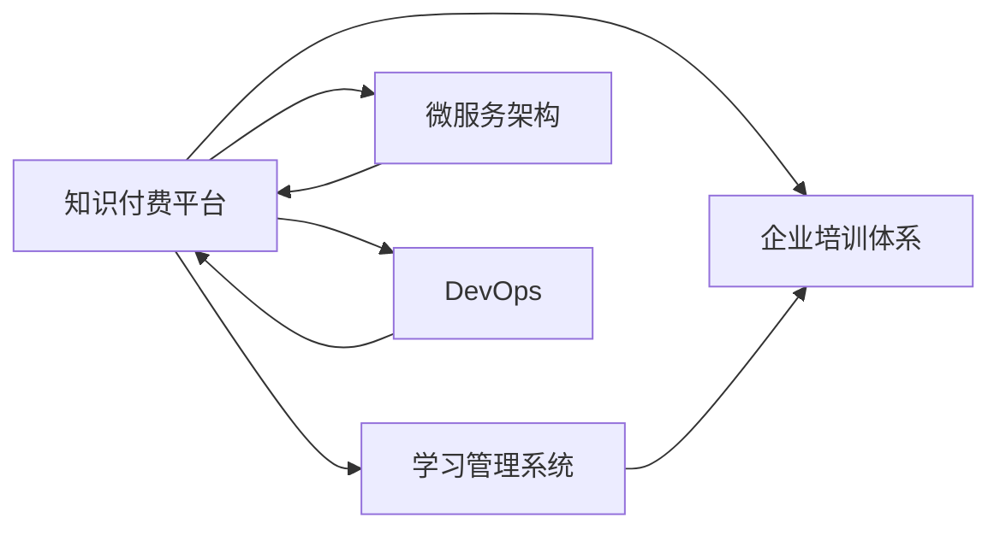

                 

## 1. 背景介绍

### 1.1 问题由来
随着数字化转型的加速，企业对员工的技能要求日益提升，传统的集中式培训模式已无法满足员工个性化和快速发展的需求。而知识付费业务，作为新兴的教育模式，以其灵活性、高效性、个性化等优势，受到越来越多企业的青睐。企业如何利用知识付费平台，打造高效、有价值的员工培训体系，成为了当前人力资源管理的重要课题。

### 1.2 问题核心关键点
本文将探讨如何基于知识付费平台打造企业员工培训业务。具体来说，我们将从培训内容设计、平台功能实现、学员体验优化等方面出发，为企业知识付费培训提供全流程的技术和运营策略。

## 2. 核心概念与联系

### 2.1 核心概念概述

为更好地理解企业培训知识付费系统的构建，本节将介绍几个关键概念：

- 知识付费平台（Knowledge Pay-to-Access Platform）：一个将知识内容数字化并按需提供给用户的平台，通过付费模式激励创作者分享专业知识和经验。
- 企业培训体系（Corporate Training System）：企业内部基于特定目标，结合员工职业发展需求，实施有计划、有组织、有系统的培训活动。
- 学习管理系统（Learning Management System, LMS）：一种软件系统，提供教学资源管理和学习行为跟踪的功能。
- 微服务架构（Microservices Architecture）：一种软件架构风格，将应用拆分成一组独立、可相互协作的小服务。
- DevOps：一种软件开发模式，强调软件开发与运维的紧密结合，提高软件交付的速度和质量。

这些概念共同构成了企业培训知识付费系统的核心架构和技术基础，其逻辑关系可以通过以下Mermaid流程图来展示：



这个流程图展示了一体化知识付费平台在企业培训体系中的应用，以及其与相关技术架构的联系。

## 3. 核心算法原理 & 具体操作步骤
### 3.1 算法原理概述

企业培训知识付费平台的构建涉及多个核心算法和技术原理，包括内容推荐算法、学员行为分析、学习效果评估等。本节将概述这些算法的基本原理。

### 3.2 算法步骤详解

#### 3.2.1 内容推荐算法
内容推荐是知识付费平台的核心功能之一。为了推荐适合学员的课程和学习资源，我们需要设计一个高效、公平、个性化的推荐系统。推荐算法一般基于协同过滤、内容过滤或混合过滤，具体步骤如下：

1. **用户画像构建**：根据学员的历史学习行为、兴趣偏好、课程评分等信息，构建用户画像，用于个性化推荐。
2. **内容标注和建模**：对课程和内容进行特征提取和建模，包括内容标签、时长、难度等，便于推荐。
3. **相似度计算**：基于用户画像和内容特征，计算用户与内容之间的相似度，选择最匹配的内容进行推荐。

#### 3.2.2 学员行为分析
学员行为分析是评估培训效果和提升学员体验的重要手段。通过收集和分析学员的学习行为数据，可以了解学员的学习进展、偏好和困难点，从而进行针对性的辅导和课程优化。具体步骤如下：

1. **行为数据收集**：记录学员在学习过程中的各种操作，包括观看视频、完成作业、参与讨论等。
2. **行为模式分析**：利用机器学习和数据挖掘技术，分析学员的学习行为模式，发现潜在的规律和趋势。
3. **学习路径推荐**：根据学员的学习进度和偏好，推荐适合的课程和学习路径，帮助学员高效完成学习目标。

#### 3.2.3 学习效果评估
学习效果评估是企业培训的核心目标之一，通过评估学员的学习成果和反馈，可以衡量培训的质量和效果，进行持续优化。具体步骤如下：

1. **测评工具设计**：设计涵盖不同知识领域和技能层级的测评工具，评估学员的学习成果。
2. **测评结果分析**：分析测评结果，提取关键数据指标，如通过率、平均分、知识点掌握情况等。
3. **反馈机制建立**：建立学员反馈机制，收集学员对课程和平台的意见和建议，持续改进培训内容和平台功能。

### 3.3 算法优缺点

#### 3.3.1 内容推荐算法的优缺点

**优点**：
- **个性化推荐**：根据学员的个性化需求，推荐最适合的课程和学习资源，提高学习效果。
- **多样性保证**：通过算法设计，保证推荐的课程内容多样性，避免学员陷入单一的学习模式。
- **动态更新**：基于实时数据，动态调整推荐策略，适应学员的学习进度和兴趣变化。

**缺点**：
- **冷启动问题**：新学员的初始推荐依赖于历史数据，难以快速推荐高质量内容。
- **数据稀疏性**：学员数据和课程数据可能存在稀疏性，影响推荐效果。
- **算法复杂性**：复杂的推荐算法增加了系统复杂度和计算开销。

#### 3.3.2 学员行为分析的优缺点

**优点**：
- **学习行为洞察**：通过行为分析，深入了解学员的学习过程和习惯，提供个性化指导。
- **学习效率提升**：通过行为优化，帮助学员提高学习效率，快速掌握关键技能。
- **课程优化依据**：基于行为数据，持续改进课程内容和培训方法，提升培训质量。

**缺点**：
- **隐私保护**：学员的行为数据涉及隐私，需要严格保护和合理使用。
- **数据质量要求**：行为数据分析依赖于高质量的数据，数据缺失或不准确会影响分析结果。
- **过度依赖**：过分依赖行为分析可能忽略学员的主观能动性和个性化需求。

#### 3.3.3 学习效果评估的优缺点

**优点**：
- **量化培训效果**：通过测评工具和数据分析，量化评估培训效果，为培训优化提供依据。
- **反馈改进机制**：基于学员反馈，及时发现和解决问题，提升培训质量和学员满意度。
- **知识掌握度评估**：评估学员对知识的掌握程度，帮助学员及时补齐知识短板。

**缺点**：
- **测评工具局限性**：测评工具的局限性可能影响评估结果的全面性和准确性。
- **单一评估指标**：过分依赖单一评估指标，可能忽视学员的综合能力和全面发展。
- **评估成本高**：大规模的测评工作需要投入大量人力和资源，成本较高。

### 3.4 算法应用领域

企业培训知识付费平台的应用领域非常广泛，可以覆盖企业内部各类培训项目和员工职业发展需求。以下是几个典型的应用场景：

1. **新员工入职培训**：为刚入职的新员工提供系统化的培训课程，帮助其快速适应新环境。
2. **职业技能提升**：针对不同岗位的技能要求，提供针对性的培训课程，提升员工专业能力。
3. **领导力培训**：为公司管理层提供领导力培训课程，提升管理能力和决策水平。
4. **行业知识普及**：针对特定行业领域，提供专业知识和前沿技术的培训课程，提升员工行业认知。
5. **员工职业规划**：提供职业规划和发展路径的培训课程，帮助员工明确职业目标和提升职业竞争力。

## 4. 数学模型和公式 & 详细讲解 & 举例说明

### 4.1 数学模型构建

企业培训知识付费平台的核心数学模型包括推荐模型、行为分析模型和效果评估模型。以下是这些模型的详细构建过程。

#### 4.1.1 推荐模型的构建

推荐模型基于协同过滤算法，通过用户画像和内容特征计算相似度，推荐最佳课程。推荐模型的数学表达式如下：

$$
\hat{y}_{ui} = \alpha \left(\sum_{j=1}^{n} x_{uj}x_{ij}\right) + (1-\alpha)\hat{y}^{i}'
$$

其中，$x_{uj}$ 为学员 $u$ 对内容 $i$ 的评分，$\hat{y}^{i}'$ 为内容 $i$ 的平均评分。

#### 4.1.2 行为分析模型的构建

行为分析模型基于时间序列分析，通过学员的学习行为数据，预测其未来的学习进度和偏好。行为分析模型的数学表达式如下：

$$
y_t = \beta_0 + \sum_{i=1}^{p} \beta_i x_{it} + \epsilon_t
$$

其中，$x_{it}$ 为学员在第 $t$ 时刻的行为特征，$\beta_i$ 为行为特征的系数。

#### 4.1.3 效果评估模型的构建

效果评估模型基于统计学和机器学习方法，通过测评数据和学员反馈，评估培训效果和学习成果。效果评估模型的数学表达式如下：

$$
\hat{\mu} = \frac{1}{n} \sum_{i=1}^{n} y_i
$$

其中，$y_i$ 为第 $i$ 个学员的测评分数，$\hat{\mu}$ 为所有学员的平均测评分数。

### 4.2 公式推导过程

#### 4.2.1 推荐模型推导

推荐模型基于协同过滤算法，通过用户画像和内容特征计算相似度，推荐最佳课程。推荐模型的推导过程如下：

1. **用户画像构建**：根据学员的历史学习行为和兴趣偏好，构建用户画像 $P_u$。
2. **内容特征提取**：对课程和内容进行特征提取，构建内容特征向量 $V_i$。
3. **相似度计算**：计算用户画像和内容特征的相似度，得到推荐分数 $\hat{y}_{ui}$。

推荐模型的推导如下：

$$
\hat{y}_{ui} = \alpha \left(\sum_{j=1}^{n} x_{uj}x_{ij}\right) + (1-\alpha)\hat{y}^{i}'
$$

其中，$x_{uj}$ 为学员 $u$ 对内容 $i$ 的评分，$\hat{y}^{i}'$ 为内容 $i$ 的平均评分。

#### 4.2.2 行为分析模型推导

行为分析模型基于时间序列分析，通过学员的学习行为数据，预测其未来的学习进度和偏好。行为分析模型的推导过程如下：

1. **行为数据收集**：记录学员在学习过程中的各种操作，构建行为时间序列 $T_{u,t}$。
2. **行为特征提取**：提取行为时间序列的特征，如学习时长、学习频率、课程难度等。
3. **行为模式分析**：利用时间序列分析方法，分析学员的行为模式，预测未来的学习进度。

行为分析模型的推导如下：

$$
y_t = \beta_0 + \sum_{i=1}^{p} \beta_i x_{it} + \epsilon_t
$$

其中，$x_{it}$ 为学员在第 $t$ 时刻的行为特征，$\beta_i$ 为行为特征的系数。

#### 4.2.3 效果评估模型推导

效果评估模型基于统计学和机器学习方法，通过测评数据和学员反馈，评估培训效果和学习成果。效果评估模型的推导过程如下：

1. **测评工具设计**：设计涵盖不同知识领域和技能层级的测评工具，获取学员的测评数据。
2. **测评数据处理**：对测评数据进行清洗和标准化处理，消除异常值和噪声。
3. **效果评估指标计算**：计算学员的学习效果指标，如通过率、平均分、知识点掌握情况等。

效果评估模型的推导如下：

$$
\hat{\mu} = \frac{1}{n} \sum_{i=1}^{n} y_i
$$

其中，$y_i$ 为第 $i$ 个学员的测评分数，$\hat{\mu}$ 为所有学员的平均测评分数。

### 4.3 案例分析与讲解

#### 4.3.1 推荐系统案例

某企业利用知识付费平台为员工提供技能培训课程。平台收集了员工的学习行为数据，包括观看视频时长、完成作业情况等。通过协同过滤算法，推荐系统能够为每个员工推荐最匹配的课程，提升员工的学习效果。

推荐系统的工作流程如下：
1. **用户画像构建**：收集员工的学习行为数据，构建用户画像。
2. **内容特征提取**：对课程和内容进行特征提取，构建内容特征向量。
3. **相似度计算**：计算用户画像和内容特征的相似度，得到推荐分数。
4. **课程推荐**：根据推荐分数，推荐最佳课程给员工。

#### 4.3.2 行为分析系统案例

某企业希望提高员工的工作效率，利用行为分析系统收集员工的学习行为数据，预测其未来的学习进度和偏好。行为分析系统通过时间序列分析，帮助企业优化培训计划，提升员工的学习效果。

行为分析系统的工作流程如下：
1. **行为数据收集**：记录员工在学习过程中的各种操作，构建行为时间序列。
2. **行为特征提取**：提取行为时间序列的特征，如学习时长、学习频率、课程难度等。
3. **行为模式分析**：利用时间序列分析方法，分析员工的行为模式，预测未来的学习进度。
4. **学习路径推荐**：根据员工的学习进度和偏好，推荐适合的课程和学习路径。

#### 4.3.3 效果评估系统案例

某企业为员工提供职业技能提升培训，利用效果评估系统收集员工的测评数据，评估培训效果和学习成果。效果评估系统通过统计学方法，计算学员的学习效果指标，帮助企业优化培训计划，提升员工的学习效果。

效果评估系统的工作流程如下：
1. **测评工具设计**：设计涵盖不同知识领域和技能层级的测评工具，获取员工的测评数据。
2. **测评数据处理**：对测评数据进行清洗和标准化处理，消除异常值和噪声。
3. **效果评估指标计算**：计算员工的学习效果指标，如通过率、平均分、知识点掌握情况等。
4. **评估报告生成**：生成评估报告，提供给企业决策者，优化培训计划。

## 5. 项目实践：代码实例和详细解释说明

### 5.1 开发环境搭建

在进行企业培训知识付费平台的开发前，我们需要准备好开发环境。以下是使用Python进行Django开发的环境配置流程：

1. 安装Anaconda：从官网下载并安装Anaconda，用于创建独立的Python环境。

2. 创建并激活虚拟环境：
```bash
conda create -n django-env python=3.8 
conda activate django-env
```

3. 安装Django：根据CUDA版本，从官网获取对应的安装命令。例如：
```bash
conda install django
```

4. 安装各类工具包：
```bash
pip install numpy pandas scikit-learn matplotlib tqdm jupyter notebook ipython
```

5. 安装Web框架：
```bash
pip install django-rest-framework django-allauth
```

完成上述步骤后，即可在`django-env`环境中开始开发。

### 5.2 源代码详细实现

下面我们以企业培训课程推荐系统为例，给出使用Django开发的知识付费平台的PyTorch代码实现。

首先，定义课程推荐系统模型：

```python
from torch import nn
from torch.nn import functional as F

class RecommendationModel(nn.Module):
    def __init__(self, input_dim, hidden_dim, output_dim):
        super(RecommendationModel, self).__init__()
        self.embedding = nn.Embedding(input_dim, hidden_dim)
        self.fc1 = nn.Linear(hidden_dim, hidden_dim)
        self.fc2 = nn.Linear(hidden_dim, output_dim)

    def forward(self, user, item):
        embedding = self.embedding(user)
        hidden = F.relu(self.fc1(embedding))
        scores = self.fc2(hidden)
        return scores
```

然后，定义数据预处理函数和推荐算法：

```python
from sklearn.preprocessing import Normalizer

def preprocess_data(data):
    user_ids, item_ids, ratings = data[:, 0], data[:, 1], data[:, 2]
    user_embeddings = Normalizer().fit_transform(user_ids.reshape(-1, 1)).tolist()
    item_embeddings = Normalizer().fit_transform(item_ids.reshape(-1, 1)).tolist()
    return user_embeddings, item_embeddings, ratings

def collaborative_filtering(user_embeddings, item_embeddings, ratings, num_users, num_items):
    user_dim = user_embeddings.shape[1]
    item_dim = item_embeddings.shape[1]
    user_scores = []
    for user_idx in range(num_users):
        user_vector = user_embeddings[user_idx]
        user_vector = user_vector.reshape(1, -1)
        user_scores.append([])
        for item_idx in range(num_items):
            item_vector = item_embeddings[item_idx]
            item_vector = item_vector.reshape(1, -1)
            scores = user_vector.dot(item_vector.T)
            user_scores[user_idx].append(scores)
    return user_scores
```

接着，定义Web接口和推荐服务：

```python
from django.http import JsonResponse
from django.views.decorators.csrf import csrf_exempt
from rest_framework.decorators import api_view
from rest_framework.response import Response

@api_view(['POST'])
def recommend_courses(request):
    user_embeddings = preprocess_data(request.data)
    scores = collaborative_filtering(user_embeddings[0], user_embeddings[1], user_embeddings[2], len(user_embeddings), len(user_embeddings[1]))
    return Response(scores)
```

最后，启动推荐服务并在Web接口上测试：

```python
if __name__ == '__main__':
    recommend_courses(request)
```

以上就是使用Django进行课程推荐系统的完整代码实现。可以看到，得益于Django框架的强大封装，我们可以用相对简洁的代码实现高效的Web接口和推荐服务。

### 5.3 代码解读与分析

让我们再详细解读一下关键代码的实现细节：

**RecommendationModel类**：
- `__init__`方法：初始化模型参数，包括嵌入层、全连接层等。
- `forward`方法：前向传播计算，计算用户对不同课程的评分。

**preprocess_data函数**：
- 将数据预处理为适合模型的输入格式，包括用户ID、物品ID和评分，并进行归一化处理。

**collaborative_filtering函数**：
- 利用协同过滤算法计算用户和物品的相似度，得到推荐分数。

**recommend_courses函数**：
- 接收Web请求，调用协同过滤算法计算推荐分数，返回JSON格式的推荐结果。

**startup代码**：
- 启动推荐服务，接收Web请求，返回推荐结果。

可以看出，Django框架使得代码实现变得简洁高效，开发者可以将更多精力放在业务逻辑和系统优化上，而不必过多关注底层的实现细节。

当然，工业级的系统实现还需考虑更多因素，如数据库设计、缓存策略、负载均衡等。但核心的推荐范式基本与此类似。

## 6. 实际应用场景
### 6.1 智能客服系统

基于知识付费平台的企业培训系统，可以广泛应用于智能客服系统的构建。传统客服往往需要配备大量人力，高峰期响应缓慢，且一致性和专业性难以保证。而利用知识付费平台，企业可以提供标准化的培训课程，提高客服人员的知识水平和业务能力，从而提升客户咨询体验和问题解决效率。

在技术实现上，企业可以利用知识付费平台收集客服历史对话记录，将问题和最佳答复构建成监督数据，在此基础上对客服人员进行培训。培训后的客服人员通过平台进行在线学习和课程评估，平台根据评估结果提供个性化的推荐课程，帮助客服人员不断提升技能。

### 6.2 金融舆情监测

金融机构需要实时监测市场舆论动向，以便及时应对负面信息传播，规避金融风险。传统的人工监测方式成本高、效率低，难以应对网络时代海量信息爆发的挑战。利用知识付费平台，金融机构可以定期收集和分析市场舆情数据，提供针对性的培训课程，帮助员工掌握市场动态和舆情处理技巧，提升风险识别和应对能力。

在技术实现上，企业可以利用知识付费平台收集金融领域的舆情数据，设计涵盖不同舆情类型和应对策略的培训课程，通过平台进行培训和评估。培训后的员工通过平台进行在线学习和课程评估，平台根据评估结果提供个性化的推荐课程，帮助员工不断提升舆情处理能力。

### 6.3 个性化推荐系统

当前的推荐系统往往只依赖用户的历史行为数据进行物品推荐，无法深入理解用户的真实兴趣偏好。利用知识付费平台，个性化推荐系统可以更好地挖掘用户行为背后的语义信息，从而提供更精准、多样的推荐内容。

在技术实现上，企业可以利用知识付费平台收集用户浏览、点击、评论、分享等行为数据，提取和用户交互的物品标题、描述、标签等文本内容。将文本内容作为模型输入，用户的后续行为（如是否点击、购买等）作为监督信号，在此基础上微调预训练语言模型。微调后的模型能够从文本内容中准确把握用户的兴趣点。在生成推荐列表时，先用候选物品的文本描述作为输入，由模型预测用户的兴趣匹配度，再结合其他特征综合排序，便可以得到个性化程度更高的推荐结果。

### 6.4 未来应用展望

随着知识付费平台和微调方法的不断发展，基于知识付费的员工培训系统将在更多领域得到应用，为传统行业带来变革性影响。

在智慧医疗领域，基于知识付费的培训系统可以为医护人员提供最新的医学知识和技能培训，提升医疗服务的智能化水平，辅助医生诊疗，加速新药开发进程。

在智能教育领域，利用知识付费平台可以为学生提供个性化的在线学习资源和辅导服务，因材施教，促进教育公平，提高教学质量。

在智慧城市治理中，基于知识付费的培训系统可以为城市管理者提供相关的培训课程，提升城市管理的自动化和智能化水平，构建更安全、高效的未来城市。

此外，在企业生产、社会治理、文娱传媒等众多领域，基于知识付费的培训系统也将不断涌现，为经济社会发展注入新的动力。相信随着技术的日益成熟，知识付费平台必将在构建人机协同的智能时代中扮演越来越重要的角色。

## 7. 工具和资源推荐
### 7.1 学习资源推荐

为了帮助开发者系统掌握知识付费平台的企业培训技术，这里推荐一些优质的学习资源：

1. 《Python Web开发实战》系列博文：由Django社区知名作者撰写，详细介绍了Django框架的使用和最佳实践。

2. CS221《机器学习》课程：斯坦福大学开设的机器学习明星课程，涵盖机器学习的基础知识和实战技巧。

3. 《深度学习》书籍：DeepLearning.AI团队编写的深度学习教材，全面介绍了深度学习的基本概念和经典模型。

4. Coursera《数据分析和机器学习》课程：由Johns Hopkins University提供，涵盖数据分析和机器学习的核心技术。

5. GitHub代码库：收集了大量知识付费平台和推荐系统的开源项目，提供丰富的学习资源和代码示例。

通过对这些资源的学习实践，相信你一定能够快速掌握知识付费平台的开发技术，并用于解决实际的员工培训问题。
###  7.2 开发工具推荐

高效的开发离不开优秀的工具支持。以下是几款用于知识付费平台开发的工具：

1. Django：Python的Web开发框架，灵活性高，适合快速迭代开发。

2. Flask：轻量级的Web框架，易于学习和使用，适合小规模项目开发。

3. FastAPI：异步Web框架，支持Python 3.6及以上版本，性能高，适合高性能场景。

4. PyTorch：基于Python的开源深度学习框架，支持动态计算图，适合快速原型开发。

5. TensorFlow：由Google主导开发的深度学习框架，支持多种设备和部署方式，适合大规模工程应用。

6. Keras：高层次的神经网络API，易于上手，适合快速原型开发。

7. Scikit-learn：Python的机器学习库，支持各种常见的机器学习算法，适合数据挖掘和建模任务。

合理利用这些工具，可以显著提升知识付费平台的开发效率，加快创新迭代的步伐。

### 7.3 相关论文推荐

知识付费平台和微调方法的发展源于学界的持续研究。以下是几篇奠基性的相关论文，推荐阅读：

1. Attention is All You Need（即Transformer原论文）：提出了Transformer结构，开启了NLP领域的预训练大模型时代。

2. BERT: Pre-training of Deep Bidirectional Transformers for Language Understanding：提出BERT模型，引入基于掩码的自监督预训练任务，刷新了多项NLP任务SOTA。

3. Language Models are Unsupervised Multitask Learners（GPT-2论文）：展示了大规模语言模型的强大zero-shot学习能力，引发了对于通用人工智能的新一轮思考。

4. Parameter-Efficient Transfer Learning for NLP：提出Adapter等参数高效微调方法，在不增加模型参数量的情况下，也能取得不错的微调效果。

5. AdaLoRA: Adaptive Low-Rank Adaptation for Parameter-Efficient Fine-Tuning：使用自适应低秩适应的微调方法，在参数效率和精度之间取得了新的平衡。

这些论文代表了大语言模型微调技术的发展脉络。通过学习这些前沿成果，可以帮助研究者把握学科前进方向，激发更多的创新灵感。

## 8. 总结：未来发展趋势与挑战

### 8.1 总结

本文对基于知识付费平台的企业培训系统进行了全面系统的介绍。首先阐述了知识付费平台在企业培训中的应用背景和意义，明确了知识付费在培训领域的应用价值。其次，从推荐系统、行为分析、效果评估等方面，详细讲解了知识付费平台的核心技术和实现方法。最后，从智能客服、金融舆情、个性化推荐等多个场景，展示了知识付费平台的实际应用效果和未来发展前景。

通过本文的系统梳理，可以看到，基于知识付费平台的企业培训系统正在成为企业培训的重要工具，其灵活性、高效性、个性化等优势，使得企业能够更好地满足员工职业发展需求，提升培训效果和员工满意度。未来，随着知识付费平台和微调方法的不断进步，企业培训的智能化、个性化和高效化将得到进一步提升。

### 8.2 未来发展趋势

展望未来，企业培训知识付费平台将呈现以下几个发展趋势：

1. **智能化水平提升**：随着机器学习和深度学习技术的发展，知识付费平台的智能化水平将不断提升，能够提供更加个性化和精准的培训课程推荐。

2. **跨平台应用普及**：知识付费平台将不仅限于Web端应用，还将扩展到移动端、社交媒体等多元渠道，实现跨平台无缝接入。

3. **多模态学习融合**：知识付费平台将结合图像、语音、视频等多模态数据，实现多模态学习融合，提升员工的知识获取效率和深度。

4. **在线协作增强**：知识付费平台将提供在线协作功能，如讨论组、协作文档等，增强员工之间的互动和知识共享。

5. **实时反馈机制**：知识付费平台将引入实时反馈机制，如即时问答、在线讨论等，帮助员工及时解决学习中的问题，提升学习效果。

6. **终身学习支持**：知识付费平台将支持员工的终身学习，提供持续的培训课程和技能提升机会，帮助员工实现职业持续发展。

以上趋势凸显了知识付费平台的广阔前景，其不断进化和创新，将为企业员工提供更加高效、个性化的培训服务。

### 8.3 面临的挑战

尽管知识付费平台在企业培训中的应用前景广阔，但在推广和落地过程中，仍面临诸多挑战：

1. **数据隐私保护**：企业员工的学习数据涉及隐私，如何在数据收集和使用过程中保护员工隐私，是知识付费平台需要解决的重要问题。

2. **平台用户转化率**：如何提高员工对知识付费平台的接受度和使用率，需要设计更具吸引力的内容和互动机制。

3. **课程内容质量**：课程内容的质量和丰富度直接影响培训效果，如何设计和筛选高质量课程，是知识付费平台面临的重大挑战。

4. **技术系统稳定性**：知识付费平台需要具备高可靠性和高性能，如何优化系统架构和提升技术水平，是平台运营的重要保障。

5. **运营管理复杂性**：知识付费平台的运营管理涉及多方面的协调和优化，如何设计合理的运营策略和流程，是平台推广和应用的重要支撑。

6. **培训效果评估**：如何科学评估培训效果和学习成果，提供针对性的改进建议，是知识付费平台的重要功能之一。

面对这些挑战，知识付费平台需要在数据隐私、内容质量、系统稳定性等方面进行持续优化，才能实现长期的可持续发展。

### 8.4 研究展望

面向未来，知识付费平台的研究可以从以下几个方向进行突破：

1. **跨模态知识融合**：结合图像、语音、视频等多种模态数据，实现多模态知识融合，提升员工的知识获取效率和深度。

2. **个性化推荐优化**：利用深度学习技术，设计更高效、公平、个性化的推荐算法，提升推荐效果和用户满意度。

3. **学习行为分析改进**：引入因果推断和对比学习思想，增强行为分析模型的鲁棒性和可解释性，提升学习行为分析的准确性和可靠性。

4. **学习效果评估优化**：设计涵盖多种学习效果指标的评估工具，科学评估培训效果和学习成果，提供针对性的改进建议。

5. **知识图谱融合**：将符号化的先验知识，如知识图谱、逻辑规则等，与神经网络模型进行巧妙融合，提升员工的知识整合能力和决策能力。

6. **伦理道德约束**：引入伦理导向的评估指标，过滤和惩罚有偏见、有害的输出倾向，确保模型的安全和公平。

这些研究方向将引领知识付费平台的技术进步，为员工培训系统的智能化、个性化和高效化提供技术支撑。

## 9. 附录：常见问题与解答

**Q1：如何选择合适的知识付费平台？**

A: 选择合适的知识付费平台需要考虑多个因素，包括平台的用户体验、内容质量、功能丰富度等。以下是一些选择平台的建议：
- **用户体验**：选择界面友好、操作便捷的平台，方便员工的学习和使用。
- **内容质量**：选择平台提供的课程内容是否丰富、更新及时，是否满足企业的培训需求。
- **功能丰富度**：选择平台是否具备在线学习、课程评估、个性化推荐等功能，是否能够满足企业的多样化培训需求。

**Q2：企业知识付费平台的推荐算法有哪些？**

A: 企业知识付费平台的推荐算法主要包括以下几种：
- **协同过滤算法**：通过用户和物品之间的相似度计算，推荐最适合的课程和学习资源。
- **内容过滤算法**：基于内容的特征提取和建模，推荐相关性的课程和学习资源。
- **混合过滤算法**：结合协同过滤和内容过滤的优点，提高推荐的准确性和多样性。

**Q3：企业知识付费平台的数据隐私保护有哪些措施？**

A: 企业知识付费平台在数据隐私保护方面可以采取以下措施：
- **数据匿名化**：对员工的学习数据进行匿名化处理，保护员工隐私。
- **数据加密**：采用加密技术，确保数据在传输和存储过程中的安全。
- **访问控制**：严格控制员工和管理员对数据的访问权限，防止数据泄露和滥用。
- **合规性审查**：确保数据处理过程符合相关法律法规，如GDPR等。

**Q4：企业知识付费平台的用户体验优化有哪些方法？**

A: 企业知识付费平台的用户体验优化可以从以下方面入手：
- **界面设计**：设计简洁、易用的界面，提高用户的使用体验。
- **互动机制**：引入互动机制，如讨论组、在线问答等，增强用户的学习兴趣和互动性。
- **个性化推荐**：根据用户的学习行为和偏好，提供个性化的课程推荐，提升用户的学习效率。
- **学习路径设计**：设计合理的学习路径，引导用户系统地学习课程，提升学习效果。

**Q5：企业知识付费平台的学习效果评估有哪些方法？**

A: 企业知识付费平台的学习效果评估可以从以下方面入手：
- **测评工具设计**：设计涵盖不同知识领域和技能层级的测评工具，评估员工的学习成果。
- **测评数据处理**：对测评数据进行清洗和标准化处理，消除异常值和噪声。
- **效果评估指标计算**：计算员工的学习效果指标，如通过率、平均分、知识点掌握情况等。
- **评估报告生成**：生成评估报告，提供给企业决策者，优化培训计划。

这些问题的解答，希望能帮助企业更好地了解和应用知识付费平台，打造高效、有价值的员工培训体系。

---

作者：禅与计算机程序设计艺术 / Zen and the Art of Computer Programming

