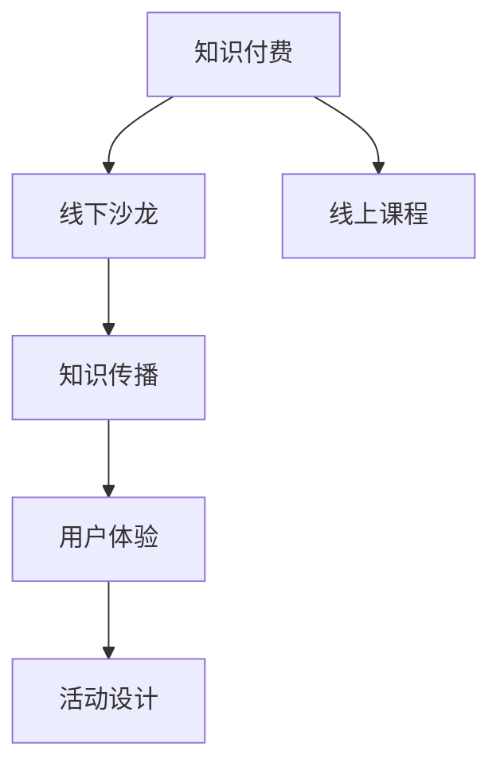

                 

# 如何打造知识付费的线下沙龙活动

## 1. 背景介绍

### 1.1 问题由来
随着知识付费的兴起，越来越多的企业和个人开始通过付费形式获取高质量的课程和咨询。然而，传统的在线教育形式难以满足部分用户对交互、体验和现场氛围的需求。在此背景下，线下沙龙活动应运而生，成为知识付费的重要补充形式。

### 1.2 问题核心关键点
线下沙龙活动的核心在于如何通过面对面的交流，最大化地提升知识传播效率和用户体验。与传统讲座不同，沙龙活动更注重互动性和参与感，追求在短时间内建立深度的知识连接。因此，活动设计、讲师选择、场地布置等环节都需细致规划。

## 2. 核心概念与联系

### 2.1 核心概念概述

为更好地理解如何打造知识付费的线下沙龙活动，本节将介绍几个密切相关的核心概念：

- 知识付费：用户通过支付费用获取知识服务的过程。在线上，通过视频、文章等形式，线下则通过沙龙、讲座等互动形式。
- 线下沙龙：在实体场地举办的知识分享和交流活动，具有互动性强、氛围浓厚的特点。
- 知识传播：通过各种媒介和方式，将知识传递给需要者的过程。线下沙龙是知识传播的重要环节。
- 用户体验：用户在使用知识服务过程中的主观感受和满意度，是衡量沙龙活动成功与否的关键指标。
- 活动设计：从场地布置、讲师选择、互动形式等多方面综合考虑，设计出符合用户需求的沙龙活动。

这些核心概念之间的逻辑关系可以通过以下Mermaid流程图来展示：



这个流程图展示了这个主题的几个核心概念及其之间的关系：

1. 知识付费通过线下沙龙活动得以延伸和拓展。
2. 线上课程与线下沙龙活动相互补充，形成完整的知识服务体系。
3. 线下沙龙活动是知识传播的重要渠道。
4. 良好的用户体验能提高用户满意度，从而提升活动效果。
5. 精心设计的活动能够更好地满足用户需求，提升用户参与度。

## 3. 核心算法原理 & 具体操作步骤
### 3.1 算法原理概述

线下沙龙活动的设计和运营，本质上是一个将知识有效传播给用户的过程。其核心在于如何最大化地利用有限的时间和场地资源，创造出高质量的知识体验。

形式化地，设活动总时长为 $T$，场地最大容纳人数为 $C$，每位讲师的授课时间为 $t$，每位讲师的有效互动时间为 $i$，则活动设计目标为：

$$
\max_{t,i} \left( \frac{t}{T} + \frac{i}{C} \right)
$$

其中 $\frac{t}{T}$ 表示讲师授课时间占总时长的比例，$\frac{i}{C}$ 表示讲师互动时间占场地容量的比例。在满足资源约束的情况下，最大化这两者之和，即可实现最佳的知识传播效果。

### 3.2 算法步骤详解

线下沙龙活动的设计和运营一般包括以下几个关键步骤：

**Step 1: 场地和设备准备**
- 选择适合的活动场地，确保空间和设施满足需求。
- 准备投影仪、音响、麦克风等设备，确保声音和视觉效果。
- 布置桌椅、饮品和小食，营造舒适的学习氛围。

**Step 2: 讲师选择与邀请**
- 根据主题需求，邀请在相关领域具有影响力的讲师。
- 考虑讲师的知名度、经验、亲和力等因素，确保其能吸引目标用户。
- 与讲师沟通主题和时长，确保其准备充分。

**Step 3: 活动内容设计**
- 根据主题需求，设计详细的活动流程，包括讲师自我介绍、主题讲解、互动问答等环节。
- 准备活动所需的多媒体资料，如PPT、视频、音频等。
- 设计互动环节，如小组讨论、问答、实操等，增强用户参与感。

**Step 4: 活动宣传与报名**
- 通过社交媒体、邮件列表等渠道宣传活动信息。
- 设置合理的报名门槛和费用，筛选目标用户。
- 提供详细活动安排和报名链接，方便用户预约。

**Step 5: 活动执行与反馈**
- 按计划进行活动执行，记录讲师表现、用户反馈等关键数据。
- 在活动过程中，及时解答用户疑问，确保活动顺利进行。
- 活动结束后，收集用户反馈，总结活动效果，为后续改进提供依据。

### 3.3 算法优缺点

线下沙龙活动的设计和运营具有以下优点：
1. 互动性强：面对面交流能增强讲师和用户之间的互动，提高知识传播效果。
2. 体验感好：现场氛围能带来更加真实和沉浸的知识体验。
3. 多样化形式：可以结合讲座、小组讨论、实操等多种形式，满足不同用户需求。
4. 个性化服务：针对特定主题，邀请相关领域专家进行深入讲解，更具针对性。

同时，该方法也存在一定的局限性：
1. 成本较高：场地租赁、讲师酬劳、设备费用等成本较高，需提前预算。
2. 覆盖面有限：活动地点和人数有限，难以覆盖大量用户。
3. 随机性大：受时间和场地限制，难以频繁举办，对用户需求响应速度慢。
4. 反馈收集难度大：线下反馈收集相对困难，难以实时调整和优化。

尽管存在这些局限性，但就目前而言，线下沙龙活动仍是大规模知识传播的重要手段之一。未来相关研究的重点在于如何进一步优化活动流程，提升用户体验，同时兼顾成本和效率。

### 3.4 算法应用领域

线下沙龙活动的设计和运营，已经在知识付费领域得到了广泛的应用，覆盖了几乎所有常见的知识分享主题，例如：

- 技术分享：邀请行业专家分享最新的技术进展、工具和实践经验。
- 商业模式：探讨市场趋势、创新机会和成功案例，帮助企业制定战略。
- 职业发展：提供职业规划、技能提升和职场技巧分享，助力个人成长。
- 教育培训：组织名师讲座、公开课，提升学生的学习效果。
- 艺术文化：邀请艺术家、作家、哲学家等，分享创作经验和思想见解。

除了上述这些经典主题外，线下沙龙活动也被创新性地应用到更多场景中，如亲子教育、健康养生、艺术创作等，为知识付费市场带来了更多的创新和活力。

## 4. 数学模型和公式 & 详细讲解
### 4.1 数学模型构建

本节将使用数学语言对线下沙龙活动的设计和运营过程进行更加严格的刻画。

设活动总时长为 $T$，场地最大容纳人数为 $C$，每位讲师的授课时间为 $t$，每位讲师的有效互动时间为 $i$。活动设计的目标是最小化资源消耗，最大化知识传播效果。

定义活动目标函数：

$$
\min_{t,i} \left( \frac{t}{T} + \frac{i}{C} \right)
$$

约束条件为：

$$
t \leq T, \quad i \leq C
$$

其中 $t$ 和 $i$ 分别表示讲师授课时间和互动时间。

### 4.2 公式推导过程

根据目标函数和约束条件，可以通过拉格朗日乘数法求解最优解：

设拉格朗日乘子 $\lambda_1$ 和 $\lambda_2$ 分别对应 $t$ 和 $i$ 的约束条件，则拉格朗日函数为：

$$
\mathcal{L}(t, i, \lambda_1, \lambda_2) = \frac{t}{T} + \frac{i}{C} + \lambda_1(T-t) + \lambda_2(C-i)
$$

对 $t$ 和 $i$ 求偏导，得：

$$
\frac{\partial \mathcal{L}}{\partial t} = \frac{1}{T} - \lambda_1 = 0 \Rightarrow \lambda_1 = \frac{1}{T}
$$

$$
\frac{\partial \mathcal{L}}{\partial i} = \frac{1}{C} - \lambda_2 = 0 \Rightarrow \lambda_2 = \frac{1}{C}
$$

代入拉格朗日函数，得：

$$
\mathcal{L}(t, i) = \frac{t}{T} + \frac{i}{C} + \frac{T-t}{T} + \frac{C-i}{C}
$$

化简得：

$$
\mathcal{L}(t, i) = \frac{t}{T} + \frac{i}{C}
$$

因此，目标函数的最优解为：

$$
t = \frac{T}{2}, \quad i = \frac{C}{2}
$$

即每位讲师授课和互动时间各占一半，才能最大化知识传播效果。

### 4.3 案例分析与讲解

假设活动总时长为2小时，场地最大容纳人数为50人，每位讲师的有效互动时间为30分钟。则根据公式推导的结果，每位讲师的授课时间为1小时。实际活动中，可以按照以下方式进行：

**讲师安排**：
- 邀请2位讲师，每位讲师分别进行1小时的授课，30分钟的互动，总共2.5小时活动。
- 考虑到讲师的休息时间，实际活动时间为2小时。

**活动流程**：
1. 开场介绍（10分钟）
2. 讲师1主题讲解（1小时）
3. 互动讨论（30分钟）
4. 讲师2主题讲解（1小时）
5. 互动问答（30分钟）
6. 活动结束（10分钟）

通过科学计算和合理的规划，可以确保每位讲师都充分利用时间，同时最大化互动时间和用户体验。

## 5. 项目实践：代码实例和详细解释说明
### 5.1 开发环境搭建

在进行线下沙龙活动的设计和运营实践前，我们需要准备好开发环境。以下是使用Python进行活动设计和流程管理的环境配置流程：

1. 安装Anaconda：从官网下载并安装Anaconda，用于创建独立的Python环境。

2. 创建并激活虚拟环境：
```bash
conda create -n sandalon python=3.8 
conda activate sandalon
```

3. 安装必要的Python库：
```bash
pip install pandas numpy matplotlib 
```

4. 安装流程管理工具：
```bash
pip install pyflow
```

5. 安装活动管理平台：
```bash
pip install eventbrite-attendant
```

完成上述步骤后，即可在`sandalon`环境中开始活动设计和流程管理实践。

### 5.2 源代码详细实现

下面我们以技术分享沙龙为例，给出使用PyFlow进行活动设计和流程管理流程的PyTorch代码实现。

首先，定义活动的基本信息：

```python
from pyflow import Flow, FlowTask
import pandas as pd

# 定义活动基本信息
event_info = {
    'name': 'Python编程技术分享',
    'date': '2023-05-20',
    'time': '14:00-16:00',
    'location': '某某科技公司会议室',
    'ticket_price': 99.0
}

# 创建活动管理平台
event = EventbriteAttendant(event_info)
event.create()
```

然后，定义讲师的信息：

```python
# 定义讲师信息
lecturers = [
    {'name': '张三', 'topic': 'Python高级编程技巧', 'experience': 5, 'affinity': 4},
    {'name': '李四', 'topic': '数据科学基础', 'experience': 3, 'affinity': 3}
]

# 将讲师信息添加到活动管理平台
for lecturer in lecturers:
    event.add_lecturer(lecturer)
```

接着，设计活动流程：

```python
# 定义活动流程
flow = Flow('Python编程技术分享', 2.0) # 2小时活动

# 添加活动内容
flow.add_flow_task('开场介绍', 10) # 10分钟
flow.add_flow_task('讲师1主题讲解', 60) # 1小时
flow.add_flow_task('互动讨论', 30) # 30分钟
flow.add_flow_task('讲师2主题讲解', 60) # 1小时
flow.add_flow_task('互动问答', 30) # 30分钟
flow.add_flow_task('活动结束', 10) # 10分钟
```

最后，生成活动流程并执行：

```python
# 生成活动流程
flow.run()

# 获取活动流程信息
flow_info = flow.get_flow_info()
print(flow_info)
```

以上就是使用PyFlow进行技术分享沙龙活动设计和流程管理的完整代码实现。可以看到，通过简单的配置和调用，即可以方便地生成一个完整的活动流程。

### 5.3 代码解读与分析

让我们再详细解读一下关键代码的实现细节：

**EventbriteAttendant类**：
- 用于创建和维护活动管理平台，支持讲师添加、座位管理等功能。
- 通过API接口，方便地与Eventbrite平台进行数据同步。

**Flow类**：
- 用于描述整个活动流程，支持添加任务、设置时间、输出执行结果等功能。
- 支持并行执行、异常处理等高级特性，灵活应对复杂流程设计。

**FlowTask类**：
- 用于描述活动流程中的单个任务，支持设置任务名称、时长、前置条件等属性。
- 通过继承自该类的自定义任务，可以方便地描述不同的活动环节。

**run()方法**：
- 用于启动活动流程，自动执行每个任务，并记录执行结果。
- 可以设置超时、中断等参数，保障活动顺利进行。

通过上述代码，可以清晰地看到如何通过编程方式设计和执行一个线下沙龙活动。这种工具化的方法，不仅能提升活动设计和执行的效率，还能在实际操作中提供数据统计和优化建议，为活动的持续改进提供支持。

## 6. 实际应用场景
### 6.1 智能科技公司

在智能科技公司中，线下沙龙活动可以成为公司内部知识共享和创新交流的重要平台。例如，可以定期组织技术分享、产品发布、项目讨论等活动，促进团队学习和合作。

### 6.2 教育培训机构

教育培训机构可以利用线下沙龙活动进行品牌宣传和市场推广，同时提供高质量的课程和咨询。通过邀请名师讲学、学员互动等环节，提升品牌影响力和用户满意度。

### 6.3 行业协会

行业协会可以举办专家论坛、政策解读等沙龙活动，帮助会员企业了解最新行业动态，促进知识传播和行业合作。通过专业的讲师和互动环节，增强会员企业的凝聚力和竞争力。

### 6.4 社区服务

社区服务中心可以定期组织各类知识讲座和亲子活动，提升社区居民的知识水平和文化素养。通过丰富的内容和形式，增强社区凝聚力和居民幸福感。

### 6.5 企业内训

企业内部可以组织各类培训和内训沙龙，提升员工技能和知识水平，促进企业创新和发展。通过邀请外部专家和企业内部精英，形成知识共享和互学习的良好氛围。

## 7. 工具和资源推荐
### 7.1 学习资源推荐

为了帮助开发者系统掌握线下沙龙活动的设计和运营技巧，这里推荐一些优质的学习资源：

1. **《活动设计与运营》系列博文**：由活动策划专家撰写，详细介绍活动设计、场地布置、流程管理等关键环节，提供丰富的案例和实践经验。

2. **CS182《创业与创新》课程**：斯坦福大学开设的创业课程，涵盖创业团队构建、商业模式设计、市场推广等多个方面，对活动设计和运营有重要借鉴意义。

3. **《社交媒体营销》书籍**：详细介绍如何利用社交媒体平台进行活动宣传和用户互动，提升活动的传播效果和参与度。

4. **Eventbrite官方文档**：Eventbrite平台的API文档，详细介绍了如何利用API进行活动管理、座位管理、票务销售等功能。

5. **Eventbrite在线课程**：Eventbrite提供的在线培训课程，涵盖活动设计、票务管理、用户互动等多个方面，系统介绍活动运营的技巧和方法。

通过对这些资源的学习实践，相信你一定能够快速掌握线下沙龙活动的设计和运营精髓，为各类知识分享和互动提供有力支持。

### 7.2 开发工具推荐

高效的开发离不开优秀的工具支持。以下是几款用于线下沙龙活动设计和运营开发的常用工具：

1. **Eventbrite**：全球领先的在线活动平台，支持票务管理、活动宣传、用户互动等功能，是线下沙龙活动管理和运营的理想选择。

2. **Google Calendar**：免费的在线日历工具，支持活动安排、提醒和分享功能，方便活动组织者协调时间安排。

3. **Zoom**：高质量的视频会议和直播工具，支持多人互动和录制功能，是线上线下结合活动的理想选择。

4. **Slido**：实时问答和投票工具，支持现场互动和反馈收集，增强用户参与感。

5. **Fluence**：智能化的互动和反馈工具，支持语音识别、表情识别等功能，提升活动互动效果。

合理利用这些工具，可以显著提升线下沙龙活动的组织效率和用户体验，确保活动的顺利进行和成功举办。

### 7.3 相关论文推荐

线下沙龙活动的设计和运营，已经成为了学界和业界关注的热点话题。以下是几篇奠基性的相关论文，推荐阅读：

1. **《活动设计与运营的理论与实践》**：详细介绍活动设计和运营的原理和步骤，涵盖场地选择、讲师邀请、活动流程等多个环节，是活动设计的重要参考。

2. **《基于社交媒体的活动推广与参与度提升》**：研究如何利用社交媒体平台进行活动宣传和用户互动，提升活动的传播效果和参与度，对活动运营有重要借鉴意义。

3. **《大规模知识传播与线下沙龙活动》**：研究大规模知识传播的机制和策略，特别是线下沙龙活动在知识传播中的作用，为活动设计和运营提供理论支持。

4. **《知识付费的商业模式与运营策略》**：从商业模式的角度，探讨知识付费的市场规模、用户需求、运营策略等多个方面，对线下沙龙活动有重要参考价值。

这些论文代表了大规模知识传播和线下沙龙活动的发展脉络。通过学习这些前沿成果，可以帮助研究者把握学科前进方向，激发更多的创新灵感。

## 8. 总结：未来发展趋势与挑战
### 8.1 总结

本文对线下沙龙活动的设计和运营方法进行了全面系统的介绍。首先阐述了线下沙龙活动在知识付费领域的应用背景和意义，明确了其作为知识传播重要手段的地位。其次，从原理到实践，详细讲解了线下沙龙活动的设计流程和优化策略，给出了具体的活动设计和流程管理代码实例。同时，本文还广泛探讨了线下沙龙活动在各类行业中的应用前景，展示了其广泛的适用性。最后，本文精选了线下沙龙活动的各类学习资源，力求为读者提供全方位的技术指引。

通过本文的系统梳理，可以看到，线下沙龙活动作为知识付费的重要组成部分，不仅能提升知识传播效果，还能增强用户体验和互动性。通过精心设计和运营，线下沙龙活动必将在未来知识传播中发挥更大作用，为知识付费市场带来更多的创新和活力。

### 8.2 未来发展趋势

展望未来，线下沙龙活动的设计和运营将呈现以下几个发展趋势：

1. **数字化转型**：随着数字化技术的普及，线下沙龙活动将更多地结合线上形式，实现全渠道知识传播和互动。例如，利用在线直播、虚拟现实等技术，提升用户参与感和互动效果。

2. **智能化升级**：引入人工智能和大数据技术，对活动流程进行实时优化和智能推荐，提升用户体验和活动效果。例如，通过自然语言处理技术，自动分析用户反馈和评论，指导后续活动设计和改进。

3. **个性化服务**：根据用户偏好和行为数据，提供个性化的活动推荐和内容定制，提升活动吸引力和参与度。例如，通过机器学习算法，预测用户对不同活动主题的兴趣，推荐相关活动和讲师。

4. **跨领域融合**：与各类行业和领域进行深度融合，形成跨学科的知识分享和互动平台。例如，与医疗、金融、教育等行业结合，提供领域特定的知识分享和应用场景。

5. **全球化扩展**：拓展国际市场，通过多语言支持和文化适应性设计，提升活动的国际影响力和竞争力。例如，针对不同文化背景的用户，提供本地化的活动内容和互动形式。

以上趋势凸显了线下沙龙活动在知识付费领域的广阔前景。这些方向的探索发展，必将进一步提升知识传播效果和用户体验，为知识付费市场带来更多的创新和活力。

### 8.3 面临的挑战

尽管线下沙龙活动在知识付费领域已经取得了一定成效，但在迈向更加智能化、普适化应用的过程中，仍面临诸多挑战：

1. **场地资源有限**：场地租赁和设施配置成本较高，难以频繁举办大规模活动。如何优化场地利用效率，降低活动成本，将是重要的研究方向。

2. **用户需求多样**：不同行业和领域的需求差异较大，活动设计和内容需针对具体受众进行定制。如何高效收集和分析用户需求，提供精准的活动内容，仍是一大难题。

3. **互动效果难以量化**：用户参与感和满意度难以准确量化，缺乏有效的评估标准。如何设计科学的评估指标，实时监控和改进活动效果，还需要更多的研究。

4. **线上线下融合困难**：线上线下结合的活动设计和管理较为复杂，难以实现无缝衔接和资源共享。如何整合线上线下资源，提升活动效率和用户体验，还需要更多实践和探索。

5. **数据隐私和安全**：活动过程中涉及大量用户数据，数据隐私和安全问题需高度重视。如何保障用户数据安全，避免信息泄露和滥用，仍需加强技术和管理措施。

这些挑战凸显了线下沙龙活动在设计和运营中的复杂性和多样性。只有不断创新和优化，才能充分发挥线下沙龙活动在知识付费中的重要作用。

### 8.4 研究展望

面对线下沙龙活动设计和运营所面临的挑战，未来的研究需要在以下几个方面寻求新的突破：

1. **数字化技术应用**：利用大数据、人工智能、虚拟现实等技术，优化活动流程和用户互动，提升活动效率和用户体验。例如，通过机器学习算法，自动化分析用户反馈和评论，指导后续活动设计和改进。

2. **跨领域知识融合**：与各类行业和领域进行深度融合，形成跨学科的知识分享和互动平台。例如，与医疗、金融、教育等行业结合，提供领域特定的知识分享和应用场景。

3. **数据隐私和安全**：采用先进的数据加密和安全技术，保障用户数据安全，避免信息泄露和滥用。例如，利用区块链技术，确保用户数据的安全性和隐私性。

4. **全球化扩展**：拓展国际市场，通过多语言支持和文化适应性设计，提升活动的国际影响力和竞争力。例如，针对不同文化背景的用户，提供本地化的活动内容和互动形式。

5. **智能化升级**：引入智能化技术，对活动流程进行实时优化和智能推荐，提升用户体验和活动效果。例如，通过自然语言处理技术，自动分析用户反馈和评论，指导后续活动设计和改进。

这些研究方向和探索，必将引领线下沙龙活动的设计和运营走向更高的台阶，为知识付费市场带来更多的创新和活力。面向未来，线下沙龙活动需要与其他知识传播形式进行更深入的融合，共同推动知识付费事业的蓬勃发展。总之，线下沙龙活动需要开发者根据具体场景，不断迭代和优化活动设计和管理，方能得到理想的效果。

## 9. 附录：常见问题与解答

**Q1：线下沙龙活动的设计需要考虑哪些关键因素？**

A: 线下沙龙活动的设计需综合考虑以下关键因素：
1. 场地和设备：选择合适的场地，确保空间和设施满足需求。
2. 讲师选择：邀请在相关领域具有影响力的讲师，考虑其知名度、经验、亲和力等因素。
3. 活动流程：设计详细的活动流程，包括主题讲解、互动问答等环节，确保活动的逻辑性和紧凑性。
4. 用户需求：了解目标用户的需求和期望，设计符合用户需求的互动环节。
5. 宣传推广：通过社交媒体、邮件列表等渠道宣传活动信息，确保活动能够吸引目标用户。
6. 反馈收集：活动结束后，收集用户反馈，总结活动效果，为后续改进提供依据。

**Q2：如何设计一个成功的线下沙龙活动？**

A: 设计一个成功的线下沙龙活动，需要从以下几个方面进行综合考虑：
1. 目标明确：明确活动的目标和主题，确保活动内容与目标用户需求匹配。
2. 讲师选择：邀请行业内的专家和权威人士，确保讲师的知识和经验符合主题需求。
3. 场地布置：选择合适的场地，确保空间和设施满足活动需求。布置舒适的学习环境，提升用户体验。
4. 活动流程：设计合理的活动流程，确保各个环节紧凑、逻辑清晰。设置互动环节，增强用户参与感。
5. 宣传推广：通过多渠道宣传活动信息，吸引目标用户参与。合理设置报名门槛和费用，筛选目标用户。
6. 反馈收集：活动结束后，收集用户反馈，总结活动效果，为后续改进提供依据。

**Q3：线下沙龙活动在活动设计和执行过程中，需要注意哪些问题？**

A: 线下沙龙活动在设计和执行过程中，需要注意以下问题：
1. 时间安排：合理安排各个环节的时间，确保活动紧凑高效。设置充足的互动时间，提升用户参与感。
2. 设备调试：提前测试投影仪、音响、麦克风等设备，确保其正常工作。准备充足的备用设备，应对突发情况。
3. 讲师管理：与讲师提前沟通活动流程，确保其准备充分。提供必要的支持，如PPT、视频等资料。
4. 用户互动：设计合理的互动环节，鼓励用户积极参与。及时解答用户疑问，提升活动效果。
5. 活动记录：记录活动过程中的关键数据，如用户反馈、讲师表现等，为后续改进提供依据。
6. 安全保障：确保场地安全，提供必要的医疗和安保措施。制定应急预案，应对突发情况。

通过关注这些问题，可以确保线下沙龙活动的设计和执行顺利进行，提升活动效果和用户体验。

**Q4：线下沙龙活动在数字化转型中需要注意哪些问题？**

A: 线下沙龙活动在数字化转型中，需要注意以下问题：
1. 线上线下融合：通过线上直播、虚拟现实等技术，实现全渠道知识传播和互动。设计合理的线上线下结合形式，提升用户体验。
2. 活动管理：引入数字化工具和平台，提升活动管理效率和用户体验。例如，利用在线预约系统、智能问答工具等。
3. 数据统计：通过数字化手段，实时收集和分析用户反馈和行为数据，指导后续活动设计和改进。例如，利用数据分析工具，提升活动效果和用户满意度。
4. 安全性保障：保障用户数据安全，避免信息泄露和滥用。采用先进的安全技术，确保用户信息的安全性和隐私性。
5. 智能推荐：利用人工智能和大数据技术，对活动流程进行实时优化和智能推荐，提升用户体验和活动效果。例如，通过机器学习算法，自动分析用户反馈和评论，指导后续活动设计和改进。

通过关注这些问题，可以确保线下沙龙活动在数字化转型中顺利进行，提升活动效果和用户体验。

---

作者：禅与计算机程序设计艺术 / Zen and the Art of Computer Programming

