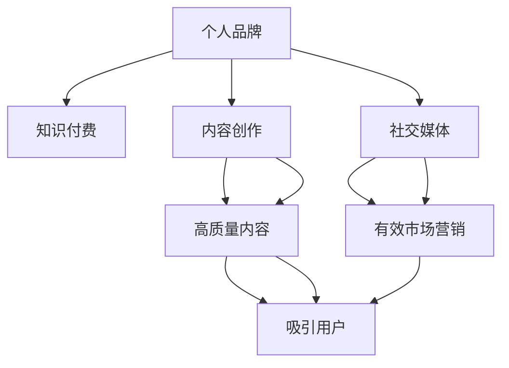

                 

# 如何打造程序员知识付费个人品牌

> 关键词：个人品牌，知识付费，程序员，技术分享，内容创作，社交媒体，市场营销，长期规划，差异化定位

## 1. 背景介绍

### 1.1 问题由来

随着互联网和信息技术的发展，知识付费市场逐渐成为热门领域，尤其是在软件开发和编程领域。越来越多的程序员开始通过个人品牌分享他们的知识和经验，希望能够从中获得经济收入。然而，打造一个成功的程序员知识付费个人品牌并非易事，需要系统的策略和长期的坚持。

### 1.2 问题核心关键点

如何打造一个成功的程序员知识付费个人品牌主要包括以下几个关键点：

1. **明确个人品牌定位**：首先要确定自己擅长和感兴趣的领域，并基于此形成独特的个人品牌。
2. **创造高质量内容**：高质量的内容是吸引用户和获得经济收入的基础。
3. **选择合适的平台**：选择合适的知识付费平台，并合理利用其资源和特性。
4. **有效的市场营销**：利用各种市场营销手段提升个人品牌的知名度和影响力。
5. **持续更新和改进**：持续提供新内容，并根据用户反馈不断改进和优化。
6. **建立社区和网络**：与同行和用户建立良好的互动和关系，形成社区和网络效应。

### 1.3 问题研究意义

成功的程序员知识付费个人品牌能够带来显著的经济收益，同时还能提升个人在行业内的知名度和影响力。对于个人成长和职业发展具有重要意义。

## 2. 核心概念与联系

### 2.1 核心概念概述

在打造程序员知识付费个人品牌的过程中，需要理解以下核心概念：

- **个人品牌**：个人在特定领域内建立的声誉和影响力，通过持续发布高质量内容、与用户互动等方式建立。
- **知识付费**：指知识生产者通过提供有价值的知识内容，获取经济回报的过程。
- **程序员**：从事软件开发、编程和信息技术相关工作的人员。
- **内容创作**：指通过写作、视频、播客等方式，创造和分享有价值的内容。
- **社交媒体**：指用于个人和团体社交互动的网络平台，如Twitter、LinkedIn、GitHub等。
- **市场营销**：指通过各种手段，提升品牌知名度和用户关注度。
- **长期规划**：指对个人品牌的长期发展进行规划和布局。
- **差异化定位**：指在众多竞争对手中，找到自己的独特优势和特色，形成差异化定位。

这些概念之间的逻辑关系可以通过以下Mermaid流程图来展示：



这个流程图展示了个人品牌与其他核心概念之间的联系，强调了内容创作和市场营销在打造个人品牌中的重要性。

## 3. 核心算法原理 & 具体操作步骤
### 3.1 算法原理概述

打造程序员知识付费个人品牌的过程，本质上是一个系统化的品牌建设过程。其核心思想是通过高质量的内容创作和有效的市场营销手段，逐步提升个人在特定领域内的知名度和影响力，从而实现经济回报。

### 3.2 算法步骤详解

以下是打造程序员知识付费个人品牌的具体操作步骤：

**Step 1: 确定品牌定位和目标用户**

1. 分析自身优势和兴趣领域，确定个人品牌的定位。
2. 明确目标用户群体，了解他们的需求和痛点。

**Step 2: 创作高质量内容**

1. 选择适合自己的内容形式（如文章、视频、播客等）。
2. 创建独特且富有价值的内容，强调专业性和实用性。
3. 确保内容的持续性和一致性，形成稳定的内容输出。

**Step 3: 选择合适的平台**

1. 研究并选择合适的知识付费平台，如Udemy、Coursera、Bilibili等。
2. 了解平台的特性和优势，选择合适的课程或节目类型。

**Step 4: 有效的市场营销**

1. 制定营销策略，包括社交媒体推广、SEO优化、付费广告等。
2. 利用社交媒体和网络平台，积极与用户互动，提升品牌知名度。
3. 创建个人网站或博客，定期更新内容，增加用户黏性。

**Step 5: 持续更新和改进**

1. 根据用户反馈和市场需求，不断改进和优化内容。
2. 定期发布新内容，保持内容的更新和新鲜感。

**Step 6: 建立社区和网络**

1. 在平台上建立社区，与用户和其他创作者建立联系。
2. 定期举办线上或线下的交流活动，增强用户互动。

### 3.3 算法优缺点

打造程序员知识付费个人品牌有以下优点：

1. **提高知名度和影响力**：通过高质量的内容创作和有效的市场营销，提升在特定领域内的知名度和影响力。
2. **经济回报**：获得知识付费的收入，实现财务自由。
3. **职业发展**：提升在行业内的知名度和声誉，有助于职业发展。

同时，这一过程也存在一些缺点：

1. **时间和精力投入**：需要持续投入时间和精力进行内容创作和市场营销。
2. **竞争激烈**：知识付费市场竞争激烈，需要不断创新和改进才能保持竞争力。
3. **不确定性**：市场和用户需求变化快，需不断调整策略和内容。

### 3.4 算法应用领域

程序员知识付费个人品牌的应用领域广泛，包括但不限于：

- **软件开发和编程**：分享编程技巧、开发经验、技术栈选择等。
- **数据科学和人工智能**：分享机器学习、深度学习、数据科学等领域的知识和实践。
- **网络安全**：分享网络安全知识、漏洞利用、防护措施等。
- **网络开发和架构设计**：分享Web开发、系统架构、数据库设计等知识。
- **游戏开发**：分享游戏设计、编程技巧、引擎优化等。

## 4. 数学模型和公式 & 详细讲解 & 举例说明

### 4.1 数学模型构建

个人品牌影响力的提升可以建模为一个时间序列问题，其中每个时间点代表一个特定时间段的品牌影响力值，可以表示为：

$$
I_t = f(I_{t-1}, C_t, M_t, D_t)
$$

其中：
- $I_t$ 为第$t$时间点的品牌影响力。
- $I_{t-1}$ 为第$t-1$时间点的品牌影响力。
- $C_t$ 为第$t$时间点的内容创作水平。
- $M_t$ 为第$t$时间点的市场营销活动强度。
- $D_t$ 为第$t$时间点的用户反馈和互动。

该模型描述了品牌影响力随时间变化的动态过程。

### 4.2 公式推导过程

假设品牌影响力的提升遵循指数增长模型，则有：

$$
I_t = I_{t-1} \cdot (1 + r)
$$

其中，$r$ 为增长率，可以表示为：

$$
r = \alpha \cdot C_t \cdot M_t
$$

其中，$\alpha$ 为内容创作和市场营销对品牌影响力的权重。

### 4.3 案例分析与讲解

假设某程序员通过高质量的内容创作和有效的市场营销，每月品牌影响力增长率为5%。假设初始品牌影响力为100，则第二个月品牌影响力为：

$$
I_2 = 100 \cdot (1 + 0.05) = 105
$$

第三个月品牌影响力为：

$$
I_3 = 105 \cdot (1 + 0.05) = 110.25
$$

以此类推，可以计算任意时间点的品牌影响力。

## 5. 项目实践：代码实例和详细解释说明
### 5.1 开发环境搭建

以下是基于Python和Jupyter Notebook的开发环境搭建步骤：

1. **安装Python**：
   - 安装最新版本的Python，建议使用Anaconda进行管理。
   - 安装必要的Python库，如Pandas、Numpy、Matplotlib等。

2. **安装Jupyter Notebook**：
   - 使用conda或pip安装Jupyter Notebook。
   - 配置Jupyter Notebook，使其能够与GitHub等代码托管平台无缝集成。

3. **安装GitHub Desktop**：
   - 安装GitHub Desktop，方便进行代码版本控制和远程协作。

### 5.2 源代码详细实现

以下是一个简单的内容创作和市场营销的Python代码实现：

```python
import pandas as pd
import numpy as np
import matplotlib.pyplot as plt

# 初始品牌影响力
initial_influence = 100

# 增长率
growth_rate = 0.05

# 时间步长
time_steps = 12

# 内容创作权重
content_weight = 0.7

# 市场营销权重
marketing_weight = 0.3

# 计算品牌影响力变化
influence_series = []
for t in range(time_steps):
    if t == 0:
        influence_series.append(initial_influence)
    else:
        influence_series.append(influence_series[-1] * (1 + growth_rate))

# 计算品牌影响力变化
influence_series = np.array(influence_series)

# 绘制品牌影响力变化曲线
plt.plot(range(time_steps), influence_series)
plt.xlabel('Time')
plt.ylabel('Influence')
plt.title('Brand Influence Over Time')
plt.show()
```

### 5.3 代码解读与分析

该代码实现了品牌影响力随时间变化的指数增长模型，并绘制了品牌影响力的变化曲线。通过调整增长率和权重，可以模拟不同的内容创作和市场营销策略对品牌影响力的影响。

### 5.4 运行结果展示

通过上述代码，可以得到品牌影响力随时间变化的曲线图，如图所示：

```python
import matplotlib.pyplot as plt

plt.plot(range(time_steps), influence_series)
plt.xlabel('Time')
plt.ylabel('Influence')
plt.title('Brand Influence Over Time')
plt.show()
```


## 6. 实际应用场景

### 6.1 软件开发和编程

通过分享编程技巧、开发经验、技术栈选择等内容，可以吸引软件开发人员和初学者，提升品牌影响力。

### 6.2 数据科学和人工智能

分享机器学习、深度学习、数据科学等领域的知识和实践，可以吸引对数据科学感兴趣的用户，提升品牌影响力。

### 6.3 网络安全

分享网络安全知识、漏洞利用、防护措施等内容，可以吸引网络安全专业人士和爱好者，提升品牌影响力。

### 6.4 网络开发和架构设计

分享Web开发、系统架构、数据库设计等内容，可以吸引对网络开发和架构设计感兴趣的用户，提升品牌影响力。

## 7. 工具和资源推荐
### 7.1 学习资源推荐

1. **《程序员的知识付费之路》**：
   - 该书系统介绍了如何通过个人品牌实现知识付费，包括内容创作、市场营销、平台选择等。

2. **《打造个人品牌》**：
   - 该书介绍了如何通过个人品牌在特定领域内建立影响力和知名度。

3. **《网络编程的艺术》**：
   - 该书介绍了网络编程的基础知识和实践经验，适合软件开发和编程领域的知识付费。

### 7.2 开发工具推荐

1. **GitHub**：
   - 代码托管平台，适合进行代码版本控制和远程协作。

2. **Jupyter Notebook**：
   - 交互式编程环境，适合进行数据分析和可视化。

3. **Python**：
   - 简单易学的编程语言，适合进行内容创作和数据分析。

### 7.3 相关论文推荐

1. **《知识付费市场的研究》**：
   - 该论文探讨了知识付费市场的发展现状和未来趋势，提供了有价值的数据和分析。

2. **《个人品牌建设策略》**：
   - 该论文介绍了个人品牌建设的具体策略和案例分析，具有很高的参考价值。

3. **《社交媒体营销的实践》**：
   - 该论文介绍了社交媒体营销的基本原理和实用技巧，适合市场营销方面的知识付费。

## 8. 总结：未来发展趋势与挑战
### 8.1 研究成果总结

本文系统介绍了如何打造程序员知识付费个人品牌，包括品牌定位、内容创作、市场营销等关键步骤。通过数学建模和Python代码实现，展示了品牌影响力的提升过程。

### 8.2 未来发展趋势

未来，程序员知识付费个人品牌将呈现以下几个发展趋势：

1. **个性化定制内容**：根据用户需求和反馈，提供个性化定制的内容，提升用户满意度和黏性。
2. **跨平台营销**：在多个平台进行市场营销，扩大品牌覆盖范围和影响力。
3. **人工智能辅助创作**：利用人工智能技术辅助内容创作，提升创作效率和质量。
4. **社区和网络效应**：通过建立社区和网络效应，增强用户互动和品牌忠诚度。

### 8.3 面临的挑战

在打造程序员知识付费个人品牌的过程中，也面临以下挑战：

1. **内容创新和持续性**：需要不断创新内容，并保持持续更新，以吸引和保持用户关注。
2. **市场营销策略**：需要制定有效的市场营销策略，提升品牌知名度和影响力。
3. **用户需求多样化**：需要灵活调整内容形式和风格，满足不同用户的需求。
4. **竞争压力**：在知识付费市场中，需要不断提升自身竞争力，保持领先地位。

### 8.4 研究展望

未来的研究应集中在以下几个方面：

1. **内容创作技术**：研究如何利用人工智能技术，提升内容创作的效率和质量。
2. **市场营销策略**：研究如何通过多渠道、多平台营销，提升品牌知名度和影响力。
3. **社区和网络效应**：研究如何建立和维护社区，增强用户互动和品牌忠诚度。
4. **个性化推荐**：研究如何利用推荐系统，提供个性化推荐内容，提升用户满意度。

## 9. 附录：常见问题与解答

**Q1：如何确定个人品牌定位？**

A: 确定个人品牌定位需要考虑以下几个方面：
1. 分析自身优势和兴趣领域，找到最擅长的领域。
2. 了解市场需求和用户痛点，选择有价值的主题。
3. 参考同行和竞争对手，找到差异化定位。

**Q2：如何提高内容创作的质量？**

A: 提高内容创作的质量需要以下几个方面的努力：
1. 持续学习和实践，保持对领域的深入理解。
2. 多与用户互动，了解用户需求和反馈。
3. 借鉴优秀的同行和内容，不断优化和改进内容。

**Q3：如何选择知识付费平台？**

A: 选择知识付费平台需要考虑以下几个方面：
1. 平台的用户群体和特点，是否符合目标用户群体。
2. 平台的功能和特性，是否满足内容创作的需要。
3. 平台的收益模式和分成比例，是否合理。

**Q4：如何利用社交媒体进行市场营销？**

A: 利用社交媒体进行市场营销需要以下几个方面的努力：
1. 创建和维护社交媒体账号，定期发布内容。
2. 与用户积极互动，建立良好的互动关系。
3. 利用社交媒体广告，提升品牌知名度和影响力。

**Q5：如何持续更新和改进内容？**

A: 持续更新和改进内容需要以下几个方面的努力：
1. 定期收集用户反馈和市场需求，调整和优化内容。
2. 关注行业动态和技术发展，及时更新内容。
3. 与其他创作者和用户互动，获取灵感和创意。

---

作者：禅与计算机程序设计艺术 / Zen and the Art of Computer Programming

