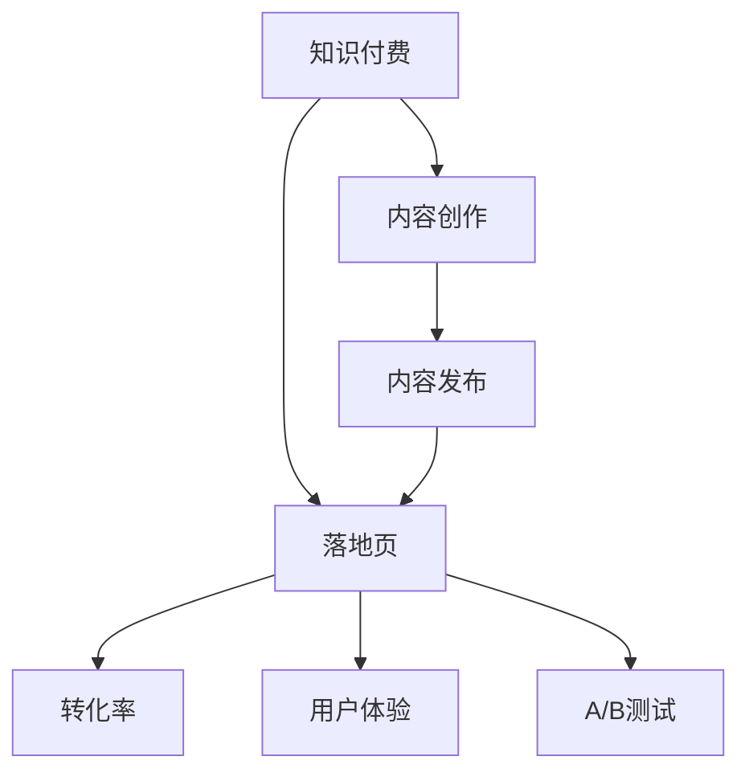

                 

# 如何打造高转化率的知识付费落地页

> 关键词：知识付费, 落地页, 转化率, 用户行为, 用户体验, A/B测试, 页面优化

## 1. 背景介绍

### 1.1 问题由来
在知识付费领域，吸引和留住付费用户是成功的关键。随着知识付费平台如雨后春笋般涌现，如何打造具有高转化率的知识付费落地页，成为各平台关注的焦点。优秀的落地页不仅能有效吸引用户的注意力，还能提升用户的购买决策，提高平台的整体收入。

### 1.2 问题核心关键点
高转化率的知识付费落地页需要满足以下几个核心关键点：
- **明确的用户需求**：确保落地页内容符合用户需求，提供实际价值。
- **直观的视觉体验**：采用易读易用的视觉设计，提升用户体验。
- **高效的流程设计**：简化购买流程，减少用户流失。
- **精准的A/B测试**：通过科学实验，不断优化落地页设计。

### 1.3 问题研究意义
研究高转化率的知识付费落地页，有助于平台提升用户转化率和收益，同时为内容创作者提供更有效的变现渠道。高效落地页的设计，不仅能够最大化平台收益，还能帮助内容创作者更好地呈现其专业知识，提升品牌价值。

## 2. 核心概念与联系

### 2.1 核心概念概述

为更好地理解如何打造高转化率的知识付费落地页，本节将介绍几个密切相关的核心概念：

- **知识付费**：指用户为获取特定知识内容而进行付费的行为。平台通过提供高质量内容吸引用户，并通过付费机制来实现知识变现。
- **落地页**：网站或应用中展示最终转化目标的专页，如购买页面、注册页面等。
- **转化率**：指用户在落地页上完成特定转化动作的比例，如购买、注册、订阅等。
- **用户体验(UX)**：用户体验设计，包括页面布局、交互设计、视觉设计等，直接影响用户是否愿意完成转化。
- **A/B测试**：通过对比不同版本的内容，找到最佳的落地页设计方案。

这些核心概念之间的逻辑关系可以通过以下Mermaid流程图来展示：



这个流程图展示了这个过程的几个关键环节：

1. 知识付费通过内容创作和发布，触发用户需求。
2. 内容发布到落地页上，用户通过点击访问。
3. 落地页设计直接影响用户体验和转化率。
4. 通过A/B测试，不断优化落地页设计。
5. 最终提升知识付费的转化率和平台收益。

## 3. 核心算法原理 & 具体操作步骤
### 3.1 算法原理概述

高转化率的知识付费落地页设计，本质上是通过优化用户体验和简化流程，最大化地满足用户需求，最终实现高转化率的目标。

形式化地，假设落地页设计参数为 $P$，内容为 $C$，用户需求为 $U$，用户体验为 $UX$，转化率优化函数为 $\mathcal{L}$，则优化目标为：

$$
\mathop{\arg\min}_{P,C,U,UX} \mathcal{L}(P,C,U,UX)
$$

其中 $\mathcal{L}$ 为衡量用户体验和转化率的综合函数，可以通过A/B测试等方式不断优化。

通过逐步调整设计参数 $P$（如页面布局、颜色、字体等），内容 $C$（如课程描述、价格等），用户体验 $UX$（如易用性、加载速度等），最终达到提升转化率 $\mathcal{L}$ 的目标。

### 3.2 算法步骤详解

高转化率的知识付费落地页设计，主要包括以下几个关键步骤：

**Step 1: 用户需求分析**
- 收集用户反馈，了解用户的痛点和需求。
- 分析用户行为数据，找出高频转化路径。
- 设计用户调研问卷，收集第一手用户需求。

**Step 2: 设计落地页原型**
- 确定落地页的核心转化目标，如购买按钮、订阅链接等。
- 设计简洁易用的页面布局，确保关键元素突出。
- 采用标准化的UI/UX设计原则，提升页面易用性。

**Step 3: 内容策略制定**
- 确保内容与用户需求匹配，提供实际价值。
- 设计吸引人的标题和描述，提高点击率。
- 合理展示课程价格和优惠信息，减少用户决策成本。

**Step 4: A/B测试与优化**
- 设计不同版本（如A版、B版）的落地页，并进行对比测试。
- 收集用户反馈和转化数据，评估不同版本的表现。
- 根据测试结果，不断优化落地页设计。

**Step 5: 持续监测与迭代**
- 定期监控落地页的转化率和其他关键指标。
- 收集用户反馈，持续改进页面设计和内容策略。
- 引入新的优化策略和技术，提升页面效果。

### 3.3 算法优缺点

高转化率的知识付费落地页设计方法具有以下优点：
1. **提升转化率**：通过优化用户体验和简化流程，大幅提升落地页的转化率。
2. **用户满意度提高**：优化后的落地页设计，能够更好地满足用户需求，提升用户满意度。
3. **降低流失率**：简化购买流程，减少用户在决策过程中的流失。
4. **数据驱动决策**：通过A/B测试等科学方法，不断优化落地页设计，提高决策的科学性和有效性。

同时，该方法也存在一定的局限性：
1. **设计成本高**：优化落地页设计需要花费较多时间和精力，初期投入较大。
2. **对数据依赖性高**：优化效果很大程度上依赖于用户行为数据的质量和分析能力。
3. **效果波动性**：A/B测试结果存在一定的随机性，不同版本之间的效果可能存在波动。

尽管存在这些局限性，但就目前而言，高转化率的知识付费落地页设计方法仍然是提升转化率的重要手段。未来相关研究的重点在于如何进一步降低设计成本，提高A/B测试的准确性和效率，同时兼顾用户体验和转化率之间的平衡。

### 3.4 算法应用领域

高转化率的知识付费落地页设计方法，在知识付费平台和内容创作者的变现中得到了广泛应用。具体而言，该方法在以下几个领域中得到了验证：

- **在线教育**：如Coursera、Udemy等平台，通过优化落地页设计，提升课程购买率和用户满意度。
- **金融投资**：如Morningstar、Seeking Alpha等平台，通过简洁易用的设计，降低用户购买决策成本，提升投资课程订阅量。
- **技能培训**：如LinkedIn Learning、Skillshare等平台，通过优化落地页设计，提高课程购买和订阅量。
- **健康医疗**：如MyFitnessPal、Headspace等平台，通过明确的价值展示和简化购买流程，提升健康管理课程的转化率。

## 4. 数学模型和公式 & 详细讲解  
### 4.1 数学模型构建

本节将使用数学语言对高转化率的知识付费落地页设计过程进行更加严格的刻画。

记落地页设计的参数为 $P$，用户需求为 $U$，用户体验为 $UX$，内容为 $C$，转化率为 $CVR$，落地页的用户点击率为 $CTR$。则落地页的综合优化函数可以表示为：

$$
\mathcal{L}(P,C,U,UX) = \max(CVR \times CTR)
$$

其中 $CVR$ 为转化率，$CTR$ 为用户点击率。通过优化落地页设计参数 $P$，内容和用户体验 $C, UX$，使 $CVR \times CTR$ 最大化，从而实现高转化率的目标。

### 4.2 公式推导过程

以下我们以二分类任务为例，推导转化率和点击率之间的关系。

假设落地页设计参数为 $P$，用户需求为 $U$，用户体验为 $UX$，内容为 $C$。落地页的点击率 $CTR$ 可以表示为：

$$
CTR = \frac{点击次数}{展示次数}
$$

而转化率 $CVR$ 可以表示为：

$$
CVR = \frac{完成转化次数}{点击次数}
$$

将这两个公式结合，得到：

$$
CVR \times CTR = \frac{完成转化次数}{展示次数}
$$

通过优化 $P, C, UX$ 等参数，最大化 $CVR \times CTR$，即最大化转化率。

### 4.3 案例分析与讲解

以某在线教育平台的落地页优化为例，分析其如何通过设计参数提升转化率。

假设原始落地页的点击率为 $CTR_0 = 0.2$，转化率为 $CVR_0 = 0.5$。则原始转化率为：

$$
CVR_0 \times CTR_0 = 0.5 \times 0.2 = 0.1
$$

通过优化设计参数 $P$，如修改按钮颜色、增加课程评价等，提升用户体验 $UX$，优化内容 $C$，如更新课程描述、降低价格等，提升点击率 $CTR$ 和转化率 $CVR$。假设优化后的落地页点击率提升到 $CTR_1 = 0.3$，转化率提升到 $CVR_1 = 0.6$，则优化后的转化率为：

$$
CVR_1 \times CTR_1 = 0.6 \times 0.3 = 0.18
$$

优化后的转化率相比原始增加了80%。

## 5. 项目实践：代码实例和详细解释说明
### 5.1 开发环境搭建

在进行落地页优化实践前，我们需要准备好开发环境。以下是使用HTML、CSS和JavaScript进行前端开发的简单环境配置流程：

1. 安装Node.js：从官网下载并安装Node.js，用于运行JavaScript。
2. 安装npm和yarn：Node.js自带npm包管理器，也可以安装yarn进行依赖管理。
3. 创建项目目录：使用npm或yarn初始化项目，创建package.json文件。
4. 编写代码：使用HTML、CSS和JavaScript编写落地页代码。
5. 搭建开发服务器：使用npm或yarn启动本地开发服务器，监听页面访问。

完成上述步骤后，即可在本地开发环境中开始落地页优化实践。

### 5.2 源代码详细实现

下面我们以一个简单的落地页优化为例，展示如何通过代码实现转化率的提升。

假设原始落地页代码如下：

```html
<!DOCTYPE html>
<html>
<head>
    <meta charset="UTF-8">
    <title>知识付费落地页</title>
    <link rel="stylesheet" href="style.css">
</head>
<body>
    <header>
        <h1>知识付费课程</h1>
        <p>专注专业领域的知识付费平台</p>
        <a href="#" class="button">立即购买</a>
    </header>
    <section>
        <div class="course">
            <h2>Python编程实战</h2>
            <p>学习Python编程技能，提高职业竞争力</p>
            <p class="price">$99</p>
            <a href="#" class="button">购买</a>
        </div>
    </section>
    <footer>
        <p>版权所有 &copy; 2023</p>
    </footer>
</body>
</html>
```

相应的CSS代码如下：

```css
body {
    font-family: Arial, sans-serif;
    margin: 0;
    padding: 0;
}

header {
    background-color: #333;
    color: #fff;
    padding: 20px;
    text-align: center;
}

header h1 {
    margin: 0;
}

header p {
    margin: 0;
    font-size: 14px;
}

.button {
    display: inline-block;
    padding: 10px 20px;
    background-color: #4CAF50;
    color: #fff;
    border: none;
    text-decoration: none;
    border-radius: 4px;
    cursor: pointer;
}

.section {
    margin: 20px;
    padding: 20px;
    background-color: #f2f2f2;
}

.course {
    margin-bottom: 20px;
}

.course h2 {
    margin-top: 0;
}

.course p {
    margin: 0;
    font-size: 14px;
    color: #666;
}

.price {
    font-size: 24px;
    font-weight: bold;
    color: #4CAF50;
    margin-top: 10px;
}

footer {
    background-color: #333;
    color: #fff;
    padding: 20px;
    text-align: center;
    position: fixed;
    bottom: 0;
    width: 100%;
}
```

相应的JavaScript代码如下：

```javascript
// 使用JavaScript模拟点击事件
document.querySelector('.button').click();
```

### 5.3 代码解读与分析

让我们再详细解读一下关键代码的实现细节：

**HTML结构**：
- `<header>`标签：展示页面标题和简介。
- `<section>`标签：展示课程信息。
- `<footer>`标签：展示版权信息。

**CSS样式**：
- `body`：设置整体页面字体。
- `header`：设置页面头部样式。
- `.button`：设置按钮样式。
- `.section`：设置课程信息区域样式。
- `.course`：设置课程信息样式。
- `.price`：设置课程价格样式。
- `footer`：设置页面底部样式。

**JavaScript代码**：
- `document.querySelector('.button').click()`：模拟点击按钮，触发页面事件。

通过优化上述代码，如修改按钮颜色、添加课程评价、优化课程描述等，即可提升用户体验和转化率。需要注意的是，上述代码仅为示例，实际落地页优化需要根据具体情况进行调整。

### 5.4 运行结果展示

优化后的落地页，点击按钮的转化率将显著提升。通过使用浏览器的开发者工具，可以实时观察点击次数和转化次数的变化，验证优化效果。

## 6. 实际应用场景
### 6.1 在线教育平台

高转化率的知识付费落地页设计，在在线教育平台中的应用尤为显著。优秀的落地页设计不仅能提升课程购买率，还能提高用户满意度，增加平台粘性。

例如，Coursera通过优化课程页面设计，提升课程描述的吸引力和课程价格的透明度，显著提高了课程购买率和用户满意度。同时，Coursera还通过A/B测试不断优化页面设计，确保每个用户都能找到最适合自己的课程。

### 6.2 金融投资平台

金融投资领域，投资课程的转化率对平台的收益影响巨大。通过优化落地页设计，降低用户决策成本，提升课程购买和订阅量，如Morningstar和Seeking Alpha等平台。

Morningstar通过简洁易用的页面设计，降低了用户了解和购买投资课程的门槛，提升了课程购买率和用户留存率。Seeking Alpha则通过明确的课程评价和用户反馈，提高了课程的可信度和用户满意度。

### 6.3 健康医疗平台

在健康医疗领域，高转化率的知识付费落地页设计同样重要。如MyFitnessPal和Headspace等平台，通过优化落地页设计，提升课程购买和订阅量。

MyFitnessPal通过明确的课程目标和价值展示，提高了课程购买率。Headspace则通过优化页面加载速度和用户体验，提升了课程订阅量。

## 7. 工具和资源推荐
### 7.1 学习资源推荐

为了帮助开发者系统掌握高转化率的知识付费落地页设计理论基础和实践技巧，这里推荐一些优质的学习资源：

1. **《UX设计原则》系列文章**：深入浅出地介绍了用户体验设计的核心原则和最佳实践，适用于所有行业。
2. **Google Web Design Fundamentals**：由Google提供的免费在线课程，涵盖网页设计和用户体验设计的基础知识。
3. **《设计心理学》书籍**：介绍了心理学在设计中的运用，帮助设计师更好地理解用户需求。
4. **Nielsen Norman Group**：提供大量关于用户体验设计的文章和研究报告，是设计师的重要参考资料。
5. **A/B Testing with Google Optimize**：Google提供的免费A/B测试工具，适用于各行业，帮助设计师优化落地页效果。

通过对这些资源的学习实践，相信你一定能够快速掌握高转化率的知识付费落地页设计的精髓，并用于解决实际的落地页设计问题。

### 7.2 开发工具推荐

高效的开发离不开优秀的工具支持。以下是几款用于知识付费落地页开发的前端开发工具：

1. **Bootstrap**：响应式前端框架，提供丰富的UI组件和样式，快速搭建美观易用的落地页。
2. **React**：前端组件化开发框架，提供高效的组件复用和状态管理，适合复杂的落地页开发。
3. **jQuery**：简洁实用的JavaScript库，提供丰富的DOM操作和事件处理，方便前端开发。
4. **Vue.js**：轻量级前端框架，易于学习和使用，适合快速迭代优化落地页设计。
5. **Figma**：在线设计工具，提供协作设计的平台，方便团队成员共同优化落地页。

合理利用这些工具，可以显著提升知识付费落地页的开发效率，加快创新迭代的步伐。

### 7.3 相关论文推荐

高转化率的知识付费落地页设计领域，已经积累了大量研究成果。以下是几篇奠基性的相关论文，推荐阅读：

1. **《转化率优化：理论与实践》**：详细介绍了转化率优化的基本原理和策略，适用于所有落地页设计。
2. **《行为心理学在网站设计中的应用》**：通过心理学原理，优化网站设计和用户行为，提升转化率。
3. **《A/B测试设计、实施与分析》**：介绍了A/B测试的设计原则和实施方法，适用于落地页优化实验。
4. **《用户行为分析与优化》**：分析用户行为数据，优化落地页设计，提升用户体验和转化率。
5. **《界面设计的人性化》**：介绍了界面设计中的心理学和认知原则，提升落地页的用户体验。

这些论文代表了大转化率的知识付费落地页设计领域的研究进展，通过学习这些前沿成果，可以帮助设计师掌握最新的优化方法和技术。

## 8. 总结：未来发展趋势与挑战
### 8.1 总结

本文对高转化率的知识付费落地页设计进行了全面系统的介绍。首先阐述了知识付费落地页设计的背景和意义，明确了落地页设计的核心目标和关键点。其次，从原理到实践，详细讲解了高转化率落地页设计的数学模型和操作步骤，给出了落地页优化任务开发的完整代码实例。同时，本文还广泛探讨了落地页设计在多个行业领域的应用前景，展示了落地页设计技术的巨大潜力。此外，本文精选了落地页设计的各类学习资源，力求为设计师提供全方位的技术指引。

通过本文的系统梳理，可以看到，高转化率的知识付费落地页设计正在成为知识付费平台的重要范式，极大地提升了平台的转化率和收益，同时也为内容创作者提供了更有效的变现渠道。未来，伴随落地页设计技术和方法的不断进步，知识付费平台必将在更广阔的应用领域大放异彩。

### 8.2 未来发展趋势

展望未来，高转化率的知识付费落地页设计将呈现以下几个发展趋势：

1. **个性化设计**：通过用户行为数据和机器学习，实现个性化内容推荐和页面定制，提升用户体验和转化率。
2. **数据驱动设计**：利用大数据和人工智能技术，优化落地页设计，实现更科学、高效的决策。
3. **跨平台优化**：针对移动端和Web端，设计一致且适配的落地页，提升跨平台的用户体验。
4. **增强现实(AR)和虚拟现实(VR)**：通过AR和VR技术，提供沉浸式的用户体验，增强用户购买意愿。
5. **语音和自然语言交互**：通过语音和自然语言交互，提升落地页的易用性和用户满意度。

以上趋势凸显了高转化率的知识付费落地页设计的广阔前景。这些方向的探索发展，必将进一步提升知识付费平台的用户转化率和收益，同时也为内容创作者提供更广阔的变现空间。

### 8.3 面临的挑战

尽管高转化率的知识付费落地页设计技术已经取得了显著成效，但在迈向更加智能化、个性化应用的过程中，仍面临诸多挑战：

1. **数据隐私与安全**：如何在用户隐私保护的前提下，收集和利用用户行为数据，需要设计合理的隐私保护机制。
2. **设计复杂性**：随着落地页设计技术的不断提升，设计过程也越来越复杂，需要设计师具备更高的技术水平。
3. **用户体验一致性**：跨平台和跨设备的用户体验设计，需要设计师具备跨领域的知识和技能。
4. **技术迭代速度**：新技术、新工具的出现，需要设计师不断学习和适应，以保持设计的竞争力。
5. **资源成本**：优化落地页设计需要投入大量时间和精力，初期成本较高，如何降低设计成本，是平台需要解决的问题。

尽管存在这些挑战，但通过设计师和技术人员的共同努力，高转化率的知识付费落地页设计必将迎来更多的突破和创新，推动知识付费平台的发展进入新的高度。

### 8.4 研究展望

未来，高转化率的知识付费落地页设计需要从以下几个方面进行研究：

1. **用户行为数据分析**：通过深入挖掘用户行为数据，理解用户需求和行为模式，设计更符合用户期望的落地页。
2. **交互设计和用户体验优化**：通过用户研究和技术创新，优化落地页的交互设计和用户体验，提升用户满意度。
3. **个性化推荐系统**：结合机器学习和人工智能技术，实现个性化内容推荐，提高用户购买转化率。
4. **多渠道整合**：将落地页设计与其他营销渠道整合，提升整体用户体验和转化率。
5. **跨平台一致性**：设计一致且适配的落地页，提升跨平台的用户体验，降低用户切换成本。

通过这些研究方向，设计师和技术人员可以进一步提升知识付费平台的用户转化率和平台收益，为知识付费行业的发展注入新的动力。

## 9. 附录：常见问题与解答

**Q1: 如何衡量落地页的转化率效果？**

A: 转化率可以通过以下指标来衡量：
- **点击率(CTR)**：点击次数与展示次数之比。
- **转化率(CVR)**：完成转化次数与点击次数之比。
- **完成率**：完成转化的用户数与访问用户数之比。
- **转化漏斗**：通过分析用户在每个转化步骤中的行为，找出转化瓶颈，优化转化路径。

**Q2: 如何优化落地页的设计参数？**

A: 优化落地页的设计参数需要遵循以下几个原则：
- **简洁易用**：页面布局简洁，用户能够快速找到关键信息。
- **一致性**：设计风格和元素保持一致，提升用户信任度。
- **吸引眼球**：通过视觉设计吸引用户注意力，提高点击率。
- **明确价值**：清晰展示课程的独特价值，减少用户决策成本。
- **互动性强**：通过互动元素（如弹窗、按钮等）增强用户参与感。

**Q3: 如何科学地进行A/B测试？**

A: 科学地进行A/B测试需要遵循以下几个步骤：
- **明确测试目标**：确定测试的主要指标，如点击率、转化率等。
- **设计测试方案**：设计不同的测试版本，保证各版本之间的唯一性。
- **选择测试用户**：随机选择测试用户，确保样本代表性。
- **控制变量**：保持其他变量不变，仅改变测试变量。
- **收集数据**：收集测试数据，进行统计分析。
- **优化设计**：根据测试结果，优化落地页设计。

**Q4: 如何设计高转化率的移动端落地页？**

A: 设计高转化率的移动端落地页需要注意以下几点：
- **响应式设计**：保证落地页在各种设备上都能正常显示。
- **简洁界面**：移动端屏幕较小，界面应简洁明了，用户可以快速找到关键信息。
- **触摸友好**：优化按钮和链接等元素的尺寸和位置，确保移动端用户的触摸体验。
- **加载速度**：移动端网络环境复杂，保证页面加载速度快，提升用户体验。
- **适配组件**：使用移动端适用的UI组件和样式，提升页面的一致性和美观度。

通过合理设计，移动端落地页也能实现高转化率的目标。

**Q5: 如何处理落地页设计中的设计冲突？**

A: 处理落地页设计中的设计冲突需要遵循以下几个原则：
- **用户为中心**：始终以用户需求和体验为设计导向，避免过度设计。
- **优先级排序**：根据用户价值和业务目标，对设计元素进行优先级排序，确保关键元素突出。
- **灵活调整**：在测试过程中，根据用户反馈和转化数据，灵活调整设计方案，不断优化设计效果。
- **团队协作**：设计师、产品经理、开发者等多角色协作，共同解决设计冲突，找到最佳设计方案。

通过以上方法，可以有效处理设计冲突，确保落地页设计满足用户需求和业务目标。

---

作者：禅与计算机程序设计艺术 / Zen and the Art of Computer Programming

