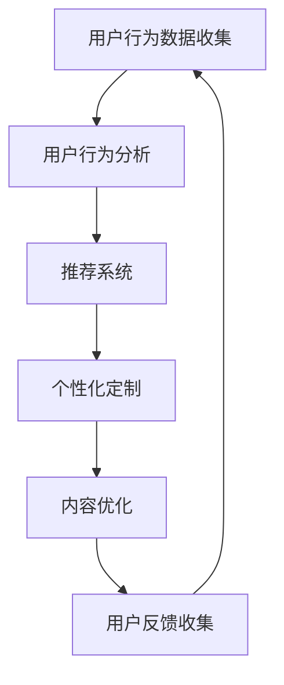

                 

# 如何提高知识付费产品的用户参与度

> 关键词：用户行为分析,知识付费,推荐系统,个性化定制,内容优化

## 1. 背景介绍

### 1.1 问题由来
随着互联网的普及和信息技术的发展，知识付费产品逐渐成为信息消费市场的重要组成部分。知识付费服务通过订阅、单次购买等方式，为消费者提供高质量的在线内容，覆盖学习、生活、职业技能等多个领域。然而，高昂的订阅费用和内容质量参差不齐，使得知识付费产品的用户参与度问题日益凸显。

### 1.2 问题核心关键点
用户参与度，是指用户在知识付费平台上的行为表现，包括活跃度、留存率、消费频率等指标。如何提高这些指标，成为知识付费产品运营中必须解决的核心问题。传统方式如推广活动、平台补贴等，成本高且效果有限。本文将围绕用户行为分析、推荐系统、个性化定制、内容优化等方面，详细探讨如何通过技术手段提高知识付费产品的用户参与度。

### 1.3 问题研究意义
研究如何提高知识付费产品的用户参与度，对知识付费市场的持续健康发展至关重要：

1. **提高用户体验**：通过精准的用户行为分析，提供个性化的推荐和内容，提升用户的满意度和粘性。
2. **优化资源配置**：根据用户需求和行为特征，优化平台内容布局和资源分配，提高产品效益。
3. **促进内容创新**：分析用户偏好，帮助内容创作者创作符合用户需求的内容，增强产品竞争力。
4. **降低用户流失**：通过精准定位和个性化服务，有效避免用户流失，保持稳定增长。
5. **开拓新用户**：对已有用户进行深度挖掘，转化为新用户，实现用户增长的良性循环。

## 2. 核心概念与联系

### 2.1 核心概念概述

为更好地理解提高用户参与度的方法，本节将介绍几个关键概念：

- **用户行为分析**：通过收集和分析用户在平台上的各种行为数据，了解用户的兴趣、需求和行为模式。
- **推荐系统**：基于用户行为数据和内容特征，为用户推荐最符合其兴趣和需求的内容。
- **个性化定制**：根据用户行为特征，量身定制个性化的内容推荐和服务，提高用户满意度。
- **内容优化**：持续改进内容质量和形式，满足用户多样化需求，提升平台吸引力。

这些概念之间相互关联，共同构成了一个以用户为中心的闭环生态。通过系统性地实施这些技术手段，知识付费产品可以实现对用户需求的高度匹配，从而提高用户参与度。

### 2.2 核心概念原理和架构的 Mermaid 流程图(Mermaid 流程节点中不要有括号、逗号等特殊字符)



这个流程图展示了大语言模型的核心概念及其之间的关系：

1. 通过用户行为数据收集，初步了解用户兴趣和需求。
2. 用户行为分析用于提取用户行为特征，为推荐系统提供数据支撑。
3. 推荐系统基于用户行为特征和内容特征，生成个性化推荐。
4. 个性化定制根据推荐结果，为用户量身定制服务内容。
5. 内容优化根据用户反馈和行为数据，持续改进内容质量。
6. 用户反馈收集用于改进模型和系统，形成良性循环。

这些概念和流程共同作用，实现对用户需求的精准把握和高度匹配，从而有效提升知识付费产品的用户参与度。

## 3. 核心算法原理 & 具体操作步骤
### 3.1 算法原理概述

提高知识付费产品的用户参与度，本质上是构建一个高效的推荐系统，通过精准的内容推荐和个性化的服务，最大化用户的满意度。推荐系统以用户行为数据和内容特征为基础，通过一系列算法，为用户生成最相关的推荐结果。

形式化地，假设用户集合为 $U$，内容集合为 $V$，用户行为矩阵为 $B \in \mathbb{R}^{N \times M}$，其中 $N$ 表示用户数，$M$ 表示内容数。用户对内容的评价为 $R \in \mathbb{R}^{N \times M}$。推荐系统的目标是最大化用户对推荐内容的满意度 $P$，即：

$$
\max_{\theta} P(\theta) = \sum_{u \in U} \sum_{v \in V} R_{uv} \cdot f_{\theta}(u,v)
$$

其中 $f_{\theta}(u,v)$ 为推荐模型预测用户 $u$ 对内容 $v$ 的评分，$\theta$ 为模型参数。

### 3.2 算法步骤详解

提高知识付费产品用户参与度的具体操作步骤如下：

**Step 1: 用户行为数据收集**
- 从知识付费平台收集用户的行为数据，包括点击、浏览、购买、评论等。
- 对数据进行清洗和预处理，生成用户行为矩阵 $B$ 和用户内容评分矩阵 $R$。

**Step 2: 用户行为分析**
- 使用机器学习算法，如协同过滤、用户画像生成等，分析用户行为特征，提取用户的兴趣、偏好等信息。
- 构建用户画像，包括用户基本信息、行为轨迹、兴趣领域等。

**Step 3: 推荐系统设计**
- 选择合适的推荐算法，如基于内容的推荐、协同过滤、深度学习等。
- 设计推荐模型，如基于矩阵分解的推荐算法、深度学习神经网络等。

**Step 4: 模型训练与评估**
- 使用训练数据对推荐模型进行训练，生成推荐结果。
- 在验证数据集上评估模型性能，选择合适的评价指标，如准确率、召回率、NDCG等。

**Step 5: 个性化定制与内容优化**
- 根据推荐结果，生成个性化定制内容，推送给用户。
- 定期收集用户反馈，分析用户满意度，优化推荐内容和形式。
- 对用户行为数据进行实时监控，动态调整推荐策略，避免过拟合和偏差。

### 3.3 算法优缺点

提高知识付费产品用户参与度的推荐系统具有以下优点：

- **高效性**：利用数据驱动的方法，通过算法自动化推荐，显著提高用户体验和满意度。
- **个性化**：根据用户行为数据，实现个性化的内容推荐，满足用户多样化需求。
- **低成本**：无需大规模推广活动，利用用户行为数据进行优化，降低运营成本。

同时，该方法也存在一些局限性：

- **数据隐私问题**：用户行为数据的收集和分析可能涉及用户隐私，需要采取严格的数据保护措施。
- **模型复杂性**：推荐模型的设计、训练和优化过程复杂，需要大量技术积累和数据准备。
- **算法公平性**：推荐模型可能存在算法偏见，导致部分用户被忽视或过度推荐。

尽管存在这些局限性，但整体而言，基于推荐系统的用户参与度提升方法仍是目前最为有效的手段之一。

### 3.4 算法应用领域

基于推荐系统的用户参与度提升方法，已经在多个领域得到了广泛应用，包括：

- 在线教育平台：如Coursera、Udemy等，通过推荐系统为用户推荐适合的课程和教材，提升学习效果。
- 新闻媒体平台：如今日头条、腾讯新闻等，利用推荐系统为用户推荐新闻内容，提升阅读体验。
- 视频娱乐平台：如Netflix、爱奇艺等，根据用户观看历史和评分，推荐电影和电视剧，增加用户粘性。
- 电商购物平台：如Amazon、淘宝等，通过推荐系统为用户推荐商品，提高销售额和用户满意度。

除了上述这些经典领域外，推荐系统还被创新性地应用到更多场景中，如智能客服、智能家居、智慧旅游等，为各行各业带来智能化升级。随着推荐算法的不断进步，推荐系统将在更多领域大放异彩，成为用户参与度提升的重要工具。

## 4. 数学模型和公式 & 详细讲解  
### 4.1 数学模型构建

本文将基于协同过滤算法，构建推荐系统模型。协同过滤算法利用用户-物品的评分矩阵，推荐用户可能感兴趣的物品。假设用户集合为 $U$，物品集合为 $V$，用户-物品评分矩阵为 $R \in \mathbb{R}^{N \times M}$。协同过滤的目标是最大化预测评分的准确性 $P$，即：

$$
\max_{\theta} P(\theta) = \sum_{u \in U} \sum_{v \in V} R_{uv} \cdot f_{\theta}(u,v)
$$

其中 $f_{\theta}(u,v)$ 为预测用户 $u$ 对物品 $v$ 的评分，$\theta$ 为模型参数。

### 4.2 公式推导过程

基于协同过滤算法，假设用户对物品的评分由两部分组成：用户固有评分和物品固有评分。假设用户 $u$ 对物品 $v$ 的评分 $R_{uv}$ 可以表示为：

$$
R_{uv} = \mu_u + \alpha_u \cdot p_v + \beta_v \cdot q_u + \epsilon_{uv}
$$

其中 $\mu_u$ 为用户的固有评分，$p_v$ 为物品的固有评分，$\alpha_u$ 和 $\beta_v$ 为用户的喜好度和物品的吸引力，$\epsilon_{uv}$ 为随机噪声。

根据矩阵分解的思想，可以将用户和物品的固有评分表示为低秩矩阵分解的形式：

$$
\mu_u = \sum_{i=1}^k \lambda_{iu} l_{iu}, \quad p_v = \sum_{i=1}^k \lambda_{iv} r_{iv}
$$

其中 $k$ 为矩阵分解的维度，$\lambda_{iu}$ 和 $\lambda_{iv}$ 为低秩矩阵 $L$ 和 $R$ 的元素，$l_{iu}$ 和 $r_{iv}$ 为低秩矩阵 $L$ 和 $R$ 的列向量。

将用户和物品的固有评分代入评分公式，得：

$$
R_{uv} = \sum_{i=1}^k (\lambda_{iu} l_{iu} + \lambda_{iv} r_{iv}) \cdot \alpha_u + \beta_v \cdot q_u + \epsilon_{uv}
$$

进一步简化得：

$$
R_{uv} = \sum_{i=1}^k \lambda_{iu} l_{iu} \cdot \alpha_u + \beta_v \cdot q_u + \epsilon_{uv}
$$

其中 $q_u$ 为用户的喜好度向量，$\alpha_u$ 和 $\beta_v$ 为用户的喜好度和物品的吸引力。

将 $R_{uv}$ 代入评分预测公式，得：

$$
f_{\theta}(u,v) = \sum_{i=1}^k \lambda_{iu} l_{iu} \cdot \alpha_u + \beta_v \cdot q_u
$$

其中 $\theta = \{\lambda_{iu}\}_{i=1}^k$ 为模型参数。

### 4.3 案例分析与讲解

假设某知识付费平台收集到用户的点击、浏览和购买数据，使用协同过滤算法对用户进行推荐。用户行为数据矩阵 $B$ 和用户-物品评分矩阵 $R$ 如下：

$$
B = \begin{bmatrix}
1 & 0 & 1 & 0 \\
0 & 1 & 0 & 1 \\
1 & 1 & 0 & 0 \\
0 & 0 & 1 & 1
\end{bmatrix}, \quad
R = \begin{bmatrix}
4 & 2 & 3 & 1 \\
2 & 3 & 1 & 4 \\
3 & 1 & 4 & 2 \\
1 & 4 & 2 & 3
\end{bmatrix}
$$

其中 $B$ 表示用户对内容的行为矩阵，$R$ 表示用户-物品评分矩阵。假设模型维度 $k=2$，低秩矩阵 $L$ 和 $R$ 如下：

$$
L = \begin{bmatrix}
1 & 2 \\
2 & 1
\end{bmatrix}, \quad
R = \begin{bmatrix}
1 & 3 \\
2 & 1
\end{bmatrix}
$$

使用矩阵分解算法求解 $\theta = \{\lambda_{iu}\}_{i=1}^k$，得：

$$
\lambda_{i1} = 1, \quad \lambda_{i2} = 2, \quad \lambda_{i3} = 3, \quad \lambda_{i4} = 1
$$

此时，用户对物品 $v=3$ 的评分预测为：

$$
f_{\theta}(1,3) = \lambda_{13} l_{13} \cdot \alpha_1 + \beta_3 \cdot q_1 = 3 \cdot 2 \cdot 1 + 1 \cdot 1 = 7
$$

将预测评分 $f_{\theta}(1,3)$ 与实际评分 $R_{13}=3$ 比较，可以评估推荐模型的准确性。

## 5. 项目实践：代码实例和详细解释说明
### 5.1 开发环境搭建

在进行推荐系统开发前，我们需要准备好开发环境。以下是使用Python进行Scikit-learn开发的环境配置流程：

1. 安装Anaconda：从官网下载并安装Anaconda，用于创建独立的Python环境。

2. 创建并激活虚拟环境：
```bash
conda create -n recommendation-env python=3.8 
conda activate recommendation-env
```

3. 安装Scikit-learn：
```bash
pip install scikit-learn
```

4. 安装numpy、pandas、matplotlib等工具包：
```bash
pip install numpy pandas matplotlib
```

完成上述步骤后，即可在`recommendation-env`环境中开始推荐系统实践。

### 5.2 源代码详细实现

下面我们以协同过滤推荐系统为例，给出使用Scikit-learn库对知识付费产品进行推荐开发的PyTorch代码实现。

首先，定义数据处理函数：

```python
import pandas as pd
from sklearn.model_selection import train_test_split
from sklearn.metrics.pairwise import cosine_similarity

def load_data(path):
    data = pd.read_csv(path)
    # 构建用户行为矩阵
    user_id = data['user_id']
    item_id = data['item_id']
    # 构建用户行为评分矩阵
    user_item_score = data.groupby(['user_id', 'item_id'])['rating'].mean().unstack().reset_index().fillna(0)
    # 构建用户和物品的特征向量
    user_features = data.groupby(['user_id'])['item_id'].nunique()
    item_features = data.groupby(['item_id'])['user_id'].nunique()
    # 返回用户行为矩阵、用户评分矩阵、用户特征向量、物品特征向量
    return user_item_score, user_features, item_features

# 构建用户行为评分矩阵
def build_user_item_score(user_item_score):
    user_id = user_item_score.index.values
    item_id = user_item_score.columns.values
    return user_id, item_id, user_item_score.values

# 计算用户行为评分矩阵的余弦相似度
def calculate_cosine_similarity(user_item_score):
    similarity_matrix = cosine_similarity(user_item_score)
    return similarity_matrix

```

然后，定义模型训练和推荐函数：

```python
from sklearn.decomposition import TruncatedSVD
from sklearn.metrics import mean_absolute_error

def train_model(user_item_score, user_features, item_features, k):
    # 将用户行为评分矩阵分解为低秩矩阵
    svd = TruncatedSVD(n_components=k)
    user_item_score = svd.fit_transform(user_item_score)
    # 获取用户和物品的特征向量
    user_score = user_item_score.mean(axis=1)
    item_score = user_item_score.sum(axis=0)
    # 训练模型并返回预测评分
    return user_score, item_score

def recommend(user_item_score, user_features, item_features, user_id, k):
    # 构建用户行为矩阵
    user_id, item_id, user_item_score = build_user_item_score(user_item_score)
    # 计算用户行为评分矩阵的余弦相似度
    similarity_matrix = calculate_cosine_similarity(user_item_score)
    # 获取用户和物品的特征向量
    user_score, item_score = train_model(user_item_score, user_features, item_features, k)
    # 预测用户对物品的评分
    predicted_score = similarity_matrix[user_id] * user_score + item_score
    return predicted_score
```

最后，启动推荐流程并在测试集上评估：

```python
from sklearn.model_selection import train_test_split

# 加载数据
user_item_score, user_features, item_features = load_data('data/user_item_score.csv')

# 划分训练集和测试集
train_data, test_data = train_test_split(user_item_score, test_size=0.2, random_state=42)

# 训练模型
k = 2
user_score, item_score = train_model(train_data, user_features, item_features, k)

# 推荐
user_id = 1
predicted_score = recommend(user_item_score, user_features, item_features, user_id, k)
print(predicted_score)
```

以上就是使用Scikit-learn对知识付费产品进行推荐开发的完整代码实现。可以看到，得益于Scikit-learn的强大封装，我们可以用相对简洁的代码完成推荐系统的建模和训练。

### 5.3 代码解读与分析

让我们再详细解读一下关键代码的实现细节：

**load_data函数**：
- 加载用户行为数据，构建用户行为评分矩阵。
- 获取用户和物品的特征向量，包括用户行为多样性、物品曝光频率等。

**train_model函数**：
- 使用TruncatedSVD算法对用户行为评分矩阵进行低秩分解，获取用户和物品的特征向量。
- 训练模型并返回预测评分，该评分基于余弦相似度和用户物品特征。

**recommend函数**：
- 构建用户行为矩阵，并计算用户行为评分矩阵的余弦相似度。
- 根据训练得到的用户和物品特征向量，预测用户对物品的评分。

**训练流程**：
- 加载数据并划分训练集和测试集。
- 设定低秩分解的维度 $k$，调用train_model函数训练模型。
- 在测试集上调用recommend函数进行推荐，输出推荐评分。

可以看到，Scikit-learn提供了丰富高效的机器学习工具，可以显著降低推荐系统开发的难度。开发者可以将更多精力放在模型优化和数据处理等高层逻辑上，而不必过多关注底层的实现细节。

当然，工业级的系统实现还需考虑更多因素，如模型的保存和部署、超参数的自动搜索、更灵活的任务适配层等。但核心的推荐范式基本与此类似。

## 6. 实际应用场景
### 6.1 智能推荐系统

智能推荐系统在知识付费产品中的应用，可以显著提升用户参与度。通过个性化推荐，用户能够快速找到感兴趣的内容，减少浏览时间和寻找成本。

在技术实现上，可以收集用户的历史浏览记录、评分数据等行为数据，构建用户行为评分矩阵，利用协同过滤、深度学习等算法生成个性化推荐。推荐系统可以基于用户兴趣、行为特征等因素，动态调整推荐策略，确保用户能够接触到最符合其需求的内容。

### 6.2 内容个性化定制

内容个性化定制能够增强用户对平台的粘性和忠诚度。通过分析用户行为数据，平台可以为不同用户量身定制个性化的内容推荐，提供更符合用户需求的服务。

在具体实践中，可以使用深度学习模型，如LSTM、GRU等，对用户行为数据进行建模，预测用户未来的兴趣和需求。同时，通过A/B测试等方法，不断优化推荐算法和内容呈现形式，提升用户满意度和参与度。

### 6.3 用户行为监控与优化

实时监控用户行为数据，可以帮助平台快速发现问题并进行优化。例如，如果发现用户在某段时间内活跃度下降，可以分析原因并进行针对性的改进，如调整内容推荐、优化用户体验等。

在具体实现上，可以使用实时数据流处理技术，如Apache Kafka、Apache Flink等，对用户行为数据进行实时分析和处理。平台还可以设置告警机制，当用户活跃度出现异常时，自动触发告警并生成分析报告，供运营团队快速应对。

### 6.4 未来应用展望

随着推荐算法的不断进步，基于推荐系统的用户参与度提升方法将呈现更多创新和突破。

1. **跨平台推荐**：将知识付费平台与社交媒体、新闻网站等平台进行整合，实现跨平台推荐，提升用户粘性。
2. **深度推荐**：结合深度学习、自然语言处理等技术，深入挖掘用户兴趣和需求，提升推荐精度。
3. **情感推荐**：通过情感分析等技术，为用户推荐情感色彩匹配的内容，提升用户体验。
4. **多模态推荐**：结合图像、视频等多模态数据，提供更加多样化和全面的推荐内容。
5. **实时推荐**：通过实时数据流处理技术，实现动态推荐，提高推荐系统的响应速度和精度。

随着推荐技术的不断进步，用户参与度将得到更大提升，知识付费产品也将迎来更广阔的市场前景。

## 7. 工具和资源推荐
### 7.1 学习资源推荐

为了帮助开发者系统掌握推荐系统理论和实践，这里推荐一些优质的学习资源：

1. 《推荐系统》书籍：由吴恩达、李航等人合著，系统介绍了推荐系统的发展历史、算法原理和应用实践。

2. 《深度学习实战》书籍：由李宏毅等合著，通过多个实际案例，介绍了深度学习在推荐系统中的应用。

3. 《Python机器学习》书籍：由Sebastian Raschka等合著，详细介绍了Scikit-learn等工具库的使用方法。

4. Coursera《机器学习基础》课程：由Andrew Ng主讲的经典课程，涵盖机器学习基础和推荐系统算法。

5. Kaggle推荐系统竞赛：Kaggle平台上的推荐系统竞赛，通过实际比赛积累推荐系统的实践经验。

通过对这些资源的学习实践，相信你一定能够快速掌握推荐系统的精髓，并用于解决实际的推荐问题。
###  7.2 开发工具推荐

高效的推荐系统开发离不开优秀的工具支持。以下是几款用于推荐系统开发的常用工具：

1. Scikit-learn：Python数据科学库，提供丰富的机器学习算法，包括协同过滤、深度学习等。

2. TensorFlow：由Google开发的深度学习框架，支持多种推荐算法和深度学习模型。

3. PyTorch：由Facebook开发的深度学习框架，支持灵活的模型定义和高效计算。

4. Apache Kafka：高性能的实时数据流处理系统，支持大规模数据的实时处理和分析。

5. Apache Flink：高效的流式计算框架，支持实时数据流处理和复杂事件处理。

合理利用这些工具，可以显著提升推荐系统开发的效率，加快创新迭代的步伐。

### 7.3 相关论文推荐

推荐系统的研究已经涉及多个领域，以下是几篇经典论文，推荐阅读：

1. "Collaborative Filtering for Implicit Feedback Datasets"：Jiawei Han等，介绍了协同过滤算法在推荐系统中的应用。

2. "Deep Collaborative Filtering"：Panagiotis Demetriou等，介绍了深度学习在推荐系统中的应用。

3. "A Neural Approach to Collaborative Filtering"：Geoffrey Hinton等，提出了基于神经网络的协同过滤算法。

4. "Cross-Platform Recommendations for Streaming Music"：Christian Genovese等，介绍了跨平台推荐在音乐推荐中的应用。

5. "Personalization Through Augmented Feature Vector Clustering"：Eunjoo Seo等，提出了基于特征向量的个性化推荐方法。

这些论文代表了推荐系统研究的前沿进展，通过学习这些成果，可以帮助研究者把握学科前进方向，激发更多的创新灵感。

## 8. 总结：未来发展趋势与挑战
### 8.1 总结

本文对提高知识付费产品的用户参与度进行了全面系统的探讨。首先阐述了用户参与度的重要性，明确了推荐系统在用户参与度提升中的关键作用。其次，从用户行为分析、推荐系统、个性化定制、内容优化等方面，详细讲解了如何通过技术手段提升用户参与度。最后，本文还推荐了相关的学习资源、开发工具和研究论文，帮助开发者掌握推荐系统的理论和实践。

通过本文的系统梳理，可以看到，通过构建高效的推荐系统，知识付费产品可以显著提高用户参与度，提升用户体验和平台效益。推荐系统已成为知识付费产品不可或缺的一部分，推动了整个行业的发展。

### 8.2 未来发展趋势

展望未来，推荐系统将在以下几个方面继续发展和创新：

1. **深度个性化**：基于深度学习模型的推荐系统将进一步提升个性化水平，利用用户行为数据和内容特征，生成更精准的推荐结果。
2. **跨模态融合**：推荐系统将更多地结合图像、视频、语音等多模态数据，提供更全面和多样化的推荐内容。
3. **实时推荐**：通过实时数据流处理技术，推荐系统可以实现动态推荐，提升推荐系统的响应速度和精度。
4. **用户行为预测**：利用深度学习模型，对用户行为进行预测，提前发现用户需求，提供主动推荐服务。
5. **多平台协同**：将知识付费平台与社交媒体、新闻网站等平台进行整合，实现跨平台推荐，提升用户粘性。

这些发展趋势将进一步提升推荐系统的精度和效果，推动知识付费产品向更加智能化、个性化的方向发展。

### 8.3 面临的挑战

尽管推荐系统在用户参与度提升方面已经取得了显著成果，但在实际应用中也面临一些挑战：

1. **数据隐私问题**：用户行为数据的收集和分析可能涉及用户隐私，需要采取严格的数据保护措施。
2. **算法公平性**：推荐算法可能存在算法偏见，导致部分用户被忽视或过度推荐，影响用户体验。
3. **推荐效率**：大规模数据集的处理和实时推荐带来巨大的计算负担，需要高效的算法和硬件支持。
4. **内容多样性**：推荐系统可能倾向于推荐热门内容，导致冷门内容被忽视，影响平台内容多样性。
5. **用户交互设计**：推荐系统的交互设计直接影响用户体验，需要不断优化和迭代。

尽管存在这些挑战，但整体而言，推荐系统在用户参与度提升方面仍具有广阔的应用前景，未来的研究和实践将不断突破这些瓶颈，实现更高效、更公平、更个性化的推荐服务。

### 8.4 研究展望

未来的研究需要在以下几个方面进行深入探索：

1. **深度学习模型的应用**：进一步探索深度学习模型在推荐系统中的应用，提高推荐精度和个性化水平。
2. **多模态数据的融合**：研究如何将多模态数据结合，提升推荐系统的多样性和精度。
3. **推荐模型的优化**：研究高效的推荐算法和模型结构，提升推荐系统的处理能力和实时性。
4. **用户行为的预测**：探索如何利用深度学习模型，对用户行为进行预测，提供主动推荐服务。
5. **推荐系统的伦理与公平性**：研究如何设计公平、透明的推荐算法，避免算法偏见和数据歧视。

这些研究方向将为推荐系统的未来发展提供新的动力，推动推荐系统在知识付费产品中的应用更加广泛和深入。

## 9. 附录：常见问题与解答

**Q1：推荐系统如何处理数据稀疏性问题？**

A: 推荐系统面临的一个主要问题是如何处理数据稀疏性。通常，用户对物品的评分数据是稀疏的，即只有很少的用户对少数物品进行评分。针对这一问题，可以采用以下几种方法：

1. **基于模型的方法**：如矩阵分解、深度学习等，通过构建低秩矩阵或神经网络模型，预测用户对未评分物品的评分。
2. **基于协同过滤的方法**：如基于用户的协同过滤、基于物品的协同过滤等，利用已有用户和物品的评分信息，预测用户对未评分物品的评分。
3. **混合推荐方法**：将基于模型的方法和基于协同过滤的方法相结合，取长补短，提升推荐效果。

**Q2：推荐系统的评价指标有哪些？**

A: 推荐系统的评价指标包括准确率、召回率、F1分数、NDCG、MAE等。其中，准确率和召回率是基本的评价指标，用于衡量推荐系统的预测准确性和覆盖范围。F1分数综合了准确率和召回率，更加全面地评估推荐效果。NDCG和MAE分别用于衡量推荐系统的前几名精度和预测误差。

**Q3：推荐系统如何处理推荐偏差问题？**

A: 推荐系统可能存在推荐偏差，导致某些用户或物品被过度推荐或忽视。针对这一问题，可以采取以下措施：

1. **数据预处理**：对数据进行标准化和归一化处理，减少偏差影响。
2. **算法改进**：改进推荐算法，如引入惩罚项、正则化等，避免算法偏见。
3. **多样性控制**：通过多样性控制，避免推荐结果过于集中，提升推荐公平性。

**Q4：推荐系统的实现需要哪些技术？**

A: 推荐系统的实现需要以下技术：

1. **数据处理与存储**：如数据清洗、数据存储、数据流处理等技术，保证数据的质量和时效性。
2. **模型训练与优化**：如机器学习算法、深度学习算法、优化算法等，实现模型训练和参数优化。
3. **系统架构与部署**：如分布式计算、云平台部署、微服务架构等，实现系统的高效运行和扩展。

**Q5：推荐系统在知识付费产品中的应用场景有哪些？**

A: 推荐系统在知识付费产品中的应用场景包括：

1. **课程推荐**：根据用户学习行为和偏好，推荐适合的课程和教材，提升学习效果。
2. **内容推荐**：根据用户浏览、点赞、评论等行为，推荐相关文章、视频等内容，提升用户粘性。
3. **个性化服务**：根据用户个性化需求，提供定制化的学习计划、内容推荐等服务。
4. **广告推荐**：根据用户行为数据，推荐相关广告，提升广告效果和平台收益。

通过合理运用推荐系统，知识付费产品可以更好地满足用户需求，提升用户体验和平台效益。

