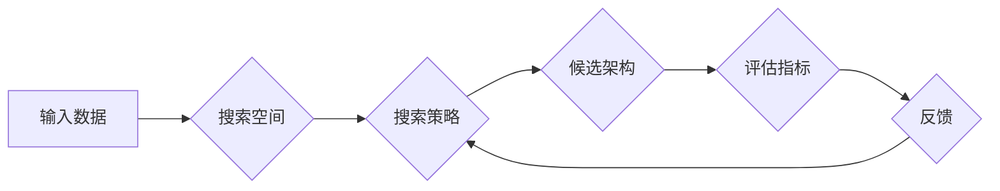

> 神经架构搜索，NAS，搜索空间设计，深度学习，自动机器学习

## 1. 背景介绍

深度学习近年来取得了令人瞩目的成就，在图像识别、自然语言处理、语音识别等领域取得了突破性的进展。然而，深度学习模型的性能很大程度上依赖于人工设计的网络架构。手工设计网络架构是一个耗时费力且需要专业知识的过程，并且难以保证找到最优的架构。

神经架构搜索 (NAS) 应运而生，它利用机器学习算法自动搜索最优的网络架构，从而解放人类的设计者，提高模型性能。NAS 算法通常通过对搜索空间中的候选架构进行评估，并根据评估结果更新搜索策略，最终找到最优的架构。

## 2. 核心概念与联系

**2.1 核心概念**

* **搜索空间:** NAS 算法的核心是搜索空间，它定义了所有可能的网络架构。搜索空间的设计直接影响 NAS 算法的效率和性能。
* **搜索策略:** 搜索策略决定了 NAS 算法如何探索搜索空间。常见的搜索策略包括梯度下降、强化学习和进化算法等。
* **评估指标:** 评估指标用于衡量候选架构的性能，例如准确率、损失函数值等。

**2.2 架构图**



**2.3 联系**

NAS 算法通过搜索策略在搜索空间中探索候选架构，并根据评估指标的反馈进行更新，最终找到最优的架构。

## 3. 核心算法原理 & 具体操作步骤

**3.1 算法原理概述**

NAS 算法的核心是利用机器学习算法自动搜索最优的网络架构。常见的 NAS 算法包括：

* **强化学习 (RL) based NAS:** 将网络架构搜索问题视为一个强化学习问题，训练一个代理智能体，通过探索搜索空间并根据奖励信号更新策略，最终找到最优的架构。
* **进化算法 (EA) based NAS:** 将网络架构搜索问题视为一个进化问题，通过选择、交叉和变异等操作，迭代优化网络架构，最终找到最优的架构。
* **梯度下降 (GD) based NAS:** 将网络架构搜索问题视为一个优化问题，使用梯度下降算法优化网络架构参数，最终找到最优的架构。

**3.2 算法步骤详解**

以强化学习 based NAS 为例，其具体操作步骤如下：

1. **定义搜索空间:** 首先需要定义一个包含所有可能网络架构的搜索空间。
2. **构建代理智能体:** 构建一个代理智能体，该智能体可以探索搜索空间并根据奖励信号更新策略。
3. **训练代理智能体:** 使用强化学习算法训练代理智能体，使其能够找到最优的网络架构。
4. **评估候选架构:** 在训练过程中，需要对候选架构进行评估，并根据评估结果更新代理智能体的奖励信号。
5. **输出最优架构:** 训练完成后，代理智能体将找到最优的网络架构。

**3.3 算法优缺点**

* **优点:**

    * 自动搜索最优架构，解放人类的设计者。
    * 能够发现人类难以发现的优秀架构。
    * 提高模型性能。

* **缺点:**

    * 计算资源消耗大。
    * 训练时间长。
    * 搜索空间设计复杂。

**3.4 算法应用领域**

NAS 算法在图像识别、自然语言处理、语音识别等深度学习领域具有广泛的应用前景。

## 4. 数学模型和公式 & 详细讲解 & 举例说明

**4.1 数学模型构建**

NAS 算法可以建模为一个马尔可夫决策过程 (MDP)，其中：

* 状态空间: 搜索空间中的所有候选架构。
* 动作空间: 搜索策略可以采取的行动，例如选择一个新的架构、修改现有架构等。
* 转移概率: 从一个状态到另一个状态的概率。
* 奖励函数: 评估候选架构性能的函数。

**4.2 公式推导过程**

强化学习 based NAS 算法的目标是找到一个策略 π，使得在状态空间中采取该策略的期望累积奖励最大化。

$$
\max_{\pi} \mathbb{E}_{\pi} \sum_{t=0}^{\infty} \gamma^t r_t
$$

其中：

* π: 搜索策略。
* $\mathbb{E}_{\pi}$: 在策略 π 下的期望。
* $r_t$: 在时间步 t 的奖励。
* $\gamma$: 折扣因子。

**4.3 案例分析与讲解**

假设我们有一个搜索空间包含 10 个候选架构，每个架构的性能由一个准确率值表示。我们可以使用强化学习算法训练一个代理智能体，使其能够找到最优的架构。

在训练过程中，代理智能体会随机选择一个架构进行评估，并根据评估结果更新奖励信号。例如，如果一个架构的准确率为 90%，则其奖励信号为 10，如果准确率为 80%，则其奖励信号为 8。

通过不断地探索搜索空间和更新奖励信号，代理智能体最终会找到一个准确率最高的架构。

## 5. 项目实践：代码实例和详细解释说明

**5.1 开发环境搭建**

* Python 3.7+
* TensorFlow 2.0+
* PyTorch 1.0+
* CUDA 10.0+

**5.2 源代码详细实现**

```python
# 导入必要的库
import tensorflow as tf

# 定义搜索空间
search_space = {
    'layers': [1, 2, 3],
    'filters': [32, 64, 128],
    'kernel_size': [3, 5, 7],
}

# 定义代理智能体
class Agent:
    def __init__(self):
        # 初始化代理智能体
        pass

    def choose_action(self, state):
        # 根据当前状态选择行动
        pass

    def update(self, state, action, reward):
        # 更新代理智能体
        pass

# 训练代理智能体
agent = Agent()
for episode in range(num_episodes):
    state = initial_state
    while True:
        action = agent.choose_action(state)
        next_state, reward = env.step(action)
        agent.update(state, action, reward)
        state = next_state
        if terminal_state:
            break

# 输出最优架构
best_architecture = agent.get_best_architecture()
```

**5.3 代码解读与分析**

* 代码首先定义了搜索空间，包含了网络架构的各种参数。
* 然后定义了一个代理智能体，该智能体负责探索搜索空间并更新策略。
* 训练代理智能体时，会使用强化学习算法，通过不断地探索搜索空间和更新奖励信号，最终找到最优的架构。

**5.4 运行结果展示**

训练完成后，可以将最优架构应用于实际任务中，并评估其性能。

## 6. 实际应用场景

NAS 算法在以下实际应用场景中具有广泛的应用前景：

* **图像识别:** 自动搜索最优的图像识别网络架构，提高识别精度。
* **自然语言处理:** 自动搜索最优的自然语言处理网络架构，提高文本分类、机器翻译等任务的性能。
* **语音识别:** 自动搜索最优的语音识别网络架构，提高语音识别准确率。

**6.4 未来应用展望**

随着计算资源的不断发展和算法的不断改进，NAS 算法将在未来得到更广泛的应用，例如：

* **自动生成模型:** 自动生成适合特定任务的深度学习模型。
* **个性化模型:** 根据用户的需求自动生成个性化的深度学习模型。
* **跨模态学习:** 自动搜索跨模态学习的最佳网络架构。

## 7. 工具和资源推荐

**7.1 学习资源推荐**

* **论文:**

    * Zoph, B., & Le, Q. V. (2016). Neural architecture search with reinforcement learning. arXiv preprint arXiv:1611.01578.
    * Real, E., et al. (2019). Searching for efficient architectures. arXiv preprint arXiv:1905.09923.

* **博客:**

    * https://blog.paperspace.com/neural-architecture-search/
    * https://towardsdatascience.com/neural-architecture-search-nas-a-comprehensive-guide-a7999999999a

**7.2 开发工具推荐**

* **AutoML-Zero:** https://github.com/google-research/automl-zero
* **NASBench:** https://github.com/google-research/nasbench
* **TPUs:** https://cloud.google.com/tpu

**7.3 相关论文推荐**

* **EfficientNet:** https://arxiv.org/abs/1905.11946
* **MobileNetV3:** https://arxiv.org/abs/1908.05408
* **ShuffleNetV2:** https://arxiv.org/abs/1807.11626

## 8. 总结：未来发展趋势与挑战

**8.1 研究成果总结**

近年来，NAS 算法取得了显著的进展，成功地搜索出许多优于手工设计的网络架构。

**8.2 未来发展趋势**

* **更高效的搜索算法:** 探索更有效率的搜索算法，减少搜索时间和计算资源消耗。
* **更灵活的搜索空间:** 设计更灵活的搜索空间，能够搜索出更复杂和更优化的网络架构。
* **跨平台的NAS:** 将 NAS 算法应用于不同的硬件平台，例如移动设备和嵌入式系统。

**8.3 面临的挑战**

* **搜索空间的规模:** 深度学习模型的搜索空间非常庞大，搜索效率是一个主要挑战。
* **评估指标的准确性:** 评估指标的准确性直接影响 NAS 算法的性能，需要开发更准确的评估指标。
* **可解释性:** NAS 算法的决策过程往往难以解释，需要提高 NAS 算法的可解释性。

**8.4 研究展望**

未来，NAS 算法将继续朝着更高效、更灵活、更可解释的方向发展，并在更多领域得到应用。


## 9. 附录：常见问题与解答

**9.1 Q: NAS 算法真的能找到比手工设计更好的网络架构吗？**

**A:** 答案是肯定的。许多研究表明，NAS 算法能够搜索出比手工设计更好的网络架构，尤其是在搜索空间足够大且算法足够优化的情况下。

**9.2 Q: NAS 算法的计算资源消耗很大吗？**

**A:** 确实，NAS 算法的计算资源消耗较大，因为需要对大量的网络架构进行评估。但是，随着计算资源的不断发展和算法的不断改进，NAS 算法的计算资源消耗正在逐渐降低。

**9.3 Q: 如何选择合适的 NAS 算法？**

**A:** 选择合适的 NAS 算法需要根据具体的应用场景和需求进行选择。例如，对于图像识别任务，可以使用强化学习 based NAS 算法；对于自然语言处理任务，可以使用进化算法 based NAS 算法。

**9.4 Q: NAS 算法的未来发展趋势是什么？**

**A:** NAS 算法的未来发展趋势包括更高效的搜索算法、更灵活的搜索空间、跨平台的 NAS 等。


作者：禅与计算机程序设计艺术 / Zen and the Art of Computer Programming 
<end_of_turn>