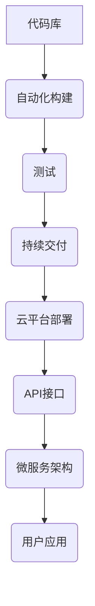

> 程序员，被动收入，自动化，持续交付，云平台，API，微服务，容器化

## 1. 背景介绍

在当今科技飞速发展的时代，程序员的需求量持续增长，但同时，程序员也面临着越来越大的工作压力和竞争。如何实现程序员的“被动收入”，让代码持续为我们创造价值，成为越来越多程序员的追求。

传统的被动收入模式，例如投资理财、写书出版等，对程序员来说门槛较高，且收益相对稳定。而“程序员的被动收入”则更侧重于利用程序员的专业技能，通过构建和维护自动化系统、API接口、微服务架构等，实现代码的持续价值创造。

## 2. 核心概念与联系

**2.1 核心概念**

* **自动化:** 通过脚本、工具和平台，将重复性、耗时的任务自动化，提高效率，降低人工成本。
* **持续交付 (CI/CD):**  将代码从开发到部署的整个流程自动化，实现快速迭代和持续发布。
* **云平台:** 利用云计算平台的弹性、可扩展性和成本效益，构建和部署应用程序。
* **API (应用程序接口):**  定义应用程序之间数据交换的规则和协议，实现不同系统之间的互联互通。
* **微服务:** 将大型应用程序拆分成多个小型、独立的服务，每个服务负责特定的功能，提高系统的可维护性和扩展性。
* **容器化:** 将应用程序及其依赖环境打包成容器，实现应用程序的隔离和可移植性。

**2.2 核心架构**



## 3. 核心算法原理 & 具体操作步骤

**3.1 算法原理概述**

构建“程序员的被动收入”系统，需要结合多种算法和技术，例如：

* **版本控制算法:**  管理代码的版本和历史记录，确保代码的稳定性和可追溯性。
* **自动化测试算法:**  自动执行测试用例，检测代码的质量和稳定性。
* **持续交付算法:**  自动构建、测试和部署代码，实现快速迭代和持续发布。
* **API接口设计算法:**  设计高效、安全的API接口，实现不同系统之间的互联互通。
* **微服务架构算法:**  将大型应用程序拆分成多个小型、独立的服务，提高系统的可维护性和扩展性。

**3.2 算法步骤详解**

1. **代码开发:**  编写高质量的代码，并进行代码审查和测试。
2. **版本控制:**  使用版本控制系统，例如Git，管理代码的版本和历史记录。
3. **自动化构建:**  使用自动化构建工具，例如Jenkins，自动构建代码，生成可部署的软件包。
4. **自动化测试:**  使用自动化测试工具，例如Selenium，自动执行测试用例，检测代码的质量和稳定性。
5. **持续交付:**  使用持续交付平台，例如GitLab CI/CD，自动部署代码到测试环境和生产环境。
6. **API接口设计:**  设计高效、安全的API接口，实现不同系统之间的互联互通。
7. **微服务架构:**  将大型应用程序拆分成多个小型、独立的服务，提高系统的可维护性和扩展性。
8. **监控和维护:**  使用监控工具，例如Prometheus，监控系统的运行状态，并及时修复问题。

**3.3 算法优缺点**

* **优点:**  提高效率、降低成本、实现持续价值创造。
* **缺点:**  需要一定的技术门槛、需要投入时间和精力进行维护。

**3.4 算法应用领域**

* **软件开发:**  自动化构建、测试和部署代码，提高开发效率。
* **云计算:**  构建和管理云平台服务，实现弹性、可扩展性和成本效益。
* **数据分析:**  自动化数据处理和分析，提取数据价值。
* **人工智能:**  自动化机器学习模型训练和部署，提高人工智能应用效率。

## 4. 数学模型和公式 & 详细讲解 & 举例说明

**4.1 数学模型构建**

构建“程序员的被动收入”系统，需要考虑以下数学模型：

* **收益模型:**  计算系统产生的收入，例如API调用费用、订阅费用等。
* **成本模型:**  计算系统运行的成本，例如云平台费用、服务器费用等。
* **ROI模型:**  计算系统的投资回报率，评估系统的盈利能力。

**4.2 公式推导过程**

* **收益模型:**  

$$
Revenue = API_calls * API_price + Subscriptions * Subscription_price
$$

* **成本模型:**

$$
Cost = Cloud_platform_cost + Server_cost + Maintenance_cost
$$

* **ROI模型:**

$$
ROI = (Revenue - Cost) / Investment * 100%
$$

**4.3 案例分析与讲解**

假设一个程序员开发了一个API接口，用于提供天气预报服务，每个API调用收费0.01美元，每月有10000个API调用，订阅费用为10美元/月，有100个订阅用户。

* **收益:**  

$$
Revenue = 10000 * 0.01 + 100 * 10 = 100 + 1000 = 1100美元
$$

* **成本:**  

$$
Cost = Cloud_platform_cost + Server_cost + Maintenance_cost = 500美元
$$

* **ROI:**

$$
ROI = (1100 - 500) / 1000 * 100% = 60%
$$

## 5. 项目实践：代码实例和详细解释说明

**5.1 开发环境搭建**

* **操作系统:**  Linux (Ubuntu/CentOS)
* **编程语言:**  Python
* **框架:**  Flask/Django
* **数据库:**  MySQL/PostgreSQL
* **云平台:**  AWS/Azure/GCP

**5.2 源代码详细实现**

```python
from flask import Flask, jsonify

app = Flask(__name__)

@app.route('/weather/<city>')
def get_weather(city):
    # 调用天气预报API获取天气数据
    weather_data = get_weather_data(city)
    return jsonify(weather_data)

if __name__ == '__main__':
    app.run(debug=True)
```

**5.3 代码解读与分析**

* **Flask框架:**  用于构建RESTful API接口。
* **路由:**  `/weather/<city>` 路由用于处理天气预报请求，其中`<city>`为城市名称参数。
* **视图函数:**  `get_weather`函数用于处理天气预报请求，调用天气预报API获取天气数据，并返回JSON格式的响应。

**5.4 运行结果展示**

访问 `http://localhost:5000/weather/北京`，即可获取北京市的实时天气预报数据。

## 6. 实际应用场景

* **天气预报应用:**  提供实时天气预报数据，用于天气预报网站、移动应用等。
* **旅游预订系统:**  提供旅游目的地天气预报数据，帮助用户规划行程。
* **农业生产管理系统:**  提供农业区域天气预报数据，帮助农民进行科学种植。
* **物流运输管理系统:**  提供天气预报数据，帮助物流公司优化运输路线和时间。

**6.4 未来应用展望**

随着人工智能、物联网等技术的不断发展，程序员的被动收入模式将更加多样化和智能化。例如：

* **自动生成代码:**  利用人工智能技术，自动生成代码，降低开发成本和时间。
* **智能化运维:**  利用人工智能技术，实现系统自动监控、故障诊断和修复，降低运维成本。
* **个性化服务:**  利用数据分析技术，提供个性化的服务，例如个性化推荐、定制化产品等。

## 7. 工具和资源推荐

**7.1 学习资源推荐**

* **书籍:**  《Python编程从入门到实践》、《Flask Web开发实战》
* **在线课程:**  Coursera、Udemy、edX
* **博客:**  Real Python、Flask Mega-Tutorial

**7.2 开发工具推荐**

* **版本控制系统:**  Git
* **自动化构建工具:**  Jenkins
* **持续交付平台:**  GitLab CI/CD
* **云平台:**  AWS、Azure、GCP

**7.3 相关论文推荐**

* **持续交付的实践与挑战**
* **微服务架构的演进与应用**
* **人工智能在软件开发中的应用**

## 8. 总结：未来发展趋势与挑战

**8.1 研究成果总结**

本文介绍了“程序员的被动收入”的概念、核心技术和应用场景，并探讨了未来发展趋势和挑战。

**8.2 未来发展趋势**

* **自动化程度不断提高:**  人工智能、机器学习等技术将进一步提高自动化程度，降低程序员的工作成本。
* **服务化和平台化:**  程序员将更加倾向于构建和维护服务和平台，而不是单一的应用程序。
* **数据驱动和个性化:**  数据分析和人工智能技术将推动程序员的被动收入模式更加数据驱动和个性化。

**8.3 面临的挑战**

* **技术门槛:**  构建和维护“程序员的被动收入”系统需要一定的技术门槛，需要程序员不断学习和提升技能。
* **安全风险:**  系统需要保障数据安全和系统稳定性，需要程序员关注安全风险和漏洞。
* **市场竞争:**  程序员的被动收入模式面临着市场竞争，需要程序员不断创新和优化产品和服务。

**8.4 研究展望**

未来，我们将继续研究“程序员的被动收入”模式，探索更智能化、更自动化、更安全、更可持续的解决方案，帮助程序员实现持续价值创造。

## 9. 附录：常见问题与解答

**9.1 如何选择合适的云平台？**

选择云平台需要考虑以下因素：

* **成本:**  不同云平台的收费标准不同，需要根据自己的预算选择合适的平台。
* **功能:**  不同云平台提供的功能不同，需要根据自己的需求选择合适的平台。
* **地域:**  不同云平台的地域分布不同，需要选择地理位置合适的平台。

**9.2 如何保障系统的安全？**

保障系统的安全需要采取以下措施：

* **使用安全的密码:**  设置强密码，并定期更换密码。
* **启用多因素身份验证:**  使用多因素身份验证，增加登录安全性。
* **定期更新软件:**  及时更新软件，修复漏洞。
* **监控系统日志:**  定期监控系统日志，及时发现异常行为。

**9.3 如何维护系统？**

系统维护需要定期进行以下操作：

* **备份数据:**  定期备份数据，防止数据丢失。
* **检查系统日志:**  定期检查系统日志，发现问题并及时修复。
* **更新软件:**  及时更新软件，修复漏洞并提升性能。
* **监控系统性能:**  定期监控系统性能，确保系统稳定运行。


作者：禅与计算机程序设计艺术 / Zen and the Art of Computer Programming 
<end_of_turn>