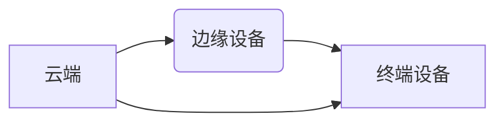

> 自动驾驶, 云边端协同, 感知优化, 深度学习, 计算机视觉, 雷达, lidar, 融合感知

## 1. 背景介绍

自动驾驶技术作为未来交通运输的重要发展方向，其核心是实现车辆对周围环境的感知、决策和控制。感知是自动驾驶系统中的基础环节，直接影响着车辆的安全性和可靠性。传统的自动驾驶感知系统主要依赖于单一传感器，例如摄像头、雷达或激光雷达，但单一传感器存在感知范围有限、抗干扰能力弱等问题。

随着人工智能技术的快速发展，深度学习算法在自动驾驶感知领域取得了显著的成果。然而，深度学习模型的训练需要海量数据，且模型部署在边缘设备时，计算资源和存储空间有限。因此，如何提高自动驾驶感知的准确性和效率，成为一个重要的研究课题。

云边端协同感知架构 emerged as a promising solution to address these challenges. 

## 2. 核心概念与联系

云边端协同感知架构将感知任务分发到云端、边缘设备和终端设备，充分利用各级计算资源和数据优势，实现感知信息的协同优化。

**云端**负责处理海量数据，训练深度学习模型，并提供高精度感知结果。

**边缘设备**负责对实时数据进行初步处理，并根据本地情况进行决策，降低对云端的依赖。

**终端设备**负责收集原始数据，并根据边缘设备的指令进行感知任务。

**架构图:**



## 3. 核心算法原理 & 具体操作步骤

### 3.1  算法原理概述

云边端协同感知优化算法的核心是将感知任务分层分解，并利用深度学习算法实现数据融合和模型优化。

**分层分解:** 将感知任务分解为多个子任务，例如目标检测、目标跟踪、场景理解等，并根据任务复杂度和数据量分配到不同的计算节点。

**数据融合:** 利用云端、边缘设备和终端设备收集到的数据，进行多源数据融合，提高感知信息的准确性和可靠性。

**模型优化:** 利用云端的计算资源，对深度学习模型进行训练和优化，并根据边缘设备的反馈，动态调整模型参数，提高模型的适应性和鲁棒性。

### 3.2  算法步骤详解

1. **数据采集:** 终端设备收集原始数据，例如摄像头图像、雷达数据、激光雷达点云等。
2. **数据预处理:** 边缘设备对原始数据进行预处理，例如图像增强、数据降维等，降低数据传输量和计算复杂度。
3. **数据融合:** 边缘设备和云端对预处理后的数据进行融合，利用深度学习算法实现多源数据融合，例如多传感器融合、多模态融合等。
4. **模型推理:** 边缘设备和云端根据融合后的数据，利用预训练的深度学习模型进行感知任务推理，例如目标检测、目标跟踪、场景理解等。
5. **结果反馈:** 边缘设备将感知结果反馈给终端设备，用于车辆决策和控制。云端根据边缘设备的反馈，对深度学习模型进行优化和更新。

### 3.3  算法优缺点

**优点:**

* **提高感知精度:** 多源数据融合和模型优化，提高感知信息的准确性和可靠性。
* **降低计算复杂度:** 将感知任务分层分解，利用边缘设备的计算资源，降低对云端的依赖。
* **提高实时性:** 边缘设备进行实时感知，降低延迟，提高车辆的响应速度。

**缺点:**

* **系统复杂度高:** 云边端协同感知架构的部署和维护较为复杂。
* **数据安全问题:** 数据在云端、边缘设备和终端设备之间传输，存在数据安全风险。
* **网络依赖性:** 云边端协同感知架构依赖于网络连接，网络中断会导致系统瘫痪。

### 3.4  算法应用领域

云边端协同感知优化算法在自动驾驶、智能交通、机器人等领域具有广泛的应用前景。

## 4. 数学模型和公式 & 详细讲解 & 举例说明

### 4.1  数学模型构建

假设我们有N个传感器收集到的数据，每个传感器的数据可以用向量表示为 $x_i$，其中 $i = 1, 2, ..., N$。

目标是利用这些数据融合，得到一个更准确的感知结果 $y$。

我们可以使用以下数学模型来表示数据融合过程:

$$
y = f(x_1, x_2, ..., x_N)
$$

其中，$f$ 是一个数据融合函数，它可以是线性加权平均、深度学习网络等。

### 4.2  公式推导过程

为了得到更准确的感知结果，我们需要选择合适的融合函数 $f$。

一种常用的方法是使用深度学习网络进行数据融合。

深度学习网络可以学习数据之间的复杂关系，并自动调整融合权重。

假设我们使用一个多层感知机 (MLP) 进行数据融合，其结构如下:

* 输入层：接收来自N个传感器的原始数据。
* 隐藏层：进行特征提取和表示学习。
* 输出层：输出最终的感知结果 $y$。

MLP 的训练目标是最小化感知结果 $y$ 与真实值 $y^*$ 之间的误差。

可以使用均方误差 (MSE) 作为损失函数:

$$
L = \frac{1}{2} \sum_{i=1}^{m} (y_i - y_i^*)^2
$$

其中，$m$ 是样本数量。

通过反向传播算法，可以更新 MLP 的参数，使其能够更好地学习数据之间的关系。

### 4.3  案例分析与讲解

假设我们使用云边端协同感知架构进行自动驾驶车辆的感知任务。

云端负责训练深度学习模型，并提供高精度感知结果。

边缘设备负责对实时数据进行初步处理，并根据本地情况进行决策。

终端设备负责收集原始数据，例如摄像头图像、雷达数据、激光雷达点云等。

在实际应用中，我们可以将目标检测任务分配到云端和边缘设备进行协同处理。

云端可以训练一个全局的目标检测模型，并根据边缘设备的反馈，动态调整模型参数，提高模型的适应性和鲁棒性。

边缘设备可以利用云端训练好的模型，对实时数据进行目标检测，并根据检测结果进行决策，例如车辆转向、加速、减速等。

## 5. 项目实践：代码实例和详细解释说明

### 5.1  开发环境搭建

为了实现云边端协同感知优化算法，我们需要搭建一个合适的开发环境。

开发环境包括以下几个方面:

* **云平台:** 选择一个合适的云平台，例如阿里云、腾讯云、AWS等。
* **边缘设备平台:** 选择一个合适的边缘设备平台，例如 Raspberry Pi、NVIDIA Jetson 等。
* **开发工具:** 选择合适的开发工具，例如 Python、TensorFlow、PyTorch 等。

### 5.2  源代码详细实现

以下是一个简单的代码示例，演示了如何使用 TensorFlow 在云端训练一个目标检测模型，并部署到边缘设备上进行推理。

```python
# 云端代码示例
import tensorflow as tf

# 定义目标检测模型
model = tf.keras.models.Sequential([
    # ... 模型结构 ...
])

# 训练模型
model.compile(optimizer='adam',
              loss='categorical_crossentropy',
              metrics=['accuracy'])
model.fit(train_data, train_labels, epochs=10)

# 部署模型到边缘设备
model.save('model.h5')

# 边缘设备代码示例
import tensorflow as tf

# 加载模型
model = tf.keras.models.load_model('model.h5')

# 对实时数据进行推理
predictions = model.predict(input_data)
```

### 5.3  代码解读与分析

* 云端代码示例:
    * 使用 TensorFlow 定义目标检测模型。
    * 使用 Adam 优化器、交叉熵损失函数和准确率指标训练模型。
    * 将训练好的模型保存为 .h5 文件。
* 边缘设备代码示例:
    * 加载云端训练好的模型。
    * 对实时数据进行推理，获取目标检测结果。

### 5.4  运行结果展示

运行上述代码后，可以观察到以下结果:

* 云端: 模型训练完成后，可以查看模型的训练曲线和测试精度。
* 边缘设备: 可以实时获取目标检测结果，并根据结果进行决策。

## 6. 实际应用场景

### 6.1  自动驾驶汽车

云边端协同感知优化算法可以应用于自动驾驶汽车的感知系统，提高车辆的安全性和可靠性。

### 6.2  智能交通

云边端协同感知优化算法可以应用于智能交通系统，例如交通流量管理、拥堵预警等。

### 6.3  机器人

云边端协同感知优化算法可以应用于机器人，例如自主导航、环境感知等。

### 6.4  未来应用展望

随着人工智能技术的不断发展，云边端协同感知优化算法将在更多领域得到应用，例如医疗、农业、工业自动化等。

## 7. 工具和资源推荐

### 7.1  学习资源推荐

* **书籍:**
    * 深度学习
    * 自动驾驶技术
* **在线课程:**
    * Coursera: 深度学习
    * Udacity: 自动驾驶工程师
* **博客:**
    * OpenAI Blog
    * Google AI Blog

### 7.2  开发工具推荐

* **深度学习框架:** TensorFlow, PyTorch
* **云平台:** 阿里云, 腾讯云, AWS
* **边缘设备平台:** Raspberry Pi, NVIDIA Jetson

### 7.3  相关论文推荐

* **论文:**
    * Cloud-Edge Collaborative Perception for Autonomous Driving
    * Deep Learning for Autonomous Driving: A Survey

## 8. 总结：未来发展趋势与挑战

### 8.1  研究成果总结

云边端协同感知优化算法在自动驾驶感知领域取得了显著的成果，提高了感知精度、降低了计算复杂度、提高了实时性。

### 8.2  未来发展趋势

未来，云边端协同感知优化算法将朝着以下方向发展:

* **更强大的模型:** 利用更先进的深度学习算法，训练更强大的感知模型。
* **更智能的决策:** 将感知结果与决策系统融合，实现更智能的车辆决策。
* **更广泛的应用:** 将云边端协同感知优化算法应用于更多领域，例如医疗、农业、工业自动化等。

### 8.3  面临的挑战

云边端协同感知优化算法还面临着一些挑战:

* **数据安全问题:** 数据在云端、边缘设备和终端设备之间传输，存在数据安全风险。
* **网络依赖性:** 云边端协同感知架构依赖于网络连接，网络中断会导致系统瘫痪。
* **系统复杂度高:** 云边端协同感知架构的部署和维护较为复杂。

### 8.4  研究展望

未来，我们将继续研究云边端协同感知优化算法，解决上述挑战，并将其应用于更多领域，推动人工智能技术的发展。

## 9. 附录：常见问题与解答

### 9.1  常见问题

* 云边端协同感知架构的部署成本高吗？
* 云边端协同感知架构的安全性如何保证？
* 云边端协同感知架构的实时性如何？

### 9.2  解答

* 云边端协同感知架构的部署成本取决于具体的应用场景和技术方案。
* 云边端协同感知架构的安全性可以通过加密传输、身份认证等技术保障。
* 云边端协同感知架构的实时性取决于网络带宽、边缘设备的计算能力等因素。


作者：禅与计算机程序设计艺术 / Zen and the Art of Computer Programming 
<end_of_turn>