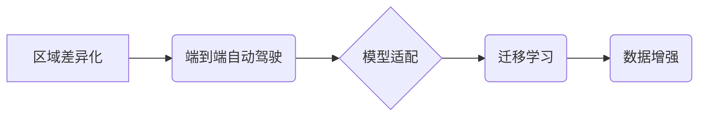

> 端到端自动驾驶，区域差异化，模型适配，数据增强，迁移学习，深度学习，计算机视觉

## 1. 背景介绍

自动驾驶技术近年来取得了显著进展，端到端自动驾驶方法凭借其简洁性和高效性，成为该领域的研究热点。然而，自动驾驶系统在不同地理区域的表现存在差异，这主要源于环境、交通规则、驾驶习惯等方面的差异。例如，美国高速公路的驾驶环境与中国拥挤的城市道路截然不同，这使得在特定区域训练的自动驾驶模型在其他区域可能表现不佳。因此，如何实现端到端自动驾驶的区域差异化适配，是当前自动驾驶技术面临的重要挑战。

## 2. 核心概念与联系

**2.1 区域差异化**

区域差异化是指不同地理区域的环境、交通规则、驾驶习惯等方面的差异。这些差异会导致自动驾驶模型在不同区域的表现存在差异。

**2.2 端到端自动驾驶**

端到端自动驾驶是指将感知、决策和控制等多个模块整合到一个深度学习模型中，直接从传感器数据预测车辆的控制指令。这种方法简化了模型结构，提高了训练效率，但也更加依赖于高质量的数据集。

**2.3 模型适配**

模型适配是指针对特定区域或场景，对预训练的自动驾驶模型进行微调，以提高其在目标区域或场景下的性能。

**2.4 迁移学习**

迁移学习是指利用已训练好的模型参数，在新的任务或领域上进行训练，以减少训练数据和训练时间。

**2.5 数据增强**

数据增强是指通过对现有数据进行各种变换，例如旋转、缩放、裁剪等，生成新的训练数据，以提高模型的泛化能力。

**2.6 核心概念关系图**



## 3. 核心算法原理 & 具体操作步骤

**3.1 算法原理概述**

区域差异化适配的核心算法原理是利用迁移学习和数据增强技术，将预训练的自动驾驶模型迁移到目标区域，并通过对目标区域数据的微调和增强，提高模型在目标区域的性能。

**3.2 算法步骤详解**

1. **预训练模型选择:** 选择一个在公共数据集上预训练的端到端自动驾驶模型，例如Waymo Open Dataset、ApolloScape等。

2. **目标区域数据收集:** 收集目标区域的真实驾驶数据，包括图像、激光雷达数据、GPS数据等。

3. **数据预处理:** 对目标区域数据进行预处理，例如图像裁剪、数据标注、数据格式转换等。

4. **数据增强:** 对目标区域数据进行数据增强，例如随机裁剪、随机旋转、随机翻转等，以增加数据多样性。

5. **模型微调:** 将预训练模型加载到目标区域数据上进行微调，调整模型参数以适应目标区域的驾驶环境。

6. **性能评估:** 使用目标区域的测试数据评估模型的性能，例如准确率、召回率、平均位移误差等。

7. **模型优化:** 根据性能评估结果，对模型结构、训练参数进行优化，进一步提高模型性能。

**3.3 算法优缺点**

**优点:**

* 能够利用预训练模型的知识，减少训练数据和训练时间。
* 可以提高模型在目标区域的性能。

**缺点:**

* 需要收集大量的目标区域数据。
* 模型微调过程可能需要较长的训练时间。

**3.4 算法应用领域**

* 自动驾驶汽车
* 无人机
* 机器人

## 4. 数学模型和公式 & 详细讲解 & 举例说明

**4.1 数学模型构建**

端到端自动驾驶模型通常采用深度神经网络结构，例如卷积神经网络（CNN）和循环神经网络（RNN）。模型的输入是传感器数据，例如图像、激光雷达数据等，输出是车辆的控制指令，例如转向角度、油门踏板深度等。

**4.2 公式推导过程**

深度神经网络的训练过程基于反向传播算法，其核心是通过最小化损失函数来更新模型参数。损失函数通常采用均方误差（MSE）或交叉熵损失函数。

**4.3 案例分析与讲解**

例如，在预测车辆转向角度的任务中，模型的输出是一个实数，表示转向角度。损失函数可以定义为：

$$
L = \frac{1}{N} \sum_{i=1}^{N} (y_i - \hat{y}_i)^2
$$

其中，$N$ 是样本数量，$y_i$ 是真实转向角度，$\hat{y}_i$ 是模型预测的转向角度。

通过反向传播算法，可以计算出每个参数的梯度，并根据梯度更新参数值，以最小化损失函数。

## 5. 项目实践：代码实例和详细解释说明

**5.1 开发环境搭建**

* 操作系统：Ubuntu 20.04
* 编程语言：Python 3.8
* 深度学习框架：TensorFlow 2.0
* 其他依赖库：OpenCV、NumPy、Pandas等

**5.2 源代码详细实现**

```python
import tensorflow as tf

# 定义模型结构
model = tf.keras.models.Sequential([
    tf.keras.layers.Conv2D(32, (3, 3), activation='relu', input_shape=(64, 64, 3)),
    tf.keras.layers.MaxPooling2D((2, 2)),
    tf.keras.layers.Conv2D(64, (3, 3), activation='relu'),
    tf.keras.layers.MaxPooling2D((2, 2)),
    tf.keras.layers.Flatten(),
    tf.keras.layers.Dense(10, activation='softmax')
])

# 定义损失函数和优化器
model.compile(loss='categorical_crossentropy', optimizer='adam', metrics=['accuracy'])

# 训练模型
model.fit(x_train, y_train, epochs=10, batch_size=32)

# 评估模型
loss, accuracy = model.evaluate(x_test, y_test)
print('Loss:', loss)
print('Accuracy:', accuracy)
```

**5.3 代码解读与分析**

这段代码定义了一个简单的卷积神经网络模型，用于图像分类任务。模型包含两个卷积层、两个最大池化层、一个全连接层和一个softmax输出层。

**5.4 运行结果展示**

训练完成后，可以将模型应用于新的图像数据进行预测。

## 6. 实际应用场景

**6.1 自动驾驶汽车**

区域差异化适配可以帮助自动驾驶汽车在不同的地理区域和驾驶环境中安全可靠地行驶。例如，在拥挤的城市道路上，自动驾驶汽车需要能够识别行人、自行车和其他车辆，并做出相应的避让动作。而在高速公路上，自动驾驶汽车需要能够识别交通标志和信号灯，并根据交通规则进行行驶。

**6.2 无人机**

区域差异化适配可以帮助无人机在不同的地形和环境中安全飞行。例如，在山区飞行时，无人机需要能够识别障碍物，并避开障碍物飞行。而在城市地区飞行时，无人机需要能够识别建筑物和电线，并避开这些障碍物飞行。

**6.3 机器人**

区域差异化适配可以帮助机器人适应不同的环境和任务。例如，在工厂环境中，机器人需要能够识别工件和工具，并进行相应的操作。而在家庭环境中，机器人需要能够识别家具和家电，并进行相应的服务。

**6.4 未来应用展望**

随着自动驾驶技术的发展，区域差异化适配将成为自动驾驶系统的重要组成部分。未来，我们可以期待看到更加智能、更加安全的自动驾驶系统，能够在各种不同的地理区域和驾驶环境中安全可靠地行驶。

## 7. 工具和资源推荐

**7.1 学习资源推荐**

* **书籍:**
    * 深度学习
    * 自动驾驶汽车
* **在线课程:**
    * Coursera: 深度学习
    * Udacity: 自动驾驶汽车工程师
* **博客:**
    * OpenAI Blog
    * Waymo Blog

**7.2 开发工具推荐**

* **深度学习框架:** TensorFlow, PyTorch
* **计算机视觉库:** OpenCV
* **数据标注工具:** LabelImg, VGG Image Annotator

**7.3 相关论文推荐**

* End-to-End Learning for Self-Driving Cars
* Attention Is All You Need
* Deep Reinforcement Learning for Autonomous Driving

## 8. 总结：未来发展趋势与挑战

**8.1 研究成果总结**

区域差异化适配技术在自动驾驶领域取得了显著进展，能够有效提高自动驾驶系统的泛化能力和鲁棒性。

**8.2 未来发展趋势**

* **更精细化的区域划分:** 将区域划分更加细化，以更好地适应不同区域的驾驶环境。
* **更有效的迁移学习方法:** 开发更有效的迁移学习方法，以减少目标区域数据需求。
* **更强大的数据增强技术:** 开发更强大的数据增强技术，以提高模型的泛化能力。
* **多模态数据融合:** 将图像、激光雷达、GPS等多模态数据融合，以提高模型的感知能力。

**8.3 面临的挑战**

* **数据获取和标注:** 目标区域数据获取和标注成本高昂。
* **模型复杂度:** 区域差异化适配模型通常比较复杂，训练和部署成本较高。
* **安全性和可靠性:** 确保区域差异化适配模型在所有场景下都能安全可靠地工作。

**8.4 研究展望**

未来，我们将继续致力于区域差异化适配技术的研究，以推动自动驾驶技术的进步，并最终实现自动驾驶汽车的普及。

## 9. 附录：常见问题与解答

**9.1 Q: 如何选择合适的预训练模型？**

A: 选择预训练模型时，需要考虑模型的架构、训练数据、性能等因素。建议选择在目标区域或类似区域上训练的模型。

**9.2 Q: 如何进行数据增强？**

A: 数据增强方法有很多种，例如随机裁剪、随机旋转、随机翻转等。可以根据目标区域的特点选择合适的增强方法。

**9.3 Q: 如何评估模型性能？**

A: 可以使用准确率、召回率、平均位移误差等指标来评估模型性能。

**9.4 Q: 如何部署区域差异化适配模型？**

A: 可以将模型部署到自动驾驶汽车的控制单元中，或者部署到云端，并通过网络与自动驾驶汽车进行通信。


作者：禅与计算机程序设计艺术 / Zen and the Art of Computer Programming 
<end_of_turn>