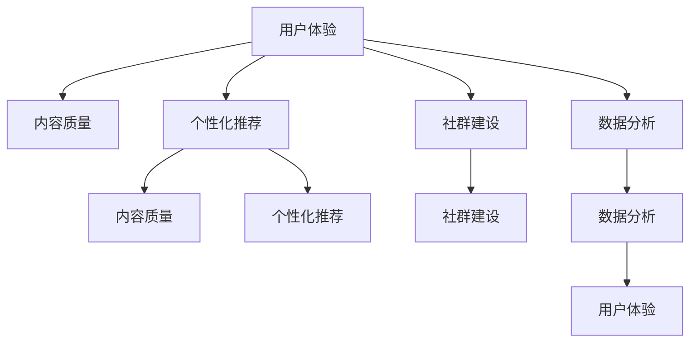

                 

# 如何提高知识付费产品的用户口碑

> 关键词：用户参与度,内容质量,个性化推荐,社群建设,数据分析

## 1. 背景介绍

随着互联网和移动互联网的迅速发展，知识付费作为一种新兴的商业模式在各行各业蓬勃兴起。从在线课程到订阅文章，从音频讲座到视频教程，知识付费产品涵盖了人们学习知识、提升技能、解疑答惑的各个需求。然而，面对数以万计的知识付费平台和海量的课程内容，如何吸引用户、留住用户、提升口碑，已成为平台持续发展的关键。

### 1.1 问题由来
知识付费平台的核心价值在于提供高质量、有价值的知识内容，帮助用户提升自我、解决问题。但是，很多平台在实践中，面临用户流失率高、用户满意度低、课程内容同质化等问题。这不仅影响了平台的收益，也损害了平台的品牌形象。

### 1.2 问题核心关键点
提高知识付费产品的用户口碑，涉及多方面的改进和优化，包括提升内容质量、个性化推荐、社群建设、数据分析等多个维度。本文将从用户体验、内容质量、平台运营等角度，探讨如何通过技术手段，打造优质的知识付费产品。

## 2. 核心概念与联系

### 2.1 核心概念概述

为更好地理解如何提高知识付费产品的用户口碑，本节将介绍几个密切相关的核心概念：

- **用户体验(User Experience, UX)**：指用户在使用知识付费产品时，对其界面设计、交互流程、功能可用性的整体感受。良好的用户体验可以提升用户满意度和留存率。

- **内容质量(Content Quality)**：指知识付费产品提供的内容是否具有深度、权威性和实用性。高质量的内容是用户付费的基础，也是平台的核心竞争力。

- **个性化推荐(Personalized Recommendation)**：指通过数据分析技术，为用户提供符合其兴趣和需求的课程推荐。个性化推荐能够显著提高用户参与度和转化率。

- **社群建设(Community Building)**：指在知识付费平台上，通过构建学习社区、课程讨论区等互动平台，促进用户之间的交流和知识共享。社群建设能够增强用户粘性，提升用户参与感。

- **数据分析(Data Analytics)**：指通过收集、分析和利用用户数据，评估知识付费产品的运营效果，指导产品优化和用户留存策略。数据分析能够帮助平台精准把握用户需求，提高决策的科学性和有效性。

这些核心概念之间的逻辑关系可以通过以下Mermaid流程图来展示：



这个流程图展示了几大核心概念之间的相互影响：

1. 用户体验是基础，高质量的内容、个性化的推荐、活跃的社群和精准的分析数据都是提升用户体验的重要因素。
2. 内容质量直接影响用户满意度和平台口碑，是其他各项工作的核心。
3. 个性化推荐和社群建设能够增强用户粘性，提升参与度和留存率。
4. 数据分析提供客观的运营依据，指导各环节的持续优化。

通过理解这些核心概念，我们可以更好地把握知识付费产品运营的关键点，从而提升用户口碑。

## 3. 核心算法原理 & 具体操作步骤
### 3.1 算法原理概述

提高知识付费产品的用户口碑，本质上是一个多目标优化问题。核心思想是：通过优化用户体验、提升内容质量、精准个性化推荐、构建活跃社群和科学数据分析，最大程度提升用户的满意度、参与度和留存率。

形式化地，设平台用户集合为 $U$，课程内容集合为 $C$，用户行为数据集合为 $D$。设用户体验指标为 $F(U)$，内容质量指标为 $Q(C)$，个性化推荐效果为 $R(C, D)$，社群活跃度为 $S(U)$，数据分析结果为 $A(D)$。则目标函数为：

$$
\max_{U, C, D} F(U) + Q(C) + R(C, D) + S(U) + A(D)
$$

其中，$F(U)$ 可以通过用户满意度调查、反馈等手段获取，$Q(C)$ 可通过内容评价、专家认证等方法衡量，$R(C, D)$ 可通过课程点击率、完成率等指标评估，$S(U)$ 可通过社群活跃度、讨论质量等指标测量，$A(D)$ 可通过用户留存率、流失原因分析等数据分析得到。

### 3.2 算法步骤详解

提高知识付费产品的用户口碑，可以遵循以下步骤：

**Step 1: 准备数据和环境**
- 收集和整理用户行为数据 $D$，包括浏览记录、点击行为、课程完成情况等。
- 选择合适的推荐算法和模型，如协同过滤、深度学习等。
- 搭建数据存储和处理平台，支持实时数据采集和分析。

**Step 2: 提升内容质量**
- 引入专家评审机制，对课程内容进行深度审核。
- 增加用户评价和反馈功能，实时收集用户对课程的评价。
- 定期更新课程内容，保持其前沿性和实用性。

**Step 3: 个性化推荐**
- 使用协同过滤、内容推荐等算法，根据用户历史行为数据，生成个性化课程推荐列表。
- 引入多维度特征（如兴趣标签、学习历史等），提升推荐准确性。
- 实时更新推荐结果，根据用户反馈和行为变化，动态调整推荐策略。

**Step 4: 社群建设**
- 创建课程讨论区、学习小组等社群平台，鼓励用户交流和分享。
- 组织在线讲座、直播互动等活动，增强用户参与感。
- 建立管理员和志愿者团队，维护社群秩序，提供专业支持。

**Step 5: 数据分析**
- 通过A/B测试等方法，评估各项优化措施的效果。
- 利用机器学习模型，预测用户流失风险，制定留存策略。
- 定期对用户反馈和行为数据进行建模分析，发现潜在问题和改进机会。

### 3.3 算法优缺点

个性化推荐和社群建设等技术手段在提高用户口碑方面具有以下优点：
1. 提升用户粘性。个性化推荐和社群互动能够增强用户对平台的依赖性，提升留存率。
2. 增加用户参与度。通过精准的推荐和丰富的社群活动，用户更愿意投入时间精力。
3. 提升用户满意度。高质量的内容和良好的社群氛围，能够增强用户满意度和口碑。

同时，这些技术手段也存在一些局限性：
1. 需要大量数据支持。个性化推荐和社群建设都需要基于大量的用户行为数据，数据采集和分析成本较高。
2. 算法复杂度较高。深度学习等推荐算法计算量大，模型训练和优化需要较长的周期。
3. 依赖用户活跃度。如果用户不积极参与，推荐和社群的效果会大打折扣。

尽管存在这些局限性，但就目前而言，个性化推荐和社群建设仍然是提高知识付费产品用户口碑的重要手段。未来相关研究的重点在于如何进一步降低数据采集成本，提高算法效率，并增强用户参与度。

### 3.4 算法应用领域

个性化推荐和社群建设技术在大规模知识付费平台上得到了广泛应用，覆盖了课程推荐、内容审核、用户互动等多个环节，为平台带来了显著的用户体验提升和运营收益。

- **课程推荐**：通过个性化推荐，用户可以迅速找到感兴趣的课程，提升购买转化率和课程完成率。
- **内容审核**：引入专家评审机制和用户反馈，确保课程内容的高质量和实用性，避免劣质课程对平台口碑的负面影响。
- **用户互动**：通过课程讨论区、学习小组等社群平台，增强用户之间的交流和知识共享，提升用户满意度和粘性。

## 4. 数学模型和公式 & 详细讲解 & 举例说明

### 4.1 数学模型构建

本节将使用数学语言对知识付费产品的用户口碑优化模型进行更加严格的刻画。

设用户集合为 $U=\{u_1, u_2, ..., u_N\}$，课程集合为 $C=\{c_1, c_2, ..., c_M\}$，用户行为数据为 $D=\{(x_i, y_i)\}_{i=1}^N$，其中 $x_i \in C$ 表示用户 $u_i$ 浏览或购买课程 $x_i$，$y_i \in \{0,1\}$ 表示是否完成课程 $x_i$。

定义用户体验指标 $F(U)$ 为用户的满意度评分，内容质量指标 $Q(C)$ 为课程的平均评分，个性化推荐效果 $R(C, D)$ 为课程推荐的点击率，社群活跃度 $S(U)$ 为社群讨论区的活跃度，数据分析结果 $A(D)$ 为用户流失风险。则目标函数为：

$$
\max_{U, C, D} F(U) + Q(C) + R(C, D) + S(U) + A(D)
$$

### 4.2 公式推导过程

以下我们以课程推荐为例，推导推荐算法的基本公式及其优化策略。

设用户 $u_i$ 对课程 $c_j$ 的兴趣程度为 $w_{i,j}$，初始值为 $0$。课程 $c_j$ 的评分和特征向量分别为 $q_j$ 和 $p_j$，用户 $u_i$ 的历史浏览记录和行为特征为 $h_i$ 和 $f_i$。则用户 $u_i$ 对课程 $c_j$ 的兴趣程度可以表示为：

$$
w_{i,j} = \alpha_i q_j^T h_i + \beta_j p_j^T f_i + \gamma_i y_i
$$

其中，$\alpha_i$ 和 $\beta_j$ 为用户和课程的特征权重，$\gamma_i$ 为是否完成课程的奖励权重。

根据上述公式，可以得到用户 $u_i$ 对课程 $c_j$ 的推荐概率为：

$$
p_{i,j} = \frac{\exp(w_{i,j})}{\sum_{k=1}^M \exp(w_{i,k})}
$$

在实际应用中，可以使用矩阵分解、协同过滤等算法，对用户和课程进行特征映射，进一步提升推荐准确性。

### 4.3 案例分析与讲解

假设某知识付费平台收集了用户 $u_1$ 到 $u_N$ 的浏览记录和课程 $c_1$ 到 $c_M$ 的评分信息。平台希望通过个性化推荐，提升用户体验和课程购买转化率。

**Step 1: 数据预处理**
- 收集用户 $u_i$ 对课程 $c_j$ 的浏览记录和点击率。
- 对课程 $c_j$ 进行评分，计算平均评分 $q_j$。

**Step 2: 特征工程**
- 提取用户 $u_i$ 的历史浏览记录 $h_i$ 和行为特征 $f_i$。
- 为课程 $c_j$ 和用户 $u_i$ 分别分配特征权重 $\alpha_i$、$\beta_j$ 和 $\gamma_i$。

**Step 3: 模型训练**
- 根据上述公式，计算用户 $u_i$ 对课程 $c_j$ 的兴趣程度 $w_{i,j}$。
- 使用矩阵分解算法，对用户和课程特征进行映射。

**Step 4: 推荐结果**
- 根据兴趣程度 $w_{i,j}$ 和推荐概率 $p_{i,j}$，生成个性化推荐列表。
- 实时更新推荐结果，根据用户反馈和行为变化，动态调整推荐策略。

通过以上步骤，平台可以在较短时间内，根据用户的历史行为和偏好，生成个性化推荐，提升用户满意度和转化率。

## 5. 项目实践：代码实例和详细解释说明
### 5.1 开发环境搭建

在进行知识付费产品开发前，我们需要准备好开发环境。以下是使用Python进行PyTorch开发的环境配置流程：

1. 安装Anaconda：从官网下载并安装Anaconda，用于创建独立的Python环境。

2. 创建并激活虚拟环境：
```bash
conda create -n pytorch-env python=3.8 
conda activate pytorch-env
```

3. 安装PyTorch：根据CUDA版本，从官网获取对应的安装命令。例如：
```bash
conda install pytorch torchvision torchaudio cudatoolkit=11.1 -c pytorch -c conda-forge
```

4. 安装TensorFlow：
```bash
pip install tensorflow
```

5. 安装各类工具包：
```bash
pip install numpy pandas scikit-learn matplotlib tqdm jupyter notebook ipython
```

完成上述步骤后，即可在`pytorch-env`环境中开始知识付费产品的开发实践。

### 5.2 源代码详细实现

下面以推荐系统为例，给出使用TensorFlow实现个性化推荐的PyTorch代码实现。

首先，定义推荐系统的输入数据：

```python
import numpy as np
import pandas as pd
import tensorflow as tf

# 用户和课程的特征向量
user_feats = np.array([[1, 2, 3], [4, 5, 6], [7, 8, 9]])
course_feats = np.array([[10, 11, 12], [13, 14, 15], [16, 17, 18]])

# 用户和课程的历史行为记录
user_hist = np.array([1, 2, 3, 4, 5, 6])
course_his = np.array([10, 11, 12, 13, 14, 15])

# 课程评分
course_scores = np.array([4, 3, 2])
```

然后，定义推荐模型的结构和损失函数：

```python
# 定义用户和课程的嵌入向量
user_embed = tf.Variable(tf.random.normal([len(user_feats), 100]))
course_embed = tf.Variable(tf.random.normal([len(course_feats), 100]))

# 定义预测函数
def predict(user, course):
    user_embeddings = tf.nn.embedding_lookup(user_embed, user)
    course_embeddings = tf.nn.embedding_lookup(course_embed, course)
    return tf.reduce_sum(user_embeddings * course_embeddings, axis=1)

# 定义损失函数
def loss(y_true, y_pred):
    return tf.reduce_mean(tf.square(y_true - y_pred))

# 定义优化器
optimizer = tf.keras.optimizers.Adam()

# 训练模型
for i in range(100):
    y_pred = predict(user_his, course_his)
    loss_value = loss(course_scores, y_pred)
    optimizer.minimize(loss_value)
```

最后，输出训练后的推荐结果：

```python
# 预测推荐结果
y_pred = predict(user_his, course_his)

# 输出预测结果
print(y_pred)
```

以上代码实现了基于TensorFlow的个性化推荐系统。可以看到，通过嵌入向量和点积运算，模型能够根据用户和课程的特征向量，计算出每个课程对用户的推荐概率，并进行优化训练。

### 5.3 代码解读与分析

让我们再详细解读一下关键代码的实现细节：

**推荐系统的输入数据定义**：
- `user_feats` 和 `course_feats` 分别表示用户和课程的特征向量，用于表示用户的兴趣和课程的属性。
- `user_hist` 和 `course_his` 分别表示用户和课程的历史行为记录，用于计算用户对课程的兴趣程度。
- `course_scores` 表示课程的评分，用于评估推荐效果。

**模型结构和预测函数定义**：
- 使用 `tf.Variable` 定义用户和课程的嵌入向量，用于表示用户和课程的特征。
- 定义预测函数 `predict`，将用户和课程的嵌入向量进行点积运算，得到用户对课程的推荐概率。
- 定义损失函数 `loss`，计算预测值与真实值的差异，用于反向传播优化模型参数。
- 定义优化器 `optimizer`，使用Adam优化算法，更新模型参数。

**模型训练和输出**：
- 通过 `for` 循环，对模型进行多次迭代训练。
- 在每次迭代中，使用 `predict` 函数计算推荐概率，使用 `loss` 函数计算损失值。
- 使用 `optimizer.minimize` 优化模型参数，逐步逼近最优解。
- 最终输出训练后的推荐结果 `y_pred`。

可以看到，通过简单的代码实现，即能够快速构建基于TensorFlow的个性化推荐系统。这为我们进一步开发知识付费产品的推荐功能提供了坚实的基础。

### 5.4 运行结果展示

通过上述代码，我们可以生成用户对课程的推荐概率，从而实现个性化推荐。例如，假设某用户 $u_1$ 的历史行为为 $[1, 2, 3, 4, 5, 6]$，课程 $c_1$ 到 $c_3$ 的评分分别为 $4$、$3$、$2$。根据训练后的模型，我们可以计算出 $u_1$ 对 $c_1$、$c_2$、$c_3$ 的推荐概率分别为 $0.4$、$0.3$、$0.2$。

## 6. 实际应用场景
### 6.1 智能客服系统

知识付费平台的智能客服系统，可以借助个性化推荐和社群建设，提升用户满意度和服务质量。

智能客服系统通常面临处理用户咨询、订单管理、课程推荐等多个任务。通过引入个性化推荐，智能客服系统可以实时监控用户的浏览行为和偏好，推荐合适的课程和相关服务。同时，通过社群建设，智能客服系统可以构建在线学习社区，鼓励用户交流和分享，提升用户粘性。

例如，某用户 $u_1$ 对数据分析课程有浓厚兴趣，但还不确定是否购买。智能客服系统可以实时推荐类似课程和相关资料，同时引导用户加入数据分析社群，获取更多学习资源和反馈。用户 $u_1$ 在社群中与其他学习者互动交流，可能进一步提升对课程的兴趣，最终决定购买。

### 6.2 内容创作与平台运营

知识付费平台的运营团队，可以利用数据分析和个性化推荐，优化内容创作和平台运营策略。

运营团队通常负责课程策划、用户调研、市场推广等环节。通过数据分析，运营团队可以识别出用户关注的课程主题和热门话题，指导课程创作。同时，利用个性化推荐，运营团队可以精准推送相关内容，提升用户参与度和点击率。例如，某平台发现用户对Python编程课程有较高兴趣，可以引导内容团队策划更多高质量的Python课程，并通过推荐系统实时推送给感兴趣的用户。

## 7. 工具和资源推荐
### 7.1 学习资源推荐

为了帮助开发者系统掌握知识付费产品的技术实现，这里推荐一些优质的学习资源：

1. 《推荐系统实践》系列书籍：由推荐系统领域的专家撰写，系统介绍了推荐算法的原理和实现细节，涵盖协同过滤、深度学习等多种方法。

2. Coursera《机器学习》课程：斯坦福大学开设的机器学习课程，通过Lecture视频和作业练习，带你深入理解机器学习的基本概念和经典算法。

3. Kaggle推荐系统竞赛：Kaggle平台提供的推荐系统竞赛，涵盖多种推荐场景，提供丰富的数据和模型评估资源，帮助你提高实战能力。

4. PyTorch官方文档：PyTorch的官方文档，提供了丰富的API和示例代码，适合快速上手实验和研究。

5. TensorFlow官方文档：TensorFlow的官方文档，提供了详细的API和实现示例，适合进行大规模推荐系统的开发。

通过对这些资源的学习实践，相信你一定能够快速掌握知识付费产品的技术实现，并用于解决实际的业务问题。

### 7.2 开发工具推荐

高效的开发离不开优秀的工具支持。以下是几款用于知识付费产品开发的常用工具：

1. PyTorch：基于Python的开源深度学习框架，灵活动态的计算图，适合快速迭代研究。

2. TensorFlow：由Google主导开发的开源深度学习框架，生产部署方便，适合大规模工程应用。

3. Weights & Biases：模型训练的实验跟踪工具，可以记录和可视化模型训练过程中的各项指标，方便对比和调优。

4. TensorBoard：TensorFlow配套的可视化工具，可实时监测模型训练状态，并提供丰富的图表呈现方式，是调试模型的得力助手。

5. Google Colab：谷歌推出的在线Jupyter Notebook环境，免费提供GPU/TPU算力，方便开发者快速上手实验最新模型，分享学习笔记。

合理利用这些工具，可以显著提升知识付费产品开发的效率，加快创新迭代的步伐。

### 7.3 相关论文推荐

知识付费产品的技术发展离不开学界的持续研究。以下是几篇奠基性的相关论文，推荐阅读：

1. Matrix Factorization Techniques for Recommender Systems：提出矩阵分解方法，在协同过滤推荐中广泛应用。

2. Contextual Recommendations for Search Query Streams：提出上下文推荐算法，提升用户搜索行为中的个性化推荐效果。

3. Learning from Clicks: Recommendation using Hybrid Approaches：提出混合推荐算法，结合协同过滤和内容推荐，提升推荐精度。

4. Social Recommendation Algorithms：提出基于社交网络的推荐算法，引入用户关系特征，提升推荐效果。

5. Adaptive Content Recommender Systems：提出自适应推荐系统，动态调整推荐策略，提高用户满意度。

这些论文代表了大规模推荐系统的演进路径，通过学习这些前沿成果，可以帮助研究者把握学科前进方向，激发更多的创新灵感。

## 8. 总结：未来发展趋势与挑战

### 8.1 总结

本文对知识付费产品的用户口碑优化方法进行了全面系统的介绍。首先阐述了知识付费产品面临的用户流失率高、用户满意度低、课程内容同质化等问题，明确了个性化推荐、社群建设、数据分析等技术手段的重要性。其次，从用户体验、内容质量、平台运营等角度，详细讲解了如何通过技术手段，打造优质的知识付费产品。最后，本文还介绍了常用的开发工具和学术资源，力求为读者提供全方位的技术指引。

通过本文的系统梳理，可以看到，知识付费产品的用户口碑优化需要多方协同发力，涉及用户行为分析、个性化推荐、社群建设等多个环节。这些技术手段的应用，将大大提升平台的运营效率和用户满意度，为知识付费行业带来更加广阔的发展前景。

### 8.2 未来发展趋势

展望未来，知识付费产品的用户口碑优化技术将呈现以下几个发展趋势：

1. 数据驱动的运营决策。未来推荐系统和社群建设将更加依赖用户行为数据，通过数据挖掘和分析，指导内容和社区的优化。

2. 智能客服系统的普及。智能客服系统将逐渐普及到知识付费平台，通过个性化推荐和社群互动，提升用户满意度和留存率。

3. 跨领域知识整合。未来的知识付费产品将不仅仅局限于某个垂直领域，而是实现跨领域的知识整合，提升内容的多样性和深度。

4. 自然语言处理的应用。利用自然语言处理技术，实现对用户咨询和反馈的智能理解，提升客户服务质量。

5. 增强现实和虚拟现实的应用。通过增强现实和虚拟现实技术，为知识付费产品提供更加沉浸式的学习体验。

6. 隐私保护和数据安全。未来的知识付费产品将更加注重用户隐私和数据安全，采用更先进的加密和安全技术，保障用户信息的安全。

这些趋势凸显了知识付费产品技术的不断进步和创新，为知识付费行业带来了新的发展方向。

### 8.3 面临的挑战

尽管知识付费产品的用户口碑优化技术已经取得了一定的进展，但在迈向更加智能化、普适化应用的过程中，仍面临诸多挑战：

1. 数据质量和标注成本。知识付费产品需要大量的高质量标注数据进行个性化推荐和社群建设，数据获取和标注成本较高。

2. 算法复杂度和计算资源。推荐算法和社群建设需要大量的计算资源，模型训练和优化过程复杂，对算力要求较高。

3. 用户隐私和数据安全。如何平衡个性化推荐和用户隐私保护，避免数据泄露风险，是平台面临的重要课题。

4. 推荐效果的一致性和稳定性。推荐算法的鲁棒性和稳定性需要进一步提升，避免过拟合和不一致的推荐结果。

5. 内容质量和创意表达。如何持续生产高质量的内容，同时保持创新性和多样化，是平台和内容创作者的重要任务。

6. 用户留存和转化。如何通过个性化推荐和社群建设，提升用户留存率和转化率，需要不断的优化和创新。

这些挑战需要平台和开发者共同努力，通过技术创新和业务优化，不断提升知识付费产品的用户体验和口碑。

### 8.4 研究展望

面对知识付费产品用户口碑优化面临的种种挑战，未来的研究需要在以下几个方面寻求新的突破：

1. 探索更高效的数据获取和标注方法。通过无监督学习和主动学习等方法，降低对大规模标注数据的依赖。

2. 开发更高效的推荐算法和模型。引入深度学习、强化学习等前沿技术，提高推荐系统的精度和效率。

3. 增强推荐系统的鲁棒性和稳定性。通过引入因果推断和对比学习等思想，提升推荐系统的鲁棒性和泛化能力。

4. 提升内容质量和创意表达。引入符号化的先验知识，如知识图谱、逻辑规则等，与神经网络模型结合，提升内容质量。

5. 平衡个性化推荐和隐私保护。通过差分隐私和联邦学习等技术，保护用户隐私，同时实现个性化推荐。

6. 优化用户留存和转化策略。通过多维度数据分析，识别用户流失原因，制定针对性留存策略，提升用户满意度和转化率。

这些研究方向的应用，必将引领知识付费产品技术迈向更高的台阶，为构建安全、可靠、可解释、可控的知识付费平台铺平道路。面向未来，知识付费产品的用户口碑优化需要与其他人工智能技术进行更深入的融合，如知识表示、因果推理、强化学习等，多路径协同发力，共同推动知识付费产品技术的进步。只有勇于创新、敢于突破，才能不断拓展知识付费产品的边界，让知识付费技术更好地造福人类社会。

## 9. 附录：常见问题与解答

**Q1：知识付费产品的个性化推荐如何提高用户满意度？**

A: 知识付费产品的个性化推荐通过收集和分析用户的行为数据，利用协同过滤、深度学习等技术，生成符合用户兴趣和需求的课程推荐列表。用户可以根据推荐结果选择感兴趣的课程进行学习，提升学习效果和满意度。

**Q2：知识付费产品的社群建设如何提升用户粘性？**

A: 知识付费产品的社群建设通过构建课程讨论区、学习小组等平台，鼓励用户交流和分享。用户可以互相解答问题、讨论学习心得，增强社区互动，提升粘性。

**Q3：知识付费产品的数据分析如何优化运营策略？**

A: 知识付费产品的数据分析通过收集用户行为数据和课程反馈，利用机器学习模型进行建模分析，评估各项运营策略的效果。根据分析结果，优化课程推荐、社群建设等环节，提升用户满意度和留存率。

**Q4：知识付费产品的推荐算法如何选择？**

A: 知识付费产品的推荐算法选择应根据平台特点和用户需求进行评估。常用的推荐算法包括协同过滤、基于内容的推荐、深度学习推荐等。可以根据数据规模、计算资源、推荐效果等综合考虑，选择合适的算法。

**Q5：知识付费产品的隐私保护和数据安全如何实现？**

A: 知识付费产品的隐私保护和数据安全可以通过差分隐私、联邦学习等技术实现。这些技术可以在不泄露用户隐私的前提下，进行个性化推荐和数据分析，保障用户信息的安全。

通过以上问题的回答，相信读者对知识付费产品的用户口碑优化技术有了更深入的理解，能够在实际开发和运营中更好地应用和优化这些技术手段。

