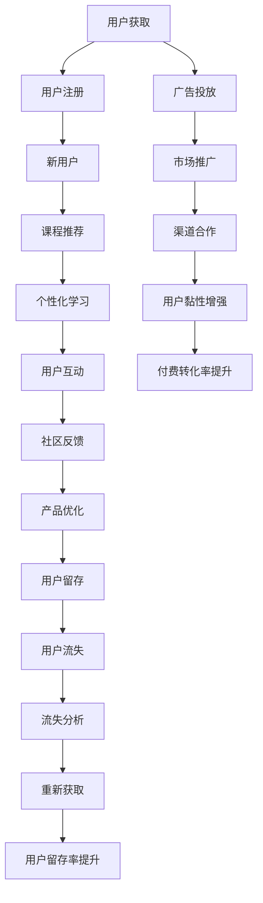

                 

# 如何提高知识付费产品的用户留存率

## 1. 背景介绍

### 1.1 问题由来

随着移动互联网的普及和内容消费习惯的变迁，知识付费产品如雨后春笋般涌现。用户对于知识的需求日益增长，同时对于消费体验和产品价值的期望也愈发苛刻。如何设计高效的用户留存策略，吸引并保留用户，成为了知识付费产品的重要课题。

### 1.2 问题核心关键点

用户留存是一个多维度、多层次的复杂问题，涉及用户行为、产品体验、价值感知、社群互动等多个方面。具体而言，可归纳为以下几个关键点：

- **内容质量**：优质且具有价值的课程内容是用户留存的基础。课程内容应能满足用户的学习需求，并与市场和用户兴趣高度契合。
- **用户体验**：用户界面（UI）、交互方式、学习工具等功能层面的用户体验，直接影响到用户的活跃度和满意度。
- **用户互动**：通过社群、讨论、问答等形式，增强用户间的互动，形成良好的学习氛围。
- **个性化推荐**：根据用户的学习行为和偏好，推荐个性化课程，提升用户粘性。
- **激励机制**：设计合理的积分、徽章、优惠券等激励机制，鼓励用户持续学习。
- **运营策略**：通过市场推广、内容营销、用户反馈等运营手段，持续提升用户留存率。

## 2. 核心概念与联系

### 2.1 核心概念概述

为更好地理解知识付费产品的用户留存策略，本节将介绍几个关键概念及其相互联系：

- **用户留存**：指用户继续使用产品的时间长度，是衡量产品活跃度和用户忠诚度的重要指标。
- **流失率**：指一段时间内停止使用产品的用户比例，与留存率呈相反关系。
- **用户生命周期价值(Lifetime Value, LTV)**：指用户在生命周期内为产品带来的总收益。
- **用户获取成本(Acquisition Cost, AC)**：指获取一个新用户的平均成本。
- **用户留存率**：指在一定时间内继续使用产品的用户比例，反映产品黏性。
- **付费转化率**：指访问或注册用户中，最终付费订阅或购买课程的比例，是衡量用户价值的关键指标。

这些概念之间的逻辑关系可以通过以下Mermaid流程图来展示：



这个流程图展示了大语言模型微调的逻辑关系：

1. 用户通过广告或推荐获得产品。
2. 用户注册成为新用户，进入课程推荐界面。
3. 推荐个性化课程，引导用户进行学习。
4. 用户通过个性化学习工具和互动功能，提升学习体验。
5. 用户通过社区反馈和产品优化，提升满意度和留存率。
6. 流失用户分析，采取重新获取策略。
7. 广告投放和市场推广持续获取新用户。
8. 渠道合作增强用户黏性，提升付费转化率。

## 3. 核心算法原理 & 具体操作步骤

### 3.1 算法原理概述

用户留存优化是一个多目标优化问题，核心在于平衡用户获取和留存，提升LTV的同时控制AC。基于此，本文将采用数据驱动的决策方法，通过A/B测试和机器学习模型，优化产品策略，提升用户留存率。

具体而言，可以采用以下步骤：

1. **用户行为数据采集**：通过埋点、日志、问卷等方式，收集用户行为数据，包括课程观看时长、学习进度、付费行为等。
2. **模型训练与评估**：基于历史用户数据，训练预测用户流失概率的机器学习模型，评估模型效果。
3. **特征工程与策略优化**：设计关键特征，进行策略优化，如个性化推荐、学习路径定制等。
4. **A/B测试与迭代**：通过A/B测试验证策略效果，不断迭代优化，提升用户留存率。

### 3.2 算法步骤详解

#### 3.2.1 用户行为数据采集

1. **埋点**：在关键页面和功能处设置埋点，收集用户行为数据。如课程观看页面、学习进度页面、课程评价页面等。
2. **日志记录**：记录用户登录、观看、购买等关键行为，生成日志数据。
3. **问卷调查**：定期向用户发送问卷，收集其对课程内容的满意度和使用体验的反馈。

#### 3.2.2 模型训练与评估

1. **数据预处理**：清洗、归一化、特征工程等步骤，将原始数据转化为可供模型训练的格式。
2. **模型选择**：选择适合问题特点的机器学习模型，如逻辑回归、随机森林、神经网络等。
3. **模型训练**：利用历史数据训练模型，优化模型参数。
4. **模型评估**：通过交叉验证、AUC等指标评估模型效果，选择最佳模型。

#### 3.2.3 特征工程与策略优化

1. **特征提取**：从用户行为数据中提取关键特征，如课程观看时长、学习进度、付费行为等。
2. **特征选择**：选择对用户留存有显著影响的特征，去除噪声和冗余特征。
3. **策略设计**：设计个性化推荐策略，如基于兴趣的课程推荐、基于学习进度的路径定制等。
4. **策略优化**：通过A/B测试，验证策略效果，不断迭代优化。

#### 3.2.4 A/B测试与迭代

1. **测试设计**：设计测试方案，包括测试组和对照组，设定测试周期。
2. **数据收集**：收集测试数据，包括用户行为、模型预测结果等。
3. **结果分析**：分析测试结果，评估新策略的效果。
4. **策略优化**：根据测试结果，调整策略，继续迭代优化。

### 3.3 算法优缺点

基于数据驱动的用户留存优化方法，具有以下优点：

- **数据驱动**：通过数据分析，客观评估用户行为和模型效果，提升策略的科学性和可行性。
- **模型优化**：利用机器学习模型，优化策略设计，提升预测准确性和用户留存率。
- **迭代改进**：通过A/B测试和持续优化，不断迭代提升产品体验和用户留存率。

同时，该方法也存在以下缺点：

- **数据隐私**：用户行为数据的收集和使用，可能涉及隐私问题，需严格遵守数据保护法规。
- **模型复杂性**：设计复杂模型，可能导致过拟合或计算复杂度增加。
- **实验成本**：A/B测试和模型训练需要大量时间和资源，实验成本较高。

### 3.4 算法应用领域

基于数据驱动的用户留存优化方法，不仅适用于知识付费产品，还广泛应用于其他互联网产品和服务中，如电商、社交、游戏等。具体应用包括：

- **电商**：通过用户行为分析，推荐个性化商品，提升用户体验和购买转化率。
- **社交**：通过用户互动和社群分析，增强用户黏性和活跃度。
- **游戏**：通过用户行为和心理模型，优化游戏设计，提升用户留存和付费转化。

## 4. 数学模型和公式 & 详细讲解 & 举例说明

### 4.1 数学模型构建

用户留存优化问题可形式化为一个分类问题，目标是将用户分为流失用户和留存用户两类。因此，可以利用二分类模型进行预测。设用户特征向量为 $x$，用户流失标签为 $y$，则目标函数为：

$$
\min_{\theta} L(\theta) = \frac{1}{N} \sum_{i=1}^N \ell(y_i, f_\theta(x_i))
$$

其中 $f_\theta(x_i) = \text{sigmoid}(\theta^T x_i)$ 为预测函数，$\ell$ 为损失函数，$\theta$ 为模型参数。

### 4.2 公式推导过程

以逻辑回归模型为例，推导预测函数和损失函数。

设模型参数为 $\theta = [w, b]$，特征向量为 $x = [x_1, x_2, ..., x_n]$，则预测函数为：

$$
f_\theta(x) = \text{sigmoid}(\theta^T x) = \frac{1}{1 + e^{-\theta^T x}} = \frac{1}{1 + e^{-w^T x + b}}
$$

其中 $w$ 为权重向量，$b$ 为偏置项。

目标函数为：

$$
\min_{\theta} L(\theta) = -\frac{1}{N} \sum_{i=1}^N y_i \log f_\theta(x_i) + (1-y_i) \log (1-f_\theta(x_i))
$$

其中 $y_i \in \{0,1\}$ 为二分类标签。

### 4.3 案例分析与讲解

以一个知识付费平台的课程推荐系统为例，说明如何通过用户行为数据和机器学习模型优化用户留存策略。

1. **数据采集**：收集用户浏览、观看、评价、付费等行为数据，形成用户行为日志。
2. **数据预处理**：清洗数据，提取关键特征，如课程时长、观看次数、评价评分等。
3. **模型训练**：利用历史数据训练逻辑回归模型，预测用户流失概率。
4. **特征选择**：选择对预测效果有显著影响的特征，如课程时长、观看次数、付费金额等。
5. **策略设计**：设计个性化推荐策略，如推荐高观看时长课程、推荐付费课程等。
6. **策略优化**：通过A/B测试验证推荐策略效果，不断迭代优化。

## 5. 项目实践：代码实例和详细解释说明

### 5.1 开发环境搭建

在进行用户留存优化实践前，我们需要准备好开发环境。以下是使用Python进行Keras和TensorFlow开发的环境配置流程：

1. 安装Anaconda：从官网下载并安装Anaconda，用于创建独立的Python环境。

2. 创建并激活虚拟环境：
```bash
conda create -n user-retention-env python=3.8 
conda activate user-retention-env
```

3. 安装Keras和TensorFlow：
```bash
conda install keras tensorflow
```

4. 安装各类工具包：
```bash
pip install numpy pandas scikit-learn matplotlib tqdm jupyter notebook ipython
```

完成上述步骤后，即可在`user-retention-env`环境中开始用户留存优化实践。

### 5.2 源代码详细实现

这里我们以逻辑回归模型为例，给出Keras代码实现。

首先，定义逻辑回归模型：

```python
from keras.models import Sequential
from keras.layers import Dense
from keras.utils import to_categorical

model = Sequential()
model.add(Dense(64, input_dim=5, activation='relu'))
model.add(Dense(1, activation='sigmoid'))

model.compile(loss='binary_crossentropy', optimizer='adam', metrics=['accuracy'])
```

然后，定义数据加载函数：

```python
def load_data(path):
    data = pd.read_csv(path)
    X = data.drop('流失', axis=1)
    y = to_categorical(data['流失'])
    return X, y
```

接着，定义模型训练和评估函数：

```python
def train_model(model, X, y, batch_size, epochs):
    model.fit(X, y, batch_size=batch_size, epochs=epochs, validation_split=0.2)

def evaluate_model(model, X, y, test_size=0.2):
    test_X, test_y = X[:int(test_size*X.shape[0]), :], y[:int(test_size*y.shape[0]), :]
    test_loss, test_acc = model.evaluate(test_X, test_y)
    print('Test accuracy:', test_acc)
```

最后，启动训练流程并在测试集上评估：

```python
X, y = load_data('data.csv')

train_model(model, X, y, batch_size=32, epochs=10)

evaluate_model(model, X, y)
```

以上就是使用Keras和TensorFlow对用户留存优化问题的完整代码实现。可以看到，Keras和TensorFlow的封装使得模型训练和评估过程变得简洁高效。

### 5.3 代码解读与分析

让我们再详细解读一下关键代码的实现细节：

**模型定义**：
- 使用Keras的Sequential模型定义逻辑回归模型，包含一个输入层和输出层。输入层有64个神经元，输出层有一个神经元，激活函数为sigmoid。
- 编译模型，设置损失函数为二分类交叉熵，优化器为Adam，评估指标为准确率。

**数据加载**：
- 使用pandas库读取CSV格式的数据文件。
- 提取特征数据和标签数据，并对标签进行one-hot编码。

**模型训练**：
- 使用fit方法训练模型，设置批大小为32，迭代10次，验证集占比为0.2。

**模型评估**：
- 使用evaluate方法在测试集上评估模型，输出测试集损失和准确率。

可以看到，Keras和TensorFlow在模型构建和训练过程中提供了高度的灵活性和易用性，大大降低了模型开发的门槛。但值得注意的是，实际应用中还需要考虑更多因素，如模型超参数的优化、特征工程等，才能更好地提升模型效果。

## 6. 实际应用场景

### 6.1 知识付费平台的用户留存优化

知识付费平台的课程推荐系统，可以显著提升用户留存率。通过分析用户行为数据，模型可以预测用户流失概率，从而采取个性化推荐策略，保留潜在流失用户。

具体而言，可以收集用户浏览、观看、评价、付费等行为数据，形成用户行为日志。利用这些数据训练预测模型，预测用户流失概率。根据预测结果，设计个性化推荐策略，如推荐高观看时长课程、推荐付费课程等。通过A/B测试验证推荐策略效果，不断迭代优化，提升用户留存率。

### 6.2 电商平台的购物推荐

电商平台的个性化推荐系统，可以显著提升用户购买转化率和留存率。通过分析用户行为数据，模型可以预测用户购买行为，从而推荐个性化商品，提高用户满意度。

具体而言，可以收集用户浏览、点击、加入购物车、购买等行为数据，形成用户行为日志。利用这些数据训练预测模型，预测用户购买行为。根据预测结果，设计个性化推荐策略，如推荐高点击率商品、推荐同类商品等。通过A/B测试验证推荐策略效果，不断迭代优化，提升用户购买转化率和留存率。

### 6.3 社交平台的用户互动增强

社交平台的用户互动功能，可以增强用户黏性和留存率。通过分析用户互动数据，模型可以预测用户活跃度，从而采取互动激励策略，提升用户活跃度。

具体而言，可以收集用户点赞、评论、分享等互动数据，形成用户互动日志。利用这些数据训练预测模型，预测用户活跃度。根据预测结果，设计互动激励策略，如赠送积分、提供话题讨论等。通过A/B测试验证互动策略效果，不断迭代优化，提升用户互动度和留存率。

## 7. 工具和资源推荐

### 7.1 学习资源推荐

为了帮助开发者系统掌握用户留存优化技术，这里推荐一些优质的学习资源：

1. 《深入浅出机器学习》：从入门到精通，全面介绍了机器学习的基本概念和算法，适合初学者快速上手。
2. Kaggle数据科学竞赛平台：提供海量数据集和竞赛项目，帮助你实践和提升数据科学能力。
3. TensorFlow官方文档：详细介绍了TensorFlow的使用方法，提供了丰富的代码示例和教程。
4. Keras官方文档：详细介绍了Keras的使用方法，提供了丰富的代码示例和教程。
5. Coursera《机器学习》课程：由斯坦福大学Andrew Ng教授主讲，涵盖机器学习的各个方面，是学习机器学习的权威课程。

通过对这些资源的学习实践，相信你一定能够快速掌握用户留存优化的精髓，并用于解决实际的业务问题。

### 7.2 开发工具推荐

高效的开发离不开优秀的工具支持。以下是几款用于用户留存优化开发的常用工具：

1. Keras：基于Python的开源深度学习框架，提供了简单易用的API，适合快速迭代研究。
2. TensorFlow：由Google主导开发的开源深度学习框架，生产部署方便，适合大规模工程应用。
3. Jupyter Notebook：强大的交互式编程环境，支持Python等多种语言，适合快速开发和迭代。
4. Weights & Biases：模型训练的实验跟踪工具，可以记录和可视化模型训练过程中的各项指标，方便对比和调优。
5. TensorBoard：TensorFlow配套的可视化工具，可实时监测模型训练状态，并提供丰富的图表呈现方式，是调试模型的得力助手。

合理利用这些工具，可以显著提升用户留存优化的开发效率，加快创新迭代的步伐。

### 7.3 相关论文推荐

用户留存优化技术的发展源于学界的持续研究。以下是几篇奠基性的相关论文，推荐阅读：

1. Dropout：应用于神经网络中的一种正则化方法，可以有效缓解过拟合问题，提升模型泛化能力。
2. Cascading Recommendation System：一种基于多层协同过滤的推荐系统，可以提升推荐精度和多样性。
3. User-Item Collaborative Filtering：基于用户和物品的协同过滤算法，可以提升推荐效果和用户满意度。
4. Predictive Modeling with Customer Data：利用客户数据进行预测建模，提升用户留存率和购买转化率。
5. Social Networks with Community Structure：利用社交网络结构进行用户留存预测，提升用户互动度和留存率。

这些论文代表了大语言模型微调技术的发展脉络。通过学习这些前沿成果，可以帮助研究者把握学科前进方向，激发更多的创新灵感。

## 8. 总结：未来发展趋势与挑战

### 8.1 总结

本文对用户留存优化技术进行了全面系统的介绍。首先阐述了用户留存优化的背景和意义，明确了用户留存优化的关键维度和策略。其次，从原理到实践，详细讲解了数据驱动的用户留存优化方法，给出了完整的代码实例。同时，本文还广泛探讨了用户留存优化在知识付费、电商、社交等多个行业领域的应用前景，展示了用户留存优化的巨大潜力。此外，本文精选了用户留存优化的各类学习资源，力求为读者提供全方位的技术指引。

通过本文的系统梳理，可以看到，数据驱动的用户留存优化方法正在成为知识付费产品的重要范式，极大地提升用户留存率，优化用户体验，推动产品成长。未来，伴随技术不断进步和市场需求的不断变化，用户留存优化必将在更多领域实现突破，为产品创新和用户价值提升提供有力支撑。

### 8.2 未来发展趋势

展望未来，用户留存优化技术将呈现以下几个发展趋势：

1. **多模态数据融合**：除了行为数据外，将语音、图像、视频等多模态数据融入用户行为分析，提升预测准确性。
2. **深度学习应用**：利用深度学习模型，如神经网络、卷积神经网络、循环神经网络等，提升预测效果和模型泛化能力。
3. **联邦学习**：利用联邦学习技术，保护用户隐私的同时，提升预测模型性能。
4. **强化学习**：利用强化学习算法，优化用户互动和行为决策，提升用户留存率。
5. **用户情感分析**：通过情感分析技术，实时监测用户情绪和满意度，优化产品体验。
6. **跨平台协同**：通过跨平台协同推荐，提升用户在不同平台间的留存率和忠诚度。

以上趋势凸显了用户留存优化技术的广阔前景。这些方向的探索发展，必将进一步提升产品性能和用户体验，为知识付费产品和各行业应用提供更科学、更高效的用户留存解决方案。

### 8.3 面临的挑战

尽管用户留存优化技术已经取得了显著成果，但在迈向更加智能化、普适化应用的过程中，它仍面临着诸多挑战：

1. **数据隐私**：用户行为数据的收集和使用，可能涉及隐私问题，需严格遵守数据保护法规。
2. **模型复杂性**：设计复杂模型，可能导致过拟合或计算复杂度增加。
3. **实验成本**：A/B测试和模型训练需要大量时间和资源，实验成本较高。
4. **用户行为多变**：用户行为模式多样，难以建立普适的预测模型。
5. **技术融合难度**：多种技术的融合应用，需要跨学科知识，技术实现难度较大。

### 8.4 研究展望

面对用户留存优化面临的种种挑战，未来的研究需要在以下几个方面寻求新的突破：

1. **数据隐私保护**：研究如何在保护用户隐私的前提下，进行数据采集和分析，确保用户数据的合法合规使用。
2. **模型简化优化**：设计更简单、更高效的模型，降低计算复杂度，提升模型泛化能力。
3. **实时化处理**：利用实时数据处理技术，快速响应用户行为变化，提升预测实时性。
4. **跨平台协作**：研究如何通过跨平台协作，提升用户在不同平台间的留存率和忠诚度。
5. **情感智能**：研究如何通过情感智能技术，实时监测用户情绪和满意度，优化产品体验。
6. **个性化推荐**：研究如何通过个性化推荐技术，提升用户满意度和忠诚度。

这些研究方向将进一步推动用户留存优化技术的发展，为用户留存策略提供更科学、更高效的解决方案，提升产品竞争力和用户体验。

## 9. 附录：常见问题与解答

**Q1：如何衡量用户留存率的效果？**

A: 用户留存率的提升，可以通过以下几个指标衡量：

1. **日活跃用户数(Daily Active Users, DAU)**：指在某一时间段内，每天登录或使用产品的独立用户数。DAU越高，说明产品活跃度越高。
2. **月活跃用户数(Monthly Active Users, MAU)**：指在某一时间段内，每月登录或使用产品的独立用户数。MAU越高，说明产品长期活跃度越高。
3. **重复登录率(Repeat Login Rate)**：指在一段时间内，用户重复登录产品的比例。重复登录率越高，说明用户对产品的依赖性越强。
4. **留存率曲线(Churn Rate Curve)**：绘制用户留存率随时间变化的曲线，分析用户流失趋势和关键节点。

**Q2：如何设计个性化推荐策略？**

A: 个性化推荐策略设计可以遵循以下步骤：

1. **用户画像构建**：通过用户行为数据，构建用户画像，提取关键特征。
2. **相似度计算**：计算用户和物品的相似度，找到潜在的推荐对象。
3. **推荐算法选择**：选择适合的推荐算法，如协同过滤、内容推荐、混合推荐等。
4. **模型训练和评估**：利用历史数据训练推荐模型，评估模型效果。
5. **策略优化**：通过A/B测试，验证推荐策略效果，不断迭代优化。

**Q3：如何处理用户数据隐私问题？**

A: 用户数据隐私问题处理，可以从以下几个方面入手：

1. **数据匿名化**：通过数据匿名化处理，保护用户隐私。例如，对用户ID进行脱敏处理，去除敏感信息。
2. **数据最小化**：只收集必要的数据，减少数据泄露风险。例如，只收集与推荐任务相关的用户行为数据。
3. **数据加密**：对用户数据进行加密存储和传输，防止数据泄露。例如，使用SSL/TLS协议加密数据传输。
4. **隐私保护技术**：利用隐私保护技术，如差分隐私、联邦学习等，在保护隐私的前提下，进行数据分析和建模。

**Q4：如何提升用户互动率？**

A: 用户互动率提升可以遵循以下策略：

1. **内容丰富性**：提供高质量的内容，吸引用户互动。例如，定期更新课程内容，增加互动话题。
2. **互动形式多样化**：提供多种互动形式，如点赞、评论、分享等，增加用户参与感。例如，通过社交媒体平台，增加用户互动渠道。
3. **激励机制设计**：设计合理的激励机制，鼓励用户互动。例如，通过积分、徽章、优惠券等激励用户参与互动。

通过以上分析，可以看到，用户留存优化技术在实际应用中具有重要的价值，能够显著提升产品的用户留存率和用户满意度。未来，伴随着技术不断进步和市场需求的不断变化，用户留存优化必将在更多领域实现突破，为产品创新和用户价值提升提供有力支撑。总之，留存优化需要开发者根据具体产品，不断迭代和优化模型、数据和算法，方能得到理想的效果。

---

作者：禅与计算机程序设计艺术 / Zen and the Art of Computer Programming

