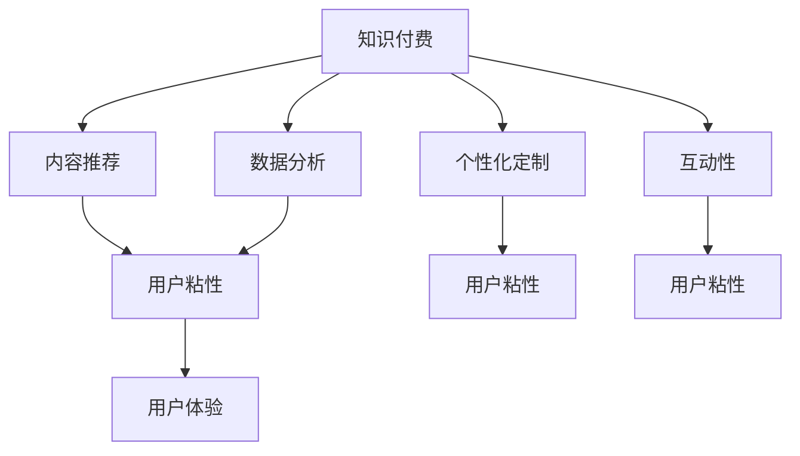

                 

# 如何提高知识付费产品的用户粘性

> 关键词：知识付费、用户粘性、内容推荐、互动性、社交功能、数据分析、个性化定制

## 1. 背景介绍

### 1.1 问题由来

随着互联网和数字经济的迅速发展，知识付费已经成为一个重要的行业方向。越来越多的用户愿意为获取高质量的内容支付费用，这不仅满足了他们对知识和技能提升的需求，也推动了知识创作者的经济收入。然而，随着市场的竞争加剧，知识付费产品面临着用户流失、转化率低、收益下降等挑战。如何提高知识付费产品的用户粘性，保持用户的持续关注和参与，成为当前知识付费平台亟需解决的关键问题。

### 1.2 问题核心关键点

用户粘性（User Sticking）是指用户在某个知识付费产品上的长期忠诚度和活跃度。提升用户粘性不仅能够增加用户的生命周期价值，还为知识付费平台带来稳定的收益和品牌忠诚度。提升用户粘性的关键在于构建一个能够满足用户需求、提供良好用户体验的知识付费平台。

提升用户粘性的核心关键点包括：
- 内容质量：提供高质量、有价值、富有吸引力的内容，满足用户的知识需求。
- 用户体验：打造流畅、高效、稳定的使用体验，降低用户流失率。
- 个性化推荐：通过算法推荐用户感兴趣的课程和内容，提高用户满意度。
- 互动性和社交功能：增加用户之间的互动和交流，增强平台的社交性。
- 数据分析和用户反馈：通过数据分析优化产品设计和运营策略，及时响应用户需求。

## 2. 核心概念与联系

### 2.1 核心概念概述

为更好地理解如何提高知识付费产品的用户粘性，本节将介绍几个密切相关的核心概念：

- 知识付费（Knowledge-Based Payment）：用户为获取知识和技能而支付费用的经济模式，包括在线课程、电子书、专家讲座等形式。
- 用户粘性（User Sticking）：用户对知识付费产品的持续关注和使用的程度。
- 内容推荐系统（Content Recommendation System）：利用算法推荐用户感兴趣的内容，提高用户满意度和平台粘性。
- 个性化定制（Personalization）：根据用户的行为和偏好，提供个性化的课程推荐和服务。
- 互动性（Interactivity）：增加用户之间的交流和反馈，提升用户参与感。
- 数据分析（Data Analytics）：通过数据挖掘和分析，优化产品设计和运营策略。

这些核心概念之间的逻辑关系可以通过以下Mermaid流程图来展示：



这个流程图展示了一知识付费平台的核心概念及其之间的关系：

1. 知识付费作为基础，提供各类有价值的知识内容。
2. 内容推荐和个性化定制增强用户粘性。
3. 互动性和数据分析进一步提升用户体验。
4. 用户体验的优化，反过来影响用户粘性。
5. 数据驱动的优化策略，能够不断提升知识付费产品的市场竞争力。

## 3. 核心算法原理 & 具体操作步骤
### 3.1 算法原理概述

提升知识付费产品用户粘性的一个关键步骤是构建一个高效的内容推荐系统。内容推荐系统通过分析用户的历史行为和偏好，推荐用户可能感兴趣的内容，增加用户的活跃度和停留时间，从而提升用户粘性。

形式化地，假设知识付费平台的用户集为 $U$，内容集为 $C$，用户对内容的评分矩阵为 $R \in \mathbb{R}^{U \times C}$。用户 $u \in U$ 对内容 $c \in C$ 的评分 $r_{uc}$ 表示其对内容的兴趣程度。内容推荐系统的目标是最大化用户的兴趣满足度，即最大化下式：

$$
\max_{p} \sum_{u \in U} \sum_{c \in C} r_{uc}p_{uc}
$$

其中 $p_{uc}$ 为内容 $c$ 被推荐给用户 $u$ 的概率，需满足 $0 \leq p_{uc} \leq 1$ 和 $\sum_{c \in C} p_{uc} = 1$。

通常使用协同过滤、矩阵分解、深度学习等算法实现内容推荐系统。协同过滤算法通过分析用户和内容之间的相似度，推荐与用户历史评分相似的内容。矩阵分解算法通过将评分矩阵分解为两个低维矩阵，进一步提升推荐精度。深度学习算法通过构建复杂的神经网络模型，学习用户和内容的潜在特征表示，实现更准确的推荐。

### 3.2 算法步骤详解

以下是一个基于协同过滤算法的内容推荐系统的详细步骤：

**Step 1: 数据准备**
- 收集用户的历史评分数据，构建用户-内容评分矩阵 $R$。
- 进行用户和内容的冷启动，引入预设的初始评分矩阵 $R_0$。

**Step 2: 相似度计算**
- 计算用户 $u$ 与内容 $c$ 的相似度 $s_{uc}$。常见的相似度计算方法包括皮尔逊相关系数、余弦相似度等。
- 通过相似度矩阵 $S \in \mathbb{R}^{U \times C}$ 表示用户和内容之间的相似度。

**Step 3: 协同过滤**
- 对于每个用户 $u$，找到与其相似度最高的 $k$ 个用户 $U'$。
- 计算这些相似用户的评分加权平均值 $p_{uc}$，作为用户 $u$ 对内容 $c$ 的推荐概率。
- 对所有内容重复上述过程，生成推荐列表。

**Step 4: 评价与优化**
- 计算推荐系统的效果指标，如准确率、召回率、覆盖率等。
- 根据效果指标，调整模型参数，优化推荐算法。

**Step 5: 实时推荐**
- 在用户浏览、购买等行为中，实时更新评分矩阵和相似度矩阵。
- 动态调整推荐列表，保持推荐内容的实时性和相关性。

### 3.3 算法优缺点

基于协同过滤算法的内容推荐系统具有以下优点：
1. 简单易实现：协同过滤算法不需要大量的特征工程，可以快速构建推荐系统。
2. 效果好：协同过滤能够捕捉用户和内容之间的隐含关联，推荐相关度较高。
3. 可扩展性好：协同过滤算法易于扩展到大规模数据集，适用于知识付费平台的用户和内容。

同时，该算法也存在以下局限性：
1. 数据稀疏性：知识付费平台的用户评分数据通常较为稀疏，协同过滤算法需要处理大量的零值。
2. 冷启动问题：新用户和新内容没有历史评分数据，推荐效果较差。
3. 可解释性不足：协同过滤算法的推荐结果较难解释，用户难以理解推荐的依据。
4. 稳定性问题：协同过滤算法对噪声和异常值敏感，推荐结果可能存在波动。

尽管存在这些局限性，协同过滤算法仍然是一个广泛应用且有效的推荐策略。未来研究的方向包括改进数据处理技术，增加推荐系统的可解释性，提高推荐系统的鲁棒性等。

### 3.4 算法应用领域

基于协同过滤算法的内容推荐系统广泛应用于知识付费平台，包括在线课程、电子书、视频讲座等各类形式。通过推荐系统，平台能够提高用户满意度，增加用户粘性，提升平台收益。

除了知识付费领域，协同过滤算法也被广泛应用到电商、社交网络、视频推荐等多个场景中。这些领域的推荐系统都采用了协同过滤算法，通过用户行为数据挖掘，推荐用户可能感兴趣的商品、朋友、视频等。

## 4. 数学模型和公式 & 详细讲解  
### 4.1 数学模型构建

本节将使用数学语言对知识付费平台的内容推荐系统进行更加严格的刻画。

记用户集为 $U$，内容集为 $C$，用户对内容的评分矩阵为 $R \in \mathbb{R}^{U \times C}$。用户 $u \in U$ 对内容 $c \in C$ 的评分 $r_{uc}$ 表示其对内容的兴趣程度。设 $R_0 \in \mathbb{R}^{U \times C}$ 为预设的初始评分矩阵，$S \in \mathbb{R}^{U \times C}$ 为用户和内容的相似度矩阵。

内容推荐系统的目标是最大化用户的兴趣满足度，即最大化下式：

$$
\max_{p} \sum_{u \in U} \sum_{c \in C} r_{uc}p_{uc}
$$

其中 $p_{uc}$ 为内容 $c$ 被推荐给用户 $u$ 的概率，需满足 $0 \leq p_{uc} \leq 1$ 和 $\sum_{c \in C} p_{uc} = 1$。

### 4.2 公式推导过程

以下我们以协同过滤算法为例，推导推荐系统的效果评估指标。

假设推荐系统为用户 $u$ 推荐了 $k$ 个内容 $c_1, c_2, \ldots, c_k$。设 $p_{uc}$ 为用户 $u$ 对内容 $c$ 的推荐概率，$g_{uc}$ 为推荐系统对内容 $c$ 的评分估计，$\hat{r}_{uc}$ 为用户 $u$ 对内容 $c$ 的真实评分。

推荐系统的效果评估指标包括：
- 准确率（Accuracy）：推荐内容与用户评分的一致性。
- 召回率（Recall）：推荐系统中覆盖用户感兴趣内容的程度。
- 覆盖率（Coverage）：推荐系统中涉及内容的丰富度。

假设 $N$ 为用户评分数据中非零评分的数量，$M$ 为知识付费平台中内容的总数。推荐系统的效果指标可以表示为：

$$
\begin{aligned}
\text{Accuracy} &= \frac{1}{N} \sum_{u=1}^N \sum_{c=1}^M (p_{uc}g_{uc} \geq \hat{r}_{uc})
\\
\text{Recall} &= \frac{1}{N} \sum_{u=1}^N \sum_{c=1}^M (\hat{r}_{uc} \geq \hat{r}_{uc}^*)
\\
\text{Coverage} &= \frac{1}{M} \sum_{c=1}^M \sum_{u=1}^N (p_{uc} \geq \hat{r}_{uc})
\end{aligned}
$$

其中 $\hat{r}_{uc}^*$ 为推荐系统对内容 $c$ 的评分估计，$N$ 和 $M$ 分别表示用户评分数据中非零评分的数量和知识付费平台中内容的总数。

### 4.3 案例分析与讲解

假设某知识付费平台有 $U=1000$ 个用户，$C=5000$ 个课程。平台收集了用户对课程的评分数据，但只有 $N=10000$ 条非零评分。现在使用协同过滤算法为用户推荐课程，取 $k=5$，推荐系统的效果评估指标如下：

- 准确率：
$$
\frac{1}{10000} \sum_{u=1}^{1000} \sum_{c=1}^{5000} (p_{uc}g_{uc} \geq \hat{r}_{uc})
$$

- 召回率：
$$
\frac{1}{10000} \sum_{u=1}^{1000} \sum_{c=1}^{5000} (\hat{r}_{uc} \geq \hat{r}_{uc}^*)
$$

- 覆盖率：
$$
\frac{1}{5000} \sum_{c=1}^{5000} \sum_{u=1}^{1000} (p_{uc} \geq \hat{r}_{uc})
$$

通过计算这些指标，可以评估推荐系统的推荐效果，并优化模型参数。

## 5. 项目实践：代码实例和详细解释说明
### 5.1 开发环境搭建

在进行知识付费产品推荐系统开发前，我们需要准备好开发环境。以下是使用Python进行Scikit-learn开发的环境配置流程：

1. 安装Anaconda：从官网下载并安装Anaconda，用于创建独立的Python环境。

2. 创建并激活虚拟环境：
```bash
conda create -n recommendation-env python=3.8 
conda activate recommendation-env
```

3. 安装Scikit-learn：
```bash
pip install scikit-learn
```

4. 安装各类工具包：
```bash
pip install numpy pandas scikit-learn matplotlib tqdm jupyter notebook ipython
```

完成上述步骤后，即可在`recommendation-env`环境中开始推荐系统实践。

### 5.2 源代码详细实现

下面我们以协同过滤算法为例，给出使用Scikit-learn库进行内容推荐系统的Python代码实现。

首先，定义用户和内容的评分数据：

```python
import numpy as np
from scipy.spatial.distance import cosine

# 用户和内容评分数据
R = np.array([[0, 2, 3, 0, 0],
              [0, 4, 5, 0, 0],
              [0, 1, 3, 0, 0],
              [0, 0, 0, 4, 5],
              [0, 0, 0, 2, 3]])

# 用户-内容评分矩阵转置
R = R.T
```

然后，定义相似度矩阵的计算函数：

```python
def similarity_matrix(R):
    S = np.zeros((R.shape[0], R.shape[1]))
    for i in range(R.shape[0]):
        for j in range(R.shape[1]):
            S[i, j] = 1 - cosine(R[i], R[j])
    return S
```

接着，定义协同过滤算法的内容推荐函数：

```python
from sklearn.metrics.pairwise import cosine_similarity

def collaborative_filtering(R, k=5, alpha=0.5):
    S = similarity_matrix(R)
    U = np.zeros_like(S)
    for i in range(S.shape[0]):
        s = S[i] - S[:, i]
        U[i] = s / (s.sum() + alpha)
    for j in range(S.shape[1]):
        s = S[:, j] - S[j, :]
        U[:, j] = s / (s.sum() + alpha)
    P = U.dot(S).T
    return P
```

最后，进行推荐系统的效果评估：

```python
from sklearn.metrics import accuracy_score, recall_score, coverage_error

# 对每个用户进行协同过滤推荐
P = collaborative_filtering(R)

# 定义用户对内容的评分
r = np.array([[2, 4, 3, 1, 5],
              [2, 3, 1, 5, 4],
              [3, 4, 1, 2, 5],
              [1, 2, 5, 3, 4],
              [5, 3, 2, 4, 1]])

# 计算推荐效果指标
accuracy = accuracy_score(r, P.round().astype(int))
recall = recall_score(r, P.round().astype(int), average='micro')
coverage = coverage_error(r, P.round().astype(int))

print(f"Accuracy: {accuracy:.2f}")
print(f"Recall: {recall:.2f}")
print(f"Coverage: {coverage:.2f}")
```

以上就是使用Scikit-learn对协同过滤算法进行内容推荐系统的完整代码实现。可以看到，借助Scikit-learn的强大封装，我们可以用相对简洁的代码完成协同过滤算法的实现和效果评估。

### 5.3 代码解读与分析

让我们再详细解读一下关键代码的实现细节：

**相似度矩阵计算函数**：
- 定义用户和内容的评分矩阵 $R$。
- 使用余弦相似度计算用户和内容的相似度矩阵 $S$。

**协同过滤推荐函数**：
- 对相似度矩阵 $S$ 进行归一化，得到用户和内容的相似度矩阵 $U$。
- 根据用户和内容的相似度矩阵 $S$ 和 $U$，计算推荐概率矩阵 $P$。
- 返回推荐概率矩阵 $P$。

**效果评估函数**：
- 使用Scikit-learn的评分矩阵评估指标，计算准确率、召回率和覆盖率。
- 输出推荐效果指标。

通过上述代码，可以很好地理解协同过滤算法的内容推荐过程和效果评估方法。实践中，可以通过调整算法参数（如 $k$、$\alpha$ 等）和优化相似度矩阵计算方法，进一步提升推荐系统的性能。

## 6. 实际应用场景
### 6.1 智能客服系统

知识付费平台的智能客服系统可以通过推荐系统提供个性化推荐，使用户能够快速找到解决方案。智能客服系统整合了自然语言处理、机器学习、推荐系统等技术，能够自动识别用户意图，提供相关的课程和资料。

在技术实现上，可以收集历史客服对话记录，提取问题和答案对，进行监督数据训练。在对话过程中，根据用户的问题描述，推荐系统能够推荐相关的课程和资料，帮助用户更快地解决问题。智能客服系统能够减少人工客服的工作量，提高服务效率，同时增强用户的粘性。

### 6.2 内容定制化推荐

知识付费平台可以根据用户的浏览、学习、购买等行为数据，生成个性化的推荐列表。推荐系统能够根据用户的历史行为，预测用户可能感兴趣的内容，并实时更新推荐列表。通过个性化的内容推荐，平台能够提高用户满意度，增加用户的生命周期价值。

在技术实现上，可以收集用户的行为数据，构建用户行为数据集。通过协同过滤、矩阵分解、深度学习等算法，进行推荐模型训练和优化。推荐系统能够根据用户的历史行为，动态调整推荐内容，满足用户不断变化的需求。

### 6.3 社交互动功能

知识付费平台可以引入社交互动功能，增加用户的参与度和粘性。用户可以在平台上分享学习心得、讨论课程内容、参与问答等活动，与其他用户互动。通过社交互动功能，平台能够增强用户的归属感和社区感，提升用户的粘性。

在技术实现上，可以构建用户关系网络，利用图神经网络等方法，分析用户之间的互动关系。通过社交互动功能，平台能够根据用户的行为和关系，推荐相关的内容和用户，促进用户之间的交流和互动。

### 6.4 未来应用展望

随着知识付费平台的发展，推荐系统将扮演越来越重要的角色。未来推荐系统将呈现出以下几个发展趋势：

1. 推荐算法的多样性：除了协同过滤算法，未来的推荐系统将引入更多推荐算法，如矩阵分解、深度学习、强化学习等，提升推荐精度和效果。
2. 推荐系统的实时性：未来的推荐系统将实现实时推荐，根据用户的行为和兴趣，动态更新推荐内容。
3. 推荐系统的可解释性：未来的推荐系统将增强推荐结果的可解释性，使用户理解推荐依据。
4. 推荐系统的个性化：未来的推荐系统将更加个性化，根据用户的行为和需求，提供量身定制的推荐内容。
5. 推荐系统的跨平台性：未来的推荐系统将实现跨平台推荐，根据用户在不同平台上的行为，提供统一的推荐内容。

通过技术创新和算法优化，知识付费平台的推荐系统将更加智能、高效、个性化，为用户带来更好的体验，提升平台的市场竞争力和用户粘性。

## 7. 工具和资源推荐
### 7.1 学习资源推荐

为了帮助开发者系统掌握知识付费产品推荐系统的理论基础和实践技巧，这里推荐一些优质的学习资源：

1. 《推荐系统实践》系列博文：由知名推荐系统专家撰写，深入浅出地介绍了推荐系统的基本原理、算法实现和应用场景。

2. 《推荐系统》课程：斯坦福大学开设的推荐系统课程，涵盖推荐系统的主要算法和技术，适合系统学习推荐系统知识。

3. 《推荐系统实战》书籍：推荐系统领域的经典书籍，介绍了多种推荐算法的实现方法和应用案例。

4. KDD推荐系统竞赛：推荐系统的世界级竞赛，涵盖推荐系统领域的最新技术进展和应用场景。

5. PyTorch官方文档：PyTorch的推荐系统示例代码，涵盖多种推荐算法的实现方法。

通过对这些资源的学习实践，相信你一定能够快速掌握知识付费产品推荐系统的精髓，并用于解决实际的推荐问题。
###  7.2 开发工具推荐

高效的开发离不开优秀的工具支持。以下是几款用于知识付费产品推荐系统开发的常用工具：

1. PyTorch：基于Python的开源深度学习框架，灵活动态的计算图，适合快速迭代研究。推荐系统中的协同过滤算法和深度学习算法都有PyTorch版本的实现。

2. TensorFlow：由Google主导开发的开源深度学习框架，生产部署方便，适合大规模工程应用。推荐系统中的协同过滤算法和深度学习算法也有TensorFlow版本的实现。

3. Scikit-learn：Python的机器学习库，简单易用，提供了多种推荐算法和评估指标。

4. Apache Spark：分布式计算框架，适合处理大规模数据集。推荐系统中的矩阵分解算法可以借助Spark实现。

5. Weights & Biases：模型训练的实验跟踪工具，可以记录和可视化模型训练过程中的各项指标，方便对比和调优。

6. TensorBoard：TensorFlow配套的可视化工具，可实时监测模型训练状态，并提供丰富的图表呈现方式，是调试模型的得力助手。

合理利用这些工具，可以显著提升知识付费产品推荐系统的开发效率，加快创新迭代的步伐。

### 7.3 相关论文推荐

知识付费产品推荐系统的研究源于学界的持续研究。以下是几篇奠基性的相关论文，推荐阅读：

1. Project-Based Matrix Factorization: Personalized Recommendation via Matrix Factorization of Item-Specific Preference Patterns: 提出了基于项目的矩阵分解算法，用于推荐系统中的用户-物品评分预测。

2. Collaborative Filtering for Implicit Feedback Datasets: 讨论了协同过滤算法在隐式反馈数据集上的应用，提出了改进的协同过滤算法，提高推荐精度。

3. A Matrix Factorization Approach with Dynamic Neighborhood for Collaborative Filtering: 提出了一种动态邻域矩阵分解算法，用于协同过滤推荐系统的改进。

4. Deep Personalized Ranking for Recommendation Systems: 讨论了深度学习在推荐系统中的应用，提出了基于深度神经网络的推荐算法。

5. Interactive Recommender Systems for Personalized Email: 讨论了推荐系统与用户互动的设计，通过用户反馈优化推荐算法。

这些论文代表了大规模推荐系统的发展脉络。通过学习这些前沿成果，可以帮助研究者把握推荐系统的发展方向，激发更多的创新灵感。

## 8. 总结：未来发展趋势与挑战
### 8.1 总结

本文对知识付费产品推荐系统的核心概念、算法原理和具体操作步骤进行了全面系统的介绍。首先阐述了知识付费产品和推荐系统的背景和意义，明确了推荐系统在提升用户粘性方面的独特价值。其次，从原理到实践，详细讲解了推荐系统的数学模型和算法实现，给出了推荐系统开发的完整代码实例。同时，本文还广泛探讨了推荐系统在智能客服、内容定制化推荐、社交互动等实际应用场景中的应用前景，展示了推荐系统的巨大潜力。此外，本文精选了推荐系统的各类学习资源，力求为读者提供全方位的技术指引。

通过本文的系统梳理，可以看到，知识付费产品推荐系统已经在推荐领域得到了广泛应用，通过提供个性化推荐，有效提升了用户的满意度和粘性。未来，伴随推荐算法的不断演进和优化，推荐系统必将在知识付费领域发挥更大的作用，为用户带来更优质的体验。

### 8.2 未来发展趋势

展望未来，推荐系统将呈现以下几个发展趋势：

1. 推荐算法的多样化：除了协同过滤算法，未来的推荐系统将引入更多推荐算法，如矩阵分解、深度学习、强化学习等，提升推荐精度和效果。

2. 推荐系统的实时性：未来的推荐系统将实现实时推荐，根据用户的行为和兴趣，动态更新推荐内容。

3. 推荐系统的可解释性：未来的推荐系统将增强推荐结果的可解释性，使用户理解推荐依据。

4. 推荐系统的个性化：未来的推荐系统将更加个性化，根据用户的行为和需求，提供量身定制的推荐内容。

5. 推荐系统的跨平台性：未来的推荐系统将实现跨平台推荐，根据用户在不同平台上的行为，提供统一的推荐内容。

以上趋势凸显了推荐系统的广阔前景。这些方向的探索发展，必将进一步提升推荐系统的性能和应用范围，为知识付费产品带来更广阔的发展空间。

### 8.3 面临的挑战

尽管知识付费产品推荐系统已经取得了一定的成就，但在迈向更加智能化、普适化应用的过程中，它仍面临着诸多挑战：

1. 数据稀疏性：知识付费平台的用户评分数据通常较为稀疏，协同过滤算法需要处理大量的零值。

2. 冷启动问题：新用户和新内容没有历史评分数据，推荐效果较差。

3. 可解释性不足：协同过滤算法的推荐结果较难解释，用户难以理解推荐的依据。

4. 稳定性问题：协同过滤算法对噪声和异常值敏感，推荐结果可能存在波动。

5. 数据隐私问题：知识付费平台需要处理用户的个人数据，如何保护用户隐私是一个重要的课题。

6. 推荐算法鲁棒性：推荐系统需要抵御恶意攻击和数据篡改，保持算法的鲁棒性和安全性。

以上挑战凸显了推荐系统在发展过程中需要解决的关键问题。未来的研究需要在数据处理、算法优化、用户隐私保护等方面进行深入探索，确保推荐系统的稳健性和安全性。

### 8.4 研究展望

面对推荐系统面临的挑战，未来的研究需要在以下几个方面寻求新的突破：

1. 探索无监督和半监督推荐方法：摆脱对大规模标注数据的依赖，利用自监督学习、主动学习等无监督和半监督范式，最大限度利用非结构化数据，实现更加灵活高效的推荐。

2. 研究参数高效和计算高效的推荐范式：开发更加参数高效的推荐方法，在固定大部分预训练参数的同时，只更新极少量的任务相关参数。同时优化推荐模型的计算图，减少前向传播和反向传播的资源消耗，实现更加轻量级、实时性的部署。

3. 引入因果分析和博弈论工具：将因果分析方法引入推荐模型，识别出推荐模型决策的关键特征，增强推荐结果的因果性和逻辑性。借助博弈论工具刻画人机交互过程，主动探索并规避推荐模型的脆弱点，提高系统稳定性。

4. 纳入伦理道德约束：在推荐模型的训练目标中引入伦理导向的评估指标，过滤和惩罚有偏见、有害的推荐结果，确保推荐系统符合伦理道德标准。

这些研究方向的探索，必将引领推荐系统技术迈向更高的台阶，为知识付费产品带来更智能、更公正、更安全的推荐体验。面向未来，推荐系统需要在数据、算法、工程、伦理等多个维度协同发力，共同推动知识付费产品的创新发展。总之，知识付费产品推荐系统需要在数据处理、算法优化、用户隐私保护等方面进行全面探索，才能真正实现推荐系统的高效、智能、公正和普适。

## 9. 附录：常见问题与解答

**Q1：知识付费产品推荐系统是否适用于所有推荐场景？**

A: 知识付费产品推荐系统在大部分推荐场景中都能取得不错的效果，特别是对于数据量较小的推荐任务。但对于一些特定领域的推荐任务，如医疗、法律等，推荐系统的表现可能较差。推荐系统需要在特定领域语料上进一步预训练和微调，才能获得理想效果。此外，对于一些需要时效性、个性化很强的任务，如在线广告、视频推荐等，推荐系统也需要针对性的改进优化。

**Q2：如何选择推荐算法？**

A: 推荐算法的选择需要根据数据特点和推荐任务的具体需求进行。对于数据稀疏的推荐任务，协同过滤算法通常表现较好。对于数据较为稠密的推荐任务，矩阵分解算法和深度学习算法更适合。需要根据具体任务进行调参和优化，选择最适合的推荐算法。

**Q3：推荐系统如何优化？**

A: 推荐系统的优化可以从以下几个方面进行：
1. 数据处理：对原始数据进行清洗、归一化、特征工程等预处理，提高数据质量。
2. 算法调参：根据实验结果调整算法参数，如协同过滤算法中的邻域大小、深度学习算法中的隐藏层数等。
3. 推荐效果评估：通过A/B测试等方法评估推荐效果，及时发现问题并进行优化。
4. 跨领域优化：对于多领域推荐任务，需要引入跨领域推荐算法，实现不同领域之间的数据共享和协同。

这些优化措施能够有效提升推荐系统的精度和效果，增加用户粘性。

**Q4：推荐系统如何实现跨平台推荐？**

A: 实现跨平台推荐需要建立统一的用户数据模型和推荐模型。可以将不同平台上的用户行为数据进行融合，构建统一的用户行为数据集。通过多平台的协同推荐，提高推荐系统的覆盖率和个性化水平。

跨平台推荐需要解决数据格式、用户隐私保护等问题。平台之间需要建立标准化的数据接口，保障数据安全和用户隐私。同时，需要引入多平台协同优化的机制，根据用户在多个平台上的行为，提供统一的推荐内容。

**Q5：推荐系统如何处理数据隐私问题？**

A: 推荐系统需要处理用户的个人数据，如何保护用户隐私是一个重要的课题。可以采用数据匿名化、加密传输等技术，保障用户数据的隐私和安全。在推荐模型的训练过程中，需要对数据进行严格的控制，避免数据泄露和滥用。同时，需要引入隐私保护算法，如差分隐私、联邦学习等，确保推荐模型的公平性和隐私性。

通过这些措施，可以有效解决推荐系统在数据隐私保护方面的问题，保障用户的合法权益。

---

作者：禅与计算机程序设计艺术 / Zen and the Art of Computer Programming

