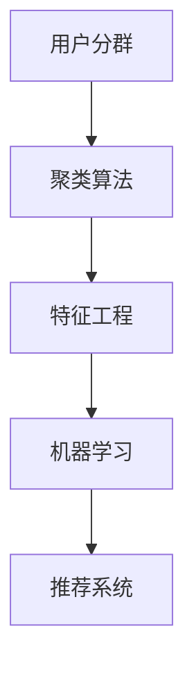

                 

# 如何进行有效的用户分群管理

在当今数字化时代，企业如何高效、准确地将用户进行分群，以便进行个性化推荐、定向广告投放、客户细分等，是每个企业都需要面对的重要课题。本文将深入探讨用户分群管理的相关概念、算法原理、具体步骤及实际应用场景，并给出详细的项目实践及学习资源推荐，帮助企业构建精准、高效的用户分群系统。

## 1. 背景介绍

### 1.1 问题由来

在互联网及移动互联网时代，用户行为和需求呈现多样化和复杂化趋势，如何更好地理解用户，提供定制化的服务，成为企业关注的重点。传统的基于人口统计学特征的用户分群方式，已难以满足精准营销的需求。采用数据驱动的方式，结合机器学习和人工智能技术进行用户分群，正逐步成为主流。

用户分群的目标是将用户划分为不同类别或细分市场，从而进行个性化的运营和营销。通过用户分群，企业可以更好地理解不同用户群体的特点，实施差异化的营销策略，提升客户满意度和忠诚度，增加收益。

### 1.2 问题核心关键点

用户分群的本质是对用户行为数据进行分析，找出相似用户群体，从而实现用户聚类。常见的问题包括：
- 如何选择合适的用户特征。
- 如何设计合理的聚类算法。
- 如何评估聚类结果的性能。
- 如何将聚类结果应用于实际业务。

## 2. 核心概念与联系

### 2.1 核心概念概述

为更好地理解用户分群管理的核心概念，本节将介绍几个关键概念及其联系。

- **用户分群（User Segmentation）**：将用户依据一定规则划分为若干不同群体，以便进行差异化运营。
- **聚类算法（Clustering Algorithm）**：通过相似性度量，将相似的数据点分为同一类别的算法。
- **特征工程（Feature Engineering）**：对原始数据进行处理、选择和提取，以便更好地用于模型训练。
- **机器学习（Machine Learning）**：利用数据驱动的方法，训练模型对用户进行分群。
- **推荐系统（Recommendation System）**：结合用户分群，推荐个性化的产品或服务。

这些核心概念之间的逻辑关系可以通过以下Mermaid流程图来展示：



该流程图展示了用户分群过程的关键步骤：

1. 用户分群的首要任务是对用户数据进行聚类。
2. 聚类算法需要设计合适的特征工程方案，提取出有用的用户特征。
3. 通过机器学习模型，对特征进行建模训练，得到用户分群的聚类结果。
4. 推荐系统根据用户分群的聚类结果，提供个性化的推荐服务。

## 3. 核心算法原理 & 具体操作步骤

### 3.1 算法原理概述

用户分群管理的核心算法为聚类算法，其目标是将用户划分为相似群体，以便进行差异化运营。聚类算法是一种无监督学习方法，旨在将数据点划分为若干群组，使得同一组内的数据点相似度最大，不同组间数据点差异度最大。

聚类算法的基本流程包括：
1. 选择相似性度量标准。
2. 对数据点进行特征提取和标准化。
3. 选择聚类算法并进行训练。
4. 对聚类结果进行评估和调整。

常见的聚类算法包括K-means、层次聚类、DBSCAN等，各有优缺点，适用于不同场景。

### 3.2 算法步骤详解

#### 3.2.1 数据预处理

数据预处理是用户分群管理的第一步。具体包括以下步骤：

1. **数据收集**：从各类数据源收集用户数据，包括行为数据、交易数据、社交数据等。
2. **数据清洗**：去除缺失值、重复值和异常值，清洗数据，确保数据质量。
3. **数据标准化**：对数据进行归一化和标准化处理，以便于算法处理。

#### 3.2.2 特征工程

特征工程是用户分群管理的关键环节。具体包括以下步骤：

1. **特征提取**：从原始数据中提取有用的特征，如年龄、性别、消费行为、兴趣标签等。
2. **特征选择**：对提取的特征进行选择和组合，去除冗余和噪声特征。
3. **特征编码**：将特征进行编码处理，如独热编码、二进制编码等。

#### 3.2.3 聚类算法选择

根据用户数据的特点，选择合适的聚类算法进行训练。常见聚类算法及其特点如下：

1. **K-means聚类**：适用于数据分布较为均匀的场景，但需要事先指定聚类数。
2. **层次聚类**：不需要指定聚类数，但计算复杂度高。
3. **DBSCAN聚类**：适用于发现任意形状的聚类，但对参数敏感。
4. **谱聚类**：对高维数据效果好，但计算复杂度高。

#### 3.2.4 模型训练与评估

对选择好的聚类算法进行模型训练，并评估聚类结果的性能。具体包括以下步骤：

1. **模型训练**：对数据进行聚类，得到聚类结果。
2. **评估指标**：选择合适的评估指标，如轮廓系数、调整兰德系数等，评估聚类结果的质量。
3. **聚类调整**：对聚类结果进行调整，如增加特征、调整聚类数等，优化聚类效果。

#### 3.2.5 聚类结果应用

对聚类结果进行应用，实施差异化运营策略。具体包括以下步骤：

1. **客户细分**：根据聚类结果，对用户进行客户细分，制定差异化运营策略。
2. **个性化推荐**：结合用户聚类结果，提供个性化的推荐服务。
3. **定向广告投放**：根据用户聚类结果，进行定向广告投放，提升广告效果。

## 4. 数学模型和公式 & 详细讲解

### 4.1 数学模型构建

用户分群管理的数学模型主要包括以下几个部分：

- **数据集**：$D=\{(x_i, y_i)\}_{i=1}^N$，其中 $x_i$ 为样本特征，$y_i$ 为样本标签。
- **聚类中心**：$C=\{c_k\}_{k=1}^K$，其中 $c_k$ 为第 $k$ 个聚类中心。
- **相似性度量**：$sim(x_i, c_k)$，用于衡量样本与聚类中心的相似度。

### 4.2 公式推导过程

以K-means聚类为例，其核心公式如下：

$$
c_k = \frac{1}{n_k} \sum_{x_i \in D_k} x_i, \quad k = 1, ..., K
$$

其中 $n_k$ 为第 $k$ 个聚类中的样本数，$D_k$ 为第 $k$ 个聚类中的样本集合。

在每次迭代中，K-means算法更新聚类中心的公式为：

$$
c_k = \frac{1}{n_k} \sum_{x_i \in D_k} x_i, \quad k = 1, ..., K
$$

其中 $x_i$ 为第 $i$ 个样本，$n_k$ 为第 $k$ 个聚类中的样本数，$D_k$ 为第 $k$ 个聚类中的样本集合。

### 4.3 案例分析与讲解

以某电商平台的用户分群管理为例，展示K-means聚类算法的应用：

1. **数据收集**：从电商平台收集用户的历史浏览、购买数据，包括浏览时长、消费金额、购买频率等。
2. **数据预处理**：去除缺失值和异常值，对数据进行标准化处理。
3. **特征工程**：提取用户的历史浏览时长、消费金额、购买频率等特征，进行独热编码。
4. **模型训练**：选择K-means聚类算法，对用户进行聚类，得到4个聚类中心。
5. **评估指标**：计算轮廓系数，评估聚类效果，发现聚类质量有待提升。
6. **聚类调整**：增加年龄、性别等特征，调整聚类数，重新训练模型，得到5个聚类中心。
7. **聚类结果应用**：根据用户聚类结果，对不同用户群体实施不同的运营策略，提升客户满意度和忠诚度。

## 5. 项目实践：代码实例和详细解释说明

### 5.1 开发环境搭建

在进行用户分群管理项目实践前，我们需要准备好开发环境。以下是使用Python进行Scikit-learn开发的Python环境配置流程：

1. 安装Anaconda：从官网下载并安装Anaconda，用于创建独立的Python环境。

2. 创建并激活虚拟环境：
```bash
conda create -n user-segmentation python=3.8 
conda activate user-segmentation
```

3. 安装Scikit-learn：
```bash
conda install scikit-learn
```

4. 安装各类工具包：
```bash
pip install numpy pandas scikit-learn matplotlib tqdm jupyter notebook ipython
```

完成上述步骤后，即可在`user-segmentation`环境中开始用户分群管理项目实践。

### 5.2 源代码详细实现

下面以K-means聚类为例，给出使用Scikit-learn对用户进行分群的PyTorch代码实现。

首先，定义数据处理函数：

```python
import numpy as np
from sklearn.cluster import KMeans
from sklearn.preprocessing import StandardScaler
from sklearn.metrics import silhouette_score

def preprocess_data(data):
    # 数据标准化处理
    scaler = StandardScaler()
    scaled_data = scaler.fit_transform(data)
    
    # 聚类
    kmeans = KMeans(n_clusters=3, random_state=0)
    kmeans.fit(scaled_data)
    
    # 评估聚类效果
    silhouette = silhouette_score(scaled_data, kmeans.labels_)
    return scaled_data, kmeans.labels_, silhouette
```

然后，定义数据生成函数：

```python
def generate_data(n_samples, n_features):
    # 生成随机数据
    data = np.random.randn(n_samples, n_features)
    
    # 添加噪声
    noise = np.random.normal(0, 0.1, size=n_samples)
    data += noise
    
    return data
```

接着，定义聚类效果评估函数：

```python
def evaluate_clusters(silhouette):
    if silhouette > 0.5:
        return "聚类效果良好"
    elif 0 <= silhouette < 0.5:
        return "聚类效果一般"
    else:
        return "聚类效果较差"
```

最后，启动数据生成、数据预处理、聚类和评估流程：

```python
n_samples = 1000
n_features = 5

# 生成数据
data = generate_data(n_samples, n_features)

# 数据预处理
scaled_data, labels, silhouette = preprocess_data(data)

# 聚类效果评估
print(evaluate_clusters(silhouette))
```

### 5.3 代码解读与分析

让我们再详细解读一下关键代码的实现细节：

**preprocess_data函数**：
- `StandardScaler`：对数据进行标准化处理。
- `KMeans`：对数据进行聚类，设置聚类数为3。
- `silhouette_score`：计算轮廓系数，评估聚类效果。

**generate_data函数**：
- `np.random.randn`：生成随机数据。
- `np.random.normal`：添加噪声。

**evaluate_clusters函数**：
- 根据轮廓系数评估聚类效果，判断聚类质量。

**数据生成流程**：
- 设置样本数和特征数。
- 生成随机数据。
- 对数据进行预处理和聚类。
- 评估聚类效果，输出聚类质量。

可以看到，Scikit-learn库使得用户分群管理的代码实现变得简洁高效。开发者可以将更多精力放在数据处理、聚类方法选择等高层逻辑上，而不必过多关注底层的实现细节。

## 6. 实际应用场景

### 6.1 智能推荐系统

用户分群管理在智能推荐系统中具有广泛应用。通过用户分群，推荐系统可以根据用户特点和兴趣，提供个性化的推荐服务。

具体而言，可以收集用户的历史行为数据，包括浏览记录、购买历史、评分记录等，使用K-means等聚类算法进行用户分群。对不同用户群体，采用不同的推荐策略，如兴趣推荐、个性化推荐等，提升推荐效果和用户满意度。

### 6.2 广告投放优化

用户分群管理在广告投放优化中具有重要意义。通过用户分群，广告投放系统可以根据用户特点和行为，进行精准投放，提高广告效果和投放ROI。

具体而言，可以收集用户的浏览记录、购买记录、点击记录等，使用K-means等聚类算法进行用户分群。对不同用户群体，设计不同的广告投放策略，如定向广告、兴趣爱好广告等，提升广告效果和点击率。

### 6.3 客户细分管理

用户分群管理在客户细分管理中具有重要价值。通过用户分群，企业可以更好地理解不同客户群体的需求和特点，制定差异化的运营策略。

具体而言，可以收集客户的交易记录、社交数据、行为数据等，使用K-means等聚类算法进行用户分群。对不同客户群体，实施不同的运营策略，如差异化定价、个性化服务等，提升客户满意度和忠诚度。

### 6.4 未来应用展望

随着用户分群管理技术的发展，未来的应用场景将更加广泛。以下列举几个可能的未来应用：

1. **个性化健康管理**：通过用户分群，提供个性化的健康管理方案，提升用户健康水平和体验。
2. **智能教育**：通过用户分群，提供个性化的学习方案，提升学习效果和体验。
3. **智能物流**：通过用户分群，提供个性化的物流服务，提升物流效率和用户体验。
4. **智能金融**：通过用户分群，提供个性化的金融服务，提升金融产品和服务质量。

未来，用户分群管理技术将进一步深入各个行业，成为提升用户体验和服务质量的重要手段。

## 7. 工具和资源推荐

### 7.1 学习资源推荐

为了帮助开发者系统掌握用户分群管理的理论基础和实践技巧，这里推荐一些优质的学习资源：

1. 《数据挖掘与统计学习》系列博文：由数据科学家撰写，涵盖数据预处理、特征工程、聚类算法等基础知识。

2. CS229《机器学习》课程：斯坦福大学开设的机器学习明星课程，有Lecture视频和配套作业，涵盖各类机器学习算法及其应用。

3. 《Python机器学习》书籍：斯科特·弗伦奇所著，全面介绍了使用Python进行机器学习建模和分析的实战技巧。

4. Kaggle平台：数据科学竞赛平台，可以获取各类数据集和代码实现，是学习用户分群管理的重要资源。

5. Weights & Biases：模型训练的实验跟踪工具，可以记录和可视化模型训练过程中的各项指标，方便对比和调优。

通过对这些资源的学习实践，相信你一定能够快速掌握用户分群管理的精髓，并用于解决实际的业务问题。

### 7.2 开发工具推荐

高效的开发离不开优秀的工具支持。以下是几款用于用户分群管理开发的常用工具：

1. Python：数据科学和机器学习的主流语言，简单易学，生态丰富。

2. Scikit-learn：开源的机器学习库，集成了各类聚类算法和评估指标，适合快速迭代研究。

3. TensorFlow：由Google主导开发的开源深度学习框架，生产部署方便，适合大规模工程应用。

4. Weights & Biases：模型训练的实验跟踪工具，可以记录和可视化模型训练过程中的各项指标，方便对比和调优。

5. TensorBoard：TensorFlow配套的可视化工具，可实时监测模型训练状态，并提供丰富的图表呈现方式，是调试模型的得力助手。

6. Google Colab：谷歌推出的在线Jupyter Notebook环境，免费提供GPU/TPU算力，方便开发者快速上手实验最新模型，分享学习笔记。

合理利用这些工具，可以显著提升用户分群管理的开发效率，加快创新迭代的步伐。

### 7.3 相关论文推荐

用户分群管理的研究源于学界的持续研究。以下是几篇奠基性的相关论文，推荐阅读：

1. K-means: A method for clustering multivariate data based on distances （K-means聚类算法）：提出K-means聚类算法，广泛应用于各类数据聚类问题。

2. DBSCAN: A Density-Based Clustering Algorithm for Discovering Clusters in Large Spatial Databases with Noise （DBSCAN聚类算法）：提出DBSCAN聚类算法，适用于发现任意形状的聚类。

3. Hierarchical Clustering （层次聚类算法）：介绍层次聚类算法，适用于聚类数未知的场景。

4. Spectral Clustering: A Tutorial （谱聚类算法）：介绍谱聚类算法，适用于高维数据聚类。

这些论文代表了大语言模型微调技术的发展脉络。通过学习这些前沿成果，可以帮助研究者把握学科前进方向，激发更多的创新灵感。

## 8. 总结：未来发展趋势与挑战

### 8.1 总结

本文对用户分群管理的核心概念、算法原理、具体操作步骤及实际应用场景进行了全面系统的介绍。首先阐述了用户分群管理的背景和意义，明确了聚类算法在用户分群管理中的核心地位。其次，从原理到实践，详细讲解了用户分群管理的数学模型和算法步骤，给出了完整的项目实践代码。同时，本文还探讨了用户分群管理在推荐系统、广告投放、客户细分等多个业务场景的应用，展示了其广泛的应用前景。最后，本文精选了用户分群管理的各类学习资源，力求为读者提供全方位的技术指引。

通过本文的系统梳理，可以看到，用户分群管理技术正成为企业提升运营效率和用户满意度的重要手段。未来，伴随技术的不断进步，用户分群管理将变得更加高效、精准和智能化，为各行各业带来新的突破。

### 8.2 未来发展趋势

展望未来，用户分群管理技术将呈现以下几个发展趋势：

1. 算法自动化。未来的用户分群算法将更加自动化，能够自动选择最优的聚类算法和参数，降低人工干预。

2. 聚类鲁棒性增强。未来的聚类算法将更加鲁棒，能够处理噪声和异常数据，提升聚类效果。

3. 聚类结果可视化。未来的用户分群管理将更加注重聚类结果的可视化，帮助业务人员更直观地理解聚类效果。

4. 用户分群动态调整。未来的用户分群管理将更加灵活，能够根据业务需求和数据变化进行动态调整，保持聚类效果。

5. 跨平台协同。未来的用户分群管理将更加注重跨平台协同，能够实现不同平台数据的一致性管理和高效集成。

6. 用户分群实时化。未来的用户分群管理将更加注重实时性，能够实现对用户行为数据实时分析和聚类。

这些趋势将进一步提升用户分群管理的效率和效果，为各行各业带来新的变革。

### 8.3 面临的挑战

尽管用户分群管理技术已经取得了显著进展，但在迈向更加智能化、普适化应用的过程中，仍面临诸多挑战：

1. 数据质量问题。用户分群管理依赖于高质量的数据，但实际应用中数据质量往往难以保证，数据缺失、噪声等问题常见。如何提升数据质量，保证数据一致性，将是未来重要的研究方向。

2. 算法复杂度。用户分群管理算法复杂度较高，计算资源消耗较大。如何设计高效算法，降低计算成本，将是重要的优化方向。

3. 聚类结果可解释性。用户分群管理结果缺乏可解释性，难以理解聚类过程和聚类结果。如何提升聚类结果的可解释性，帮助业务人员理解聚类效果，将是重要的研究方向。

4. 跨平台协同问题。用户分群管理跨平台协同面临数据格式、数据格式、数据一致性等诸多挑战。如何实现跨平台协同，提升数据集成效率，将是重要的研究方向。

5. 实时性问题。用户分群管理需要实时处理大量数据，计算资源消耗较大。如何实现实时处理，降低计算延迟，将是重要的优化方向。

6. 隐私和安全问题。用户分群管理涉及大量用户数据，数据隐私和安全问题至关重要。如何保护用户隐私，确保数据安全，将是重要的研究方向。

7. 模型泛化能力。用户分群管理模型在训练过程中往往依赖特定场景数据，泛化能力有待提升。如何提升模型泛化能力，实现更好的跨场景迁移，将是重要的研究方向。

面对这些挑战，未来的研究需要在数据质量、算法优化、结果可解释性、跨平台协同、实时性、隐私和安全、模型泛化等多个方面进行深入探索。

### 8.4 研究展望

未来的研究需要在以下几个方面进行深入探索：

1. 自动化聚类算法。研究自动化选择聚类算法和参数的方法，降低人工干预，提升聚类效果。

2. 鲁棒性聚类算法。研究处理噪声和异常数据的方法，提升聚类鲁棒性。

3. 可视化聚类算法。研究可视化聚类结果的方法，帮助业务人员理解聚类效果。

4. 动态调整聚类算法。研究动态调整聚类算法的方法，提升聚类效果。

5. 跨平台协同算法。研究跨平台协同的方法，提升数据集成效率。

6. 实时处理聚类算法。研究实时处理数据的方法，降低计算延迟。

7. 隐私保护算法。研究保护用户隐私的方法，确保数据安全。

8. 模型泛化算法。研究提升模型泛化能力的方法，实现更好的跨场景迁移。

这些研究方向的探索，将进一步提升用户分群管理的效率和效果，为各行各业带来新的变革。相信通过学界和产业界的共同努力，用户分群管理技术必将进一步成熟，为构建智能化的业务系统提供强大的技术支撑。

## 9. 附录：常见问题与解答

**Q1：用户分群管理是否适用于所有业务场景？**

A: 用户分群管理技术适用于大多数业务场景，特别是需要个性化运营的业务。但在某些特殊场景，如实时性要求极高的业务，用户分群管理可能存在延迟问题，需要结合其他技术进行优化。

**Q2：如何选择适合的聚类算法？**

A: 选择适合的聚类算法需要考虑数据类型、数据分布、数据规模等因素。一般来说，K-means适用于数据分布较为均匀的场景，DBSCAN适用于发现任意形状的聚类，层次聚类适用于聚类数未知的场景。需要根据具体业务场景选择最合适的聚类算法。

**Q3：如何进行用户分群效果的评估？**

A: 用户分群效果评估可以从多个角度进行，如轮廓系数、兰德指数、互信息等。不同评估指标可以揭示不同方面的聚类效果，建议结合多个指标综合评估聚类效果。

**Q4：如何在聚类过程中处理噪声和异常数据？**

A: 在聚类过程中，可以通过DBSCAN等鲁棒性聚类算法处理噪声和异常数据。同时，可以通过参数调整和数据预处理等方式，提升数据质量，降低噪声和异常数据的影响。

**Q5：如何提升聚类结果的可解释性？**

A: 可以通过可视化聚类结果、生成聚类树状图等方式提升聚类结果的可解释性。同时，可以通过特征重要性分析等方法，帮助业务人员理解聚类过程和聚类结果。

---

作者：禅与计算机程序设计艺术 / Zen and the Art of Computer Programming

