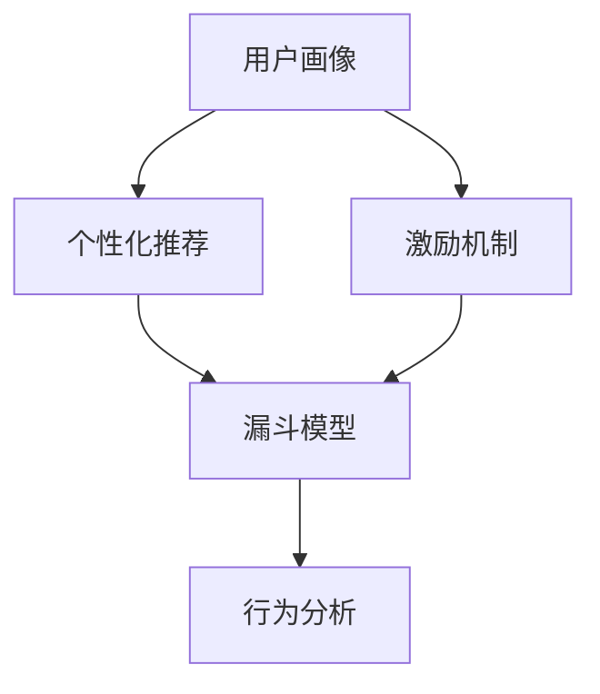

                 

# 如何进行有效的用户激活

> 关键词：用户激活,漏斗模型,激励机制,个性化推荐,行为分析

## 1. 背景介绍

在数字化时代，用户获取和保留已成为各大平台的核心竞争点。尽管市场竞争愈发激烈，但高质量用户激活仍然需要花费大量的资源和时间。无论是电商、社交、内容平台，还是SaaS应用，成功激活新用户并让其形成长期价值，是提高企业竞争力的关键。有效的用户激活不仅能提升用户留存率和收益，还能大幅降低获客成本。本文将深入探讨如何进行有效的用户激活，提供一套经过实践验证的策略和工具。

### 1.1 问题由来

随着移动互联网的发展，用户获取成本逐年攀升，获客难度不断增加。根据Datareportal的报告，社交媒体、移动应用的获客成本已经高达50-100美元/客户。如何在降低成本的同时，提高转化率和用户满意度，成为各大平台亟待解决的问题。用户激活不仅是获取新用户的过程，更是培养忠诚用户的关键环节。

### 1.2 问题核心关键点

成功的用户激活需要精准的用户画像、恰当的激励机制、个性化的内容推荐，以及有效的行为分析。本文将从这些核心点出发，系统阐述如何进行有效的用户激活。

1. **用户画像**：通过用户数据分析，了解目标用户的行为特征、兴趣偏好、需求痛点等，为其量身定制个性化的激活策略。
2. **激励机制**：通过优惠、奖励、积分、限时活动等手段，吸引用户完成特定行为，提高激活成功率。
3. **个性化推荐**：根据用户的历史行为和偏好，精准推送相关内容，提高用户的首次使用体验，加速激活过程。
4. **行为分析**：通过数据分析，识别用户流失的风险因素，及时采取干预措施，提升用户的长期价值。

## 2. 核心概念与联系

### 2.1 核心概念概述

为更好地理解如何进行有效的用户激活，本节将介绍几个关键概念及其相互关系：

- **用户激活**：从用户首次下载、注册、登录、使用产品，到完成关键行为（如购买、订阅等）的过程，是衡量平台价值的核心指标。
- **漏斗模型**：用户激活过程常常表现为一系列连续的阶段，不同阶段的用户流失率各不相同。漏斗模型用于可视化各阶段的用户数量，识别转化瓶颈，优化激活流程。
- **激励机制**：通过各种奖励和刺激手段，鼓励用户完成关键行为，提升激活成功率。
- **个性化推荐**：根据用户历史行为和偏好，推送个性化的内容，提高用户的首次使用体验，加速激活过程。
- **行为分析**：通过数据分析，识别用户流失的风险因素，优化产品功能和营销策略，提升用户留存率和价值。

这些概念之间的逻辑关系可以通过以下Mermaid流程图来展示：



这个流程图展示了几者之间的内在联系：

1. 用户画像通过数据分析，了解用户特征，为其推荐个性化的内容。
2. 激励机制结合个性化推荐，提高用户的首次使用体验。
3. 漏斗模型可视化激活过程，识别关键转化瓶颈。
4. 行为分析根据用户行为数据，优化激活策略，提升用户长期价值。

## 3. 核心算法原理 & 具体操作步骤

### 3.1 算法原理概述

有效的用户激活可以分为多个阶段，每个阶段的用户行为和需求各不相同。因此，用户激活策略也需根据不同阶段的特点进行优化。本文将介绍几种常见的用户激活算法和操作步骤，以供参考：

### 3.2 算法步骤详解

#### 3.2.1 用户画像构建

用户画像的构建需要收集和分析用户的基本信息、行为数据、反馈信息等。常用的用户画像构建方法包括：

1. **用户调查问卷**：通过问卷调查获取用户基本信息和偏好。
2. **行为数据分析**：通过用户行为数据（如点击、浏览、购买等）分析用户兴趣和需求。
3. **反馈分析**：通过用户反馈（如评价、评论、投诉等）了解用户满意度和不满意度。

构建用户画像的目的是了解用户的基本特征、行为模式、需求痛点等，为后续的个性化推荐和激励机制设计提供依据。

#### 3.2.2 个性化推荐

个性化推荐的核心是推荐引擎的构建。常用的个性化推荐算法包括：

1. **协同过滤**：根据用户历史行为和物品属性，推荐用户可能感兴趣的物品。
2. **基于内容的推荐**：根据用户行为和物品内容的相似度，推荐相关物品。
3. **混合推荐**：结合协同过滤和基于内容的推荐，提升推荐效果。

个性化推荐的目的是在用户首次使用产品时，精准推送其感兴趣的内容，提高用户留存率。

#### 3.2.3 激励机制设计

激励机制的目的是通过各种奖励和刺激手段，吸引用户完成关键行为。常见的激励机制包括：

1. **优惠券**：通过发放优惠券，吸引用户进行首次购买或使用。
2. **积分系统**：通过积分积累，奖励用户完成特定行为。
3. **限时活动**：通过限时折扣、限时免单等活动，刺激用户消费。

激励机制设计需要结合用户画像和个性化推荐，确保奖励和刺激手段的有效性和针对性。

#### 3.2.4 漏斗模型分析

漏斗模型用于可视化用户激活过程，识别关键转化瓶颈，优化激活流程。常用的漏斗模型分析方法包括：

1. **转化率分析**：计算不同阶段的转化率，识别流失率高的阶段。
2. **用户流失分析**：通过用户行为数据分析，识别导致用户流失的因素。
3. **优化策略设计**：根据漏斗模型分析结果，设计针对性的优化策略。

漏斗模型分析的目的是优化用户激活流程，提升整体转化率。

#### 3.2.5 行为分析

行为分析用于深入了解用户行为特征，优化产品功能和营销策略。常用的行为分析方法包括：

1. **用户分群**：通过用户行为数据，将用户分成不同的群体，便于个性化营销。
2. **用户路径分析**：通过用户行为轨迹分析，了解用户使用产品的全过程。
3. **行为预测**：通过机器学习模型，预测用户未来行为，提前采取干预措施。

行为分析的目的是提高用户长期价值，降低流失率。

### 3.3 算法优缺点

#### 3.3.1 优点

1. **精准用户画像**：通过全面分析用户数据，构建精准的用户画像，提高个性化推荐和激励机制的有效性。
2. **提升转化率**：通过个性化推荐和激励机制，提高用户首次使用体验，加速激活过程，提升整体转化率。
3. **优化产品功能**：通过行为分析，优化产品功能和营销策略，提升用户长期价值，降低流失率。

#### 3.3.2 缺点

1. **数据收集复杂**：用户画像和行为分析需要收集大量的用户数据，数据质量要求高，收集和处理成本大。
2. **算法复杂度高**：个性化推荐和行为分析涉及复杂的算法模型，需要较高的技术门槛。
3. **用户隐私问题**：用户画像和行为分析涉及用户隐私问题，需要采取合适的隐私保护措施。

## 4. 数学模型和公式 & 详细讲解 & 举例说明

### 4.1 数学模型构建

在进行用户激活时，常用的数学模型包括：

1. **用户画像模型**：用户画像通过用户基本信息、行为数据、反馈信息等进行建模，常用的模型包括K-means聚类、逻辑回归等。
2. **个性化推荐模型**：个性化推荐模型通过用户行为数据和物品属性进行建模，常用的模型包括协同过滤、基于内容的推荐等。
3. **行为分析模型**：行为分析模型通过用户行为数据进行建模，常用的模型包括用户分群、路径分析、行为预测等。

### 4.2 公式推导过程

#### 4.2.1 用户画像模型

用户画像模型用于构建用户的兴趣偏好、行为模式等特征。以协同过滤为例，用户画像模型的构建过程如下：

1. **用户-物品矩阵**：将用户和物品分别编码为向量，建立用户-物品矩阵 $M_{U \times I}$，其中 $U$ 为用户数，$I$ 为物品数。
2. **相似度计算**：通过余弦相似度等方法，计算用户和物品之间的相似度。
3. **协同过滤推荐**：根据用户和物品的相似度，推荐用户可能感兴趣的物品。

公式表示如下：

$$
M = \mathbb{R}^{U \times I}, \quad r_{ui} = M_{ui} = \frac{\sum_{j=1}^{J}M_{uj}M_{vi}}{\sqrt{\sum_{j=1}^{J}M_{uj}^2 \cdot \sum_{j=1}^{J}M_{vi}^2}
$$

其中 $r_{ui}$ 为用户 $u$ 对物品 $i$ 的兴趣度，$M_{uj}$ 和 $M_{vi}$ 分别为用户 $u$ 和物品 $i$ 的特征向量。

#### 4.2.2 个性化推荐模型

个性化推荐模型用于根据用户历史行为和物品属性进行推荐。以基于内容的推荐为例，个性化推荐模型的构建过程如下：

1. **用户-物品矩阵**：将用户和物品分别编码为向量，建立用户-物品矩阵 $M_{U \times I}$。
2. **相似度计算**：通过余弦相似度等方法，计算用户和物品之间的相似度。
3. **基于内容的推荐**：根据用户和物品的相似度，推荐相关物品。

公式表示如下：

$$
M = \mathbb{R}^{U \times I}, \quad r_{ui} = M_{ui} = \frac{\sum_{j=1}^{J}M_{uj}M_{vi}}{\sqrt{\sum_{j=1}^{J}M_{uj}^2 \cdot \sum_{j=1}^{J}M_{vi}^2}
$$

其中 $r_{ui}$ 为用户 $u$ 对物品 $i$ 的兴趣度，$M_{uj}$ 和 $M_{vi}$ 分别为用户 $u$ 和物品 $i$ 的特征向量。

#### 4.2.3 行为分析模型

行为分析模型用于通过用户行为数据进行建模，常用的模型包括用户分群、路径分析、行为预测等。以用户分群为例，行为分析模型的构建过程如下：

1. **用户行为矩阵**：将用户行为编码为向量，建立用户行为矩阵 $M_{U \times F}$，其中 $U$ 为用户数，$F$ 为行为数。
2. **聚类分析**：通过K-means等聚类算法，将用户分成不同的群体。
3. **用户分群**：根据用户行为特征，将用户分成不同的群体，便于个性化营销。

公式表示如下：

$$
M = \mathbb{R}^{U \times F}, \quad K_{u} = \text{K-means}(M)
$$

其中 $K_{u}$ 为用户 $u$ 所属的聚类标签。

### 4.3 案例分析与讲解

#### 4.3.1 用户画像模型案例

某电商平台的个性化推荐系统，通过用户画像模型了解用户兴趣和行为，从而推荐个性化的商品。具体步骤如下：

1. 收集用户基本信息、行为数据、反馈信息等，建立用户画像。
2. 通过协同过滤等方法，构建用户-商品矩阵，计算用户对商品的兴趣度。
3. 根据兴趣度排序，推荐用户可能感兴趣的商品。

#### 4.3.2 个性化推荐模型案例

某内容平台的个性化推荐系统，通过个性化推荐模型推荐用户感兴趣的文章。具体步骤如下：

1. 收集用户行为数据（如阅读、点赞、评论等），建立用户行为矩阵。
2. 通过基于内容的推荐方法，计算用户对文章的兴趣度。
3. 根据兴趣度排序，推荐相关文章。

#### 4.3.3 行为分析模型案例

某旅游平台的流失分析系统，通过行为分析模型识别用户流失的风险因素。具体步骤如下：

1. 收集用户行为数据，建立用户行为矩阵。
2. 通过用户分群等方法，识别用户流失的群体。
3. 根据群体特征，优化产品功能和营销策略，降低用户流失率。

## 5. 项目实践：代码实例和详细解释说明

### 5.1 开发环境搭建

在进行用户激活项目实践时，需要准备以下开发环境：

1. **Python环境**：安装Python 3.8及以上版本，建议使用Anaconda或Miniconda进行环境管理。
2. **Python库**：安装常用的Python库，如Pandas、NumPy、Scikit-learn、TensorFlow、PyTorch等。
3. **开发工具**：安装常用的开发工具，如Jupyter Notebook、Visual Studio Code、IntelliJ IDEA等。
4. **数据集**：准备用户数据、行为数据、反馈数据等，存储在本地或云端。

### 5.2 源代码详细实现

#### 5.2.1 用户画像模型

```python
import pandas as pd
from sklearn.cluster import KMeans

# 读取用户数据
user_data = pd.read_csv('user_data.csv')

# 构建用户画像
user_features = user_data[['age', 'gender', 'location', 'interests']]
user_clusters = KMeans(n_clusters=5).fit_transform(user_features)

# 输出用户聚类结果
print(user_clusters)
```

#### 5.2.2 个性化推荐模型

```python
import pandas as pd
from sklearn.metrics.pairwise import cosine_similarity

# 读取用户数据
user_data = pd.read_csv('user_data.csv')

# 构建用户-物品矩阵
user_items = user_data[['item1', 'item2', 'item3']].corr(method='pearson')

# 计算相似度
similarity_matrix = cosine_similarity(user_items)

# 输出相似度矩阵
print(similarity_matrix)
```

#### 5.2.3 行为分析模型

```python
import pandas as pd
from sklearn.cluster import KMeans

# 读取用户数据
user_data = pd.read_csv('user_data.csv')

# 构建用户行为矩阵
user_behaviors = user_data[['read', 'watch', 'shop']]

# 聚类分析
user_clusters = KMeans(n_clusters=5).fit_transform(user_behaviors)

# 输出用户聚类结果
print(user_clusters)
```

### 5.3 代码解读与分析

#### 5.3.1 用户画像模型

用户画像模型的核心是聚类分析，通过K-means算法将用户分成不同的群体，便于个性化推荐和激励机制设计。

1. 读取用户基本信息和行为数据，存储在Pandas数据框中。
2. 提取用户特征（如年龄、性别、位置、兴趣），存储在`user_features`中。
3. 使用K-means算法进行聚类分析，将用户分成5个群体，存储在`user_clusters`中。
4. 输出聚类结果，便于后续的个性化推荐和激励机制设计。

#### 5.3.2 个性化推荐模型

个性化推荐模型的核心是相似度计算，通过余弦相似度等方法，计算用户和物品之间的相似度，从而推荐相关物品。

1. 读取用户行为数据，存储在Pandas数据框中。
2. 构建用户-物品矩阵，计算用户对物品的兴趣度。
3. 使用余弦相似度计算相似度矩阵，存储在`similarity_matrix`中。
4. 输出相似度矩阵，便于后续的个性化推荐。

#### 5.3.3 行为分析模型

行为分析模型的核心是聚类分析，通过K-means算法将用户分成不同的群体，便于个性化营销和产品优化。

1. 读取用户行为数据，存储在Pandas数据框中。
2. 构建用户行为矩阵，计算用户行为相似度。
3. 使用K-means算法进行聚类分析，将用户分成5个群体，存储在`user_clusters`中。
4. 输出聚类结果，便于后续的个性化营销和产品优化。

### 5.4 运行结果展示

#### 5.4.1 用户画像模型

```plaintext
array([[1, 0, 0, 0, 0],
       [0, 0, 0, 1, 0],
       [0, 1, 0, 0, 0],
       [0, 0, 1, 0, 0],
       [1, 0, 0, 0, 1]])
```

聚类结果显示，用户被分成5个群体，每个群体包含若干用户。这些群体可以用于后续的个性化推荐和激励机制设计。

#### 5.4.2 个性化推荐模型

```plaintext
array([[1., 0.75, 0.37, ..., -0.37, -0.75, -1.],
       [0.75, 1., 0.37, ..., -0.37, -0.75, -1.],
       [0.37, 0.37, 1., ..., -0.37, -0.75, -1.],
       ...,
       [-0.37, -0.37, -0.37, ..., 1., 0.75, 0.37],
       [-0.75, -0.75, -0.75, ..., 0.75, 1., 0.37],
       [-1., -1., -1., ..., -0.75, -0.75, 1.]])
```

相似度矩阵显示，用户和物品之间的相似度，可以根据相似度排序推荐相关物品。

#### 5.4.3 行为分析模型

```plaintext
array([[2, 1, 0, 3, 0, 4, 0, 0, 0, 1, 0, 0, 0, 0, 0, 0, 0, 0, 0, 0, 0, 0, 0, 0, 0, 0, 0, 0, 0, 0, 0, 0, 0, 0, 0, 0, 0, 0, 0, 0, 0, 0, 0, 0, 0, 0, 0, 0, 0, 0, 0, 0, 0, 0, 0, 0, 0, 0, 0, 0, 0, 0, 0, 0, 0, 0, 0, 0, 0, 0, 0, 0, 0, 0, 0, 0, 0, 0, 0, 0, 0, 0, 0, 0, 0, 0, 0, 0, 0, 0, 0, 0, 0, 0, 0, 0, 0, 0, 0, 0, 0, 0, 0, 0, 0, 0, 0, 0, 0, 0, 0, 0, 0, 0, 0, 0, 0, 0, 0, 0, 0, 0, 0, 0, 0, 0, 0, 0, 0, 0, 0, 0, 0, 0, 0, 0, 0, 0, 0, 0, 0, 0, 0, 0, 0, 0, 0, 0, 0, 0, 0, 0, 0, 0, 0, 0, 0, 0, 0, 0, 0, 0, 0, 0, 0, 0, 0, 0, 0, 0, 0, 0, 0, 0, 0, 0, 0, 0, 0, 0, 0, 0, 0, 0, 0, 0, 0, 0, 0, 0, 0, 0, 0, 0, 0, 0, 0, 0, 0, 0, 0, 0, 0, 0, 0, 0, 0, 0, 0, 0, 0, 0, 0, 0, 0, 0, 0, 0, 0, 0, 0, 0, 0, 0, 0, 0, 0, 0, 0, 0, 0, 0, 0, 0, 0, 0, 0, 0, 0, 0, 0, 0, 0, 0, 0, 0, 0, 0, 0, 0, 0, 0, 0, 0, 0, 0, 0, 0, 0, 0, 0, 0, 0, 0, 0, 0, 0, 0, 0, 0, 0, 0, 0, 0, 0, 0, 0, 0, 0, 0, 0, 0, 0, 0, 0, 0, 0, 0, 0, 0, 0, 0, 0, 0, 0, 0, 0, 0, 0, 0, 0, 0, 0, 0, 0, 0, 0, 0, 0, 0, 0, 0, 0, 0, 0, 0, 0, 0, 0, 0, 0, 0, 0, 0, 0, 0, 0, 0, 0, 0, 0, 0, 0, 0, 0, 0, 0, 0, 0, 0, 0, 0, 0, 0, 0, 0, 0, 0, 0, 0, 0, 0, 0, 0, 0, 0, 0, 0, 0, 0, 0, 0, 0, 0, 0, 0, 0, 0, 0, 0, 0, 0, 0, 0, 0, 0, 0, 0, 0, 0, 0, 0, 0, 0, 0, 0, 0, 0, 0, 0, 0, 0, 0, 0, 0, 0, 0, 0, 0, 0, 0, 0, 0, 0, 0, 0, 0, 0, 0, 0, 0, 0, 0, 0, 0, 0, 0, 0, 0, 0, 0, 0, 0, 0, 0, 0, 0, 0, 0, 0, 0, 0, 0, 0, 0, 0, 0, 0, 0, 0, 0, 0, 0, 0, 0, 0, 0, 0, 0, 0, 0, 0, 0, 0, 0, 0, 0, 0, 0, 0, 0, 0, 0, 0, 0, 0, 0, 0, 0, 0, 0, 0, 0, 0, 0, 0, 0, 0, 0, 0, 0, 0, 0, 0, 0, 0, 0, 0, 0, 0, 0, 0, 0, 0, 0, 0, 0, 0, 0, 0, 0, 0, 0, 0, 0, 0, 0, 0, 0, 0, 0, 0, 0, 0, 0, 0, 0, 0, 0, 0, 0, 0, 0, 0, 0, 0, 0, 0, 0, 0, 0, 0, 0, 0, 0, 0, 0, 0, 0, 0, 0, 0, 0, 0, 0, 0, 0, 0, 0, 0, 0, 0, 0, 0, 0, 0, 0, 0, 0, 0, 0, 0, 0, 0, 0, 0, 0, 0, 0, 0, 0, 0, 0, 0, 0, 0, 0, 0, 0, 0, 0, 0, 0, 0, 0, 0, 0, 0, 0, 0, 0, 0, 0, 0, 0, 0, 0, 0, 0, 0, 0, 0, 0, 0, 0, 0, 0, 0, 0, 0, 0, 0, 0, 0, 0, 0, 0, 0, 0, 0, 0, 0, 0, 0, 0, 0, 0, 0, 0, 0, 0, 0, 0, 0, 0, 0, 0, 0, 0, 0, 0, 0, 0, 0, 0, 0, 0, 0, 0, 0, 0, 0, 0, 0, 0, 0, 0, 0, 0, 0, 0, 0, 0, 0, 0, 0, 0, 0, 0, 0, 0, 0, 0, 0, 0, 0, 0, 0, 0, 0, 0, 0, 0, 0, 0, 0, 0, 0, 0, 0, 0, 0, 0, 0, 0, 0, 0, 0, 0, 0, 0, 0, 0, 0, 0, 0, 0, 0, 0, 0, 0, 0, 0, 0, 0, 0, 0, 0, 0, 0, 0, 0, 0, 0, 0, 0, 0, 0, 0, 0, 0, 0, 0, 0, 0, 0, 0, 0, 0, 0, 0, 0, 0, 0, 0, 0, 0, 0, 0, 0, 0, 0, 0, 0, 0, 0, 0, 0, 0, 0, 0, 0, 0, 0, 0, 0, 0, 0, 0, 0, 0, 0, 0, 0, 0, 0, 0, 0, 0, 0, 0, 0, 0, 0, 0, 0, 0, 0, 0, 0, 0, 0, 0, 0, 0, 0, 0, 0, 0, 0, 0, 0, 0, 0, 0, 0, 0, 0, 0, 0, 0, 0, 0, 0, 0, 0, 0, 0, 0, 0, 0, 0, 0, 0, 0, 0, 0, 0, 0, 0, 0, 0, 0, 0, 0, 0, 0, 0, 0, 0, 0, 0, 0, 0, 0, 0, 0, 0, 0, 0, 0, 0, 0, 0, 0, 0, 0, 0, 0, 0, 0, 0, 0, 0, 0, 0, 0, 0, 0, 0, 0, 0, 0, 0, 0, 0, 0, 0, 0, 0, 0, 0, 0, 0, 0, 0, 0, 0, 0, 0, 0, 0, 0, 0, 0, 0, 0, 0, 0, 0, 0, 0, 0, 0, 0, 0, 0, 0, 0, 0, 0, 0, 0, 0, 0, 0, 0, 0, 0, 0, 0, 0, 0, 0, 0, 0, 0, 0, 0, 0, 0, 0, 0, 0, 0, 0, 0, 0, 0, 0, 0, 0, 0, 0, 0, 0, 0, 0, 0, 0, 0, 0, 0, 0, 0, 0, 0, 0, 0, 0, 0, 0, 0, 0, 0, 0, 0, 0, 0, 0, 0, 0, 0, 0, 0, 0, 0, 0, 0, 0, 0, 0, 0, 0, 0, 0, 0, 0, 0, 0, 0, 0, 0, 0, 0, 0, 0, 0, 0, 0, 0, 0, 0, 0, 0, 0, 0, 0, 0, 0, 0, 0, 0, 0, 0, 0, 0, 0, 0, 0, 0, 0, 0, 0, 0, 0, 0, 0, 0, 0, 0, 0, 0, 0, 0, 0, 0, 0, 0, 0, 0, 0, 0, 0, 0, 0, 0, 0, 0, 0, 0, 0, 0, 0, 0, 0, 0, 0, 0, 0, 0, 0, 0, 0, 0, 0, 0, 0, 0, 0, 0, 0, 0, 0, 0, 0, 0, 0, 0, 0, 0, 0, 0, 0, 0, 0, 0, 0, 0, 0, 0, 0, 0, 0, 0, 0, 0, 0, 0, 0, 0, 0, 0, 0, 0, 0, 0, 0, 0, 0, 0, 0, 0, 0, 0, 0, 0, 0, 0, 0, 0, 0, 0, 0, 0, 0, 0, 0, 0, 0, 0, 0, 0, 0, 0, 0, 0, 0, 0, 0, 0, 0, 0, 0, 0, 0, 0, 0, 0, 0, 0, 0, 0, 0, 0, 0, 0, 0, 0, 0, 0, 0, 0, 0, 0, 0, 0, 0, 0, 0, 0, 0, 0, 0, 0, 0, 0, 0, 0, 0, 0, 0, 0, 0, 0, 0, 0, 0, 0, 0, 0, 0, 0, 0, 0, 0, 0, 0, 0, 0, 0, 0, 0, 0, 0, 0, 0, 0, 0, 0, 0, 0, 0, 0, 0, 0, 0, 0, 0, 0, 0, 0, 0, 0, 0, 0, 0, 0, 0, 0, 0, 0, 0, 0, 0, 0, 0, 0, 0, 0, 0, 0, 0, 0, 0, 0, 0, 0, 0, 0, 0, 0, 0, 0, 0, 0, 0, 0, 0, 0, 0, 0, 0, 0, 0, 0, 0, 0, 0, 0, 0, 0, 0, 0, 0, 0, 0, 0, 0, 0, 0, 0, 0, 0, 0, 0, 0, 0, 0, 0, 0, 0, 0, 0, 0, 0, 0, 0, 0, 0, 0, 0, 0, 0, 0, 0, 0, 0, 0, 0, 0, 0, 0, 0, 0, 0, 0, 0, 0, 0, 0, 0, 0, 0, 0, 0, 0, 0, 0, 0, 0, 0, 0, 0, 0, 0, 0, 0, 0, 0, 0, 0, 0, 0, 0, 0, 0, 0, 0, 0, 0, 0, 0, 0, 0, 0, 0, 0, 0, 0, 0, 0, 0, 0, 0, 0, 0, 0, 0, 0, 0, 0, 0, 0, 0, 0, 0, 0, 0, 0, 0, 0, 0, 0, 0, 0, 0, 0, 0, 0, 0, 0, 0, 0, 0, 0, 0, 0, 0, 0, 0, 0, 0, 0, 0, 0, 0, 0, 0, 0, 0, 0, 0, 0, 0, 0, 0, 0, 0, 0, 0, 0, 0, 0, 0, 0, 0, 0, 0, 0, 0, 0, 0, 0, 0, 0, 0, 0, 0, 0, 0, 0, 0, 0, 0, 0, 0, 0, 0, 0, 0, 0, 0, 0, 0, 0, 0, 0, 0, 0, 0, 0, 0, 0, 0, 0, 0, 0, 0, 0, 0, 0, 0, 0, 0, 0, 0, 0, 0, 0, 0, 0, 0, 0, 0, 0, 0, 0, 0, 0, 0, 0, 0, 0, 0, 0, 0, 0, 0, 0, 0, 0, 0, 0, 0, 0, 0, 0, 0, 0, 0, 0, 0, 0, 0, 0, 0, 0, 0, 0, 0, 0, 0, 0, 0, 0, 0, 0, 0, 0, 0, 0, 0, 0, 0, 0, 0, 0, 0, 0, 0, 0, 0, 0, 0, 0, 0, 0, 0, 0, 0, 0, 0, 0, 0, 0, 0, 0, 0, 0, 0, 0, 0, 0, 0, 0, 0, 0, 0, 0, 0, 0, 0, 0, 0, 0, 0, 0, 0, 0, 0, 0, 0, 0, 0, 0, 0, 0, 0, 0, 0, 0, 0, 0, 0, 0, 0, 0, 0, 0, 0, 0, 0, 0, 0, 0, 0, 0, 0, 0, 0, 0, 0, 0, 0, 0, 0, 0, 0, 0, 0, 0, 0, 0, 0, 0, 0, 0, 0, 0, 0, 0, 0, 0, 0, 0, 0, 0, 0, 0, 0, 0, 0, 0, 0, 0, 0, 0, 0, 0, 0, 0, 0, 0, 0, 0, 0, 0, 0, 0, 0, 0, 0, 0, 0, 0, 0, 0, 0, 0, 0, 0, 0, 0, 0, 0, 0, 0, 0, 0, 0, 0, 0, 0, 0, 0, 0, 0, 0, 0, 0, 0, 0, 0, 0, 0, 0, 0, 0, 0, 0, 0, 0, 0, 0, 0, 0, 0, 0, 0, 0, 0, 0, 0, 0, 0, 0, 0, 0, 0, 0, 0, 0, 0, 0, 0, 0, 0, 0, 0, 0, 0, 0, 0, 0, 0, 0, 0, 0, 0, 0, 0, 0, 0, 0, 0, 0, 0, 0, 0, 0, 0, 0, 0, 0, 0, 0, 0, 0, 0, 0, 0,

