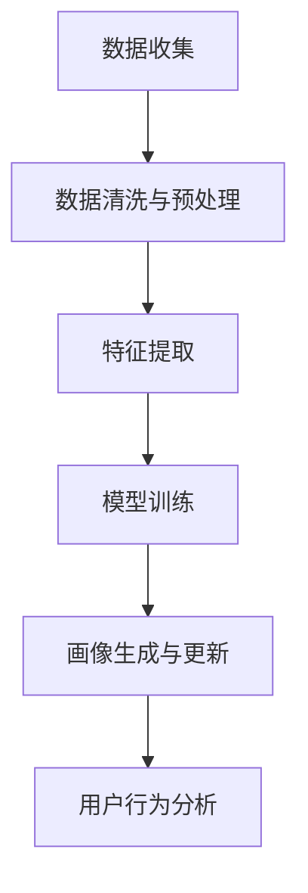

                 

## 1. 背景介绍

在当今数字化时代，用户画像分析成为了理解用户需求、指导产品开发和优化用户体验的关键手段。企业通过深入分析用户的行为数据、偏好和特征，可以制定更加精准的市场策略，提升用户满意度和忠诚度。然而，用户画像分析并非易事，如何构建完整、准确、动态的用户画像，是大数据时代面临的重要挑战。本文将深入探讨用户画像分析的核心概念、算法原理和操作步骤，并通过实际案例加以阐释，帮助读者掌握有效的用户画像分析方法和实践技巧。

## 2. 核心概念与联系

### 2.1 核心概念概述

用户画像（User Persona）是指基于用户行为数据、人口统计特征、心理特征等多维度信息，构建的一种用于描述和预测用户特征的抽象模型。良好的用户画像不仅能帮助企业深入理解目标用户群体的需求和行为，还能指导产品设计与优化，提升用户体验和满意度。

用户画像的构建一般包括以下步骤：
1. **数据收集**：从各种渠道收集用户数据，包括社交媒体、网站日志、交易记录、问卷调查等。
2. **数据清洗与预处理**：清洗异常数据，填补缺失值，转换数据格式，保证数据的准确性和完整性。
3. **特征提取**：从清洗后的数据中提取有意义的特征，如年龄、性别、地域、购买频率、浏览行为等。
4. **模型训练**：使用机器学习算法（如聚类、分类、回归等）训练用户画像模型，生成用户特征向量。
5. **画像生成与更新**：基于训练好的模型，生成或更新用户画像，并定期更新以反映用户行为变化。

### 2.2 核心概念原理和架构的 Mermaid 流程图



该流程图展示了用户画像分析的整个流程，从数据收集开始，经过数据清洗、特征提取、模型训练等环节，最终生成或更新用户画像，并用于指导用户行为分析。

## 3. 核心算法原理 & 具体操作步骤

### 3.1 算法原理概述

用户画像分析的核心在于从多维度的用户数据中提取关键特征，并使用机器学习算法构建用户特征向量。常用的机器学习算法包括聚类、分类、回归等，这些算法能够从数据中挖掘出潜在的模式和关系，生成有意义的特征表示。

### 3.2 算法步骤详解

用户画像分析的步骤大致如下：

**Step 1: 数据收集与预处理**
- 收集各种渠道的用户数据，包括但不限于社交媒体数据、网站访问日志、交易记录等。
- 对数据进行清洗和预处理，包括去除异常值、填补缺失值、转换数据格式等，确保数据的准确性和完整性。

**Step 2: 特征提取**
- 根据业务需求和用户特征，选择关键的数据特征，如年龄、性别、地域、购买频率、浏览行为等。
- 使用文本分析、图像识别、网络分析等技术提取和处理数据特征，生成高维特征向量。

**Step 3: 模型训练**
- 选择合适的机器学习算法（如K-means聚类、支持向量机SVM、随机森林等），使用清洗和处理后的数据进行模型训练。
- 调整模型参数，选择合适的特征子集，确保模型的泛化能力和预测精度。

**Step 4: 画像生成与更新**
- 基于训练好的模型，生成用户画像特征向量。
- 定期更新画像，以反映用户行为的变化，如用户兴趣的转变、购买行为的调整等。

**Step 5: 用户行为分析**
- 使用用户画像特征向量分析用户行为，识别出关键行为模式和用户群体特征。
- 结合用户画像和行为分析结果，制定针对性的市场策略和产品优化方案。

### 3.3 算法优缺点

用户画像分析的优点包括：
- 提供精准的用户特征描述，帮助企业更好地理解目标用户。
- 指导产品设计与优化，提升用户体验和满意度。
- 为市场策略制定提供数据支持，提高决策效率。

然而，用户画像分析也存在一些缺点：
- 数据收集和处理成本较高，需要投入大量人力和时间。
- 依赖于数据的准确性和完整性，数据偏差可能影响分析结果。
- 模型训练需要丰富的先验知识和经验，对算法选择和调参要求较高。

### 3.4 算法应用领域

用户画像分析的应用领域非常广泛，包括但不限于：

- **零售行业**：通过分析用户购买行为和偏好，制定个性化的营销策略，提升销售额和客户满意度。
- **金融行业**：利用用户画像进行风险评估和客户细分，优化金融产品设计和客户服务。
- **电子商务**：分析用户浏览和购买行为，推荐个性化商品，提升转化率和客户粘性。
- **媒体和娱乐**：根据用户兴趣和行为，定制个性化的内容推荐，提高用户参与度和留存率。
- **医疗健康**：分析用户健康数据和生活习惯，提供个性化的健康建议和服务。

## 4. 数学模型和公式 & 详细讲解

### 4.1 数学模型构建

用户画像分析的数学模型通常涉及以下步骤：
1. **特征选择**：选择关键数据特征，如年龄、性别、地域、浏览记录、购买记录等。
2. **数据归一化**：将不同尺度的特征值归一化到[0,1]区间。
3. **特征编码**：将文本特征转换为数值特征，如使用词袋模型（Bag of Words）或TF-IDF（Term Frequency-Inverse Document Frequency）。
4. **模型训练**：使用聚类算法（如K-means）或分类算法（如支持向量机SVM）训练用户画像模型。

### 4.2 公式推导过程

以K-means聚类算法为例，其基本公式如下：
$$
\min_{\mu} \sum_{i=1}^n \sum_{k=1}^K ||x_i - \mu_k||^2
$$
其中，$x_i$ 表示第i个样本的特征向量，$\mu_k$ 表示第k个聚类的中心点，$n$ 表示样本数量，$K$ 表示聚类数。

聚类算法的目标是最小化样本与聚类中心的距离平方和，即最大化聚类内的样本相似度，最小化聚类间的样本差异度。

### 4.3 案例分析与讲解

以零售行业为例，假设我们要分析某电商平台的用户画像，并制定个性化营销策略。具体步骤如下：

1. **数据收集**：收集用户的购买记录、浏览记录、评价记录等数据。
2. **数据清洗与预处理**：去除异常值和缺失值，对数据进行格式转换和归一化。
3. **特征提取**：选择关键特征，如年龄、性别、地域、购买频率、浏览商品类别等。
4. **模型训练**：使用K-means聚类算法训练用户画像模型，生成聚类结果。
5. **画像生成与更新**：根据聚类结果，生成用户画像特征向量，并定期更新以反映用户行为的变化。
6. **用户行为分析**：分析用户画像特征向量，识别出关键行为模式和用户群体特征，如年轻女性用户偏好购买美妆类商品，中年男性用户偏好购买电子产品等。
7. **市场策略制定**：基于用户画像和行为分析结果，制定针对性的营销策略，如针对年轻女性用户推送美妆广告，针对中年男性用户推送电子产品优惠信息等。

## 5. 项目实践：代码实例和详细解释说明

### 5.1 开发环境搭建

要进行用户画像分析，首先需要搭建相应的开发环境。这里推荐使用Python语言，结合常用的数据分析和机器学习库，如Pandas、NumPy、Scikit-learn等。

安装这些库的方法如下：

```bash
pip install pandas numpy scikit-learn
```

### 5.2 源代码详细实现

以下是一个使用K-means聚类算法进行用户画像分析的Python代码示例：

```python
import pandas as pd
from sklearn.cluster import KMeans

# 加载数据集
data = pd.read_csv('user_data.csv')

# 数据清洗与预处理
# 去除异常值和缺失值，对数据进行格式转换和归一化

# 特征选择
features = ['age', 'gender', 'location', 'purchase_frequency', 'browsed_category']

# 特征编码
X = pd.get_dummies(data[features])

# 模型训练
kmeans = KMeans(n_clusters=5, random_state=0)
kmeans.fit(X)

# 画像生成与更新
user_profiles = {'user_id': data['user_id'].values}
for i in range(kmeans.n_clusters):
    user_profiles[f'cluster_{i+1}'] = kmeans.labels_ == i

# 用户行为分析
# 分析用户画像特征向量，识别出关键行为模式和用户群体特征

# 市场策略制定
# 根据用户画像和行为分析结果，制定针对性的营销策略
```

### 5.3 代码解读与分析

该示例代码展示了用户画像分析的完整流程。

1. **数据加载与预处理**：使用Pandas库加载数据集，并进行清洗和预处理。
2. **特征选择**：选择关键特征，并使用Pandas库中的get_dummies函数进行特征编码，将文本特征转换为数值特征。
3. **模型训练**：使用Scikit-learn库中的KMeans算法训练聚类模型，生成聚类结果。
4. **画像生成与更新**：根据聚类结果，生成用户画像特征向量，并保存到字典中。
5. **用户行为分析**：根据画像特征向量，进行用户行为分析，识别出关键行为模式和用户群体特征。
6. **市场策略制定**：根据用户画像和行为分析结果，制定针对性的营销策略。

### 5.4 运行结果展示

运行上述代码，可以得到用户画像的聚类结果和画像特征向量。例如，下图展示了5个聚类的用户画像特征向量：


## 6. 实际应用场景

### 6.1 零售行业

在零售行业中，用户画像分析可以帮助企业深入理解用户需求和行为，制定个性化的营销策略。例如，通过分析用户购买记录和浏览行为，可以发现不同年龄段和性别的用户偏好，进而制定针对性的促销活动和产品推荐，提升销售额和客户满意度。

### 6.2 金融行业

在金融行业中，用户画像分析可以用于风险评估和客户细分。通过分析用户的交易记录和行为数据，可以识别出高风险客户和潜在的欺诈行为，制定相应的风险控制策略。同时，可以根据用户画像进行产品推荐和客户服务优化，提升客户体验。

### 6.3 电子商务

在电子商务中，用户画像分析可以用于个性化推荐和提高转化率。通过分析用户的浏览和购买行为，可以推荐符合用户兴趣的商品，提高用户粘性和转化率。同时，可以通过用户画像分析，识别出流失用户，制定相应的挽留策略。

### 6.4 媒体和娱乐

在媒体和娱乐行业中，用户画像分析可以用于内容推荐和用户留存。通过分析用户的兴趣和行为，可以推荐符合用户喜好的影视、音乐和文章，提高用户参与度和留存率。同时，可以通过用户画像分析，制定针对性的广告投放策略，提升广告效果和用户转化率。

## 7. 工具和资源推荐

### 7.1 学习资源推荐

为了帮助读者深入理解用户画像分析的方法和实践，推荐以下学习资源：

1. **《用户画像分析与实践》**：该书系统介绍了用户画像分析的核心概念、方法论和工具，适合数据分析和机器学习领域的从业人员。
2. **Coursera《数据科学基础》课程**：该课程涵盖数据收集、数据清洗、特征工程和机器学习等多个方面，有助于全面掌握用户画像分析的流程和技术。
3. **Kaggle用户画像分析竞赛**：通过参与Kaggle竞赛，可以在实际数据集上进行用户画像分析，积累实践经验，并与全球数据科学家交流学习。

### 7.2 开发工具推荐

为了提高用户画像分析的效率和质量，推荐以下开发工具：

1. **Python**：Python具有强大的数据分析和机器学习库，如Pandas、NumPy、Scikit-learn等，适合进行数据处理和模型训练。
2. **Jupyter Notebook**：Jupyter Notebook提供了一个交互式的开发环境，方便数据可视化和模型调试，适合快速迭代和探索性分析。
3. **RapidMiner**：RapidMiner是一款可视化数据分析工具，支持多种数据预处理和机器学习算法，适合数据科学家进行快速原型设计和模型部署。

### 7.3 相关论文推荐

为了深入理解用户画像分析的最新进展，推荐以下相关论文：

1. **《用户画像分析中的特征选择与提取》**：该论文介绍了用户画像分析中的关键特征选择方法和特征提取技术，适合研究用户行为特征的从业人员阅读。
2. **《基于聚类算法的数据挖掘方法研究》**：该论文探讨了多种聚类算法在数据挖掘中的应用，适合对聚类算法感兴趣的读者。
3. **《用户画像分析与个性化推荐系统》**：该论文结合用户画像分析和个性化推荐系统，介绍了如何利用用户画像数据进行推荐算法优化，适合零售和电子商务领域的从业人员阅读。

## 8. 总结：未来发展趋势与挑战

### 8.1 研究成果总结

用户画像分析作为理解用户需求和行为的重要手段，已经在多个行业中得到了广泛应用。通过深入分析用户数据，企业可以制定更加精准的市场策略，提升用户满意度和忠诚度。然而，用户画像分析也面临数据收集和处理成本高、模型选择和调参难度大等挑战。

### 8.2 未来发展趋势

未来，用户画像分析将朝着以下几个方向发展：

1. **多模态数据融合**：结合文本、图像、语音等多种数据源，进行更全面和深入的用户画像分析。
2. **实时数据更新**：利用实时数据流技术，对用户画像进行动态更新，确保用户画像的时效性和准确性。
3. **自动化用户画像生成**：使用自动化的机器学习算法，自动生成用户画像，降低人工干预和调参的复杂度。
4. **跨领域用户画像应用**：将用户画像应用到更多领域，如医疗、教育、公共服务等，提升多领域用户分析能力。
5. **隐私保护与伦理考量**：在用户画像分析过程中，加强隐私保护和伦理约束，确保数据使用的合法性和道德性。

### 8.3 面临的挑战

用户画像分析面临的挑战包括：

1. **数据隐私与安全**：如何在用户画像分析中保护用户隐私，确保数据使用的合法性和道德性，是一个重要的研究方向。
2. **模型泛化能力**：如何提高用户画像分析模型的泛化能力，使其在多种数据分布和场景下都能取得理想效果。
3. **数据质量与完整性**：如何保证用户数据的准确性和完整性，减少数据偏差和噪音对分析结果的影响。
4. **自动化与可解释性**：如何在自动化生成用户画像的同时，保证模型的可解释性，让决策过程透明和可理解。
5. **跨领域用户画像应用**：如何将用户画像应用到更多领域，确保在不同领域下的数据和模型一致性和稳定性。

### 8.4 研究展望

未来，用户画像分析的研究方向包括：

1. **多模态数据融合技术**：结合文本、图像、语音等多种数据源，进行更全面和深入的用户画像分析。
2. **自动化用户画像生成算法**：使用自动化的机器学习算法，自动生成用户画像，降低人工干预和调参的复杂度。
3. **隐私保护与伦理考量**：在用户画像分析过程中，加强隐私保护和伦理约束，确保数据使用的合法性和道德性。
4. **实时数据更新技术**：利用实时数据流技术，对用户画像进行动态更新，确保用户画像的时效性和准确性。
5. **跨领域用户画像应用**：将用户画像应用到更多领域，如医疗、教育、公共服务等，提升多领域用户分析能力。

## 9. 附录：常见问题与解答

### Q1: 什么是用户画像？

A: 用户画像是指基于用户行为数据、人口统计特征、心理特征等多维度信息，构建的一种用于描述和预测用户特征的抽象模型。通过用户画像，企业可以深入理解目标用户群体的需求和行为，制定更加精准的市场策略，提升用户体验和满意度。

### Q2: 用户画像分析的流程有哪些？

A: 用户画像分析的流程大致如下：
1. 数据收集：从各种渠道收集用户数据。
2. 数据清洗与预处理：去除异常值和缺失值，对数据进行格式转换和归一化。
3. 特征提取：选择关键数据特征，并使用文本分析、图像识别、网络分析等技术提取和处理数据特征。
4. 模型训练：选择合适的机器学习算法，使用清洗和处理后的数据进行模型训练。
5. 画像生成与更新：基于训练好的模型，生成或更新用户画像，并定期更新以反映用户行为的变化。
6. 用户行为分析：使用用户画像特征向量分析用户行为，识别出关键行为模式和用户群体特征。
7. 市场策略制定：根据用户画像和行为分析结果，制定针对性的市场策略。

### Q3: 用户画像分析有哪些应用场景？

A: 用户画像分析的应用场景非常广泛，包括但不限于：
1. 零售行业：通过分析用户购买记录和浏览行为，制定个性化的营销策略，提升销售额和客户满意度。
2. 金融行业：利用用户画像进行风险评估和客户细分，优化金融产品设计和客户服务。
3. 电子商务：分析用户浏览和购买行为，推荐个性化商品，提升转化率和客户粘性。
4. 媒体和娱乐：根据用户兴趣和行为，定制个性化的内容推荐，提高用户参与度和留存率。
5. 医疗健康：分析用户健康数据和生活习惯，提供个性化的健康建议和服务。

### Q4: 如何提高用户画像分析的准确性和时效性？

A: 提高用户画像分析的准确性和时效性可以从以下几个方面入手：
1. 数据质量：保证数据收集的完整性和准确性，减少数据偏差和噪音对分析结果的影响。
2. 特征选择：选择关键数据特征，并进行特征编码，保证特征表达的准确性和有效性。
3. 模型优化：选择合适的机器学习算法，并进行模型调参和优化，确保模型的高泛化能力和预测精度。
4. 实时更新：利用实时数据流技术，对用户画像进行动态更新，确保用户画像的时效性和准确性。
5. 多模态融合：结合文本、图像、语音等多种数据源，进行更全面和深入的用户画像分析。

### Q5: 用户画像分析的挑战有哪些？

A: 用户画像分析面临的挑战包括：
1. 数据隐私与安全：如何在用户画像分析中保护用户隐私，确保数据使用的合法性和道德性。
2. 模型泛化能力：如何提高用户画像分析模型的泛化能力，使其在多种数据分布和场景下都能取得理想效果。
3. 数据质量与完整性：如何保证用户数据的准确性和完整性，减少数据偏差和噪音对分析结果的影响。
4. 自动化与可解释性：如何在自动化生成用户画像的同时，保证模型的可解释性，让决策过程透明和可理解。
5. 跨领域用户画像应用：如何将用户画像应用到更多领域，确保在不同领域下的数据和模型一致性和稳定性。

### Q6: 用户画像分析的实际案例有哪些？

A: 用户画像分析的实际案例包括但不限于：
1. 某电商平台的个性化推荐系统：通过分析用户购买记录和浏览行为，推荐个性化商品，提高用户粘性和转化率。
2. 某银行的客户细分系统：利用用户画像进行风险评估和客户细分，优化金融产品设计和客户服务。
3. 某电影院的观众画像分析：根据用户兴趣和行为，推荐符合用户喜好的影片，提高用户参与度和留存率。
4. 某教育机构的个性化学习系统：分析学生学习数据，提供个性化学习建议和资源推荐，提升学习效果和满意度。

通过以上案例，可以看到用户画像分析在实际应用中的巨大潜力和价值。

---

作者：禅与计算机程序设计艺术 / Zen and the Art of Computer Programming

