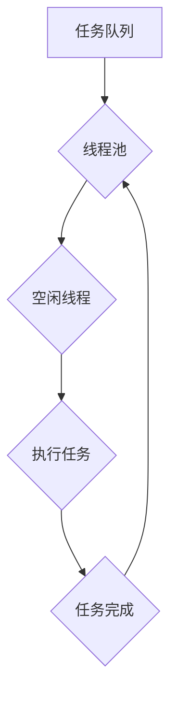

> 线程池、系统吞吐量、并发编程、任务调度、资源管理、性能优化

## 1. 背景介绍

在现代软件系统中，并发编程已成为提高系统性能和响应速度的关键技术。线程池作为一种高效的并发编程机制，能够有效地管理和调度线程资源，从而提升系统吞吐量。然而，线程池的管理并非易事，需要深入理解其工作原理、设计原则以及性能优化策略。

随着应用程序的复杂性和规模不断增长，对系统性能的要求也越来越高。传统的单线程处理模式难以满足现代应用的需求，并发编程技术应运而生。线程池作为一种常见的并发编程机制，能够有效地利用多核处理器资源，提高系统吞吐量。

## 2. 核心概念与联系

**2.1 线程池的概念**

线程池是一种管理线程的机制，它预先创建一组线程，并将其存放在一个池中。当需要执行任务时，线程池会从池中获取一个空闲线程，并将任务分配给该线程执行。任务完成后，线程会返回到池中，等待下一次任务分配。

**2.2 线程池的优势**

* **提高资源利用率:** 线程池可以避免频繁创建和销毁线程，从而降低系统开销，提高资源利用率。
* **简化并发编程:** 线程池可以抽象掉线程管理的复杂细节，使并发编程更加简单易用。
* **提高系统吞吐量:** 线程池可以并行执行多个任务，从而提高系统的吞吐量。

**2.3 线程池与系统吞吐量**

系统吞吐量是指系统在单位时间内能够处理的请求数量。线程池的合理设计和管理可以有效地提高系统吞吐量。

**2.4 线程池架构**



## 3. 核心算法原理 & 具体操作步骤

**3.1 算法原理概述**

线程池的核心算法是任务调度算法。任务调度算法负责将任务分配给空闲线程执行。常见的任务调度算法包括：

* **FIFO (First-In, First-Out):** 先进先出算法，按照任务提交的顺序分配线程执行。
* **Priority Queue:** 优先队列算法，根据任务优先级分配线程执行。
* **Round Robin:** 轮询算法，轮流分配线程执行任务。

**3.2 算法步骤详解**

1. **任务提交:** 当有新的任务需要执行时，将其添加到任务队列中。
2. **线程获取:** 线程池从任务队列中获取一个任务。
3. **任务执行:** 线程执行任务，并将结果返回给线程池。
4. **线程释放:** 任务执行完成后，线程返回到空闲线程池中。

**3.3 算法优缺点**

* **FIFO:** 简单易实现，但无法根据任务优先级进行调度。
* **Priority Queue:** 可以根据任务优先级进行调度，但实现复杂度较高。
* **Round Robin:** 能够保证所有线程都有机会执行任务，但可能导致任务执行时间不均匀。

**3.4 算法应用领域**

不同的任务调度算法适用于不同的应用场景。例如，对于实时性要求高的应用，优先队列算法更合适；对于需要保证所有任务公平执行的应用，轮询算法更合适。

## 4. 数学模型和公式 & 详细讲解 & 举例说明

**4.1 数学模型构建**

假设系统有 `n` 个处理器核心，线程池中共有 `m` 个线程。任务的执行时间服从指数分布，平均执行时间为 `t`。

**4.2 公式推导过程**

系统吞吐量 `T` 可以表示为：

$$T = \frac{m}{t}$$

其中，`m` 为线程池大小，`t` 为平均任务执行时间。

**4.3 案例分析与讲解**

假设系统有 4 个处理器核心，线程池大小为 8，平均任务执行时间为 0.1 秒。则系统吞吐量为：

$$T = \frac{8}{0.1} = 80 \text{ TPS}$$

其中 TPS 代表每秒处理的任务数量。

## 5. 项目实践：代码实例和详细解释说明

**5.1 开发环境搭建**

* 操作系统：Linux 或 Windows
* 编程语言：Java 或 Python
* 开发工具：IDE 或文本编辑器

**5.2 源代码详细实现**

```java
import java.util.concurrent.ExecutorService;
import java.util.concurrent.Executors;
import java.util.concurrent.TimeUnit;

public class ThreadPoolExample {

    public static void main(String[] args) {
        // 创建一个包含 4 个线程的线程池
        ExecutorService executor = Executors.newFixedThreadPool(4);

        // 提交 10 个任务
        for (int i = 0; i < 10; i++) {
            executor.execute(new Task(i));
        }

        // 关闭线程池，等待所有任务完成
        executor.shutdown();
        try {
            executor.awaitTermination(1, TimeUnit.MINUTES);
        } catch (InterruptedException e) {
            e.printStackTrace();
        }
    }

    static class Task implements Runnable {
        private int id;

        public Task(int id) {
            this.id = id;
        }

        @Override
        public void run() {
            System.out.println("Task " + id + " is running");
            // 模拟任务执行时间
            try {
                Thread.sleep(1000);
            } catch (InterruptedException e) {
                e.printStackTrace();
            }
            System.out.println("Task " + id + " is completed");
        }
    }
}
```

**5.3 代码解读与分析**

* `Executors.newFixedThreadPool(4)` 创建一个包含 4 个线程的固定大小线程池。
* `executor.execute(new Task(i))` 将任务提交到线程池中执行。
* `executor.shutdown()` 关闭线程池，不再接受新的任务。
* `executor.awaitTermination(1, TimeUnit.MINUTES)` 等待所有任务完成，最多等待 1 分钟。

**5.4 运行结果展示**

程序运行后，会输出 10 个任务的运行和完成信息，每个任务的执行时间约为 1 秒。

## 6. 实际应用场景

**6.1 Web 服务器**

Web 服务器通常使用线程池来处理来自客户端的请求。每个请求都会被分配到一个空闲线程执行，从而提高服务器的吞吐量。

**6.2 数据库服务器**

数据库服务器也经常使用线程池来处理来自客户端的查询请求。每个查询请求都会被分配到一个空闲线程执行，从而提高数据库服务器的性能。

**6.3 游戏服务器**

游戏服务器需要处理大量的玩家请求，例如玩家登录、发送消息、执行操作等。线程池可以帮助游戏服务器高效地处理这些请求，从而保证游戏运行的流畅性。

**6.4 其他应用场景**

* 图像处理
* 视频编码
* 数据分析
* 机器学习

## 7. 工具和资源推荐

**7.1 学习资源推荐**

* 《Java Concurrency in Practice》
* 《Effective Java》
* 《Head First Design Patterns》

**7.2 开发工具推荐**

* IntelliJ IDEA
* Eclipse
* Visual Studio Code

**7.3 相关论文推荐**

* The Art of Multiprocessor Programming
* Understanding the Linux Kernel

## 8. 总结：未来发展趋势与挑战

**8.1 研究成果总结**

线程池管理技术已经取得了显著的成果，能够有效地提高系统吞吐量和资源利用率。

**8.2 未来发展趋势**

* **动态调整线程池大小:** 根据系统负载动态调整线程池大小，以优化资源利用率。
* **智能任务调度:** 基于任务优先级、执行时间等因素，智能地调度任务到合适的线程。
* **跨平台线程池:** 支持跨平台的线程池管理，方便开发人员在不同平台上使用相同的代码。

**8.3 面临的挑战**

* **线程安全问题:** 多线程环境下，需要保证数据和资源的安全性。
* **性能优化:** 线程池的管理和调度需要进行优化，以提高系统性能。
* **复杂性控制:** 线程池的管理机制可能会变得越来越复杂，需要找到平衡点。

**8.4 研究展望**

未来，线程池管理技术将继续朝着更智能、更高效的方向发展，以满足现代软件系统对性能和资源利用率的要求。

## 9. 附录：常见问题与解答

**9.1 什么是线程池？**

线程池是一种管理线程的机制，它预先创建一组线程，并将其存放在一个池中。当需要执行任务时，线程池会从池中获取一个空闲线程，并将任务分配给该线程执行。

**9.2 为什么使用线程池？**

使用线程池可以提高资源利用率、简化并发编程、提高系统吞吐量。

**9.3 如何选择合适的线程池大小？**

线程池大小的选择需要根据系统的负载和任务的执行时间进行调整。一般来说，线程池大小应该大于系统的核心数，但也不能过大，否则会造成资源浪费。


作者：禅与计算机程序设计艺术 / Zen and the Art of Computer Programming 
<end_of_turn>