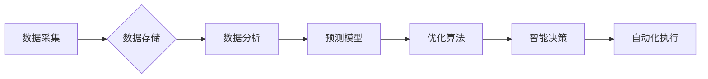

> 自动化、供应链管理、人工智能、机器学习、数据分析、预测模型、优化算法、区块链

## 1. 背景介绍

在当今快速发展的全球化经济环境下，供应链管理已成为企业竞争力的关键因素。传统的供应链管理模式往往面临着信息孤岛、效率低下、风险控制不足等问题。随着人工智能（AI）、机器学习（ML）、大数据分析等技术的快速发展，自动化供应链管理逐渐成为趋势，为企业带来诸多机遇。

自动化创业是指利用技术手段，构建高效、智能的创业模式，以实现快速、低成本的业务扩张。在自动化创业过程中，供应链管理扮演着至关重要的角色。通过自动化技术，企业可以优化供应链流程，提高效率、降低成本、增强供应链韧性，从而为创业企业提供强大的竞争优势。

## 2. 核心概念与联系

**2.1 供应链管理概述**

供应链管理是指企业从原材料采购到最终产品交付的全过程管理，涉及到供应商、制造商、分销商、零售商等多个环节。其目标是通过优化各环节的协作和流程，实现资源的有效利用，降低成本，提高效率，最终满足客户需求。

**2.2 自动化供应链管理概述**

自动化供应链管理是指利用人工智能、机器学习、大数据分析等技术手段，对供应链各个环节进行智能化管理，实现流程自动化、数据智能化、决策智能化。

**2.3 核心概念联系**

自动化供应链管理的核心概念包括：

* **数据采集与分析:** 通过传感器、物联网设备等收集供应链数据，并利用大数据分析技术进行数据挖掘和分析，获取供应链运行状态和趋势信息。
* **预测模型:** 基于历史数据和机器学习算法，构建预测模型，预测未来需求、库存水平、物流成本等关键指标，为决策提供数据支持。
* **优化算法:** 利用优化算法，优化供应链各环节的资源配置、库存管理、物流配送等，提高效率和降低成本。
* **智能决策:** 基于数据分析和预测模型的结果，实现智能化决策，例如自动调整生产计划、优化库存水平、选择最优物流路线等。

**2.4 核心架构**



## 3. 核心算法原理 & 具体操作步骤

**3.1 算法原理概述**

自动化供应链管理中常用的算法包括：

* **机器学习算法:** 用于预测需求、识别异常、优化库存等。常见的机器学习算法包括线性回归、逻辑回归、决策树、支持向量机、神经网络等。
* **优化算法:** 用于优化供应链各环节的资源配置、物流配送等。常见的优化算法包括遗传算法、模拟退火算法、粒子群算法等。

**3.2 算法步骤详解**

以预测需求为例，使用机器学习算法进行预测的步骤如下：

1. **数据收集:** 收集历史销售数据、市场趋势数据、季节性数据等相关信息。
2. **数据预处理:** 对收集到的数据进行清洗、转换、特征工程等处理，使其适合机器学习算法的训练。
3. **模型选择:** 根据预测任务的特点选择合适的机器学习算法，例如线性回归、ARIMA模型等。
4. **模型训练:** 使用训练数据训练选择的机器学习模型，调整模型参数，使其能够准确预测未来需求。
5. **模型评估:** 使用测试数据评估模型的预测精度，并根据评估结果进行模型调整和优化。
6. **模型部署:** 将训练好的模型部署到生产环境中，用于实时预测未来需求。

**3.3 算法优缺点**

* **优点:** 能够根据历史数据和趋势预测未来需求，提高供应链的响应能力和效率。
* **缺点:** 预测结果受历史数据影响，如果历史数据不准确或市场环境发生变化，预测结果可能不准确。

**3.4 算法应用领域**

* **需求预测:** 预测未来产品需求，优化生产计划和库存管理。
* **库存优化:** 根据预测需求和库存水平，优化库存策略，降低库存成本。
* **物流配送:** 优化物流路线和配送时间，提高配送效率和降低物流成本。
* **风险管理:** 识别供应链风险，制定风险应对措施。

## 4. 数学模型和公式 & 详细讲解 & 举例说明

**4.1 数学模型构建**

供应链管理中的数学模型通常用于优化资源配置、库存管理、物流配送等问题。常见的数学模型包括线性规划、整数规划、动态规划等。

**4.2 公式推导过程**

以线性规划为例，其目标函数和约束条件可以用数学公式表示：

* **目标函数:**  
$$
\text{Maximize } Z = c_1x_1 + c_2x_2 + ... + c_nx_n
$$

* **约束条件:**
$$
a_{11}x_1 + a_{12}x_2 + ... + a_{1n}x_n \leq b_1
$$
$$
a_{21}x_1 + a_{22}x_2 + ... + a_{2n}x_n \leq b_2
$$
$$
...
$$
$$
a_{m1}x_1 + a_{m2}x_2 + ... + a_{mn}x_n \leq b_m
$$
$$
x_i \geq 0, i = 1, 2, ..., n
$$

其中：

* $Z$ 是目标函数值，例如利润最大化。
* $c_i$ 是每个决策变量 $x_i$ 的系数。
* $a_{ij}$ 是约束条件中的系数。
* $b_i$ 是约束条件中的常数项。
* $x_i$ 是决策变量，例如生产量、库存量等。

**4.3 案例分析与讲解**

假设一家公司需要决定生产不同产品的数量，以最大化利润。生产每个产品需要消耗不同的资源，并且每个产品有不同的利润率。可以使用线性规划模型来解决这个问题。

* **目标函数:** 最大化利润，即 $Z = c_1x_1 + c_2x_2 + ... + c_nx_n$。
* **约束条件:** 资源限制、生产能力限制、市场需求限制等。

通过求解线性规划模型，可以得到每个产品的最佳生产数量，从而最大化利润。

## 5. 项目实践：代码实例和详细解释说明

**5.1 开发环境搭建**

* 操作系统: Ubuntu 20.04 LTS
* Python 版本: 3.8.10
* 必要的库: pandas, numpy, scikit-learn, matplotlib

**5.2 源代码详细实现**

```python
import pandas as pd
from sklearn.linear_model import LinearRegression

# 1. 数据加载
data = pd.read_csv('sales_data.csv')

# 2. 数据预处理
# ...

# 3. 模型训练
model = LinearRegression()
model.fit(X_train, y_train)

# 4. 模型评估
# ...

# 5. 模型预测
future_demand = model.predict(X_test)

# 6. 结果展示
print(future_demand)
```

**5.3 代码解读与分析**

* 数据加载: 使用 pandas 库读取销售数据。
* 数据预处理: 对数据进行清洗、转换、特征工程等处理。
* 模型训练: 使用 scikit-learn 库的线性回归模型训练模型。
* 模型评估: 使用测试数据评估模型的预测精度。
* 模型预测: 使用训练好的模型预测未来需求。
* 结果展示: 打印预测结果。

**5.4 运行结果展示**

运行代码后，将输出未来需求的预测值。

## 6. 实际应用场景

**6.1 供应链优化**

自动化供应链管理可以帮助企业优化库存管理、物流配送、生产计划等环节，提高效率、降低成本。例如，通过预测需求，企业可以优化库存水平，避免库存积压或缺货。

**6.2 风险管理**

自动化供应链管理可以帮助企业识别和应对供应链风险。例如，通过监控供应链各环节的数据，企业可以识别潜在的风险，并采取措施进行风险控制。

**6.3 客户服务**

自动化供应链管理可以帮助企业提高客户服务水平。例如，通过实时跟踪订单状态，企业可以及时向客户提供订单信息，提高客户满意度。

**6.4 未来应用展望**

随着人工智能、机器学习等技术的不断发展，自动化供应链管理将更加智能化、自动化。未来，自动化供应链管理将应用于更多领域，例如：

* **个性化定制:** 根据客户需求，实现个性化产品定制。
* **可持续发展:** 优化供应链流程，减少资源消耗，实现可持续发展。
* **区块链技术:** 利用区块链技术提高供应链透明度和安全性。

## 7. 工具和资源推荐

**7.1 学习资源推荐**

* **书籍:**
    * 《供应链管理》
    * 《人工智能》
    * 《机器学习》
* **在线课程:**
    * Coursera: 供应链管理、人工智能、机器学习
    * edX: 供应链管理、数据分析

**7.2 开发工具推荐**

* **Python:** 广泛应用于数据分析、机器学习等领域。
* **R:** 专注于统计分析和数据可视化。
* **Tableau:** 数据可视化工具。

**7.3 相关论文推荐**

* **自动化供应链管理的最新研究进展**
* **人工智能在供应链管理中的应用**
* **机器学习在供应链预测中的应用**

## 8. 总结：未来发展趋势与挑战

**8.1 研究成果总结**

自动化供应链管理的研究取得了显著进展，已经应用于多个领域，取得了良好的效果。

**8.2 未来发展趋势**

未来，自动化供应链管理将更加智能化、自动化，应用于更多领域。

**8.3 面临的挑战**

* 数据安全和隐私保护
* 模型解释性和可信度
* 技术人才短缺

**8.4 研究展望**

未来研究将重点关注以下方面：

* 开发更安全、更可靠的自动化供应链管理系统。
* 提高模型解释性和可信度。
* 培养更多自动化供应链管理人才。

## 9. 附录：常见问题与解答

**9.1 如何选择合适的自动化供应链管理工具？**

选择合适的自动化供应链管理工具需要根据企业的具体需求和情况进行评估。

**9.2 自动化供应链管理会取代人类工作吗？**

自动化供应链管理可以提高效率，但不会完全取代人类工作。人类仍然需要在决策、创新、解决复杂问题等方面发挥作用。

**9.3 自动化供应链管理的成本如何？**

自动化供应链管理的成本取决于企业的具体情况，例如企业规模、应用场景等。


作者：禅与计算机程序设计艺术 / Zen and the Art of Computer Programming 
<end_of_turn>