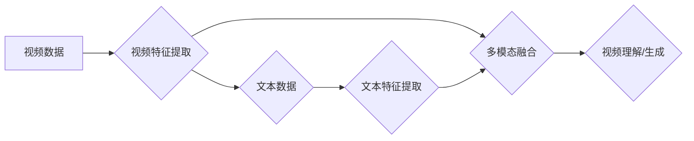

> 视频大模型、多模态学习、计算机视觉、自然语言处理、深度学习、Transformer、视频理解、视频生成

## 1. 背景介绍

近年来，人工智能领域取得了令人瞩目的进展，其中深度学习技术在图像识别、自然语言处理等领域取得了突破性成就。视频作为一种更丰富、更复杂的模态信息，蕴含着丰富的时空信息，其理解和生成具有重要的理论意义和实际应用价值。

传统的视频处理方法主要依赖于手工设计的特征和规则，难以有效地捕捉视频中的复杂时空关系。随着深度学习技术的兴起，视频大模型应运而生，利用深度神经网络的强大能力，从视频中学习更丰富的特征和知识，实现更智能的视频理解和生成。

## 2. 核心概念与联系

视频大模型的核心概念是将视频信息与其他模态信息（如文本、音频）融合，构建一个多模态的学习框架。

**多模态学习**是指利用多种不同类型的模态数据进行联合学习，以获得更全面、更深入的理解。视频大模型通过融合视频、文本、音频等模态信息，可以更好地理解视频内容，并进行更精准的分析和生成。

**视频理解**是指从视频中提取语义信息，例如事件识别、动作识别、场景理解等。视频大模型可以利用深度学习技术，从视频中学习时空特征，并将其与文本信息结合，实现更准确的视频理解。

**视频生成**是指根据给定的文本或其他模态信息，生成新的视频内容。视频大模型可以利用生成对抗网络（GAN）等技术，学习视频的生成规律，并生成逼真的视频内容。

**Mermaid 流程图**



## 3. 核心算法原理 & 具体操作步骤

### 3.1  算法原理概述

视频大模型的核心算法原理是基于深度学习，主要包括以下几个方面：

* **卷积神经网络（CNN）:** 用于提取视频帧的特征，捕捉空间信息。
* **循环神经网络（RNN）:** 用于处理视频序列信息，捕捉时间信息。
* **Transformer:** 用于处理长序列数据，捕捉视频中的全局信息。
* **多模态融合:** 将视频特征与其他模态特征（如文本、音频）融合，实现更全面的理解。

### 3.2  算法步骤详解

1. **视频预处理:** 将视频数据转换为适合深度学习模型输入的格式，例如帧率调整、分辨率转换等。
2. **视频特征提取:** 使用CNN提取视频帧的特征，例如边缘、纹理、物体等。
3. **视频序列建模:** 使用RNN或Transformer将视频帧的特征序列化，捕捉视频中的时间信息。
4. **多模态融合:** 将视频特征与其他模态特征（如文本、音频）融合，例如使用注意力机制或拼接操作。
5. **任务预测:** 根据融合后的多模态特征，进行视频理解或生成任务的预测，例如事件识别、动作识别、视频摘要生成等。

### 3.3  算法优缺点

**优点:**

* 能够有效地捕捉视频中的时空信息。
* 可以利用多模态信息进行联合学习，提高理解和生成能力。
* 在视频理解和生成任务上取得了显著的成果。

**缺点:**

* 训练数据量大，计算资源消耗高。
* 模型复杂度高，推理速度相对较慢。
* 对于长视频序列的处理能力有限。

### 3.4  算法应用领域

视频大模型在多个领域具有广泛的应用前景，例如：

* **视频监控:** 事件检测、异常行为识别、人脸识别等。
* **视频编辑:** 自动剪辑、视频字幕生成、视频特效制作等。
* **视频娱乐:** 视频推荐、视频内容创作、虚拟现实体验等。
* **教育培训:** 视频教学、在线课程制作、知识点讲解等。

## 4. 数学模型和公式 & 详细讲解 & 举例说明

### 4.1  数学模型构建

视频大模型通常采用基于 Transformer 的架构，其核心是注意力机制。注意力机制可以学习到视频中不同帧之间的重要关系，并赋予它们不同的权重，从而更好地捕捉视频中的时空信息。

### 4.2  公式推导过程

注意力机制的计算公式如下：

$$
\text{Attention}(Q, K, V) = \text{softmax}\left(\frac{Q K^T}{\sqrt{d_k}}\right) V
$$

其中：

* $Q$：查询矩阵
* $K$：键矩阵
* $V$：值矩阵
* $d_k$：键向量的维度
* $\text{softmax}$：softmax 函数

### 4.3  案例分析与讲解

假设我们有一个视频序列，包含 5 帧图像。每个帧图像都对应一个特征向量。

使用注意力机制，我们可以计算出每一帧图像与其他帧图像之间的注意力权重。例如，第一帧图像与第三帧图像的注意力权重可能较高，因为它们之间存在某种语义关系。

通过注意力机制，视频大模型可以更好地理解视频中的时空关系，并进行更准确的视频理解和生成。

## 5. 项目实践：代码实例和详细解释说明

### 5.1  开发环境搭建

* Python 3.7+
* PyTorch 1.7+
* CUDA 10.2+

### 5.2  源代码详细实现

```python
import torch
import torch.nn as nn

class VideoTransformer(nn.Module):
    def __init__(self, embed_dim, num_heads, num_layers):
        super(VideoTransformer, self).__init__()
        self.encoder = nn.TransformerEncoder(
            nn.TransformerEncoderLayer(embed_dim, num_heads), num_layers
        )
        self.linear = nn.Linear(embed_dim, embed_dim)

    def forward(self, video_features):
        # 将视频特征转换为嵌入向量
        embedded_features = self.linear(video_features)
        # 使用 Transformer 编码器进行编码
        encoded_features = self.encoder(embedded_features)
        return encoded_features
```

### 5.3  代码解读与分析

* `VideoTransformer` 类定义了一个视频 Transformer 模型。
* `__init__` 方法初始化模型参数，包括嵌入维度、注意力头数和 Transformer 层数。
* `forward` 方法定义模型的正向传播过程，将视频特征转换为嵌入向量，并使用 Transformer 编码器进行编码。

### 5.4  运行结果展示

运行上述代码，可以将视频特征输入到模型中，并获得编码后的视频特征。这些编码后的特征可以用于后续的视频理解或生成任务。

## 6. 实际应用场景

### 6.1  视频监控

视频大模型可以用于视频监控系统，实现事件检测、异常行为识别、人脸识别等功能。例如，可以检测到视频中是否有入侵者、是否有危险行为发生、是否有特定人员出现等。

### 6.2  视频编辑

视频大模型可以用于视频编辑软件，实现自动剪辑、视频字幕生成、视频特效制作等功能。例如，可以自动剪辑出视频中的精彩片段、自动生成视频字幕、自动添加视频特效等。

### 6.3  视频娱乐

视频大模型可以用于视频娱乐平台，实现视频推荐、视频内容创作、虚拟现实体验等功能。例如，可以根据用户的观看历史推荐相关视频、自动生成视频内容、提供虚拟现实视频体验等。

### 6.4  未来应用展望

随着视频大模型技术的不断发展，其应用场景将更加广泛，例如：

* **医疗诊断:** 分析医学影像，辅助医生进行诊断。
* **自动驾驶:** 理解道路环境，辅助车辆进行自动驾驶。
* **机器人交互:** 理解人类的语言和行为，提高机器人与人类的交互能力。

## 7. 工具和资源推荐

### 7.1  学习资源推荐

* **论文:**
    * [BERT: Pre-training of Deep Bidirectional Transformers for Language Understanding](https://arxiv.org/abs/1810.04805)
    * [Vision Transformer](https://arxiv.org/abs/2010.11929)
* **博客:**
    * [Jay Alammar's Blog](https://jalammar.github.io/)
    * [Distill.pub](https://distill.pub/)

### 7.2  开发工具推荐

* **PyTorch:** 深度学习框架
* **TensorFlow:** 深度学习框架
* **OpenCV:** 图像处理库

### 7.3  相关论文推荐

* [VideoBERT: A Pre-training Approach for Video Understanding](https://arxiv.org/abs/2003.09059)
* [Video Swin Transformer](https://arxiv.org/abs/2103.14030)
* [SlowFast: Slow-Fast Networks for Video Recognition](https://arxiv.org/abs/1812.03982)

## 8. 总结：未来发展趋势与挑战

### 8.1  研究成果总结

视频大模型在视频理解和生成任务上取得了显著的成果，例如：

* 事件识别、动作识别、场景理解等视频理解任务的准确率大幅提升。
* 视频摘要生成、视频特效制作等视频生成任务的质量得到显著提高。

### 8.2  未来发展趋势

* **模型规模和能力的提升:** 随着计算资源的不断发展，视频大模型的规模和能力将进一步提升，能够处理更长、更复杂的视频序列。
* **多模态融合的深入研究:** 将视频与其他模态信息（如文本、音频、传感器数据）进行更深入的融合，实现更全面的理解和生成。
* **实时性与效率的提升:** 降低视频大模型的推理速度，使其能够应用于实时视频处理场景。

### 8.3  面临的挑战

* **数据标注成本高:** 视频数据标注成本高昂，难以获得大规模高质量的标注数据。
* **模型训练复杂度高:** 视频大模型的训练复杂度高，需要大量的计算资源和时间。
* **模型解释性差:** 视频大模型的决策过程难以解释，难以理解模型是如何进行决策的。

### 8.4  研究展望

未来，视频大模型的研究将继续朝着更智能、更通用、更可解释的方向发展。

## 9. 附录：常见问题与解答

**Q1: 视频大模型与传统视频处理方法相比有什么优势？**

**A1:** 视频大模型能够有效地捕捉视频中的时空信息，并利用多模态信息进行联合学习，从而实现更准确的视频理解和生成。传统视频处理方法主要依赖于手工设计的特征和规则，难以有效地捕捉视频中的复杂时空关系。

**Q2: 如何训练视频大模型？**

**A2:** 视频大模型的训练需要大量的视频数据和计算资源。常用的训练方法包括监督学习、自监督学习和半监督学习。

**Q3: 视频大模型的应用场景有哪些？**

**A3:** 视频大模型在多个领域具有广泛的应用前景，例如视频监控、视频编辑、视频娱乐、医疗诊断、自动驾驶等。

作者：禅与计算机程序设计艺术 / Zen and the Art of Computer Programming


<end_of_turn>