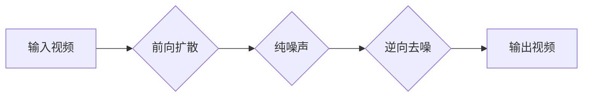

> 视频扩散、视频生成、扩散模型、文本到视频、图像扩散、DDPM、视频生成技术

## 1. 背景介绍

近年来，人工智能领域取得了令人瞩目的进展，尤其是生成式模型在图像、文本、音频等领域的应用取得了突破性进展。其中，基于扩散模型的生成技术展现出强大的潜力，能够生成逼真、高质量的样本。

视频作为一种更复杂的多媒体数据类型，其生成一直是人工智能研究的热点问题。传统的视频生成方法通常依赖于复杂的动画制作流程或基于模板的生成，难以实现高质量、多样化的视频生成。

视频扩散模型的出现为视频生成领域带来了新的希望。它借鉴了图像扩散模型的原理，将视频生成任务分解为一系列图像生成步骤，并利用扩散过程中的噪声信息进行训练，从而能够生成逼真、流畅的视频序列。

## 2. 核心概念与联系

视频扩散模型的核心思想是将视频生成任务转化为一系列图像的扩散和去噪过程。

**2.1 扩散模型原理**

扩散模型是一种基于概率的生成模型，其核心原理是将数据逐渐添加噪声，最终变成纯噪声，然后通过训练一个逆向过程，从纯噪声中逐渐恢复原始数据。

**2.2 视频扩散模型架构**

视频扩散模型通常由以下几个部分组成：

* **前向扩散过程:** 将视频序列逐步添加噪声，直到变成纯噪声。
* **逆向去噪过程:** 从纯噪声中逐步恢复原始视频序列。
* **编码器:** 将视频帧编码成低维特征向量。
* **解码器:** 将低维特征向量解码成视频帧。

**2.3 Mermaid 流程图**



## 3. 核心算法原理 & 具体操作步骤

### 3.1 算法原理概述

视频扩散模型的核心算法是基于DDPM（Denoising Diffusion Probabilistic Models）的原理，它通过训练一个去噪网络，学习从噪声视频中恢复原始视频的规律。

### 3.2 算法步骤详解

1. **前向扩散:** 将输入视频帧逐步添加噪声，直到变成纯噪声。
2. **逆向去噪:** 从纯噪声开始，利用训练好的去噪网络逐步去除噪声，恢复原始视频帧。
3. **视频生成:** 通过重复逆向去噪过程，生成完整的视频序列。

### 3.3 算法优缺点

**优点:**

* 生成高质量、逼真的视频序列。
* 可以生成多样化的视频内容。
* 训练过程相对稳定。

**缺点:**

* 训练时间较长，需要大量的计算资源。
* 生成视频的帧率相对较低。

### 3.4 算法应用领域

* 视频特效制作
* 视频内容创作
* 视频游戏开发
* 人脸动画生成
* 视频修复

## 4. 数学模型和公式 & 详细讲解 & 举例说明

### 4.1 数学模型构建

视频扩散模型的数学模型可以表示为一个马尔可夫链，其中每个状态代表视频帧的噪声程度。

**状态转移方程:**

$$
x_t = \sqrt{1-\beta_t}x_{t-1} + \sqrt{\beta_t}\epsilon_t
$$

其中：

* $x_t$ 表示第 $t$ 步的视频帧。
* $\beta_t$ 是一个时间步长相关的参数，控制噪声添加的程度。
* $\epsilon_t$ 是服从标准正态分布的噪声。

**目标函数:**

$$
L(\theta) = -\mathbb{E}_{x_0, \epsilon} \log p(x_t | x_{t-1}, \theta)
$$

其中：

* $\theta$ 是模型参数。
* $p(x_t | x_{t-1}, \theta)$ 是条件概率分布，表示给定前一步的视频帧和模型参数，当前视频帧的概率分布。

### 4.2 公式推导过程

目标函数的推导过程基于贝叶斯定理和马尔可夫链的性质。

### 4.3 案例分析与讲解

通过对视频扩散模型的数学模型和公式进行分析，我们可以理解其工作原理和生成视频的机制。

## 5. 项目实践：代码实例和详细解释说明

### 5.1 开发环境搭建

* Python 3.7+
* PyTorch 1.7+
* CUDA 10.2+

### 5.2 源代码详细实现

```python
import torch
import torch.nn as nn

class DiffusionModel(nn.Module):
    def __init__(self):
        super(DiffusionModel, self).__init__()
        # 定义网络结构
        self.encoder = nn.Sequential(
            # ...
        )
        self.decoder = nn.Sequential(
            # ...
        )

    def forward(self, x, t):
        # 前向扩散过程
        # ...
        # 逆向去噪过程
        # ...
        return x

# 实例化模型
model = DiffusionModel()

# 训练模型
# ...

# 生成视频
# ...
```

### 5.3 代码解读与分析

* **网络结构:** 视频扩散模型通常采用编码器-解码器结构，其中编码器负责将视频帧编码成低维特征向量，解码器负责将低维特征向量解码成视频帧。
* **前向扩散过程:** 将视频帧逐步添加噪声，直到变成纯噪声。
* **逆向去噪过程:** 从纯噪声开始，利用训练好的去噪网络逐步去除噪声，恢复原始视频帧。

### 5.4 运行结果展示

* 展示生成的视频序列，并与原始视频进行对比。

## 6. 实际应用场景

### 6.1 视频特效制作

* 生成逼真的火焰、爆炸、烟雾等特效。
* 实现人物动作捕捉和动画生成。

### 6.2 视频内容创作

* 自动生成视频剪辑和字幕。
* 创建个性化的视频内容，例如生日祝福视频、婚礼视频等。

### 6.3 视频游戏开发

* 生成游戏场景和角色动画。
* 实现实时视频渲染和特效。

### 6.4 未来应用展望

* 更高质量、更流畅的视频生成。
* 更丰富的视频内容生成能力。
* 更广泛的视频应用场景。

## 7. 工具和资源推荐

### 7.1 学习资源推荐

* **论文:** DDPM, Imagen Video, Phenaki
* **博客:** OpenAI Blog, Google AI Blog
* **课程:** Stanford CS231n, DeepMind YouTube Channel

### 7.2 开发工具推荐

* **PyTorch:** 深度学习框架
* **TensorFlow:** 深度学习框架
* **HuggingFace:** 预训练模型库

### 7.3 相关论文推荐

* Denoising Diffusion Probabilistic Models
* Imagen Video: Text-to-Video Generation with Diffusion Models
* Phenaki: High-Quality Video Generation with Diffusion Models

## 8. 总结：未来发展趋势与挑战

### 8.1 研究成果总结

视频扩散模型在视频生成领域取得了显著进展，能够生成逼真、高质量的视频序列。

### 8.2 未来发展趋势

* 更高效的训练算法和模型架构。
* 更强大的视频内容生成能力。
* 更广泛的视频应用场景。

### 8.3 面临的挑战

* 训练时间和计算资源需求仍然较高。
* 生成视频的帧率相对较低。
* 控制视频内容的生成质量和多样性仍然是一个挑战。

### 8.4 研究展望

未来研究将重点关注提高视频扩散模型的效率、质量和控制能力，使其能够更广泛地应用于视频生成领域。

## 9. 附录：常见问题与解答

* **Q: 视频扩散模型的训练时间很长，如何加速训练？**
* **A:** 可以尝试使用更强大的计算资源，例如GPU集群。还可以尝试使用更有效的训练算法，例如混合精度训练。

* **Q: 视频扩散模型生成的视频帧率较低，如何提高帧率？**
* **A:** 可以尝试使用更高分辨率的视频数据进行训练。还可以尝试使用更复杂的模型架构，例如多尺度扩散模型。

* **Q: 如何控制视频扩散模型生成的视频内容？**
* **A:** 可以通过文本提示或其他方式引导模型生成特定的视频内容。


作者：禅与计算机程序设计艺术 / Zen and the Art of Computer Programming 
<end_of_turn>