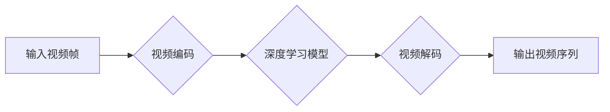

> 视频生成、深度学习、生成对抗网络(GAN)、Transformer、视频编码、视频解码、PyTorch、TensorFlow

## 1. 背景介绍

视频作为一种强大的信息载体，在娱乐、教育、新闻、商业等领域扮演着越来越重要的角色。随着互联网和移动设备的普及，对高质量视频的需求量呈指数级增长。然而，传统的视频制作流程往往耗时费力，需要专业的设备和技术人员。因此，如何高效、便捷地生成高质量视频成为了一个重要的研究课题。

近年来，深度学习技术取得了长足的进步，为视频生成领域带来了革命性的变革。基于深度学习的视频生成方法能够自动学习视频的复杂模式和结构，并生成逼真、流畅的视频序列。

## 2. 核心概念与联系

视频生成的核心概念包括：

* **视频编码:** 将视频信号转换为数字数据，以便存储和传输。常见的视频编码标准包括H.264、H.265和AV1。
* **视频解码:** 将数字视频数据解码成可视化的视频信号。
* **视频帧:** 视频序列中的一张静态图像。
* **视频帧率:** 每秒钟显示的视频帧数，通常以帧/秒 (fps) 表示。
* **深度学习:** 一种机器学习方法，利用多层神经网络学习数据中的复杂模式和关系。

**视频生成流程:**



## 3. 核心算法原理 & 具体操作步骤

### 3.1  算法原理概述

目前，最常用的视频生成算法是基于生成对抗网络 (Generative Adversarial Networks, GANs) 的方法。GANs 由两个神经网络组成：生成器 (Generator) 和鉴别器 (Discriminator)。

* **生成器:** 负责生成新的视频帧。
* **鉴别器:** 负责判断视频帧是真实帧还是由生成器生成的伪造帧。

生成器和鉴别器之间进行对抗训练，生成器试图生成逼真的视频帧，而鉴别器试图识别出伪造帧。通过反复训练，生成器最终能够生成逼真的视频序列。

### 3.2  算法步骤详解

1. **初始化:** 初始化生成器和鉴别器网络的参数。
2. **训练生成器:** 使用随机噪声作为输入，生成器生成新的视频帧。
3. **训练鉴别器:** 将真实视频帧和生成器生成的伪造帧作为输入，鉴别器判断哪些是真实帧，哪些是伪造帧。
4. **更新参数:** 根据鉴别器的反馈，更新生成器的参数。
5. **重复步骤2-4:** 重复上述步骤，直到生成器能够生成逼真的视频序列。

### 3.3  算法优缺点

**优点:**

* 可以生成逼真的视频序列。
* 能够学习视频的复杂模式和结构。

**缺点:**

* 训练过程复杂，需要大量的计算资源和时间。
* 容易出现模式崩溃问题，生成器生成的视频序列可能缺乏多样性。

### 3.4  算法应用领域

* **视频特效:** 生成逼真的视频特效，例如人物替换、场景合成等。
* **视频编辑:** 自动生成视频剪辑、字幕等。
* **视频游戏:** 生成游戏场景、人物动画等。
* **虚拟现实:** 生成逼真的虚拟现实场景。

## 4. 数学模型和公式 & 详细讲解 & 举例说明

### 4.1  数学模型构建

GANs 的数学模型主要包括生成器 G 和鉴别器 D 的损失函数。

* **生成器损失函数:** 

$$
L_G = -E_{z \sim p_z(z)}[log(D(G(z)))]
$$

其中，$z$ 是随机噪声，$p_z(z)$ 是噪声的分布，$D(G(z))$ 是鉴别器对生成器生成的视频帧的判别结果。

* **鉴别器损失函数:**

$$
L_D = -E_{x \sim p_{data}(x)}[log(D(x))] - E_{z \sim p_z(z)}[log(1 - D(G(z)))]
$$

其中，$x$ 是真实视频帧，$p_{data}(x)$ 是真实视频帧的分布。

### 4.2  公式推导过程

生成器损失函数的目标是最大化鉴别器对生成视频帧的判别结果，即让鉴别器认为生成视频帧是真实帧。鉴别器损失函数的目标是同时最小化对真实视频帧的判别错误和对生成视频帧的判别错误。

### 4.3  案例分析与讲解

在训练 GANs 时，需要选择合适的网络架构和训练参数。例如，对于视频生成任务，可以使用 Transformer 网络作为生成器，因为它能够学习视频序列中的长距离依赖关系。

## 5. 项目实践：代码实例和详细解释说明

### 5.1  开发环境搭建

* Python 3.7+
* PyTorch 1.7+
* CUDA 10.2+

### 5.2  源代码详细实现

```python
import torch
import torch.nn as nn

class Generator(nn.Module):
    def __init__(self):
        super(Generator, self).__init__()
        # ...

    def forward(self, z):
        # ...

class Discriminator(nn.Module):
    def __init__(self):
        super(Discriminator, self).__init__()
        # ...

    def forward(self, x):
        # ...

# 实例化生成器和鉴别器
generator = Generator()
discriminator = Discriminator()

# 定义损失函数和优化器
criterion = nn.BCELoss()
optimizer_G = torch.optim.Adam(generator.parameters(), lr=0.0002, betas=(0.5, 0.999))
optimizer_D = torch.optim.Adam(discriminator.parameters(), lr=0.0002, betas=(0.5, 0.999))

# 训练循环
for epoch in range(num_epochs):
    for batch_idx, (real_images, _) in enumerate(train_loader):
        # ...
```

### 5.3  代码解读与分析

* **Generator:** 生成器网络负责从随机噪声生成新的视频帧。
* **Discriminator:** 鉴别器网络负责判断视频帧是真实帧还是由生成器生成的伪造帧。
* **损失函数:** 使用二分类交叉熵损失函数来训练生成器和鉴别器。
* **优化器:** 使用 Adam 优化器来更新生成器和鉴别器的参数。

### 5.4  运行结果展示

训练完成后，可以使用生成器生成新的视频序列。

## 6. 实际应用场景

### 6.1  视频特效

* **人物替换:** 将视频中的人物替换成其他人物。
* **场景合成:** 将多个视频片段合成一个新的视频。
* **动作捕捉:** 将动作捕捉数据应用到视频中，生成逼真的动作。

### 6.2  视频编辑

* **自动剪辑:** 自动生成视频剪辑，去除冗余部分。
* **字幕生成:** 自动生成视频字幕。
* **视频修复:** 修复损坏的视频片段。

### 6.3  视频游戏

* **场景生成:** 自动生成游戏场景，例如森林、城市等。
* **人物动画:** 生成逼真的人物动画，例如行走、奔跑、战斗等。
* **游戏特效:** 生成逼真的游戏特效，例如爆炸、火焰等。

### 6.4  未来应用展望

* **个性化视频生成:** 根据用户的喜好生成个性化的视频内容。
* **虚拟主播:** 生成虚拟主播，用于直播、视频录制等。
* **虚拟会议:** 生成虚拟会议场景，用于远程协作。

## 7. 工具和资源推荐

### 7.1  学习资源推荐

* **书籍:**
    * Deep Learning by Ian Goodfellow, Yoshua Bengio, and Aaron Courville
    * Generative Deep Learning by David Foster
* **课程:**
    * Deep Learning Specialization by Andrew Ng (Coursera)
    * Generative Adversarial Networks by David Foster (Udacity)

### 7.2  开发工具推荐

* **PyTorch:** 深度学习框架，支持GPU加速。
* **TensorFlow:** 深度学习框架，支持GPU加速。
* **Keras:** 高级深度学习 API，可以运行在 TensorFlow 或 Theano 后端。

### 7.3  相关论文推荐

* **Generative Adversarial Networks** by Ian Goodfellow et al. (2014)
* **Progressive Growing of GANs for Improved Quality, Stability, and Variation** by Tero Karras et al. (2017)
* **StyleGAN2-ADA** by Tero Karras et al. (2020)

## 8. 总结：未来发展趋势与挑战

### 8.1  研究成果总结

近年来，基于深度学习的视频生成技术取得了长足的进步，能够生成逼真的视频序列。GANs 作为视频生成的主要算法，不断发展，出现了许多改进版本，例如 Progressive Growing of GANs 和 StyleGAN2-ADA。

### 8.2  未来发展趋势

* **更高质量的视频生成:** 研究更先进的算法和模型，生成更高质量、更逼真的视频序列。
* **更灵活的视频生成:** 研究能够根据用户需求生成不同风格、不同长度的视频序列。
* **更安全的视频生成:** 研究防止视频生成技术被用于恶意目的，例如生成虚假新闻或深度伪造。

### 8.3  面临的挑战

* **计算资源:** 视频生成需要大量的计算资源，训练大型模型需要强大的硬件支持。
* **数据标注:** 视频生成需要大量的标注数据，标注视频数据非常耗时费力。
* **伦理问题:** 视频生成技术可能被用于生成虚假信息，需要考虑伦理问题。

### 8.4  研究展望

未来，视频生成技术将继续发展，在更多领域得到应用。研究人员将继续探索新的算法和模型，提高视频生成质量，并解决视频生成技术面临的挑战。

## 9. 附录：常见问题与解答

* **Q: 如何选择合适的视频生成算法？**
* **A:** 选择合适的视频生成算法取决于具体的应用场景和需求。对于需要生成高质量视频序列的应用，可以使用 GANs 算法。对于需要快速生成简单视频序列的应用，可以使用其他算法，例如 RNN 或 LSTM。
* **Q: 如何训练视频生成模型？**
* **A:** 训练视频生成模型需要大量的标注数据和强大的计算资源。可以使用开源的深度学习框架，例如 PyTorch 或 TensorFlow，来训练视频生成模型。
* **Q: 视频生成技术有哪些伦理问题？**
* **A:** 视频生成技术可能被用于生成虚假信息，例如深度伪造，这可能会对社会造成负面影响。因此，需要考虑视频生成技术的伦理问题，并制定相应的规范和政策。


作者：禅与计算机程序设计艺术 / Zen and the Art of Computer Programming 
<end_of_turn>