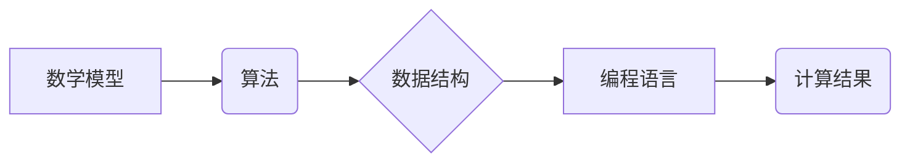

> 计算基础、数学模型、算法原理、数据结构、编程语言、计算机科学、数学推导

## 1. 背景介绍

在现代社会，计算已成为不可或缺的基础设施，它渗透到生活的方方面面，从智能手机到大型数据中心，无处不在。而计算的本质，就是通过一系列的逻辑操作，对数据进行处理和转换。为了深入理解计算的原理，我们需要探究其背后的数学基础。

第一部分《计算：第一部分 计算的本质》已经介绍了计算的基本概念和原理，包括算法、数据结构、编程语言等。本篇将深入探讨计算的数学基础，包括数学模型、算法原理、数据结构的数学表示等，为读者提供更深入的理解。

## 2. 核心概念与联系

计算的数学基础主要包括以下几个核心概念：

* **数学模型:** 用于描述和抽象现实世界问题的数学结构，例如线性代数、微积分、概率论等。
* **算法:** 一系列明确的步骤，用于解决特定问题或完成特定任务。
* **数据结构:** 用于组织和存储数据的结构，例如数组、链表、树、图等。
* **编程语言:** 用于描述算法和数据结构的符号系统，例如Python、Java、C++等。

这些概念相互关联，共同构成了计算的数学基础。

**Mermaid 流程图:**



## 3. 核心算法原理 & 具体操作步骤

### 3.1  算法原理概述

算法是计算的核心，它提供了一种解决问题的步骤。一个好的算法应该具有以下特点：

* **确定性:** 对于给定的输入，算法应该始终产生相同的输出。
* **有限性:** 算法应该在有限的时间内完成执行。
* **有效性:** 算法应该能够被计算机理解和执行。

### 3.2  算法步骤详解

以下是一个简单的算法示例：求两个整数的和。

**输入:** 两个整数a和b

**输出:** a和b的和

**步骤:**

1. 将a和b的值存储在两个变量中。
2. 将两个变量的值相加。
3. 将和的值存储在一个新的变量中。
4. 返回新的变量的值。

### 3.3  算法优缺点

**优点:**

* 算法简单易懂。
* 算法执行效率高。

**缺点:**

* 算法只能求两个整数的和。

### 3.4  算法应用领域

求两个整数的和的算法在日常生活中应用广泛，例如计算购物总额、计算时间差等。

## 4. 数学模型和公式 & 详细讲解 & 举例说明

### 4.1  数学模型构建

数学模型是用于描述和抽象现实世界问题的数学结构。例如，我们可以用线性方程组来描述两个变量之间的关系，用微积分来描述变化的趋势，用概率论来描述随机事件的发生概率。

### 4.2  公式推导过程

以下是一个简单的数学公式推导过程：

**目标:** 求两个整数a和b的和。

**公式:**

$$
a + b = c
$$

**推导过程:**

1. 假设a和b是两个整数。
2. 根据加法运算的定义，a和b的和等于c。

### 4.3  案例分析与讲解

**案例:**

求5和3的和。

**解:**

$$
5 + 3 = 8
$$

**讲解:**

根据公式，将a=5，b=3代入，得到c=8。

## 5. 项目实践：代码实例和详细解释说明

### 5.1  开发环境搭建

本项目使用Python语言进行开发，需要安装Python解释器和相关库。

### 5.2  源代码详细实现

```python
def sum_two_numbers(a, b):
  """
  求两个整数的和。

  Args:
    a: 第一个整数。
    b: 第二个整数。

  Returns:
    a和b的和。
  """
  return a + b

# 测试代码
a = 5
b = 3
c = sum_two_numbers(a, b)
print(f"a + b = {c}")
```

### 5.3  代码解读与分析

代码首先定义了一个名为`sum_two_numbers`的函数，该函数接受两个整数作为参数，并返回它们的和。

函数内部使用`+`运算符将两个参数相加，并将结果返回。

测试代码首先定义了两个整数`a`和`b`，然后调用`sum_two_numbers`函数计算它们的和，并将结果打印到控制台。

### 5.4  运行结果展示

```
a + b = 8
```

## 6. 实际应用场景

求两个整数的和的算法在日常生活中应用广泛，例如：

* **计算购物总额:** 在超市结账时，需要计算所有商品的总价。
* **计算时间差:** 计算两个时间点之间的间隔时间。
* **计算距离:** 计算两点之间的距离。

### 6.4  未来应用展望

随着计算技术的不断发展，求两个整数的和的算法将继续在新的领域得到应用，例如：

* **人工智能:** 在机器学习算法中，求两个向量之间的内积是常见的操作。
* **大数据分析:** 在处理海量数据时，需要对数据进行聚合和统计分析。

## 7. 工具和资源推荐

### 7.1  学习资源推荐

* **书籍:** 《算法导论》
* **网站:** Khan Academy, Coursera

### 7.2  开发工具推荐

* **Python解释器:** Python 3.x
* **代码编辑器:** VS Code, Sublime Text

### 7.3  相关论文推荐

* **论文:** "The Art of Computer Programming" by Donald Knuth

## 8. 总结：未来发展趋势与挑战

### 8.1  研究成果总结

本篇探讨了计算的数学基础，包括数学模型、算法原理、数据结构的数学表示等。这些概念相互关联，共同构成了计算的理论基础。

### 8.2  未来发展趋势

随着计算技术的不断发展，计算的数学基础将继续得到深入研究和发展。未来，我们将看到以下趋势：

* **更复杂的数学模型:** 用于描述更复杂的问题，例如量子计算、人工智能等。
* **更有效的算法:** 用于解决更复杂的问题，例如大数据分析、机器学习等。
* **更强大的计算能力:** 用于处理更大的数据量和更复杂的计算任务。

### 8.3  面临的挑战

计算的数学基础研究也面临着一些挑战：

* **数学理论的局限性:** 现有的数学理论可能无法完全描述某些复杂问题。
* **算法复杂度的挑战:** 随着问题的复杂性增加，算法的复杂度也会增加，这需要开发更有效的算法。
* **计算资源的限制:** 处理更大的数据量和更复杂的计算任务需要更强大的计算资源。

### 8.4  研究展望

尽管面临着挑战，但计算的数学基础研究仍然充满着希望。未来，我们将看到更多新的发现和突破，推动计算技术的发展。

## 9. 附录：常见问题与解答

**问题:** 如何判断一个算法是否有效？

**解答:** 一个算法是有效的，当且仅当它能够在有限的时间内完成执行，并且对于给定的输入，始终产生相同的输出。

**问题:** 如何选择合适的算法？

**解答:** 选择合适的算法取决于具体的问题和需求。需要考虑算法的效率、准确性、易用性等因素。

**问题:** 如何优化算法的效率？

**解答:** 可以通过以下方法优化算法的效率：

* 简化算法的步骤。
* 使用更有效的算法数据结构。
* 采用并行计算技术。


作者：禅与计算机程序设计艺术 / Zen and the Art of Computer Programming 
<end_of_turn>