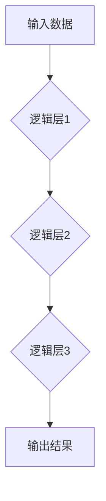

> 复杂性计算、逻辑深度、计算极限、算法效率、时间复杂度、空间复杂度、深度学习、神经网络

## 1. 背景介绍

在现代计算领域，随着算法和模型的不断发展，我们对计算能力的需求也越来越高。然而，计算能力并非无限的，存在着固有的限制。理解这些限制，并探索计算的边界，对于推动计算技术进步至关重要。

复杂性计算是研究算法效率和计算资源消耗的理论分支。它关注算法在处理不同规模输入时的性能表现，并试图量化算法的复杂度。逻辑深度则是复杂性计算的一个重要方面，它指代算法执行所需的逻辑层数或决策步骤。

深度学习的兴起，使得逻辑深度成为一个备受关注的议题。深度神经网络通常具有多层结构，逻辑深度往往很大，这使得它们能够学习复杂模式和关系。然而，随着逻辑深度的增加，训练和推理的效率也会下降，甚至可能导致过拟合和梯度消失等问题。

## 2. 核心概念与联系

**2.1 复杂性计算**

复杂性计算主要关注算法的效率，即算法在处理不同规模输入时的资源消耗。

* **时间复杂度:** 指算法执行所需的时间，通常用大O符号表示，例如O(n)、O(n^2)、O(log n)等。
* **空间复杂度:** 指算法执行所需的内存空间，也通常用大O符号表示。

**2.2 逻辑深度**

逻辑深度是指算法执行所需的逻辑层数或决策步骤。

* **深度学习:** 深度学习模型通常具有多层结构，逻辑深度较大，这使得它们能够学习复杂模式和关系。
* **逻辑门:** 逻辑深度可以理解为逻辑门串联的长度，例如AND门、OR门、NOT门等。

**2.3 联系**

复杂性计算和逻辑深度密切相关。逻辑深度的增加通常会导致时间复杂度和空间复杂度的增加。

**Mermaid 流程图**



## 3. 核心算法原理 & 具体操作步骤

### 3.1  算法原理概述

深度学习算法的核心原理是通过多层神经网络学习数据特征，并最终完成预测或分类任务。

* **神经元:** 神经网络的基本单元，模拟生物神经元的结构和功能。
* **连接权重:** 连接神经元的权重，决定了信号传递的强度。
* **激活函数:** 用于将神经元的输入转换为输出，引入非线性特性。
* **反向传播算法:** 用于更新神经网络的连接权重，使模型的预测结果更加准确。

### 3.2  算法步骤详解

1. **数据预处理:** 将原始数据转换为模型可接受的格式，例如归一化、编码等。
2. **网络结构设计:** 根据任务需求设计神经网络的层数、神经元数量等结构参数。
3. **初始化权重:** 为神经网络的连接权重赋予初始值。
4. **前向传播:** 将输入数据通过神经网络传递，计算最终输出结果。
5. **损失函数计算:** 计算模型预测结果与真实值的差异，即损失值。
6. **反向传播:** 根据损失函数的梯度，更新神经网络的连接权重。
7. **迭代训练:** 重复前向传播、损失函数计算和反向传播步骤，直到模型达到预设的性能指标。

### 3.3  算法优缺点

**优点:**

* 能够学习复杂模式和关系。
* 泛化能力强，能够应用于多种任务。

**缺点:**

* 训练时间长，需要大量数据和计算资源。
* 容易过拟合，需要进行正则化等技巧。
* 难以解释模型的决策过程。

### 3.4  算法应用领域

深度学习算法广泛应用于图像识别、自然语言处理、语音识别、机器翻译等领域。

## 4. 数学模型和公式 & 详细讲解 & 举例说明

### 4.1  数学模型构建

深度学习模型可以看作是一个多层感知机，每个层包含多个神经元。每个神经元接收来自上一层的输入信号，并通过激活函数进行处理，输出到下一层。

**神经元模型:**

$$
y = f(w^T x + b)
$$

其中：

* $y$ 是神经元的输出值。
* $f$ 是激活函数。
* $w$ 是连接权重向量。
* $x$ 是输入信号向量。
* $b$ 是偏置项。

**网络模型:**

一个深度神经网络由多个神经元层组成，每个层的神经元之间通过连接权重进行连接。网络的输出结果是最后一层神经元的输出值。

### 4.2  公式推导过程

反向传播算法的核心是利用链式法则计算损失函数对每个连接权重的梯度。

**链式法则:**

$$
\frac{d L}{d w} = \frac{d L}{d y} \cdot \frac{d y}{d w}
$$

其中：

* $L$ 是损失函数。
* $y$ 是神经元的输出值。
* $w$ 是连接权重。

### 4.3  案例分析与讲解

假设我们有一个简单的深度神经网络，用于分类手写数字。网络结构为两层，第一层有10个神经元，第二层有10个神经元。损失函数为交叉熵损失函数。

通过反向传播算法，我们可以计算每个连接权重的梯度，并根据梯度更新连接权重。

## 5. 项目实践：代码实例和详细解释说明

### 5.1  开发环境搭建

* Python 3.x
* TensorFlow 或 PyTorch 等深度学习框架

### 5.2  源代码详细实现

```python
import tensorflow as tf

# 定义模型结构
model = tf.keras.models.Sequential([
    tf.keras.layers.Dense(10, activation='relu', input_shape=(784,)),
    tf.keras.layers.Dense(10, activation='softmax')
])

# 编译模型
model.compile(optimizer='adam',
              loss='sparse_categorical_crossentropy',
              metrics=['accuracy'])

# 训练模型
model.fit(x_train, y_train, epochs=10)

# 评估模型
loss, accuracy = model.evaluate(x_test, y_test)
print('Loss:', loss)
print('Accuracy:', accuracy)
```

### 5.3  代码解读与分析

* `tf.keras.models.Sequential`: 定义一个顺序模型，层级结构清晰。
* `tf.keras.layers.Dense`: 定义全连接层，每个神经元连接到上一层所有神经元。
* `activation='relu'`: 使用ReLU激活函数，引入非线性特性。
* `optimizer='adam'`: 使用Adam优化器更新连接权重。
* `loss='sparse_categorical_crossentropy'`: 使用交叉熵损失函数，用于分类任务。
* `metrics=['accuracy']`: 使用准确率作为评估指标。

### 5.4  运行结果展示

训练完成后，模型会输出训练过程中的损失值和准确率，以及在测试集上的损失值和准确率。

## 6. 实际应用场景

深度学习算法在各个领域都有广泛的应用，例如：

* **图像识别:** 人脸识别、物体检测、图像分类等。
* **自然语言处理:** 机器翻译、文本摘要、情感分析等。
* **语音识别:** 语音转文本、语音助手等。
* **推荐系统:** 商品推荐、内容推荐等。

## 7. 工具和资源推荐

### 7.1  学习资源推荐

* **书籍:**
    * 深度学习
    * 构建深度学习模型
* **在线课程:**
    * Coursera 深度学习课程
    * Udacity 深度学习工程师 Nanodegree

### 7.2  开发工具推荐

* **TensorFlow:** 开源深度学习框架，支持多种硬件平台。
* **PyTorch:** 开源深度学习框架，以其灵活性和易用性而闻名。
* **Keras:** 高级深度学习API，可以运行在TensorFlow、Theano或CNTK等框架之上。

### 7.3  相关论文推荐

* **ImageNet Classification with Deep Convolutional Neural Networks**
* **Deep Residual Learning for Image Recognition**
* **Attention Is All You Need**

## 8. 总结：未来发展趋势与挑战

### 8.1  研究成果总结

近年来，深度学习取得了显著的进展，在多个领域取得了突破性成果。

### 8.2  未来发展趋势

* **模型效率:** 提高模型训练和推理效率，降低计算资源消耗。
* **模型解释性:** 增强模型的解释性，使模型决策更加透明可信。
* **数据效率:** 降低模型对训练数据的依赖，提高模型在小样本数据下的泛化能力。

### 8.3  面临的挑战

* **计算资源:** 深度学习模型训练需要大量的计算资源，这对于资源有限的机构和个人来说是一个挑战。
* **数据隐私:** 深度学习模型的训练需要大量数据，如何保护数据隐私是一个重要问题。
* **算法安全:** 深度学习模型容易受到攻击，如何保证模型的安全性是一个重要的研究方向。

### 8.4  研究展望

未来，深度学习研究将继续朝着更高效、更解释性、更安全的方向发展。


## 9. 附录：常见问题与解答

**Q1: 深度学习模型为什么容易过拟合？**

**A1:** 深度学习模型具有高自由度，容易学习训练数据中的噪声和随机性，导致模型在训练数据上表现良好，但在测试数据上表现较差。

**Q2: 如何防止深度学习模型过拟合？**

**A2:** 可以使用正则化技术，例如L1正则化和L2正则化，来惩罚模型的复杂度，防止过拟合。还可以使用dropout技术，随机丢弃一部分神经元，提高模型的泛化能力。

**Q3: 深度学习模型的训练时间很长，如何加速训练过程？**

**A3:** 可以使用分布式训练技术，将模型训练任务分发到多个机器上进行并行训练，从而缩短训练时间。还可以使用模型压缩技术，例如量化和剪枝，来减小模型规模，降低训练时间。


作者：禅与计算机程序设计艺术 / Zen and the Art of Computer Programming 
<end_of_turn>