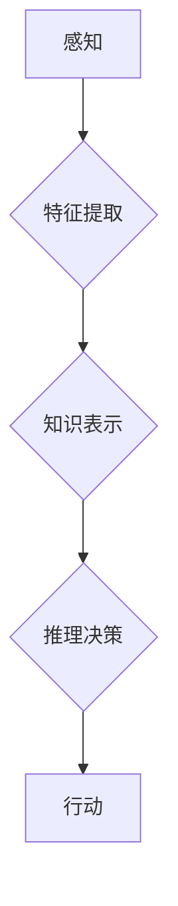

> 深刻化学习，认知过程，人工智能，神经网络，深度学习，强化学习

## 1. 背景介绍

人类的认知能力是极其复杂的，它涉及到感知、记忆、推理、语言理解等多个方面。近年来，人工智能领域取得了长足的进步，特别是深度学习的兴起，为模拟和理解人类认知过程提供了新的工具和方法。然而，现有的深度学习模型仍然难以完全复制人类的认知能力，例如，它们在泛化能力、迁移学习和常识推理等方面仍然存在着明显的局限性。

为了突破这些瓶颈，研究者们提出了“深刻化学习”的概念。深刻化学习旨在通过构建更复杂的、更接近人类认知结构的模型，来提升人工智能的认知能力。

## 2. 核心概念与联系

**2.1 深刻化学习的概念**

深刻化学习是指在深度学习的基础上，进一步探索和构建更深层次、更复杂的认知模型。它不仅仅是单纯地堆叠更多的神经网络层，而是要关注模型的结构、功能和学习机制，使其更接近人类的认知过程。

**2.2 深刻化学习与认知过程的关系**

人类的认知过程是一个高度复杂的系统，它涉及到感知、记忆、推理、语言理解等多个方面。深刻化学习的目标是通过构建更复杂的、更接近人类认知结构的模型，来模拟和理解这些认知过程。

**2.3 深刻化学习的挑战**

构建深刻化学习模型面临着许多挑战，包括：

* **数据需求:** 深刻化学习模型需要大量的训练数据，而获取高质量的训练数据往往非常困难。
* **计算资源:** 训练深刻化学习模型需要大量的计算资源，这对于资源有限的机构来说是一个挑战。
* **模型解释性:** 深刻化学习模型的内部机制非常复杂，难以解释其决策过程，这对于模型的信任和应用带来了挑战。

**2.4 深刻化学习的未来方向**

尽管面临着诸多挑战，但深刻化学习仍然是一个充满希望的研究方向。未来，研究者们将继续探索新的模型架构、学习算法和训练方法，以构建更强大、更智能的人工智能系统。

**Mermaid 流程图**



## 3. 核心算法原理 & 具体操作步骤

### 3.1 算法原理概述

**3.1.1 深度神经网络**

深度神经网络 (DNN) 是深刻化学习的基础。它由多个相互连接的神经元层组成，每个神经元接收来自上一层的输入，并通过激活函数进行处理，输出到下一层。DNN 可以学习复杂的非线性关系，并具有强大的特征提取能力。

**3.1.2 循环神经网络**

循环神经网络 (RNN) 是一种特殊的深度神经网络，它具有记忆单元，可以处理序列数据。RNN 可以学习时间序列中的依赖关系，例如语言的语法和语义。

**3.1.3 transformers**

Transformers 是近年来兴起的深度学习模型，它利用注意力机制来处理序列数据，可以更有效地捕捉长距离依赖关系。Transformers 在自然语言处理领域取得了显著的成果。

### 3.2 算法步骤详解

**3.2.1 数据预处理**

首先需要对训练数据进行预处理，例如文本数据需要进行分词、词向量化等操作。

**3.2.2 模型构建**

根据具体的任务，选择合适的深度学习模型架构，例如DNN、RNN或Transformers。

**3.2.3 模型训练**

使用训练数据训练模型，并通过优化算法调整模型参数，使模型的预测性能达到最佳。

**3.2.4 模型评估**

使用测试数据评估模型的性能，并根据评估结果进行模型调优。

**3.2.5 模型部署**

将训练好的模型部署到实际应用场景中，例如用于语音识别、机器翻译、图像识别等任务。

### 3.3 算法优缺点

**优点:**

* 强大的特征提取能力
* 可以处理复杂非线性关系
* 泛化能力强

**缺点:**

* 数据需求量大
* 计算资源消耗高
* 模型解释性差

### 3.4 算法应用领域

深度学习算法广泛应用于各个领域，例如：

* **计算机视觉:** 图像识别、物体检测、图像分割
* **自然语言处理:** 语音识别、机器翻译、文本摘要
* **推荐系统:** 商品推荐、用户画像
* **医疗诊断:** 病情预测、疾病诊断

## 4. 数学模型和公式 & 详细讲解 & 举例说明

### 4.1 数学模型构建

深度学习模型可以看作是一个复杂的数学模型，其核心是神经网络的结构和激活函数。

**4.1.1 神经网络结构**

神经网络由多个层组成，每一层包含多个神经元。每个神经元接收来自上一层的输入，并通过权重进行加权求和，然后通过激活函数进行非线性变换，输出到下一层。

**4.1.2 激活函数**

激活函数是神经网络中一个重要的组成部分，它决定了神经元的输出。常见的激活函数包括 sigmoid 函数、ReLU 函数、tanh 函数等。

**4.1.3 损失函数**

损失函数用于衡量模型的预测结果与真实值的差距。常见的损失函数包括均方误差 (MSE)、交叉熵 (Cross-Entropy) 等。

### 4.2 公式推导过程

**4.2.1 前向传播公式**

前向传播公式用于计算神经网络的输出。假设神经网络有 L 层，第 l 层有 N_l 个神经元，则前向传播公式可以表示为：

$$
y_l = f(W_l x_{l-1} + b_l)
$$

其中：

* $y_l$ 是第 l 层的输出
* $x_{l-1}$ 是第 l-1 层的输出
* $W_l$ 是第 l 层的权重矩阵
* $b_l$ 是第 l 层的偏置向量
* $f$ 是激活函数

**4.2.2 反向传播公式**

反向传播公式用于计算模型参数的梯度，并根据梯度更新模型参数。

### 4.3 案例分析与讲解

**4.3.1 图像分类**

使用深度学习模型进行图像分类，例如识别猫和狗的图片。

**4.3.2 自然语言处理**

使用深度学习模型进行自然语言处理任务，例如机器翻译、文本摘要等。

## 5. 项目实践：代码实例和详细解释说明

### 5.1 开发环境搭建

使用 Python 语言和深度学习框架 TensorFlow 或 PyTorch 进行开发。

### 5.2 源代码详细实现

```python
# 使用 TensorFlow 构建一个简单的深度神经网络模型

import tensorflow as tf

# 定义模型结构
model = tf.keras.models.Sequential([
    tf.keras.layers.Dense(128, activation='relu', input_shape=(784,)),
    tf.keras.layers.Dense(10, activation='softmax')
])

# 编译模型
model.compile(optimizer='adam',
              loss='sparse_categorical_crossentropy',
              metrics=['accuracy'])

# 训练模型
model.fit(x_train, y_train, epochs=10)

# 评估模型
loss, accuracy = model.evaluate(x_test, y_test)
print('Test loss:', loss)
print('Test accuracy:', accuracy)
```

### 5.3 代码解读与分析

* **模型结构:** 模型由两层全连接神经网络组成，第一层有 128 个神经元，使用 ReLU 激活函数，输入维度为 784。第二层有 10 个神经元，使用 softmax 激活函数，输出类别概率。
* **编译模型:** 使用 Adam 优化器、稀疏类别交叉熵损失函数和准确率作为评估指标。
* **训练模型:** 使用训练数据训练模型 10 个 epochs。
* **评估模型:** 使用测试数据评估模型的性能。

### 5.4 运行结果展示

训练完成后，可以查看模型的训练和测试准确率，以及损失函数的变化趋势。

## 6. 实际应用场景

### 6.1 语音识别

深度学习模型可以用于语音识别，例如将语音转换为文本。

### 6.2 机器翻译

深度学习模型可以用于机器翻译，例如将一种语言翻译成另一种语言。

### 6.3 图像识别

深度学习模型可以用于图像识别，例如识别物体、场景和人脸。

### 6.4 未来应用展望

深刻化学习将在未来应用于更多领域，例如：

* **自动驾驶:** 深刻化学习可以帮助自动驾驶汽车更好地感知周围环境，并做出更安全的决策。
* **医疗诊断:** 深刻化学习可以帮助医生更快、更准确地诊断疾病。
* **个性化教育:** 深刻化学习可以帮助提供个性化的教育方案，满足每个学生的学习需求。

## 7. 工具和资源推荐

### 7.1 学习资源推荐

* **书籍:**
    * 深度学习 (Deep Learning) - Ian Goodfellow, Yoshua Bengio, Aaron Courville
    * 构建深度学习模型 (Hands-On Machine Learning with Scikit-Learn, Keras & TensorFlow) - Aurélien Géron
* **在线课程:**
    * 深度学习 Specialization - Andrew Ng (Coursera)
    * fast.ai - Practical Deep Learning for Coders

### 7.2 开发工具推荐

* **TensorFlow:** https://www.tensorflow.org/
* **PyTorch:** https://pytorch.org/
* **Keras:** https://keras.io/

### 7.3 相关论文推荐

* Attention Is All You Need - Vaswani et al. (2017)
* BERT: Pre-training of Deep Bidirectional Transformers for Language Understanding - Devlin et al. (2018)

## 8. 总结：未来发展趋势与挑战

### 8.1 研究成果总结

深刻化学习取得了显著的成果，在计算机视觉、自然语言处理等领域取得了突破性的进展。

### 8.2 未来发展趋势

* **模型规模和复杂度:** 模型规模和复杂度将继续增加，以提高模型的性能。
* **数据增强和合成:** 数据增强和合成技术将被广泛应用，以解决数据稀缺问题。
* **模型解释性和可解释性:** 研究者将继续探索模型解释性和可解释性，以提高模型的信任度。

### 8.3 面临的挑战

* **计算资源:** 训练大型深度学习模型需要大量的计算资源，这对于资源有限的机构来说是一个挑战。
* **数据隐私和安全:** 深度学习模型的训练需要大量数据，如何保护数据隐私和安全是一个重要的挑战。
* **伦理问题:** 深度学习模型的应用可能会带来一些伦理问题，例如算法偏见、就业影响等，需要引起重视。

### 8.4 研究展望

未来，深刻化学习将继续朝着更智能、更安全、更可解释的方向发展，并应用于更多领域，为人类社会带来更多福祉。

## 9. 附录：常见问题与解答

**9.1 深度学习模型为什么需要大量的训练数据？**

深度学习模型需要大量的训练数据来学习复杂的特征和关系。训练数据越多，模型的性能越好。

**9.2 如何解决深度学习模型的过拟合问题？**

过拟合是指模型在训练数据上表现很好，但在测试数据上表现较差。解决过拟合的方法包括：

* 使用正则化技术
* 使用 dropout 技术
* 增加训练数据的规模
* 使用交叉验证

**9.3 深度学习模型的解释性如何？**

深度学习模型的解释性仍然是一个挑战。研究者正在探索各种方法来提高模型的解释性，例如：

* 使用可视化技术
* 使用模型分析工具
* 使用可解释的机器学习模型


作者：禅与计算机程序设计艺术 / Zen and the Art of Computer Programming 
<end_of_turn>