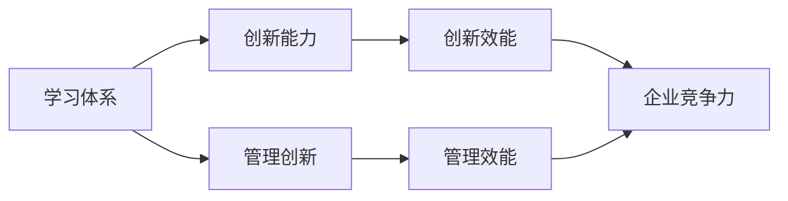
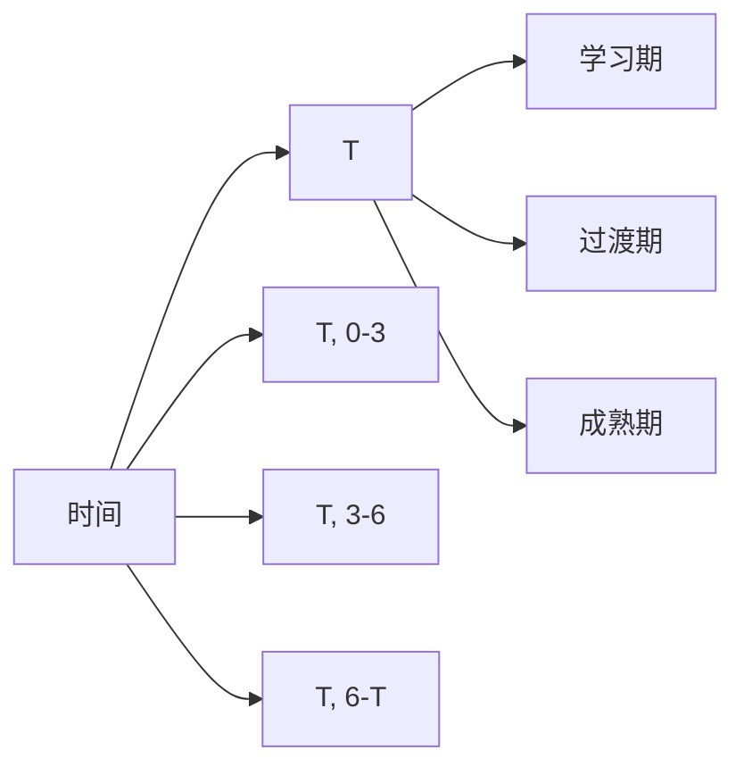

                 

## 1. 背景介绍

### 1.1 问题由来

在现代信息技术迅猛发展的背景下，企业面临的竞争环境日益激烈，管理创新能力成为企业生存和发展的关键要素。传统的管理模式和理论已经无法满足新时代的需求，新的学习体系与方法应运而生，以培养企业员工的管理创新能力。

### 1.2 问题核心关键点

当前，企业管理的焦点在于如何在复杂多变的环境中保持创新能力。这主要涉及以下几个关键点：

- **创新文化的培养**：打造鼓励创新、容忍失败的企业文化，为员工提供自由表达和实现想法的平台。
- **创新技能的学习**：提供系统化的学习路径，帮助员工掌握创新思维和工具。
- **创新环境的构建**：建立支持创新的工作环境和激励机制，如团队协作、资源配置等。
- **创新流程的优化**：设计灵活高效的创新流程，缩短创新周期，提高创新效率。

### 1.3 问题研究意义

构建有效的学习体系，对提升企业管理创新能力具有重要意义：

- **提升竞争力**：通过创新，企业能够开发新产品、改进现有产品，满足市场新需求，增强市场竞争力。
- **适应变化**：快速变化的商业环境要求企业能够及时调整策略，通过创新实现灵活应对。
- **促进增长**：创新能够开辟新市场，创造新业务模式，推动企业持续增长。
- **实现差异化**：创新是实现企业差异化的关键，通过独特的商业模式和技术突破，形成竞争优势。

## 2. 核心概念与联系

### 2.1 核心概念概述

要深刻理解学习体系与管理创新能力的培养，需要明确以下核心概念：

- **学习体系(Learning System)**：通过系统化的教育、培训和知识管理，构建知识共享和传递的框架，支持员工持续学习和发展。
- **管理创新(Management Innovation)**：在企业中引入新思想、新方法和新流程，提高管理效能和创新能力。
- **创新能力(Capability for Innovation)**：指企业或员工在面对不确定性和复杂性时的创造性思维和行为能力。
- **学习与创新循环(Learning & Innovation Loop)**：通过不断的学习与创新，实现企业与员工的协同发展，形成良性循环。

这些概念之间的联系可以通过以下Mermaid流程图来展示：



这个流程图展示了学习体系与创新能力的核心关系，即通过学习体系培养的创新能力，能够直接提升管理效能和企业竞争力。

## 3. 核心算法原理 & 具体操作步骤

### 3.1 算法原理概述

企业通过学习体系培养管理创新能力，本质上是一个持续的反馈和优化过程。其核心算法原理可描述为：

1. **知识获取**：通过各种途径获取知识和信息，包括企业内部的文档、培训、案例分享等。
2. **知识吸收**：员工通过学习活动吸收知识，形成新的认知和技能。
3. **知识应用**：员工将所学知识应用于工作实践，提出创新解决方案。
4. **效果评估**：对创新解决方案的效果进行评估，获取反馈。
5. **知识迭代**：根据反馈信息调整学习内容和方式，持续优化知识体系。

这一过程通过循环迭代，不断提升企业及员工的管理创新能力。

### 3.2 算法步骤详解

构建有效的学习体系和管理创新能力培养流程，需要以下几个关键步骤：

**Step 1: 确定学习目标和内容**

- 明确企业发展的战略目标，确定学习体系需要覆盖的核心技能和知识。
- 对现有知识和技能进行盘点，找出差距和不足。
- 设计系统的学习路径，覆盖从基础知识到高级技能的各个层次。

**Step 2: 选择合适的学习方式**

- 根据学习目标和内容选择合适的学习方式，如在线课程、培训、工作坊、读书会等。
- 整合企业内外部的资源，引入专业机构或外部专家进行指导。
- 提供多样化的学习材料，包括书籍、视频、案例分析等。

**Step 3: 实施学习活动**

- 组织和开展学习活动，确保覆盖所有员工。
- 设定明确的学习时间，确保员工能够持续投入时间和精力。
- 提供必要的学习工具和平台，支持在线学习和交流。

**Step 4: 评估和反馈**

- 设计评估机制，定期检查员工的学习效果和创新成果。
- 收集反馈信息，了解员工在学习过程中的困难和需求。
- 根据反馈信息调整学习计划和内容，优化学习体验。

**Step 5: 应用和创新**

- 鼓励员工将所学知识应用于实际工作中，提出创新方案。
- 设立激励机制，对创新成果进行奖励和认可。
- 搭建创新平台，促进内部交流和协作。

**Step 6: 持续优化**

- 通过持续的评估和反馈，不断优化学习体系和创新流程。
- 引入新的学习资源和方法，提升学习效率和效果。
- 跟踪行业最新趋势，确保学习体系的前沿性和实用性。

### 3.3 算法优缺点

构建学习体系和管理创新能力培养流程，具有以下优点：

- **系统性**：通过系统的学习目标和内容规划，确保学习的条理性和连贯性。
- **高效性**：通过评估和反馈机制，及时调整学习内容和方式，提升学习效果。
- **灵活性**：根据企业发展和员工需求的变化，动态调整学习体系，适应性强。

同时，也存在一些局限性：

- **成本高**：构建和维护一个全面的学习体系需要投入大量资源，包括人力、物力和财力。
- **实施难度大**：需要管理层和员工的共同参与和支持，才能顺利实施。
- **效果短期难见**：创新能力的提升是一个长期过程，短期内难以看到显著效果。

### 3.4 算法应用领域

构建学习体系和管理创新能力培养流程，在多个行业和领域都有广泛应用：

- **高科技行业**：如IT、互联网、通信等，通过持续的技术创新保持竞争优势。
- **制造业**：通过引入新工艺、新技术和新流程，提升生产效率和产品质量。
- **金融行业**：通过创新金融产品和服务，满足市场和客户需求。
- **医疗健康**：通过新药物、新技术和新方法，改善医疗服务质量。
- **教育行业**：通过创新教育模式和教学方法，提升教育效果和质量。

## 4. 数学模型和公式 & 详细讲解 & 举例说明

### 4.1 数学模型构建

为了更好地理解学习体系和管理创新能力培养的算法原理，我们可以构建一个简单的数学模型。假设企业有 $N$ 个员工，每个员工的学习周期为 $T$ 个单位时间。在每个单位时间 $t$ 内，员工的学习效能为 $f(t)$，创新效能为 $g(t)$。企业通过学习体系培养的管理创新能力 $I(t)$ 可以表示为：

$$
I(t) = \sum_{t=0}^{T} \int_{0}^{f(t)} g(t) dt
$$

其中，$\int_{0}^{f(t)} g(t) dt$ 表示在单位时间 $t$ 内员工通过学习获取的创新能力提升量。

### 4.2 公式推导过程

上述公式可以通过以下几个步骤推导：

1. 设定每个员工的学习效能 $f(t)$ 和创新效能 $g(t)$。
2. 计算每个员工在每个单位时间内的创新能力提升量。
3. 对所有员工的创新能力提升量进行积分求和。

假设员工的学习效能为线性增长，创新效能为二次增长，则有：

$$
f(t) = at + b
$$
$$
g(t) = ct^2 + dt + e
$$

代入公式，得到：

$$
I(t) = \sum_{t=0}^{T} \int_{0}^{at + b} (ct^2 + dt + e) dt
$$

通过积分和求和，最终得到：

$$
I(T) = \frac{1}{3}aT^3 + \frac{1}{2}aT^2 + \left(\frac{d}{6}T^3 + \frac{e}{2}T^2\right) + \frac{1}{2}bT^2 + eT
$$

### 4.3 案例分析与讲解

以某科技公司为例，假设员工在每个单位时间内的学习效能为 $f(t) = 0.1t + 1$，创新效能为 $g(t) = 0.01t^2 + 0.2t + 0.3$。企业通过学习体系培养的管理创新能力随时间变化的情况如下：

- **学习期**：$t=0-3$，员工主要通过学习获取知识。
- **过渡期**：$t=3-6$，员工将所学知识应用于实际工作，创新能力开始提升。
- **成熟期**：$t=6-T$，员工在实际工作中不断积累经验，创新能力显著提升。

通过计算，可以得出企业总的学习周期内的管理创新能力变化趋势，如下图所示：



这个图表展示了企业通过学习体系培养管理创新能力的过程，不同阶段员工的学习和创新活动对整体管理创新能力的影响。

## 5. 项目实践：代码实例和详细解释说明

### 5.1 开发环境搭建

要实现学习体系和管理创新能力的培养，需要搭建相应的开发环境。这里提供一个简单的项目结构：

```
- learning_system/
    - data/
        - courses/
        - employees/
    - models/
        - learner/
        - innovator/
    - apps/
        - learner.py
        - innovator.py
    - tools/
        - learning_management.py
        - innovation_analysis.py
```

在搭建开发环境时，需要考虑以下几点：

- **数据管理**：搭建数据存储和管理系统，确保数据的安全和可访问性。
- **模型管理**：搭建模型训练和部署平台，支持学习效能和创新效能的评估和优化。
- **应用开发**：搭建学习活动和创新应用的系统，支持在线学习、案例分享等。

### 5.2 源代码详细实现

以下是一个简单的代码实现示例，用于评估员工的学习效能和创新效能：

```python
import numpy as np

# 设定学习效能和创新效能的函数
def learning_efficiency(t):
    return 0.1 * t + 1

def innovation_efficiency(t):
    return 0.01 * t**2 + 0.2 * t + 0.3

# 计算学习周期内的管理创新能力
T = 10  # 学习周期
innovation_capacity = 0

for t in range(T+1):
    innovation_capacity += np.trapz(g(t), b=a(t), c=c(t))

print(f"Innovation capacity: {innovation_capacity}")
```

### 5.3 代码解读与分析

上述代码实现了对员工学习效能和创新效能的计算，并对学习周期内的管理创新能力进行了积分求和。

- **学习效能函数**：通过函数 `learning_efficiency(t)` 定义学习效能随时间的变化。
- **创新效能函数**：通过函数 `innovation_efficiency(t)` 定义创新效能随时间的变化。
- **积分求和**：使用 `numpy` 库的 `trapz` 函数计算每个时间段的创新能力提升量，并累加求和。

## 6. 实际应用场景

### 6.1 智能制造

在智能制造领域，通过学习体系培养的管理创新能力，可以显著提升生产效率和产品质量。具体应用场景包括：

- **数字化转型**：引入物联网、大数据、人工智能等新技术，实现生产过程的数字化和智能化。
- **柔性制造**：通过灵活的制造流程和设备管理，实现快速响应市场需求。
- **质量控制**：利用数据分析和机器学习，实现对生产质量的实时监控和预测。

### 6.2 金融科技

在金融科技领域，通过学习体系培养的管理创新能力，可以提升金融服务的创新性和安全性。具体应用场景包括：

- **金融产品创新**：开发新的金融产品，满足市场和客户需求。
- **风险管理**：利用大数据和机器学习技术，进行风险评估和预警。
- **客户体验**：通过智能客服和推荐系统，提升客户体验和满意度。

### 6.3 医疗健康

在医疗健康领域，通过学习体系培养的管理创新能力，可以推动医疗服务的创新和改善。具体应用场景包括：

- **新药研发**：利用生物信息学和大数据技术，加速新药的研发和上市。
- **个性化医疗**：通过基因组学和人工智能技术，提供个性化的诊疗方案。
- **远程医疗**：利用互联网技术，实现远程医疗咨询和诊断。

### 6.4 未来应用展望

未来，随着技术的不断进步，学习体系和管理创新能力的培养将呈现以下发展趋势：

1. **智能化**：引入人工智能和大数据技术，实现学习体系和管理创新能力的自动化和智能化。
2. **个性化**：根据员工的需求和能力，定制个性化的学习路径和创新支持。
3. **全球化**：在全球范围内分享和学习最佳实践，推动全球知识共享和协同创新。
4. **社会化**：将学习体系和管理创新能力培养与社会公益结合，推动社会创新和文化发展。

## 7. 工具和资源推荐

### 7.1 学习资源推荐

为了帮助读者系统掌握学习体系与管理创新能力的培养，推荐以下学习资源：

- **《组织学习：系统设计、技术与实践》(《Organizational Learning: Systems, Technologies, and Practices》)**：介绍了组织学习的理论基础、方法和工具。
- **《创新者的窘境：为什么伟大的公司会失败》(《The Innovator's Dilemma: When New Technologies Cause Great Firms to Fail》)**：分析了创新失败的原因和创新管理的策略。
- **《创新驱动的组织变革：组织学习与创新能力提升》(《Driving Innovation through Organizational Transformation: Building Organizational Learning and Innovation Capabilities》)**：介绍了组织学习与创新的实践案例和方法。
- **《创新管理：从理论到实践》(《Innovation Management: Theory, Method, and Practice》)**：系统地介绍了创新管理的理论、方法和工具。

### 7.2 开发工具推荐

要实现学习体系和管理创新能力的培养，推荐以下开发工具：

- **JIRA**：项目管理工具，用于跟踪学习活动和创新项目。
- **Slack**：即时通信工具，支持团队协作和学习交流。
- **Trello**：任务管理工具，用于规划和调度学习任务和创新活动。
- **Zoom**：视频会议工具，支持远程学习和创新讨论。

### 7.3 相关论文推荐

为了深入理解学习体系和管理创新能力的培养，推荐以下论文：

- **《组织学习与知识管理：理论与实践》(《Organizational Learning and Knowledge Management: A Research and Practice Guide》)**：总结了组织学习和知识管理的理论和实践。
- **《通过学习推动创新：实践框架》(《Driving Innovation through Learning: A Practical Framework》)**：提出了基于学习的创新管理框架。
- **《组织学习：管理研究的新范式》(《Organizational Learning: A New Paradigm for Research》)**：探讨了组织学习的理论基础和实践方法。

## 8. 总结：未来发展趋势与挑战

### 8.1 总结

本文系统地介绍了学习体系与管理创新能力的培养，并对其核心概念、算法原理、操作步骤进行了详细讲解。通过分析学习体系与管理创新能力培养的实际应用场景，揭示了其潜在的未来发展趋势和面临的挑战。

### 8.2 未来发展趋势

未来，学习体系与管理创新能力的培养将呈现以下几个发展趋势：

1. **智能化**：通过引入人工智能和大数据技术，实现学习体系和管理创新能力的自动化和智能化。
2. **个性化**：根据员工的需求和能力，定制个性化的学习路径和创新支持。
3. **全球化**：在全球范围内分享和学习最佳实践，推动全球知识共享和协同创新。
4. **社会化**：将学习体系和管理创新能力培养与社会公益结合，推动社会创新和文化发展。

### 8.3 面临的挑战

尽管学习体系与管理创新能力的培养在理论和实践中取得了显著进展，但在实际应用中仍面临诸多挑战：

1. **资源投入大**：构建和维护一个全面的学习体系需要投入大量资源，包括人力、物力和财力。
2. **实施难度大**：需要管理层和员工的共同参与和支持，才能顺利实施。
3. **效果短期难见**：创新能力的提升是一个长期过程，短期内难以看到显著效果。
4. **数据隐私和安全**：在数据驱动的学习体系中，如何保障数据隐私和安全是一个重要问题。

### 8.4 研究展望

未来，在学习体系与管理创新能力的培养领域，还需要进一步研究以下几个方向：

1. **深度学习与知识图谱**：利用深度学习和大数据技术，构建知识图谱和知识网络，提升知识获取和共享的效率。
2. **社交网络和协作平台**：通过构建社交网络和协作平台，促进员工之间的交流和协作，加速创新知识的传播和应用。
3. **行为分析和心理建模**：通过分析员工的行为和心理特征，设计更加个性化和有效的学习路径和创新支持。
4. **伦理和社会责任**：在管理创新能力的培养过程中，注重伦理和社会责任，确保创新活动符合道德和法律标准。

## 9. 附录：常见问题与解答

**Q1: 什么是学习体系？**

A: 学习体系是一种通过系统化的教育、培训和知识管理，构建知识共享和传递的框架，支持员工持续学习和发展。

**Q2: 如何评估学习体系和管理创新能力的培养效果？**

A: 评估学习体系和管理创新能力的培养效果，可以从以下几个方面入手：
- 员工的技能提升和知识掌握情况。
- 企业创新项目和产品的成功率和市场接受度。
- 员工对学习活动的反馈和满意度。
- 企业的市场竞争力和创新绩效。

**Q3: 学习体系和管理创新能力培养的核心步骤是什么？**

A: 学习体系和管理创新能力培养的核心步骤包括：
1. 确定学习目标和内容。
2. 选择合适的学习方式。
3. 实施学习活动。
4. 评估和反馈。
5. 应用和创新。
6. 持续优化。

通过上述步骤的不断循环和优化，企业可以逐步提升管理创新能力，实现持续发展和竞争优势。

**Q4: 学习体系与管理创新能力的培养需要多少资源？**

A: 学习体系与管理创新能力的培养需要投入大量资源，包括但不限于：
- 人力投入：需要专业的培训师、学习顾问和创新指导师。
- 财务投入：需要资金支持学习活动、创新项目和平台建设。
- 技术投入：需要搭建学习管理系统、知识库和创新平台。

这些资源的投入，能够确保学习体系和管理创新能力培养的顺利实施和持续优化。

**Q5: 如何应对学习体系和管理创新能力培养中的数据隐私和安全问题？**

A: 应对学习体系和管理创新能力培养中的数据隐私和安全问题，可以从以下几个方面入手：
- 数据加密：对敏感数据进行加密存储和传输。
- 数据权限控制：根据员工的角色和职责，设置不同级别的数据访问权限。
- 数据匿名化：在数据分析和共享时，对个人数据进行匿名化处理。
- 数据监控：实时监控数据的使用情况，及时发现和应对异常行为。

通过这些措施，可以有效保护数据隐私和安全，确保学习体系和管理创新能力培养的顺利进行。

---

作者：禅与计算机程序设计艺术 / Zen and the Art of Computer Programming

