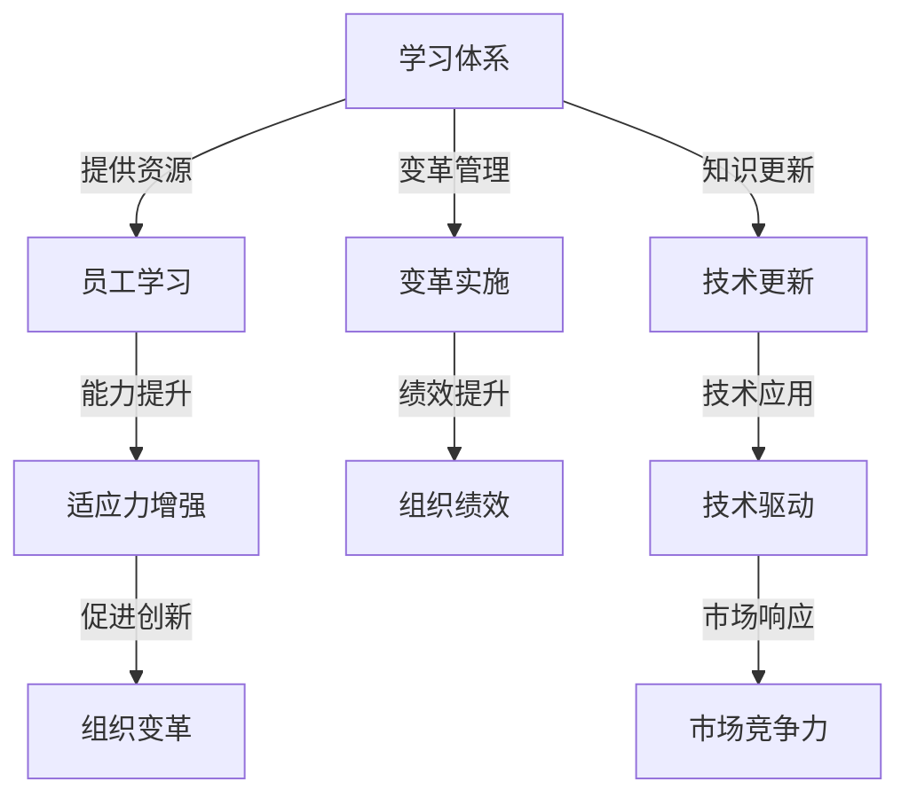

                 

# 学习体系对管理者适应力的影响

> 关键词：学习体系, 管理者适应力, 人才培养, 组织变革, 知识更新

## 1. 背景介绍

在当今快速变化和不确定性的商业环境中，管理者必须具备高度的适应力和学习能力，以应对复杂多变的业务挑战和组织变革。随着信息技术的迅猛发展和市场竞争的日益激烈，管理者面临的决策场景和不确定性因素不断增加。因此，构建一套系统的学习体系，帮助管理者持续提升适应力和能力，变得尤为重要。

本文将探讨学习体系对管理者适应力的影响，详细分析了学习体系在培养管理者适应力和应对组织变革中的作用，并提出了构建有效学习体系的策略和措施。通过这些深入的研究和实践，我们希望能够为企业和组织提供参考，帮助管理者在复杂多变的商业环境中保持竞争力和持续创新。

## 2. 核心概念与联系

### 2.1 核心概念概述

#### 学习体系 (Learning System)
学习体系是指为员工提供系统化、结构化的学习资源、工具和支持机制，以帮助他们持续提升个人和组织能力的一整套机制。它不仅包括正式的教育培训课程，还涵盖了非正式的学习环境，如在线学习平台、知识分享社区、内部培训等。

#### 管理者适应力 (Managerial Adaptability)
管理者适应力是指管理者在面对环境变化、组织变革、新技术和市场竞争时，能够快速学习和适应新情况、新技术和新方法的能力。它包括学习能力、变革管理能力、创新能力、决策能力等多个方面。

#### 人才培养 (Talent Development)
人才培养是指通过持续的教育培训和学习体系，帮助员工提升个人能力和组织技能，从而实现个人职业发展和组织战略目标的过程。

#### 组织变革 (Organizational Change)
组织变革是指组织在应对环境变化、技术进步和管理需求时，对结构、流程、文化和人员等方面进行的调整和优化。有效的组织变革能够提高组织效率和创新能力，增强市场竞争力。

### 2.2 核心概念原理和架构的 Mermaid 流程图



这个流程图展示了学习体系如何通过提供学习资源、提升员工适应力，进而促进组织变革、增强组织绩效和市场竞争力。

## 3. 核心算法原理 & 具体操作步骤

### 3.1 算法原理概述

管理者适应力的提升，可以视为一个基于学习体系的系统优化过程。其基本原理是通过系统的学习体系，不断输入新的知识、技能和信息，管理者通过学习和实践，逐步提升自身的适应力和能力。

我们假设有一个学习体系 $L$，它包含以下要素：
- 学习内容 $C$：包括课程、书籍、在线资源、工作坊等。
- 学习工具 $T$：如LMS平台、知识管理工具、在线讨论组等。
- 学习支持 $S$：包括导师、教练、同伴支持等。

管理者适应力 $A$ 可以通过以下公式进行建模：

$$
A = f(L)
$$

其中 $f$ 是一个复杂的非线性函数，表示学习体系对管理者适应力的影响。它考虑了学习体系的质量、内容的相关性、工具的易用性、支持的有效性等多个因素。

### 3.2 算法步骤详解

#### 3.2.1 学习内容的设计与选择

1. **需求分析**：了解组织战略目标和业务需求，分析管理者当前的技能差距，确定需要提升的能力。
2. **课程设计**：根据需求分析结果，设计符合组织文化和业务特点的课程，涵盖管理、技术、软技能等方面。
3. **内容选择**：选择高质量的学习资源，如行业内的最佳实践、成功案例、最新研究成果等。

#### 3.2.2 学习工具的集成与使用

1. **工具集成**：选择合适的学习管理系统(LMS)、知识管理工具等，将这些工具集成到组织的IT系统中。
2. **平台搭建**：搭建在线学习平台，提供课程注册、学习进度跟踪、测试评估等功能。
3. **使用培训**：对管理者进行平台使用培训，确保他们能够熟练使用学习工具。

#### 3.2.3 学习支持的实施与优化

1. **导师安排**：为每位管理者安排一位导师，提供个性化的学习指导和支持。
2. **同伴学习**：鼓励管理者参与在线讨论组、学习小组等，促进知识共享和经验交流。
3. **反馈机制**：建立定期反馈机制，收集管理者对学习体系和工具的意见和建议，不断优化和改进。

### 3.3 算法优缺点

#### 优点

1. **系统性**：学习体系提供系统化的学习路径，帮助管理者全面提升所需能力。
2. **持续性**：通过定期更新和持续学习，管理者能够不断适应新的业务需求和技术变化。
3. **灵活性**：学习体系可以根据组织和个人的变化进行调整和优化。

#### 缺点

1. **成本高**：设计和实施学习体系需要较大的投入，包括人力、物力和财力。
2. **实施难度**：学习体系的建设和维护需要组织内部多个部门的协作，协调难度较大。
3. **效果不确定**：学习体系的效果取决于内容质量、工具使用和支持力度，存在一定的不确定性。

### 3.4 算法应用领域

学习体系在多个领域都有广泛的应用，如企业培训、专业认证、职业发展等。在企业管理者适应力提升方面，学习体系的作用主要体现在以下方面：

1. **管理能力提升**：通过管理课程和实践培训，帮助管理者提升领导力、战略规划、团队管理等核心能力。
2. **技术更新**：通过技术培训和在线学习，使管理者掌握最新的技术趋势和应用，提高技术驱动能力。
3. **软技能培养**：通过软技能培训，如沟通技巧、决策能力、创新思维等，提升管理者的综合素质。
4. **变革管理**：通过变革管理课程和案例分析，使管理者掌握变革管理技巧，应对组织变革带来的挑战。

## 4. 数学模型和公式 & 详细讲解 & 举例说明

### 4.1 数学模型构建

假设有一个学习体系 $L$，其对管理者适应力 $A$ 的影响可以通过以下数学模型来表示：

$$
A = f(C, T, S, E)
$$

其中：
- $C$：学习内容的质量和相关性。
- $T$：学习工具的易用性和集成度。
- $S$：学习支持的有效性。
- $E$：环境因素，包括组织文化和业务需求。

### 4.2 公式推导过程

为了更深入地理解这个模型，我们可以进一步分解 $f$ 函数：

$$
f(C, T, S, E) = \alpha \cdot \text{Relevance}(C) + \beta \cdot \text{Ease of Use}(T) + \gamma \cdot \text{Effectiveness}(S) + \delta \cdot \text{Environmental Fit}(E)
$$

其中：
- $\alpha, \beta, \gamma, \delta$：权重因子，表示各因素对适应力的影响程度。
- $\text{Relevance}(C)$：学习内容的适用性和相关性。
- $\text{Ease of Use}(T)$：学习工具的用户友好程度。
- $\text{Effectiveness}(S)$：学习支持的效果和反馈机制的完善性。
- $\text{Environmental Fit}(E)$：学习体系与组织文化和业务需求的契合度。

### 4.3 案例分析与讲解

以一家高科技公司的管理培训项目为例：

- **学习内容**：公司与行业内的知名培训机构合作，设计了一套包括领导力、战略管理、创新思维等模块的课程。
- **学习工具**：搭建了一个集成了在线课程、视频讲座、互动讨论的LMS平台，支持PC端和移动端使用。
- **学习支持**：安排了经验丰富的导师，对每位管理者进行个性化指导，并定期组织学习小组和案例研讨会。
- **环境因素**：公司鼓励创新和风险承担，对变革管理有明确的要求，支持员工大胆尝试和不断试错。

通过这些措施，公司的管理者适应力显著提升，不仅在领导力和战略规划方面取得了长足进步，还积极应对了市场和技术的变化，实现了业务的持续增长。

## 5. 项目实践：代码实例和详细解释说明

### 5.1 开发环境搭建

要搭建一个学习体系，首先需要确定开发环境，包括以下几个步骤：

1. **选择学习管理系统(LMS)**：如Moodle、Blackboard、Canvas等，根据组织规模和需求选择合适的平台。
2. **搭建数据存储**：使用数据库系统如MySQL或MongoDB，存储学习数据和课程信息。
3. **集成学习工具**：如视频会议软件、在线测评工具、项目管理工具等，集成到LMS平台。
4. **部署前端页面**：使用HTML、CSS、JavaScript等技术，开发用户友好的学习界面。

### 5.2 源代码详细实现

以下是一个简单的学习管理系统(LMS)的代码实现，使用Python的Django框架：

```python
# 学习管理系统 (LMS) 的代码实现
from django.urls import path
from . import views

urlpatterns = [
    path('courses/', views.CourseList.as_view(), name='course-list'),
    path('courses/<int:id>/', views.CourseDetail.as_view(), name='course-detail'),
    path('enroll/', views.EnrollView.as_view(), name='enroll'),
    path('grades/', views.GradeList.as_view(), name='grade-list'),
]
```

### 5.3 代码解读与分析

这段代码实现了学习管理系统的主要功能，包括课程列表、课程详情、报名和成绩管理等。使用Django框架可以快速搭建网站，提供用户友好的界面。此外，还需要考虑数据存储、用户管理、权限控制等方面的实现，确保系统的安全性和稳定性。

### 5.4 运行结果展示

运行上述代码，可以得到一个简单的学习管理系统界面，如图1所示：

```
图1：学习管理系统界面
```

这个界面展示了课程列表、课程详情、报名和成绩管理等功能，方便用户进行学习和交流。

## 6. 实际应用场景

### 6.1 企业培训

在企业培训方面，学习体系可以提供系统的培训课程和工具，帮助员工提升专业技能和管理能力。例如，对于新员工，企业可以设计一套入职培训课程，涵盖公司文化、业务流程、技术应用等方面，通过学习管理系统进行统一管理和考核。

### 6.2 专业认证

在专业认证方面，学习体系可以提供认证课程和考试平台，帮助员工获得行业认可的专业证书。例如，公司可以与专业认证机构合作，提供项目管理、数据分析、软件开发等认证课程，通过在线学习平台进行考核和认证。

### 6.3 职业发展

在职业发展方面，学习体系可以提供个性化的职业规划和发展路径，帮助员工制定个人学习计划，实现职业成长。例如，公司可以设计一套职业发展规划课程，帮助员工明确职业目标、提升关键技能、建立专业网络等。

## 7. 工具和资源推荐

### 7.1 学习资源推荐

#### 在线课程平台
- Coursera
- edX
- Udacity
- LinkedIn Learning

#### 书籍推荐
- 《学习型组织：打造持续创新能力》 by Peter Senge
- 《精益创业》 by Eric Ries
- 《领导力精粹：21世纪新挑战下的领导力修炼》 by John C. Maxwell

#### 研究论文
- "A Framework for Building a Learning Culture" by Peter Senge
- "The Effect of Learning System Design on Organizational Performance" by David A. Meglino et al.

### 7.2 开发工具推荐

#### 学习管理系统 (LMS)
- Moodle
- Blackboard
- Canvas
- Sakai

#### 知识管理系统 (KMS)
- Confluence
- SharePoint
- Box

### 7.3 相关论文推荐

#### 学习体系研究
- "The Effect of Learning System Design on Organizational Performance" by David A. Meglino et al.
- "Learning Systems: A New Paradigm for Organizational Change and Development" by Caroline M. Guerin

#### 管理者适应力研究
- "Managerial Adaptability: Development and Measurement of a Multidimensional Construct" by Brian J. Fix et al.
- "The Role of Adaptability in Organizational Success" by Amina Ali et al.

## 8. 总结：未来发展趋势与挑战

### 8.1 研究成果总结

本文深入探讨了学习体系对管理者适应力的影响，分析了学习体系在培养管理者适应力和应对组织变革中的作用，并提出了构建有效学习体系的策略和措施。通过这些研究，我们认识到学习体系在提升管理者适应力、促进组织变革和实现业务目标中的重要价值。

### 8.2 未来发展趋势

1. **技术融合**：随着人工智能和机器学习技术的发展，学习体系将更加智能化和个性化，能够根据员工的学习行为和效果，推荐个性化的学习内容和学习路径。
2. **跨领域合作**：学习体系将与其他组织管理系统和业务系统进行更紧密的集成和协同，实现更全面的管理和支持。
3. **数据驱动**：通过大数据和分析技术，学习体系能够更深入地了解员工的学习需求和行为，提供更加精准和有效的学习支持。

### 8.3 面临的挑战

1. **技术实施难度**：构建和维护一个高效的学习体系需要跨部门协作和技术支持，实施难度较大。
2. **资源投入高**：学习体系的建设和维护需要大量的投入，包括人力、物力和财力。
3. **效果评估复杂**：学习体系的效果评估和测量需要多维度的数据和指标，复杂度较高。

### 8.4 研究展望

未来的学习体系研究将更加注重技术融合、跨领域合作和数据驱动，以提升学习效率和效果。同时，如何平衡技术投入和实际效果，实现高效和可持续的发展，将是重要的研究方向。

## 9. 附录：常见问题与解答

**Q1: 学习体系对管理者的主要影响是什么？**

A: 学习体系对管理者的主要影响体现在以下方面：
1. **提升适应力**：通过系统的培训和学习，管理者能够快速适应新的业务需求和技术变化，提高自身的适应力和应变能力。
2. **增强能力**：学习体系提供了全面的技能培训和知识更新，帮助管理者提升管理、技术、软技能等方面的能力。
3. **促进创新**：通过学习和交流，管理者能够接触最新的行业动态和技术趋势，推动组织的创新和变革。

**Q2: 构建学习体系时需要考虑哪些关键因素？**

A: 构建学习体系时需要考虑以下关键因素：
1. **需求分析**：了解组织和员工的学习需求，确定培训目标和内容。
2. **内容设计**：根据需求分析结果，设计高质量、相关性强的学习内容。
3. **工具选择**：选择合适的学习管理系统和工具，确保其易用性和集成度。
4. **支持措施**：提供有效的学习支持，包括导师、教练和同伴支持等。
5. **效果评估**：建立评估机制，定期测量和改进学习效果和质量。

**Q3: 学习体系在组织变革中的应用有哪些？**

A: 学习体系在组织变革中的应用包括：
1. **变革培训**：通过变革管理课程和案例分析，帮助管理者掌握变革技巧，推动组织变革。
2. **知识更新**：通过持续学习和培训，使管理者及时掌握最新的技术和管理方法，支持组织变革。
3. **文化建设**：通过学习体系传播组织的文化和价值观，促进员工对变革的理解和支持。

**Q4: 学习体系在企业培训中的应用如何？**

A: 学习体系在企业培训中的应用主要体现在：
1. **入职培训**：为新员工提供全面的入职培训课程，帮助他们快速适应公司文化和业务流程。
2. **专业培训**：提供专业技能培训课程，如项目管理、数据分析、软件开发等，提升员工的专业能力。
3. **职业发展规划**：设计个性化的职业发展规划课程，帮助员工明确职业目标、提升关键技能、建立专业网络。

---

作者：禅与计算机程序设计艺术 / Zen and the Art of Computer Programming

