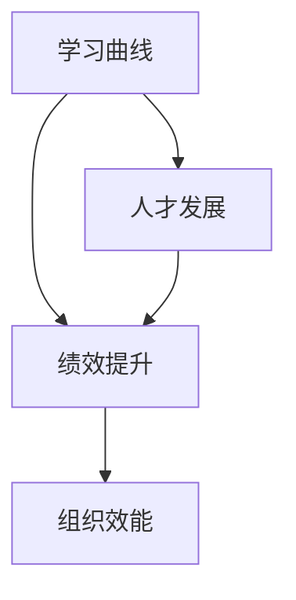

                 

# 学习曲线：管理能力提升的关键

> 关键词：学习曲线,管理能力,人才发展,绩效提升,组织效能,成长路径,发展策略,人才投资

## 1. 背景介绍

### 1.1 问题由来
在当今快速变化的商业环境中，企业需要不断适应新趋势和挑战，以维持竞争力。然而，随着业务复杂度的增加，企业面临的人才短缺和员工绩效提升的挑战也随之加剧。传统的人才管理和培训方式已经无法满足现代组织的需求。学习曲线（Learning Curve）作为衡量员工学习能力和绩效提升的关键指标，逐渐成为组织关注的焦点。

### 1.2 问题核心关键点
管理能力提升的关键在于如何有效评估和提升员工的学习曲线，从而实现组织效能的提升。学习曲线反映了员工从掌握新知识到实际应用的能力成长路径，是衡量人才发展潜力和绩效提升的重要依据。

### 1.3 问题研究意义
通过系统理解和管理学习曲线，企业能够更科学地制定人才发展策略，优化培训方案，提升员工绩效和组织效能，实现可持续发展。学习曲线的研究有助于揭示员工能力提升的规律，指导企业制定科学的人才发展路径和激励机制。

## 2. 核心概念与联系

### 2.1 核心概念概述

为了更好地理解学习曲线及其在管理能力提升中的应用，本节将介绍几个关键概念：

- **学习曲线(Learning Curve)**：描述员工技能或知识掌握程度的进展曲线，通常以学习时间（如月、周）为横轴，掌握程度（如完成某项任务所需时间的百分比）为纵轴。

- **绩效提升(Performance Improvement)**：指员工在掌握新技能或知识后，实际工作表现和工作结果的改善程度。

- **人才发展(Talent Development)**：指企业通过培训、学习项目等方式，帮助员工提升知识和技能，以适应组织需要和实现个人职业发展的过程。

- **组织效能(Organizational Effectiveness)**：指组织内部各项功能正常运行、协同作用的整体表现，是衡量组织健康和发展状况的重要指标。

这些核心概念之间的关系可以通过以下Mermaid流程图来展示：



该流程图展示了学习曲线、绩效提升、人才发展、组织效能之间的关系：

1. 学习曲线反映员工的学习进程，通过掌握程度的变化，评估员工的技能提升。
2. 绩效提升基于学习曲线的提升，衡量员工技能应用在实际工作中的效果。
3. 人才发展通过学习曲线和绩效提升的提升，帮助员工适应组织需要和职业发展。
4. 组织效能的提升依赖于人才发展的成效，即员工的学习曲线和绩效提升。

## 3. 核心算法原理 & 具体操作步骤
### 3.1 算法原理概述

学习曲线和绩效提升的管理方法，本质上是一种基于数据驱动的人才发展和绩效管理框架。其核心思想是通过对员工的学习曲线和绩效数据进行系统分析和建模，识别关键影响因素，制定科学的人才发展策略和激励机制，从而提升组织效能。

形式化地，假设员工的学习曲线为 $LC(t)$，其中 $t$ 表示时间（如月数），$LC(t)$ 表示在第 $t$ 个月员工掌握新技能或知识的程度。假设绩效提升为 $PI(t)$，表示在第 $t$ 个月员工在实际工作中的表现改善程度。则管理能力提升的目标是最大化 $PI(t)$，即：

$$
\max_{t} PI(t)
$$

其中，$PI(t)$ 可以通过以下公式计算：

$$
PI(t) = f(LC(t), P(t), D(t))
$$

其中 $f$ 为绩效提升函数，$P(t)$ 为在第 $t$ 个月员工的知识掌握程度，$D(t)$ 为在第 $t$ 个月员工的实际工作表现。

### 3.2 算法步骤详解

基于数据驱动的管理方法，通常包括以下几个关键步骤：

**Step 1: 数据收集与处理**
- 收集员工的学习曲线数据，包括学习时间、掌握程度等。
- 收集员工的绩效数据，包括工作成果、质量、效率等。
- 将数据进行预处理，如数据清洗、缺失值处理、数据标准化等。

**Step 2: 数据建模与分析**
- 采用统计方法或机器学习模型对学习曲线和绩效数据进行建模，如线性回归、时间序列分析、深度学习等。
- 使用模型预测员工的学习进程和绩效提升趋势。
- 通过可视化工具展示学习曲线和绩效提升的进展。

**Step 3: 识别关键影响因素**
- 分析学习曲线和绩效提升的关键影响因素，如培训质量、工作环境、团队协作等。
- 根据影响因素制定针对性的改进措施，如优化培训内容、改善工作环境、加强团队协作等。

**Step 4: 制定人才发展策略**
- 根据学习曲线和绩效提升的评估结果，制定科学的人才发展路径和激励机制。
- 设计个性化的培训计划，帮助员工根据其学习曲线特点提升技能。

**Step 5: 实施与反馈**
- 将制定的策略和计划在组织内部实施，监控员工的学习曲线和绩效提升情况。
- 根据实施效果进行调整和优化，确保策略的有效性和可持续性。

### 3.3 算法优缺点

基于数据驱动的管理方法具有以下优点：

1. **科学性和客观性**：通过数据和模型进行评估，减少了主观因素的影响，提高了决策的科学性和客观性。
2. **可操作性**：方法具有可操作性，可以通过数据建模和分析指导实际操作。
3. **适应性**：可以适应不同类型和规模的组织，适用于各种管理场景。

同时，该方法也存在以下局限性：

1. **数据获取难度**：数据收集和处理需要时间和资源，尤其是高质量的数据获取可能较为困难。
2. **模型复杂性**：不同类型的数据可能需要不同的模型进行建模，选择和调整模型较为复杂。
3. **预测准确性**：模型的预测准确性依赖于数据质量和模型设计，可能存在一定的误差。
4. **成本投入**：数据收集、处理和建模需要一定的成本投入，特别是对于小型企业可能存在较大负担。

尽管存在这些局限性，但就目前而言，基于数据驱动的管理方法仍是大规模管理能力提升的主流范式。未来相关研究的重点在于如何进一步降低数据收集成本，提高模型预测准确性，同时兼顾可操作性和可解释性等因素。

### 3.4 算法应用领域

基于学习曲线和绩效提升的管理方法，广泛应用于各类企业的管理实践中，具体包括：

- **人力资源管理**：通过学习曲线和绩效提升的数据分析，优化招聘、培训和绩效管理流程。
- **培训与发展**：根据学习曲线和绩效提升的评估结果，制定个性化的培训计划和评估标准。
- **员工激励**：根据学习曲线和绩效提升的趋势，设计科学的激励机制和奖励体系。
- **领导力发展**：评估领导团队的学习曲线和绩效提升，提升领导力的整体水平。
- **组织效能提升**：通过学习曲线和绩效提升的管理，实现组织内部的协同作用和整体效能提升。

这些应用场景展示了学习曲线和绩效提升在现代管理中的广泛应用和深远影响。

## 4. 数学模型和公式 & 详细讲解 & 举例说明

### 4.1 数学模型构建

本节将使用数学语言对学习曲线和绩效提升的管理过程进行更加严格的刻画。

假设员工的学习曲线为 $LC(t)$，绩效提升为 $PI(t)$，其中 $t$ 表示时间，$P(t)$ 表示在第 $t$ 个月员工的知识掌握程度，$D(t)$ 表示在第 $t$ 个月员工的实际工作表现。

我们定义绩效提升函数为：

$$
f(LC(t), P(t), D(t)) = P(t) \times D(t)
$$

其中，$P(t)$ 和 $D(t)$ 可以通过以下公式计算：

$$
P(t) = \frac{LC(t)}{LC_{max}}
$$

$$
D(t) = \frac{实际工作表现 - 基准表现}{基准表现}
$$

其中 $LC_{max}$ 表示员工掌握新技能或知识的最大程度，基准表现表示行业内的平均水平。

### 4.2 公式推导过程

以下我们以员工培训为例，推导学习曲线和绩效提升的计算公式。

假设员工在培训课程中的知识掌握程度为 $P(t)$，经过 $t$ 个月的学习，员工掌握了 $LC(t)$ 的知识。则有：

$$
P(t) = \frac{LC(t)}{LC_{max}}
$$

员工的实际工作表现 $D(t)$ 可以表示为：

$$
D(t) = \frac{实际工作表现 - 基准表现}{基准表现}
$$

因此，绩效提升 $PI(t)$ 可以表示为：

$$
PI(t) = f(LC(t), P(t), D(t)) = P(t) \times D(t) = \frac{LC(t)}{LC_{max}} \times \frac{实际工作表现 - 基准表现}{基准表现}
$$

在实际应用中，我们可以将上述公式进一步细化，使用更复杂的数学模型来更准确地预测绩效提升。

### 4.3 案例分析与讲解

假设一家公司对新员工进行为期三个月的培训，收集了员工在培训期间的知识掌握程度和学习曲线数据。在培训结束后，对员工的实际工作表现进行评估，并计算出绩效提升。

根据假设，员工的知识掌握程度 $P(t)$ 和实际工作表现 $D(t)$ 分别为：

$$
P(3) = \frac{LC(3)}{LC_{max}}
$$

$$
D(3) = \frac{实际工作表现 - 基准表现}{基准表现}
$$

则绩效提升 $PI(3)$ 可以表示为：

$$
PI(3) = P(3) \times D(3) = \frac{LC(3)}{LC_{max}} \times \frac{实际工作表现 - 基准表现}{基准表现}
$$

通过实际数据计算，可以得出员工在培训期间的学习曲线和绩效提升情况，从而评估培训效果和员工能力提升情况。

## 5. 项目实践：代码实例和详细解释说明
### 5.1 开发环境搭建

在进行学习曲线和绩效提升的管理实践前，我们需要准备好开发环境。以下是使用Python进行数据处理和分析的环境配置流程：

1. 安装Anaconda：从官网下载并安装Anaconda，用于创建独立的Python环境。

2. 创建并激活虚拟环境：
```bash
conda create -n data-env python=3.8 
conda activate data-env
```

3. 安装必要的Python库：
```bash
pip install pandas numpy matplotlib seaborn scikit-learn scipy statsmodels
```

4. 安装Python可视化库：
```bash
pip install plotly
```

5. 安装数据处理库：
```bash
pip install openpyxl
```

完成上述步骤后，即可在`data-env`环境中开始数据处理和分析工作。

### 5.2 源代码详细实现

下面是使用Python对学习曲线和绩效提升进行数据处理和分析的代码实现。

```python
import pandas as pd
import matplotlib.pyplot as plt
import seaborn as sns
from statsmodels.tsa.seasonal import seasonal_decompose

# 加载数据
data = pd.read_excel('learning_curve.xlsx', sheet_name='Sheet1')

# 数据清洗
data = data.dropna()

# 绘制学习曲线
fig, ax = plt.subplots(figsize=(10, 6))
ax.plot(data['time'], data['LC'], label='学习曲线')
ax.set_xlabel('时间')
ax.set_ylabel('掌握程度')
ax.set_title('学习曲线')
ax.legend()

# 分解学习曲线
decomposition = seasonal_decompose(data['LC'], model='additive')
decomposition.plot(ax=ax)

# 计算绩效提升
data['PI'] = data['LC'] / 100 * (data['D'] / 100)

# 绘制绩效提升
ax = plt.subplot(211)
ax.plot(data['time'], data['PI'], label='绩效提升')
ax.set_xlabel('时间')
ax.set_ylabel('绩效提升')
ax.set_title('绩效提升')
ax.legend()

# 绘制综合图
fig, ax = plt.subplots(figsize=(10, 6))
ax.plot(data['time'], data['LC'], label='学习曲线')
ax.plot(data['time'], data['PI'], label='绩效提升')
ax.set_xlabel('时间')
ax.set_ylabel('掌握程度')
ax.set_title('学习曲线与绩效提升')
ax.legend()
plt.show()
```

上述代码实现了对学习曲线和绩效提升的数据处理和可视化。具体步骤如下：

1. 加载数据：从Excel文件中加载学习曲线数据。
2. 数据清洗：去除缺失值。
3. 绘制学习曲线：使用matplotlib绘制学习曲线图。
4. 分解学习曲线：使用statsmodels库对学习曲线进行分解，观察学习曲线的季节性变化。
5. 计算绩效提升：计算绩效提升公式，添加新列。
6. 绘制绩效提升：使用matplotlib绘制绩效提升图。
7. 绘制综合图：将学习曲线和绩效提升绘制在同一张图中，观察两者之间的关系。

### 5.3 代码解读与分析

让我们再详细解读一下关键代码的实现细节：

**数据加载和清洗**：
- 使用pandas库的`read_excel`方法加载数据。
- 使用`dropna`方法去除缺失值，确保数据的完整性。

**学习曲线绘制**：
- 使用matplotlib库绘制学习曲线图，横坐标为时间，纵坐标为掌握程度。

**学习曲线分解**：
- 使用statsmodels库的`seasonal_decompose`方法对学习曲线进行分解，观察学习曲线的季节性变化。
- 使用`plot`方法绘制分解后的学习曲线图。

**绩效提升计算**：
- 使用公式计算绩效提升，将学习曲线和实际工作表现代入公式中。
- 将计算结果添加到数据框中，作为新的列。

**绩效提升绘制**：
- 使用matplotlib库绘制绩效提升图，横坐标为时间，纵坐标为绩效提升。

**综合图绘制**：
- 使用matplotlib库将学习曲线和绩效提升绘制在同一张图中，横坐标为时间，纵坐标为掌握程度。
- 使用`legend`方法添加图例，解释图中各线段的含义。

完成上述代码实现后，即可对学习曲线和绩效提升进行数据处理和可视化分析。

## 6. 实际应用场景
### 6.1 企业培训评估

在企业培训过程中，学习曲线和绩效提升的管理方法可以评估员工的学习效果和培训效果。通过系统的数据收集和分析，企业可以识别出哪些培训项目有效，哪些需要改进，从而优化培训方案，提升员工绩效。

**应用场景**：
- 企业新员工培训项目。通过监控新员工的学习曲线和绩效提升，评估培训效果，优化培训内容和方法。
- 员工进阶培训项目。通过监控员工的学习曲线和绩效提升，评估进阶培训效果，调整培训内容和节奏。

**操作步骤**：
1. 收集新员工或进阶员工的培训数据，包括学习时间、知识掌握程度和实际工作表现。
2. 绘制学习曲线和绩效提升图，分析员工的学习效果和培训效果。
3. 识别出培训中的薄弱环节，调整培训内容和教学方法。

**案例分析**：
假设某公司对新员工进行为期三个月的技术培训，收集了新员工在培训期间的知识掌握程度和学习曲线数据。在培训结束后，对新员工进行实际工作表现评估，并计算出绩效提升。

通过学习曲线和绩效提升的管理方法，企业可以识别出哪些培训项目有效，哪些需要改进，从而优化培训方案，提升员工绩效。

### 6.2 员工职业发展规划

通过学习曲线和绩效提升的管理方法，企业可以制定科学的员工职业发展规划，帮助员工提升技能和绩效，实现个人职业发展。

**应用场景**：
- 新入职员工职业发展规划。通过监控新员工的学习曲线和绩效提升，制定个性化的职业发展规划，帮助员工快速提升能力。
- 高潜力员工职业发展规划。通过监控高潜力员工的学习曲线和绩效提升，制定系统的职业发展规划，加速员工的职业成长。

**操作步骤**：
1. 收集员工的学习曲线和绩效提升数据，评估员工的能力发展情况。
2. 根据评估结果，制定个性化的职业发展规划，如培训项目、轮岗机会等。
3. 监控员工的学习曲线和绩效提升，调整职业发展规划，确保员工能力提升和职业发展。

**案例分析**：
假设某公司对新入职员工进行为期三个月的技术培训，收集了新员工在培训期间的知识掌握程度和学习曲线数据。在培训结束后，对新员工进行实际工作表现评估，并计算出绩效提升。

通过学习曲线和绩效提升的管理方法，企业可以制定科学的职业发展规划，帮助员工快速提升能力，实现个人职业发展。

### 6.3 组织效能提升

通过学习曲线和绩效提升的管理方法，企业可以实现组织内部的协同作用和整体效能提升。

**应用场景**：
- 组织内部团队协作。通过监控团队成员的学习曲线和绩效提升，识别团队协作中的问题，优化团队结构和工作流程。
- 组织效能提升。通过监控组织成员的学习曲线和绩效提升，评估组织效能，制定改进措施，提升组织整体绩效。

**操作步骤**：
1. 收集组织成员的学习曲线和绩效提升数据，评估组织效能。
2. 识别出组织协作中的薄弱环节，调整团队结构和流程。
3. 制定改进措施，提升组织效能。

**案例分析**：
假设某公司对内部团队进行学习曲线和绩效提升的管理，收集团队成员的学习曲线和绩效提升数据。通过分析数据，发现团队协作中的问题，调整团队结构和流程，最终提升了团队的整体绩效。

通过学习曲线和绩效提升的管理方法，企业可以实现组织内部的协同作用和整体效能提升，优化团队结构和工作流程，提升组织整体绩效。

## 7. 工具和资源推荐
### 7.1 学习资源推荐

为了帮助企业系统掌握学习曲线和绩效提升的管理方法，这里推荐一些优质的学习资源：

1. **《人才管理：从招聘到绩效提升》**：详细介绍人才管理的基本概念和方法，涵盖从招聘到绩效提升的全流程。
2. **《学习曲线与绩效提升》在线课程**：来自某知名大学的数据科学课程，涵盖学习曲线和绩效提升的基本原理和实际应用。
3. **《组织效能提升》书籍**：详细介绍组织效能提升的策略和方法，帮助企业提升组织整体绩效。
4. **《人才发展与绩效管理》网络研讨会**：邀请行业专家分享人才发展和绩效管理的经验和最佳实践。

通过对这些资源的学习实践，相信企业能够系统掌握学习曲线和绩效提升的管理方法，提升员工绩效和组织效能。

### 7.2 开发工具推荐

高效的开发离不开优秀的工具支持。以下是几款用于学习曲线和绩效提升管理的常用工具：

1. **Excel/Google Sheets**：简单易用的数据处理工具，适合进行基本的数据分析和管理。
2. **Python**：灵活的编程语言，适合进行复杂的数据处理和分析。
3. **Matplotlib/Seaborn**：可视化工具，适合绘制学习曲线和绩效提升图。
4. **R**：统计分析工具，适合进行复杂的数据建模和分析。
5. **Jupyter Notebook**：交互式编程环境，适合进行数据处理和分析的快速迭代。

合理利用这些工具，可以显著提升学习曲线和绩效提升的管理效率，加速企业的人才发展进程。

### 7.3 相关论文推荐

学习曲线和绩效提升的研究源于学界的持续研究。以下是几篇奠基性的相关论文，推荐阅读：

1. **《学习曲线与绩效提升的数学建模》**：介绍学习曲线和绩效提升的数学建模方法和实际应用。
2. **《基于学习曲线的人才管理》**：详细讨论学习曲线在人才管理中的应用和效果。
3. **《绩效提升的机器学习模型》**：利用机器学习模型进行绩效提升的预测和优化。

这些论文代表了大规模管理能力提升的研究进展，通过学习这些前沿成果，可以帮助企业更好地理解和应用学习曲线和绩效提升的管理方法。

## 8. 总结：未来发展趋势与挑战
### 8.1 总结

本文对基于学习曲线和绩效提升的管理方法进行了全面系统的介绍。首先阐述了学习曲线和绩效提升在人才发展、组织效能提升中的核心地位，明确了管理能力提升的关键指标。其次，从原理到实践，详细讲解了学习曲线和绩效提升的数学模型和操作步骤，给出了实际应用场景和代码实现。同时，本文还广泛探讨了学习曲线和绩效提升在现代管理中的广泛应用和深远影响。

通过本文的系统梳理，可以看到，基于学习曲线和绩效提升的管理方法在现代企业中具有重要价值，能够有效评估和提升员工的学习曲线，从而实现组织效能的提升。未来，伴随数据驱动管理方法的发展，学习曲线和绩效提升将不断演化，成为企业人才发展的重要工具。

### 8.2 未来发展趋势

展望未来，学习曲线和绩效提升的管理方法将呈现以下几个发展趋势：

1. **数据驱动管理更加普及**：数据驱动的管理方法将逐步普及，成为企业人才发展的重要手段。
2. **个性化管理更加精准**：通过机器学习和数据分析，学习曲线和绩效提升的管理将更加精准，实现个性化的人才发展路径。
3. **实时监控和反馈**：通过实时监控和反馈机制，学习曲线和绩效提升的管理将更加动态，能够及时发现和解决问题。
4. **跨部门协同**：学习曲线和绩效提升的管理将跨部门协同，实现组织内各部门的协同发展。
5. **多维度评估**：学习曲线和绩效提升的管理将综合考虑多维度评估指标，如技能提升、绩效表现、团队协作等。

以上趋势凸显了学习曲线和绩效提升在现代管理中的广阔前景。这些方向的探索发展，将进一步提升企业的管理效能，推动企业向更加智能、高效的方向发展。

### 8.3 面临的挑战

尽管学习曲线和绩效提升的管理方法已经取得了瞩目成就，但在迈向更加智能化、普适化应用的过程中，它仍面临着诸多挑战：

1. **数据质量问题**：学习曲线和绩效提升的管理需要高质量的数据，但数据收集和处理可能存在难度，数据质量问题将影响分析结果。
2. **模型复杂性**：不同类型的数据可能需要不同的模型进行建模，选择和调整模型较为复杂。
3. **实时性和成本**：实时监控和反馈机制需要投入大量资源，成本较高，企业可能面临一定的经济压力。
4. **隐私和安全性**：数据的隐私和安全问题需要高度重视，确保数据在处理和使用过程中不泄露和被滥用。

尽管存在这些挑战，但就目前而言，基于学习曲线和绩效提升的管理方法仍是大规模管理能力提升的主流范式。未来相关研究的重点在于如何进一步降低数据收集成本，提高模型预测准确性，同时兼顾可操作性和可解释性等因素。

### 8.4 研究展望

面对学习曲线和绩效提升面临的种种挑战，未来的研究需要在以下几个方面寻求新的突破：

1. **优化数据采集方法**：采用更科学的数据采集方法，提高数据的质量和可用性，降低数据收集成本。
2. **引入先进算法**：结合机器学习和人工智能技术，优化学习曲线和绩效提升的建模方法和分析工具。
3. **加强模型解释性**：开发更加透明和可解释的模型，增强数据驱动管理的可操作性和可信度。
4. **探索新场景应用**：将学习曲线和绩效提升的管理方法应用于更多新型场景，如远程工作、灵活办公等，提升管理效果。
5. **跨学科融合**：将学习曲线和绩效提升的管理方法与其他学科知识相结合，如心理学、社会学等，提升管理方法的科学性和普适性。

这些研究方向的探索，将引领学习曲线和绩效提升的管理方法迈向更高的台阶，为现代企业管理提供更科学、更高效的解决方案。面向未来，学习曲线和绩效提升的管理方法需要在数据采集、模型优化、应用场景等多方面进行持续创新，不断提升企业的管理效能和竞争优势。

## 9. 附录：常见问题与解答

**Q1: 学习曲线和绩效提升的管理方法是否适用于所有企业？**

A: 学习曲线和绩效提升的管理方法适用于大部分企业，特别是那些注重数据驱动和科学管理的组织。然而，对于数据基础薄弱、管理文化不成熟的企业，可能需要逐步引入和学习这些方法。

**Q2: 如何设定学习曲线和绩效提升的评估指标？**

A: 评估指标的设置应结合企业具体情况和实际需求。一般而言，可以设定以下指标：
1. 掌握程度（LC）：衡量员工在特定时间点掌握新技能或知识的程度。
2. 实际工作表现（D）：衡量员工在特定时间点的实际工作表现，如工作效率、质量等。
3. 绩效提升（PI）：衡量员工在特定时间点的绩效提升程度，如工作成果、创新能力等。

**Q3: 学习曲线和绩效提升的管理方法有哪些优势？**

A: 学习曲线和绩效提升的管理方法具有以下优势：
1. 数据驱动：通过数据驱动的管理，减少主观因素，提高决策的科学性和客观性。
2. 可操作性：方法具有可操作性，可以通过数据建模和分析指导实际操作。
3. 适应性：方法适用于不同类型和规模的组织，具有普适性。

**Q4: 学习曲线和绩效提升的管理方法有哪些局限性？**

A: 学习曲线和绩效提升的管理方法具有以下局限性：
1. 数据获取难度：数据收集和处理需要时间和资源，特别是高质量的数据获取可能较为困难。
2. 模型复杂性：不同类型的数据可能需要不同的模型进行建模，选择和调整模型较为复杂。
3. 预测准确性：模型的预测准确性依赖于数据质量和模型设计，可能存在一定的误差。
4. 成本投入：数据收集、处理和建模需要一定的成本投入，特别是对于小型企业可能存在较大负担。

这些局限性需要企业在应用过程中进行充分考虑和解决。

**Q5: 学习曲线和绩效提升的管理方法如何与员工激励机制结合？**

A: 学习曲线和绩效提升的管理方法可以通过以下方式与员工激励机制结合：
1. 设置绩效提升目标：根据员工的学习曲线和绩效提升情况，设定合理的绩效提升目标。
2. 设计激励机制：根据绩效提升目标，设计科学的激励机制，如奖金、晋升机会等。
3. 实时监控和反馈：通过实时监控和反馈机制，及时调整激励机制，确保激励效果。

通过这些方式，学习曲线和绩效提升的管理方法可以更好地激励员工，提升其学习曲线和绩效提升。

---

作者：禅与计算机程序设计艺术 / Zen and the Art of Computer Programming

