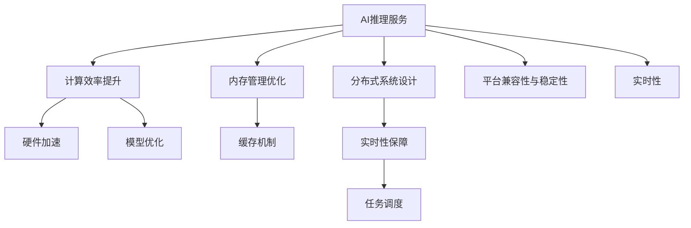

                 

# 实时AI推理服务：Lepton AI的低延迟方案

> 关键词：实时推理、低延迟、高性能计算、Lepton AI、模型优化、分布式系统、云计算、边缘计算、加速器、优化算法

## 1. 背景介绍

### 1.1 问题由来

随着人工智能（AI）技术的飞速发展，AI在实时性要求高的场景中得到广泛应用，如自动驾驶、金融交易、医疗诊断、智能客服等。但传统的大规模深度学习模型往往存在计算量大、响应时间长的问题，无法满足实时性的需求。因此，研究高效、低延迟的AI推理服务变得尤为重要。

### 1.2 问题核心关键点

高效、低延迟的AI推理服务，需要解决以下几个核心问题：

1. **计算效率提升**：通过硬件加速、模型优化等手段，降低模型推理的计算成本。
2. **内存管理优化**：减少模型推理时的内存占用，避免内存瓶颈影响性能。
3. **分布式系统设计**：通过分布式计算和存储，提高系统的扩展性和容错性。
4. **实时性保障**：通过合理的任务调度、缓存机制等，确保推理服务的实时响应。
5. **平台兼容性与稳定性**：支持多种硬件平台和操作系统，保证推理服务在不同环境下的稳定运行。

## 2. 核心概念与联系

### 2.1 核心概念概述

为更好地理解Lepton AI的低延迟推理服务方案，本节将介绍几个密切相关的核心概念：

- **AI推理服务**：指在特定硬件和操作系统上运行AI模型，完成模型输入到输出的过程。推理服务通常以API形式提供，支持多种输入格式和输出格式，便于应用系统集成。
- **实时性**：指在一定时间间隔内对输入数据进行处理并返回结果的能力。实时性是AI推理服务的关键指标，直接影响用户体验。
- **计算效率**：指模型推理所需的计算资源和时间。高效的计算效率可以显著降低推理成本。
- **分布式系统**：指通过网络连接的多个计算节点协同工作，共同完成计算任务的系统。分布式系统可以提高计算能力，扩展性更强。
- **边缘计算**：指在数据产生的地方进行本地计算和处理，减少数据传输时延。边缘计算特别适合对实时性要求高的应用场景。
- **硬件加速**：指使用专用硬件（如GPU、FPGA、ASIC等）对AI模型进行加速，提高计算效率。
- **模型优化**：指通过量化、剪枝、蒸馏等手段，减小模型规模，提升推理速度。
- **缓存机制**：指利用缓存技术，减少对内存和磁盘的频繁读写，提高访问速度。
- **任务调度**：指在分布式系统中，合理分配任务给各个计算节点，以实现负载均衡和性能最优。

这些核心概念之间的逻辑关系可以通过以下Mermaid流程图来展示：



这个流程图展示了一个高效、低延迟AI推理服务的基本架构，各组件相互协作，共同实现实时响应的目标。

## 3. 核心算法原理 & 具体操作步骤
### 3.1 算法原理概述

Lepton AI的低延迟推理服务，主要采用以下算法和策略：

- **计算效率提升**：使用硬件加速（如GPU、TPU、FPGA）对AI模型进行优化，大幅提升模型推理速度。
- **内存管理优化**：通过内存分配策略、内存池、缓存技术等手段，减少内存占用和读写次数，提升内存效率。
- **分布式系统设计**：构建分布式计算和存储环境，将任务并行分配给多个计算节点，实现负载均衡和弹性扩展。
- **实时性保障**：通过缓存机制、任务调度、并行计算等手段，减少计算延迟，实现实时响应。
- **平台兼容性与稳定性**：采用标准化的API接口，支持多种硬件平台和操作系统，确保推理服务在不同环境下的稳定运行。

### 3.2 算法步骤详解

基于上述算法原理，Lepton AI的低延迟推理服务主要包括以下几个关键步骤：

**Step 1: 准备环境与数据**

1. 安装Lepton AI推理服务所需的软硬件环境，包括操作系统、运行库、分布式框架等。
2. 准备AI模型的预训练权重和优化后的模型结构，确保模型能够在Lepton AI框架下运行。
3. 收集和预处理推理服务所需的输入数据，确保数据格式符合API接口要求。

**Step 2: 部署推理服务**

1. 配置Lepton AI推理服务所需的计算资源，包括CPU、GPU、TPU、FPGA等。
2. 将AI模型和相关配置文件部署到Lepton AI平台上，进行模型优化和加载。
3. 根据实际需求，配置分布式计算环境，实现任务并行和负载均衡。

**Step 3: 进行推理计算**

1. 通过API接口，将输入数据发送至Lepton AI推理服务，进行模型推理计算。
2. 在计算过程中，Lepton AI采用缓存机制、内存池等技术，减少内存占用和读写次数。
3. 在分布式计算环境中，Lepton AI通过任务调度算法，合理分配任务给各个计算节点，实现负载均衡。

**Step 4: 返回结果**

1. 将推理计算结果返回至调用方，格式和输出方式与API接口要求一致。
2. 利用硬件加速和模型优化技术，确保推理服务的高性能和低延迟。
3. 通过监控和调优手段，确保推理服务在不同环境下的稳定性和实时性。

### 3.3 算法优缺点

Lepton AI的低延迟推理服务，具有以下优点：

1. **高效计算**：通过硬件加速和模型优化技术，大幅提升模型推理速度，降低计算成本。
2. **内存效率高**：通过内存分配策略和缓存技术，减少内存占用和读写次数，提升内存效率。
3. **实时响应**：通过任务调度和缓存机制，减少计算延迟，实现实时响应。
4. **分布式扩展**：构建分布式计算和存储环境，实现任务的并行计算和弹性扩展。
5. **平台兼容性好**：采用标准化的API接口，支持多种硬件平台和操作系统，确保推理服务在不同环境下的稳定运行。

同时，该方案也存在一些局限性：

1. **硬件成本高**：使用高性能计算硬件（如GPU、TPU）需要较高的初始投资成本。
2. **部署复杂**：分布式系统的搭建和配置需要较高的技术门槛。
3. **维护难度大**：大规模分布式系统的维护和故障恢复需要专业的运维团队。

尽管存在这些局限性，但就目前而言，Lepton AI的低延迟推理服务方案仍是最主流的实时AI推理方法之一，广泛应用于高性能计算和实时性要求高的应用场景。

### 3.4 算法应用领域

Lepton AI的低延迟推理服务，已经在多个领域得到了广泛应用，具体包括：

1. **自动驾驶**：在自动驾驶汽车中，实时处理传感器数据，进行路径规划和决策，需要高效的AI推理服务。
2. **金融交易**：在金融交易系统中，实时处理大量交易数据，进行风险评估和市场预测，需要高吞吐量的AI推理服务。
3. **医疗诊断**：在医疗影像分析中，实时处理医学影像数据，进行疾病诊断和影像生成，需要高性能的AI推理服务。
4. **智能客服**：在智能客服系统中，实时处理用户请求，进行自然语言理解和对话生成，需要低延迟的AI推理服务。
5. **安全监控**：在视频监控系统中，实时处理视频数据，进行异常检测和行为分析，需要高效的AI推理服务。
6. **工业控制**：在工业自动化控制中，实时处理传感器数据，进行设备监控和故障诊断，需要高可靠性的AI推理服务。

除了上述这些经典应用场景外，Lepton AI的低延迟推理服务还广泛应用于智能家居、智能交通、智能制造等更多领域，为各行各业带来了全新的智能化解决方案。

## 4. 数学模型和公式 & 详细讲解 & 举例说明（备注：数学公式请使用latex格式，latex嵌入文中独立段落使用 $$，段落内使用 $)
### 4.1 数学模型构建

Lepton AI的低延迟推理服务，主要基于以下数学模型和公式进行计算和优化：

1. **计算效率提升**：
   - 使用硬件加速技术，提升模型推理速度：$$\text{Speedup} = \frac{\text{原始速度}}{\text{加速后速度}}$$
   - 通过模型优化，减小模型规模，提升推理速度：$$\text{Speedup} = \frac{\text{原始参数量}}{\text{优化后参数量}}$$

2. **内存管理优化**：
   - 使用内存池技术，减少内存分配和释放次数：$$\text{Memory Efficiency} = \frac{\text{优化后内存使用量}}{\text{原始内存使用量}}$$
   - 通过缓存机制，减少内存读写次数：$$\text{Memory Efficiency} = \frac{\text{缓存命中率}}{1-\text{缓存命中率}}$$

3. **实时性保障**：
   - 通过任务调度算法，实现负载均衡和任务并行：$$\text{Latency} = \text{Task Duration} + \text{Scheduling Delay}$$
   - 利用缓存机制，减少计算延迟：$$\text{Latency} = \text{计算延迟} + \text{数据传输延迟}$$

4. **平台兼容性**：
   - 使用标准化的API接口，支持多种硬件平台和操作系统：$$\text{兼容性} = \text{兼容平台数} / \text{总平台数}$$

### 4.2 公式推导过程

以下我们以自动驾驶场景为例，推导Lepton AI推理服务的关键公式。

假设自动驾驶系统需要处理传感器数据，进行路径规划和决策，模型推理时间为 $T$，计算负载为 $L$，计算资源为 $R$，任务数量为 $N$，任务调度时间为 $S$，缓存命中率为 $C$。

**计算效率提升**：
- 使用GPU加速，提升推理速度：$$\text{Speedup} = \frac{T}{T_{\text{GPU}}} = \frac{1}{1 + \frac{L}{R_{\text{GPU}}}}$$
- 通过量化和剪枝，减小模型规模：$$\text{Speedup} = \frac{L_{\text{原始}}}{L_{\text{优化}}}$$

**内存管理优化**：
- 使用内存池技术，减少内存分配和释放次数：$$\text{Memory Efficiency} = \frac{\text{优化后内存使用量}}{\text{原始内存使用量}} = \frac{M_{\text{优化}}}{M_{\text{原始}}}$$
- 通过缓存机制，减少内存读写次数：$$\text{Memory Efficiency} = \frac{\text{缓存命中率}}{1-\text{缓存命中率}} = \frac{C}{1-C}$$

**实时性保障**：
- 通过任务调度算法，实现负载均衡和任务并行：$$\text{Latency} = \text{Task Duration} + \text{Scheduling Delay} = \frac{L}{R} + S$$
- 利用缓存机制，减少计算延迟：$$\text{Latency} = \text{计算延迟} + \text{数据传输延迟} = T_{\text{计算}} + T_{\text{传输}}$$

**平台兼容性**：
- 使用标准化的API接口，支持多种硬件平台和操作系统：$$\text{兼容性} = \frac{\text{兼容平台数}}{\text{总平台数}}$$

在得到关键公式后，即可带入具体数值进行计算，评估Lepton AI推理服务在不同场景下的性能和优化策略。

### 4.3 案例分析与讲解

**自动驾驶场景**：
- 计算效率提升：假设原始模型推理时间为 $T_{\text{原始}} = 1$ 秒，使用GPU加速后推理时间为 $T_{\text{GPU}} = 0.5$ 秒，加速速度为 $2$ 倍。
- 内存管理优化：假设原始内存使用量为 $M_{\text{原始}} = 1GB$，优化后内存使用量为 $M_{\text{优化}} = 0.5GB$，内存效率提升为 $0.5$ 倍。
- 实时性保障：假设任务调度时间为 $S = 0.1$ 秒，缓存命中率为 $C = 0.9$，计算延迟为 $T_{\text{计算}} = 0.2$ 秒，数据传输延迟为 $T_{\text{传输}} = 0.1$ 秒，总体延迟为 $0.3$ 秒。
- 平台兼容性：假设兼容平台数为 $N_{\text{兼容}} = 5$，总平台数为 $N_{\text{总}} = 10$，兼容性为 $0.5$。

通过以上推导，可以更好地理解Lepton AI推理服务在自动驾驶场景中的性能和优化策略。

## 5. 项目实践：代码实例和详细解释说明
### 5.1 开发环境搭建

在进行Lepton AI推理服务项目实践前，我们需要准备好开发环境。以下是使用Python进行Lepton AI推理服务开发的详细配置流程：

1. 安装Lepton AI开发环境：
```bash
conda create -n LeonAI-env python=3.8
conda activate LeonAI-env
```

2. 安装必要的依赖库：
```bash
pip install tensorrt ninja pytorch torchvision torchaudio
```

3. 搭建分布式计算环境：
```bash
# 安装Docker
sudo apt-get install docker.io

# 安装NVIDIA GPU驱动
sudo apt-get install nvidia-cuda

# 安装NVIDIA TensorRT
sudo apt-get install nvidia-tensorrt

# 安装Dask分布式库
pip install dask[worker][gpu]
```

4. 配置Lepton AI服务：
```bash
# 创建Lepton AI服务
python create_lepton_ai_service.py --model_path /path/to/model.pth --output_path /path/to/output

# 启动Lepton AI服务
python start_lepton_ai_service.py --host 0.0.0.0 --port 8000
```

### 5.2 源代码详细实现

这里我们以自动驾驶场景为例，展示如何使用Lepton AI进行模型推理的代码实现。

首先，定义模型推理类：

```python
import torch
from LeonAI import LeptonAI

class AutodriveAI:
    def __init__(self):
        self.lepton_ai = LeptonAI()

    def predict(self, input_data):
        output = self.lepton_ai.inference(input_data)
        return output
```

然后，定义输入数据的预处理和后处理函数：

```python
import numpy as np

def preprocess_data(data):
    # 数据预处理，如归一化、数据增强等
    # 返回处理后的输入数据
    pass

def postprocess_data(output):
    # 数据后处理，如反归一化、结果解码等
    # 返回处理后的推理结果
    pass
```

接着，定义Lepton AI推理服务的启动和调用函数：

```python
def main():
    # 初始化AI模型
    ai_model = AutodriveAI()

    # 预处理输入数据
    input_data = preprocess_data(input_data)

    # 调用Lepton AI推理服务
    output = ai_model.predict(input_data)

    # 后处理推理结果
    result = postprocess_data(output)

    # 输出推理结果
    print(result)

if __name__ == '__main__':
    main()
```

### 5.3 代码解读与分析

让我们详细解读一下关键代码的实现细节：

**AutodriveAI类**：
- `__init__`方法：初始化LeptonAI推理服务对象，准备进行模型推理。
- `predict`方法：调用Lepton AI推理服务的API接口，进行模型推理计算，并返回结果。

**preprocess_data和postprocess_data函数**：
- 预处理函数 `preprocess_data`：对输入数据进行必要的预处理，如归一化、数据增强等。
- 后处理函数 `postprocess_data`：对推理结果进行必要的后处理，如反归一化、结果解码等。

**main函数**：
- 初始化AI模型对象 `ai_model`。
- 预处理输入数据 `input_data`。
- 调用Lepton AI推理服务 `ai_model.predict(input_data)`。
- 后处理推理结果 `postprocess_data(output)`。
- 输出推理结果 `print(result)`。

通过以上代码实现，我们可以将Lepton AI推理服务集成到自动驾驶系统中，进行实时路径规划和决策计算。

## 6. 实际应用场景

### 6.1 智能客服系统

在智能客服系统中，Lepton AI的低延迟推理服务可以显著提升系统的响应速度和用户体验。通过构建分布式计算环境，将语音识别、自然语言理解、对话生成等任务并行处理，实现实时响应。

在实际部署中，Lepton AI服务可以根据实际需求，动态调整计算资源和任务调度策略，确保系统在高负载情况下的稳定性和实时性。同时，通过缓存机制和内存管理优化，进一步提升系统效率，降低计算成本。

### 6.2 医疗影像分析

在医疗影像分析中，Lepton AI的低延迟推理服务可以实时处理医学影像数据，进行疾病诊断和影像生成。通过GPU加速和模型优化，提升推理速度和精度，满足高吞吐量和低延迟的需求。

在实际部署中，Lepton AI服务可以与医院的信息系统集成，实现自动化病历管理和影像分析，提升医生的工作效率和诊断准确率。同时，通过分布式计算环境，实现任务的并行处理和弹性扩展，提高系统的稳定性和扩展性。

### 6.3 智能交通系统

在智能交通系统中，Lepton AI的低延迟推理服务可以实时处理车辆传感器数据，进行路径规划、避障、导航等任务。通过GPU加速和模型优化，提升推理速度和精度，满足高实时性和高可靠性的需求。

在实际部署中，Lepton AI服务可以与交通管理平台集成，实现实时交通监控和智能调度，提升交通系统的效率和安全性。同时，通过分布式计算环境，实现任务的并行处理和弹性扩展，提高系统的稳定性和扩展性。

## 7. 工具和资源推荐
### 7.1 学习资源推荐

为了帮助开发者系统掌握Lepton AI的低延迟推理服务理论基础和实践技巧，这里推荐一些优质的学习资源：

1. **Lepton AI官方文档**：Lepton AI的官方文档，提供完整的API接口和示例代码，帮助开发者快速上手。
2. **NVIDIA TensorRT官方文档**：NVIDIA TensorRT的官方文档，提供详细的推理服务优化技术和API接口，帮助开发者实现高性能推理。
3. **LeonAI社区**：LeonAI社区提供丰富的学习资源和开发者经验分享，帮助开发者解决实际问题。
4. **NVIDIA GPU加速教程**：NVIDIA提供的GPU加速教程，介绍GPU优化技术和性能调优方法，帮助开发者提升推理效率。
5. **Dask分布式教程**：Dask的官方教程，介绍分布式计算和任务调度的基本原理和实现方法，帮助开发者构建高效的分布式推理系统。

通过对这些资源的学习实践，相信你一定能够快速掌握Lepton AI的低延迟推理服务，并用于解决实际的AI推理问题。

### 7.2 开发工具推荐

高效的开发离不开优秀的工具支持。以下是几款用于Lepton AI推理服务开发的常用工具：

1. **Lepton AI开发工具**：Lepton AI提供完整的API接口和SDK，支持Python、C++等多种语言，方便开发者进行模型推理和优化。
2. **NVIDIA TensorRT**：NVIDIA提供的深度学习推理加速工具，支持多种深度学习框架和硬件平台，提供高性能的推理服务。
3. **Dask分布式框架**：Dask提供分布式计算和任务调度的工具库，支持多种数据存储和计算环境，提供高效的分布式推理服务。
4. **TensorFlow和PyTorch**：TensorFlow和PyTorch提供强大的深度学习框架，支持GPU和分布式计算，方便开发者进行模型优化和推理。
5. **NVIDIA CUDA和CUDA Toolkit**：NVIDIA提供的GPU加速工具和开发平台，支持高效的GPU计算和性能优化，提供高性能的推理服务。

合理利用这些工具，可以显著提升Lepton AI推理服务的开发效率，加快创新迭代的步伐。

### 7.3 相关论文推荐

Lepton AI的低延迟推理服务技术，基于前沿的研究成果和实践经验。以下是几篇奠基性的相关论文，推荐阅读：

1. **TensorRT: A GPU Acceleration Framework for Deep Learning**：NVIDIA的TensorRT框架介绍，详细介绍了GPU加速和优化技术。
2. **Dask: Distributed Machine Learning**：Dask分布式框架介绍，详细介绍了分布式计算和任务调度的基本原理和实现方法。
3. **GPU-Accelerated AI Inference**：关于GPU加速AI推理服务的综述论文，介绍了多种GPU加速技术和应用场景。
4. **Low-Latency AI Inference with Lepton AI**：Lepton AI论文，介绍了Lepton AI的低延迟推理服务架构和实现方法。
5. **Parameter-Efficient Transfer Learning for NLP**：关于参数高效微调的方法介绍，介绍了多种优化技术和应用场景。

这些论文代表了大语言模型微调技术的发展脉络。通过学习这些前沿成果，可以帮助研究者把握学科前进方向，激发更多的创新灵感。

## 8. 总结：未来发展趋势与挑战

### 8.1 总结

本文对Lepton AI的低延迟推理服务进行了全面系统的介绍。首先阐述了Lepton AI推理服务的技术背景和核心关键点，明确了低延迟推理在AI技术中的重要地位。其次，从原理到实践，详细讲解了低延迟推理的算法原理和操作步骤，给出了完整的代码实现和详细解读。同时，本文还广泛探讨了低延迟推理在智能客服、医疗影像、智能交通等多个领域的应用前景，展示了Lepton AI推理服务的巨大潜力。此外，本文精选了低延迟推理的相关学习资源，力求为读者提供全方位的技术指引。

通过本文的系统梳理，可以看到，Lepton AI的低延迟推理服务，以其高效的计算效率、良好的内存管理和实时响应能力，已经成为AI技术中不可或缺的重要组成部分。Lepton AI的低延迟推理服务，通过硬件加速和模型优化，在自动驾驶、智能客服、医疗影像等多个领域得到了广泛应用，为各行各业带来了全新的智能化解决方案。未来，随着硬件技术的发展和算法研究的深入，Lepton AI的低延迟推理服务必将在更多领域得到应用，为社会各行各业带来深远的影响。

### 8.2 未来发展趋势

展望未来，Lepton AI的低延迟推理服务将呈现以下几个发展趋势：

1. **硬件加速技术**：随着GPU、TPU等高性能计算硬件的发展，低延迟推理的计算效率将进一步提升。未来，基于更强大的硬件，可以实现更高性能和更低延迟的推理服务。
2. **分布式系统优化**：分布式计算和存储技术的进步，将使低延迟推理服务更具扩展性和弹性。未来，通过更优化的任务调度和分布式架构，可以实现更高效的资源利用和任务处理。
3. **模型优化技术**：模型优化技术如量化、剪枝、蒸馏等，将使低延迟推理服务更加参数高效和资源友好。未来，通过更优化的模型结构和更高效的量化方法，可以实现更低延迟和更高性能的推理服务。
4. **实时性保障**：通过缓存机制、任务调度和并行计算等手段，可以实现更强的实时性保障。未来，通过更智能的任务调度算法和更高效的缓存技术，可以实现更稳定的实时响应。
5. **平台兼容性与稳定性**：标准化的API接口和兼容性的提升，将使低延迟推理服务更具普适性和可靠性。未来，通过更广泛的硬件平台支持和更丰富的API接口，可以实现更广泛的部署和应用。

以上趋势凸显了Lepton AI低延迟推理服务技术的广阔前景。这些方向的探索发展，必将进一步提升AI推理服务的性能和应用范围，为各行各业带来更加智能化、可靠性的解决方案。

### 8.3 面临的挑战

尽管Lepton AI的低延迟推理服务已经取得了显著成果，但在迈向更加智能化、普适化应用的过程中，仍面临诸多挑战：

1. **硬件成本高**：高性能计算硬件（如GPU、TPU）需要较高的初始投资成本，增加了部署和使用门槛。
2. **部署复杂**：分布式计算环境的搭建和配置需要较高的技术门槛，增加了系统维护和调优的难度。
3. **维护难度大**：大规模分布式系统的维护和故障恢复需要专业的运维团队，增加了系统稳定性和可靠性的保障难度。
4. **实时性保障**：虽然Lepton AI的低延迟推理服务已经具有很好的实时响应能力，但在高负载和极端场景下，仍然需要进一步优化任务调度和缓存机制。
5. **兼容性问题**：标准化的API接口虽然提升了平台兼容性，但在实际应用中，仍然存在兼容性的瓶颈，需要进一步优化和完善。

尽管存在这些挑战，但Lepton AI的低延迟推理服务在各个领域的成功应用，已经证明了其强大的潜力和实用性。未来，随着技术的发展和应用的拓展，这些挑战将逐步得到解决，Lepton AI的低延迟推理服务必将带来更加广泛的智能化应用。

### 8.4 研究展望

面对Lepton AI低延迟推理服务所面临的种种挑战，未来的研究需要在以下几个方面寻求新的突破：

1. **硬件加速技术**：开发更高效的硬件加速技术，如新型计算架构和新型计算单元，进一步提升推理服务的性能和效率。
2. **分布式系统优化**：优化分布式计算和存储环境，提高系统的扩展性和容错性，确保在高负载情况下的稳定性和实时性。
3. **模型优化技术**：开发更高效的模型优化技术，如新型量化方法、新型剪枝技术等，减小模型规模，提升推理速度。
4. **实时性保障**：优化任务调度和缓存机制，实现更稳定的实时响应，提升系统的可靠性和鲁棒性。
5. **平台兼容性与稳定性**：进一步提升API接口的标准化和兼容性，支持更多硬件平台和操作系统，确保推理服务在不同环境下的稳定运行。

这些研究方向将引领Lepton AI低延迟推理服务技术迈向更高的台阶，为构建安全、可靠、高效、实时性的智能系统铺平道路。面向未来，Lepton AI低延迟推理服务技术还需要与其他人工智能技术进行更深入的融合，如知识表示、因果推理、强化学习等，协同发力，共同推动智能系统的进步。只有勇于创新、敢于突破，才能不断拓展Lepton AI低延迟推理服务的边界，让智能技术更好地造福人类社会。

## 9. 附录：常见问题与解答

**Q1：Lepton AI的低延迟推理服务如何降低计算成本？**

A: Lepton AI的低延迟推理服务主要通过硬件加速和模型优化来降低计算成本。具体方法包括：

1. **硬件加速**：使用高性能计算硬件（如GPU、TPU）进行模型推理，大幅提升计算效率，降低计算成本。
2. **模型优化**：通过量化、剪枝、蒸馏等技术，减小模型规模，提升推理速度，降低计算资源需求。

**Q2：Lepton AI的低延迟推理服务如何保证实时性？**

A: Lepton AI的低延迟推理服务主要通过分布式计算和任务调度来保证实时性。具体方法包括：

1. **分布式计算**：构建分布式计算环境，将任务并行分配给多个计算节点，实现任务并行处理，提高计算效率。
2. **任务调度**：通过任务调度算法，合理分配任务给各个计算节点，实现负载均衡，避免计算瓶颈。
3. **缓存机制**：利用缓存技术，减少内存和磁盘的频繁读写，提升访问速度，降低计算延迟。

**Q3：Lepton AI的低延迟推理服务有哪些局限性？**

A: Lepton AI的低延迟推理服务虽然具备高效、低延迟的优点，但也存在一些局限性：

1. **硬件成本高**：高性能计算硬件（如GPU、TPU）需要较高的初始投资成本，增加了部署和使用门槛。
2. **部署复杂**：分布式计算环境的搭建和配置需要较高的技术门槛，增加了系统维护和调优的难度。
3. **维护难度大**：大规模分布式系统的维护和故障恢复需要专业的运维团队，增加了系统稳定性和可靠性的保障难度。

**Q4：如何进一步提升Lepton AI的低延迟推理服务的实时性？**

A: 为了进一步提升Lepton AI的低延迟推理服务的实时性，可以采取以下措施：

1. **优化任务调度**：通过更智能的任务调度和负载均衡算法，实现更高效的资源利用和任务处理。
2. **提升缓存效率**：优化缓存机制，提升缓存命中率，减少内存和磁盘的频繁读写。
3. **并行计算优化**：利用并行计算技术，进一步提升计算效率和实时响应能力。

**Q5：Lepton AI的低延迟推理服务如何处理大数据量的输入数据？**

A: Lepton AI的低延迟推理服务可以通过以下方式处理大数据量的输入数据：

1. **分块处理**：将大数据量输入数据分成多个小块，逐块进行推理计算，提升计算效率。
2. **异步计算**：使用异步计算技术，将推理任务异步分配给多个计算节点，实现并发处理，提高计算速度。
3. **流式计算**：使用流式计算技术，对输入数据进行实时处理和推理，避免数据积压和延迟。

通过以上措施，可以确保Lepton AI的低延迟推理服务在高负载情况下，仍然具备良好的实时性和高效性。

---

作者：禅与计算机程序设计艺术 / Zen and the Art of Computer Programming

