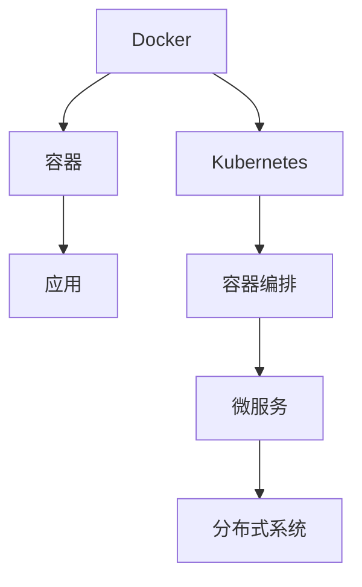

                 

# 容器化技术：Docker 和 Kubernetes

> 关键词：容器化, Docker, Kubernetes, 容器编排, 微服务, 分布式系统

## 1. 背景介绍

容器化技术作为现代云计算和微服务架构的基础设施，已经成为软件开发和部署的最佳实践。随着云计算、微服务架构的普及，越来越多的企业开始采用容器化技术来管理和部署其应用程序。Docker和Kubernetes作为容器化的两个核心技术，已经逐渐成为企业级软件开发的标配。本文将从背景、概念和应用等角度，全面介绍Docker和Kubernetes，以期为企业级软件开发提供有益的指导。

## 2. 核心概念与联系

### 2.1 核心概念概述

为了深入理解Docker和Kubernetes，首先需要掌握其核心概念：

- **Docker**：Docker是一种开源容器化平台，可以将应用程序打包成可移植、可重复使用的容器，这些容器可以在任何支持Docker的环境上运行，实现一致的应用环境。

- **Kubernetes**：Kubernetes是一个开源的容器编排平台，旨在自动化容器的部署、扩展和管理，支持微服务架构和分布式系统的高可用性。

- **容器编排**：容器编排指的是对容器进行管理和调度，包括自动分配计算资源、负载均衡、自动伸缩、服务发现等。

- **微服务架构**：微服务架构是一种软件架构风格，将应用程序拆分成一系列细粒度的小型服务，每个服务都是独立的，可以独立部署和扩展。

- **分布式系统**：分布式系统是指一组分散的计算机系统，通过网络协同工作，提供高效、可扩展的服务。

### 2.2 核心概念原理和架构的 Mermaid 流程图(Mermaid 流程节点中不要有括号、逗号等特殊字符)



这个图表展示了Docker和Kubernetes在容器化技术中的核心作用和相互联系：

- Docker将应用打包成容器，为应用提供一致的环境。
- Kubernetes负责容器编排，自动管理和调度容器。
- 微服务架构将应用拆分为多个小型服务，每个服务独立部署和扩展。
- 分布式系统通过协同工作提供高效、可扩展的服务。

## 3. 核心算法原理 & 具体操作步骤

### 3.1 算法原理概述

Docker和Kubernetes的核心算法和原理如下：

#### 3.1.1 Docker的原理

Docker的核心原理是将应用程序及其依赖打包成容器，容器在运行时与宿主机隔离，拥有独立的文件系统、网络、进程空间等，确保了应用的稳定性和可移植性。

- **容器镜像**：Docker容器镜像是一种包含应用程序及其依赖的只读文件系统，可以在任何支持Docker的环境中运行。
- **容器运行时**：Docker运行时负责创建和销毁容器，管理容器的资源分配和调度。

#### 3.1.2 Kubernetes的原理

Kubernetes的核心原理是通过容器编排技术，自动化地管理和调度容器，实现微服务架构的高可用性和分布式系统的可扩展性。

- **节点管理**：Kubernetes集群由多个节点组成，每个节点都运行着Kubernetes的代理，负责管理和调度容器。
- **服务发现**：Kubernetes提供服务发现功能，将容器暴露为服务，使不同容器之间可以相互通信。
- **自动伸缩**：Kubernetes可以根据负载情况，自动调整集群中的容器数量，实现资源的动态分配和优化。

### 3.2 算法步骤详解

#### 3.2.1 Docker的构建和运行

构建Docker容器的步骤如下：

1. 编写Dockerfile：Dockerfile是一种用于构建容器的脚本，定义了容器的构建步骤和依赖。
2. 构建容器镜像：使用Docker build命令，根据Dockerfile构建容器镜像。
3. 运行容器：使用Docker run命令，根据容器镜像运行容器。

例如，以下是一个简单的Dockerfile，用于构建一个Python 3.7的容器：

```Dockerfile
FROM python:3.7
COPY requirements.txt requirements.txt
RUN pip install -r requirements.txt
WORKDIR /app
COPY . .
CMD ["python", "app.py"]
```

构建和运行容器的命令如下：

```bash
docker build -t myapp .
docker run -p 8080:8080 myapp
```

#### 3.2.2 Kubernetes的部署和扩展

部署Kubernetes集群的步骤如下：

1. 安装Kubernetes：在云平台上安装Kubernetes，搭建一个Kubernetes集群。
2. 部署应用：将应用程序打包成容器镜像，并使用Kubernetes的Deployment对象部署到集群中。
3. 扩展集群：根据负载情况，通过Horizontal Pod Autoscaler对象，自动调整集群中的Pod数量，实现资源的动态分配和优化。

例如，以下是一个简单的Kubernetes Deployment配置文件，用于部署一个Nginx容器：

```yaml
apiVersion: apps/v1
kind: Deployment
metadata:
  name: nginx-deployment
  labels:
    app: nginx
spec:
  replicas: 3
  selector:
    matchLabels:
      app: nginx
  template:
    metadata:
      labels:
        app: nginx
    spec:
      containers:
      - name: nginx
        image: nginx:1.19
        ports:
        - containerPort: 80
```

部署和扩展容器的命令如下：

```bash
kubectl apply -f deployment.yaml
kubectl autoscale deployment nginx-deployment --min=1 --max=10 --cpu-percent=50
```

### 3.3 算法优缺点

#### 3.3.1 Docker的优缺点

- **优点**：
  - 容器镜像可以跨平台移植，保证应用的一致性和可移植性。
  - 容器隔离了应用程序及其依赖，确保了应用的稳定性和安全性。
  - Docker的内置命令和工具（如Docker Compose、Docker Swarm）简化了容器编排和管理。

- **缺点**：
  - 容器镜像体积较大，增加了存储和传输的负担。
  - 容器隔离导致容器间通信复杂，需要额外的服务发现机制。
  - Docker的资源隔离不够精细，可能导致资源浪费或性能瓶颈。

#### 3.3.2 Kubernetes的优缺点

- **优点**：
  - 提供了自动化的容器编排和调度，简化了微服务架构的管理和维护。
  - 支持水平扩展和负载均衡，提高了系统的可扩展性和可用性。
  - 提供了丰富的监控、日志和告警功能，确保系统的稳定性和可靠性。

- **缺点**：
  - Kubernetes的架构复杂，需要一定的学习成本和运维经验。
  - Kubernetes的配置文件较多，维护成本较高。
  - Kubernetes的资源消耗较大，需要强大的基础设施支持。

### 3.4 算法应用领域

#### 3.4.1 云计算平台

Docker和Kubernetes已经在云计算平台中广泛应用，如AWS、Azure、Google Cloud等，提供容器化基础设施和容器编排服务。

#### 3.4.2 微服务架构

微服务架构是容器化技术的典型应用场景，通过将应用程序拆分为多个小型服务，每个服务独立部署和扩展，实现高效的分布式系统。

#### 3.4.3 分布式系统

Kubernetes的自动伸缩和负载均衡功能，使得分布式系统的可扩展性和高可用性得到了保障。

## 4. 数学模型和公式 & 详细讲解 & 举例说明

### 4.1 数学模型构建

本节将从数学角度介绍Docker和Kubernetes的模型构建。

#### 4.1.1 Docker的数学模型

Docker的核心数学模型是容器镜像。容器镜像可以看作是一个层级结构，每层都是一个只读文件系统，包含应用程序及其依赖。Docker容器运行时根据容器镜像创建容器，每个容器都是一个隔离的运行时环境。

#### 4.1.2 Kubernetes的数学模型

Kubernetes的核心数学模型是Pod和Service。Pod是Kubernetes中运行容器的基本单位，Service则是Pod的服务发现和负载均衡机制。

- **Pod**：Pod是一个或多个容器的集合，共享网络和存储资源，可以定义和管理容器的生命周期。
- **Service**：Service是Pod的服务发现和负载均衡机制，通过标签选择器将Pod暴露为服务，实现容器间的通信和负载均衡。

### 4.2 公式推导过程

#### 4.2.1 Docker的公式推导

Docker容器镜像的构建过程可以表示为：

$$
\text{Image} = \text{Base Image} + \text{Build Script} + \text{Application Code}
$$

其中，Base Image是基础镜像，Build Script是Dockerfile脚本，Application Code是应用程序及其依赖。

#### 4.2.2 Kubernetes的公式推导

Kubernetes的部署过程可以表示为：

$$
\text{Deployment} = \text{Pod} + \text{Service} + \text{Horizontal Pod Autoscaler}
$$

其中，Pod是容器集合，Service是服务发现和负载均衡机制，Horizontal Pod Autoscaler是自动伸缩机制。

### 4.3 案例分析与讲解

#### 4.3.1 Docker的案例分析

以下是一个Docker容器化的Nginx应用的示例：

```Dockerfile
FROM nginx:1.19
COPY html /usr/share/nginx/html/
COPY index.html /usr/share/nginx/html/index.html
EXPOSE 80
CMD ["nginx", "-g", "daemon off;"]
```

使用Docker build和Docker run命令构建和运行容器：

```bash
docker build -t nginx .
docker run -p 8080:80 nginx
```

#### 4.3.2 Kubernetes的案例分析

以下是一个Kubernetes Deployment和Service的配置文件示例：

```yaml
apiVersion: apps/v1
kind: Deployment
metadata:
  name: nginx-deployment
  labels:
    app: nginx
spec:
  replicas: 3
  selector:
    matchLabels:
      app: nginx
  template:
    metadata:
      labels:
        app: nginx
    spec:
      containers:
      - name: nginx
        image: nginx:1.19
        ports:
        - containerPort: 80
---
apiVersion: v1
kind: Service
metadata:
  name: nginx-service
spec:
  selector:
    app: nginx
  ports:
    - protocol: TCP
      port: 80
      targetPort: 80
  type: LoadBalancer
```

使用kubectl apply命令部署Deployment和Service：

```bash
kubectl apply -f deployment.yaml
kubectl apply -f service.yaml
```

## 5. 项目实践：代码实例和详细解释说明

### 5.1 开发环境搭建

#### 5.1.1 安装Docker和Kubernetes

在Linux系统中，可以使用以下命令安装Docker和Kubernetes：

```bash
sudo apt-get update
sudo apt-get install -y apt-transport-https ca-certificates curl gnupg-lsb-release
curl -fsSL https://download.docker.com/linux/ubuntu/gpg | sudo gpg --dearmor -o /usr/share/keyrings/docker-archive-keyring.gpg
echo "deb [arch=$(dpkg --print-architecture) signed-by=/usr/share/keyrings/docker-archive-keyring.gpg] https://download.docker.com/linux/ubuntu $(lsb_release -cs) stable" | sudo tee /etc/apt/sources.list.d/docker.list
sudo apt-get update
sudo apt-get install -y docker-ce
sudo apt-get install -y kubectl
```

#### 5.1.2 搭建Kubernetes集群

使用Minikube工具可以快速搭建本地Kubernetes集群：

```bash
minikube start
```

### 5.2 源代码详细实现

#### 5.2.1 Dockerfile示例

以下是一个简单的Dockerfile，用于构建一个Python 3.7的容器：

```Dockerfile
FROM python:3.7
COPY requirements.txt requirements.txt
RUN pip install -r requirements.txt
WORKDIR /app
COPY . .
CMD ["python", "app.py"]
```

构建和运行容器的命令如下：

```bash
docker build -t myapp .
docker run -p 8080:8080 myapp
```

#### 5.2.2 Kubernetes配置示例

以下是一个简单的Kubernetes Deployment配置文件，用于部署一个Nginx容器：

```yaml
apiVersion: apps/v1
kind: Deployment
metadata:
  name: nginx-deployment
  labels:
    app: nginx
spec:
  replicas: 3
  selector:
    matchLabels:
      app: nginx
  template:
    metadata:
      labels:
        app: nginx
    spec:
      containers:
      - name: nginx
        image: nginx:1.19
        ports:
        - containerPort: 80
---
apiVersion: v1
kind: Service
metadata:
  name: nginx-service
spec:
  selector:
    app: nginx
  ports:
    - protocol: TCP
      port: 80
      targetPort: 80
  type: LoadBalancer
```

部署和扩展容器的命令如下：

```bash
kubectl apply -f deployment.yaml
kubectl autoscale deployment nginx-deployment --min=1 --max=10 --cpu-percent=50
```

### 5.3 代码解读与分析

#### 5.3.1 Dockerfile代码分析

- **FROM**：指定基础镜像。
- **COPY**：将依赖和代码文件复制到容器中。
- **RUN**：执行命令，如安装依赖。
- **WORKDIR**：设置工作目录。
- **COPY**：将代码文件复制到容器中。
- **CMD**：指定容器的启动命令。

#### 5.3.2 Kubernetes配置文件分析

- **apiVersion**：指定配置文件对应的API版本。
- **kind**：指定资源的类型。
- **metadata**：指定资源的元数据，如名称、标签等。
- **spec**：指定资源的配置，如Pod的副本数、容器的配置等。

### 5.4 运行结果展示

#### 5.4.1 Docker运行结果

运行Docker容器后，可以通过浏览器访问Nginx应用：

```bash
curl http://localhost:8080
```

#### 5.4.2 Kubernetes运行结果

运行Kubernetes集群后，可以通过Kubernetes Dashboard查看Pod和Service的状态：

```bash
kubectl get pods
kubectl get svc
```

## 6. 实际应用场景

### 6.1 云计算平台

Docker和Kubernetes已经在云计算平台中广泛应用，如AWS、Azure、Google Cloud等，提供容器化基础设施和容器编排服务。

### 6.2 微服务架构

微服务架构是容器化技术的典型应用场景，通过将应用程序拆分为多个小型服务，每个服务独立部署和扩展，实现高效的分布式系统。

### 6.3 分布式系统

Kubernetes的自动伸缩和负载均衡功能，使得分布式系统的可扩展性和高可用性得到了保障。

## 7. 工具和资源推荐

### 7.1 学习资源推荐

为了帮助开发者系统掌握Docker和Kubernetes的理论基础和实践技巧，这里推荐一些优质的学习资源：

1. Docker官方文档：Docker官方文档提供了Docker的详细介绍和操作指南，是学习Docker的必备资源。
2. Kubernetes官方文档：Kubernetes官方文档提供了Kubernetes的详细介绍和操作指南，是学习Kubernetes的必备资源。
3. Docker和Kubernetes实战书籍：如《Docker实战》、《Kubernetes实战》等书籍，通过实践案例讲解了Docker和Kubernetes的实际应用。
4. Docker和Kubernetes在线课程：如Udemy、Coursera等平台上的Docker和Kubernetes课程，提供了系统的学习路径和实践机会。
5. Docker和Kubernetes社区：如Docker社区、Kubernetes社区，提供了丰富的学习资源和交流平台。

通过对这些资源的学习实践，相信你一定能够快速掌握Docker和Kubernetes的精髓，并用于解决实际的NLP问题。

### 7.2 开发工具推荐

高效的开发离不开优秀的工具支持。以下是几款用于Docker和Kubernetes开发的常用工具：

1. Docker Desktop：Docker官方的桌面工具，提供了图形界面和便捷的开发环境。
2. Kubernetes Dashboard：Kubernetes官方的可视化界面，提供了集成的仪表盘和监控工具。
3. Helm：Kubernetes的包管理工具，简化了Kubernetes应用程序的安装、更新和部署。
4. Minikube：Kubernetes本地的开发环境，提供了快速搭建和调试Kubernetes集群的工具。
5. Calico：Kubernetes的网络解决方案，提供了高性能、可扩展的网络功能。

合理利用这些工具，可以显著提升Docker和Kubernetes开发的效率，加快创新迭代的步伐。

### 7.3 相关论文推荐

Docker和Kubernetes的发展源于学界的持续研究。以下是几篇奠基性的相关论文，推荐阅读：

1. Docker: The Union of Unikernels and Container Hooks（Docker论文）：提出Docker容器技术，解决了应用在多个环境中的移植问题。
2. Kubernetes: Container Orchestration for Cloud-native Applications（Kubernetes论文）：提出Kubernetes容器编排技术，实现了微服务架构的高可用性和分布式系统的可扩展性。
3. Swarm: Cluster Management with Docker（Docker Swarm论文）：提出Docker Swarm集群管理技术，简化了Docker容器的部署和管理。
4. Kubernetes: A Platform for Highly Available Services（Kubernetes平台论文）：提出Kubernetes平台，实现了服务的高可用性和高可扩展性。

这些论文代表了大规模容器化技术的发展脉络。通过学习这些前沿成果，可以帮助研究者把握学科前进方向，激发更多的创新灵感。

## 8. 总结：未来发展趋势与挑战

### 8.1 研究成果总结

本文对Docker和Kubernetes的容器化技术进行了全面系统的介绍，从背景、概念和应用等角度，详细讲解了Docker和Kubernetes的核心原理、操作步骤和实际应用。通过案例分析和代码示例，展示了Docker和Kubernetes在云计算、微服务架构和分布式系统中的应用。

### 8.2 未来发展趋势

展望未来，Docker和Kubernetes的容器化技术将呈现以下几个发展趋势：

1. **容器编排自动化**：随着Kubernetes的普及，容器编排自动化将成为容器化技术的核心方向，简化容器部署和管理。
2. **容器化扩展**：容器化技术将进一步扩展到新的领域，如函数计算、事件驱动架构等，提供更丰富的应用场景。
3. **容器安全**：容器化技术将更加注重安全问题，如容器镜像的安全扫描、容器运行时的安全防护等。
4. **容器微服务化**：微服务架构将成为容器化技术的标准实践，进一步提升系统的可扩展性和高可用性。
5. **容器云平台**：容器云平台将成为云计算的标配，提供更高效、更稳定的容器化基础设施。

### 8.3 面临的挑战

尽管Docker和Kubernetes的容器化技术已经取得了显著成果，但在迈向更加智能化、普适化应用的过程中，它仍面临诸多挑战：

1. **学习曲线陡峭**：Docker和Kubernetes的学习曲线较陡峭，需要一定的运维经验和技能。
2. **配置复杂**：Kubernetes的配置文件较多，维护成本较高。
3. **资源消耗**：容器化技术的资源消耗较大，需要强大的基础设施支持。
4. **安全问题**：容器化技术的安全问题较突出，如容器镜像的安全扫描、容器运行时的安全防护等。
5. **生态系统尚不完善**：容器化技术生态系统尚未完全成熟，需要更多的工具和资源支持。

### 8.4 研究展望

面对Docker和Kubernetes的容器化技术面临的挑战，未来的研究需要在以下几个方面寻求新的突破：

1. **自动化配置管理**：通过工具和框架简化Kubernetes的配置管理，提高配置的效率和可维护性。
2. **容器安全增强**：引入更多安全机制，如容器镜像的安全扫描、容器运行时的安全防护等，保障系统的安全性。
3. **跨云容器平台**：开发跨云容器平台，实现容器化技术在多个云平台之间的互操作性。
4. **容器微服务化**：进一步提升微服务架构的性能和可扩展性，提供更高效的分布式系统。
5. **容器云平台集成**：将容器化技术与云平台集成，提供更高效、更稳定的云服务。

这些研究方向将推动Docker和Kubernetes的容器化技术不断向前发展，为软件开发提供更可靠、更高效、更安全的容器化解决方案。

## 9. 附录：常见问题与解答

**Q1：Docker和Kubernetes分别解决了什么问题？**

A: Docker解决了应用程序在不同环境中的移植问题，提供了容器化的解决方案。Kubernetes解决了容器编排和管理的问题，提供了微服务架构的高可用性和分布式系统的可扩展性。

**Q2：Docker和Kubernetes如何实现容器编排？**

A: Docker和Kubernetes通过容器编排技术，实现了容器的高效部署和管理。Kubernetes提供了Deployment和Service等对象，实现了容器的自动部署、负载均衡和扩展。Docker通过Docker Compose等工具，简化了容器编排和管理。

**Q3：Docker和Kubernetes的优缺点是什么？**

A: Docker的优点是容器镜像可以跨平台移植，确保应用的一致性和可移植性；缺点是容器隔离导致容器间通信复杂，需要额外的服务发现机制。Kubernetes的优点是提供了自动化的容器编排和调度，简化了微服务架构的管理和维护；缺点是架构复杂，需要一定的学习成本和运维经验。

**Q4：Docker和Kubernetes如何部署应用？**

A: Docker通过构建容器镜像，使用Docker run命令运行容器。Kubernetes通过配置Deployment和Service对象，使用kubectl apply命令部署应用。

**Q5：Docker和Kubernetes在实际应用中有哪些典型案例？**

A: Docker和Kubernetes已经在云计算平台、微服务架构和分布式系统等场景中得到了广泛应用。例如，AWS、Azure、Google Cloud等云平台都提供了容器化基础设施和容器编排服务。微服务架构和分布式系统的高可用性得到了保障。

---

作者：禅与计算机程序设计艺术 / Zen and the Art of Computer Programming

