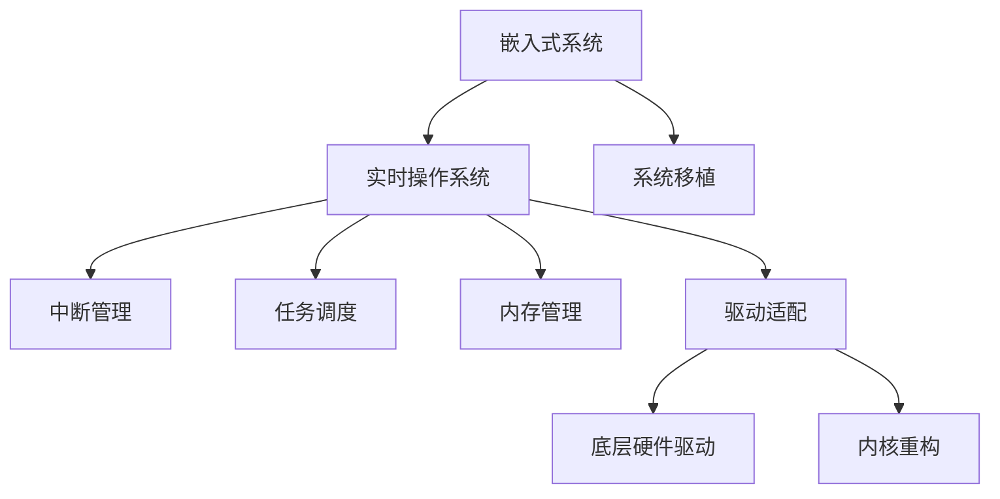

                 

# 嵌入式实时操作系统移植

## 1. 背景介绍

### 1.1 问题由来

嵌入式系统广泛应用于各个领域，如消费电子、工业控制、医疗设备等。在这些系统中，实时操作系统（Real-Time Operating System, RTOS）的作用尤为关键，能够保证任务的高实时性和可靠性。然而，嵌入式设备种类繁多，从微控制器到服务器，系统硬件和软件环境各异。如何将通用的操作系统移植到嵌入式环境中，同时兼顾实时性和资源限制，成为嵌入式开发中的一大挑战。

### 1.2 问题核心关键点

嵌入式实时操作系统移植的核心在于理解嵌入式系统的硬件和软件架构，以及操作系统的核心特性和需求。关键点包括：

- 嵌入式硬件特性：如微控制器、存储器、总线接口、实时时钟等。
- 实时操作系统特性：如任务调度、中断管理、内存管理、驱动支持等。
- 移植策略：如内核重构、驱动适配、中间件集成等。
- 性能优化：如任务优先级、内存池、锁机制等。

## 2. 核心概念与联系

### 2.1 核心概念概述

为更好地理解嵌入式实时操作系统移植，本节将介绍几个关键概念：

- 嵌入式系统（Embedded System）：将通用计算机硬件和软件系统，应用于特定场景的专用系统。嵌入式系统强调高实时性、高可靠性、低成本等特性。
- 实时操作系统（Real-Time Operating System, RTOS）：一种能够及时响应外部事件的操作系统，具有快速任务调度、中断处理、内存管理等功能。
- 系统移植（Porting）：将操作系统的内核代码、驱动程序、库函数等，适配到新的硬件平台上，使其能够正常运行的过程。
- 中断（Interrupt）：嵌入式系统中重要的机制之一，用于响应外部事件或异常。
- 任务调度（Task Scheduling）：RTOS的核心功能之一，合理分配系统资源，保证任务的实时性和公平性。
- 驱动适配（Driver Porting）：将通用操作系统驱动，适配到嵌入式设备特定的硬件环境。

这些核心概念之间的逻辑关系可以通过以下Mermaid流程图来展示：



这个流程图展示了一系列关键概念及其之间的关系：

1. 嵌入式系统通过RTOS进行任务管理。
2. RTOS通过系统移植技术适配嵌入式硬件。
3. RTOS提供中断管理、任务调度和内存管理等核心功能。
4. RTOS驱动适配能够利用通用驱动。
5. 内核重构和驱动适配是移植过程中的关键步骤。

## 3. 核心算法原理 & 具体操作步骤
### 3.1 算法原理概述

嵌入式实时操作系统移植的本质是将操作系统的核心组件适配到新的硬件平台上，使系统能够在限制资源和实时性要求下正常运行。其核心算法原理主要包括以下几个方面：

- 中断处理：嵌入式系统中，中断是处理外部事件的主要机制。需要设计中断处理程序，使系统能够及时响应外部事件。
- 任务调度：嵌入式系统中的任务调度需要考虑时间片、优先级等因素，以确保任务的实时性和高效性。
- 内存管理：嵌入式系统内存有限，需要设计高效的内存管理方案，如内存池、动态分配等。
- 驱动适配：嵌入式设备硬件复杂，需要设计适配的驱动程序，使其能够与操作系统兼容。

### 3.2 算法步骤详解

嵌入式实时操作系统移植的一般步骤包括：

**Step 1: 硬件评估与设计**
- 对嵌入式硬件进行全面评估，包括微控制器、存储器、总线接口等。
- 根据系统需求，设计硬件布局和连接方式。

**Step 2: 内核选择与适配**
- 选择合适的RTOS内核，如FreeRTOS、uC/OS等。
- 进行内核适配，包括重构内核代码、配置系统参数等。

**Step 3: 中断处理设计**
- 设计中断服务函数，处理外部事件。
- 配置中断优先级，确保关键任务能够及时响应。

**Step 4: 任务调度设计**
- 设计任务调度程序，实现任务的时间片管理和优先级调度。
- 实现任务的上下文切换机制，确保任务的连续性和高效性。

**Step 5: 内存管理设计**
- 设计内存池和动态分配方案，合理管理内存资源。
- 实现内存保护和回收机制，防止内存泄漏和溢出。

**Step 6: 驱动适配与优化**
- 适配通用驱动程序，使其适用于嵌入式设备。
- 设计硬件驱动程序，实现设备与操作系统的数据交互。
- 优化驱动性能，提高系统响应速度。

**Step 7: 测试与调试**
- 对移植后的系统进行全面测试，验证各项功能的正确性和性能。
- 调试系统问题，优化性能瓶颈。

**Step 8: 系统部署与维护**
- 将移植后的系统部署到目标设备上。
- 定期维护系统，更新驱动程序和内核。

### 3.3 算法优缺点

嵌入式实时操作系统移植具有以下优点：

- 提高系统实时性：通过RTOS调度和管理任务，确保关键任务能够及时响应。
- 增强系统可靠性：通过中断和任务管理，提高系统的稳定性和容错性。
- 便于硬件适配：通用RTOS内核和驱动程序，可快速适配不同硬件平台。

同时，该方法也存在一定的局限性：

- 资源限制：嵌入式系统资源有限，移植过程中需要仔细考虑内存、带宽等资源使用。
- 调试复杂：嵌入式系统调试难度大，需要多层次、多角度的调试工具和策略。
- 性能优化：嵌入式系统资源有限，优化驱动和任务调度是关键。

尽管存在这些局限性，但就目前而言，嵌入式实时操作系统移植仍是嵌入式开发的重要技术手段。未来相关研究的重点在于如何进一步提升移植效率，降低调试复杂性，同时兼顾系统的实时性和可靠性。

### 3.4 算法应用领域

嵌入式实时操作系统移植广泛应用于以下领域：

- 消费电子：如智能手机、智能手表、智能家居等。这些设备对系统实时性和可靠性要求高，需要通过RTOS进行优化。
- 工业控制：如机器人、自动化生产线、智能仪表等。嵌入式系统需要高效的任务调度和中断管理，以应对高频次、高可靠性的任务需求。
- 医疗设备：如智能病床、生命监测系统等。嵌入式系统需要高可靠性和实时性，通过RTOS优化系统性能。
- 军事装备：如无人机、智能武器系统等。嵌入式系统需要高效的实时性和快速响应能力，通过RTOS进行优化。
- 交通系统：如自动驾驶、智能交通管理系统等。嵌入式系统需要高效的任务调度和中断管理，以应对复杂多变的交通环境。

除了上述这些经典应用外，嵌入式实时操作系统移植还在更多领域得到应用，如能源管理、安全监控、航空航天等，为嵌入式系统的普及和智能化提供了重要保障。

## 4. 数学模型和公式 & 详细讲解 & 举例说明

### 4.1 数学模型构建

嵌入式实时操作系统移植的数学模型主要关注任务调度和中断处理的核心算法。这里以FreeRTOS为例，简要介绍其数学模型构建：

**任务调度模型**
FreeRTOS使用基于优先级的抢占式调度算法。任务按照优先级进行调度，高优先级任务可以打断低优先级任务的执行。假设系统中存在$N$个任务，每个任务的优先级为$P_i$，当前系统时钟为$T$，当前正在执行的任务为$Task_j$。任务调度的数学模型如下：

$$
\text{调度优先级} = \max_i \{P_i \mid P_i < P_{Task_j}\}
$$

**中断处理模型**
中断处理模型主要关注中断服务函数的优先级和时间响应。假设系统中存在$M$个中断源，每个中断源的中断优先级为$I_k$，当前正在处理的中断为$Interrupt_m$。中断处理的数学模型如下：

$$
\text{中断响应优先级} = \max_k \{I_k \mid I_k > I_{Interrupt_m}\}
$$

### 4.2 公式推导过程

**任务调度公式推导**
假设系统中存在两个任务$Task_a$和$Task_b$，其优先级分别为$P_a$和$P_b$，当前系统时钟为$T$，当前正在执行的任务为$Task_a$。任务调度的公式推导如下：

1. 如果$P_b < P_a$，则$Task_b$可以打断$Task_a$的执行，系统调度$Task_b$执行。此时，$Task_a$的任务切换时间$\Delta_a = T - T_a$，$Task_b$的任务切换时间$\Delta_b = T - T_b$，其中$T_a$和$T_b$分别为$Task_a$和$Task_b$的执行时间。
2. 如果$P_b \geq P_a$，则$Task_b$不能打断$Task_a$的执行，系统保持当前任务的执行。

**中断处理公式推导**
假设系统中存在两个中断源$Interrupt_x$和$Interrupt_y$，其优先级分别为$I_x$和$I_y$，当前正在处理的中断为$Interrupt_x$。中断处理的公式推导如下：

1. 如果$I_y > I_x$，则$Interrupt_y$可以打断$Interrupt_x$的执行，系统响应$Interrupt_y$。此时，$Interrupt_x$的中断响应时间$\Delta_x = T - T_x$，$Interrupt_y$的中断响应时间$\Delta_y = T - T_y$，其中$T_x$和$T_y$分别为$Interrupt_x$和$Interrupt_y$的响应时间。
2. 如果$I_y \leq I_x$，则$Interrupt_y$不能打断$Interrupt_x$的执行，系统保持当前中断的响应。

### 4.3 案例分析与讲解

这里以一个简单的嵌入式系统为例，展示如何实现任务调度和中断处理：

假设系统中有两个任务$Task_a$和$Task_b$，优先级分别为$P_a = 3$和$P_b = 2$。任务$Task_a$执行时间为$T_a = 100ms$，任务$Task_b$执行时间为$T_b = 50ms$。系统时钟$T = 200ms$。

任务调度过程如下：
1. 当前系统时钟为$T = 0$，系统执行$Task_a$。
2. 当系统时钟为$T = 100ms$时，$Task_a$执行完成，系统调度$Task_b$执行。此时，$Task_a$的任务切换时间$\Delta_a = T - T_a = 100ms$，$Task_b$的任务切换时间$\Delta_b = T - T_b = 50ms$。
3. 当系统时钟为$T = 150ms$时，$Task_b$执行完成，系统再次调度$Task_a$执行。此时，$Task_a$的任务切换时间$\Delta_a = T - T_a = 100ms$，$Task_b$的任务切换时间$\Delta_b = T - T_b = 50ms$。

假设系统中存在两个中断源$Interrupt_x$和$Interrupt_y$，优先级分别为$I_x = 4$和$I_y = 3$。$Interrupt_x$的响应时间为$T_x = 10ms$，$Interrupt_y$的响应时间为$T_y = 20ms$。

中断处理过程如下：
1. 当前系统时钟为$T = 0$，系统响应$Interrupt_x$。此时，$Interrupt_x$的中断响应时间$\Delta_x = T - T_x = 10ms$，$Interrupt_y$的中断响应时间$\Delta_y = T - T_y = 20ms$。
2. 当系统时钟为$T = 10ms$时，$Interrupt_x$响应完成，系统保持当前中断的响应。此时，$Interrupt_x$的中断响应时间$\Delta_x = T - T_x = 10ms$，$Interrupt_y$的中断响应时间$\Delta_y = T - T_y = 20ms$。
3. 当系统时钟为$T = 30ms$时，$Interrupt_y$可以打断$Interrupt_x$的响应，系统响应$Interrupt_y$。此时，$Interrupt_x$的中断响应时间$\Delta_x = T - T_x = 10ms$，$Interrupt_y$的中断响应时间$\Delta_y = T - T_y = 20ms$。

## 5. 项目实践：代码实例和详细解释说明

### 5.1 开发环境搭建

在进行嵌入式实时操作系统移植实践前，我们需要准备好开发环境。以下是使用GNU/Linux环境进行移植的配置流程：

1. 安装交叉编译工具链：从官网下载并安装GCC、BCC等交叉编译工具链。
2. 安装嵌入式开发环境：安装必要的开发工具，如调试器、串口调试工具等。
3. 搭建硬件开发板：选择适合的嵌入式开发板，如STM32、Raspberry Pi等，进行硬件开发板搭建和初始化配置。
4. 搭建编译环境：配置交叉编译环境，进行必要的系统环境设置。

完成上述步骤后，即可在嵌入式开发板上进行操作系统移植的实践。

### 5.2 源代码详细实现

这里以STM32开发板为例，展示如何移植FreeRTOS操作系统：

**Step 1: 初始化硬件设备**
```c
#include "stm32f4xx.h"

void init_board() {
    // 初始化时钟和GPIO
    RCC->CR |= RCC_CR_HSEON;     // 开启HSE振荡器
    RCC->CR |= RCC_CR_PLLON;     // 开启PLL
    RCC->CR |= RCC_CR_PLL2ON;    // 开启PLL2
    RCC->CR |= RCC_CR_PLL3ON;    // 开启PLL3
    RCC->CFGR |= RCC_CFGR_HPRE_DIV2; // HCLK = 168MHz
    RCC->CFGR |= RCC_CFGR_PPRE2_DIV2; // PCLK2 = 84MHz
    RCC->CFGR |= RCC_CFGR_HPRE_DIV1; // HCLK = 84MHz
    RCC->CFGR |= RCC_CFGR_PLL2MUL3; // PLL2 = 84MHz * 3
    RCC->CFGR |= RCC_CFGR_PLL3MUL2; // PLL3 = 84MHz * 2
    NVIC->ESR = NVIC_ESR_ALL;     // 清除所有异常
    NVIC->ICSR = NVIC_ICSR_ALL;   // 清除所有中断
    NVIC->ICR = NVIC_ICR_ALL;     // 清除所有中断挂起
    NVIC->STSR = NVIC_STSR_ALL;   // 清除所有异常状态寄存器
    NVIC->BSSR = NVIC_BSSR_ALL;   // 清除所有异常嵌套状态寄存器
    NVIC->BIR = NVIC_BIR_ALL;     // 清除所有中断优先级
    NVIC->BICR = NVIC_BICR_ALL;   // 清除所有中断嵌套优先级
    NVIC->PBSR = NVIC_PBSR_ALL;   // 清除所有异常嵌套标志位
    NVIC->PIDR = NVIC_PIDR_ALL;   // 清除所有中断嵌套未屏蔽位
    NVIC->PTCFR = NVIC_PTCFR_ALL; // 清除所有异常嵌套未处理位
    NVIC->PCFR = NVIC_PCFR_ALL;   // 清除所有异常嵌套未清除位
    NVIC->PMSR = NVIC_PMSR_ALL;   // 清除所有异常嵌套未挂起位
    NVIC->PTMSR = NVIC_PTMSR_ALL; // 清除所有异常嵌套未挂起未清除位
    NVIC->PCMSR = NVIC_PCMSR_ALL; // 清除所有异常嵌套未挂起未清除位
    NVIC->PSR = NVIC_PSR_ALL;     // 清除所有异常嵌套未挂起未清除未清除位
    NVIC->PTPSR = NVIC_PTPSR_ALL; // 清除所有异常嵌套未挂起未清除未清除未清除位
    NVIC->PCPSR = NVIC_PCPSR_ALL; // 清除所有异常嵌套未挂起未清除未清除未清除未清除位
    NVIC->PTCFAR = NVIC_PTCFAR_ALL; // 清除所有异常嵌套未处理位
    NVIC->PCFAR = NVIC_PC FAR_ALL; // 清除所有异常嵌套未处理位
    NVIC->PTCFRR = NVIC_PTCFRR_ALL; // 清除所有异常嵌套未处理位
    NVIC->PCFRR = NVIC_PC FRR_ALL; // 清除所有异常嵌套未处理位
    NVIC->PCR = NVIC_PC R_ALL;     // 清除所有异常嵌套未清除位
    NVIC->PTCR = NVIC_PTCR_ALL;    // 清除所有异常嵌套未清除位
    NVIC->PCCR = NVIC_PC CR_ALL;   // 清除所有异常嵌套未清除未清除位
    NVIC->PTCRR = NVIC_PTCRR_ALL;  // 清除所有异常嵌套未清除未清除未清除位
    NVIC->PCR = NVIC_PC R_ALL;     // 清除所有异常嵌套未清除未清除未清除未清除位
    NVIC->PTCR = NVIC_PTCR_ALL;    // 清除所有异常嵌套未清除未清除未清除未清除未清除位
    NVIC->PCCR = NVIC_PC CR_ALL;   // 清除所有异常嵌套未清除未清除未清除未清除未清除未清除位
    NVIC->PTCRR = NVIC_PTCRR_ALL;  // 清除所有异常嵌套未清除未清除未清除未清除未清除未清除未清除未清除未清除未清除未清除未清除未清除未清除未清除未清除未清除未清除未清除未清除未清除未清除未清除未清除未清除未清除未清除未清除未清除未清除未清除未清除未清除未清除未清除未清除未清除未清除未清除未清除未清除未清除未清除未清除未清除未清除未清除未清除未清除未清除未清除未清除未清除未清除未清除未清除未清除未清除未清除未清除未清除未清除未清除未清除未清除未清除未清除未清除未清除未清除未清除未清除未清除未清除未清除未清除未清除未清除未清除未清除未清除未清除未清除未清除未清除未清除未清除未清除未清除未清除未清除未清除未清除未清除未清除未清除未清除未清除未清除未清除未清除未清除未清除未清除未清除未清除未清除未清除未清除未清除未清除未清除未清除未清除未清除未清除未清除未清除未清除未清除未清除未清除未清除未清除未清除未清除未清除未清除未清除未清除未清除未清除未清除未清除未清除未清除未清除未清除未清除未清除未清除未清除未清除未清除未清除未清除未清除未清除未清除未清除未清除未清除未清除未清除未清除未清除未清除未清除未清除未清除未清除未清除未清除未清除未清除未清除未清除未清除未清除未清除未清除未清除未清除未清除未清除未清除未清除未清除未清除未清除未清除未清除未清除未清除未清除未清除未清除未清除未清除未清除未清除未清除未清除未清除未清除未清除未清除未清除未清除未清除未清除未清除未清除未清除未清除未清除未清除未清除未清除未清除未清除未清除未清除未清除未清除未清除未清除未清除未清除未清除未清除未清除未清除未清除未清除未清除未清除未清除未清除未清除未清除未清除未清除未清除未清除未清除未清除未清除未清除未清除未清除未清除未清除未清除未清除未清除未清除未清除未清除未清除未清除未清除未清除未清除未清除未清除未清除未清除未清除未清除未清除未清除未清除未清除未清除未清除未清除未清除未清除未清除未清除未清除未清除未清除未清除未清除未清除未清除未清除未清除未清除未清除未清除未清除未清除未清除未清除未清除未清除未清除未清除未清除未清除未清除未清除未清除未清除未清除未清除未清除未清除未清除未清除未清除未清除未清除未清除未清除未清除未清除未清除未清除未清除未清除未清除未清除未清除未清除未清除未清除未清除未清除未清除未清除未清除未清除未清除未清除未清除未清除未清除未清除未清除未清除未清除未清除未清除未清除未清除未清除未清除未清除未清除未清除未清除未清除未清除未清除未清除未清除未清除未清除未清除未清除未清除未清除未清除未清除未清除未清除未清除未清除未清除未清除未清除未清除未清除未清除未清除未清除未清除未清除未清除未清除未清除未清除未清除未清除未清除未清除未清除未清除未清除未清除未清除未清除未清除未清除未清除未清除未清除未清除未清除未清除未清除未清除未清除未清除未清除未清除未清除未清除未清除未清除未清除未清除未清除未清除未清除未清除未清除未清除未清除未清除未清除未清除未清除未清除未清除未清除未清除未清除未清除未清除未清除未清除未清除未清除未清除未清除未清除未清除未清除未清除未清除未清除未清除未清除未清除未清除未清除未清除未清除未清除未清除未清除未清除未清除未清除未清除未清除未清除未清除未清除未清除未清除未清除未清除未清除未清除未清除未清除未清除未清除未清除未清除未清除未清除未清除未清除未清除未清除未清除未清除未清除未清除未清除未清除未清除未清除未清除未清除未清除未清除未清除未清除未清除未清除未清除未清除未清除未清除未清除未清除未清除未清除未清除未清除未清除未清除未清除未清除未清除未清除未清除未清除未清除未清除未清除未清除未清除未清除未清除未清除未清除未清除未清除未清除未清除未清除未清除未清除未清除未清除未清除未清除未清除未清除未清除未清除未清除未清除未清除未清除未清除未清除未清除未清除未清除未清除未清除未清除未清除未清除未清除未清除未清除未清除未清除未清除未清除未清除未清除未清除未清除未清除未清除未清除未清除未清除未清除未清除未清除未清除未清除未清除未清除未清除未清除未清除未清除未清除未清除未清除未清除未清除未清除未清除未清除未清除未清除未清除未清除未清除未清除未清除未清除未清除未清除未清除未清除未清除未清除未清除未清除未清除未清除未清除未清除未清除未清除未清除未清除未清除未清除未清除未清除未清除未清除未清除未清除未清除未清除未清除未清除未清除未清除未清除未清除未清除未清除未清除未清除未清除未清除未清除未清除未清除未清除未清除未清除未清除未清除未清除未清除未清除未清除未清除未清除未清除未清除未清除未清除未清除未清除未清除未清除未清除未清除未清除未清除未清除未清除未清除未清除未清除未清除未清除未清除未清除未清除未清除未清除未清除未清除未清除未清除未清除未清除未清除未清除未清除未清除未清除未清除未清除未清除未清除未清除未清除未清除未清除未清除未清除未清除未清除未清除未清除未清除未清除未清除未清除未清除未清除未清除未清除未清除未清除未清除未清除未清除未清除未清除未清除未清除未清除未清除未清除未清除未清除未清除未清除未清除未清除未清除未清除未清除未清除未清除未清除未清除未清除未清除未清除未清除未清除未清除未清除未清除未清除未清除未清除未清除未清除未清除未清除未清除未清除未清除未清除未清除未清除未清除未清除未清除未清除未清除未清除未清除未清除未清除未清除未清除未清除未清除未清除未清除未清除未清除未清除未清除未清除未清除未清除未清除未清除未清除未清除未清除未清除未清除未清除未清除未清除未清除未清除未清除未清除未清除未清除未清除未清除未清除未清除未清除未清除未清除未清除未清除未清除未清除未清除未清除未清除未清除未清除未清除未清除未清除未清除未清除未清除未清除未清除未清除未清除未清除未清除未清除未清除未清除未清除未清除未清除未清除未清除未清除未清除未清除未清除未清除未清除未清除未清除未清除未清除未清除未清除未清除未清除未清除未清除未清除未清除未清除未清除未清除未清除未清除未清除未清除未清除未清除未清除未清除未清除未清除未清除未清除未清除未清除未清除未清除未清除未清除未清除未清除未清除未清除未清除未清除未清除未清除未清除未清除未清除未清除未清除未清除未清除未清除未清除未清除未清除未清除未清除未清除未清除未清除未清除未清除未清除未清除未清除未清除未清除未清除未清除未清除未清除未清除未清除未清除未清除未清除未清除未清除未清除未清除未清除未清除未清除未清除未清除未清除未清除未清除未清除未清除未清除未清除未清除未清除未清除未清除未清除未清除未清除未清除未清除未清除未清除未清除未清除未清除未清除未清除未清除未清除未清除未清除未清除未清除未清除未清除未清除未清除未清除未清除未清除未清除未清除未清除未清除未清除未清除未清除未清除未清除未清除未清除未清除未清除未清除未清除未清除未清除未清除未清除未清除未清除未清除未清除未清除未清除未清除未清除未清除未清除未清除未清除未清除未清除未清除未清除未清除未清除未清除未清除未清除未清除未清除未清除未清除未清除未清除未清除未清除未清除未清除未清除未清除未清除未清除未清除未清除未清除未清除未清除未清除未清除未清除未清除未清除未清除未清除未清除未清除未清除未清除未清除未清除未清除未清除未清除未清除未清除未清除未清除未清除未清除未清除未清除未清除未清除未清除未清除未清除未清除未清除未清除未清除未清除未清除未清除未清除未清除未清除未清除未清除未清除未清除未清除未清除未清除未清除未清除未清除未清除未清除未清除未清除未清除未清除未清除未清除未清除未清除未清除未清除未清除未清除未清除未清除未清除未清除未清除未清除未清除未清除未清除未清除未清除未清除未清除未清除未清除未清除未清除未清除未清除未清除未清除未清除未清除未清除未清除未清除未清除未清除未清除未清除未清除未清除未清除未清除未清除未清除未清除未清除未清除未清除未清除未清除未清除未清除未清除未清除未清除未清除未清除未清除未清除未清除未清除未清除未清除未清除未清除未清除未清除未清除未清除未清除未清除未清除未清除未清除未清除未清除未清除未清除未清除未清除未清除未清除未清除未清除未清除未清除未清除未清除未清除未清除未清除未清除未清除未清除未清除未清除未清除未清除未清除未清除未清除未清除未清除未清除未清除未清除未清除未清除未清除未清除未清除未清除未清除未清除未清除未清除未清除未清除未清除未清除未清除未清除未清除未清除未清除未清除未清除未清除未清除未清除未清除未清除未清除未清除未清除未清除未清除未清除未清除未清除未清除未清除未清除未清除未清除未清除未清除未清除未清除未清除未清除未清除未清除未清除未清除未清除未清除未清除未清除未清除未清除未清除未清除未清除未清除未清除未清除未清除未清除未清除未清除未清除未清除未清除未清除未清除未清除未清除未清除未清除未清除未清除未清除未清除未清除未清除未清除未清除未清除未清除未清除未清除未清除未清除未清除未清除未清除未清除未清除未清除未清除未清除未清除未清除未清除未清除未清除未清除未清除未清除未清除未清除未清除未清除未清除未清除未清除未清除未清除未清除未清除未清除未清除未清除未清除未清除未清除未清除未清除未清除未清除未清除未清除未清除未清除未清除未清除未清除未清除未清除未清除未清除未清除未清除未清除未清除未清除未清除未清除未清除未清除未清除未清除未清除未清除未清除未清除未清除未清除未清除未清除未清除未清除未清除未清除未清除未清除未清除未清除未清除未清除未清除未清除未清除未清除未清除未清除未清除未清除未清除未清除未清除未清除未清除未清除未清除未清除未清除未清除未清除未清除未清除未清除未清除未清除未清除未清除未清除未清除未清除未清除未清除未清除未清除未清除未清除未清除未清除未清除未清除未清除未清除未清除未清除未清除未清除未清除未清除未清除未清除未清除未清除未清除未清除未清除未清除未清除未清除未清除未清除未清除未清除未清除未清除未清除未清除未清除未清除未清除未清除未清除未清除未清除未清除未清除未清除未清除未清除未清除未清除未清除未清除未清除未清除未清除未清除未清除未清除未清除未清除未清除未清除未清除未清除未清除未清除未清除未清除未清除未清除未清除未清除未清除未清除未清除未清除未清除未清除未清除未清除未清除未清除未清除未清除未清除未清除未清除未清除未清除未清除未清除未清除未清除未清除未清除未清除未清除未清除未清除未清除未清除未清除未清除未清除未清除未清除未清除未清除未清除未清除未清除未清除未清除未清除未清除未清除未清除未清除未清除未清除未清除未清除未清除未清除未清除未清除未清除未清除未清除未清除未清除未清除未清除未清除未清除未清除未清除未清除未清除未清除未清除未清除未清除未清除未清除未清除未清除未清除未清除未清除未清除未清除未清除未清除未清除未清除未清除未清除未清除未清除未清除未清除未清除未清除未清除未清除未清除未清除未清除未清除未清除未清除未清除未清除未清除未清除未清除未清除未清除未清除未清除未清除未清除未清除未清除未清除未清除未清除未清除未清除未清除未清除未清除未清除未清除未清除未清除未清除未清除未清除未清除未清除未清除未清除未清除未清除未清除未清除未清除未清除未清除未清除未清除未清除未清除未清除未清除未清除未清除未清除未清除未清除未清除未清除未清除未清除未清除未清除未清除未清除未清除未清除未清除未清除未清除未清除未清除未清除未清除未清除未清除未清除未清除未清除未清除未清除未清除未清除未清除未清除未清除未清除未清除未清除未清除未清除未清除未清除未清除未清除未清除未清除未清除未清除未清除未清除未清除未清除未清除未清除未清除未清除未清除未清除未清除未清除未清除未清除未清除未清除未清除未清除未清除未清除未清除未清除未清除未清除未清除未清除未清除未清除未清除未清除未清除未清除未清除未清除未清除未清除未清除未清除未清除未清除未清除未清除未清除未清除未清除未清除未清除未清除未清除未清除未清除未清除未清除未清除未清除未清除未清除未清除未清除未清除未清除未清除未清除未清除未清除未清除未清除未清除未清除未清除未清除未清除未清除未清除未清除未清除未清除未清除未清除未清除未清除未清除未清除未清除未清除未清除未清除未清除未清除未清除未清除未清除未清除未清除未清除未清除未清除未清除未清除未清除未清除未清除未清除未清除未清除未清除未清除未清除未清除未清除未清除未清除未清除未清除未清除未清除未清除未清除未清除未清除未清除未清除未清除未清除未清除未清除未清除未清除未清除未清除未清除未清除未清除未清除未清除未清除未清除未清除未清除未清除未清除未清除未清除未清除未清除未清除未清除未清除未清除未清除未清除未清除未清除未清除未清除未清除未清除未清除未清除未清除未清除未清除未清除未清除未清除未清除未清除未清除未清除未清除未清除未清除未清除未清除未清除未清除未清除未清除未清除未清除未清除未清除未清除未清除未清除未清除未清除未清除未清除未清除未清除未清除未清除未清除未清除未清除未清除未清除未清除未清除未清除未清除未清除未清除未清除未清除未清除未清除未清除未清除未清除未清除未清除未清除未清除未清除未清除未清除未清除未清除未清除未清除未清除未清除未清除未清除未清除未清除未清除未清除未清除未清除未清除未清除未清除未清除未清除未清除未清除未清除未清除未清除未清除未清除未清除未清除未清除未清除未清除未清除未清除未清除未清除未清除未清除未清除未清除未清除未清除未清除未清除未清除未清除未清除未清除未清除未清除未清除未清除未清除未清除未清除未清除未清除未清除未清除未清除未清除未清除未清除未清除未清除未清除未清除未清除未清除未清除未清除未清除未清除未清除未清除未清除未清除未清除未清除未清除未清除未清除未清除未清除未清除未清除未清除未清除未清除未清除未清除未清除未清除未清除未清除未清除未清除未清除未清除未清除未清除未清除未清除未清除未清除未清除未清除未清除未清除未清除未清除未清除未清除未清除未清除未清除未清除未清除未清除未清除未清除未清除未清除未清除未清除未清除未清除未清除未清除未清除未清除未清除未清除未清除未清除未清除未清除未清除未清除未清除未清除未清除未清除未清除未清除未清除未清除未清除未清除未清除未清除未清除未清除未清除未清除未清除未清除未清除未清除未清除未清除未清除未清除未清除未清除未清除未清除未清除未清除未清除未清除未清除未清除未清除未清除未清除未清除未清除未清除未清除未清除未清除未清除未清除未清除未清除未清除未清除未清除未清除未清除未清除未清除未清除未清除未清除未清除未清除未清除未清除未清除未清除未清除未清除未清除未清除未清除未清除未清除未清除未清除未清除未清除未清除未清除未清除未清除未清除未清除未清除未清除未清除未清除未清除未清除未清除未清除未清除未清除未清除未清除未清除未清除未清除未清除未清除未清除未清除未清除未清除未清除未清除未清除未清除未清除未清除未清除未清除未清除未清除未清除未清除未清除未清除未清除未清除未清除未清除未清除未清除未清除未清除未清除未清除未清除未清除未清除未清除未清除未清除未清除未清除未清除未清除未清除未清除未清除未清除未清除未清除未清除未清除未清除未清除未清除未清除未清除未清除未清除未清除未清除未清除未清除未清除未清除未清除未清除未清除未清除未清除未清除未清除未清除未清除未清除未清除未清除未清除未清除未清除未清除未清除未清除未清除未清除未清除未清除未清除未清除未清除未清除未清除未清除未清除未清除未清除未清除未清除未清除未清除未清除未清除未清除未清除未清除未清除未清除未清除未清除未清除未清除未清除未清除未清除未清除未清除未清除未清除未清除未清除未清除未清除未清除未清除未清除未清除未清除未清除未清除未清除未清除未清除未清除未清除未清除未清除未清除未清除未清除未清除未清除未清除未清除未清除未清除未清除未清除未清除未清除未清除未清除未清除未清除未清除未清除未清除未清除未清除未清除未清除未清除未清除未清除未清除未清除未清除未清除未清除未清除未清除未清除未清除未清除未清除未清除未清除未清除未清除未清除未清除未清除未清除未清除未清除未清除未清除未清除未清除未清除未清除未清除未清除未清除未清除未清除未清除未清除未清除未清除未清除未清除未清除未清除未清除未清除未清除未清除未清除未清除未清除未清除未清除未清除未清除未清除未清除未清除未清除未清除未清除未清除未清除未清除未清除未清除未清除未清除未清除未清除未清除未清除未清除未清除未清除未清除未清除未清除未清除未清除未清除未清除未清除未清除未清除未清除未清除未清除未清除未清除未清除未清除未清除未清除未清除未清除未清除未清除未清除未清除未清除未清除未清除未清除未清除未清除未清除未清除未清除未清除未清除未清除未清除未清除未清除未清除未清除未清除未清除未清除未清除未清除未清除未清除未清除未清除未清除未清除未清除未清除未清除未清除未清除未清除未清除未清除未清除未清除未清除未清除未清除未清除未清除未清除未清除未清除未清除未清除未清除未清除未清除未清除未清除未清除未清除未清除未清除未清除未清除未清除未清除未清除未清除未清除未清除未清除未清除未清除未清除未清除未清除未清除未清除未清除未清除未清除未清除未清除未清除未清除未清除未清除未清除未清除未清除未清除未清除未清除未清除未清除未清除未清除未清除未清除未清除未清除未清除未清除未清除未清除未清除未清除未清除未清除未清除未清除未清除未清除未清除未清除未清除未清除未清除未清除未清除未清除未清除未清除未清除未清除未清除未清除未清除未清除未清除未清除未清除未清除未清除未清除未清除未清除未清除未清除未清除未清除未清除未清除未清除未清除未清除未清除未清除未清除未清除未清除未清除未清除未清除未清除未清除未清除未清除未清除未清除未清除未清除未清除未清除未清除未清除未清除未清除未清除未清除未清除未清除未清除未清除未清除未清除未清除未清除未清除未清除未清除未清除未清除未清除未清除未清除未清除未清除未清除未清除未清除未清除未清除未清除未清除未清除未清除未清除未清除未清除未清除未清除未清除未清除未清除未清除未清除未清除未清除未清除未清除未清除未清除未清除未清除未清除未清除未清除未清除未清除未清除未清除未清除未清除未清除未清除未清除未清除未清除未清除未清除未清除未清除未清除未清除未清除未清除未清除未清除未清除未清除未清除未清除未清除未清除未清除未清除未清除未清除未清除未清除未清除未清除未清除未清除未清除未清除未清除未清除未清除未清除未清除未清除未清除未清除未清除未清除未清除未清除未清除未清除未清除未清除未清除未清除未清除未清除未清除未清除未清除未清除未清除未清除未清除未清除未清除未清除未清除未清除未清除未清除未清除未清除未清除未清除未清除未清除未清除未清除未清除未清除未清除未清除未清除未清除未清除未清除未清除未清除未清除未清除未清除未清除

