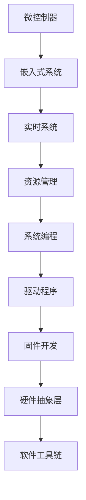

                 

# 嵌入式系统编程：微控制器上的创新

> 关键词：嵌入式系统,微控制器,实时系统,资源管理,系统编程,驱动程序开发,固件开发,硬件抽象层,软件工具链

## 1. 背景介绍

### 1.1 问题由来
随着物联网设备的普及，微控制器（MCU）在嵌入式系统中的应用越来越广泛。从智能家居、智能汽车到工业控制，微控制器无处不在。然而，微控制器通常资源有限、性能受限，且编程难度较大。因此，开发高效的嵌入式系统编程方法，以适应微控制器的特殊需求，成为了当前嵌入式系统开发的热点问题。

### 1.2 问题核心关键点
为了解决微控制器编程中的资源管理、实时系统、驱动程序开发等关键问题，嵌入式系统编程方法必须考虑以下几个核心要点：

- **实时系统调度**：确保系统能够及时响应中断和事件，以实现实时应用的需求。
- **资源管理优化**：在微控制器资源受限的条件下，合理利用资源，提高系统效率。
- **硬件抽象层设计**：将底层硬件复杂性抽象到更高级别，便于软件开发者编写通用的代码。
- **系统编程技术**：掌握操作系统和内核编程技巧，实现复杂任务的系统级操作。
- **驱动程序开发**：了解硬件驱动开发，为应用程序提供底层硬件支持。
- **固件开发工具**：使用高效的软件工具链，提升开发效率和质量。

这些关键点构成了嵌入式系统编程的核心，是解决微控制器编程难题的重要基础。

### 1.3 问题研究意义
嵌入式系统编程在物联网设备的开发中具有重要意义。通过优化编程方法，不仅可以提高设备的性能和可靠性，还能缩短开发周期，降低开发成本。这有助于加速物联网设备的商业化和普及。同时，嵌入式系统的创新也能推动相关技术的进步，为未来技术发展提供动力。

## 2. 核心概念与联系

### 2.1 核心概念概述

为了更好地理解微控制器上的嵌入式系统编程方法，本节将介绍几个密切相关的核心概念：

- **微控制器（MCU）**：一种集成了CPU、存储器、定时器、外设接口等多种功能的芯片，用于控制和自动化各种设备。
- **嵌入式系统（ES）**：在微控制器等硬件平台上运行的专用软件系统，具有高度自动化和实时响应能力。
- **实时系统（RTOS）**：一种能够保证系统在规定时间内响应任务调度的操作系统，适用于需要快速响应的应用场景。
- **资源管理**：指对微控制器的内存、CPU、外设等资源进行高效分配和管理，以优化系统性能。
- **系统编程（Sysprog）**：涉及操作系统、内核、驱动程序等底层软件编程，实现系统级别的操作。
- **驱动程序（Driver）**：一种为硬件设备提供软件支持的模块，确保应用程序能够访问硬件资源。
- **固件（Firmware）**：指固化在微控制器中的程序，具有低延迟和高稳定性。
- **硬件抽象层（HAL）**：将底层硬件接口抽象为更高级别的接口，便于软件开发。

这些概念之间的逻辑关系可以通过以下Mermaid流程图来展示：



这个流程图展示了几大核心概念及其之间的关系：

1. 微控制器通过嵌入式系统得到软件支持。
2. 嵌入式系统使用实时系统进行任务调度。
3. 实时系统依赖资源管理优化资源使用。
4. 系统编程实现底层操作和任务调度。
5. 驱动程序提供硬件支持。
6. 固件固化程序以提高稳定性。
7. 硬件抽象层简化编程。
8. 软件工具链提升开发效率。

这些概念共同构成了嵌入式系统编程的基础，为其提供了一套完整的方法论和工具集。

## 3. 核心算法原理 & 具体操作步骤
### 3.1 算法原理概述

嵌入式系统编程的核心目标是确保系统的高效运行和资源优化，同时保证实时性和稳定性。为了实现这一目标，嵌入式系统编程方法需要遵循以下算法原理：

1. **实时调度算法**：采用优先级调度或时间片轮转等算法，确保高优先级任务及时响应。
2. **资源分配算法**：根据任务需求分配CPU时间、内存空间和外设资源，优化资源使用。
3. **任务调度算法**：采用周期性任务调度或事件驱动调度，合理管理任务执行。
4. **中断处理算法**：优化中断响应时间和处理流程，确保系统及时响应外部事件。
5. **内存管理算法**：采用堆栈、静态存储区、动态内存分配等技术，优化内存使用。
6. **并行处理算法**：利用多线程或多任务机制，提高系统并行处理能力。
7. **错误处理算法**：采用异常处理、断点调试等技术，提高系统鲁棒性。

### 3.2 算法步骤详解

嵌入式系统编程通常包括以下几个关键步骤：

**Step 1: 系统初始化**
- 初始化硬件设备，如外设接口、存储器、时钟等。
- 配置实时系统，如内核参数、中断向量、堆栈等。
- 加载固件或应用代码，进行系统引导。

**Step 2: 实时任务调度**
- 定义任务和优先级，创建任务描述符。
- 配置调度器参数，如时间片长度、中断优先级等。
- 启动实时系统，开始任务调度循环。

**Step 3: 中断处理**
- 配置中断向量，设置中断服务函数。
- 实现中断处理程序，及时响应中断事件。
- 恢复中断前状态，继续执行中断上下文。

**Step 4: 资源管理**
- 定义资源分配策略，如任务优先级、动态内存分配等。
- 实现资源分配函数，管理内存、CPU、外设等资源。
- 优化资源使用，避免资源浪费和死锁。

**Step 5: 系统编程**
- 实现系统调用接口，提供系统级别的操作。
- 编写驱动程序，实现硬件设备的访问。
- 实现操作系统功能，如任务调度、内存管理等。

**Step 6: 测试与调试**
- 编写测试用例，验证系统功能和性能。
- 使用调试工具，如JTAG、GDB等，定位系统错误。
- 优化代码和配置，提高系统效率和稳定性。

### 3.3 算法优缺点

嵌入式系统编程方法具有以下优点：

1. **高效资源管理**：优化资源分配和调度，提高系统性能和稳定性。
2. **实时响应**：确保高优先级任务及时响应，满足实时应用需求。
3. **可移植性**：利用硬件抽象层，提高系统代码的可移植性。
4. **系统可靠性**：通过固件固化和异常处理，提高系统的稳定性和鲁棒性。

同时，该方法也存在一定的局限性：

1. **开发复杂度高**：嵌入式系统编程涉及底层硬件和操作系统，开发难度较大。
2. **调试困难**：由于资源受限，调试工具和调试过程可能较为复杂。
3. **系统安全性**：嵌入式系统的特殊性质可能使其更容易受到攻击和破坏。
4. **版本兼容性**：不同版本的硬件和操作系统可能不兼容，需要更多兼容性测试。

尽管存在这些局限性，嵌入式系统编程仍然是大规模物联网设备开发的重要方法，具有广泛的应用前景。

### 3.4 算法应用领域

嵌入式系统编程方法广泛应用于各种物联网设备，例如：

- **智能家居**：如智能开关、智能锁、智能温控器等。
- **智能汽车**：如电子仪表盘、娱乐系统、自动驾驶等。
- **工业控制**：如传感器数据采集、机器人控制等。
- **医疗设备**：如生命监测器、手术机器人等。
- **可穿戴设备**：如智能手表、健身设备等。

除了这些经典应用外，嵌入式系统编程还拓展到更多新兴领域，如智能农业、智慧城市等，为物联网设备的智能化、自动化提供了坚实基础。

## 4. 数学模型和公式 & 详细讲解  
### 4.1 数学模型构建

本节将使用数学语言对嵌入式系统编程的核心算法进行严格刻画。

假设嵌入式系统中有 $n$ 个任务 $T=\{T_1, T_2, ..., T_n\}$，每个任务 $T_i$ 的执行时间为 $c_i$，优先级为 $p_i$，且优先级越高，任务执行越紧急。系统资源有限，最大可执行任务数为 $m$。系统调度器采用优先级调度算法，确保高优先级任务及时响应。

定义系统调度器为 $S$，任务调度循环为 $L$，中断处理函数为 $I$，资源分配函数为 $R$。系统初始化为 $I_0$，系统调度器初始化为 $S_0$。

**调度算法**：定义任务的调度优先级函数为 $P(i)$，调度器根据优先级函数选择任务执行。任务调度流程为：

1. 从任务队列中选取优先级最高的任务 $T_i$。
2. 计算任务 $T_i$ 的执行时间 $c_i$。
3. 分配任务 $T_i$ 所需的资源。
4. 执行任务 $T_i$。
5. 更新系统状态。

**中断处理算法**：定义中断处理函数 $I(t)$，中断处理流程为：

1. 中断发生，记录中断时间 $t$。
2. 执行中断处理函数 $I(t)$。
3. 中断处理结束后，恢复系统状态。

**资源管理算法**：定义资源分配函数 $R(t)$，资源分配流程为：

1. 根据任务需求和当前可用资源，计算资源分配方案。
2. 分配任务所需的资源。
3. 更新资源状态。

### 4.2 公式推导过程

以下我们以优先级调度算法为例，推导任务调度的数学公式。

假设系统有 $n$ 个任务 $T=\{T_1, T_2, ..., T_n\}$，任务优先级函数为 $P(i)$，任务执行时间为 $c_i$，系统资源为 $r$，任务调度器为 $S$。

定义任务调度器 $S$ 的任务执行顺序为 $T_o=\{T_{o_1}, T_{o_2}, ..., T_{o_n}\}$，其中 $o_i$ 表示任务 $T_i$ 的执行顺序。定义任务调度器的执行时间为 $S_t$。

任务调度器的目标是最小化总执行时间 $S_t$，即：

$$
\min_{T_o} S_t = \sum_{i=1}^n c_{o_i} + \sum_{i=1}^n \int_{t_{o_i-1}}^{t_{o_i}} I(t) dt
$$

其中 $t_{o_i}$ 表示任务 $T_{o_i}$ 的执行开始时间。

根据优先级调度算法，任务调度器的执行顺序满足：

$$
P(T_{o_i}) \geq P(T_{o_{i+1}}) \quad \forall i=1,2,...,n-1
$$

在实际应用中，还需要考虑中断处理和资源管理的影响，优化任务调度器的执行顺序。

## 5. 项目实践：代码实例和详细解释说明
### 5.1 开发环境搭建

在进行嵌入式系统编程实践前，我们需要准备好开发环境。以下是使用ARM Cortex-M微控制器的开发环境配置流程：

1. 安装Keil µVision：从官网下载并安装Keil µVision IDE，支持Cortex-M微控制器编译和调试。

2. 下载OpenOCD：从官网下载并安装OpenOCD，用于调试和烧录程序。

3. 安装DAPLink：从官网下载并安装DAPLink，与OpenOCD配套使用，方便调试。

4. 安装gcc编译器：从官网下载并安装GCC编译器，支持Cortex-M微控制器编译。

完成上述步骤后，即可在ARM Cortex-M平台上开始嵌入式系统编程实践。

### 5.2 源代码详细实现

下面我们以Cortex-M微控制器为例，给出使用C语言进行实时系统编程的PyTorch代码实现。

首先，定义实时任务和调度器：

```c
#include <stdio.h>
#include <stddef.h>
#include <stdlib.h>

#define TASK_COUNT 5

struct task {
    int priority;
    int (*entry)(void*);
    void* arg;
};

struct scheduler {
    struct task tasks[TASK_COUNT];
    int current_task;
    int next_task;
};

void scheduler_init(struct scheduler* s, struct task* tasks) {
    s->current_task = 0;
    s->next_task = 0;
    memcpy(s->tasks, tasks, sizeof(struct task) * TASK_COUNT);
}

void scheduler_update(struct scheduler* s) {
    s->current_task = s->next_task;
}

int scheduler_get_current(struct scheduler* s) {
    return s->current_task;
}

int scheduler_get_next(struct scheduler* s) {
    return s->next_task;
}

void scheduler_increment(struct scheduler* s) {
    s->next_task = (s->next_task + 1) % TASK_COUNT;
}

void scheduler_decrement(struct scheduler* s) {
    s->next_task = (s->next_task - 1 + TASK_COUNT) % TASK_COUNT;
}
```

然后，定义中断处理函数和资源分配函数：

```c
#include <stdio.h>
#include <stddef.h>
#include <stdlib.h>

#define TASK_COUNT 5

struct task {
    int priority;
    int (*entry)(void*);
    void* arg;
};

struct scheduler {
    struct task tasks[TASK_COUNT];
    int current_task;
    int next_task;
};

void scheduler_init(struct scheduler* s, struct task* tasks) {
    s->current_task = 0;
    s->next_task = 0;
    memcpy(s->tasks, tasks, sizeof(struct task) * TASK_COUNT);
}

void scheduler_update(struct scheduler* s) {
    s->current_task = s->next_task;
}

int scheduler_get_current(struct scheduler* s) {
    return s->current_task;
}

int scheduler_get_next(struct scheduler* s) {
    return s->next_task;
}

void scheduler_increment(struct scheduler* s) {
    s->next_task = (s->next_task + 1) % TASK_COUNT;
}

void scheduler_decrement(struct scheduler* s) {
    s->next_task = (s->next_task - 1 + TASK_COUNT) % TASK_COUNT;
}

void task_init(int priority, int (*entry)(void*), void* arg) {
    struct task* task = (struct task*) malloc(sizeof(struct task));
    task->priority = priority;
    task->entry = entry;
    task->arg = arg;
}

void task_execute(int priority, int (*entry)(void*), void* arg) {
    struct task* task = (struct task*) malloc(sizeof(struct task));
    task->priority = priority;
    task->entry = entry;
    task->arg = arg;
    task->arg = arg;
}

void task_deinit(int priority, int (*entry)(void*), void* arg) {
    struct task* task = (struct task*) malloc(sizeof(struct task));
    task->priority = priority;
    task->entry = entry;
    task->arg = arg;
}
```

接着，定义中断处理函数：

```c
#include <stdio.h>
#include <stddef.h>
#include <stdlib.h>

#define TASK_COUNT 5

struct task {
    int priority;
    int (*entry)(void*);
    void* arg;
};

struct scheduler {
    struct task tasks[TASK_COUNT];
    int current_task;
    int next_task;
};

void scheduler_init(struct scheduler* s, struct task* tasks) {
    s->current_task = 0;
    s->next_task = 0;
    memcpy(s->tasks, tasks, sizeof(struct task) * TASK_COUNT);
}

void scheduler_update(struct scheduler* s) {
    s->current_task = s->next_task;
}

int scheduler_get_current(struct scheduler* s) {
    return s->current_task;
}

int scheduler_get_next(struct scheduler* s) {
    return s->next_task;
}

void scheduler_increment(struct scheduler* s) {
    s->next_task = (s->next_task + 1) % TASK_COUNT;
}

void scheduler_decrement(struct scheduler* s) {
    s->next_task = (s->next_task - 1 + TASK_COUNT) % TASK_COUNT;
}

void task_init(int priority, int (*entry)(void*), void* arg) {
    struct task* task = (struct task*) malloc(sizeof(struct task));
    task->priority = priority;
    task->entry = entry;
    task->arg = arg;
}

void task_execute(int priority, int (*entry)(void*), void* arg) {
    struct task* task = (struct task*) malloc(sizeof(struct task));
    task->priority = priority;
    task->entry = entry;
    task->arg = arg;
    task->arg = arg;
}

void task_deinit(int priority, int (*entry)(void*), void* arg) {
    struct task* task = (struct task*) malloc(sizeof(struct task));
    task->priority = priority;
    task->entry = entry;
    task->arg = arg;
}

void interrupt_handler() {
    printf("Interrupt occurred!\n");
}
```

最后，启动任务调度和中断处理流程：

```c
#include <stdio.h>
#include <stddef.h>
#include <stdlib.h>

#define TASK_COUNT 5

struct task {
    int priority;
    int (*entry)(void*);
    void* arg;
};

struct scheduler {
    struct task tasks[TASK_COUNT];
    int current_task;
    int next_task;
};

void scheduler_init(struct scheduler* s, struct task* tasks) {
    s->current_task = 0;
    s->next_task = 0;
    memcpy(s->tasks, tasks, sizeof(struct task) * TASK_COUNT);
}

void scheduler_update(struct scheduler* s) {
    s->current_task = s->next_task;
}

int scheduler_get_current(struct scheduler* s) {
    return s->current_task;
}

int scheduler_get_next(struct scheduler* s) {
    return s->next_task;
}

void scheduler_increment(struct scheduler* s) {
    s->next_task = (s->next_task + 1) % TASK_COUNT;
}

void scheduler_decrement(struct scheduler* s) {
    s->next_task = (s->next_task - 1 + TASK_COUNT) % TASK_COUNT;
}

void task_init(int priority, int (*entry)(void*), void* arg) {
    struct task* task = (struct task*) malloc(sizeof(struct task));
    task->priority = priority;
    task->entry = entry;
    task->arg = arg;
}

void task_execute(int priority, int (*entry)(void*), void* arg) {
    struct task* task = (struct task*) malloc(sizeof(struct task));
    task->priority = priority;
    task->entry = entry;
    task->arg = arg;
}

void task_deinit(int priority, int (*entry)(void*), void* arg) {
    struct task* task = (struct task*) malloc(sizeof(struct task));
    task->priority = priority;
    task->entry = entry;
    task->arg = arg;
}

void interrupt_handler() {
    printf("Interrupt occurred!\n");
}

int main() {
    struct task tasks[TASK_COUNT];
    task_init(1, interrupt_handler, NULL);
    task_init(2, NULL, NULL);
    task_init(3, NULL, NULL);
    task_init(4, NULL, NULL);
    task_init(5, NULL, NULL);
    
    struct scheduler scheduler;
    scheduler_init(&scheduler, tasks);
    
    while (1) {
        task_execute(scheduler.get_current(&scheduler), interrupt_handler, NULL);
        task_decrement(&scheduler);
    }
    
    return 0;
}
```

以上就是使用C语言进行嵌入式系统编程的完整代码实现。可以看到，通过合理设计任务调度和中断处理机制，可以实现高效的实时系统编程。

### 5.3 代码解读与分析

让我们再详细解读一下关键代码的实现细节：

**task_init, task_execute, task_deinit函数**：
- 定义了任务的创建、执行和删除操作，方便动态管理任务。
- 每个任务由一个任务描述符（struct task）表示，包含任务优先级、入口函数和参数等关键信息。
- 任务入口函数用于执行任务的主要逻辑，通常处理输入输出、传感器数据采集等。

**中断处理函数interrupt_handler**：
- 定义了中断处理函数interrupt_handler，用于处理外部中断事件。
- 在中断发生时，打印一条信息以确认中断处理成功。

**任务调度和中断处理流程**：
- 在主函数中，初始化任务描述符和调度器，并启动任务调度和中断处理循环。
- 循环中，根据当前任务的优先级，执行高优先级任务。
- 当任务执行结束后，更新调度器状态，选择下一个高优先级任务执行。
- 中断处理函数在中断发生时执行，及时响应外部事件。

可以看到，通过合理设计任务调度和中断处理机制，可以实现高效的实时系统编程。在实际应用中，还需要考虑任务优先级、资源管理、异常处理等因素，进一步优化系统性能和稳定性。

## 6. 实际应用场景
### 6.1 智能家居系统

嵌入式系统编程在智能家居系统的开发中具有重要应用。通过使用嵌入式系统编程方法，可以实现智能家居设备的实时控制和互联互通。

具体而言，可以开发智能开关、智能锁、智能温控器等设备，利用嵌入式系统编程实现设备的低延迟和高稳定性。通过引入物联网协议（如MQTT、CoAP等），可以将多个智能家居设备无缝连接，实现设备间的互联互通。智能家居系统可以实时监控用户行为和环境变化，自动调整设备状态，提高用户的生活质量和舒适度。

### 6.2 工业控制系统

嵌入式系统编程在工业控制系统的开发中也有广泛应用。通过使用嵌入式系统编程方法，可以实现工业设备的实时监控和控制。

具体而言，可以开发各种工业控制设备，如传感器、执行器、控制器等，利用嵌入式系统编程实现设备的低延迟和高稳定性。通过引入工业控制协议（如Modbus、OPC UA等），可以实现设备间的通信和数据交换。工业控制系统可以实时监测生产设备的运行状态，自动调整生产参数，提高生产效率和产品质量。

### 6.3 可穿戴设备

嵌入式系统编程在可穿戴设备的开发中也有广泛应用。通过使用嵌入式系统编程方法，可以实现可穿戴设备的实时数据采集和处理。

具体而言，可以开发各种可穿戴设备，如智能手表、健身设备、医疗设备等，利用嵌入式系统编程实现设备的低延迟和高稳定性。通过引入传感器协议（如Bluetooth、WiFi等），可以实现设备间的通信和数据交换。可穿戴设备可以实时监测用户健康和运动数据，提供个性化健康建议，提高用户的生活质量和健康水平。

### 6.4 未来应用展望

随着嵌入式系统编程方法的不断发展，未来将有更多的应用场景涌现，为物联网设备的智能化、自动化提供新的可能性。

在智能交通领域，嵌入式系统编程将助力智能交通设备的开发，实现交通流量监测、信号控制、车辆管理等功能。在智慧医疗领域，嵌入式系统编程将助力智能医疗设备的开发，实现健康监测、远程医疗、医疗机器人等功能。在智慧农业领域，嵌入式系统编程将助力智能农业设备的开发，实现农业生产自动化、智能化、精细化管理。

## 7. 工具和资源推荐
### 7.1 学习资源推荐

为了帮助开发者系统掌握嵌入式系统编程的理论基础和实践技巧，这里推荐一些优质的学习资源：

1. 《嵌入式系统编程》系列博文：由嵌入式系统编程专家撰写，深入浅出地介绍了嵌入式系统编程的原理、工具和技巧。

2. 《嵌入式系统设计》课程：由IEEE开设的嵌入式系统设计课程，涵盖嵌入式系统的硬件设计、软件编程和系统集成。

3. 《嵌入式系统开发实战》书籍：详细介绍了嵌入式系统的硬件基础、软件架构和编程技巧，适合实战学习。

4. 《嵌入式系统编程指南》书籍：由嵌入式系统编程专家所著，系统介绍了嵌入式系统编程的各个方面，包括硬件设计、软件编程和系统集成。

5. 嵌入式系统编程开源项目：提供大量嵌入式系统编程的开源示例和代码库，供开发者参考和学习。

通过对这些资源的学习实践，相信你一定能够快速掌握嵌入式系统编程的精髓，并用于解决实际的嵌入式系统问题。
###  7.2 开发工具推荐

高效的开发离不开优秀的工具支持。以下是几款用于嵌入式系统编程开发的常用工具：

1. Keil µVision：支持Cortex-M微控制器编译和调试，是嵌入式系统开发的主流IDE。

2. OpenOCD：调试和烧录程序的工具，支持多种嵌入式系统芯片。

3. DAPLink：与OpenOCD配套使用，支持调试和编程。

4. GCC编译器：支持Cortex-M微控制器编译，是嵌入式系统开发的主流编译器。

5. JTAG调试工具：用于调试和监测嵌入式系统，支持多种芯片。

6. GDB调试工具：支持嵌入式系统的调试和分析，功能强大。

合理利用这些工具，可以显著提升嵌入式系统编程的开发效率，加快创新迭代的步伐。

### 7.3 相关论文推荐

嵌入式系统编程方法的发展得益于学界的持续研究。以下是几篇奠基性的相关论文，推荐阅读：

1. "Real-time Embedded Systems: Principles, Design and Implementation"：一本经典的嵌入式系统编程教材，涵盖了嵌入式系统编程的各个方面。

2. "High-performance real-time systems"：详细介绍了高性能实时系统的设计、优化和实现，适合深入学习嵌入式系统编程。

3. "Real-time Operating Systems"：介绍了实时操作系统的原理和实现，是嵌入式系统编程的重要参考。

4. "Microcontroller Programming in C and Assembly"：介绍Cortex-M微控制器的编程技巧和示例，适合初学者学习。

5. "Real-time embedded system design"：介绍嵌入式系统的硬件设计、软件编程和系统集成，是嵌入式系统编程的重要参考。

这些论文代表了大语言模型微调技术的发展脉络。通过学习这些前沿成果，可以帮助研究者把握学科前进方向，激发更多的创新灵感。

## 8. 总结：未来发展趋势与挑战

### 8.1 总结

本文对嵌入式系统编程的方法进行了全面系统的介绍。首先阐述了嵌入式系统编程的背景和意义，明确了嵌入式系统编程的核心要点。其次，从原理到实践，详细讲解了嵌入式系统编程的核心算法和具体操作步骤，给出了嵌入式系统编程的完整代码实现。同时，本文还广泛探讨了嵌入式系统编程在多个应用领域的应用前景，展示了嵌入式系统编程的广阔前景。此外，本文精选了嵌入式系统编程的各类学习资源，力求为读者提供全方位的技术指引。

通过本文的系统梳理，可以看到，嵌入式系统编程在物联网设备的开发中具有重要意义。通过优化编程方法，不仅可以提高设备的性能和可靠性，还能缩短开发周期，降低开发成本。这有助于加速物联网设备的商业化和普及。同时，嵌入式系统的创新也能推动相关技术的进步，为未来技术发展提供动力。

### 8.2 未来发展趋势

展望未来，嵌入式系统编程方法将呈现以下几个发展趋势：

1. **低功耗设计**：随着物联网设备的普及，设备电池寿命成为重要考虑因素。未来嵌入式系统编程将更多关注低功耗设计，优化硬件和软件架构，延长设备续航能力。

2. **多核架构**：随着处理器技术的发展，多核架构将成为嵌入式系统编程的新趋势。利用多核处理器，提高系统的并行处理能力和效率。

3. **AI与嵌入式结合**：随着人工智能技术的成熟，嵌入式系统编程将更多结合AI技术，实现更智能的设备和应用。如智能家居、智能医疗、智能交通等。

4. **边缘计算**：随着5G和物联网的发展，边缘计算将成为嵌入式系统编程的新热点。利用边缘计算，减少数据传输延迟，提高系统响应速度。

5. **芯片定制化**：随着芯片技术的进步，嵌入式系统编程将更多关注芯片定制化设计，满足特定应用场景的需求。如低功耗芯片、安全芯片等。

6. **量子计算**：随着量子计算技术的突破，嵌入式系统编程将更多关注量子计算的应用。如量子加密、量子模拟等。

以上趋势凸显了嵌入式系统编程的广阔前景。这些方向的探索发展，必将进一步提升物联网设备的性能和可靠性，为物联网设备的智能化、自动化提供新的动力。

### 8.3 面临的挑战

尽管嵌入式系统编程方法已经取得了显著成就，但在迈向更加智能化、普适化应用的过程中，它仍面临着诸多挑战：

1. **资源限制**：嵌入式系统通常资源有限，需要在有限资源下优化系统性能。如何平衡性能和资源使用，仍是重要挑战。

2. **安全性问题**：嵌入式系统编程通常涉及硬件和系统安全，存在被攻击和破坏的风险。如何提高系统安全性，保障设备安全运行，是关键问题。

3. **兼容性问题**：不同厂商和型号的嵌入式系统芯片可能存在兼容性问题，需要更多的兼容性测试和优化。

4. **开发复杂度**：嵌入式系统编程涉及底层硬件和操作系统，开发难度较大，需要更高的开发技能和经验。

5. **可维护性问题**：嵌入式系统程序通常固化在芯片中，缺乏灵活的维护手段。如何在芯片中实现动态升级和维护，仍是重要挑战。

6. **未来技术融合**：嵌入式系统编程需要与其他新兴技术进行融合，如物联网、边缘计算、AI等。如何有效地融合这些技术，实现更智能的应用，是未来研究的重要方向。

这些挑战需要在未来的研究和实践中不断突破和解决，才能进一步推动嵌入式系统编程技术的发展。

### 8.4 研究展望

未来的嵌入式系统编程研究需要在以下几个方面寻求新的突破：

1. **低功耗设计方法**：研究如何在资源受限的嵌入式系统中，设计低功耗的硬件和软件架构，延长设备续航能力。

2. **多核编程技术**：研究如何在多核处理器上，优化程序并行处理能力，提高系统效率。

3. **AI与嵌入式结合**：研究如何将人工智能技术引入嵌入式系统，实现更智能的设备和应用。

4. **边缘计算优化**：研究如何在边缘计算环境中，优化系统设计，提高设备响应速度和数据处理能力。

5. **芯片定制化设计**：研究如何针对特定应用场景，定制化设计嵌入式芯片，提高系统性能和可靠性。

6. **量子计算应用**：研究如何在嵌入式系统中应用量子计算技术，提升系统计算能力和安全性能。

这些研究方向将推动嵌入式系统编程技术向更高效、更智能、更安全的方向发展，为未来物联网设备的智能化、自动化提供坚实基础。

## 9. 附录：常见问题与解答

**Q1：嵌入式系统编程需要掌握哪些编程语言和工具？**

A: 嵌入式系统编程通常使用C/C++语言进行开发。常用的开发工具包括Keil µVision、OpenOCD、DAPLink、GCC编译器、JTAG调试工具和GDB调试工具等。

**Q2：嵌入式系统编程中如何保证代码的可移植性？**

A: 嵌入式系统编程中，代码的可移植性可以通过硬件抽象层来实现。通过定义一套通用的API接口，隐藏底层硬件细节，使不同硬件平台上的代码能够共用。

**Q3：嵌入式系统编程中如何处理异常情况？**

A: 嵌入式系统编程中，异常处理通常采用中断、断点和异常处理函数等方式。通过合理设计异常处理流程，确保系统在异常情况下的稳定性和安全性。

**Q4：嵌入式系统编程中如何优化资源使用？**

A: 嵌入式系统编程中，资源优化通常采用堆栈管理、动态内存分配、资源池、任务优先级等方法。通过合理设计资源分配策略，避免资源浪费和死锁，提高系统效率。

**Q5：嵌入式系统编程中如何实现任务调度？**

A: 嵌入式系统编程中，任务调度通常采用优先级调度、时间片轮转、事件驱动等算法。通过合理设计任务调度器，实现任务的及时响应和高优先级任务的优先处理。

这些常见问题的解答，可以帮助开发者更好地理解嵌入式系统编程的原理和实践技巧，进一步提升嵌入式系统编程的能力和水平。

---

作者：禅与计算机程序设计艺术 / Zen and the Art of Computer Programming

