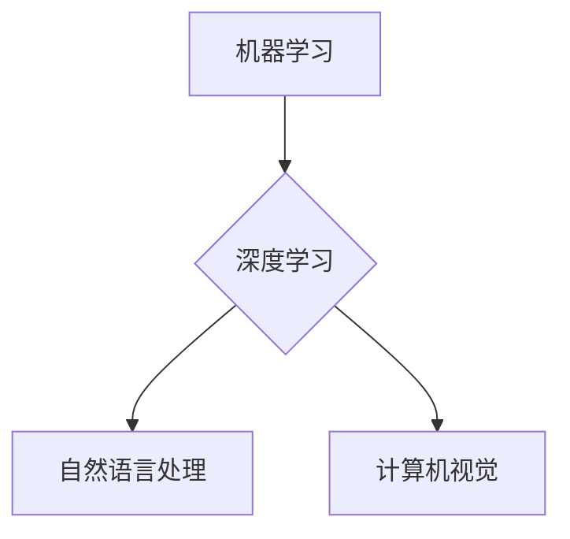

> 人工智能、机器学习、深度学习、自然语言处理、计算机视觉、伦理、社会影响

## 1. 背景介绍

1956年，麻省理工学院的约翰·麦卡锡（John McCarthy）组织了达特茅斯会议，被认为是人工智能（AI）诞生之始。这场会议汇集了当时世界顶尖的科学家和工程师，共同探讨了人工智能的定义、可能性以及发展方向。达特茅斯会议的研究议题涵盖了广泛的领域，从逻辑推理和语言理解到机器学习和问题解决。

然而，达特茅斯会议所提出的许多问题至今仍未得到完全解决。随着人工智能技术的飞速发展，新的挑战和机遇不断涌现，需要我们重新审视达特茅斯会议的研究议题，并将其与当今的科技发展趋势相结合。

## 2. 核心概念与联系

人工智能的核心概念包括：

* **机器学习（Machine Learning）：** 允许计算机从数据中学习，并根据学习到的知识进行预测或决策。
* **深度学习（Deep Learning）：** 一种基于多层神经网络的机器学习方法，能够学习更复杂的模式和特征。
* **自然语言处理（Natural Language Processing）：** 使计算机能够理解和处理人类语言。
* **计算机视觉（Computer Vision）：** 赋予计算机“看”的能力，使其能够识别、理解和解释图像和视频。

这些核心概念相互关联，共同推动着人工智能的发展。例如，深度学习可以用于改进自然语言处理和计算机视觉的性能。



## 3. 核心算法原理 & 具体操作步骤

### 3.1  算法原理概述

机器学习算法的核心原理是通过训练模型来学习数据中的模式。训练模型的过程通常包括以下步骤：

1. **数据收集和预处理：** 收集相关数据并进行清洗、转换和特征工程等预处理操作。
2. **模型选择：** 根据任务需求选择合适的机器学习算法模型。
3. **模型训练：** 使用训练数据训练模型，调整模型参数以最小化预测误差。
4. **模型评估：** 使用测试数据评估模型的性能，并进行调参优化。
5. **模型部署：** 将训练好的模型部署到实际应用场景中。

### 3.2  算法步骤详解

以线性回归算法为例，详细说明其训练步骤：

1. **数据准备：** 准备包含输入特征和目标变量的数据集。
2. **模型初始化：** 初始化模型参数，例如权重和偏差。
3. **损失函数计算：** 计算模型预测值与真实值之间的误差，使用损失函数衡量误差大小。
4. **梯度下降：** 计算模型参数的梯度，并根据梯度更新模型参数，以减小损失函数的值。
5. **迭代训练：** 重复步骤3和4，直到损失函数收敛或达到预设的训练次数。

### 3.3  算法优缺点

线性回归算法具有以下优点：

* 计算简单，易于理解和实现。
* 训练速度快，适合处理大规模数据。

但也存在以下缺点：

* 只能处理线性关系，无法处理非线性关系。
* 对异常值敏感，容易受到异常值的影响。

### 3.4  算法应用领域

线性回归算法广泛应用于以下领域：

* 房价预测
* 股票价格预测
* 销售预测
* 医疗诊断

## 4. 数学模型和公式 & 详细讲解 & 举例说明

### 4.1  数学模型构建

线性回归模型的数学表达式为：

$$y = w_0 + w_1x_1 + w_2x_2 + ... + w_nx_n + \epsilon$$

其中：

* $y$ 是目标变量
* $x_1, x_2, ..., x_n$ 是输入特征
* $w_0, w_1, w_2, ..., w_n$ 是模型参数（权重）
* $\epsilon$ 是误差项

### 4.2  公式推导过程

线性回归模型的目标是找到最优的权重参数，使得模型预测值与真实值之间的误差最小。常用的损失函数是均方误差（MSE）：

$$MSE = \frac{1}{n}\sum_{i=1}^{n}(y_i - \hat{y}_i)^2$$

其中：

* $n$ 是样本数量
* $y_i$ 是第 $i$ 个样本的真实值
* $\hat{y}_i$ 是模型预测的第 $i$ 个样本的值

通过梯度下降算法，可以迭代更新权重参数，以最小化MSE。

### 4.3  案例分析与讲解

假设我们想要预测房屋价格，输入特征包括房屋面积、房间数量和地理位置等。我们可以使用线性回归模型训练一个预测模型。

训练完成后，我们可以使用模型预测新房子的价格。例如，如果新房子的面积为100平方米，房间数量为3间，地理位置在市中心，模型可以预测其价格为500万元。

## 5. 项目实践：代码实例和详细解释说明

### 5.1  开发环境搭建

本项目使用Python语言进行开发，需要安装以下软件包：

* NumPy
* Pandas
* Scikit-learn

可以使用pip命令安装这些软件包：

```bash
pip install numpy pandas scikit-learn
```

### 5.2  源代码详细实现

```python
import numpy as np
from sklearn.linear_model import LinearRegression
from sklearn.model_selection import train_test_split

# 加载数据
data = np.loadtxt('house_data.csv', delimiter=',')

# 分割数据
X = data[:, :-1]  # 输入特征
y = data[:, -1]  # 目标变量
X_train, X_test, y_train, y_test = train_test_split(X, y, test_size=0.2, random_state=42)

# 创建线性回归模型
model = LinearRegression()

# 训练模型
model.fit(X_train, y_train)

# 预测测试数据
y_pred = model.predict(X_test)

# 评估模型性能
from sklearn.metrics import mean_squared_error
mse = mean_squared_error(y_test, y_pred)
print(f'Mean Squared Error: {mse}')
```

### 5.3  代码解读与分析

这段代码首先加载了房屋数据，然后将数据分割为训练集和测试集。接着，创建了一个线性回归模型，并使用训练集训练模型。最后，使用测试集评估模型的性能，并打印均方误差。

### 5.4  运行结果展示

运行代码后，会输出模型的均方误差值。均方误差值越小，模型的预测性能越好。

## 6. 实际应用场景

### 6.1  金融领域

* 股票价格预测
* 欺诈检测
* 风险评估

### 6.2  医疗领域

* 疾病诊断
* 药物研发
* 患者风险预测

### 6.3  电商领域

* 商品推荐
* 销售预测
* 客户画像

### 6.4  未来应用展望

随着人工智能技术的不断发展，其应用场景将更加广泛，例如：

* 自动驾驶
* 人机交互
* 个性化教育

## 7. 工具和资源推荐

### 7.1  学习资源推荐

* **书籍:**
    * 《深度学习》
    * 《机器学习实战》
    * 《人工智能：一种现代方法》
* **在线课程:**
    * Coursera
    * edX
    * Udacity

### 7.2  开发工具推荐

* **Python:** 
    * Jupyter Notebook
    * PyCharm
* **机器学习库:**
    * Scikit-learn
    * TensorFlow
    * PyTorch

### 7.3  相关论文推荐

* **《ImageNet Classification with Deep Convolutional Neural Networks》**
* **《Attention Is All You Need》**
* **《BERT: Pre-training of Deep Bidirectional Transformers for Language Understanding》**

## 8. 总结：未来发展趋势与挑战

### 8.1  研究成果总结

达特茅斯会议的研究议题为人工智能的发展奠定了基础，并推动了人工智能技术的快速发展。近年来，深度学习的兴起，使得人工智能在各个领域取得了突破性的进展。

### 8.2  未来发展趋势

未来，人工智能的发展趋势包括：

* **更强大的模型:** 研究更深、更复杂的深度学习模型，以提高人工智能的性能。
* **更广泛的应用:** 将人工智能应用于更多领域，例如医疗、教育、交通等。
* **更强的解释性:** 研究更可解释的人工智能模型，以便更好地理解人工智能的决策过程。

### 8.3  面临的挑战

人工智能的发展也面临着一些挑战，例如：

* **数据安全和隐私:** 人工智能模型的训练需要大量数据，如何保护数据安全和隐私是一个重要问题。
* **算法偏见:** 人工智能模型可能存在算法偏见，导致不公平的结果。
* **伦理问题:** 人工智能的快速发展引发了一些伦理问题，例如人工智能的责任和义务。

### 8.4  研究展望

未来，我们需要继续深入研究人工智能的核心问题，并探索人工智能与人类社会和谐共处的路径。


## 9. 附录：常见问题与解答

### 9.1  什么是机器学习？

机器学习是一种人工智能技术，它允许计算机从数据中学习，并根据学习到的知识进行预测或决策。

### 9.2  什么是深度学习？

深度学习是一种基于多层神经网络的机器学习方法，能够学习更复杂的模式和特征。

### 9.3  什么是自然语言处理？

自然语言处理是指使计算机能够理解和处理人类语言的技术。

### 9.4  什么是计算机视觉？

计算机视觉是指赋予计算机“看”的能力，使其能够识别、理解和解释图像和视频的技术。

### 9.5  人工智能有哪些应用场景？

人工智能的应用场景非常广泛，例如金融、医疗、电商、交通等。

作者：禅与计算机程序设计艺术 / Zen and the Art of Computer Programming


<end_of_turn>