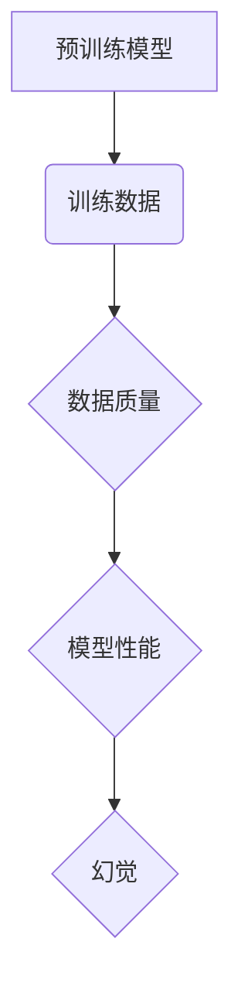

> 预训练模型，数据质量，幻觉，生成模型，文本生成，图像生成，模型评估

## 1. 背景介绍

近年来，深度学习在人工智能领域取得了突破性进展，预训练模型作为其重要组成部分，在自然语言处理、计算机视觉等领域展现出强大的能力。预训练模型通过在海量数据上进行预训练，学习到丰富的语义和结构知识，从而能够在 downstream 任务中取得更好的性能。然而，预训练模型的性能也受到训练数据质量的严重影响。

数据质量问题在预训练模型中尤为突出，因为预训练模型的训练过程依赖于海量数据的质量。如果训练数据存在噪声、偏差、错误等问题，预训练模型很可能学习到这些错误信息，从而导致模型性能下降，甚至产生“幻觉”。

## 2. 核心概念与联系

**2.1 预训练模型**

预训练模型是指在未标记数据上进行预训练的深度学习模型。预训练模型通过学习数据的统计规律和语义关系，获得了一定的通用知识和能力。

**2.2 数据质量**

数据质量是指数据准确性、完整性、一致性、时效性等方面的指标。高质量的数据能够更好地支持模型训练，提高模型性能。

**2.3 幻觉**

幻觉是指预训练模型在生成文本或图像时，产生与真实世界不符、甚至荒谬的内容。幻觉的产生往往与训练数据中的噪声、偏差、错误等问题有关。

**2.4 核心概念联系**

预训练模型的性能与训练数据质量密切相关。高质量的数据能够帮助预训练模型学习到更准确、更可靠的知识，从而提高模型的性能。反之，低质量的数据会影响模型的训练效果，甚至导致模型产生幻觉。



## 3. 核心算法原理 & 具体操作步骤

### 3.1 算法原理概述

预训练模型的训练主要基于自监督学习和迁移学习的思想。

* **自监督学习:** 通过设计特殊的预训练任务，例如语言建模、图像分类等，在未标记数据上进行训练。

* **迁移学习:** 将预训练模型在特定任务上的微调，以提高模型在该任务上的性能。

### 3.2 算法步骤详解

1. **数据预处理:** 对训练数据进行清洗、格式化、编码等操作，使其符合模型的输入要求。
2. **模型选择:** 选择合适的预训练模型架构，例如BERT、GPT、DALL-E等。
3. **预训练:** 在海量未标记数据上进行预训练，学习模型的通用知识和能力。
4. **微调:** 将预训练模型在特定任务的数据上进行微调，以提高模型在该任务上的性能。
5. **评估:** 使用测试数据评估模型的性能，并根据评估结果进行模型优化。

### 3.3 算法优缺点

**优点:**

* 能够利用海量未标记数据进行训练，提高模型的泛化能力。
* 能够在特定任务上取得较好的性能，减少模型训练时间和资源消耗。

**缺点:**

* 训练数据质量对模型性能有重要影响，低质量数据会影响模型的训练效果。
* 预训练模型的规模较大，需要较大的计算资源进行训练和部署。

### 3.4 算法应用领域

预训练模型在自然语言处理、计算机视觉、语音识别等领域都有广泛的应用。

* **自然语言处理:** 文本生成、机器翻译、问答系统、情感分析等。
* **计算机视觉:** 图像分类、目标检测、图像生成等。
* **语音识别:** 语音转文本、语音合成等。

## 4. 数学模型和公式 & 详细讲解 & 举例说明

### 4.1 数学模型构建

预训练模型的训练通常基于最大似然估计 (Maximum Likelihood Estimation, MLE) 或交叉熵损失函数 (Cross-Entropy Loss Function)。

**4.1.1 最大似然估计 (MLE)**

MLE 的目标是找到模型参数，使得模型在训练数据上的概率最大化。

**4.1.2 交叉熵损失函数**

交叉熵损失函数用于衡量模型预测结果与真实标签之间的差异。

### 4.2 公式推导过程

**4.2.1 最大似然估计公式**

$$
\theta = \arg \max_ \theta \prod_{i=1}^{N} p(x_i | \theta)
$$

其中：

* $\theta$ 是模型参数
* $x_i$ 是训练数据中的第 $i$ 个样本
* $p(x_i | \theta)$ 是模型在参数 $\theta$ 下预测样本 $x_i$ 的概率

**4.2.2 交叉熵损失函数公式**

$$
L = -\frac{1}{N} \sum_{i=1}^{N} \sum_{j=1}^{C} y_{ij} \log p_{ij}
$$

其中：

* $N$ 是训练数据的大小
* $C$ 是类别数
* $y_{ij}$ 是真实标签，如果样本 $i$ 属于类别 $j$，则 $y_{ij} = 1$，否则 $y_{ij} = 0$
* $p_{ij}$ 是模型预测样本 $i$ 属于类别 $j$ 的概率

### 4.3 案例分析与讲解

**4.3.1 文本生成任务**

在文本生成任务中，预训练模型可以学习到语言的语法和语义规则，从而生成流畅、连贯的文本。例如，GPT-3 模型可以根据给定的文本提示，生成各种类型的文本，例如故事、诗歌、代码等。

**4.3.2 图像生成任务**

在图像生成任务中，预训练模型可以学习到图像的结构和纹理特征，从而生成逼真的图像。例如，DALL-E 模型可以根据给定的文本描述，生成相应的图像。

## 5. 项目实践：代码实例和详细解释说明

### 5.1 开发环境搭建

* Python 3.7+
* PyTorch 1.7+
* CUDA 10.2+

### 5.2 源代码详细实现

```python
# 导入必要的库
import torch
import torch.nn as nn

# 定义一个简单的预训练模型
class SimplePretrainModel(nn.Module):
    def __init__(self, input_size, hidden_size, output_size):
        super(SimplePretrainModel, self).__init__()
        self.linear1 = nn.Linear(input_size, hidden_size)
        self.relu = nn.ReLU()
        self.linear2 = nn.Linear(hidden_size, output_size)

    def forward(self, x):
        x = self.linear1(x)
        x = self.relu(x)
        x = self.linear2(x)
        return x

# 实例化模型
model = SimplePretrainModel(input_size=10, hidden_size=50, output_size=2)

# 定义损失函数和优化器
criterion = nn.CrossEntropyLoss()
optimizer = torch.optim.Adam(model.parameters(), lr=0.001)

# 训练模型
for epoch in range(10):
    # 训练数据
    inputs = torch.randn(100, 10)
    targets = torch.randint(0, 2, (100,))

    # 前向传播
    outputs = model(inputs)

    # 计算损失
    loss = criterion(outputs, targets)

    # 反向传播
    optimizer.zero_grad()
    loss.backward()

    # 更新参数
    optimizer.step()

    print(f'Epoch [{epoch+1}/{10}], Loss: {loss.item():.4f}')
```

### 5.3 代码解读与分析

* 代码首先定义了一个简单的预训练模型，该模型包含两层全连接层和一个ReLU激活函数。
* 然后，代码定义了损失函数和优化器，并开始训练模型。
* 训练过程包括前向传播、计算损失、反向传播和更新参数。

### 5.4 运行结果展示

训练完成后，模型可以用于预测新的数据。例如，可以输入一个新的样本，模型会输出相应的预测结果。

## 6. 实际应用场景

### 6.1 自然语言处理

* **文本生成:** 预训练模型可以用于生成各种类型的文本，例如故事、诗歌、代码等。
* **机器翻译:** 预训练模型可以用于将文本从一种语言翻译成另一种语言。
* **问答系统:** 预训练模型可以用于回答用户的问题，例如搜索引擎、聊天机器人等。

### 6.2 计算机视觉

* **图像分类:** 预训练模型可以用于识别图像中的物体，例如人脸识别、物体检测等。
* **图像生成:** 预训练模型可以用于生成逼真的图像，例如艺术作品、产品设计等。
* **图像修复:** 预训练模型可以用于修复损坏的图像，例如去除噪声、修复缺失部分等。

### 6.3 语音识别

* **语音转文本:** 预训练模型可以用于将语音转换为文本，例如语音助手、语音输入等。
* **语音合成:** 预训练模型可以用于将文本转换为语音，例如语音播报、语音聊天等。

### 6.4 未来应用展望

预训练模型在未来将有更广泛的应用，例如：

* **个性化推荐:** 根据用户的兴趣和偏好，推荐个性化的内容。
* **自动驾驶:** 预训练模型可以用于辅助自动驾驶系统，例如识别道路标志、预测行人行为等。
* **医疗诊断:** 预训练模型可以用于辅助医生诊断疾病，例如分析医学图像、预测患者病情等。

## 7. 工具和资源推荐

### 7.1 学习资源推荐

* **书籍:**
    * Deep Learning by Ian Goodfellow, Yoshua Bengio, and Aaron Courville
    * Natural Language Processing with PyTorch by Yoav Goldberg
* **在线课程:**
    * Stanford CS224N: Natural Language Processing with Deep Learning
    * Deep Learning Specialization by Andrew Ng

### 7.2 开发工具推荐

* **PyTorch:** 深度学习框架
* **TensorFlow:** 深度学习框架
* **Hugging Face Transformers:** 预训练模型库

### 7.3 相关论文推荐

* BERT: Pre-training of Deep Bidirectional Transformers for Language Understanding
* GPT-3: Language Models are Few-Shot Learners
* DALL-E: Zero-Shot Text-to-Image Generation

## 8. 总结：未来发展趋势与挑战

### 8.1 研究成果总结

预训练模型在人工智能领域取得了显著的进展，在自然语言处理、计算机视觉等领域取得了突破性成果。

### 8.2 未来发展趋势

* **模型规模的进一步扩大:** 预训练模型的规模将继续扩大，以提高模型的性能和泛化能力。
* **多模态预训练:** 预训练模型将融合多种模态数据，例如文本、图像、音频等，以更好地理解和生成多模态内容。
* **可解释性研究:** 研究预训练模型的决策过程，提高模型的可解释性和可信度。

### 8.3 面临的挑战

* **数据质量问题:** 预训练模型的性能依赖于训练数据的质量，如何获取高质量的训练数据仍然是一个挑战。
* **计算资源需求:** 预训练大型模型需要大量的计算资源，这对于资源有限的机构和个人来说是一个障碍。
* **伦理问题:** 预训练模型可能存在偏见和歧视问题，需要关注模型的伦理问题。

### 8.4 研究展望

未来，预训练模型的研究将继续深入，探索更强大的模型架构、更有效的训练方法和更广泛的应用场景。预训练模型有望成为人工智能领域的重要发展方向，推动人工智能技术向更智能、更安全、更可持续的方向发展。

## 9. 附录：常见问题与解答

**9.1 预训练模型的训练成本高吗？**

是的，预训练大型