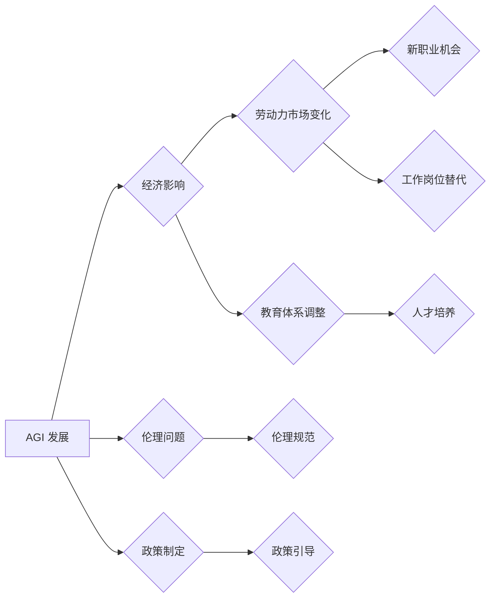

> 
> Artificial General Intelligence (AGI), 社会结构, 经济影响, 劳动力市场, 教育体系, 伦理问题, 政策建议

## 1. 背景介绍

人工智能 (AI) 已经取得了令人瞩目的进展，从语音识别到图像生成，AI 正在改变着我们生活的方方面面。然而，与目前大多数 AI 系统不同，通用人工智能 (AGI) 旨在创建能够像人类一样学习、理解和解决各种复杂问题的智能体。AGI 的出现将对社会结构产生深远的影响，涉及到经济、劳动力市场、教育体系、伦理和政策等多个领域。

## 2. 核心概念与联系

**2.1 AGI 的定义和特征**

AGI 是一种能够执行人类任何智能任务的智能体，它拥有以下特征：

* **通用性:** AGI 不局限于特定任务，能够学习和适应各种新的任务和环境。
* **学习能力:** AGI 可以从数据中学习，并不断提高其性能。
* **推理能力:** AGI 可以进行逻辑推理和决策，解决复杂问题。
* **创造力:** AGI 可以生成新的想法、概念和解决方案。
* **情感智能:** AGI 可能能够理解和模拟人类的情感。

**2.2 AGI 对社会结构的影响**

AGI 的出现将对社会结构产生多方面的潜在影响：

* **经济影响:** AGI 可能导致自动化程度的提高，从而改变就业市场，创造新的职业机会，但也可能导致部分工作岗位被取代。
* **劳动力市场:** AGI 可能导致劳动力市场结构的重塑，需要重新思考教育和培训体系，培养适应未来市场需求的人才。
* **教育体系:** AGI 可以作为教育工具，个性化教学，提高教育效率，但也需要重新思考教育目标和内容。
* **伦理问题:** AGI 的发展引发了伦理问题，例如算法偏见、数据隐私、责任归属等，需要制定相应的伦理规范和法律法规。
* **政策建议:** 政府需要制定相应的政策，引导 AGI 的发展，应对其带来的挑战，并确保其造福人类社会。

**2.3  AGI 影响社会结构的流程图**



## 3. 核心算法原理 & 具体操作步骤

**3.1  算法原理概述**

AGI 的核心算法原理包括深度学习、强化学习、自然语言处理等。

* **深度学习:** 通过多层神经网络模拟人类大脑的学习过程，能够从海量数据中提取特征，进行模式识别和预测。
* **强化学习:** 通过奖励机制训练智能体，使其在环境中学习最优策略，能够解决复杂决策问题。
* **自然语言处理:** 能够理解和生成人类语言，使智能体能够与人类进行自然交互。

**3.2  算法步骤详解**

AGI 的开发是一个复杂的过程，涉及多个步骤：

1. **数据收集和预处理:** 收集大量相关数据，并进行清洗、格式化等预处理工作。
2. **模型构建:** 选择合适的算法模型，并根据数据特点进行参数调整。
3. **模型训练:** 使用训练数据训练模型，使其能够学习数据中的规律。
4. **模型评估:** 使用测试数据评估模型的性能，并进行调整优化。
5. **模型部署:** 将训练好的模型部署到实际应用场景中。

**3.3  算法优缺点**

* **优点:** AGI 能够学习和解决复杂问题，提高效率和智能化水平。
* **缺点:** AGI 的开发成本高，训练数据量大，算法复杂，存在伦理风险。

**3.4  算法应用领域**

AGI 具有广泛的应用领域，例如：

* **医疗保健:** 辅助诊断、个性化治疗、药物研发。
* **金融服务:** 风险管理、欺诈检测、投资决策。
* **制造业:** 自动化生产、质量控制、产品设计。
* **教育:** 个性化教学、智能辅导、知识发现。

## 4. 数学模型和公式 & 详细讲解 & 举例说明

**4.1  数学模型构建**

AGI 的开发可以抽象为一个数学模型，其中包括：

* **输入:** 环境信息、数据样本。
* **输出:** 智能体行为、决策结果。
* **模型参数:** 算法模型的权重、偏置等。
* **损失函数:** 衡量模型预测结果与真实结果之间的误差。
* **优化算法:** 用于更新模型参数，最小化损失函数。

**4.2  公式推导过程**

深度学习算法中常用的公式包括：

* **激活函数:** 用于引入非线性，提高模型表达能力。例如 sigmoid 函数:

$$
f(x) = \frac{1}{1 + e^{-x}}
$$

* **损失函数:** 用于衡量模型预测结果与真实结果之间的误差。例如均方误差:

$$
L = \frac{1}{n} \sum_{i=1}^{n} (y_i - \hat{y}_i)^2
$$

* **梯度下降算法:** 用于更新模型参数，最小化损失函数。

$$
\theta = \theta - \alpha \nabla L(\theta)
$$

**4.3  案例分析与讲解**

例如，在图像识别任务中，可以使用卷积神经网络 (CNN) 模型进行训练。CNN 模型通过卷积操作提取图像特征，并使用全连接层进行分类。训练过程中，使用图像数据集进行训练，并使用交叉熵损失函数和梯度下降算法更新模型参数。

## 5. 项目实践：代码实例和详细解释说明

**5.1  开发环境搭建**

使用 Python 语言和 TensorFlow 或 PyTorch 等深度学习框架进行开发。

**5.2  源代码详细实现**

```python
import tensorflow as tf

# 定义模型结构
model = tf.keras.models.Sequential([
    tf.keras.layers.Conv2D(32, (3, 3), activation='relu', input_shape=(28, 28, 1)),
    tf.keras.layers.MaxPooling2D((2, 2)),
    tf.keras.layers.Conv2D(64, (3, 3), activation='relu'),
    tf.keras.layers.MaxPooling2D((2, 2)),
    tf.keras.layers.Flatten(),
    tf.keras.layers.Dense(10, activation='softmax')
])

# 编译模型
model.compile(optimizer='adam',
              loss='sparse_categorical_crossentropy',
              metrics=['accuracy'])

# 训练模型
model.fit(x_train, y_train, epochs=5)

# 评估模型
loss, accuracy = model.evaluate(x_test, y_test)
print('Test loss:', loss)
print('Test accuracy:', accuracy)
```

**5.3  代码解读与分析**

这段代码定义了一个简单的卷积神经网络模型，用于手写数字识别任务。模型包含卷积层、池化层和全连接层。训练过程中，使用 Adam 优化器、交叉熵损失函数和准确率作为评估指标。

**5.4  运行结果展示**

训练完成后，模型可以用于预测新的手写数字图像。

## 6. 实际应用场景

**6.1  医疗保健**

* **辅助诊断:** AGI 可以分析医学影像数据，辅助医生诊断疾病。
* **个性化治疗:** AGI 可以根据患者的基因信息和病史，制定个性化的治疗方案。
* **药物研发:** AGI 可以加速药物研发过程，预测药物的有效性和安全性。

**6.2  金融服务**

* **风险管理:** AGI 可以分析市场数据，识别金融风险，帮助金融机构进行风险管理。
* **欺诈检测:** AGI 可以分析交易数据，识别欺诈行为，保护金融机构和客户的利益。
* **投资决策:** AGI 可以分析市场趋势，提供投资建议，帮助投资者做出更明智的决策。

**6.3  制造业**

* **自动化生产:** AGI 可以控制机器人，实现自动化生产，提高生产效率。
* **质量控制:** AGI 可以识别产品缺陷，提高产品质量。
* **产品设计:** AGI 可以辅助工程师设计新产品，优化产品性能。

**6.4  未来应用展望**

AGI 的应用场景还在不断扩展，未来可能在更多领域发挥重要作用，例如：

* **教育:** 个性化教学、智能辅导、知识发现。
* **交通:** 自动驾驶、交通管理、物流优化。
* **环境保护:** 环境监测、污染控制、资源管理。

## 7. 工具和资源推荐

**7.1  学习资源推荐**

* **书籍:**
    * 《深度学习》
    * 《人工智能：一种现代方法》
    * 《机器学习》
* **在线课程:**
    * Coursera
    * edX
    * Udacity

**7.2  开发工具推荐**

* **Python:** 广泛使用的编程语言，用于深度学习开发。
* **TensorFlow:** 开源深度学习框架，提供丰富的工具和资源。
* **PyTorch:** 开源深度学习框架，以其灵活性和易用性而闻名。

**7.3  相关论文推荐**

* **AlphaGo论文:** https://arxiv.org/abs/1607.02886
* **GPT-3论文:** https://arxiv.org/abs/2005.14165

## 8. 总结：未来发展趋势与挑战

**8.1  研究成果总结**

AGI 的研究取得了显著进展，例如 AlphaGo 在围棋比赛中战胜人类世界冠军，GPT-3 在文本生成任务中展现出惊人的能力。

**8.2  未来发展趋势**

* **模型规模和能力的提升:** 未来 AGI 模型将更加强大，能够处理更复杂的任务。
* **多模态学习:** AGI 将能够理解和处理多种数据类型，例如文本、图像、音频和视频。
* **可解释性增强:** 研究人员将致力于提高 AGI 模型的可解释性，使人类能够更好地理解其决策过程。

**8.3  面临的挑战**

* **算法复杂性:** AGI 的算法非常复杂，难以理解和控制。
* **数据需求:** AGI 的训练需要海量数据，数据获取和处理是一个挑战。
* **伦理风险:** AGI 的发展可能带来伦理风险，例如算法偏见、隐私泄露和失控风险。

**8.4  研究展望**

AGI 的研究是一个长期而艰巨的任务，需要多学科的合作和跨领域的创新。未来研究将重点关注以下方面:

* **开发更安全、更可靠的 AGI 算法。**
* **解决 AGI 的数据需求和伦理风险问题。**
* **探索 AGI 的社会影响，并制定相应的政策和法规。**

## 9. 附录：常见问题与解答

**9.1  AGI 是否会取代人类？**

AGI 的目的是辅助人类，而不是取代人类。AGI 可以帮助人类完成更复杂的任务，释放人类的创造力和潜能。

**9.2  AGI 会带来哪些伦理问题？**

AGI 的发展可能带来一些伦理问题，例如算法偏见、隐私泄露和失控风险。需要制定相应的伦理规范和法律法规，引导 AGI 的发展，确保其造福人类社会。

**9.3  如何学习 AGI？**

学习 AGI 需要掌握深度学习、机器学习、计算机科学等相关知识。可以参考相关的书籍、在线课程和研究论文。

作者：禅与计算机程序设计艺术 / Zen and the Art of Computer Programming


<end_of_turn>