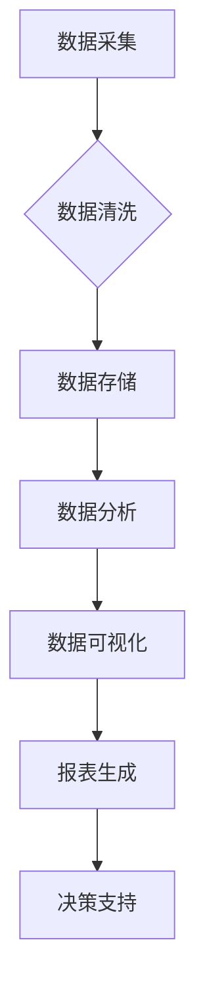

> AI DMP, 数据基建, 数据可视化, 报表, 数据分析, 数据驱动, 决策支持

## 1. 背景介绍

在当今数据爆炸的时代，企业积累了海量的用户数据、运营数据、市场数据等。如何有效地挖掘这些数据中的价值，并将其转化为可操作的决策依据，成为企业发展面临的重大挑战。数据可视化和报表作为数据分析的重要手段，能够帮助企业直观地理解数据趋势，发现隐藏的模式，并为决策提供支持。

AI DMP（人工智能数据管理平台）作为一种新型的数据管理平台，融合了人工智能技术和数据管理理念，能够对海量数据进行智能分析、挖掘和可视化，为企业提供更精准、更有效的决策支持。

## 2. 核心概念与联系

**2.1 AI DMP 数据基建**

AI DMP 数据基建是指构建一个基于人工智能技术的、能够高效存储、处理、分析和可视化海量数据的平台基础设施。它包括数据采集、数据清洗、数据存储、数据分析、数据可视化等多个环节。

**2.2 数据可视化与报表**

数据可视化是指将数据以图形、图表等形式呈现出来，以便于人们直观地理解和分析数据。报表则是将数据以表格、清单等形式整理和呈现出来，以便于人们进行统计分析和比较。

**2.3 核心概念联系**

AI DMP 数据基建为数据可视化和报表提供了坚实的基础。它能够提供海量数据的存储和处理能力，以及人工智能技术驱动的智能分析功能。数据可视化和报表则将AI DMP的数据分析结果以直观易懂的方式呈现出来，帮助企业更好地理解数据，并做出更明智的决策。

**2.4  Mermaid 流程图**



## 3. 核心算法原理 & 具体操作步骤

**3.1 算法原理概述**

数据可视化和报表生成通常涉及到以下核心算法：

* **聚类算法:** 将数据按照相似性进行分组，例如将用户按照消费习惯进行分类。
* **关联规则挖掘算法:** 发现数据之间的关联关系，例如发现哪些商品经常被一起购买。
* **时间序列分析算法:** 分析数据随时间变化的趋势，例如预测未来销售额。
* **数据降维算法:** 将高维数据降维到低维空间，以便于可视化，例如使用PCA算法将用户特征降维到二维空间。

**3.2 算法步骤详解**

具体算法的步骤会根据不同的算法和应用场景有所不同，但一般包括以下几个步骤：

1. **数据预处理:** 清洗、转换和格式化数据，使其适合算法的输入。
2. **特征工程:** 从原始数据中提取特征，以便于算法进行分析。
3. **模型训练:** 使用训练数据训练算法模型。
4. **模型评估:** 使用测试数据评估模型的性能。
5. **模型部署:** 将训练好的模型部署到生产环境中，用于数据分析和可视化。

**3.3 算法优缺点**

不同的算法具有不同的优缺点，需要根据实际应用场景选择合适的算法。例如，聚类算法能够发现数据中的隐含结构，但其结果难以解释；关联规则挖掘算法能够发现数据之间的关联关系，但其结果可能存在冗余和噪音。

**3.4 算法应用领域**

数据可视化和报表生成算法广泛应用于各个领域，例如：

* **商业分析:** 分析销售数据、市场趋势、客户行为等。
* **金融分析:** 分析股票价格、风险评估、投资策略等。
* **医疗保健:** 分析患者数据、疾病诊断、药物研发等。
* **教育:** 分析学生成绩、学习行为、教学效果等。

## 4. 数学模型和公式 & 详细讲解 & 举例说明

**4.1 数学模型构建**

数据可视化和报表生成过程中，通常会使用数学模型来描述数据之间的关系和趋势。例如，可以使用线性回归模型来预测未来销售额，可以使用聚类模型来将用户进行分类。

**4.2 公式推导过程**

具体的数学模型和公式推导过程会根据不同的算法和应用场景有所不同。例如，线性回归模型的公式如下：

$$y = mx + c$$

其中，y是预测值，x是输入变量，m是斜率，c是截距。

**4.3 案例分析与讲解**

假设我们想要预测未来三个月的销售额，可以使用线性回归模型。我们可以收集过去一年的销售数据，并使用这些数据训练线性回归模型。然后，我们可以使用模型预测未来三个月的销售额。

## 5. 项目实践：代码实例和详细解释说明

**5.1 开发环境搭建**

为了实现数据可视化和报表生成功能，我们可以使用以下开发环境：

* **编程语言:** Python
* **数据可视化库:** Matplotlib, Seaborn, Plotly
* **报表生成库:** ReportLab, Jinja2
* **数据库:** MySQL, PostgreSQL

**5.2 源代码详细实现**

以下是一个简单的Python代码示例，演示如何使用Matplotlib库绘制一个柱状图：

```python
import matplotlib.pyplot as plt

# 数据
categories = ['A', 'B', 'C', 'D']
values = [15, 28, 12, 25]

# 绘制柱状图
plt.bar(categories, values)

# 设置标题和标签
plt.title('柱状图示例')
plt.xlabel('类别')
plt.ylabel('值')

# 显示图形
plt.show()
```

**5.3 代码解读与分析**

这段代码首先导入Matplotlib库，然后定义了两个列表：categories和values。categories列表包含柱状图的类别名称，values列表包含每个类别的值。

然后，使用plt.bar()函数绘制柱状图，将categories列表作为x轴坐标，values列表作为y轴坐标。

最后，使用plt.title()、plt.xlabel()和plt.ylabel()函数设置标题和标签，并使用plt.show()函数显示图形。

**5.4 运行结果展示**

运行这段代码后，将会显示一个柱状图，每个柱子代表一个类别，柱子的高度代表该类别的值。

## 6. 实际应用场景

**6.1 商业分析**

AI DMP可以帮助企业分析销售数据、市场趋势、客户行为等，并生成可视化的报表，以便于企业决策。例如，可以分析不同产品的销售情况，找出畅销产品和滞销产品，并根据分析结果调整产品策略。

**6.2 市场营销**

AI DMP可以帮助企业进行精准营销，例如根据用户的兴趣爱好和购买行为，推送个性化的广告和促销信息。

**6.3 客户关系管理**

AI DMP可以帮助企业更好地管理客户关系，例如分析客户的购买历史、反馈意见等，并根据分析结果提供个性化的服务。

**6.4 未来应用展望**

随着人工智能技术的不断发展，AI DMP的数据基建将更加完善，数据可视化和报表生成功能也将更加强大。未来，AI DMP将能够帮助企业更深入地理解数据，并做出更明智的决策。

## 7. 工具和资源推荐

**7.1 学习资源推荐**

* **书籍:**
    * 《Python数据科学手册》
    * 《数据可视化设计》
* **在线课程:**
    * Coursera上的数据科学课程
    * Udemy上的数据可视化课程

**7.2 开发工具推荐**

* **Python:** 
    * Anaconda
    * PyCharm
* **数据可视化库:**
    * Matplotlib
    * Seaborn
    * Plotly
* **报表生成库:**
    * ReportLab
    * Jinja2

**7.3 相关论文推荐**

* 《数据可视化：原理、方法和应用》
* 《人工智能在数据可视化中的应用》

## 8. 总结：未来发展趋势与挑战

**8.1 研究成果总结**

AI DMP数据基建为数据可视化和报表生成提供了强大的技术支持，能够帮助企业更好地理解数据，并做出更明智的决策。

**8.2 未来发展趋势**

未来，AI DMP数据基建将朝着以下方向发展：

* **更智能化:** 利用人工智能技术，实现数据自动分析、可视化和报表生成。
* **更个性化:** 根据用户的需求和偏好，提供个性化的数据可视化和报表。
* **更实时化:** 实现数据实时采集、分析和可视化，以便于企业及时做出决策。

**8.3 面临的挑战**

AI DMP数据基建的发展也面临着一些挑战：

* **数据质量问题:** 数据质量直接影响到数据分析和可视化的结果，需要加强数据清洗和预处理工作。
* **算法复杂度:** 一些人工智能算法的复杂度较高，需要不断优化算法和提高计算效率。
* **人才缺口:** AI DMP数据基建需要专业的技术人才，人才缺口是一个需要解决的问题。

**8.4 研究展望**

未来，我们将继续致力于AI DMP数据基建的研究，探索更智能、更个性化、更实时化的数据可视化和报表生成技术，为企业提供更强大的数据分析和决策支持工具。

## 9. 附录：常见问题与解答

**9.1 如何选择合适的算法？**

选择合适的算法需要根据实际应用场景和数据特点进行分析。例如，如果需要发现数据中的隐含结构，可以选择聚类算法；如果需要发现数据之间的关联关系，可以选择关联规则挖掘算法。

**9.2 如何处理数据质量问题？**

数据质量问题可以通过以下方法进行处理：

* 数据清洗：删除重复数据、错误数据和缺失数据。
* 数据转换：将数据格式转换为一致的格式。
* 数据标准化：将数据进行标准化处理，例如将数值数据转换为0到1之间的范围。

**9.3 如何提高算法的效率？**

可以采用以下方法提高算法的效率：

* 优化算法代码。
* 使用更强大的硬件设备。
* 使用并行计算技术。


作者：禅与计算机程序设计艺术 / Zen and the Art of Computer Programming 
<end_of_turn>