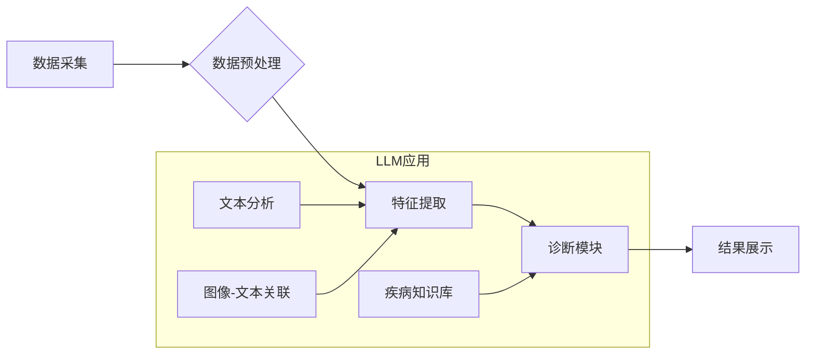

> AI LLM, 计算机辅助诊断, 深度学习, 自然语言处理, 图像识别, 医疗影像分析, 诊断精度, 效率提升

## 1. 背景介绍

随着医疗技术的不断发展，计算机辅助诊断 (Computer-Aided Diagnosis, CAD) 已成为医疗领域的重要组成部分。CAD 系统利用计算机技术辅助医师进行诊断，提高诊断的准确性和效率。近年来，深度学习 (Deep Learning) 和自然语言处理 (Natural Language Processing, NLP) 等人工智能技术取得了显著进展，为 CAD 系统的开发提供了新的机遇。

大型语言模型 (Large Language Model, LLM) 作为深度学习领域的新兴技术，展现出强大的文本理解和生成能力。LLM 可以处理海量医疗文本数据，例如病历、影像报告、医学文献等，并从中提取关键信息，辅助医师进行诊断。

## 2. 核心概念与联系

**2.1 计算机辅助诊断 (CAD)**

CAD 系统旨在辅助医师进行诊断，提高诊断的准确性和效率。CAD 系统通常由以下几个模块组成：

* **数据采集模块:** 收集患者的医疗数据，例如影像数据、病历信息、实验室检查结果等。
* **数据预处理模块:** 对采集到的数据进行预处理，例如图像增强、数据清洗等。
* **特征提取模块:** 从预处理后的数据中提取特征，例如图像纹理特征、病历文本特征等。
* **诊断模块:** 基于提取的特征，利用机器学习算法进行诊断，并输出诊断结果。
* **结果展示模块:** 将诊断结果以可视化形式展示给医师。

**2.2 大型语言模型 (LLM)**

LLM 是基于深度学习的强大语言模型，通过训练海量文本数据，学习语言的语法、语义和上下文关系。LLM 可以执行多种自然语言处理任务，例如文本分类、文本生成、机器翻译等。

**2.3 核心概念联系**

LLM 可以应用于 CAD 系统的多个模块，例如：

* **数据分析模块:** LLM 可以分析海量病历文本数据，提取患者的症状、病史、家族史等关键信息，为诊断提供辅助。
* **特征提取模块:** LLM 可以学习图像和文本之间的关系，提取图像和文本特征，提高诊断的准确性。
* **诊断模块:** LLM 可以学习疾病的症状、表现和诊断标准，辅助医师进行诊断。

**2.4 核心架构流程图**



## 3. 核心算法原理 & 具体操作步骤

**3.1 算法原理概述**

LLM 在 CAD 系统中的应用主要基于以下核心算法原理：

* **Transformer网络:** Transformer 网络是一种深度学习架构，能够有效地处理序列数据，例如文本和图像。Transformer 网络的核心是注意力机制，能够学习数据之间的长距离依赖关系。
* **自然语言处理 (NLP) 技术:** NLP 技术包括文本分类、文本生成、机器翻译等，可以用于分析病历文本、提取关键信息、生成诊断报告等。
* **计算机视觉 (CV) 技术:** CV 技术包括图像识别、图像分割、图像分类等，可以用于分析医学影像数据，识别病灶、测量病灶大小等。

**3.2 算法步骤详解**

1. **数据收集和预处理:** 收集患者的医疗数据，例如影像数据、病历文本、实验室检查结果等。对数据进行预处理，例如图像增强、数据清洗、文本分词等。
2. **特征提取:** 利用 Transformer 网络和 NLP/CV 技术，从预处理后的数据中提取特征。例如，从病历文本中提取患者的症状、病史、家族史等信息；从医学影像数据中提取病灶的形状、大小、位置等信息。
3. **模型训练:** 利用提取的特征，训练 LLM 模型。训练过程中，可以使用监督学习、半监督学习或无监督学习等方法。
4. **模型评估:** 使用测试数据评估模型的性能，例如准确率、召回率、F1-score等。
5. **模型部署:** 将训练好的模型部署到实际应用环境中，例如医院的诊断系统。

**3.3 算法优缺点**

**优点:**

* **高准确率:** LLM 可以学习复杂的模式和关系，提高诊断的准确率。
* **自动化程度高:** LLM 可以自动分析数据、提取特征、进行诊断，提高诊断效率。
* **可扩展性强:** LLM 可以应用于多种医疗领域，例如影像诊断、病理诊断、基因诊断等。

**缺点:**

* **数据依赖性强:** LLM 的性能取决于训练数据的质量和数量。
* **解释性差:** LLM 的决策过程比较复杂，难以解释其诊断结果。
* **伦理问题:** LLM 的应用可能引发伦理问题，例如数据隐私、算法偏见等。

**3.4 算法应用领域**

LLM 在 CAD 系统中的应用领域非常广泛，例如：

* **影像诊断:** 辅助医师诊断 X 光片、CT 扫描、MRI 扫描等影像数据。
* **病理诊断:** 辅助医师诊断病理切片，识别肿瘤细胞、感染细胞等。
* **基因诊断:** 辅助医师分析基因序列，预测疾病风险、指导治疗方案。
* **药物研发:** 辅助药物研发，预测药物的疗效和安全性。

## 4. 数学模型和公式 & 详细讲解 & 举例说明

**4.1 数学模型构建**

LLM 的核心数学模型是 Transformer 网络，其主要由以下几个部分组成：

* **编码器 (Encoder):** 用于编码输入序列，例如文本或图像。编码器由多个 Transformer 块组成，每个 Transformer 块包含多头注意力机制和前馈神经网络。
* **解码器 (Decoder):** 用于解码编码后的信息，生成输出序列，例如文本或图像。解码器也由多个 Transformer 块组成，并包含掩码机制，防止解码器访问未来信息。
* **注意力机制:** 注意力机制能够学习数据之间的长距离依赖关系，提高模型的表达能力。注意力机制的计算公式如下：

$$
Attention(Q, K, V) = softmax(\frac{QK^T}{\sqrt{d_k}})V
$$

其中，Q、K、V 分别代表查询矩阵、键矩阵和值矩阵，$d_k$ 代表键向量的维度。

**4.2 公式推导过程**

Transformer 网络的注意力机制的推导过程比较复杂，涉及到线性变换、矩阵乘法、softmax 函数等操作。

**4.3 案例分析与讲解**

例如，在医学影像分析任务中，Transformer 网络可以将图像编码成特征向量，然后利用解码器生成诊断报告。

## 5. 项目实践：代码实例和详细解释说明

**5.1 开发环境搭建**

* 操作系统: Ubuntu 20.04
* Python 版本: 3.8
* 深度学习框架: PyTorch 1.8

**5.2 源代码详细实现**

```python
import torch
import torch.nn as nn

class TransformerBlock(nn.Module):
    def __init__(self, d_model, nhead, dim_feedforward=2048, dropout=0.1):
        super(TransformerBlock, self).__init__()
        self.self_attn = nn.MultiheadAttention(d_model, nhead, dropout=dropout)
        self.linear1 = nn.Linear(d_model, dim_feedforward)
        self.dropout = nn.Dropout(dropout)
        self.linear2 = nn.Linear(dim_feedforward, d_model)

    def forward(self, x):
        # Self-attention
        attn_output, _ = self.self_attn(x, x, x)
        x = x + self.dropout(attn_output)

        # Feed-forward network
        x = self.linear2(self.dropout(torch.relu(self.linear1(x))))
        x = x + x
        return x

# ... 其他代码 ...
```

**5.3 代码解读与分析**

* `TransformerBlock` 类定义了一个 Transformer 块，包含多头注意力机制和前馈神经网络。
* `self_attn` 属性是一个多头注意力机制层，用于学习数据之间的长距离依赖关系。
* `linear1` 和 `linear2` 属性是全连接神经网络层，用于非线性变换。
* `dropout` 属性是一个 dropout 层，用于防止过拟合。

**5.4 运行结果展示**

运行代码后，可以训练一个 LLM 模型，并将其应用于 CAD 系统。例如，可以训练一个模型用于识别肺结核影像，并评估模型的准确率。

## 6. 实际应用场景

**6.1 影像诊断**

LLM 可以辅助医师诊断各种影像数据，例如 X 光片、CT 扫描、MRI 扫描等。例如，LLM 可以识别肺结核、脑肿瘤、骨折等病灶。

**6.2 病理诊断**

LLM 可以分析病理切片，识别肿瘤细胞、感染细胞等，辅助医师进行病理诊断。

**6.3 基因诊断**

LLM 可以分析基因序列，预测疾病风险、指导治疗方案。

**6.4 未来应用展望**

LLM 在 CAD 系统中的应用前景广阔，未来可能应用于更多领域，例如：

* **个性化医疗:** 根据患者的基因信息、病史、生活方式等数据，为患者提供个性化的诊断和治疗方案。
* **远程医疗:** 利用 LLM，将医疗诊断和咨询服务扩展到远程地区，提高医疗资源的利用率。
* **药物研发:** 利用 LLM 分析药物的结构和作用机制，加速药物研发过程。

## 7. 工具和资源推荐

**7.1 学习资源推荐**

* **书籍:**
    * Deep Learning by Ian Goodfellow, Yoshua Bengio, and Aaron Courville
    * Natural Language Processing with PyTorch by Jason Brownlee
* **在线课程:**
    * Stanford CS224N: Natural Language Processing with Deep Learning
    * DeepLearning.AI: TensorFlow for Deep Learning Specialization

**7.2 开发工具推荐**

* **深度学习框架:** PyTorch, TensorFlow
* **自然语言处理库:** NLTK, spaCy, Hugging Face Transformers
* **计算机视觉库:** OpenCV, Pillow

**7.3 相关论文推荐**

* Attention Is All You Need (Vaswani et al., 2017)
* BERT: Pre-training of Deep Bidirectional Transformers for Language Understanding (Devlin et al., 2018)
* GPT-3: Language Models are Few-Shot Learners (Brown et al., 2020)

## 8. 总结：未来发展趋势与挑战

**8.1 研究成果总结**

LLM 在 CAD 系统中的应用取得了显著进展，例如在影像诊断、病理诊断、基因诊断等领域取得了较高的准确率。

**8.2 未来发展趋势**

* **模型规模和性能提升:** 未来 LLM 模型的规模和性能将继续提升，能够处理更复杂的数据，提高诊断的准确率。
* **多模态融合:** LLM 将与其他模态数据，例如语音、视频等融合，实现更全面的诊断。
* **解释性增强:** 研究者将致力于提高 LLM 的解释性，使医师能够更好地理解模型的诊断结果。

**8.3 面临的挑战**

* **数据隐私和安全:** LLM 的训练和应用需要大量医疗数据，如何保护患者的隐私和数据安全是一个重要挑战。
* **算法偏见:** LLM 的训练数据可能存在偏见，导致模型产生不公平的诊断结果。
* **伦理问题:** LLM 的应用可能引发伦理问题，例如医患关系的变化、责任归属等。

**8.4 研究展望**

未来研究将重点关注以下几个方面:

* 开发更安全、更可靠的 LLM 模型。