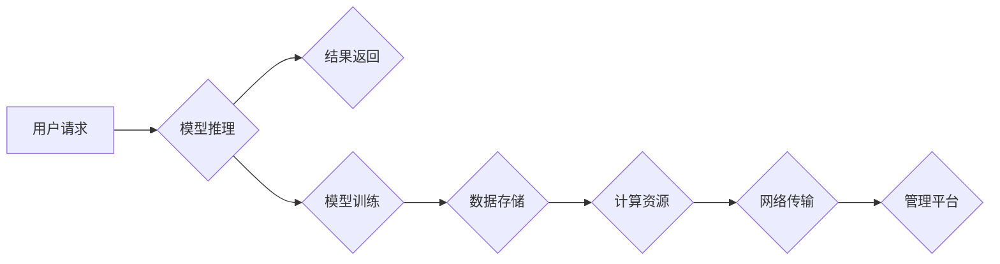

> AI大模型、数据中心、最佳实践、模型部署、性能优化、安全保障、可扩展性、成本控制

## 1. 背景介绍

近年来，人工智能（AI）技术取得了飞速发展，特别是大规模语言模型（LLM）的出现，为自然语言处理、计算机视觉、语音识别等领域带来了革命性的变革。这些强大的AI模型需要海量数据进行训练和推理，因此构建高效、可靠的AI大模型应用数据中心成为当务之急。

传统的IT基础设施难以满足AI大模型的计算、存储和网络需求。AI大模型应用数据中心需要具备以下特点：

* **高性能计算能力:** 支持大规模模型训练和推理，并能快速处理海量数据。
* **海量存储空间:** 存储庞大的模型参数、训练数据和推理结果。
* **高带宽网络:** 确保模型训练和推理过程中的数据传输效率。
* **灵活可扩展性:**  能够根据业务需求动态调整计算资源和存储容量。
* **安全可靠性:** 保护模型数据和训练环境的安全。
* **成本效益:** 优化资源利用率，降低运营成本。

## 2. 核心概念与联系

AI大模型应用数据中心是一个复杂的系统，涉及多个关键组件和技术，包括：

* **计算资源:**  GPU、TPU等高性能计算设备，用于模型训练和推理。
* **存储系统:**  分布式文件系统、对象存储等，用于存储模型参数、训练数据和推理结果。
* **网络架构:**  高速网络、网络加速器等，用于高效的数据传输。
* **管理平台:**  用于监控、管理和调度计算资源、存储资源和网络资源。
* **模型部署框架:**  用于将训练好的模型部署到生产环境中。

**Mermaid 流程图:**



## 3. 核心算法原理 & 具体操作步骤

### 3.1  算法原理概述

AI大模型的训练和推理主要基于深度学习算法，包括卷积神经网络（CNN）、循环神经网络（RNN）和Transformer等。这些算法通过多层神经网络结构，学习数据中的特征和模式，从而实现图像识别、自然语言处理等任务。

### 3.2  算法步骤详解

**模型训练:**

1. **数据预处理:** 将原始数据清洗、转换和格式化，使其适合模型训练。
2. **模型构建:** 根据任务需求选择合适的深度学习模型架构，并定义模型参数。
3. **模型训练:** 使用训练数据训练模型，通过反向传播算法调整模型参数，使模型预测结果与真实值尽可能接近。
4. **模型评估:** 使用验证数据评估模型的性能，并根据评估结果调整训练参数或模型结构。

**模型推理:**

1. **数据预处理:** 将输入数据进行预处理，使其符合模型的输入格式。
2. **模型预测:** 将预处理后的数据输入到训练好的模型中，模型根据学习到的特征和模式进行预测。
3. **结果输出:** 将模型预测结果进行后处理，并输出最终结果。

### 3.3  算法优缺点

**优点:**

* **高精度:** 深度学习算法能够学习数据中的复杂模式，实现高精度预测。
* **自动化学习:** 模型训练过程自动化程度高，无需人工特征工程。
* **可扩展性:** 深度学习模型可以并行训练和推理，并能根据需求扩展计算资源。

**缺点:**

* **数据依赖:** 深度学习模型对训练数据质量和数量要求较高。
* **计算资源消耗:** 模型训练和推理过程需要大量的计算资源。
* **可解释性差:** 深度学习模型的决策过程难以解释，缺乏透明度。

### 3.4  算法应用领域

深度学习算法广泛应用于以下领域:

* **计算机视觉:** 图像识别、物体检测、图像分割、人脸识别等。
* **自然语言处理:** 文本分类、情感分析、机器翻译、对话系统等。
* **语音识别:** 语音转文本、语音合成等。
* **推荐系统:** 商品推荐、内容推荐等。
* **医疗诊断:** 病情诊断、疾病预测等。

## 4. 数学模型和公式 & 详细讲解 & 举例说明

### 4.1  数学模型构建

深度学习模型的核心是神经网络，它由多个层级的神经元组成。每个神经元接收来自上一层的输入信号，并通过激活函数进行处理，输出到下一层。

**神经网络模型:**

$$
y = f(W^L x^L + b^L)
$$

其中:

* $y$ 是输出值
* $x^L$ 是上一层神经元的输出值
* $W^L$ 是当前层的权重矩阵
* $b^L$ 是当前层的偏置向量
* $f$ 是激活函数

### 4.2  公式推导过程

模型训练的目标是最小化预测值与真实值的误差。常用的误差函数是均方误差（MSE）：

$$
MSE = \frac{1}{N} \sum_{i=1}^{N} (y_i - \hat{y}_i)^2
$$

其中:

* $N$ 是样本数量
* $y_i$ 是真实值
* $\hat{y}_i$ 是预测值

通过梯度下降算法，不断调整模型参数，使误差函数最小化。

### 4.3  案例分析与讲解

**图像分类:**

假设我们训练一个图像分类模型，用于识别猫和狗的图片。模型的输入是图像像素值，输出是猫和狗的概率。

训练过程中，模型会学习到猫和狗的特征，例如耳朵形状、尾巴长度等。当输入一张新的图片时，模型会根据学习到的特征，预测图片中是猫还是狗。

## 5. 项目实践：代码实例和详细解释说明

### 5.1  开发环境搭建

* 操作系统: Ubuntu 20.04
* 编程语言: Python 3.8
* 深度学习框架: TensorFlow 2.x
* GPU: NVIDIA GeForce RTX 3090

### 5.2  源代码详细实现

```python
import tensorflow as tf

# 定义模型结构
model = tf.keras.models.Sequential([
    tf.keras.layers.Conv2D(32, (3, 3), activation='relu', input_shape=(28, 28, 1)),
    tf.keras.layers.MaxPooling2D((2, 2)),
    tf.keras.layers.Conv2D(64, (3, 3), activation='relu'),
    tf.keras.layers.MaxPooling2D((2, 2)),
    tf.keras.layers.Flatten(),
    tf.keras.layers.Dense(10, activation='softmax')
])

# 编译模型
model.compile(optimizer='adam',
              loss='sparse_categorical_crossentropy',
              metrics=['accuracy'])

# 训练模型
model.fit(x_train, y_train, epochs=10)

# 评估模型
loss, accuracy = model.evaluate(x_test, y_test)
print('Test loss:', loss)
print('Test accuracy:', accuracy)
```

### 5.3  代码解读与分析

* **模型结构:** 代码定义了一个简单的卷积神经网络模型，用于图像分类任务。模型包含两层卷积层、两层最大池化层、一层全连接层和一层输出层。
* **模型编译:** 使用Adam优化器、交叉熵损失函数和准确率指标编译模型。
* **模型训练:** 使用训练数据训练模型，训练10个 epochs。
* **模型评估:** 使用测试数据评估模型的性能，输出测试损失和准确率。

### 5.4  运行结果展示

训练完成后，模型的准确率通常会达到较高的水平。

## 6. 实际应用场景

AI大模型应用数据中心在各个领域都有广泛的应用场景:

* **金融科技:** 欺诈检测、风险评估、客户服务自动化等。
* **医疗健康:** 病情诊断、药物研发、医疗影像分析等。
* **制造业:** 质量控制、设备故障预测、生产优化等。
* **零售业:** 商品推荐、个性化营销、库存管理等。

### 6.4  未来应用展望

随着AI技术的不断发展，AI大模型应用数据中心的应用场景将更加广泛，例如:

* **智能驾驶:** 自动驾驶汽车的感知、决策和控制。
* **虚拟助手:** 更智能、更自然的语音助手和聊天机器人。
* **个性化教育:** 根据学生的学习情况提供个性化的学习内容和辅导。

## 7. 工具和资源推荐

### 7.1  学习资源推荐

* **书籍:**
    * 深度学习
    * 构建深度学习模型
* **在线课程:**
    * Coursera: 深度学习
    * Udacity: 深度学习工程师
* **博客和论坛:**
    * TensorFlow博客
    * PyTorch博客
    * Kaggle论坛

### 7.2  开发工具推荐

* **深度学习框架:** TensorFlow, PyTorch, Keras
* **云计算平台:** AWS, Azure, Google Cloud
* **数据存储系统:** Hadoop, Spark, MongoDB

### 7.3  相关论文推荐

* **Attention Is All You Need**
* **BERT: Pre-training of Deep Bidirectional Transformers for Language Understanding**
* **GPT-3: Language Models are Few-Shot Learners**

## 8. 总结：未来发展趋势与挑战

### 8.1  研究成果总结

近年来，AI大模型取得了显著的进展，在多个领域展现出强大的应用潜力。

### 8.2  未来发展趋势

* **模型规模和能力的提升:** 随着计算资源的不断发展，模型规模和能力将进一步提升，能够处理更复杂的任务。
* **模型训练效率的提高:** 研究人员将探索新的训练算法和硬件架构，提高模型训练效率。
* **模型可解释性和安全性:** 研究人员将致力于提高模型的可解释性和安全性，使其更易于理解和信任。

### 8.3  面临的挑战

* **数据获取和隐私保护:** AI大模型训练需要海量数据，如何获取高质量数据并保护用户隐私是一个挑战。
* **计算资源消耗:** AI大模型训练和推理需要大量的计算资源，如何降低能源消耗和成本是一个重要问题。
* **模型偏见和公平性:** AI模型可能存在偏见和不公平性，如何确保模型公平公正是一个需要解决的挑战。

### 8.4  研究展望

未来，AI大模型研究将继续朝着更强大、更智能、更安全的方向发展，为人类社会带来更多福祉。

## 9. 附录：常见问题与解答

**常见问题:**

* **如何选择合适的AI大模型？**

**解答:** 选择合适的AI大模型需要根据具体的应用场景和需求进行评估，考虑模型的精度、速度、参数量等因素。

* **如何部署AI大模型到生产环境？**

**解答:** 部署AI大模型到生产环境需要考虑模型的规模、性能、安全性等因素，可以使用容器化技术、云平台等工具进行部署。

* **如何评估AI大模型的性能？**

**解答:** AI大模型的性能可以通过准确率、召回率、F1-score等指标进行评估。

**作者：禅与计算机程序设计艺术 / Zen and the Art of Computer Programming**


<end_of_turn>