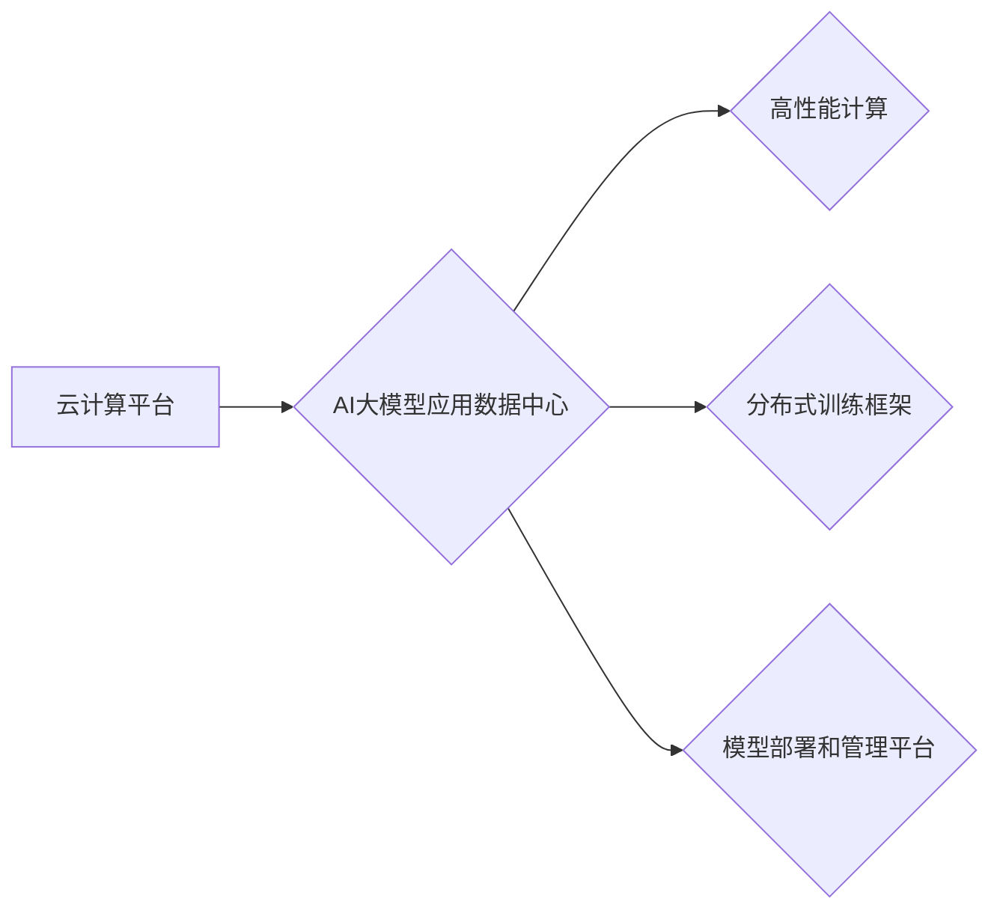

> AI大模型、数据中心、云计算、深度学习、机器学习、高性能计算、分布式训练

## 1. 背景介绍

近年来，人工智能（AI）技术取得了飞速发展，特别是深度学习算法的突破，使得大规模人工智能模型的训练和应用成为可能。这些大模型，例如GPT-3、BERT、DALL-E等，展现出强大的泛化能力和应用潜力，在自然语言处理、计算机视觉、语音识别等领域取得了令人瞩目的成果。

然而，训练和部署这些庞大的AI模型需要大量的计算资源和存储空间。传统的单机或小型集群架构已经难以满足需求，因此，构建专门用于AI大模型应用的数据中心成为必然趋势。

## 2. 核心概念与联系

**2.1 AI大模型应用数据中心概念**

AI大模型应用数据中心是指专门为训练、部署和管理大型AI模型而构建的计算密集型数据中心。它通常具备以下特点：

* **高性能计算能力:**  配备大量高性能CPU、GPU和TPU等加速器，以满足大模型训练和推理的计算需求。
* **海量存储空间:**  提供充足的存储空间，用于存储训练数据、模型参数和中间结果。
* **高效的网络架构:**  采用高速网络连接，实现数据中心内节点之间的高速数据传输。
* **分布式训练框架:**  支持分布式训练技术，将模型训练任务分解到多个节点上进行并行计算，加速训练速度。
* **模型部署和管理平台:**  提供模型部署、监控和管理工具，方便用户部署和管理AI模型。

**2.2  AI大模型应用数据中心与云计算的关系**

云计算平台为AI大模型应用数据中心提供了基础设施和服务，例如虚拟化、存储、网络等。许多云计算平台也提供专门的AI服务，例如AWS SageMaker、Google AI Platform、Azure Machine Learning等，帮助用户训练和部署AI模型。

**2.3  AI大模型应用数据中心与高性能计算的关系**

高性能计算（HPC）技术是AI大模型应用数据中心的基石。HPC技术提供高性能计算能力和数据处理能力，支持大规模数据分析和模型训练。

**Mermaid 流程图**



## 3. 核心算法原理 & 具体操作步骤

**3.1  算法原理概述**

深度学习算法是训练AI大模型的核心技术。常见的深度学习算法包括卷积神经网络（CNN）、循环神经网络（RNN）和Transformer等。这些算法通过多层神经网络结构，学习数据中的复杂特征和模式，从而实现对数据的理解和预测。

**3.2  算法步骤详解**

1. **数据预处理:** 将原始数据进行清洗、转换和格式化，使其适合深度学习算法的训练。
2. **模型构建:** 根据任务需求选择合适的深度学习算法架构，并定义模型参数。
3. **模型训练:** 使用训练数据训练模型，通过调整模型参数，使模型的预测结果与真实值尽可能接近。
4. **模型评估:** 使用测试数据评估模型的性能，例如准确率、召回率、F1-score等。
5. **模型调优:** 根据评估结果，调整模型参数或架构，进一步提高模型性能。
6. **模型部署:** 将训练好的模型部署到生产环境中，用于实际应用。

**3.3  算法优缺点**

**优点:**

* 强大的泛化能力：深度学习算法能够学习数据中的复杂特征，对未知数据具有较强的泛化能力。
* 高精度：深度学习算法在许多任务中能够达到很高的精度。
* 自动特征提取：深度学习算法能够自动提取数据的特征，无需人工特征工程。

**缺点:**

* 数据依赖性强：深度学习算法需要大量的训练数据才能达到较好的性能。
* 计算资源消耗大：训练深度学习模型需要大量的计算资源和时间。
* 可解释性差：深度学习模型的决策过程比较复杂，难以解释模型的决策结果。

**3.4  算法应用领域**

深度学习算法在各个领域都有广泛的应用，例如：

* **自然语言处理:** 文本分类、情感分析、机器翻译、对话系统等。
* **计算机视觉:** 图像识别、物体检测、图像分割、视频分析等。
* **语音识别:** 语音转文本、语音合成、语音助手等。
* **推荐系统:** 商品推荐、内容推荐、用户画像等。
* **医疗诊断:** 病情诊断、疾病预测、药物研发等。

## 4. 数学模型和公式 & 详细讲解 & 举例说明

**4.1  数学模型构建**

深度学习模型本质上是一个复杂的数学模型，其核心是神经网络结构和激活函数。

* **神经网络结构:** 神经网络由多个层组成，每一层包含多个神经元。神经元之间通过连接权重进行信息传递。

* **激活函数:** 激活函数作用于神经元的输入，将输入映射到输出，引入非线性，使神经网络能够学习复杂的数据关系。常见的激活函数包括ReLU、Sigmoid、Tanh等。

**4.2  公式推导过程**

深度学习模型的训练过程基于梯度下降算法，其目标是找到最优的模型参数，使得模型的预测结果与真实值之间的误差最小化。

* **损失函数:** 损失函数用于衡量模型预测结果与真实值的差异。常见的损失函数包括均方误差（MSE）、交叉熵损失等。

* **梯度下降算法:** 梯度下降算法通过迭代更新模型参数，逐步降低损失函数的值。

**4.3  案例分析与讲解**

以卷积神经网络（CNN）为例，其数学模型可以表示为：

$$
y = f(W_L * ReLU(W_{L-1} * ... * ReLU(W_1 * x)) + b_L)
$$

其中：

* $x$ 是输入数据
* $W_i$ 是第 $i$ 层的卷积核
* $ReLU$ 是ReLU激活函数
* $b_i$ 是第 $i$ 层的偏置项
* $f$ 是输出层激活函数
* $y$ 是模型输出

## 5. 项目实践：代码实例和详细解释说明

**5.1  开发环境搭建**

* 操作系统：Ubuntu 20.04
* Python 版本：3.8
* 深度学习框架：TensorFlow 2.x

**5.2  源代码详细实现**

```python
import tensorflow as tf

# 定义模型结构
model = tf.keras.models.Sequential([
    tf.keras.layers.Conv2D(32, (3, 3), activation='relu', input_shape=(28, 28, 1)),
    tf.keras.layers.MaxPooling2D((2, 2)),
    tf.keras.layers.Conv2D(64, (3, 3), activation='relu'),
    tf.keras.layers.MaxPooling2D((2, 2)),
    tf.keras.layers.Flatten(),
    tf.keras.layers.Dense(10, activation='softmax')
])

# 编译模型
model.compile(optimizer='adam',
              loss='sparse_categorical_crossentropy',
              metrics=['accuracy'])

# 加载数据集
(x_train, y_train), (x_test, y_test) = tf.keras.datasets.mnist.load_data()

# 数据预处理
x_train = x_train.astype('float32') / 255.0
x_test = x_test.astype('float32') / 255.0
x_train = x_train.reshape((x_train.shape[0], 28, 28, 1))
x_test = x_test.reshape((x_test.shape[0], 28, 28, 1))

# 训练模型
model.fit(x_train, y_train, epochs=5)

# 评估模型
loss, accuracy = model.evaluate(x_test, y_test)
print('Test loss:', loss)
print('Test accuracy:', accuracy)
```

**5.3  代码解读与分析**

* 代码首先定义了卷积神经网络的模型结构，包括卷积层、池化层和全连接层。
* 然后，模型被编译，指定了优化器、损失函数和评估指标。
* MNIST数据集被加载并预处理，转换为适合模型输入的格式。
* 模型被训练，训练过程持续5个epochs。
* 最后，模型在测试集上的性能被评估，输出测试损失和准确率。

**5.4  运行结果展示**

运行代码后，会输出测试损失和准确率。通常情况下，训练后的模型在测试集上能够达到较高的准确率，例如98%以上。

## 6. 实际应用场景

**6.1  图像识别**

AI大模型应用数据中心可以用于构建高精度图像识别系统，例如：

* **人脸识别:** 用于身份验证、安全监控等场景。
* **物体检测:** 用于自动驾驶、安防监控等场景。
* **图像分类:** 用于医疗影像诊断、产品分类等场景。

**6.2  自然语言处理**

AI大模型应用数据中心可以用于构建强大的自然语言处理系统，例如：

* **机器翻译:** 将文本从一种语言翻译成另一种语言。
* **文本摘要:** 自动生成文本的简短摘要。
* **对话系统:** 与用户进行自然语言对话。

**6.3  语音识别**

AI大模型应用数据中心可以用于构建高准确率的语音识别系统，例如：

* **语音转文本:** 将语音转换为文本。
* **语音助手:** 理解用户的语音指令，并执行相应的操作。

**6.4  未来应用展望**

随着AI技术的不断发展，AI大模型应用数据中心将在更多领域得到应用，例如：

* **个性化推荐:** 根据用户的兴趣和行为，提供个性化的商品、内容和服务推荐。
* **医疗诊断辅助:** 辅助医生进行疾病诊断，提高诊断准确率。
* **科学研究:** 加速科学研究，例如药物研发、材料科学等。

## 7. 工具和资源推荐

**7.1  学习资源推荐**

* **深度学习课程:** Coursera、edX、Udacity等平台提供丰富的深度学习课程。
* **深度学习书籍:** 《深度学习》、《动手学深度学习》等书籍是深度学习学习的经典教材。
* **在线社区:** TensorFlow、PyTorch等深度学习框架的官方网站和社区论坛提供丰富的学习资源和技术支持。

**7.2  开发工具推荐**

* **深度学习框架:** TensorFlow、PyTorch、Keras等深度学习框架提供丰富的工具和API，方便用户构建和训练深度学习模型。
* **云计算平台:** AWS、Google Cloud、Azure等云计算平台提供AI服务和计算资源，方便用户训练和部署深度学习模型。

**7.3  相关论文推荐**

* **ImageNet Classification with Deep Convolutional Neural Networks**
* **Attention Is All You Need**
* **BERT: Pre-training of Deep Bidirectional Transformers for Language Understanding**

## 8. 总结：未来发展趋势与挑战

**8.1  研究成果总结**

近年来，AI大模型在各个领域取得了显著的成果，例如图像识别、自然语言处理、语音识别等。这些成果推动了AI技术的快速发展，并为社会带来了巨大的价值。

**8.2  未来发展趋势**

* **模型规模的进一步扩大:** 未来，AI模型的规模将继续扩大，模型参数数量将达到数千亿甚至万亿级别。
* **模型训练效率的提升:** 研究人员将继续探索新的训练方法和算法，提高模型训练效率。
* **模型泛化能力的增强:** 研究人员将致力于提高模型的泛化能力，使其能够更好地适应新的数据和任务。
* **模型解释性和可解释性的提升:** 研究人员将致力于提高模型的解释性和可