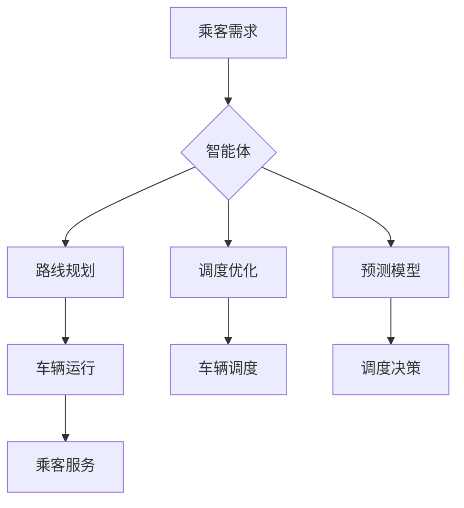

> AI人工智能, 智能体, 公共交通调度, 智能算法, 优化算法, 预测模型, 机器学习, 深度学习

## 1. 背景介绍

随着城市化进程的加速和人口规模的不断增长，公共交通系统面临着日益严峻的挑战。传统的公共交通调度方式难以有效应对复杂的交通流量、实时路况变化和乘客需求波动等问题，导致了拥堵、延误、服务效率低下等现象。

人工智能（AI）技术的快速发展为公共交通调度提供了新的解决方案。AI智能体能够通过学习和分析海量数据，智能地规划路线、优化调度、预测乘客需求等，从而提高公共交通系统的效率、可靠性和用户体验。

## 2. 核心概念与联系

**2.1 智能体**

智能体是指能够感知环境、做出决策并与环境交互的系统。在公共交通调度领域，智能体可以理解为一个能够自主学习和决策的软件代理，它负责规划和执行公共交通车辆的运行路线和调度方案。

**2.2 公共交通调度**

公共交通调度是指协调和管理公共交通车辆的运行，以满足乘客需求、优化资源配置和提高系统效率的过程。

**2.3 AI智能体在公共交通调度中的应用**

AI智能体可以应用于公共交通调度各个环节，例如：

* **路线规划:** 根据实时路况、乘客需求和车辆位置等信息，智能体可以规划最优的运行路线，避免拥堵和延误。
* **调度优化:** 智能体可以根据乘客需求、车辆状态和交通流量等因素，优化车辆调度方案，提高车辆利用率和服务效率。
* **预测模型:** 智能体可以利用历史数据和实时信息，预测乘客需求、交通流量和车辆故障等，为调度决策提供依据。

**2.4 架构图**



## 3. 核心算法原理 & 具体操作步骤

**3.1 算法原理概述**

公共交通调度中的AI智能体通常采用基于机器学习和优化算法的解决方案。

* **机器学习:** 用于训练预测模型，例如预测乘客需求、交通流量和车辆故障等。
* **优化算法:** 用于规划路线、优化调度方案，例如遗传算法、模拟退火算法、粒子群算法等。

**3.2 算法步骤详解**

1. **数据收集和预处理:** 收集公共交通系统相关数据，例如乘客出行轨迹、车辆位置、路况信息、天气预报等，并进行清洗、转换和格式化。
2. **特征工程:** 从原始数据中提取有价值的特征，例如乘客出行时间、目的地、交通拥堵程度等，用于训练机器学习模型。
3. **模型训练:** 利用机器学习算法，例如回归模型、分类模型、时间序列模型等，训练预测模型，并评估模型性能。
4. **调度方案生成:** 根据预测模型的输出结果和优化算法的计算，生成不同的调度方案，例如车辆运行路线、调度时间、车辆分配等。
5. **方案评估和选择:** 对生成的调度方案进行评估，例如效率、可靠性、乘客满意度等，选择最优方案。
6. **方案执行和监控:** 将选定的调度方案执行到实际系统中，并实时监控系统运行情况，及时调整调度方案。

**3.3 算法优缺点**

* **优点:**
    * 能够根据实时数据动态调整调度方案，提高效率和可靠性。
    * 能够预测乘客需求和交通流量，优化资源配置。
    * 能够个性化服务乘客，提供更便捷的出行体验。
* **缺点:**
    * 需要大量的数据进行训练和评估，数据质量对模型性能有重要影响。
    * 算法复杂度较高，计算资源需求大。
    * 需要考虑数据安全和隐私保护问题。

**3.4 算法应用领域**

* 公共交通调度
* 路网规划
* 运输物流
* 医疗资源调度
* 应急救援

## 4. 数学模型和公式 & 详细讲解 & 举例说明

**4.1 数学模型构建**

公共交通调度问题可以建模为一个优化问题，目标是找到最优的调度方案，以最小化总的成本或最大化系统效益。

**4.2 公式推导过程**

* **成本函数:**

$$
C = \sum_{i=1}^{n} c_i \cdot d_i
$$

其中：

* $C$ 为总成本
* $n$ 为车辆数量
* $c_i$ 为第 $i$ 辆车的运行成本
* $d_i$ 为第 $i$ 辆车的行驶距离

* **效益函数:**

$$
E = \sum_{j=1}^{m} b_j \cdot p_j
$$

其中：

* $E$ 为总效益
* $m$ 为乘客数量
* $b_j$ 为第 $j$ 个乘客的效益
* $p_j$ 为第 $j$ 个乘客的满意度

**4.3 案例分析与讲解**

假设有 3 辆公交车，需要调度到 5 个站点，每个站点有不同的乘客需求和路况情况。

* 我们可以使用成本函数来计算每辆车的运行成本，例如油费、人工成本等。
* 我们可以使用效益函数来计算乘客的满意度，例如等待时间、出行时间等。
* 通过优化算法，例如遗传算法，我们可以找到最优的调度方案，以最小化总成本或最大化总效益。

## 5. 项目实践：代码实例和详细解释说明

**5.1 开发环境搭建**

* 操作系统：Ubuntu 20.04
* Python 版本：3.8
* 必要的库：pandas, numpy, scikit-learn, matplotlib, seaborn

**5.2 源代码详细实现**

```python
import pandas as pd
from sklearn.linear_model import LinearRegression

# 数据加载
data = pd.read_csv('traffic_data.csv')

# 特征工程
features = ['hour', 'day', 'weather']
target = 'traffic_volume'

# 模型训练
model = LinearRegression()
model.fit(data[features], data[target])

# 预测
new_data = pd.DataFrame({'hour': [10], 'day': [1], 'weather': ['sunny']})
prediction = model.predict(new_data)

print(f'预测的交通流量为: {prediction[0]}')
```

**5.3 代码解读与分析**

* 代码首先加载交通数据，并进行特征工程，提取相关特征和目标变量。
* 然后使用线性回归模型训练预测模型。
* 最后使用训练好的模型预测新的交通流量。

**5.4 运行结果展示**

运行代码后，会输出预测的交通流量值。

## 6. 实际应用场景

**6.1 公共交通调度优化**

AI智能体可以帮助公共交通运营商优化车辆调度方案，提高车辆利用率、缩短乘客等待时间、减少拥堵和延误。

**6.2 智能路线规划**

AI智能体可以根据实时路况、乘客需求和车辆位置等信息，为乘客规划最优的出行路线，避免拥堵和延误。

**6.3 预防性维护**

AI智能体可以分析车辆运行数据，预测车辆故障风险，并提醒运营商进行预防性维护，降低车辆故障率和维护成本。

**6.4 未来应用展望**

* **个性化服务:** AI智能体可以根据乘客的出行习惯、偏好和需求，提供个性化的出行方案和服务。
* **自动驾驶:** AI智能体可以与自动驾驶车辆协同工作，实现无人驾驶公共交通系统。
* **多模态交通:** AI智能体可以整合不同交通方式的信息，为乘客提供多模态交通出行方案。

## 7. 工具和资源推荐

**7.1 学习资源推荐**

* **书籍:**
    * 《人工智能：一种现代方法》
    * 《深度学习》
* **在线课程:**
    * Coursera: 人工智能
    * edX: 深度学习
* **开源项目:**
    * TensorFlow
    * PyTorch

**7.2 开发工具推荐**

* **编程语言:** Python
* **机器学习库:** scikit-learn, TensorFlow, PyTorch
* **数据可视化工具:** matplotlib, seaborn

**7.3 相关论文推荐**

* **交通调度优化:**
    * "A Reinforcement Learning Approach to Public Transportation Scheduling"
    * "Traffic Flow Optimization Using Deep Reinforcement Learning"
* **预测模型:**
    * "Predicting Public Transportation Demand Using Machine Learning"
    * "A Deep Learning Approach to Traffic Flow Forecasting"

## 8. 总结：未来发展趋势与挑战

**8.1 研究成果总结**

AI智能体在公共交通调度领域取得了显著的成果，能够有效提高调度效率、优化资源配置和提升乘客体验。

**8.2 未来发展趋势**

* **更精准的预测模型:** 利用更先进的机器学习算法和更丰富的传感器数据，提高预测模型的精度和可靠性。
* **更智能的调度方案:** 利用强化学习等算法，使调度方案更加智能化、自适应和动态调整。
* **更个性化的服务:** 利用大数据分析和用户画像技术，为乘客提供更加个性化的出行方案和服务。

**8.3 面临的挑战**

* **数据质量和隐私保护:** 确保数据质量和安全，保护乘客隐私信息。
* **算法复杂度和计算资源:** 降低算法复杂度，提高计算效率，降低对计算资源的需求。
* **系统可靠性和安全性:** 确保系统可靠性和安全性，避免系统故障和安全漏洞。

**8.4 研究展望**

未来，AI智能体在公共交通调度领域将继续发挥重要作用，推动公共交通系统向智能化、高效化和人性化方向发展。


## 9. 附录：常见问题与解答

**9.1 如何保证AI智能体的准确性？**

AI智能体的准确性取决于训练数据的质量和模型的复杂度。需要使用高质量的数据进行训练，并不断优化模型参数，以提高预测精度。

**9.2 如何保护乘客隐私信息？**

在设计AI智能体时，需要充分考虑数据安全和隐私保护问题。可以采用数据匿名化、加密等技术，保护乘客隐私信息。

**9.3 AI智能体是否会取代人类调度员？**

AI智能体可以辅助人类调度员完成工作，提高效率和准确性，但不会完全取代人类调度员。人类调度员仍然需要负责决策、解决复杂问题和处理突发事件。


作者：禅与计算机程序设计艺术 / Zen and the Art of Computer Programming 
<end_of_turn>