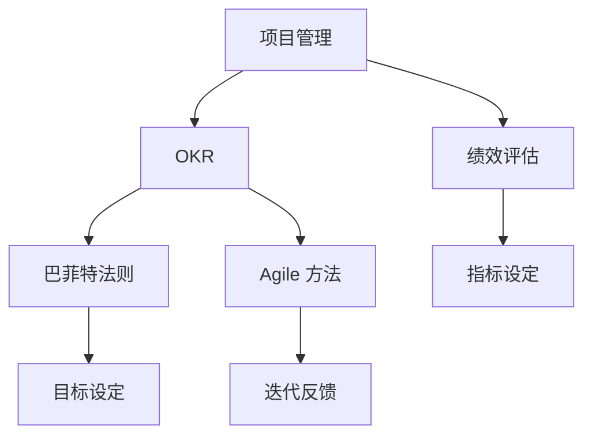

                 

# 巴菲特目标管理法则在项目管理中的应用

> 关键词：项目管理,目标管理,绩效评估,巴菲特法则,OKR

## 1. 背景介绍

### 1.1 问题由来
在当今快速变化的企业环境中，项目管理（Project Management）变得日益复杂和多元化。传统的项目管理方法，如瀑布模型、敏捷方法等，虽然各有优势，但在处理多目标、动态变化的项目时，往往难以兼顾效率和效果。而巴菲特目标管理法则，作为一种全新的管理理念，通过明确的、可衡量的目标，帮助企业快速响应市场变化，提高项目管理效率。

### 1.2 问题核心关键点
巴菲特目标管理法则的核心是OKR（Objectives and Key Results），即目标与关键成果。该方法通过设定清晰的、量化的目标，以及一系列可衡量、可实现的关键结果，帮助团队聚焦重点，高效执行，不断优化业务。

### 1.3 问题研究意义
在现代企业中，有效的项目管理是保证企业战略目标实现、提升企业竞争力的关键。巴菲特目标管理法则通过明确的目标管理，帮助企业构建高效的执行体系，优化资源配置，快速响应市场变化，从而提升整体绩效。

## 2. 核心概念与联系

### 2.1 核心概念概述

为更好地理解巴菲特目标管理法则在项目管理中的应用，本节将介绍几个关键概念：

- **项目管理**：指对项目的策划、实施和控制，以确保项目按预算、按时间、按质量完成。
- **OKR**：目标与关键结果，是巴菲特目标管理法则的核心，通过设定具体、可量化的目标和关键成果，驱动团队和个体提升绩效。
- **绩效评估**：通过设定关键指标，评估项目执行的效果，确保目标的实现。
- **巴菲特法则**：由著名投资者沃伦·巴菲特提出的管理理念，强调通过设定清晰的目标，驱动企业绩效提升。
- **Agile 方法**：一种迭代、自适应的项目管理方法，通过小步快跑、快速反馈，实现项目目标。

这些核心概念之间的逻辑关系可以通过以下Mermaid流程图来展示：



这个流程图展示了一体化的项目管理框架，其中OKR作为核心，将目标设定和关键结果量化，指导Agile方法的迭代执行，并通过绩效评估确保目标实现。巴菲特法则强调通过明确目标，提升绩效，与OKR相辅相成。

## 3. 核心算法原理 & 具体操作步骤
### 3.1 算法原理概述

巴菲特目标管理法则的核心是OKR方法，其算法原理包括以下几个关键点：

1. **目标设定**：设定明确、可量化的目标，确保团队对业务方向有清晰的认知。
2. **关键结果设定**：设定与目标紧密相关的关键成果，确保目标的实现具有可操作性。
3. **绩效评估**：通过设定关键指标，评估目标实现的进度和效果。
4. **迭代反馈**：在项目执行过程中，不断收集反馈，调整策略，确保项目按预期推进。

OKR方法的具体实现步骤如下：

1. 高层管理团队设定公司级OKR，涵盖业务战略目标和关键成果。
2. 各团队根据公司级OKR，设定部门级或团队级OKR，确保部门目标与公司目标对齐。
3. 每个OKR包含一个目标（Objective）和2-4个关键成果（Key Results）。
4. 每个关键成果设定具体、可衡量的指标，如完成时间、成本、质量等。
5. 通过定期评估和反馈，调整OKR和策略，确保目标实现。

### 3.2 算法步骤详解

#### 3.2.1 目标设定

目标设定是OKR方法的核心步骤，通过设定明确、可量化的目标，确保团队对业务方向有清晰的认知。目标通常采用动词+名词的形式，如“提高销售额10%”，“开发新功能X”等。目标应具备以下特点：

1. **具体明确**：目标应清晰定义，避免模糊。如“提高用户满意度”不如“提高用户满意度5%”。
2. **可衡量**：目标应具有可量化的指标，方便评估进度和效果。
3. **可实现**：目标应具有现实性，避免过于激进。
4. **相关性**：目标应与公司战略和团队职责紧密相关，确保目标对齐。

#### 3.2.2 关键结果设定

关键结果（Key Results, KR）是与目标紧密相关的具体成果，通过设定具体的、可衡量的指标，确保目标的实现。每个OKR包含2-4个关键结果，每个关键结果对应一个具体、可量化的指标。

关键结果的设定应遵循以下原则：

1. **可实现**：关键结果应具有可操作性，避免过于理想化。
2. **可衡量**：关键结果应具有明确的衡量指标，如时间、成本、质量等。
3. **相关性**：关键结果应与目标紧密相关，确保目标实现。

#### 3.2.3 绩效评估

绩效评估是通过设定关键指标，评估目标实现的进度和效果。常用的关键指标包括：

1. **完成时间**：目标实现的截止时间。
2. **完成度**：目标实现的进度。
3. **成本**：目标实现的成本。
4. **质量**：目标实现的质量。

通过定期评估关键指标，团队可以及时发现问题，调整策略，确保目标实现。

#### 3.2.4 迭代反馈

在项目执行过程中，团队应不断收集反馈，调整策略，确保项目按预期推进。常见的反馈方式包括：

1. **定期会议**：定期召开团队会议，讨论项目进展和问题。
2. **进度报告**：定期提交进度报告，确保高层管理团队了解项目进展。
3. **绩效评估**：定期评估关键指标，发现问题和改进空间。

通过持续的反馈和调整，团队可以更高效地实现目标，提升项目管理绩效。

### 3.3 算法优缺点

巴菲特目标管理法则的OKR方法具有以下优点：

1. **明确目标**：通过设定清晰的目标，确保团队对业务方向有明确的认知。
2. **量化成果**：通过设定关键结果，确保目标的实现具有可操作性。
3. **高效执行**：通过定期评估和反馈，团队可以及时调整策略，确保项目按预期推进。

同时，该方法也存在一定的局限性：

1. **目标设定难度**：明确、量化的目标设定较为困难，需要高层管理团队的深度参与。
2. **执行难度**：在执行过程中，团队需要持续的反馈和调整，工作量较大。
3. **灵活性不足**：一旦目标设定，调整难度较大，可能难以应对突发情况。

尽管存在这些局限性，但就目前而言，OKR方法仍是大规模项目管理的重要范式。未来相关研究的重点在于如何进一步优化目标设定流程，提高执行效率，同时兼顾灵活性。

### 3.4 算法应用领域

巴菲特目标管理法则的OKR方法，已经在项目管理、组织管理、企业战略规划等多个领域得到了广泛应用，具体包括：

1. **项目管理**：在项目管理中，OKR方法通过设定明确的目标和关键成果，确保项目按预算、按时间、按质量完成。
2. **组织管理**：在组织管理中，OKR方法通过设定明确的目标和关键成果，驱动团队聚焦重点，提升整体绩效。
3. **企业战略规划**：在企业战略规划中，OKR方法通过设定明确的目标和关键成果，确保企业战略目标的实现。
4. **产品开发**：在产品开发中，OKR方法通过设定明确的目标和关键成果，驱动产品团队快速迭代，提升产品竞争力。

除了上述这些应用领域外，OKR方法还被创新性地应用到更多场景中，如市场推广、客户关系管理、运营优化等，为项目管理提供了新的视角和工具。

## 4. 数学模型和公式 & 详细讲解 & 举例说明

### 4.1 数学模型构建

OKR方法的核心是目标设定和关键成果量化。通过设定具体、可量化的目标和关键成果，驱动团队和个体提升绩效。以下以项目管理的OKR为例，构建数学模型。

假设项目目标为“提高产品销售额10%”，设定的关键成果为“实现销售额增长10%”，具体的关键指标包括：

- **完成时间**：设定截止时间为“2023年12月31日”。
- **完成度**：设定目标完成度为“80%”。
- **成本**：设定目标成本为“500万元”。
- **质量**：设定目标质量为“A级”。

将这些指标纳入数学模型中，我们可以得到以下公式：

$$
\text{目标完成度} = \frac{\text{实际销售额}}{\text{目标销售额}}
$$

$$
\text{成本完成度} = \frac{\text{实际成本}}{\text{目标成本}}
$$

$$
\text{质量评分} = \text{A级评分的具体数值}
$$

### 4.2 公式推导过程

目标完成度的计算公式如下：

$$
\text{目标完成度} = \frac{\text{实际销售额}}{\text{目标销售额}} \times 100\%
$$

其中，实际销售额为项目执行过程中实际实现的总销售额，目标销售额为项目目标设定时预期的总销售额。通过计算目标完成度，团队可以评估项目执行的进度，及时发现偏差，进行调整。

成本完成度的计算公式如下：

$$
\text{成本完成度} = \frac{\text{实际成本}}{\text{目标成本}} \times 100\%
$$

其中，实际成本为项目执行过程中实际发生的总成本，目标成本为项目目标设定时预期的总成本。通过计算成本完成度，团队可以评估项目执行的成本效益，及时发现偏差，进行调整。

质量评分的计算公式如下：

$$
\text{质量评分} = \text{实际质量评分} - \text{目标质量评分} \times 100\%
$$

其中，实际质量评分为项目执行过程中实际实现的质量评分，目标质量评分为项目目标设定时预期的质量评分。通过计算质量评分，团队可以评估项目执行的质量水平，及时发现偏差，进行调整。

### 4.3 案例分析与讲解

假设某公司项目团队设定了以下OKR：

**目标**：“提高产品销售额10%”

**关键结果**：
- **关键成果1**：“实现销售额增长10%”
  - 关键指标：完成时间=2023年12月31日，完成度=80%，成本=500万元，质量=A级
- **关键成果2**：“提高市场份额5%”
  - 关键指标：完成时间=2023年12月31日，完成度=70%，成本=300万元，质量=B级

在项目执行过程中，团队不断收集反馈，调整策略，确保项目按预期推进。例如，在2023年9月，团队发现市场份额未达标，及时调整策略，优化产品营销方案，最终在2023年12月成功实现目标。

通过定期评估关键指标，团队可以及时发现问题和改进空间，确保项目目标的实现。

## 5. 项目实践：代码实例和详细解释说明

### 5.1 开发环境搭建

在进行OKR项目管理实践前，我们需要准备好开发环境。以下是使用Python进行OKR管理的开发环境配置流程：

1. 安装Python：从官网下载并安装Python，确保版本为3.8以上。
2. 安装Pandas和Matplotlib：通过pip命令进行安装，用于数据处理和可视化。

```bash
pip install pandas matplotlib
```

3. 安装OKR管理工具：如Trello、Asana等，选择合适的工具进行项目管理和OKR设定。

### 5.2 源代码详细实现

下面我们以Python实现OKR管理为例，给出完整的代码实现。

```python
import pandas as pd
import matplotlib.pyplot as plt

# 定义OKR类
class OKR:
    def __init__(self, objective, key_results):
        self.objective = objective
        self.key_results = key_results
        self.metric_names = ["完成时间", "完成度", "成本", "质量评分"]
        self.metric_values = [0] * 4
    
    def set_metrics(self, metric_names, metric_values):
        self.metric_names = metric_names
        self.metric_values = metric_values
    
    def calculate_metrics(self, actual_values):
        self.metric_values = []
        for i, metric_name in enumerate(self.metric_names):
            if metric_name == "完成度":
                self.metric_values.append((actual_values[i] / self.key_results[i]) * 100)
            elif metric_name == "成本完成度":
                self.metric_values.append((actual_values[i] / self.key_results[i]) * 100)
            elif metric_name == "质量评分":
                self.metric_values.append(actual_values[i] - self.key_results[i] * 100)
    
    def plot_metrics(self):
        plt.bar(self.metric_names, self.metric_values)
        plt.xlabel("关键指标")
        plt.ylabel("完成度")
        plt.title("OKR完成度图表")
        plt.show()

# 创建OKR实例
okr = OKR("提高产品销售额10%", {"销售额增长10%": [2023年12月31日, 80, 500, "A级"], "市场份额提高5%": [2023年12月31日, 70, 300, "B级"]})

# 设置关键指标
okr.set_metrics(["完成时间", "完成度", "成本完成度", "质量评分"])

# 假设项目实际完成情况
actual_values = [800, 90, 450, "A+"]

# 计算关键指标完成度
okr.calculate_metrics(actual_values)

# 绘制完成度图表
okr.plot_metrics()
```

### 5.3 代码解读与分析

让我们再详细解读一下关键代码的实现细节：

**OKR类**：
- `__init__`方法：初始化目标和关键成果，定义关键指标名称和初始值。
- `set_metrics`方法：设置关键指标名称和初始值。
- `calculate_metrics`方法：根据实际完成情况，计算关键指标完成度。
- `plot_metrics`方法：绘制关键指标完成度图表，用于可视化展示。

**OKR实例创建**：
- 创建一个OKR实例，设定目标和关键成果，初始化关键指标名称和初始值。

**关键指标计算**：
- 假设项目实际完成情况，设定实际完成指标值。
- 通过调用`calculate_metrics`方法，计算关键指标完成度。

**关键指标可视化**：
- 调用`plot_metrics`方法，绘制关键指标完成度图表，直观展示项目进展。

## 6. 实际应用场景

### 6.1 项目管理

在项目管理中，OKR方法通过设定明确的目标和关键成果，确保项目按预算、按时间、按质量完成。例如，某软件开发项目团队设定了以下OKR：

**目标**：“在6个月内完成产品开发并上市”

**关键成果**：
- **关键成果1**：“开发完成3个核心功能模块”
  - 关键指标：完成时间=6个月，完成度=100%，成本=100万元，质量=A级
- **关键成果2**：“获取50家客户反馈并优化”
  - 关键指标：完成时间=6个月，完成度=80%，成本=20万元，质量=B级

通过设定具体、可量化的目标和关键成果，团队可以聚焦重点，高效执行，确保项目按预期推进。

### 6.2 组织管理

在组织管理中，OKR方法通过设定明确的目标和关键成果，驱动团队聚焦重点，提升整体绩效。例如，某企业的市场营销团队设定了以下OKR：

**目标**：“提升品牌知名度10%”

**关键成果**：
- **关键成果1**：“增加社交媒体关注度5%”
  - 关键指标：完成时间=6个月，完成度=90%，成本=20万元，质量=A级
- **关键成果2**：“提高网站访问量5%”
  - 关键指标：完成时间=6个月，完成度=85%，成本=15万元，质量=B级

通过设定具体、可量化的目标和关键成果，团队可以聚焦重点，提升整体绩效，驱动企业发展。

### 6.3 企业战略规划

在企业战略规划中，OKR方法通过设定明确的目标和关键成果，确保企业战略目标的实现。例如，某公司的整体战略目标是“在5年内成为行业领导者”，具体OKR如下：

**目标**：“在5年内成为行业领导者”

**关键成果**：
- **关键成果1**：“市场份额达到20%”
  - 关键指标：完成时间=5年，完成度=100%，成本=2000万元，质量=A级
- **关键成果2**：“客户满意度达到90%”
  - 关键指标：完成时间=5年，完成度=95%，成本=1000万元，质量=B级

通过设定具体、可量化的目标和关键成果，企业可以确保战略目标的实现，提升整体绩效。

## 7. 工具和资源推荐

### 7.1 学习资源推荐

为了帮助开发者系统掌握OKR项目管理的方法和实践，这里推荐一些优质的学习资源：

1. **OKR管理培训课程**：如《OKR管理实践》系列课程，由知名管理专家讲授，系统介绍OKR方法的理论和实践。
2. **OKR管理书籍**：如《OKR：目标管理新实践》，详细讲解OKR方法的应用和优化。
3. **OKR管理工具**：如Trello、Asana、Notion等，提供丰富的OKR管理模板和工具。
4. **OKR管理社区**：如OKR World，提供丰富的OKR实践案例和经验分享。

通过对这些资源的学习实践，相信你一定能够快速掌握OKR项目管理的方法，并应用于实际工作中。

### 7.2 开发工具推荐

高效的OKR项目管理离不开优秀的工具支持。以下是几款用于OKR管理开发的常用工具：

1. **Trello**：提供可视化任务管理和OKR设定，方便团队协作和目标跟踪。
2. **Asana**：支持详细的任务描述和进度追踪，适用于复杂项目管理。
3. **Notion**：提供强大的文档协作和任务管理功能，适用于敏捷项目管理。
4. **Jira**：提供全面的项目管理和OKR设定功能，支持复杂的项目计划和追踪。

合理利用这些工具，可以显著提升OKR项目管理任务的开发效率，加快创新迭代的步伐。

### 7.3 相关论文推荐

OKR项目管理方法的研究源于学界的持续研究。以下是几篇奠基性的相关论文，推荐阅读：

1. **OKR: The Simple Ideology**：沃伦·巴菲特关于OKR方法的经典演讲，阐述了OKR方法的核心思想。
2. **The OKR Playbook**：知名管理咨询公司Advisory Board的研究报告，详细讲解OKR方法的应用和优化。
3. **The OKR: The Science of Goal Setting and Its Management**：学术研究论文，探讨OKR方法的科学基础和管理机制。

这些论文代表了大规模项目管理的发展脉络。通过学习这些前沿成果，可以帮助研究者把握学科前进方向，激发更多的创新灵感。

## 8. 总结：未来发展趋势与挑战

### 8.1 总结

本文对巴菲特目标管理法则在项目管理中的应用进行了全面系统的介绍。首先阐述了OKR方法的背景和意义，明确了OKR方法在项目管理中的独特价值。其次，从原理到实践，详细讲解了OKR方法的数学模型和关键步骤，给出了OKR项目管理的完整代码实例。同时，本文还广泛探讨了OKR方法在项目管理、组织管理、企业战略规划等多个领域的应用前景，展示了OKR方法的巨大潜力。此外，本文精选了OKR方法的学习资源，力求为读者提供全方位的技术指引。

通过本文的系统梳理，可以看到，OKR方法作为一种高效的项目管理工具，已经在各行各业得到了广泛应用，显著提升了项目管理效率和企业绩效。未来，伴随OKR方法的不断演进，相信项目管理技术将迈向更高的台阶，为组织发展提供更强的动力。

### 8.2 未来发展趋势

展望未来，OKR方法将呈现以下几个发展趋势：

1. **工具智能化**：伴随AI技术的普及，OKR管理工具将更加智能化，能够自动跟踪目标进度，生成进度报告，提供智能化的建议和优化方案。
2. **跨部门协同**：OKR方法将进一步应用于跨部门协同，通过统一的OKR设定，确保各部门目标对齐，提升整体绩效。
3. **多维度评估**：OKR方法将更多关注多维度的绩效评估，除了传统的时间、成本、质量指标外，还将引入社会责任、环境影响等新的评估维度。
4. **数据驱动**：OKR方法将更多依赖数据驱动决策，通过大数据分析，实现更精准的目标设定和进度跟踪。
5. **动态调整**：OKR方法将更多采用动态调整策略，及时根据环境变化调整目标和策略，确保目标实现。

这些趋势凸显了OKR方法的广泛应用前景。这些方向的探索发展，必将进一步提升项目管理系统的效率和效果，为组织发展提供更强的支持。

### 8.3 面临的挑战

尽管OKR方法已经取得了瞩目成就，但在迈向更加智能化、普适化应用的过程中，它仍面临着诸多挑战：

1. **目标设定难度**：明确、量化的目标设定较为困难，需要高层管理团队的深度参与。
2. **执行难度**：在执行过程中，团队需要持续的反馈和调整，工作量较大。
3. **灵活性不足**：一旦目标设定，调整难度较大，可能难以应对突发情况。
4. **数据质量问题**：关键指标的设定和计算需要高质量的数据，如果数据不完整或存在偏差，将影响评估结果的准确性。
5. **文化和变革阻力**：部分组织可能存在文化和变革阻力，难以顺利推广OKR方法。

尽管存在这些挑战，但通过不断的实践和优化，OKR方法将在未来的项目管理中发挥更大的作用，推动组织绩效的持续提升。

### 8.4 研究展望

面对OKR方法面临的这些挑战，未来的研究需要在以下几个方面寻求新的突破：

1. **智能化工具**：开发更加智能化的OKR管理工具，利用AI技术提升目标设定和进度跟踪的准确性。
2. **多层次协同**：探索多层次、跨部门的协同机制，确保OKR方法的广泛应用和效果。
3. **数据驱动**：引入大数据分析，提升OKR方法的数据驱动决策能力。
4. **灵活调整**：探索更加灵活的目标设定和调整机制，提高OKR方法的适应性。
5. **文化变革**：推动组织文化变革，消除文化和变革阻力，确保OKR方法的顺利推广。

这些研究方向的探索，必将引领OKR方法在未来的项目管理中迈向新的高度，为组织发展提供更强的支撑。面向未来，OKR方法还需要与其他项目管理方法进行更深入的融合，共同推动组织绩效的持续提升。总之，OKR方法作为一种高效的项目管理工具，将在未来的组织发展中发挥越来越重要的作用。

