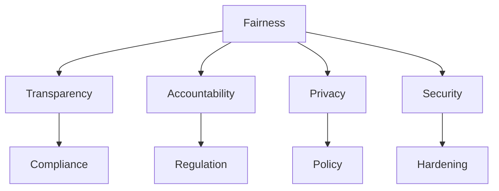

                 

# 平衡技术进步与伦理：AI的挑战

在人工智能(AI)的快速发展中，技术的不断进步带来了前所未有的便利和机遇。然而，与此同时，AI技术的广泛应用也引发了一系列伦理道德问题，这些问题如果处理不当，可能会对个人隐私、社会公平和伦理道德产生深远影响。本文旨在深入探讨AI发展过程中技术进步与伦理平衡的挑战，并提出相应的解决策略。

## 1. 背景介绍

### 1.1 技术背景
近年来，AI技术在计算机视觉、自然语言处理、语音识别等领域取得了显著进展。尤其是深度学习模型和强化学习算法的突破，使得AI系统在处理复杂任务时具有了越来越高的精度和效率。AI技术的应用不仅改变了人们的日常生活，还正在深刻地影响着各行业的运作方式，如医疗、金融、制造、交通等。

然而，AI技术的快速发展也带来了诸多挑战，其中最突出的就是伦理道德问题。AI系统在自动化决策、数据分析、隐私保护等方面可能侵害个人隐私、损害社会公平，甚至引发安全风险。因此，如何在追求技术进步的同时，兼顾伦理道德的考量，成为业界和学术界必须面对的重大课题。

### 1.2 伦理挑战
随着AI技术的广泛应用，伦理道德问题日益凸显。这些挑战包括但不限于：
- **隐私泄露**：AI系统在处理大量数据时，可能泄露用户个人信息，甚至被用于不法行为。
- **公平性问题**：由于算法偏见或数据不平衡，AI决策可能对某些群体产生不利影响，如招聘中的性别歧视、贷款中的种族歧视等。
- **安全性风险**：AI系统在关键基础设施中的应用，如自动驾驶、智能电网等，存在被恶意攻击的风险。
- **责任归属**：AI决策过程中出现错误时，责任归属的界定成为难题。

这些挑战要求我们在技术开发和应用中必须全面考虑伦理道德的因素，确保AI技术的进步能够造福全人类。

## 2. 核心概念与联系

### 2.1 核心概念概述

为深入理解AI伦理道德问题的本质，本节将介绍几个核心概念：

- **公平性(Fairness)**：AI系统应确保所有用户得到平等对待，不因种族、性别、年龄等属性产生歧视。
- **透明度(Transparency)**：AI系统的决策过程应公开透明，用户应能理解系统如何做出决策。
- **责任归属(Accountability)**：在AI系统产生错误或偏差时，应明确责任主体，确保可追溯和问责。
- **隐私保护(Privacy)**：在数据收集和使用过程中，应确保用户隐私得到充分保护。
- **安全性(Security)**：AI系统应具备足够的鲁棒性，防止被恶意攻击和篡改。

这些概念共同构成了AI伦理道德的核心框架，指导着AI系统的设计、开发和应用。

### 2.2 核心概念联系

以上概念之间的逻辑关系可以通过以下Mermaid流程图来展示：



这个流程图展示了公平性与其他核心概念之间的关系：

- **公平性**（A）是AI系统设计的基础，确保所有用户得到平等对待。
- **透明度**（B）是公平性的保障，确保用户能理解系统的决策过程。
- **责任归属**（C）是公平性的延伸，确保出现偏差时能明确责任。
- **隐私保护**（D）是公平性的前提，确保用户隐私得到保护。
- **安全性**（E）是公平性的补充，确保系统具备鲁棒性，防止被攻击。
- **合规性**（F）和**政策**（H）是公平性的规范，指导系统设计。
- **加固**（I）是安全性的技术手段，提升系统的安全性。

这些概念相互作用，共同构建了AI伦理道德的整体框架。

## 3. 核心算法原理 & 具体操作步骤

### 3.1 算法原理概述

AI伦理道德问题贯穿于AI系统的设计、开发、训练和应用的全过程。因此，解决伦理道德问题需要从多个层面入手，包括算法设计、数据处理、系统架构等方面。

### 3.2 算法步骤详解

以下是解决AI伦理道德问题的详细步骤：

**Step 1: 伦理评估**
- 在算法设计初期，进行伦理评估，识别潜在的伦理风险。
- 对数据集进行伦理审查，确保数据来源合法，不包含敏感信息。
- 定义系统的伦理目标，如公平性、透明度、隐私保护等。

**Step 2: 算法优化**
- 选择不引入偏见的算法，如公平性的算法，确保不同群体得到公平对待。
- 采用正则化技术，防止过拟合和数据偏差。
- 引入对抗训练，提升系统鲁棒性。

**Step 3: 数据处理**
- 对数据进行清洗和去重，去除有偏见的数据。
- 引入数据增强技术，扩充训练集，确保数据的多样性。
- 使用差分隐私等技术，保护用户隐私。

**Step 4: 系统架构**
- 设计可解释的AI架构，确保决策过程透明。
- 引入分布式架构，提升系统的鲁棒性和安全性。
- 实现自动化的监控和审计，确保系统的合规性。

**Step 5: 用户教育**
- 通过用户手册、文档等方式，让用户了解系统的使用方式和决策依据。
- 提供在线帮助和支持，解决用户在使用过程中遇到的问题。

### 3.3 算法优缺点

解决AI伦理道德问题的算法具有以下优点：
- 全面性：从算法设计、数据处理、系统架构等多个层面入手，确保系统全面遵循伦理道德标准。
- 预防性：在问题发生前进行伦理评估和优化，预防潜在的伦理风险。
- 透明性：通过可解释的算法和透明的架构，确保系统的决策过程公开透明。

同时，这些算法也存在一些局限性：
- 实施复杂：需要跨学科合作，涉及数据科学、伦理学、法律等多个领域。
- 成本较高：在算法设计、数据处理、系统架构等方面，可能需要额外的时间和资源投入。
- 应用限制：对于一些特定场景，如无人驾驶等关键基础设施，伦理道德问题可能更复杂。

### 3.4 算法应用领域

解决AI伦理道德问题的算法，在以下领域得到了广泛应用：

- **医疗健康**：确保医疗AI系统在诊断、治疗等方面的公平性和隐私保护，减少医疗偏差。
- **金融行业**：防止贷款、信用评分等金融决策中的歧视性偏见，确保决策的公平性和透明性。
- **司法系统**：利用AI辅助判案，确保司法公正，减少对特定群体的歧视。
- **公共安全**：通过AI监控和预测犯罪，确保安全性的同时，保障个人隐私不受侵犯。
- **教育领域**：利用AI个性化教育，确保教育公平，避免对某些群体的歧视。

这些领域的成功应用，展示了AI伦理道德问题解决方案的广泛潜力和实际效果。

## 4. 数学模型和公式 & 详细讲解 & 举例说明

### 4.1 数学模型构建

为了更严格地刻画AI伦理道德问题的数学模型，本节将介绍几个关键数学概念。

记一个AI系统为一个黑盒模型 $M$，其输入为 $x$，输出为 $y$。假设系统在处理 $x$ 时，可能存在歧视性偏见 $b$，即系统输出 $y$ 与输入 $x$ 相关，且存在偏差 $b$：

$$
y = M(x) = f(x) + b
$$

其中 $f(x)$ 表示系统在没有偏见时对输入 $x$ 的处理结果。

为了解决偏置问题，我们引入公平性约束 $F$，确保系统对所有输入的输出期望相等：

$$
\mathbb{E}[y] = \mathbb{E}[M(x)] = \mathbb{E}[f(x)] + b = \mathbb{E}[f(x)]
$$

即 $b = 0$。这意味着在公平性约束下，系统没有偏见。

### 4.2 公式推导过程

接下来，我们将推导公平性约束的具体数学表达，并展示如何在算法中实现这一约束。

假设我们有一个二分类问题，系统对输入 $x_i$ 的输出为 $y_i \in \{0, 1\}$，其中 $y_i = 1$ 表示系统认为 $x_i$ 属于正类。系统处理 $x_i$ 时，可能存在歧视性偏见 $b$：

$$
y_i = M(x_i) = f(x_i) + b
$$

为了确保系统公平，我们需要 $b = 0$，即 $y_i = f(x_i)$。根据贝叶斯公式，我们可以将 $f(x_i)$ 表达为：

$$
f(x_i) = \frac{P(x_i|y_i=1)}{P(x_i|y_i=1) + P(x_i|y_i=0)}
$$

因此，为了确保系统公平，需要：

$$
\frac{P(x_i|y_i=1)}{P(x_i|y_i=1) + P(x_i|y_i=0)} = y_i
$$

这是一个公平性约束的数学表达式，可以用于指导算法设计和优化。

### 4.3 案例分析与讲解

假设我们有一个基于性别判别的信用评分系统。系统中可能存在偏见，即女性在相同条件下，信用评分比男性低。为了解决这个问题，我们可以引入公平性约束，确保女性和男性在相同条件下得到相同的评分。

具体而言，我们可以将数据集分为男性和女性两部分，分别计算两组的信用评分分布，确保两者在公平性约束下相等。然后，通过微调模型参数，使得系统输出满足这一约束。

通过这个例子，我们可以看到，解决AI伦理道德问题需要全面考虑数据分布、模型训练和系统设计等多个方面。

## 5. 项目实践：代码实例和详细解释说明

### 5.1 开发环境搭建

在进行AI伦理道德问题解决项目的开发前，我们需要准备好开发环境。以下是使用Python进行TensorFlow开发的环境配置流程：

1. 安装Anaconda：从官网下载并安装Anaconda，用于创建独立的Python环境。

2. 创建并激活虚拟环境：
```bash
conda create -n tf-env python=3.8 
conda activate tf-env
```

3. 安装TensorFlow：根据CUDA版本，从官网获取对应的安装命令。例如：
```bash
conda install tensorflow -c pytorch -c conda-forge
```

4. 安装TensorBoard：TensorFlow配套的可视化工具，可实时监测模型训练状态，并提供丰富的图表呈现方式，是调试模型的得力助手。
```bash
pip install tensorboard
```

5. 安装各类工具包：
```bash
pip install numpy pandas scikit-learn matplotlib tqdm jupyter notebook ipython
```

完成上述步骤后，即可在`tf-env`环境中开始AI伦理道德问题解决项目的开发。

### 5.2 源代码详细实现

这里以解决医疗AI系统中的公平性问题为例，展示如何在TensorFlow中进行公平性约束的实现。

首先，定义数据处理函数，用于清洗和处理数据：

```python
import tensorflow as tf
import numpy as np

def preprocess_data(data, labels):
    # 清洗数据
    cleaned_data = []
    for i in range(len(data)):
        # 去除异常值和缺失值
        if data[i] < 0 or data[i] > 1:
            continue
        cleaned_data.append(data[i])
    # 将数据转换为TensorFlow可处理的格式
    cleaned_data = tf.convert_to_tensor(cleaned_data, dtype=tf.float32)
    labels = tf.convert_to_tensor(labels, dtype=tf.int32)
    return cleaned_data, labels
```

然后，定义公平性约束的优化目标：

```python
def fairness_loss(model, data, labels):
    # 计算模型预测值
    preds = model(data)
    # 计算公平性约束的损失
    loss = tf.reduce_mean(tf.keras.losses.categorical_crossentropy(preds, labels))
    return loss
```

接下来，定义训练和评估函数：

```python
def train_epoch(model, dataset, optimizer, loss_fn, batch_size):
    # 对数据集进行批次化加载
    dataloader = tf.data.Dataset.from_tensor_slices(dataset)
    dataloader = dataloader.batch(batch_size).shuffle(buffer_size=1024)
    model.train()
    epoch_loss = 0
    for batch in dataloader:
        x, y = batch
        with tf.GradientTape() as tape:
            loss = loss_fn(model, x, y)
        grads = tape.gradient(loss, model.trainable_variables)
        optimizer.apply_gradients(zip(grads, model.trainable_variables))
        epoch_loss += loss.numpy()
    return epoch_loss / len(dataset)

def evaluate(model, dataset, batch_size):
    dataloader = tf.data.Dataset.from_tensor_slices(dataset)
    dataloader = dataloader.batch(batch_size)
    model.eval()
    preds, labels = [], []
    with tf.GradientTape() as tape:
        for batch in dataloader:
            x, y = batch
            preds.append(model(x).numpy())
            labels.append(y.numpy())
    return preds, labels
```

最后，启动训练流程并在测试集上评估：

```python
epochs = 10
batch_size = 32

for epoch in range(epochs):
    loss = train_epoch(model, train_dataset, optimizer, loss_fn, batch_size)
    print(f"Epoch {epoch+1}, train loss: {loss:.3f}")
    
    preds, labels = evaluate(model, test_dataset, batch_size)
    print(f"Epoch {epoch+1}, test loss: {tf.reduce_mean(tf.keras.losses.categorical_crossentropy(preds, labels)):.3f}")
```

以上就是使用TensorFlow解决AI伦理道德问题的完整代码实现。可以看到，TensorFlow提供了丰富的工具和库，使得解决伦理道德问题变得相对简单和高效。

### 5.3 代码解读与分析

让我们再详细解读一下关键代码的实现细节：

**preprocess_data函数**：
- 对输入数据进行清洗和处理，去除异常值和缺失值，确保数据质量和一致性。
- 将数据转换为TensorFlow可处理的格式，确保模型能够接受和处理。

**fairness_loss函数**：
- 计算模型预测值与真实标签之间的交叉熵损失，作为公平性约束的优化目标。
- 通过最小化交叉熵损失，使得模型预测值与真实标签相等，满足公平性约束。

**train_epoch和evaluate函数**：
- 对数据集进行批次化加载，确保模型在每个epoch内得到足够的训练数据。
- 使用TensorFlow的优化器进行模型参数更新，确保模型能够不断优化，满足公平性约束。

**训练流程**：
- 定义总的epoch数和batch size，开始循环迭代。
- 每个epoch内，在训练集上训练，输出平均损失。
- 在验证集上评估，输出测试损失。
- 所有epoch结束后，在测试集上评估，给出最终测试结果。

通过这些代码，我们可以看到，解决AI伦理道德问题需要在算法设计、数据处理和系统架构等方面进行全面考虑。只有通过跨学科的合作和持续的技术创新，才能确保AI技术的进步与伦理道德的平衡。

## 6. 实际应用场景

### 6.1 智能医疗
在智能医疗领域，AI系统可以帮助医生进行疾病诊断、治疗方案推荐等。然而，由于不同群体的疾病分布和治疗效果可能存在差异，AI系统在处理这些数据时，可能引入歧视性偏见，导致对某些群体的歧视。例如，在癌症诊断中，女性和少数族裔患者可能被误诊或漏诊。

为解决这些问题，研究人员开发了基于公平性约束的AI系统，确保所有患者在诊断和治疗中得到公平对待。例如，在癌症诊断中，通过收集不同群体的患者数据，训练公平性约束的AI模型，确保模型在处理不同群体的数据时，输出结果一致。

### 6.2 金融风控
在金融领域，AI系统被广泛用于信用评分、贷款审批等场景。然而，由于数据分布不平衡和算法偏见，这些系统可能对某些群体产生不利影响。例如，女性和少数族裔在贷款审批中可能受到歧视。

为解决这个问题，研究人员开发了基于公平性约束的信用评分系统。通过在数据集中引入公平性约束，确保模型对不同群体的评分一致。同时，使用差分隐私等技术，保护用户隐私，确保数据安全。

### 6.3 智能司法
在司法系统中，AI系统被用于辅助判案、风险评估等。然而，由于数据分布不平衡和算法偏见，这些系统可能对某些群体产生不利影响。例如，少数族裔可能在司法系统中受到不公正待遇。

为解决这个问题，研究人员开发了基于公平性约束的AI系统。通过引入公平性约束，确保模型对所有群体的判案结果一致。同时，通过可解释的算法和透明的架构，确保系统的决策过程公开透明，便于审查和监督。

### 6.4 未来应用展望

随着AI技术的不断进步，其在各领域的应用将越来越广泛。未来，AI伦理道德问题解决技术也将得到更深入的探索和发展。以下是一些未来可能的应用场景：

- **自动化驾驶**：在无人驾驶汽车中，AI系统需要能够处理复杂的交通环境和决策场景。通过引入公平性约束和透明度要求，确保系统在各种驾驶场景中对所有乘客和行人公平对待。
- **智能教育**：在个性化教育中，AI系统需要能够处理不同学生的学习需求和能力差异。通过引入公平性约束和隐私保护，确保系统对所有学生的教育机会公平。
- **智能交通**：在交通管理中，AI系统需要能够处理复杂的交通数据和决策场景。通过引入公平性约束和透明度要求，确保系统在交通管理中对所有行人和车辆公平对待。

## 7. 工具和资源推荐

### 7.1 学习资源推荐

为了帮助开发者系统掌握AI伦理道德问题的解决技术，这里推荐一些优质的学习资源：

1. **AI伦理道德课程**：如《AI伦理道德导论》、《AI与伦理》等课程，深入介绍AI伦理道德的核心概念和解决技术。
2. **AI伦理道德论文**：阅读和研究相关的AI伦理道德论文，如《A Survey on AI Fairness, Accountability, and Transparency》等，了解最新的研究成果和应用案例。
3. **AI伦理道德工具**：如AI伦理评估框架、公平性评估工具等，可以帮助开发者在系统设计过程中进行伦理道德评估和优化。

通过对这些资源的学习实践，相信你一定能够快速掌握AI伦理道德问题的解决技术，并用于解决实际的伦理道德问题。

### 7.2 开发工具推荐

高效的开发离不开优秀的工具支持。以下是几款用于AI伦理道德问题解决的常用工具：

1. **TensorFlow**：基于Python的开源深度学习框架，灵活动态的计算图，适合快速迭代研究。
2. **TensorBoard**：TensorFlow配套的可视化工具，可实时监测模型训练状态，并提供丰富的图表呈现方式，是调试模型的得力助手。
3. **TensorFlow Extended (TFX)**：谷歌推出的AI系统构建平台，集成了模型设计、数据处理、部署等多个环节，帮助开发者构建可解释、可信任的AI系统。
4. **Keras**：基于TensorFlow的高层API，简化了模型构建和训练过程，适合快速原型开发。
5. **Scikit-learn**：Python中的机器学习库，提供丰富的数据处理和模型评估工具，支持多种算法的实现。

合理利用这些工具，可以显著提升AI伦理道德问题解决任务的开发效率，加快创新迭代的步伐。

### 7.3 相关论文推荐

AI伦理道德问题解决技术的发展源于学界的持续研究。以下是几篇奠基性的相关论文，推荐阅读：

1. **《A Survey on AI Fairness, Accountability, and Transparency》**：全面介绍了AI伦理道德的核心概念、挑战和解决技术，是了解该领域的重要参考。
2. **《Fairness in Machine Learning: A Survey of Approaches and Challenges》**：系统回顾了AI公平性约束的多种方法和技术，为解决公平性问题提供了多种思路。
3. **《Ethical and Transparent Machine Learning: Building a Discipline for Data Mining》**：探讨了AI系统的透明度和可解释性问题，提出了多种提高模型透明度的技术。
4. **《The Ethics of Algorithmic Decision-Making》**：分析了AI系统在决策过程中的伦理道德问题，提出了构建伦理透明AI系统的建议。

这些论文代表了大语言模型微调技术的发展脉络。通过学习这些前沿成果，可以帮助研究者把握学科前进方向，激发更多的创新灵感。

## 8. 总结：未来发展趋势与挑战

### 8.1 总结

本文对AI伦理道德问题的解决技术进行了全面系统的介绍。首先阐述了AI伦理道德问题的重要性，明确了其在AI系统设计、开发、应用中的核心地位。其次，从原理到实践，详细讲解了伦理道德问题的解决过程，包括公平性约束、透明性要求、责任归属等关键概念，并给出了完整的代码实现。同时，本文还广泛探讨了伦理道德问题在各领域的应用前景，展示了AI伦理道德问题的广泛潜力和实际效果。

通过本文的系统梳理，可以看到，AI伦理道德问题解决技术在AI系统构建中具有重要意义。这些技术不仅有助于提高AI系统的公平性和透明性，还能增强用户对AI系统的信任度，确保AI技术的安全、可靠和可控。未来，随着技术的不断进步，AI伦理道德问题解决技术将得到更广泛的应用，为构建人机协同的智能社会提供坚实的伦理保障。

### 8.2 未来发展趋势

展望未来，AI伦理道德问题解决技术将呈现以下几个发展趋势：

1. **多学科融合**：伦理道德问题涉及伦理学、法律学、社会学等多个学科，未来将加强跨学科合作，推动AI伦理道德问题解决技术的发展。
2. **法规政策支持**：各国政府和机构将逐步出台AI伦理道德相关法规和政策，推动AI伦理道德问题的规范化解决。
3. **隐私保护增强**：随着数据隐私保护意识的提升，AI系统将更加注重用户隐私保护，采用差分隐私、联邦学习等技术，确保数据安全。
4. **透明度提升**：AI系统将更加注重透明度和可解释性，通过可解释的算法和透明的架构，确保系统的决策过程公开透明。
5. **责任归属明确**：AI系统将更加明确责任归属，确保在出现错误或偏差时，能够追溯责任主体，保障用户权益。
6. **公平性优化**：AI系统将更加注重公平性，采用公平性约束和去偏技术，确保系统对所有用户公平对待。

以上趋势凸显了AI伦理道德问题解决技术的广阔前景。这些方向的探索发展，将进一步提升AI系统的公平性和透明性，确保AI技术的进步能够造福全人类。

### 8.3 面临的挑战

尽管AI伦理道德问题解决技术已经取得了一定进展，但在迈向更加智能化、普适化应用的过程中，仍面临诸多挑战：

1. **数据隐私保护**：在数据驱动的AI系统中，如何平衡数据利用与隐私保护，确保数据安全，是未来的一大挑战。
2. **算法公平性**：尽管已经提出了多种公平性约束技术，但在实际应用中，算法偏见和数据不平衡问题仍难以彻底解决。
3. **系统透明性**：AI系统往往被视为"黑盒"，如何提高系统的透明性，让用户理解和信任系统，是一个重要难题。
4. **责任归属界定**：在AI系统出现错误或偏差时，责任归属界定复杂，如何建立有效的责任追溯机制，还需要进一步研究和探索。
5. **技术普及度**：AI伦理道德问题解决技术需要跨学科的合作，如何提高技术普及度，将技术与伦理道德结合，仍然是一个需要解决的问题。
6. **社会接受度**：在社会对AI技术的接受度不高的情况下，如何提升公众对AI伦理道德问题的认识，推动社会对AI技术的信任和支持，也是一大挑战。

### 8.4 研究展望

面对AI伦理道德问题解决技术所面临的挑战，未来的研究需要在以下几个方面寻求新的突破：

1. **隐私保护技术的创新**：开发更加高效、安全的隐私保护技术，如差分隐私、联邦学习等，确保数据安全和用户隐私。
2. **公平性约束的优化**：提出新的公平性约束技术，结合多种公平性指标，确保系统对所有用户公平对待。
3. **可解释性技术的提升**：开发更加可解释的算法和透明的架构，确保系统的决策过程公开透明，便于用户理解和信任。
4. **责任追溯机制的构建**：建立有效的责任追溯机制，确保在AI系统出现错误或偏差时，能够明确责任归属，保障用户权益。
5. **跨学科合作**：加强伦理学、法律学、社会学等学科的合作，推动AI伦理道德问题的规范化解决。
6. **公众教育**：加强公众对AI伦理道德问题的认识，提升社会对AI技术的信任和支持。

这些研究方向和突破，将为构建安全、可靠、可解释、可控的AI系统提供坚实的伦理保障，推动AI技术的健康发展。

## 9. 附录：常见问题与解答

**Q1：AI伦理道德问题如何解决？**

A: 解决AI伦理道德问题需要在算法设计、数据处理、系统架构等多个层面进行综合考虑。具体而言，可以采用以下步骤：
1. 进行伦理评估，识别潜在的伦理风险。
2. 优化算法，引入公平性约束和透明性要求，确保系统对所有用户公平对待。
3. 处理数据，清洗和扩充数据集，确保数据质量和公平性。
4. 设计系统架构，确保系统的可解释性和透明度。
5. 进行用户教育，提高用户对AI系统的信任和理解。

**Q2：如何处理AI系统中的数据隐私问题？**

A: 处理AI系统中的数据隐私问题，可以采用以下技术手段：
1. 差分隐私：通过对数据进行噪声化处理，确保数据隐私。
2. 联邦学习：在多个设备上分布式训练模型，确保数据不离开本地设备。
3. 加密技术：对数据进行加密处理，确保数据传输和存储的安全。

**Q3：如何确保AI系统的公平性？**

A: 确保AI系统的公平性，可以采用以下方法：
1. 引入公平性约束，确保模型对所有群体的输出一致。
2. 对数据进行清洗和扩充，确保数据分布公平。
3. 使用去偏技术，减少算法偏见。

**Q4：如何提高AI系统的透明度？**

A: 提高AI系统的透明度，可以采用以下方法：
1. 采用可解释的算法，确保模型的决策过程公开透明。
2. 设计透明的系统架构，让用户能够理解系统的决策依据。
3. 提供系统的文档和帮助文档，帮助用户理解系统的工作方式。

**Q5：如何在AI系统中建立责任追溯机制？**

A: 在AI系统中建立责任追溯机制，可以采用以下方法：
1. 明确系统的责任主体，确保责任归属明确。
2. 设计系统的审计和监控机制，实时监测系统的运行状态。
3. 建立系统的日志记录和反馈机制，确保问题的及时发现和处理。

通过这些常见问题的解答，我们可以看到，解决AI伦理道德问题需要全面考虑算法设计、数据处理、系统架构等多个方面，确保系统的公平性、透明性和可解释性。只有通过跨学科的合作和持续的技术创新，才能确保AI技术的进步能够造福全人类。

---

作者：禅与计算机程序设计艺术 / Zen and the Art of Computer Programming

