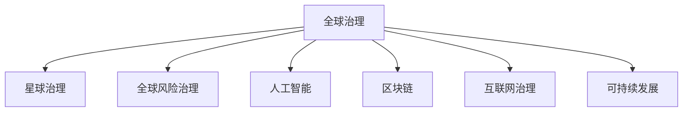

                 

# 2050年的全球治理：从全球风险治理到星球治理的治理结构演进

> 关键词：全球治理, 星球治理, 全球风险治理, 人工智能, 区块链, 互联网治理, 可持续发展

## 1. 背景介绍

### 1.1 问题由来

随着人类社会的发展，全球治理问题变得日益复杂。从环境污染、气候变化、传染病爆发，到社会不平等等问题，每一个都关系到人类的共同命运。传统的全球治理结构，如联合国、世界银行等国际组织，虽然在一定程度上缓解了某些全球性问题，但在快速变化的世界中显得力不从心。

在2050年，我们面临的全球治理挑战将更加严峻。随着技术的发展，尤其是人工智能、区块链和互联网的普及，全球治理结构需要做出根本性的改变，以应对新的挑战和需求。

### 1.2 问题核心关键点

未来全球治理的核心关键点在于以下几点：

- **多边主义与合作**：如何在全球范围内达成共识，共同应对挑战。
- **技术驱动与创新**：如何利用新技术来解决传统治理中的难题。
- **透明度与可追溯性**：如何确保治理过程的公开透明，避免腐败和信息不对称。
- **参与度与包容性**：如何确保各国、各社群都能平等参与全球治理。
- **可持续性与长期视角**：如何平衡经济发展与环境保护，确保未来几代人的福祉。

## 2. 核心概念与联系

### 2.1 核心概念概述

为更好地理解未来全球治理的结构演进，本节将介绍几个关键概念：

- **全球治理**：指在全球范围内，各国政府、国际组织、非政府组织等多方力量共同参与，以解决跨国问题和协调国际关系的治理模式。

- **星球治理**：指在全球治理的基础上，进一步将治理范围扩展到整个地球，包括生物多样性保护、环境治理、空间资源开发等更为宏大的主题。

- **全球风险治理**：指在全球范围内，通过机制化和制度化手段，预防、识别、监测和应对各种潜在的全球性风险，如自然灾害、网络攻击、生物安全等。

- **人工智能**：指通过模拟人类智能过程，使机器能够执行复杂的任务，如语言理解、图像识别、决策制定等。

- **区块链**：指一种去中心化的分布式账本技术，通过加密和共识机制保障数据的安全和透明。

- **互联网治理**：指对互联网的资源、技术、政策、法律等方面进行管理和规范，确保互联网的开放性和自由度。

- **可持续发展**：指在满足当前需求的同时，不损害后代人满足需求的能力，涵盖经济、社会、环境等多个方面的发展目标。

这些核心概念之间的逻辑关系可以通过以下Mermaid流程图来展示：



这个流程图展示了几大核心概念之间的相互关系：

1. 全球治理是基础，涉及多边合作和国际关系协调。
2. 星球治理在基础之上，关注更广泛的环境和资源管理。
3. 全球风险治理和人工智能、区块链是实现全球治理的技术手段。
4. 互联网治理保障了全球治理的信息自由流动。
5. 可持续发展是全球治理的最终目标。

## 3. 核心算法原理 & 具体操作步骤

### 3.1 算法原理概述

未来全球治理的核心算法原理主要围绕以下几个方面展开：

- **多边协作算法**：通过智能合约、多方计算等技术，促进跨国政府和组织之间的协作，减少信息不对称和信任问题。
- **风险识别与预警算法**：利用机器学习和大数据分析，识别全球性风险的早期预警信号，提高应对能力。
- **透明化与信任建立算法**：通过区块链和分布式账本技术，确保治理过程和数据的透明公开，增强各方信任。
- **人工智能辅助决策算法**：利用深度学习和自然语言处理技术，支持决策制定和执行。
- **可持续性评估算法**：通过环境模型和生态系统分析，评估全球治理策略的长期影响。

### 3.2 算法步骤详解

未来全球治理的具体操作步骤可以分为以下几个阶段：

1. **数据收集与处理**：
   - 收集全球范围内的环境、社会、经济数据。
   - 利用大数据技术和人工智能算法，清洗和预处理数据，生成可用的数据集。

2. **模型训练与验证**：
   - 使用机器学习模型对数据集进行训练，识别全球性风险和趋势。
   - 通过交叉验证和测试集评估模型的性能，调整模型参数。

3. **智能合约与多方计算**：
   - 设计智能合约，自动执行和监管治理协议。
   - 利用多方计算技术，多方协同计算，确保数据的安全和隐私。

4. **透明化与可追溯性机制**：
   - 使用区块链技术记录和验证治理过程和数据。
   - 通过分布式账本，确保数据的不可篡改和可追溯性。

5. **决策支持与执行**：
   - 利用人工智能辅助决策，生成政策建议和行动计划。
   - 部署智能合约和自动化系统，执行和监控治理行动。

6. **长期评估与调整**：
   - 定期评估全球治理策略的长期影响。
   - 根据评估结果，调整策略和执行计划，确保可持续性。

### 3.3 算法优缺点

未来全球治理的算法具有以下优点：

- **高效协作**：智能合约和多方计算技术，使得多边协作更加高效和透明。
- **准确预测**：机器学习和大数据分析，能够提供准确的全球性风险预测。
- **透明度**：区块链技术确保了治理过程的公开透明。
- **自动化执行**：智能合约和自动化系统，提高了治理行动的执行效率。

同时，这些算法也存在一些缺点：

- **复杂度**：涉及多种技术，实施和维护复杂。
- **数据质量**：数据收集和处理过程中的误差，可能会影响模型的准确性。
- **安全问题**：区块链和智能合约的安全性，需要不断维护和升级。
- **可解释性**：人工智能模型的决策过程，缺乏足够的可解释性。

### 3.4 算法应用领域

未来全球治理的算法将在多个领域得到应用，例如：

- **气候变化治理**：通过监测全球碳排放，制定和执行减排政策。
- **国际安全与合作**：通过多方计算，协调各国反恐和网络安全行动。
- **国际贸易与金融**：利用智能合约和区块链，简化跨境支付和贸易流程。
- **公共卫生应急**：通过数据分析，提前预警和应对全球疫情。
- **生物多样性保护**：通过环境模型，评估和保护生物多样性。
- **太空探索与利用**：利用智能合约和自动化系统，协调国际太空合作。

这些领域的应用，将进一步推动全球治理的创新和发展。

## 4. 数学模型和公式 & 详细讲解 & 举例说明

### 4.1 数学模型构建

在未来的全球治理中，数学模型将发挥关键作用。以下是一个简化的全球风险治理模型：

- **输入**：环境监测数据、社会经济数据、历史事件数据等。
- **输出**：全球风险预测、政策建议、行动计划等。

### 4.2 公式推导过程

假设有一个全球风险模型，输入为 $X = (x_1, x_2, ..., x_n)$，其中 $x_i$ 表示第 $i$ 个环境指标或社会指标。模型输出为 $Y$，表示未来某段时间内全球风险的预测值。

模型可以使用多元线性回归或支持向量机等方法进行训练。例如，使用线性回归模型：

$$
Y = \beta_0 + \beta_1 x_1 + \beta_2 x_2 + ... + \beta_n x_n + \epsilon
$$

其中，$\beta_i$ 为第 $i$ 个特征的系数，$\epsilon$ 为误差项。

### 4.3 案例分析与讲解

以全球气候变化风险预测为例，可以使用线性回归模型：

1. **数据收集**：收集全球各地的温度、降水量、海平面变化等数据。
2. **模型训练**：利用历史数据训练模型，识别温度和降水量与全球气候风险之间的关系。
3. **预测与评估**：使用训练好的模型对未来气候变化进行预测，评估不同政策的潜在影响。

## 5. 项目实践：代码实例和详细解释说明

### 5.1 开发环境搭建

在项目实践中，需要一个良好的开发环境。以下是搭建Python开发环境的步骤：

1. 安装Anaconda：从官网下载并安装Anaconda，用于创建独立的Python环境。

2. 创建并激活虚拟环境：
```bash
conda create -n global-governance python=3.8 
conda activate global-governance
```

3. 安装相关库：
```bash
pip install numpy pandas scikit-learn matplotlib tensorflow transformers
```

### 5.2 源代码详细实现

以下是一个简单的Python代码示例，用于训练一个基于多元线性回归的全球气候变化风险预测模型：

```python
import numpy as np
from sklearn.linear_model import LinearRegression

# 假设我们有一个包含历史气候数据的数据集
X = np.array([[10, 20, 30], [15, 25, 35], [20, 30, 40]])
y = np.array([5, 10, 15])

# 创建线性回归模型
model = LinearRegression()

# 训练模型
model.fit(X, y)

# 预测未来气候风险
X_new = np.array([[12, 22, 32]])
y_pred = model.predict(X_new)

print("预测的气候风险：", y_pred)
```

### 5.3 代码解读与分析

让我们再详细解读一下关键代码的实现细节：

**多元线性回归模型**：
- `LinearRegression`类：Scikit-Learn库中的线性回归模型。
- `fit`方法：训练模型。
- `predict`方法：使用训练好的模型进行预测。

**数据集构建**：
- `X`：输入特征矩阵，包含温度、降水量等指标。
- `y`：输出目标向量，表示气候风险。
- `X_new`：新输入特征矩阵，用于预测未来气候风险。

**模型训练与预测**：
- 使用历史数据 `X` 和 `y` 训练模型。
- 使用 `X_new` 进行未来气候风险的预测。

**代码输出**：
- `y_pred`：预测的气候风险。

## 6. 实际应用场景

### 6.1 全球气候变化治理

全球气候变化是未来全球治理中的重要议题。利用基于数据驱动的模型和算法，可以更准确地预测和应对气候变化带来的风险。

1. **数据收集与处理**：
   - 收集全球气候数据，如温度、海平面、降水等。
   - 利用大数据技术和人工智能算法，清洗和预处理数据，生成可用的数据集。

2. **模型训练与验证**：
   - 使用机器学习模型对数据集进行训练，识别气候变化的趋势和影响。
   - 通过交叉验证和测试集评估模型的性能，调整模型参数。

3. **智能合约与多方计算**：
   - 设计智能合约，自动执行和监管气候变化政策。
   - 利用多方计算技术，多方协同计算，确保数据的安全和隐私。

4. **透明化与可追溯性机制**：
   - 使用区块链技术记录和验证气候变化治理过程和数据。
   - 通过分布式账本，确保数据的不可篡改和可追溯性。

5. **决策支持与执行**：
   - 利用人工智能辅助决策，生成政策建议和行动计划。
   - 部署智能合约和自动化系统，执行和监控气候变化行动。

6. **长期评估与调整**：
   - 定期评估气候变化治理策略的长期影响。
   - 根据评估结果，调整策略和执行计划，确保可持续性。

### 6.2 国际安全与合作

国际安全与合作是未来全球治理中的重要议题。通过智能合约和多方计算技术，可以更好地协调各国在反恐、网络安全等方面的行动。

1. **数据收集与处理**：
   - 收集全球网络安全数据，如网络攻击、恶意软件等。
   - 利用大数据技术和人工智能算法，清洗和预处理数据，生成可用的数据集。

2. **模型训练与验证**：
   - 使用机器学习模型对数据集进行训练，识别网络攻击的特征和模式。
   - 通过交叉验证和测试集评估模型的性能，调整模型参数。

3. **智能合约与多方计算**：
   - 设计智能合约，自动执行和监管网络安全协议。
   - 利用多方计算技术，多方协同计算，确保数据的安全和隐私。

4. **透明化与可追溯性机制**：
   - 使用区块链技术记录和验证网络安全治理过程和数据。
   - 通过分布式账本，确保数据的不可篡改和可追溯性。

5. **决策支持与执行**：
   - 利用人工智能辅助决策，生成政策建议和行动计划。
   - 部署智能合约和自动化系统，执行和监控网络安全行动。

6. **长期评估与调整**：
   - 定期评估网络安全治理策略的长期影响。
   - 根据评估结果，调整策略和执行计划，确保可持续性。

## 7. 工具和资源推荐

### 7.1 学习资源推荐

为了帮助开发者系统掌握未来全球治理的理论基础和实践技巧，这里推荐一些优质的学习资源：

1. 《全球治理的未来》系列博文：由全球治理专家撰写，深入浅出地介绍了未来全球治理的框架和挑战。

2. 《星球治理：从地球到火星》课程：在线课程，涵盖星球治理的基本概念和实际应用案例。

3. 《全球风险治理：技术与管理》书籍：全面介绍了全球风险治理的理论和实践，适合深入学习。

4. 《人工智能与全球治理》报告：由联合国发布，探讨了人工智能在全球治理中的应用和挑战。

5. 《区块链与国际合作》白皮书：由区块链技术专家撰写，介绍了区块链在跨国治理中的应用场景。

通过对这些资源的学习实践，相信你一定能够快速掌握未来全球治理的精髓，并用于解决实际的全球治理问题。

### 7.2 开发工具推荐

高效的开发离不开优秀的工具支持。以下是几款用于未来全球治理开发的常用工具：

1. Python：广泛使用的编程语言，适合数据分析和机器学习任务。

2. Scikit-Learn：开源的机器学习库，包含多种机器学习算法。

3. TensorFlow：由Google主导开发的深度学习框架，支持大规模模型训练。

4. Weights & Biases：模型训练的实验跟踪工具，可以记录和可视化模型训练过程中的各项指标。

5. TensorBoard：TensorFlow配套的可视化工具，可实时监测模型训练状态，提供丰富的图表呈现方式。

6. GitLab：代码管理平台，支持多人协作开发和版本控制。

合理利用这些工具，可以显著提升未来全球治理任务的开发效率，加快创新迭代的步伐。

### 7.3 相关论文推荐

未来全球治理的研究源于学界的持续研究。以下是几篇奠基性的相关论文，推荐阅读：

1. "全球治理的未来：多边主义与数字时代"（即将发布）：探讨了数字时代下全球治理的挑战和机遇。

2. "人工智能与全球治理：机遇与挑战"：分析了人工智能在提高全球治理效率和公正性方面的潜力。

3. "区块链与国际合作：技术与应用"：探讨了区块链在跨国数据共享和治理中的应用。

4. "全球气候变化风险治理模型"：提出了一种基于机器学习的全球气候变化风险预测模型。

5. "智能合约在跨境支付中的应用"：分析了智能合约在跨境支付中的优势和挑战。

这些论文代表了大语言模型微调技术的发展脉络。通过学习这些前沿成果，可以帮助研究者把握学科前进方向，激发更多的创新灵感。

## 8. 总结：未来发展趋势与挑战

### 8.1 总结

本文对未来全球治理的结构演进进行了全面系统的介绍。首先阐述了未来全球治理的背景和重要性，明确了星球治理和全球风险治理在其中的关键作用。其次，从原理到实践，详细讲解了未来全球治理的数学模型和算法步骤，给出了具体的代码实例。同时，本文还探讨了未来全球治理在多个领域的应用前景，展示了其广阔的想象空间。

通过本文的系统梳理，可以看到，未来全球治理在技术手段和治理理念上将有显著进步，为解决全球性问题提供了新的解决方案。未来全球治理需要多边合作、技术驱动和可持续发展，方能在应对全球性挑战时发挥最大效力。

### 8.2 未来发展趋势

展望未来，未来全球治理的发展趋势主要体现在以下几个方面：

1. **技术集成与创新**：更多前沿技术如量子计算、基因编辑等将融入全球治理中，提升治理能力和效率。
2. **多边合作与对话**：通过全球治理网络平台，加强各国之间的信息共享和协作。
3. **数据驱动与透明化**：利用大数据和区块链技术，实现数据的透明化和可追溯性。
4. **人工智能与决策支持**：人工智能将为决策制定和执行提供更加精准的支持。
5. **可持续性与长期视角**：更加注重环境、社会和经济的多重目标，确保可持续性。

### 8.3 面临的挑战

尽管未来全球治理的前景广阔，但在实现过程中仍面临诸多挑战：

1. **技术复杂性**：技术手段的复杂性可能增加治理的难度。
2. **数据安全与隐私**：大规模数据的收集和处理，可能带来数据泄露和隐私问题。
3. **国际协作与信任**：各国之间的协调和信任问题，可能影响全球治理的效果。
4. **可持续发展**：平衡经济增长和环境保护的矛盾，是未来全球治理的核心挑战。
5. **技术鸿沟与数字鸿沟**：不同国家之间的技术水平和数字基础设施差异，可能造成治理的不公平。

### 8.4 研究展望

面对未来全球治理的挑战，未来的研究需要在以下几个方面寻求新的突破：

1. **跨学科研究**：融合政治学、经济学、社会学等多个学科的知识，全面理解全球治理问题。
2. **技术与伦理**：研究人工智能、区块链等技术在伦理和隐私保护方面的应用，确保技术的安全和公正性。
3. **治理模式创新**：探索新的治理模式，如去中心化的治理结构，提升治理的效率和透明度。
4. **多边合作机制**：建立更加灵活和高效的国际合作机制，促进全球治理的网络化发展。

这些研究方向的探索，必将引领未来全球治理技术的不断进步，为构建公平、公正、可持续的全球治理体系铺平道路。

## 9. 附录：常见问题与解答

**Q1：未来全球治理中的数据来源如何确保？**

A: 未来全球治理的数据来源需要确保多元化和代表性，涵盖全球不同地区和领域。可以通过国际合作、跨国数据共享等方式获取数据。同时，使用机器学习和大数据分析技术，对数据进行清洗和处理，确保数据的质量和可靠性。

**Q2：未来全球治理中的智能合约如何设计？**

A: 智能合约的设计需要考虑多边协作和数据共享的需求。可以使用多方计算技术，确保各方数据的隐私和安全。同时，设计灵活的合约条款，支持多方的参与和决策。

**Q3：未来全球治理中的区块链如何确保数据透明？**

A: 区块链通过分布式账本技术，确保数据的透明和不可篡改。可以将治理过程和数据记录在区块链上，各方可以通过区块链查询数据，确保数据的公开透明。

**Q4：未来全球治理中的风险预测模型如何构建？**

A: 构建风险预测模型需要收集全球范围内的数据，使用机器学习算法进行训练和验证。可以采用多元线性回归、支持向量机等方法，构建多种模型的组合，提高预测的准确性。

**Q5：未来全球治理中的技术鸿沟如何解决？**

A: 技术鸿沟可以通过国际合作和教育培训来解决。可以建立全球治理网络平台，促进各国之间的技术交流和知识共享。同时，通过技术援助和教育项目，提升落后国家的技术水平和数字基础设施。

---

作者：禅与计算机程序设计艺术 / Zen and the Art of Computer Programming

