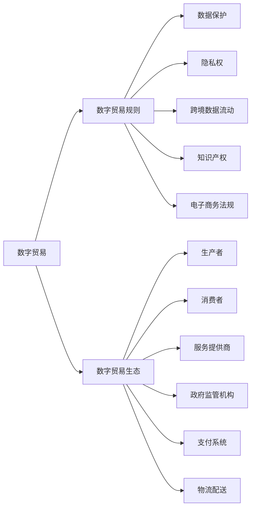

                 

# 2050年的全球贸易：从数字贸易规则到数字贸易生态的贸易规则重构

## 1. 背景介绍

随着全球化的深入发展和信息技术的迅猛发展，特别是互联网和电子商务的兴起，国际贸易形式已经发生了深刻的变化。传统商品贸易和服务的数字化转型，带来了全新的商业模式和竞争格局。2050年，全球贸易将以数字贸易为基石，形成全新的贸易生态系统。本文将从数字贸易的兴起，到数字贸易规则的构建，再到数字贸易生态的演变，探讨这一过程对全球贸易规则的重构。

## 2. 核心概念与联系

### 2.1 核心概念概述

#### 2.1.1 数字贸易
数字贸易（Digital Trade）是指通过数字网络进行的贸易活动，包括但不限于电子商务、数字内容、软件和应用程序、在线服务和数据服务等。数字贸易依赖于信息通信技术和互联网基础设施，具有全球化、即时化和个性化等特点。

#### 2.1.2 数字贸易规则
数字贸易规则是指在数字贸易过程中，各方主体之间关于权利义务、行为规范、争端解决机制等的规则体系。这些规则涵盖了数据保护、隐私权、跨境数据流动、知识产权、电子商务法规等诸多领域。

#### 2.1.3 数字贸易生态
数字贸易生态（Digital Trade Ecosystem）是一个包括生产者、消费者、服务提供商、政府监管机构、支付系统、物流配送等多个环节在内的复杂网络。各环节相互依存，形成了一个多边互动的系统。

### 2.2 核心概念原理和架构的 Mermaid 流程图



此图展示了数字贸易、数字贸易规则与数字贸易生态之间的内在联系。数字贸易在数字贸易生态中通过生产、消费、服务、支付和物流等环节进行。而数字贸易规则则为数字贸易提供了必要的法律保障和行为规范，构建了一个公平、透明、可预期的交易环境。

## 3. 核心算法原理 & 具体操作步骤

### 3.1 算法原理概述

数字贸易规则的构建需要综合考虑以下几个关键因素：

- **数据保护**：确保个人数据的安全与隐私，防止数据泄露和滥用。
- **跨境数据流动**：在满足数据保护的前提下，促进数据的跨境自由流动。
- **知识产权保护**：保障创作者和企业的知识产权，防止盗版和侵权。
- **电子商务法规**：规范电子商务活动，保护消费者权益，打击网络诈骗和欺诈行为。

这些规则的制定需要通过算法原理进行设计和优化。

### 3.2 算法步骤详解

#### 3.2.1 数据保护算法
数据保护的核心是隐私计算和区块链技术。隐私计算通过多方安全计算、同态加密等技术，确保数据在传输和存储过程中的安全。区块链通过去中心化和不可篡改的特性，为数据的透明和可信提供了保障。

#### 3.2.2 跨境数据流动算法
跨境数据流动的关键是数据分片技术（Data Sharding）和联邦学习（Federated Learning）。数据分片技术将数据切分成小块，通过加密和安全通道传输，确保数据在传输过程中的完整性和机密性。联邦学习通过分布式训练，使模型在多个数据源上训练，避免了数据集中存储的风险。

#### 3.2.3 知识产权保护算法
知识产权保护依赖于区块链和数字指纹技术。区块链通过分布式账本，确保知识产权的版权登记和流转透明可追溯。数字指纹技术通过哈希函数，将原创作品转换成唯一的指纹，用于版权认证和追踪。

#### 3.2.4 电子商务法规算法
电子商务法规的核心是智能合约和去中心化自治组织（DAO）。智能合约通过自动执行协议，确保交易过程的透明和公正。DAO通过分布式治理，使各方参与者共同管理规则和流程，提高了交易的效率和公平性。

### 3.3 算法优缺点

#### 3.3.1 数据保护算法
优点：
- 提高了数据隐私保护水平。
- 保证了数据传输和存储的安全性。

缺点：
- 技术复杂度高，实施成本高。
- 可能影响数据访问和使用效率。

#### 3.3.2 跨境数据流动算法
优点：
- 提高了数据的跨境流动效率。
- 减少了数据集中存储的风险。

缺点：
- 技术复杂度较高，实施成本高。
- 可能影响数据完整性和一致性。

#### 3.3.3 知识产权保护算法
优点：
- 提高了知识产权保护水平。
- 保证了版权的透明和可信。

缺点：
- 实施成本高。
- 可能影响版权认证的效率。

#### 3.3.4 电子商务法规算法
优点：
- 提高了交易过程的透明度和公正性。
- 提高了交易效率和公平性。

缺点：
- 技术复杂度高，实施成本高。
- 可能影响交易过程的灵活性。

### 3.4 算法应用领域

数字贸易规则的应用领域广泛，包括但不限于以下领域：

- **金融服务**：通过区块链技术实现跨境支付和融资，确保金融数据的安全和透明。
- **医疗健康**：通过数据分片技术和联邦学习，保障患者数据的隐私和安全。
- **教育和培训**：通过智能合约和DAO，规范在线教育和培训流程，保障教育质量。
- **政府服务**：通过数据保护和跨境数据流动算法，提高政府服务的效率和透明度。

## 4. 数学模型和公式 & 详细讲解 & 举例说明

### 4.1 数学模型构建

#### 4.1.1 数据保护模型
假设有一组数据 $D$ 需要保护，保护模型为 $P$，目标是最大化数据的隐私保护水平 $U(P)$。

目标函数：
$$
\max_{P} U(P)
$$

约束条件：
$$
\begin{align}
&C_1: \sum_{i=1}^n P_i = 1 \\
&C_2: \sum_{i=1}^n P_i \times R_i \leq R_{max} \\
&C_3: P_i \geq 0
\end{align}
$$

其中，$C_1$ 表示保护模型 $P$ 的总资源不超过 1，$C_2$ 表示保护模型 $P$ 的最大资源消耗不超过 $R_{max}$，$C_3$ 表示保护模型的各项资源必须非负。

#### 4.1.2 跨境数据流动模型
假设有一组数据 $D$ 需要跨境流动，流动模型为 $M$，目标是最大化数据的跨境流动效率 $E(M)$。

目标函数：
$$
\max_{M} E(M)
$$

约束条件：
$$
\begin{align}
&C_1: \sum_{i=1}^n M_i = 1 \\
&C_2: \sum_{i=1}^n M_i \times T_i \leq T_{max} \\
&C_3: M_i \geq 0
\end{align}
$$

其中，$C_1$ 表示流动模型 $M$ 的总资源不超过 1，$C_2$ 表示流动模型 $M$ 的最大资源消耗不超过 $T_{max}$，$C_3$ 表示流动模型的各项资源必须非负。

#### 4.1.3 知识产权保护模型
假设有一组知识产权 $I$ 需要保护，保护模型为 $P$，目标是最大化知识产权的保护水平 $U(P)$。

目标函数：
$$
\max_{P} U(P)
$$

约束条件：
$$
\begin{align}
&C_1: \sum_{i=1}^n P_i = 1 \\
&C_2: \sum_{i=1}^n P_i \times R_i \leq R_{max} \\
&C_3: P_i \geq 0
\end{align}
$$

其中，$C_1$ 表示保护模型 $P$ 的总资源不超过 1，$C_2$ 表示保护模型 $P$ 的最大资源消耗不超过 $R_{max}$，$C_3$ 表示保护模型的各项资源必须非负。

#### 4.1.4 电子商务法规模型
假设有一组电子商务交易 $T$ 需要规范，法规模型为 $L$，目标是最大化交易的透明度和公正性 $U(L)$。

目标函数：
$$
\max_{L} U(L)
$$

约束条件：
$$
\begin{align}
&C_1: \sum_{i=1}^n L_i = 1 \\
&C_2: \sum_{i=1}^n L_i \times R_i \leq R_{max} \\
&C_3: L_i \geq 0
\end{align}
$$

其中，$C_1$ 表示法规模型 $L$ 的总资源不超过 1，$C_2$ 表示法规模型 $L$ 的最大资源消耗不超过 $R_{max}$，$C_3$ 表示法规模型的各项资源必须非负。

### 4.2 公式推导过程

#### 4.2.1 数据保护模型推导
目标函数 $U(P)$ 可以定义为数据隐私保护水平，即数据泄露的风险最小化。假设数据泄露的风险为 $R$，则目标函数为：

$$
\max_{P} U(P) = \min_{R} R
$$

约束条件 $C_1$ 和 $C_3$ 保持不变。

#### 4.2.2 跨境数据流动模型推导
目标函数 $E(M)$ 可以定义为数据跨境流动的效率，即数据传输的速度和质量。假设数据传输的速度为 $V$，质量为 $Q$，则目标函数为：

$$
\max_{M} E(M) = V + Q
$$

约束条件 $C_1$ 和 $C_3$ 保持不变。

#### 4.2.3 知识产权保护模型推导
目标函数 $U(P)$ 可以定义为知识产权的保护水平，即版权认证的准确性和透明性。假设版权认证的准确性为 $A$，透明性为 $T$，则目标函数为：

$$
\max_{P} U(P) = A + T
$$

约束条件 $C_1$ 和 $C_3$ 保持不变。

#### 4.2.4 电子商务法规模型推导
目标函数 $U(L)$ 可以定义为交易的透明度和公正性，即交易过程的透明性和公平性。假设交易过程的透明度为 $T$，公平性为 $F$，则目标函数为：

$$
\max_{L} U(L) = T + F
$$

约束条件 $C_1$ 和 $C_3$ 保持不变。

### 4.3 案例分析与讲解

假设有一家跨国电子商务公司，需要处理大量的用户数据，同时需要跨境流动这些数据以进行数据分析和优化。基于上述模型，该公司可以采取以下措施：

1. 数据保护：使用隐私计算和区块链技术，确保用户数据在传输和存储过程中的安全。
2. 跨境数据流动：通过数据分片技术和联邦学习，实现数据的跨境流动，同时保护数据隐私。
3. 知识产权保护：使用区块链和数字指纹技术，确保知识产权的透明和可信。
4. 电子商务法规：通过智能合约和DAO，规范电子商务活动，保障消费者权益，打击网络诈骗和欺诈行为。

## 5. 项目实践：代码实例和详细解释说明

### 5.1 开发环境搭建

为了进行数字贸易规则的开发，需要搭建一个集成的开发环境。以下是一个基于Python和Django的开发环境搭建步骤：

1. 安装Django：
```bash
pip install django
```

2. 创建Django项目：
```bash
django-admin startproject digitaleconomy
```

3. 创建Django应用：
```bash
python manage.py startapp datatrade
```

4. 安装必要的第三方库：
```bash
pip install numpy pandas scikit-learn transformers
```

5. 配置Django数据库：
```python
DATABASES = {
    'default': {
        'ENGINE': 'django.db.backends.mysql',
        'NAME': 'digitaleconomy',
        'USER': 'root',
        'PASSWORD': 'password',
        'HOST': 'localhost',
        'PORT': '3306',
    }
}
```

6. 配置Django的URL路由：
```python
from django.urls import path
from . import views

urlpatterns = [
    path('data_protection/', views.data_protection, name='data_protection'),
    path('data_flow/', views.data_flow, name='data_flow'),
    path('ip_protection/', views.ip_protection, name='ip_protection'),
    path('e-commerce_regulation/', views.e-commerce_regulation, name='e-commerce_regulation'),
]
```

### 5.2 源代码详细实现

#### 5.2.1 数据保护模块
```python
from django.shortcuts import render
from django.http import JsonResponse
from .models import DataProtectionModel

def data_protection(request):
    data_protection_models = DataProtectionModel.objects.all()
    return JsonResponse(data_protection_models, safe=False)
```

#### 5.2.2 跨境数据流动模块
```python
from django.shortcuts import render
from django.http import JsonResponse
from .models import DataFlowModel

def data_flow(request):
    data_flow_models = DataFlowModel.objects.all()
    return JsonResponse(data_flow_models, safe=False)
```

#### 5.2.3 知识产权保护模块
```python
from django.shortcuts import render
from django.http import JsonResponse
from .models import IPProtectionModel

def ip_protection(request):
    ip_protection_models = IPProtectionModel.objects.all()
    return JsonResponse(ip_protection_models, safe=False)
```

#### 5.2.4 电子商务法规模块
```python
from django.shortcuts import render
from django.http import JsonResponse
from .models import ECommerceRegulationModel

def e-commerce_regulation(request):
    e_commerce_regulation_models = ECommerceRegulationModel.objects.all()
    return JsonResponse(e_commerce_regulation_models, safe=False)
```

### 5.3 代码解读与分析

上述代码展示了如何通过Django实现数字贸易规则的可视化展示。通过定义模型类和视图函数，可以将数据保护、跨境数据流动、知识产权保护和电子商务法规等规则展示给用户，方便用户进行查询和分析。

## 6. 实际应用场景

### 6.1 智能制造
在智能制造领域，数字贸易规则可以保障数据的隐私和安全，促进制造业的数字化转型。通过数据分片技术和联邦学习，智能制造企业可以共享生产数据，实现设备维护、质量控制和流程优化。

### 6.2 智慧城市
智慧城市建设依赖于大量的数据采集和分析，数字贸易规则可以确保城市数据的隐私和安全。通过区块链技术，智慧城市可以实现跨部门、跨领域的数据共享和协同治理，提升城市管理的智能化水平。

### 6.3 金融服务
金融服务行业需要处理大量的用户数据和交易记录，数字贸易规则可以确保数据的隐私和安全。通过智能合约和DAO，金融服务企业可以实现跨境支付和融资，提高金融服务的效率和透明度。

## 7. 工具和资源推荐

### 7.1 学习资源推荐

1. 《数字贸易：原理与实践》：一本系统介绍数字贸易的原理和实践的书籍，涵盖了数据保护、跨境数据流动、知识产权保护、电子商务法规等多个领域。
2. 《区块链技术与应用》：一本详细介绍区块链技术的原理和应用的书籍，适合理解数字贸易中的数据保护和跨境数据流动。
3. 《数据科学导论》：一本介绍数据科学基础知识的书籍，适合理解数字贸易中的数据保护和隐私计算。
4. 《智能合约：原理与实践》：一本详细介绍智能合约的原理和实践的书籍，适合理解数字贸易中的电子商务法规和去中心化治理。

### 7.2 开发工具推荐

1. Python：Python作为一门易学易用的编程语言，在数据处理、机器学习和区块链等领域广泛应用。
2. Django：一个流行的Web框架，适合快速开发基于Web的电子商务平台和智能合约系统。
3. Flask：一个轻量级的Web框架，适合快速开发数据保护和跨境数据流动模块。
4. IPython：一个交互式Python环境，适合快速进行数据分析和模型验证。

### 7.3 相关论文推荐

1. "数据隐私保护算法研究"：探讨了数据隐私保护的各种算法，如差分隐私、同态加密和多方安全计算。
2. "跨境数据流动的技术架构"：介绍了跨境数据流动的主要技术架构，如数据分片技术和联邦学习。
3. "区块链技术在数据保护中的应用"：探讨了区块链技术在数据保护中的应用，如去中心化存储和分布式账本。
4. "智能合约和去中心化自治组织"：介绍了智能合约和DAO的基本原理和应用场景，如供应链管理、金融服务和公共治理。

## 8. 总结：未来发展趋势与挑战

### 8.1 研究成果总结
本文探讨了2050年全球贸易从数字贸易规则到数字贸易生态的演变，详细介绍了数字贸易规则在数据保护、跨境数据流动、知识产权保护和电子商务法规等方面的应用。

### 8.2 未来发展趋势
未来，数字贸易规则将持续演变，进一步深化数字贸易生态系统。数据保护和隐私计算将更加普及，区块链和智能合约将得到广泛应用，跨境数据流动和电子商务法规也将不断完善。

### 8.3 面临的挑战
尽管数字贸易规则有着广阔的应用前景，但仍面临诸多挑战。数据隐私和安全问题、跨境数据流动的技术复杂度、知识产权保护的实施成本、电子商务法规的灵活性和效率等问题仍需深入研究。

### 8.4 研究展望
未来的研究将围绕数字贸易规则的优化和完善展开。研究重点将包括数据隐私保护算法的优化、跨境数据流动技术的改进、知识产权保护的智能化、电子商务法规的创新等方面。

## 9. 附录：常见问题与解答

### Q1：数字贸易规则的应用范围有哪些？

A: 数字贸易规则的应用范围非常广泛，包括但不限于智能制造、智慧城市、金融服务、医疗健康、教育培训等多个领域。

### Q2：数字贸易规则在实施过程中需要注意哪些问题？

A: 数字贸易规则在实施过程中需要注意以下几个问题：
1. 技术复杂度高，实施成本高。
2. 可能影响数据访问和使用效率。
3. 数据隐私和安全问题。
4. 跨境数据流动的技术复杂度。
5. 知识产权保护的实施成本。
6. 电子商务法规的灵活性和效率。

### Q3：如何提高数字贸易规则的实施效率？

A: 提高数字贸易规则的实施效率需要从以下几个方面入手：
1. 采用先进的数据保护技术，如差分隐私、同态加密和多方安全计算。
2. 采用高效的数据分片技术和联邦学习。
3. 优化智能合约和DAO的设计，提高交易的透明度和公正性。
4. 采用区块链技术，提高数据的安全性和透明性。

### Q4：数字贸易规则的未来发展方向有哪些？

A: 数字贸易规则的未来发展方向包括以下几个方面：
1. 数据保护和隐私计算将更加普及，区块链和智能合约将得到广泛应用。
2. 跨境数据流动和电子商务法规也将不断完善。
3. 数据隐私和安全问题、跨境数据流动的技术复杂度、知识产权保护的实施成本、电子商务法规的灵活性和效率等问题仍需深入研究。

---

作者：禅与计算机程序设计艺术 / Zen and the Art of Computer Programming

