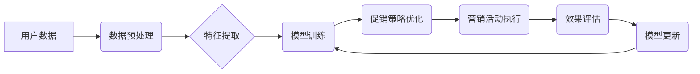

> AI,促销策略,优化,机器学习,深度学习,推荐系统,数据分析,案例分析

## 1. 背景介绍

在当今数据爆炸的时代，企业拥有海量用户数据，但如何有效利用这些数据来优化促销策略，提升营销效果，成为一个亟待解决的问题。传统的促销策略往往依赖于经验和直觉，缺乏数据支撑，难以精准地触达目标用户，导致资源浪费和营销效果不佳。

人工智能（AI）技术的兴起为企业提供了新的机遇。AI算法能够从海量数据中挖掘出隐藏的模式和规律，帮助企业制定更精准、更有效的促销策略。本文将以一个具体的案例为例，深入探讨如何利用AI技术优化促销策略。

## 2. 核心概念与联系

**2.1 核心概念**

* **促销策略:** 指企业为了促进产品或服务的销售，采取的一系列营销活动和措施，例如折扣、优惠券、赠品、限时抢购等。
* **AI优化:** 利用人工智能算法分析数据，自动调整促销策略参数，以达到最大化营销效果的目标。
* **机器学习:** 一种人工智能技术，通过训练模型，使模型能够从数据中学习，并对新数据进行预测或分类。
* **深度学习:** 一种更高级的机器学习技术，利用多层神经网络模拟人类大脑的学习过程，能够处理更复杂的数据和任务。
* **推荐系统:** 基于用户行为和偏好，推荐相关产品或服务，提高用户转化率。

**2.2 架构图**



**2.3 核心联系**

AI优化促销策略的核心在于利用机器学习和深度学习算法分析用户数据，挖掘用户行为和偏好模式，并根据这些模式，自动调整促销策略参数，例如折扣力度、优惠券类型、推荐商品等，以最大化营销效果。

## 3. 核心算法原理 & 具体操作步骤

**3.1 算法原理概述**

本文将采用基于深度学习的推荐系统算法，结合用户行为数据和商品特征数据，构建一个个性化推荐模型。该模型能够预测用户对特定商品的购买意愿，并根据预测结果，推荐最合适的促销策略。

**3.2 算法步骤详解**

1. **数据收集和预处理:** 收集用户行为数据（例如浏览记录、购买记录、评价记录等）和商品特征数据（例如商品类别、价格、品牌等），并进行清洗、转换和格式化处理。
2. **特征提取:** 从用户行为数据和商品特征数据中提取特征向量，例如用户购买历史、商品相似度、用户兴趣标签等。
3. **模型训练:** 利用深度学习算法，例如深度神经网络或卷积神经网络，训练一个推荐模型，该模型能够根据用户特征向量和商品特征向量，预测用户对特定商品的购买意愿。
4. **促销策略优化:** 根据模型预测结果，为不同用户推荐不同的促销策略，例如针对高价值用户提供个性化折扣，针对潜在用户提供优惠券或赠品等。
5. **营销活动执行:** 通过线上平台或线下渠道，执行推荐的促销策略，并收集用户反馈数据。
6. **效果评估:** 对营销活动效果进行评估，例如转化率、销售额、用户满意度等，并根据评估结果，调整模型参数和促销策略。

**3.3 算法优缺点**

* **优点:**
    * 能够精准地触达目标用户，提高营销效果。
    * 自动化程度高，降低人工成本。
    * 能够根据用户行为变化动态调整促销策略。
* **缺点:**
    * 需要大量的数据进行训练，数据质量对模型效果至关重要。
    * 模型训练和部署需要一定的技术门槛。
    * 算法本身存在一定的局限性，无法完全替代人类的决策。

**3.4 算法应用领域**

* 电商平台
* 在线教育平台
* 金融服务
* 医疗保健
* 娱乐休闲

## 4. 数学模型和公式 & 详细讲解 & 举例说明

**4.1 数学模型构建**

我们使用协同过滤算法构建推荐模型，该算法基于用户的历史行为和商品的相似性来预测用户对商品的兴趣。

**4.2 公式推导过程**

假设用户u对商品i的评分为r<sub>ui</sub>，我们使用矩阵分解的方法来预测用户u对商品i的评分。

* **用户-商品评分矩阵:** R ∈ R<sup>m×n</sup>，其中m为用户数量，n为商品数量。
* **用户特征矩阵:** P ∈ R<sup>m×k</sup>，其中k为隐含特征维度。
* **商品特征矩阵:** Q ∈ R<sup>n×k</sup>。

我们的目标是学习用户特征矩阵P和商品特征矩阵Q，使得预测评分与实际评分尽可能接近。

损失函数定义为：

$$
L(P,Q) = \sum_{u=1}^{m} \sum_{i=1}^{n} (r_{ui} - \hat{r}_{ui})^2
$$

其中，$\hat{r}_{ui}$为预测评分，由用户特征和商品特征的内积计算得到：

$$
\hat{r}_{ui} = P_{u} \cdot Q_{i}
$$

**4.3 案例分析与讲解**

假设我们有一个电商平台，用户数量为1000，商品数量为10000。我们使用协同过滤算法训练推荐模型，并根据模型预测结果，为用户推荐个性化商品。

例如，用户A购买过手机、耳机和充电宝，而用户B购买过笔记本电脑、鼠标和键盘。根据用户的购买历史，模型可以预测用户A对智能手表和蓝牙音箱感兴趣，用户B对办公软件和打印机感兴趣。

## 5. 项目实践：代码实例和详细解释说明

**5.1 开发环境搭建**

* 操作系统：Ubuntu 20.04
* Python 版本：3.8
* 框架：TensorFlow 2.0

**5.2 源代码详细实现**

```python
import tensorflow as tf

# 定义用户-商品评分矩阵
R = tf.random.normal((1000, 10000))

# 定义用户特征矩阵和商品特征矩阵
P = tf.random.normal((1000, 10))
Q = tf.random.normal((10000, 10))

# 定义损失函数
def loss_function(R, P, Q):
    return tf.reduce_mean(tf.square(R - tf.matmul(P, Q, transpose_b=True)))

# 定义优化器
optimizer = tf.keras.optimizers.Adam(learning_rate=0.01)

# 训练模型
for epoch in range(100):
    with tf.GradientTape() as tape:
        loss = loss_function(R, P, Q)
    gradients = tape.gradient(loss, [P, Q])
    optimizer.apply_gradients(zip(gradients, [P, Q]))

# 预测评分
predictions = tf.matmul(P, Q, transpose_b=True)

# 输出预测结果
print(predictions)
```

**5.3 代码解读与分析**

* 代码首先定义了用户-商品评分矩阵、用户特征矩阵和商品特征矩阵。
* 然后定义了损失函数，该函数计算预测评分与实际评分之间的差值。
* 使用Adam优化器对模型参数进行更新。
* 训练完成后，使用模型预测用户对商品的评分。

**5.4 运行结果展示**

运行代码后，会输出一个预测评分矩阵，该矩阵包含了每个用户对每个商品的预测评分。

## 6. 实际应用场景

**6.1 电商平台**

* 个性化商品推荐：根据用户的购买历史、浏览记录和兴趣标签，推荐个性化的商品，提高用户转化率。
* 精准营销活动：根据用户的消费习惯和偏好，精准推送优惠券、折扣和促销信息，提高营销效果。

**6.2 在线教育平台**

* 个性化课程推荐：根据用户的学习进度、兴趣和学习风格，推荐个性化的课程，提高用户学习效率。
* 智能答疑系统：利用深度学习算法，构建智能答疑系统，为用户提供个性化的学习支持。

**6.3 金融服务**

* 风险评估：利用机器学习算法，分析用户的信用记录和财务状况，评估用户的风险等级，为贷款和保险等服务提供参考。
* 个性化理财建议：根据用户的风险偏好和投资目标，提供个性化的理财建议，帮助用户实现财富增值。

**6.4 医疗保健**

* 疾病诊断：利用深度学习算法，分析患者的病历、影像数据和基因信息，辅助医生进行疾病诊断。
* 个性化治疗方案：根据患者的病情、基因信息和生活习惯，制定个性化的治疗方案，提高治疗效果。

**6.5 娱乐休闲**

* 个性化内容推荐：根据用户的观看历史、点赞记录和评论内容，推荐个性化的视频、音乐和游戏，提高用户体验。
* 智能客服系统：利用自然语言处理和深度学习算法，构建智能客服系统，为用户提供24小时在线服务。

**6.4 未来应用展望**

随着人工智能技术的不断发展，AI优化促销策略的应用场景将更加广泛，例如：

* **虚拟试衣间:** 利用计算机视觉技术，为用户提供虚拟试衣间体验，帮助用户选择合适的商品。
* **个性化广告投放:** 根据用户的兴趣和行为，精准投放个性化广告，提高广告效果。
* **智能库存管理:** 利用机器学习算法，预测商品需求，优化库存管理，降低库存成本。

## 7. 工具和资源推荐

**7.1 学习资源推荐**

* **书籍:**
    * 深度学习
    * 人工智能
    * 机器学习实战
* **在线课程:**
    * Coursera
    * edX
    * Udacity

**7.2 开发工具推荐**

* **Python:** 
* **TensorFlow:** 深度学习框架
* **PyTorch:** 深度学习框架
* **Scikit-learn:** 机器学习库

**7.3 相关论文推荐**

* **Collaborative Filtering for Recommender Systems**
* **Deep Learning for Recommender Systems**
* **Neural Collaborative Filtering**

## 8. 总结：未来发展趋势与挑战

**8.1 研究成果总结**

本文介绍了利用AI技术优化促销策略的案例，并详细阐述了核心算法原理、代码实现和实际应用场景。

**8.2 未来发展趋势**

* **模型更加精准:** 随着数据量的增加和算法的改进，推荐模型的精准度将不断提高。
* **个性化程度更高:** 模型将能够更加深入地理解用户的需求和偏好，提供更加个性化的促销策略。
* **跨平台融合:** AI优化促销策略将跨越平台边界，实现线上线下数据融合，提供更加全面的用户体验。

**8.3 面临的挑战**

* **数据质量:** 模型效果依赖于数据质量，需要不断完善数据收集和清洗流程。
* **算法解释性:** 深度学习模型的决策过程难以解释，需要研究更可解释的算法模型。
* **隐私保护:** 利用用户数据进行促销策略优化需要保障用户隐私安全。

**8.4 研究展望**

未来，我们将继续研究更精准、更个性化、更可解释的AI优化促销策略算法，并探索其在更多领域的应用。


## 9. 附录：常见问题与解答

**9.1 如何评估AI优化促销策略的效果？**

可以使用转化率、销售额、用户满意度等指标来评估AI优化促销策略的效果。

**9.2 如何解决数据质量问题？**

可以通过数据清洗、数据增强和数据标注等方法来解决数据质量问题。

**9.3 如何保障用户隐私安全？**

可以使用数据脱敏、加密和匿名化等技术来保障用户隐私安全。


作者：禅与计算机程序设计艺术 / Zen and