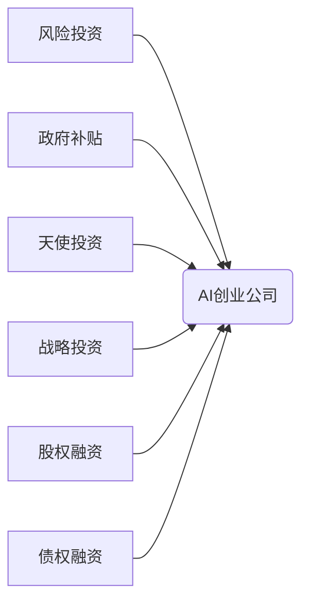

> AI创业, 融资渠道, 风险投资, 政府补贴, 创投, 天使投资, 战略投资, 股权融资, 债权融资, 知识产权

## 1. 背景介绍

人工智能（AI）技术近年来发展迅速，已渗透到各个行业，催生了一批新的创业公司。这些AI创业公司致力于利用AI技术解决现实世界中的问题，并创造新的价值。然而，AI创业公司往往需要大量的资金投入才能进行研发、推广和运营。因此，了解不同的融资渠道，并制定合理的融资策略，对于AI创业公司的成功至关重要。

## 2. 核心概念与联系

**2.1 融资渠道概述**

融资渠道是指企业获取资金的途径。对于AI创业公司来说，常见的融资渠道包括：

* **风险投资（Venture Capital）：** 风险投资是指专业机构以股权形式投资高成长性、高风险的创业公司，并期待在未来获得高回报。
* **政府补贴（Government Subsidies）：** 政府为了鼓励科技创新和产业发展，会提供各种形式的补贴和扶持政策给AI创业公司。
* **创投（Angel Investment）：** 天使投资是指个人投资者以股权形式投资早期阶段的创业公司，通常投资额较小，但对创业公司的发展起着重要的引导作用。
* **战略投资（Strategic Investment）：** 战略投资是指大型企业或机构以股权形式投资其他公司，目的是为了获得技术、市场或资源等方面的优势。
* **股权融资（Equity Financing）：** 股权融资是指企业通过发行股票或其他股权工具筹集资金，投资者获得公司股权，并分享公司未来的利润。
* **债权融资（Debt Financing）：** 债权融资是指企业通过向银行或其他金融机构借款筹集资金，投资者获得公司债券，并获得利息收益。

**2.2 融资渠道关系图**

## 3. 核心算法原理 & 具体操作步骤

**3.1 算法原理概述**

AI创业公司融资的决策是一个复杂的决策过程，需要考虑多种因素，例如公司的发展阶段、技术水平、市场前景、团队实力等。

**3.2 算法步骤详解**

1. **评估公司价值:** 首先需要对公司的价值进行评估，包括技术价值、市场价值和团队价值。
2. **确定融资需求:** 根据公司的发展计划和资金需求，确定需要筹集的资金规模。
3. **选择融资渠道:** 根据公司的发展阶段、技术水平、市场前景和团队实力等因素，选择合适的融资渠道。
4. **准备融资材料:** 准备公司介绍、财务报表、商业计划书等融资材料。
5. **寻找投资人:** 通过各种渠道寻找潜在的投资人，例如行业会议、投资机构数据库、个人网络等。
6. **进行融资谈判:** 与投资人进行融资谈判，协商融资条款，例如股权比例、投资金额、退出机制等。
7. **完成融资:** 完成融资协议的签署，并完成资金的到位。

**3.3 算法优缺点**

* **优点:** 能够帮助AI创业公司快速获得资金，加速发展。
* **缺点:** 融资过程复杂，需要花费大量的时间和精力，并且需要放弃部分股权。

**3.4 算法应用领域**

该算法适用于所有类型的AI创业公司，无论其发展阶段、技术水平还是市场前景如何。

## 4. 数学模型和公式 & 详细讲解 & 举例说明

**4.1 数学模型构建**

假设AI创业公司需要筹集资金 $X$，公司估值 $V$，投资人愿意投资的比例 $P$，则可构建以下数学模型：

$$X = V \times P$$

**4.2 公式推导过程**

该公式的推导过程如下：

* 公司估值 $V$ 代表公司未来的价值，是投资人评估公司价值的基础。
* 投资人愿意投资的比例 $P$ 代表投资人对公司未来的信心，以及他们愿意承担的风险。
* 筹集资金 $X$ 是公司获得的投资金额，等于公司估值乘以投资人愿意投资的比例。

**4.3 案例分析与讲解**

假设一家AI创业公司估值为 $100$ 万美元，一位风险投资人愿意投资 $20\%$ 的股权，则该公司可以筹集到 $100 \times 0.2 = 20$ 万美元的资金。

## 5. 项目实践：代码实例和详细解释说明

**5.1 开发环境搭建**

AI创业公司融资的决策过程通常需要借助一些工具和平台，例如：

* **Pitch Deck 制作工具:** 用于制作公司介绍和融资方案的演示文稿。
* **财务建模工具:** 用于进行财务预测和分析，评估公司的盈利能力和融资需求。
* **投资人数据库:** 用于寻找潜在的投资人，了解他们的投资方向和投资策略。

**5.2 源代码详细实现**

由于AI创业公司融资的决策过程是一个复杂的决策过程，需要考虑多种因素，因此无法用代码直接实现。

**5.3 代码解读与分析**

**5.4 运行结果展示**

## 6. 实际应用场景

AI创业公司融资的实际应用场景非常广泛，例如：

* **医疗健康:** AI创业公司可以利用AI技术开发新的医疗诊断和治疗方案，并通过融资获得资金支持进行研发和推广。
* **金融科技:** AI创业公司可以利用AI技术开发新的金融产品和服务，例如智能理财、信用评估等，并通过融资获得资金支持进行业务扩张。
* **自动驾驶:** AI创业公司可以利用AI技术开发自动驾驶系统，并通过融资获得资金支持进行研发和测试。

**6.4 未来应用展望**

随着AI技术的不断发展，AI创业公司融资的市场将会更加活跃，融资渠道也会更加多元化。

## 7. 工具和资源推荐

**7.1 学习资源推荐**

* **书籍:** 《创业投资》、《人工智能投资指南》
* **网站:** Crunchbase、AngelList、TechCrunch
* **课程:** Coursera、edX

**7.2 开发工具推荐**

* **Pitch Deck 制作工具:** Canva、Beautiful.ai
* **财务建模工具:** Excel、Google Sheets
* **投资人数据库:** Crunchbase、AngelList

**7.3 相关论文推荐**

* **人工智能投资趋势分析**
* **AI创业公司融资模式研究**

## 8. 总结：未来发展趋势与挑战

**8.1 研究成果总结**

AI创业公司融资是一个复杂的决策过程，需要考虑多种因素，并选择合适的融资渠道。

**8.2 未来发展趋势**

未来，AI创业公司融资的市场将会更加活跃，融资渠道也会更加多元化。

**8.3 面临的挑战**

AI创业公司融资面临的挑战包括：

* **估值难题:** AI技术的价值难以量化，导致估值存在较大差异。
* **风险偏好:** 投资人对AI技术的风险偏好较高，导致融资难度较大。
* **监管环境:** AI技术的监管环境尚不完善，导致融资存在不确定性。

**8.4 研究展望**

未来研究方向包括：

* **开发更精准的AI创业公司估值模型。**
* **探索新的AI创业公司融资模式。**
* **推动AI技术监管环境的完善。**

## 9. 附录：常见问题与解答

**9.1 如何选择合适的融资渠道？**

选择合适的融资渠道需要根据公司的发展阶段、技术水平、市场前景和团队实力等因素进行综合考虑。

**9.2 如何进行融资谈判？**

融资谈判需要充分准备，了解投资人的投资方向和投资策略，并协商合理的融资条款。

**9.3 如何应对投资人提出的问题？**

在融资过程中，投资人可能会提出很多问题，需要认真准备，并以清晰、简洁、准确的方式进行回答。

作者：禅与计算机程序设计艺术 / Zen and the Art of Computer Programming 
<end_of_turn>