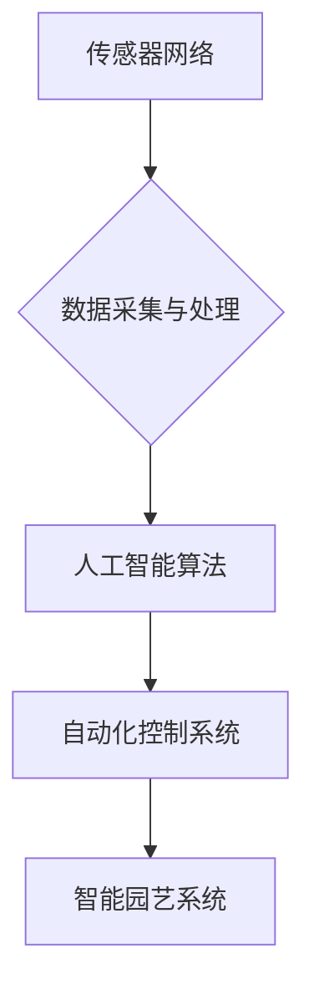

> 智能园艺，人工智能，机器学习，计算机视觉，传感器网络，自动化控制，植物生长模型

## 1. 背景介绍

随着全球人口增长和对粮食安全日益增长的关注，农业生产效率的提升已成为当今世界面临的重大挑战。传统农业模式面临着资源消耗大、环境污染严重、劳动密集度高等问题。智能园艺作为农业现代化的重要方向，利用人工智能（AI）、物联网（IoT）等先进技术，实现对植物生长环境的精准控制和自动化管理，为提高农业生产效率、降低环境影响、保障粮食安全提供了新的解决方案。

## 2. 核心概念与联系

智能园艺的核心概念是将人工智能技术应用于园艺生产过程，实现对植物生长环境的智能感知、分析和控制。其主要包括以下几个方面：

* **传感器网络:** 用于实时监测植物生长环境中的各种参数，例如温度、湿度、光照强度、土壤水分、营养元素含量等。
* **数据采集与处理:** 将传感器采集到的数据进行传输、存储和分析，提取植物生长规律和环境变化趋势。
* **人工智能算法:** 利用机器学习、深度学习等算法，对植物生长数据进行建模和预测，为智能控制提供决策依据。
* **自动化控制系统:** 根据人工智能算法的预测结果，自动调节植物生长环境，例如控制温湿度、光照、灌溉、施肥等。

**核心概念架构图:**



## 3. 核心算法原理 & 具体操作步骤

### 3.1  算法原理概述

智能园艺中常用的核心算法包括：

* **植物生长模型:** 建立描述植物生长规律的数学模型，预测植物在不同环境条件下的生长情况。
* **机器学习算法:** 用于分析植物生长数据，识别生长模式、预测产量、识别病虫害等。
* **深度学习算法:** 用于处理复杂图像数据，识别植物种类、病虫害症状等。

### 3.2  算法步骤详解

以植物生长模型为例，其具体操作步骤如下：

1. **数据收集:** 收集植物生长过程中的各种数据，例如温度、湿度、光照强度、土壤水分、营养元素含量、生长速度等。
2. **数据预处理:** 对收集到的数据进行清洗、转换、归一化等处理，使其符合模型训练的要求。
3. **模型选择:** 根据植物生长特点和数据类型，选择合适的模型，例如线性回归、支持向量机、神经网络等。
4. **模型训练:** 利用训练数据训练模型，调整模型参数，使其能够准确预测植物生长情况。
5. **模型评估:** 利用测试数据评估模型的预测精度，并根据评估结果进行模型优化。
6. **模型应用:** 将训练好的模型应用于实际生产中，预测植物生长情况，为智能控制提供决策依据。

### 3.3  算法优缺点

**优点:**

* 能够准确预测植物生长情况，提高生产效率。
* 能够根据植物生长需求，自动调节环境条件，降低资源消耗。
* 能够识别病虫害，及时采取措施，减少损失。

**缺点:**

* 模型训练需要大量数据，数据采集和处理成本较高。
* 模型精度受数据质量和模型复杂度影响，需要不断优化和改进。
* 系统部署和维护成本较高。

### 3.4  算法应用领域

智能园艺算法广泛应用于以下领域：

* **温室农业:** 控制温湿度、光照、灌溉、施肥等环境条件，提高作物产量和品质。
* **垂直农场:** 利用有限空间进行高密度种植，提高土地利用效率。
* **家庭园艺:** 为家庭用户提供智能化的植物护理解决方案，方便用户种植和管理植物。

## 4. 数学模型和公式 & 详细讲解 & 举例说明

### 4.1  数学模型构建

植物生长模型通常采用非线性模型，例如Logistic模型、Gompertz模型等，其核心思想是描述植物生长速度随时间变化的规律。

**Logistic模型:**

$$
\frac{dN}{dt} = rN\left(1-\frac{N}{K}\right)
$$

其中：

* $N$：植物数量
* $t$：时间
* $r$：增长率
* $K$：环境承载力

**Gompertz模型:**

$$
\frac{dN}{dt} = rN\ln\left(\frac{K}{N}\right)
$$

其中：

* $N$：植物数量
* $t$：时间
* $r$：增长率
* $K$：环境承载力

### 4.2  公式推导过程

Logistic模型和Gompertz模型的推导过程较为复杂，涉及微积分和生态学原理。

### 4.3  案例分析与讲解

假设我们想要预测番茄的生长情况，可以使用Logistic模型进行建模。

* 首先，我们需要收集番茄生长过程中的数据，例如种植时间、番茄数量、环境温度、光照强度等。
* 然后，我们可以使用这些数据训练Logistic模型，并根据模型的预测结果，预测番茄在未来一段时间内的生长情况。

## 5. 项目实践：代码实例和详细解释说明

### 5.1  开发环境搭建

智能园艺项目开发环境通常包括以下软件：

* **操作系统:** Linux、Windows、macOS等
* **编程语言:** Python、C++、Java等
* **机器学习库:** TensorFlow、PyTorch、Scikit-learn等
* **数据处理库:** Pandas、NumPy等
* **物联网平台:** AWS IoT、Azure IoT Hub等

### 5.2  源代码详细实现

以下是一个使用Python和TensorFlow实现植物生长模型的简单代码示例：

```python
import tensorflow as tf

# 定义模型结构
model = tf.keras.models.Sequential([
    tf.keras.layers.Dense(64, activation='relu', input_shape=(5,)),
    tf.keras.layers.Dense(32, activation='relu'),
    tf.keras.layers.Dense(1)
])

# 编译模型
model.compile(optimizer='adam', loss='mse')

# 训练模型
model.fit(X_train, y_train, epochs=10)

# 预测模型
predictions = model.predict(X_test)
```

### 5.3  代码解读与分析

* 代码首先定义了一个简单的多层感知机模型，输入层有5个神经元，对应于5个植物生长环境参数。
* 模型使用ReLU激活函数，并包含两个隐藏层和一个输出层。
* 模型使用Adam优化器和均方误差损失函数进行训练。
* 训练完成后，可以使用模型预测新的植物生长数据。

### 5.4  运行结果展示

训练后的模型可以用于预测植物生长情况，例如预测番茄的产量、生长时间等。

## 6. 实际应用场景

### 6.1  温室农业

智能园艺技术在温室农业中应用广泛，可以实现对温室环境的精准控制，提高作物产量和品质。例如，可以根据植物生长需求自动调节温湿度、光照、灌溉、施肥等环境条件，并利用传感器监测植物生长情况，及时发现病虫害，采取措施进行防治。

### 6.2  垂直农场

垂直农场利用有限空间进行高密度种植，可以有效提高土地利用效率。智能园艺技术可以帮助垂直农场实现自动化管理，例如自动控制灯光、灌溉、施肥等，提高生产效率和降低成本。

### 6.3  家庭园艺

智能园艺技术也可以应用于家庭园艺，为家庭用户提供智能化的植物护理解决方案。例如，可以利用智能传感器监测植物生长环境，并根据植物需求自动调节浇水、施肥等，帮助用户轻松种植和管理植物。

### 6.4  未来应用展望

随着人工智能技术的发展，智能园艺技术将更加智能化、自动化，并应用于更多领域。例如，可以利用机器学习算法识别植物病虫害，并自动采取防治措施；可以利用深度学习算法识别植物种类，并提供个性化的种植建议；可以利用无人机进行植物生长监测，并自动进行施肥、除草等操作。

## 7. 工具和资源推荐

### 7.1  学习资源推荐

* **书籍:**
    * 《智能农业》
    * 《人工智能与农业》
    * 《机器学习实战》
* **在线课程:**
    * Coursera: 机器学习
    * edX: 深度学习
    * Udacity: 自动化农业

### 7.2  开发工具推荐

* **传感器:**
    * DHT11
    * BMP180
    * BME280
* **微控制器:**
    * Arduino
    * Raspberry Pi
* **物联网平台:**
    * AWS IoT
    * Azure IoT Hub
    * Google Cloud IoT Core

### 7.3  相关论文推荐

* **智能园艺中的机器学习应用**
* **深度学习在植物病虫害识别中的应用**
* **基于人工智能的智能农业系统设计**

## 8. 总结：未来发展趋势与挑战

### 8.1  研究成果总结

智能园艺技术在农业生产中取得了显著的成果，例如提高了作物产量和品质、降低了资源消耗、提高了农业生产效率。

### 8.2  未来发展趋势

未来，智能园艺技术将更加智能化、自动化，并应用于更多领域。例如，可以利用人工智能技术实现对植物生长环境的精准控制，并根据植物需求自动调节生长条件；可以利用无人机进行植物生长监测，并自动进行施肥、除草等操作；可以利用大数据分析技术预测植物生长情况，并为农业生产提供决策支持。

### 8.3  面临的挑战

智能园艺技术的发展也面临着一些挑战，例如：

* 数据获取和处理成本较高
* 模型精度受数据质量和模型复杂度影响
* 系统部署和维护成本较高
* 人工智能技术在农业领域的应用还处于初期阶段，需要进一步研究和探索。

### 8.4  研究展望

未来，我们需要继续加强对智能园艺技术的研发和应用，并解决其面临的挑战，以推动农业现代化发展，保障粮食安全。

## 9. 附录：常见问题与解答

**常见问题:**

* 智能园艺技术是否适合所有类型的作物？
* 智能园艺系统的成本如何？
* 智能园艺技术是否会取代人工？

**解答:**

* 智能园艺技术可以应用于多种类型的作物，但具体应用效果取决于作物的生长特性和环境条件。
* 智能园艺系统的成本取决于系统的规模和功能，一般来说，小型系统成本相对较低，大型系统成本较高。
* 智能园艺技术可以辅助人工，提高农业生产效率，但不会完全取代人工。


作者：禅与计算机程序设计艺术 / Zen and the Art of Computer Programming 
<end_of_turn>