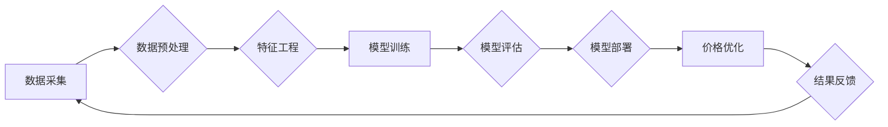

> 电商价格优化，人工智能，机器学习，深度学习，预测模型，需求预测，价格策略

## 1. 背景介绍

在当今激烈的电商市场竞争中，价格优化已成为企业提升利润率和市场份额的关键策略。传统的定价方法往往依赖于经验和主观判断，难以适应市场需求的快速变化和复杂性。随着人工智能（AI）技术的快速发展，AI在电商价格优化中的应用逐渐成为行业热点。

AI技术能够通过对海量数据进行分析和学习，建立精准的预测模型，从而帮助企业制定更科学、更有效的定价策略。AI驱动的价格优化系统能够实时监测市场动态、用户行为和竞争对手价格，并根据这些信息动态调整商品价格，以最大化利润。

## 2. 核心概念与联系

**2.1 电商价格优化**

电商价格优化是指通过运用数据分析、机器学习等技术手段，对电商平台商品的价格进行科学调整，以实现利润最大化、库存优化、市场份额提升等目标。

**2.2 人工智能 (AI)**

人工智能是指模拟人类智能行为的计算机系统。AI技术涵盖了机器学习、深度学习、自然语言处理等多个领域，能够帮助企业自动化决策、提高效率和精准度。

**2.3 机器学习 (ML)**

机器学习是人工智能的一个分支，它通过算法训练模型，使模型能够从数据中学习并做出预测或决策。在电商价格优化中，机器学习算法可以用于预测商品需求、分析价格敏感度、识别市场趋势等。

**2.4 深度学习 (DL)**

深度学习是机器学习的一个子领域，它使用多层神经网络来模拟人类大脑的学习过程。深度学习算法能够处理更复杂的数据，并取得更高的预测精度。

**2.5 预测模型**

预测模型是基于机器学习算法训练出来的模型，能够根据历史数据预测未来事件或趋势。在电商价格优化中，预测模型可以用于预测商品需求、价格波动、竞争对手行为等。

**2.6 价格策略**

价格策略是指企业根据市场情况和自身目标制定商品定价的方案。AI技术可以帮助企业制定更灵活、更精准的价格策略，例如动态定价、个性化定价、捆绑定价等。

**2.7 流程图**



## 3. 核心算法原理 & 具体操作步骤

### 3.1 算法原理概述

电商价格优化算法通常基于机器学习和深度学习技术，通过训练模型预测商品需求、价格敏感度和竞争对手行为等关键因素，从而制定最优价格策略。常见的算法包括：

* **线性回归:** 用于预测商品价格与销量之间的线性关系。
* **逻辑回归:** 用于预测商品是否会被购买，以及购买概率。
* **决策树:** 用于根据商品特征和市场条件，构建决策规则，确定最佳价格。
* **支持向量机 (SVM):** 用于分类和回归，可以用于预测商品价格的上下限。
* **神经网络:** 用于处理复杂数据，可以学习更复杂的非线性关系，提高预测精度。

### 3.2 算法步骤详解

1. **数据采集:** 收集商品价格、销量、库存、用户行为、市场趋势等相关数据。
2. **数据预处理:** 清洗、转换和格式化数据，去除噪声和异常值，并进行特征工程，提取有价值的特征。
3. **模型训练:** 选择合适的机器学习算法，训练模型，并使用历史数据进行模型评估和优化。
4. **模型部署:** 将训练好的模型部署到生产环境中，实时监测市场动态和用户行为，并根据模型预测结果动态调整商品价格。
5. **结果反馈:** 收集价格调整后的效果数据，并反馈到模型训练环节，不断迭代优化模型。

### 3.3 算法优缺点

**优点:**

* **数据驱动:** 基于海量数据分析，制定更科学、更精准的价格策略。
* **自动化决策:** 自动化价格调整，提高效率和响应速度。
* **个性化定制:** 根据用户行为和市场情况，提供个性化价格推荐。
* **持续优化:** 通过数据反馈不断迭代优化模型，提升预测精度和效果。

**缺点:**

* **数据依赖:** 算法效果依赖于数据质量和数量，数据不足或质量差会导致模型预测不准确。
* **黑盒问题:** 一些深度学习算法难以解释其决策过程，导致模型透明度不足。
* **市场波动:** 市场环境变化迅速，模型需要不断更新和调整才能保持有效性。
* **伦理风险:** 价格优化算法可能导致价格歧视或其他伦理问题，需要谨慎使用。

### 3.4 算法应用领域

* **电商平台:** 商品定价、促销活动、会员价格等。
* **旅游行业:** 机票、酒店、旅游套餐价格优化。
* **金融行业:** 贷款利率、保险费率、投资策略等。
* **能源行业:** 电价、燃气价格等。
* **医疗行业:** 医疗服务价格、药品价格等。

## 4. 数学模型和公式 & 详细讲解 & 举例说明

### 4.1 数学模型构建

在电商价格优化中，常用的数学模型包括线性回归模型、逻辑回归模型和神经网络模型。

**4.1.1 线性回归模型**

线性回归模型假设商品价格与销量之间存在线性关系，可以用以下公式表示：

$$
y = mx + b
$$

其中：

* $y$ 是商品销量
* $x$ 是商品价格
* $m$ 是价格系数，表示价格变化对销量的影响
* $b$ 是截距，表示当价格为0时，销量的基准值

**4.1.2 逻辑回归模型**

逻辑回归模型用于预测商品是否会被购买，以及购买概率。模型输出是一个介于0和1之间的概率值，表示商品被购买的可能性。

**4.1.3 神经网络模型**

神经网络模型是一种更复杂的模型，可以学习更复杂的非线性关系。神经网络模型由多个层组成，每层包含多个神经元。每个神经元接收来自上一层的输入，并通过激活函数进行处理，输出到下一层。

### 4.2 公式推导过程

线性回归模型的系数 $m$ 和 $b$ 可以通过最小二乘法求解。逻辑回归模型的系数可以通过最大似然估计法求解。神经网络模型的权重可以通过反向传播算法进行训练。

### 4.3 案例分析与讲解

假设一家电商平台销售一种商品，收集了该商品过去一年的价格和销量数据。可以使用线性回归模型训练一个预测模型，预测未来不同价格下商品的销量。

例如，如果模型训练结果显示，价格系数为0.8，则表示每增加1元价格，商品销量将减少0.8个单位。

## 5. 项目实践：代码实例和详细解释说明

### 5.1 开发环境搭建

* 操作系统: Ubuntu 20.04
* Python 版本: 3.8
* 必要的库: pandas, numpy, scikit-learn, matplotlib

### 5.2 源代码详细实现

```python
import pandas as pd
from sklearn.linear_model import LinearRegression
from sklearn.model_selection import train_test_split
import matplotlib.pyplot as plt

# 加载数据
data = pd.read_csv('price_sales_data.csv')

# 数据预处理
X = data[['price']]
y = data['sales']

# 数据分割
X_train, X_test, y_train, y_test = train_test_split(X, y, test_size=0.2, random_state=42)

# 模型训练
model = LinearRegression()
model.fit(X_train, y_train)

# 模型评估
y_pred = model.predict(X_test)
print('模型系数:', model.coef_)
print('模型截距:', model.intercept_)

# 可视化结果
plt.scatter(X_test, y_test, color='blue', label='实际数据')
plt.plot(X_test, y_pred, color='red', label='预测结果')
plt.xlabel('价格')
plt.ylabel('销量')
plt.legend()
plt.show()
```

### 5.3 代码解读与分析

* 代码首先加载数据，并进行数据预处理，将价格作为输入特征，销量作为输出目标。
* 然后使用 `train_test_split` 函数将数据分割成训练集和测试集。
* 使用 `LinearRegression` 类创建线性回归模型，并使用 `fit` 方法训练模型。
* 使用 `predict` 方法预测测试集的销量，并计算模型系数和截距。
* 最后使用 `matplotlib` 库绘制实际数据和预测结果的散点图，直观展示模型的预测效果。

### 5.4 运行结果展示

运行代码后，会输出模型系数和截距，以及绘制出实际数据和预测结果的散点图。

## 6. 实际应用场景

### 6.1 电商平台

电商平台可以利用AI价格优化技术，根据商品属性、市场需求、竞争对手价格等因素，动态调整商品价格，以最大化利润。例如，可以根据用户浏览历史和购买记录，为不同用户提供个性化价格推荐。

### 6.2 旅游行业

旅游行业可以利用AI价格优化技术，根据航班时刻、酒店入住率、旅游旺季等因素，动态调整机票和酒店价格，以提高收益率。

### 6.3 金融行业

金融行业可以利用AI价格优化技术，根据贷款申请人的信用评分、还款能力等因素，动态调整贷款利率，以降低风险并提高收益。

### 6.4 未来应用展望

随着人工智能技术的不断发展，AI在电商价格优化中的应用将更加广泛和深入。未来，AI价格优化系统将更加智能化、个性化和自动化，能够更好地适应市场变化和用户需求。

## 7. 工具和资源推荐

### 7.1 学习资源推荐

* **书籍:**
    * 《机器学习》 - 周志华
    * 《深度学习》 - Ian Goodfellow
* **在线课程:**
    * Coursera: Machine Learning
    * Udacity: Deep Learning Nanodegree
* **博客和网站:**
    * Towards Data Science
    * Machine Learning Mastery

### 7.2 开发工具推荐

* **Python:** 
    * pandas: 数据分析和处理
    * numpy: 数值计算
    * scikit-learn: 机器学习库
    * TensorFlow: 深度学习框架
    * PyTorch: 深度学习框架

### 7.3 相关论文推荐

* **《Recurrent Neural Networks for Sequence Learning》** - Hochreiter & Schmidhuber (1997)
* **《Deep Learning》** - Ian Goodfellow, Yoshua Bengio & Aaron Courville (2016)
* **《Attention Is All You Need》** - Vaswani et al. (2017)

## 8. 总结：未来发展趋势与挑战

### 8.1 研究成果总结

AI在电商价格优化领域取得了显著成果，能够帮助企业提高利润率、优化库存和提升市场份额。

### 8.2 未来发展趋势

* **更精准的预测模型:** 利用更先进的机器学习算法和深度学习模型，提高预测精度和准确性。
* **更个性化的价格策略:** 根据用户行为、购买历史和偏好等信息，提供更个性化的价格推荐。
* **更智能的自动化决策:** 利用强化学习等技术，使价格优化系统更加智能化和自动化。
* **更全面的数据融合:** 将更多数据源，例如市场趋势、竞争对手信息和用户评论等，融合到价格优化模型中。

### 8.3 面临的挑战

* **数据质量和隐私问题:** AI模型的性能依赖于数据质量，而电商平台的数据往往存在噪声、缺失和隐私问题。
* **模型解释性和透明