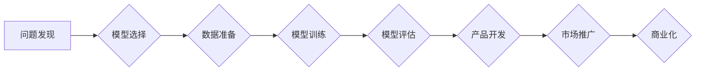

> AI大模型，创业，泡沫，金矿，现状，趋势，未来，应用场景，技术挑战

## 1. 背景介绍

近年来，人工智能（AI）技术突飞猛进，特别是大模型的兴起，为各行各业带来了前所未有的机遇。大模型，是指参数规模庞大、训练数据海量的人工智能模型，能够在自然语言处理、计算机视觉、语音识别等领域展现出强大的能力。

随着大模型技术的不断发展，越来越多的创业者看到了其中的商机，涌入AI大模型创业领域。然而，这个领域也充满了不确定性，有人认为它是一个泡沫，有人则认为它是一个金矿。那么，AI大模型创业究竟是泡沫还是金矿？

## 2. 核心概念与联系

**2.1 AI大模型**

AI大模型是指参数规模庞大、训练数据海量的人工智能模型。其核心特点是：

* **规模化：** 参数数量达到亿级甚至万亿级，拥有海量计算能力。
* **泛化能力强：** 能够在不同任务和领域中表现出良好的性能。
* **可迁移性高：** 可以通过微调的方式应用于不同的下游任务。

**2.2 创业**

创业是指创立新企业，开发新产品或服务，并将其推向市场。

**2.3 联系**

AI大模型创业是指利用AI大模型技术，创立新企业，开发新产品或服务，并将其推向市场。

**2.4  AI大模型创业流程**



## 3. 核心算法原理 & 具体操作步骤

**3.1 算法原理概述**

AI大模型的训练主要基于深度学习算法，其中Transformer模型是目前最主流的架构。Transformer模型的核心思想是利用注意力机制，捕捉文本序列中不同词语之间的关系，从而更好地理解文本的语义。

**3.2 算法步骤详解**

1. **数据预处理:** 将原始文本数据进行清洗、分词、标记等操作，使其能够被模型理解。
2. **模型构建:** 根据任务需求选择合适的Transformer模型架构，并设置模型参数。
3. **模型训练:** 使用训练数据训练模型，通过反向传播算法不断调整模型参数，使其能够准确预测目标输出。
4. **模型评估:** 使用测试数据评估模型的性能，并根据评估结果进行模型调优。
5. **模型部署:** 将训练好的模型部署到生产环境中，用于实际应用。

**3.3 算法优缺点**

**优点:**

* 泛化能力强，能够处理多种自然语言任务。
* 可迁移性高，可以应用于不同的下游任务。
* 性能优异，在许多任务上取得了state-of-the-art的结果。

**缺点:**

* 训练成本高，需要大量的计算资源和训练数据。
* 模型参数量大，部署成本较高。
* 训练过程复杂，需要专业的技术人员进行操作。

**3.4 算法应用领域**

* 自然语言处理：文本分类、情感分析、机器翻译、问答系统等。
* 计算机视觉：图像识别、目标检测、图像生成等。
* 语音识别：语音转文本、语音合成等。
* 其他领域：医疗诊断、金融风险评估、法律文本分析等。

## 4. 数学模型和公式 & 详细讲解 & 举例说明

**4.1 数学模型构建**

Transformer模型的核心是注意力机制，其数学模型可以表示为：

$$
Attention(Q, K, V) = softmax(\frac{QK^T}{\sqrt{d_k}})V
$$

其中：

* $Q$：查询矩阵
* $K$：键矩阵
* $V$：值矩阵
* $d_k$：键向量的维度
* $softmax$：softmax函数

**4.2 公式推导过程**

注意力机制的目的是计算每个词语与其他词语之间的相关性，并根据相关性权重来加权求和，从而得到每个词语的表示。

1. 计算查询矩阵 $Q$ 与键矩阵 $K$ 的点积，并进行归一化处理。
2. 使用 softmax 函数将点积结果转换为概率分布。
3. 将概率分布与值矩阵 $V$ 进行加权求和，得到每个词语的表示。

**4.3 案例分析与讲解**

例如，在翻译句子“The cat sat on the mat”时，注意力机制可以计算每个词语与其他词语之间的相关性，例如，“cat”与“sat”的相关性较高，因为它们描述了同一个动作。

通过注意力机制，模型可以更好地理解句子中的语义关系，从而进行更准确的翻译。

## 5. 项目实践：代码实例和详细解释说明

**5.1 开发环境搭建**

* 操作系统：Ubuntu 20.04
* Python 版本：3.8
* 框架：PyTorch

**5.2 源代码详细实现**

```python
import torch
import torch.nn as nn

class Transformer(nn.Module):
    def __init__(self, vocab_size, embedding_dim, num_heads, num_layers):
        super(Transformer, self).__init__()
        self.embedding = nn.Embedding(vocab_size, embedding_dim)
        self.transformer_layers = nn.ModuleList([
            nn.TransformerEncoderLayer(embedding_dim, num_heads)
            for _ in range(num_layers)
        ])
        self.linear = nn.Linear(embedding_dim, vocab_size)

    def forward(self, x):
        x = self.embedding(x)
        for layer in self.transformer_layers:
            x = layer(x)
        x = self.linear(x)
        return x
```

**5.3 代码解读与分析**

* `__init__` 方法：初始化模型参数，包括词嵌入层、Transformer编码器层和输出层。
* `forward` 方法：定义模型的正向传播过程，将输入序列经过词嵌入层、Transformer编码器层和输出层，最终得到输出序列。

**5.4 运行结果展示**

使用训练好的模型进行预测，并展示预测结果。

## 6. 实际应用场景

**6.1 自然语言处理**

* **机器翻译:** 将一种语言翻译成另一种语言。
* **文本摘要:** 将长文本压缩成短文本。
* **问答系统:** 回答用户提出的问题。

**6.2 计算机视觉**

* **图像识别:** 将图像分类为不同的类别。
* **目标检测:** 在图像中检测到特定目标。
* **图像生成:** 生成新的图像。

**6.3 语音识别**

* **语音转文本:** 将语音转换为文本。
* **语音合成:** 将文本转换为语音。

**6.4 未来应用展望**

* **个性化教育:** 根据学生的学习情况提供个性化的学习内容和辅导。
* **智能医疗:** 辅助医生诊断疾病、制定治疗方案。
* **自动驾驶:** 帮助车辆感知周围环境、做出决策。

## 7. 工具和资源推荐

**7.1 学习资源推荐**

* **书籍:**
    * 《深度学习》
    * 《自然语言处理》
* **在线课程:**
    * Coursera: 深度学习
    * Udacity: 自然语言处理
* **博客:**
    * The Gradient
    * Towards Data Science

**7.2 开发工具推荐**

* **框架:** PyTorch, TensorFlow
* **库:** Hugging Face Transformers
* **平台:** Google Colab, Paperspace Gradient

**7.3 相关论文推荐**

* Attention Is All You Need
* BERT: Pre-training of Deep Bidirectional Transformers for Language Understanding
* GPT-3: Language Models are Few-Shot Learners

## 8. 总结：未来发展趋势与挑战

**8.1 研究成果总结**

近年来，AI大模型取得了显著的进展，在许多领域展现出强大的应用潜力。

**8.2 未来发展趋势**

* 模型规模继续扩大，参数量达到万亿级甚至更高。
* 模型训练效率提升，降低训练成本。
* 模型解释性增强，提高模型可信度。
* 模型应用场景更加广泛，覆盖更多领域。

**8.3 面临的挑战**

* 数据获取和隐私保护
* 计算资源需求
* 模型安全性与可解释性
* 伦理道德问题

**8.4 研究展望**

未来，AI大模型研究将继续朝着更强大、更安全、更可解释的方向发展，为人类社会带来更多福祉。

## 9. 附录：常见问题与解答

**9.1 如何选择合适的AI大模型？**

选择合适的AI大模型需要根据具体的应用场景和需求进行考虑，例如任务类型、数据规模、计算资源等。

**9.2 如何训练自己的AI大模型？**

训练自己的AI大模型需要具备一定的机器学习和深度学习知识，并拥有足够的计算资源和训练数据。

**9.3 如何部署AI大模型？**

部署AI大模型可以采用云端部署、边缘部署等方式，需要根据实际应用场景选择合适的部署方案。


作者：禅与计算机程序设计艺术 / Zen and the Art of Computer Programming 
<end_of_turn>