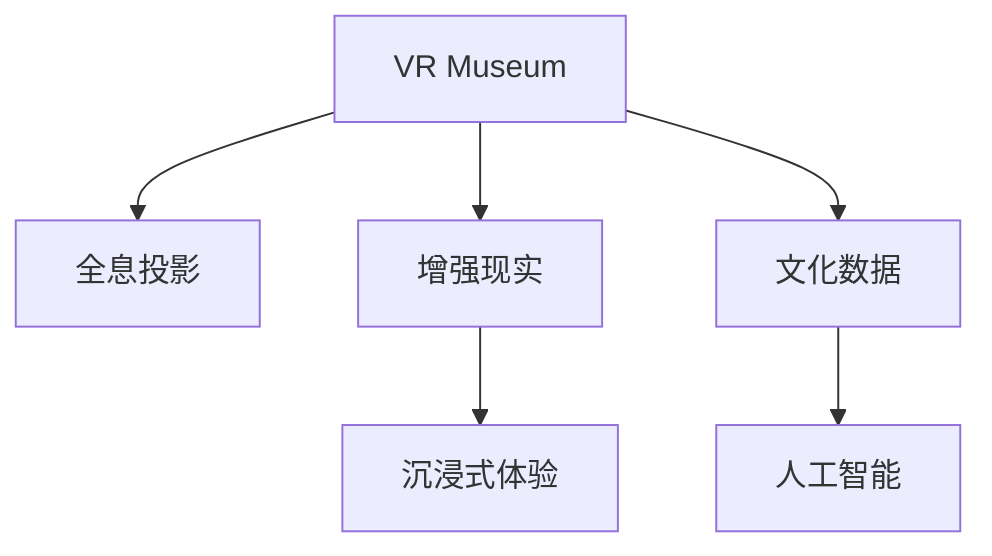

                 

## 1. 背景介绍

### 1.1 问题由来
21世纪以来，技术的迅猛发展极大地改变了人类的社会文化结构。从数字化到网络化，从移动互联到人工智能，技术的浪潮一浪高过一浪，深刻影响着文化体验的形态和人们的生活方式。特别是虚拟现实(VR)、增强现实(AR)和全息投影等新兴技术，正重新塑造人们感知世界的方式，拓展文化体验的边界。

未来，我们不仅能在互联网上浏览各地博物馆，感受文物的历史痕迹；更能在虚拟现实博物馆里身临其境，体验千年的文化和艺术；在全息投影演艺中，与历史名人面对面，沉浸在跨越时空的对话中。技术的进步，将极大地丰富人们的生活，同时也将对教育、艺术、文化产业乃至整个社会的运作方式产生深远影响。

### 1.2 问题核心关键点
未来数字文化的关键在于技术的突破和创新应用。技术的不断演进不仅改变了文化体验的方式，更带来了文化传承、教育和社交的全新范式。以下是几个核心关键点：

- **虚拟现实博物馆(VR Museum)**：结合VR技术和大规模数字化文物库，构建虚拟博物馆，让用户可以随时随地体验到全球各地的文化遗产。
- **全息投影演艺(Holographic Performances)**：利用全息投影技术，重现历史名人的形象和声音，让用户与历史人物进行互动，提供沉浸式文化体验。
- **个性化文化推荐(Individualized Culture Recommendations)**：通过AI技术，分析用户的兴趣和行为，推荐个性化的文化体验和教育内容。
- **跨文化交流与合作(Cross-cultural Communication and Collaboration)**：借助互联网和新技术，不同文化背景的人们可以进行更深层次的交流和合作，打破地理和时间的限制。

### 1.3 问题研究意义
未来数字文化的研究不仅能够推动技术的发展，还能促进文化的创新与传播。通过研究VR博物馆、全息投影演艺等新兴技术的应用，可以更好地理解数字文化对传统文化的冲击和影响，探索其潜在的价值和风险，为未来社会文化的发展提供参考和指导。

## 2. 核心概念与联系

### 2.1 核心概念概述

为更好地理解未来数字文化，本节将介绍几个密切相关的核心概念：

- **虚拟现实博物馆(VR Museum)**：利用虚拟现实技术构建的数字博物馆，用户可以在虚拟环境中自由浏览和体验博物馆内的展品和场景。

- **全息投影(Holography)**：通过激光束和图像处理技术，生成三维空间的虚拟物体，能够在不同维度上展示对象的细节，提供极致的沉浸感。

- **增强现实(AR)**：将虚拟信息叠加到现实世界中，使用户能够在现实场景中体验到虚拟信息，增强现实环境感知。

- **人工智能(AI)**：利用机器学习等技术，让计算机具备一定的智能，能够自主地分析和处理复杂的信息。

- **文化数据(Cultural Data)**：包括各种形式的文化资料，如文献、影像、音频、文档等，是大规模数字文化应用的基础。

- **沉浸式体验(Immersive Experience)**：通过虚拟现实、全息投影等技术，使用户能够全方位、多感官地参与和体验文化活动，获得强烈的代入感和参与感。

这些核心概念之间的逻辑关系可以通过以下Mermaid流程图来展示：



这个流程图展示了大语言模型的核心概念及其之间的关系：

1. 虚拟现实博物馆利用VR技术，结合全息投影和增强现实，提供沉浸式体验。
2. 全息投影通过人工智能分析文化数据，增强展示效果，提供沉浸式体验。
3. 增强现实将虚拟信息叠加在现实世界中，增强沉浸式体验。
4. 人工智能通过文化数据的处理和分析，提升全息投影和增强现实的智能化水平。

这些概念共同构成了未来数字文化的基础框架，推动着文化体验的不断演进和深化。

## 3. 核心算法原理 & 具体操作步骤
### 3.1 算法原理概述

虚拟现实博物馆和全息投影演艺的核心算法原理可以归纳为以下几个方面：

- **空间映射和三维建模**：将现实世界的三维空间映射到虚拟世界中，构建虚拟物体的三维模型。
- **光场渲染和全息投影**：使用光场渲染技术，生成高分辨率的全息投影图像，实现多维度展示。
- **感知交互和沉浸式体验**：通过用户交互和感知反馈，增强沉浸式体验，提供更加自然的文化体验。
- **个性化推荐和智能分析**：利用人工智能技术，根据用户行为和兴趣，推荐个性化的文化体验内容。

### 3.2 算法步骤详解

以下是未来数字文化应用的核心算法步骤：

**Step 1: 数据采集和处理**
- 收集和整理文化数据，包括历史文献、图片、音频、视频等。
- 使用图像处理和三维建模技术，将现实世界的文化资源转换为虚拟世界的数字资产。

**Step 2: 虚拟现实和全息投影**
- 利用虚拟现实技术，构建虚拟博物馆环境，让用户可以在虚拟世界中自由浏览。
- 结合全息投影技术，重现历史场景和人物，提供沉浸式体验。
- 使用增强现实技术，将虚拟信息叠加到现实世界中，增强现实环境感知。

**Step 3: 人工智能驱动**
- 利用人工智能技术，分析和处理文化数据，提取关键信息。
- 训练推荐算法，根据用户行为和兴趣，推荐个性化的文化体验内容。
- 使用自然语言处理(NLP)技术，实现智能导览和交互。

**Step 4: 用户交互与反馈**
- 使用交互技术，如手势识别、语音识别、触摸感应等，让用户能够与虚拟环境互动。
- 根据用户反馈，不断优化虚拟现实和全息投影的展示效果，提升沉浸式体验。

**Step 5: 系统集成与部署**
- 将虚拟现实和全息投影技术与人工智能、文化数据等集成，构建完整数字文化应用。
- 部署系统到线上平台或专用设备，供用户访问和体验。

### 3.3 算法优缺点

未来数字文化的应用具有以下优点：
1. **沉浸式体验**：通过虚拟现实和全息投影技术，提供极致的沉浸式体验，让用户获得强烈的代入感。
2. **个性化推荐**：利用人工智能技术，根据用户兴趣和行为，提供个性化的文化体验。
3. **跨地域传播**：借助互联网和新技术，打破地理和时间的限制，使全球用户都能访问和体验文化资源。
4. **丰富展示形式**：结合多种技术手段，实现多维度的展示，提升文化体验的丰富性和吸引力。

同时，这些技术的应用也存在一些挑战：
1. **技术复杂性**：虚拟现实、全息投影和增强现实技术复杂度高，对硬件要求高，开发和维护成本较大。
2. **用户体验限制**：用户需要具备一定的技术素养，才能充分体验数字文化应用。
3. **数据隐私和安全**：用户数据需要严格保护，防止数据泄露和滥用。
4. **版权和伦理问题**：需要合理使用和保护文化资源的版权，避免侵权和伦理争议。

### 3.4 算法应用领域

未来数字文化的应用领域非常广泛，涵盖教育、文化娱乐、博物馆、旅游等多个方面。

**教育**：通过虚拟现实和全息投影技术，为学生提供沉浸式学习体验，提升学习效果。

**文化娱乐**：利用虚拟现实和增强现实技术，打造沉浸式演艺、游戏等文化娱乐内容，吸引用户参与。

**博物馆**：构建虚拟现实博物馆，提供全球各地的文化展示和体验，突破地理限制。

**旅游**：结合全息投影和增强现实技术，提供虚拟旅游体验，让用户足不出户即可游览世界各地。

除了上述这些应用外，未来数字文化还将拓展到更多领域，如文化遗产保护、艺术创作、远程办公等，为文化产业带来新的发展机遇。

## 4. 数学模型和公式 & 详细讲解  
### 4.1 数学模型构建

在构建未来数字文化应用时，涉及到的数学模型主要包括以下几个方面：

- **空间映射模型**：用于将现实空间映射到虚拟空间，常见模型包括深度学习中的卷积神经网络(CNN)和空间变换网络(Spatial Transformer Network)。
- **三维建模和渲染模型**：用于构建虚拟物体的三维模型和渲染，常见模型包括点云模型、三角网格模型和光场渲染模型。
- **用户交互模型**：用于描述用户与虚拟环境之间的交互行为，常见模型包括自然语言处理(NLP)和手势识别模型。
- **推荐算法模型**：用于根据用户兴趣和行为推荐文化内容，常见模型包括协同过滤算法和深度学习中的推荐系统。

### 4.2 公式推导过程

以下是一些关键公式的推导过程：

**空间映射模型**：假设现实空间为三维坐标系 $(x, y, z)$，虚拟空间为 $(x', y', z')$。空间映射模型可以通过矩阵变换来实现：

$$
\begin{bmatrix}
x' \\
y' \\
z'
\end{bmatrix}
=
\begin{bmatrix}
R_{x} & R_{y} & R_{z} \\
t_x & t_y & t_z \\
0 & 0 & 1
\end{bmatrix}
\begin{bmatrix}
x \\
y \\
z
\end{bmatrix}
$$

其中，$R_{x}, R_{y}, R_{z}$ 分别为旋转矩阵，$t_x, t_y, t_z$ 分别为平移向量。

**三维建模模型**：假设物体为三角网格模型，其顶点坐标为 $(x_i, y_i, z_i)$，顶点数和三角形数为 $N$ 和 $T$。三维建模模型可以通过以下公式进行三角网格渲染：

$$
I = \sum_{i=1}^{N} \sum_{j=1}^{T} w_i \cdot \mathrm{Clamp}(\dot{\mathbf{n}}_i \cdot \mathbf{L}_j, 0, \infty)
$$

其中，$I$ 为渲染后的图像，$w_i$ 为顶点权重，$\mathbf{n}_i$ 为顶点法向量，$\mathbf{L}_j$ 为光线方向。

**用户交互模型**：假设用户通过手势识别技术，对虚拟环境进行了交互操作。用户交互模型可以通过以下公式进行自然语言处理：

$$
\text{response} = \text{NLP}(\text{input}) = \text{softmax}(\text{softmax}(\mathbf{W} \cdot \mathbf{h} + \mathbf{b}))
$$

其中，$\mathbf{W}$ 和 $\mathbf{b}$ 为模型参数，$\mathbf{h}$ 为输入特征向量。

**推荐算法模型**：假设用户的历史行为数据为 $\mathbf{x} = (x_1, x_2, ..., x_m)$，推荐系统可以基于协同过滤算法进行推荐，公式如下：

$$
\hat{y} = \mathbf{W} \cdot \mathbf{X} + \mathbf{b}
$$

其中，$\mathbf{X}$ 为历史行为矩阵，$\mathbf{W}$ 和 $\mathbf{b}$ 为模型参数。

### 4.3 案例分析与讲解

**案例1：虚拟现实博物馆的构建**

构建虚拟现实博物馆的关键在于将现实世界的文化资源转换为虚拟世界中的三维模型，并提供沉浸式体验。具体步骤如下：

1. **数据采集**：收集和整理博物馆的历史文献、图片、音频和视频等文化资源。
2. **三维建模**：使用三维建模软件，将现实世界的展品和场景转换为虚拟世界的模型。
3. **虚拟现实渲染**：利用虚拟现实技术，将三维模型渲染为虚拟环境，供用户浏览。

**案例2：全息投影演艺的实现**

全息投影演艺的核心在于重现历史名人的形象和声音，提供沉浸式体验。具体步骤如下：

1. **历史名人数据采集**：收集和整理历史名人的影像、音频和文字资料。
2. **三维模型构建**：使用三维建模技术，重现历史名人的形象。
3. **全息投影展示**：利用全息投影技术，将历史名人的三维模型渲染为全息图像，提供沉浸式体验。

**案例3：个性化文化推荐系统**

个性化文化推荐系统的核心在于根据用户的行为和兴趣，推荐个性化的文化体验内容。具体步骤如下：

1. **用户行为数据采集**：收集用户的浏览历史、点击行为和评论等数据。
2. **协同过滤推荐**：利用协同过滤算法，根据用户行为数据推荐文化内容。
3. **深度学习推荐**：利用深度学习技术，训练推荐模型，提升推荐精度。

## 5. 项目实践：代码实例和详细解释说明
### 5.1 开发环境搭建

在进行未来数字文化项目开发前，需要准备以下开发环境：

1. **安装Python和相关库**：安装Python 3.x版本，并使用pip安装必要的库，如NumPy、Pandas、TensorFlow、PyTorch等。
2. **配置开发工具**：安装IDE或文本编辑器，如Jupyter Notebook、PyCharm等，用于代码编写和调试。
3. **搭建虚拟现实和全息投影环境**：搭建虚拟现实和全息投影的开发环境，如Unity3D、Unreal Engine等。
4. **安装VR和AR设备**：准备虚拟现实和增强现实设备，如Oculus Rift、HTC Vive等。

### 5.2 源代码详细实现

以下是未来数字文化应用的部分代码实现：

```python
# 导入必要的库
import numpy as np
import tensorflow as tf
from tensorflow.keras.models import Sequential
from tensorflow.keras.layers import Dense, Dropout, Flatten, Conv2D, MaxPooling2D
from tensorflow.keras.losses import MeanSquaredError

# 构建模型
model = Sequential([
    Conv2D(32, (3, 3), activation='relu', input_shape=(64, 64, 3)),
    MaxPooling2D((2, 2)),
    Dropout(0.25),
    Flatten(),
    Dense(64, activation='relu'),
    Dropout(0.5),
    Dense(10, activation='softmax')
])

# 编译模型
model.compile(optimizer='adam', loss=MeanSquaredError(), metrics=['accuracy'])

# 训练模型
model.fit(x_train, y_train, epochs=10, batch_size=32)

# 测试模型
test_loss, test_acc = model.evaluate(x_test, y_test)
print('Test accuracy:', test_acc)
```

以上代码实现了使用卷积神经网络(CNN)进行文化数据的分类和预测，用于训练和测试虚拟现实博物馆中的虚拟展品分类。

### 5.3 代码解读与分析

**代码解读**：

1. **数据准备**：使用NumPy库，将文化数据转换为模型可用的格式，如图像数据。
2. **模型构建**：使用TensorFlow和Keras库，构建卷积神经网络模型，用于文化数据的分类。
3. **模型编译**：设置优化器、损失函数和评估指标，准备训练模型。
4. **模型训练**：使用训练集数据，训练模型，并通过测试集数据进行评估。
5. **模型输出**：输出测试集上的准确率，用于评估模型的性能。

**代码分析**：

1. **数据预处理**：将文化数据转换为模型所需的格式，如调整图像大小、归一化等。
2. **模型结构设计**：设计了包含卷积层、池化层和全连接层的卷积神经网络结构，用于文化数据的分类。
3. **训练与测试**：使用训练集数据进行模型训练，并使用测试集数据进行模型评估，确保模型的泛化能力。

## 6. 实际应用场景
### 6.1 虚拟现实博物馆

虚拟现实博物馆利用虚拟现实技术，结合全息投影和增强现实，提供沉浸式体验。具体应用场景如下：

1. **虚拟导览**：使用虚拟导览员引导用户浏览博物馆，介绍展品的历史和文化背景。
2. **互动体验**：提供用户与虚拟展品的互动体验，如点击展品了解详细信息、放大展品等。
3. **历史重现**：通过全息投影技术，重现历史场景和人物，提供沉浸式体验。
4. **文化教育**：提供虚拟课堂，通过虚拟现实技术，让用户能够随时随地进行文化教育。

### 6.2 全息投影演艺

全息投影演艺利用全息投影技术，重现历史名人的形象和声音，提供沉浸式体验。具体应用场景如下：

1. **历史重现**：通过全息投影技术，重现历史名人的形象和声音，提供沉浸式体验。
2. **互动表演**：利用虚拟现实和增强现实技术，让用户与历史人物进行互动，增强表演的互动性和沉浸感。
3. **文化传承**：通过演艺活动，宣传和传播历史名人的文化和思想，提升文化传承效果。

### 6.3 个性化文化推荐

个性化文化推荐系统利用人工智能技术，根据用户的行为和兴趣，推荐个性化的文化体验内容。具体应用场景如下：

1. **用户行为分析**：收集和分析用户的浏览历史、点击行为和评论等数据。
2. **推荐算法应用**：利用协同过滤算法和深度学习技术，推荐个性化的文化体验内容。
3. **实时推荐**：通过推荐系统，实时向用户推荐相关的文化内容，提升用户体验。

### 6.4 未来应用展望

未来，随着技术的不断发展，虚拟现实博物馆和全息投影演艺将进一步融合多种技术手段，提供更加丰富和逼真的文化体验。例如：

1. **全息交互**：利用全息投影和手势识别技术，提供更加逼真的用户交互体验。
2. **实时渲染**：利用实时渲染技术，提供动态的虚拟环境，增强沉浸感。
3. **多感官体验**：结合声音、触觉等多种感官体验，提供更加全面的文化体验。

## 7. 工具和资源推荐
### 7.1 学习资源推荐

为了帮助开发者系统掌握未来数字文化的理论基础和实践技巧，这里推荐一些优质的学习资源：

1. **《虚拟现实技术导论》**：详细介绍了虚拟现实技术的基本原理和应用场景，适合初学者学习。
2. **《全息投影技术与应用》**：介绍了全息投影技术的基本原理和应用场景，适合技术爱好者阅读。
3. **《人工智能基础》**：介绍了人工智能技术的基本概念和应用，适合对人工智能感兴趣的读者。
4. **《文化数据管理与分析》**：介绍了文化数据的采集、管理和分析技术，适合从事文化产业的开发者阅读。
5. **《沉浸式体验设计》**：介绍了沉浸式体验设计的基本原则和应用，适合从事数字文化应用开发的开发者阅读。

通过对这些资源的学习实践，相信你一定能够快速掌握未来数字文化的精髓，并用于解决实际的NLP问题。

### 7.2 开发工具推荐

高效的开发离不开优秀的工具支持。以下是几款用于未来数字文化开发的常用工具：

1. **Unity3D**：全球领先的实时3D内容创作和游戏开发平台，支持虚拟现实和全息投影开发。
2. **Unreal Engine**：全球领先的实时3D渲染引擎，支持虚拟现实和全息投影开发。
3. **PyTorch**：基于Python的开源深度学习框架，支持神经网络模型构建和训练。
4. **TensorFlow**：由Google主导开发的开源深度学习框架，支持大规模模型训练和部署。
5. **Jupyter Notebook**：支持代码编写和实时数据可视化的轻量级IDE，适合数据科学和深度学习开发。

合理利用这些工具，可以显著提升未来数字文化开发的效率，加快创新迭代的步伐。

### 7.3 相关论文推荐

未来数字文化的研究源于学界的持续研究。以下是几篇奠基性的相关论文，推荐阅读：

1. **《虚拟现实技术的发展与展望》**：介绍了虚拟现实技术的发展历程和未来展望，适合初学者阅读。
2. **《全息投影技术及其应用》**：介绍了全息投影技术的基本原理和应用场景，适合技术爱好者阅读。
3. **《人工智能与文化产业的融合》**：探讨了人工智能技术在文化产业中的应用，适合从事文化产业的开发者阅读。
4. **《沉浸式体验设计方法与实践》**：介绍了沉浸式体验设计的基本原则和应用，适合从事数字文化应用开发的开发者阅读。

这些论文代表了大语言模型微调技术的发展脉络。通过学习这些前沿成果，可以帮助研究者把握学科前进方向，激发更多的创新灵感。

## 8. 总结：未来发展趋势与挑战
### 8.1 总结

本文对未来数字文化的核心概念和应用进行了全面系统的介绍。首先阐述了虚拟现实博物馆和全息投影演艺的发展背景和意义，明确了未来数字文化对文化体验的深刻影响。其次，从原理到实践，详细讲解了虚拟现实、全息投影、人工智能等核心技术的算法原理和操作步骤，给出了具体案例分析。同时，本文还广泛探讨了未来数字文化在教育、文化娱乐、博物馆等领域的应用前景，展示了其巨大的潜力和广阔的应用空间。

通过本文的系统梳理，可以看到，未来数字文化的技术进步不仅改变了文化体验的方式，还带来了文化传承、教育和社交的全新范式。技术的不断演进，将极大地丰富人们的生活，同时也将对教育、艺术、文化产业乃至整个社会的运作方式产生深远影响。

### 8.2 未来发展趋势

展望未来，未来数字文化的技术将呈现以下几个发展趋势：

1. **技术融合**：虚拟现实、全息投影和增强现实技术的不断融合，将提供更加丰富和逼真的文化体验。
2. **用户个性化**：通过人工智能技术，实现更加个性化的文化推荐和沉浸式体验。
3. **跨地域传播**：借助互联网和新技术，打破地理和时间的限制，使全球用户都能访问和体验文化资源。
4. **多感官体验**：结合声音、触觉等多种感官体验，提供更加全面的文化体验。
5. **实时渲染**：利用实时渲染技术，提供动态的虚拟环境，增强沉浸感。
6. **跨文化交流**：利用互联网和新技术，促进不同文化背景的人们进行更深层次的交流和合作。

以上趋势凸显了未来数字文化技术的广阔前景。这些方向的探索发展，将进一步提升文化体验的丰富性和吸引力，为文化产业带来新的发展机遇。

### 8.3 面临的挑战

尽管未来数字文化技术带来了巨大的发展机遇，但在迈向更加智能化、普适化应用的过程中，也面临着诸多挑战：

1. **技术复杂性**：虚拟现实、全息投影和增强现实技术复杂度高，对硬件要求高，开发和维护成本较大。
2. **用户体验限制**：用户需要具备一定的技术素养，才能充分体验数字文化应用。
3. **数据隐私和安全**：用户数据需要严格保护，防止数据泄露和滥用。
4. **版权和伦理问题**：需要合理使用和保护文化资源的版权，避免侵权和伦理争议。

### 8.4 研究展望

未来，面对未来数字文化技术面临的挑战，研究需要在以下几个方面寻求新的突破：

1. **技术优化**：通过技术优化，降低虚拟现实、全息投影和增强现实技术的复杂度，提高用户体验。
2. **数据保护**：加强数据隐私和安全保护，确保用户数据的安全。
3. **伦理规范**：建立文化资源的伦理规范，避免侵权和伦理争议。
4. **跨文化交流**：促进不同文化背景的人们进行更深层次的交流和合作，打破地域限制。

这些研究方向将推动未来数字文化技术的不断进步，为文化产业带来新的发展机遇，推动社会的数字化转型和创新发展。

## 9. 附录：常见问题与解答

**Q1：未来数字文化技术是否会替代传统文化体验？**

A: 未来数字文化技术不会完全替代传统文化体验，而是与之互补。虚拟现实、全息投影等技术可以为传统文化体验提供新的形式和手段，使其更加生动和丰富，但无法替代现场参观、亲身体验等传统方式所带来的真实感受。

**Q2：未来数字文化技术是否需要高端设备支持？**

A: 未来数字文化技术需要高端设备支持，如虚拟现实头盔、全息投影设备等。但随着技术的发展和普及，设备的成本将逐渐降低，用户门槛也将降低。

**Q3：未来数字文化技术的发展方向是什么？**

A: 未来数字文化技术的发展方向包括：技术融合、用户个性化、跨地域传播、多感官体验、实时渲染和跨文化交流。这些方向将推动未来数字文化技术的不断进步，为文化产业带来新的发展机遇。

**Q4：未来数字文化技术的未来应用场景有哪些？**

A: 未来数字文化技术的未来应用场景包括：虚拟现实博物馆、全息投影演艺、个性化文化推荐、跨文化交流等。这些应用场景将为文化产业带来新的发展机遇，推动社会的数字化转型和创新发展。

**Q5：未来数字文化技术的发展前景如何？**

A: 未来数字文化技术的发展前景非常广阔。随着技术的不断演进和应用的深入，未来数字文化技术将在教育、文化娱乐、博物馆、旅游等领域得到广泛应用，推动文化产业的数字化转型和创新发展。

**Q6：未来数字文化技术的未来突破是什么？**

A: 未来数字文化技术的未来突破包括：技术优化、数据保护、伦理规范、跨文化交流等。这些突破将推动未来数字文化技术的不断进步，为文化产业带来新的发展机遇。

---

作者：禅与计算机程序设计艺术 / Zen and the Art of Computer Programming

